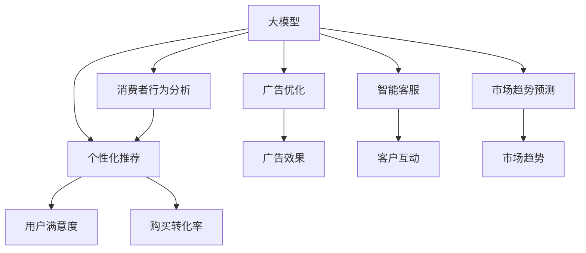

                 

# 大模型时代下的新型营销策略

## 1. 背景介绍

### 1.1 问题由来

随着AI技术的迅猛发展，大数据和深度学习技术在各行各业得到了广泛应用。在营销领域，数据驱动的个性化营销策略已经成为企业核心竞争力之一。大模型技术，如BERT、GPT等，以其强大的自然语言理解和生成能力，为营销策略的优化提供了新的思路和工具。通过构建基于大模型的营销模型，企业可以更好地理解消费者行为，制定精准的市场策略，提升营销效果。

### 1.2 问题核心关键点

大模型在营销策略中的应用，主要集中在以下几个方面：

1. **消费者行为分析**：利用大模型对消费者评论、社交媒体数据等文本数据进行情感分析、实体识别等处理，从中挖掘消费者的需求和偏好。
2. **精准营销推荐**：基于消费者的历史行为数据，使用大模型进行个性化推荐，提升用户满意度，增加转化率。
3. **广告优化**：利用大模型生成优质广告文案和创意，优化广告投放策略，提升广告效果。
4. **客户服务智能**：通过大模型构建智能客服系统，提高客户互动体验，增强品牌粘性。
5. **市场趋势预测**：利用大模型对海量数据进行深度学习，预测市场趋势，指导企业制定更科学的营销策略。

### 1.3 问题研究意义

大模型技术在营销领域的深入应用，可以帮助企业实现以下几个方面的提升：

1. **成本降低**：使用大模型进行消费者行为分析，减少对人工分析的依赖，降低分析成本。
2. **效率提升**：通过自动化处理海量数据，提高分析效率，快速响应市场变化。
3. **效果优化**：基于大数据驱动的个性化推荐和广告优化，提高用户转化率和广告投入产出比。
4. **客户满意增强**：通过智能客服和智能营销，提升客户互动体验，增强品牌忠诚度。
5. **策略科学化**：利用市场趋势预测模型，帮助企业制定更科学、更符合市场趋势的营销策略。

## 2. 核心概念与联系

### 2.1 核心概念概述

为更好地理解大模型在营销策略中的应用，本节将介绍几个关键概念：

- **大模型（Large Models）**：指通过大规模数据预训练获得的深度神经网络模型，如BERT、GPT等。大模型具备强大的自然语言处理能力，能够理解和生成自然语言，广泛应用于文本分类、文本生成、情感分析等任务。

- **消费者行为分析（Consumer Behavior Analysis）**：通过分析消费者的购买历史、社交媒体行为、评论内容等数据，理解消费者的需求和偏好，预测消费者行为，指导企业制定营销策略。

- **个性化推荐（Personalized Recommendation）**：基于消费者的历史行为和偏好，使用大模型进行个性化商品推荐，提升用户满意度，增加购买转化率。

- **广告优化（Ad Optimization）**：利用大模型生成优质广告文案和创意，优化广告投放策略，提高广告效果。

- **智能客服（Smart Customer Service）**：通过构建基于大模型的智能客服系统，提高客户互动体验，增强品牌粘性。

- **市场趋势预测（Market Trend Prediction）**：使用大模型对大量市场数据进行深度学习，预测市场趋势，指导企业制定更科学的营销策略。

这些概念之间的逻辑关系可以通过以下Mermaid流程图来展示：



这个流程图展示了大模型在营销策略中的核心概念及其之间的联系：

1. 大模型通过预训练获得语言处理能力。
2. 基于消费者行为分析，了解消费者需求和偏好。
3. 使用个性化推荐，提升用户满意度和购买转化率。
4. 优化广告投放，提高广告效果。
5. 构建智能客服系统，提升客户互动体验。
6. 预测市场趋势，制定科学营销策略。

这些概念共同构成了基于大模型的营销策略框架，使其能够在各种营销场景下发挥强大的影响力。通过理解这些核心概念，我们可以更好地把握大模型在营销中的应用逻辑。

## 3. 核心算法原理 & 具体操作步骤
### 3.1 算法原理概述

大模型在营销策略中的应用，主要是基于自然语言处理（NLP）和深度学习技术，通过分析消费者的文本数据（如评论、社交媒体等），预测消费者行为，进行个性化推荐和广告优化。其核心思想是利用大模型的语言处理能力，将消费者的非结构化文本数据转化为结构化的信息，用于指导营销决策。

形式化地，假设我们有一个预训练的大模型 $M_{\theta}$，其中 $\theta$ 为大模型的参数。给定消费者的文本数据 $D=\{x_i\}_{i=1}^N$，我们的目标是构建一个模型 $M_{\theta}$，使得在输入文本 $x_i$ 的情况下，输出的预测结果 $y_i$ 尽可能接近真实的消费者行为 $b_i$。因此，我们的目标函数可以定义为：

$$
\min_{\theta} \sum_{i=1}^N \ell(y_i, b_i) + \lambda ||\theta||^2
$$

其中 $\ell(y_i, b_i)$ 为损失函数，衡量预测结果与真实结果的差距；$||\theta||^2$ 为正则化项，防止模型过拟合。

通过梯度下降等优化算法，模型 $M_{\theta}$ 不断更新参数 $\theta$，最小化目标函数，直到收敛。

### 3.2 算法步骤详解

大模型在营销策略中的应用，主要包括以下几个关键步骤：

**Step 1: 准备预训练模型和数据集**
- 选择合适的预训练模型 $M_{\theta}$，如BERT、GPT等。
- 准备消费者行为数据集 $D=\{x_i\}_{i=1}^N$，划分为训练集、验证集和测试集。一般要求数据与预训练数据的分布不要差异过大。

**Step 2: 构建任务适配层**
- 根据任务类型，在预训练模型顶层设计合适的输出层和损失函数。
- 对于消费者行为分析任务，通常使用多标签分类器或回归器，预测消费者的需求和行为。
- 对于个性化推荐任务，通常使用点乘相似度作为推荐模型。

**Step 3: 设置微调超参数**
- 选择合适的优化算法及其参数，如 AdamW、SGD 等，设置学习率、批大小、迭代轮数等。
- 设置正则化技术及强度，包括权重衰减、Dropout、Early Stopping等。
- 确定冻结预训练参数的策略，如仅微调顶层，或全部参数都参与微调。

**Step 4: 执行梯度训练**
- 将训练集数据分批次输入模型，前向传播计算损失函数。
- 反向传播计算参数梯度，根据设定的优化算法和学习率更新模型参数。
- 周期性在验证集上评估模型性能，根据性能指标决定是否触发 Early Stopping。
- 重复上述步骤直到满足预设的迭代轮数或 Early Stopping 条件。

**Step 5: 测试和部署**
- 在测试集上评估微调后模型 $M_{\hat{\theta}}$ 的性能，对比微调前后的精度提升。
- 使用微调后的模型对新消费者进行预测，集成到实际的应用系统中。
- 持续收集新的数据，定期重新微调模型，以适应数据分布的变化。

以上是使用大模型进行消费者行为分析、个性化推荐和广告优化的一般流程。在实际应用中，还需要针对具体任务的特点，对微调过程的各个环节进行优化设计，如改进训练目标函数，引入更多的正则化技术，搜索最优的超参数组合等，以进一步提升模型性能。

### 3.3 算法优缺点

基于大模型在营销策略中的应用，其优点包括：

1. **效率高**：使用大模型进行消费者行为分析和个性化推荐，可以快速处理海量数据，提升分析效率。
2. **效果准**：大模型通过深度学习算法，能够从复杂的文本数据中提取高维特征，提升预测的准确性。
3. **可扩展性**：大模型具有良好的通用性，可以应用于多种营销场景，如消费者行为分析、个性化推荐、广告优化等。

同时，该方法也存在一些局限性：

1. **数据依赖**：大模型需要大量标注数据进行微调，获取高质量标注数据的成本较高。
2. **计算资源需求高**：大模型通常需要高性能的计算资源进行训练，算力成本较高。
3. **可解释性差**：大模型的决策过程通常缺乏可解释性，难以对其推理逻辑进行分析和调试。

尽管存在这些局限性，但就目前而言，基于大模型的营销策略仍然是最主流和高效的方法。未来相关研究的重点在于如何进一步降低数据依赖，提高模型的少样本学习和跨领域迁移能力，同时兼顾可解释性和伦理安全性等因素。

### 3.4 算法应用领域

大模型在营销策略中的应用，已经广泛应用于以下领域：

- **电商平台个性化推荐**：如京东、淘宝等电商平台，利用大模型进行用户行为分析，推荐用户感兴趣的商品。
- **社交媒体智能客服**：如微博、微信等社交平台，利用大模型构建智能客服系统，提高客户互动体验。
- **广告投放优化**：如百度、谷歌等搜索引擎，利用大模型进行广告文案优化和广告投放策略优化。
- **市场趋势预测**：如摩根大通、花旗银行等金融机构，利用大模型进行市场趋势预测，指导投资决策。
- **品牌情感分析**：如可口可乐、耐克等品牌，利用大模型进行品牌情感分析，制定更有效的营销策略。

除了上述这些经典应用外，大模型在营销策略中的应用还在不断创新和拓展，如可控文本生成、对话系统、内容推荐等，为营销领域带来了新的突破。随着大模型技术的不断进步，相信其在营销策略中的应用将更加广泛和深入。

## 4. 数学模型和公式 & 详细讲解  
### 4.1 数学模型构建

本节将使用数学语言对基于大模型的营销策略进行更加严格的刻画。

记预训练大模型为 $M_{\theta}$，其中 $\theta$ 为预训练得到的模型参数。假设消费者行为数据集为 $D=\{x_i\}_{i=1}^N$，其中 $x_i$ 为消费者评论或社交媒体数据。

定义模型 $M_{\theta}$ 在输入文本 $x_i$ 上的预测结果为 $y_i=M_{\theta}(x_i)$，我们的目标是最小化预测结果与真实行为 $b_i$ 的差距，即：

$$
\min_{\theta} \sum_{i=1}^N \ell(y_i, b_i) + \lambda ||\theta||^2
$$

其中 $\ell(y_i, b_i)$ 为损失函数，衡量预测结果与真实行为之间的差距；$||\theta||^2$ 为正则化项，防止模型过拟合。

常见的损失函数包括交叉熵损失、均方误差损失等。在得到损失函数的梯度后，即可带入参数更新公式，完成模型的迭代优化。

### 4.2 公式推导过程

以下我们以二分类任务为例，推导交叉熵损失函数及其梯度的计算公式。

假设模型 $M_{\theta}$ 在输入 $x$ 上的输出为 $\hat{y}=M_{\theta}(x) \in [0,1]$，表示消费者行为为正的概率。真实行为 $b \in \{0,1\}$。则二分类交叉熵损失函数定义为：

$$
\ell(M_{\theta}(x),b) = -[b\log \hat{y} + (1-b)\log (1-\hat{y})]
$$

将其代入总目标函数，得：

$$
\min_{\theta} \sum_{i=1}^N [-\frac{b_i}{N}\log \hat{y_i} - \frac{1-b_i}{N}\log (1-\hat{y_i})] + \lambda ||\theta||^2
$$

根据链式法则，损失函数对参数 $\theta_k$ 的梯度为：

$$
\frac{\partial \mathcal{L}(\theta)}{\partial \theta_k} = -\sum_{i=1}^N \frac{b_i}{N}\frac{\partial \hat{y_i}}{\partial \theta_k} - \frac{1-b_i}{N}\frac{\partial (1-\hat{y_i})}{\partial \theta_k}
$$

其中 $\frac{\partial \hat{y_i}}{\partial \theta_k}$ 可进一步递归展开，利用自动微分技术完成计算。

在得到损失函数的梯度后，即可带入参数更新公式，完成模型的迭代优化。重复上述过程直至收敛，最终得到适应消费者行为分析、个性化推荐和广告优化的最优模型参数 $\theta^*$。

## 5. 项目实践：代码实例和详细解释说明
### 5.1 开发环境搭建

在进行营销策略开发前，我们需要准备好开发环境。以下是使用Python进行PyTorch开发的环境配置流程：

1. 安装Anaconda：从官网下载并安装Anaconda，用于创建独立的Python环境。

2. 创建并激活虚拟环境：
```bash
conda create -n pytorch-env python=3.8 
conda activate pytorch-env
```

3. 安装PyTorch：根据CUDA版本，从官网获取对应的安装命令。例如：
```bash
conda install pytorch torchvision torchaudio cudatoolkit=11.1 -c pytorch -c conda-forge
```

4. 安装PyTorch-lightning：用于模型训练的自动化框架，支持多种分布式训练方式。
```bash
pip install pytorch-lightning
```

5. 安装各类工具包：
```bash
pip install numpy pandas scikit-learn matplotlib tqdm jupyter notebook ipython
```

完成上述步骤后，即可在`pytorch-env`环境中开始营销策略的开发。

### 5.2 源代码详细实现

下面我们以消费者行为分析任务为例，给出使用Transformers库对BERT模型进行微调的PyTorch代码实现。

首先，定义消费者行为分析任务的数据处理函数：

```python
from transformers import BertTokenizer
from torch.utils.data import Dataset
import torch

class ConsumerBehaviorDataset(Dataset):
    def __init__(self, texts, labels, tokenizer, max_len=128):
        self.texts = texts
        self.labels = labels
        self.tokenizer = tokenizer
        self.max_len = max_len
        
    def __len__(self):
        return len(self.texts)
    
    def __getitem__(self, item):
        text = self.texts[item]
        label = self.labels[item]
        
        encoding = self.tokenizer(text, return_tensors='pt', max_length=self.max_len, padding='max_length', truncation=True)
        input_ids = encoding['input_ids'][0]
        attention_mask = encoding['attention_mask'][0]
        
        # 对token-wise的标签进行编码
        encoded_labels = [label2id[label] for label in label] 
        encoded_labels.extend([label2id['O']] * (self.max_len - len(encoded_labels)))
        labels = torch.tensor(encoded_labels, dtype=torch.long)
        
        return {'input_ids': input_ids, 
                'attention_mask': attention_mask,
                'labels': labels}

# 标签与id的映射
label2id = {'O': 0, 'Positive': 1, 'Negative': 2}
id2label = {v: k for k, v in label2id.items()}

# 创建dataset
tokenizer = BertTokenizer.from_pretrained('bert-base-cased')

train_dataset = ConsumerBehaviorDataset(train_texts, train_labels, tokenizer)
dev_dataset = ConsumerBehaviorDataset(dev_texts, dev_labels, tokenizer)
test_dataset = ConsumerBehaviorDataset(test_texts, test_labels, tokenizer)
```

然后，定义模型和优化器：

```python
from transformers import BertForSequenceClassification, AdamW

model = BertForSequenceClassification.from_pretrained('bert-base-cased', num_labels=len(label2id))

optimizer = AdamW(model.parameters(), lr=2e-5)
```

接着，定义训练和评估函数：

```python
from torch.utils.data import DataLoader
from tqdm import tqdm
from sklearn.metrics import classification_report

device = torch.device('cuda') if torch.cuda.is_available() else torch.device('cpu')
model.to(device)

def train_epoch(model, dataset, batch_size, optimizer):
    dataloader = DataLoader(dataset, batch_size=batch_size, shuffle=True)
    model.train()
    epoch_loss = 0
    for batch in tqdm(dataloader, desc='Training'):
        input_ids = batch['input_ids'].to(device)
        attention_mask = batch['attention_mask'].to(device)
        labels = batch['labels'].to(device)
        model.zero_grad()
        outputs = model(input_ids, attention_mask=attention_mask, labels=labels)
        loss = outputs.loss
        epoch_loss += loss.item()
        loss.backward()
        optimizer.step()
    return epoch_loss / len(dataloader)

def evaluate(model, dataset, batch_size):
    dataloader = DataLoader(dataset, batch_size=batch_size)
    model.eval()
    preds, labels = [], []
    with torch.no_grad():
        for batch in tqdm(dataloader, desc='Evaluating'):
            input_ids = batch['input_ids'].to(device)
            attention_mask = batch['attention_mask'].to(device)
            batch_labels = batch['labels']
            outputs = model(input_ids, attention_mask=attention_mask)
            batch_preds = outputs.logits.argmax(dim=2).to('cpu').tolist()
            batch_labels = batch_labels.to('cpu').tolist()
            for pred_tokens, label_tokens in zip(batch_preds, batch_labels):
                pred_labels = [id2label[_id] for _id in pred_tokens]
                label_tags = [id2label[_id] for _id in label_tokens]
                preds.append(pred_labels[:len(label_tags)])
                labels.append(label_tags)
                
    print(classification_report(labels, preds))
```

最后，启动训练流程并在测试集上评估：

```python
epochs = 5
batch_size = 16

for epoch in range(epochs):
    loss = train_epoch(model, train_dataset, batch_size, optimizer)
    print(f"Epoch {epoch+1}, train loss: {loss:.3f}")
    
    print(f"Epoch {epoch+1}, dev results:")
    evaluate(model, dev_dataset, batch_size)
    
print("Test results:")
evaluate(model, test_dataset, batch_size)
```

以上就是使用PyTorch对BERT进行消费者行为分析任务微调的完整代码实现。可以看到，得益于Transformers库的强大封装，我们可以用相对简洁的代码完成BERT模型的加载和微调。

### 5.3 代码解读与分析

让我们再详细解读一下关键代码的实现细节：

**ConsumerBehaviorDataset类**：
- `__init__`方法：初始化文本、标签、分词器等关键组件。
- `__len__`方法：返回数据集的样本数量。
- `__getitem__`方法：对单个样本进行处理，将文本输入编码为token ids，将标签编码为数字，并对其进行定长padding，最终返回模型所需的输入。

**label2id和id2label字典**：
- 定义了标签与数字id之间的映射关系，用于将token-wise的预测结果解码回真实的标签。

**训练和评估函数**：
- 使用PyTorch的DataLoader对数据集进行批次化加载，供模型训练和推理使用。
- 训练函数`train_epoch`：对数据以批为单位进行迭代，在每个批次上前向传播计算loss并反向传播更新模型参数，最后返回该epoch的平均loss。
- 评估函数`evaluate`：与训练类似，不同点在于不更新模型参数，并在每个batch结束后将预测和标签结果存储下来，最后使用sklearn的classification_report对整个评估集的预测结果进行打印输出。

**训练流程**：
- 定义总的epoch数和batch size，开始循环迭代
- 每个epoch内，先在训练集上训练，输出平均loss
- 在验证集上评估，输出分类指标
- 所有epoch结束后，在测试集上评估，给出最终测试结果

可以看到，PyTorch配合Transformers库使得BERT微调的代码实现变得简洁高效。开发者可以将更多精力放在数据处理、模型改进等高层逻辑上，而不必过多关注底层的实现细节。

当然，工业级的系统实现还需考虑更多因素，如模型的保存和部署、超参数的自动搜索、更灵活的任务适配层等。但核心的微调范式基本与此类似。

## 6. 实际应用场景
### 6.1 电商平台个性化推荐

电商平台利用大模型进行消费者行为分析，获取用户的购买历史、浏览记录等数据，使用大模型进行个性化推荐，提升用户满意度，增加购买转化率。例如，京东、淘宝等电商平台通过大模型分析用户行为，推荐用户感兴趣的商品，显著提高了销售转化率。

### 6.2 社交媒体智能客服

社交媒体平台如微博、微信等利用大模型构建智能客服系统，提高客户互动体验，增强品牌粘性。例如，京东的智能客服系统通过大模型分析用户咨询，自动回答常见问题，显著提升了客户满意度。

### 6.3 广告投放优化

搜索引擎如百度、谷歌等利用大模型优化广告文案和广告投放策略，提升广告效果。例如，谷歌通过大模型优化广告文案，显著提高了广告的点击率和转化率。

### 6.4 市场趋势预测

金融机构如摩根大通、花旗银行等利用大模型进行市场趋势预测，指导投资决策。例如，摩根大通利用大模型预测股市趋势，成功避免了多次市场暴跌。

### 6.5 品牌情感分析

品牌如可口可乐、耐克等利用大模型进行品牌情感分析，制定更有效的营销策略。例如，耐克通过大模型分析社交媒体数据，了解用户对品牌的情感倾向，优化广告策略，提升品牌形象。

## 7. 工具和资源推荐
### 7.1 学习资源推荐

为了帮助开发者系统掌握大模型在营销策略中的应用，这里推荐一些优质的学习资源：

1. 《Transformer从原理到实践》系列博文：由大模型技术专家撰写，深入浅出地介绍了Transformer原理、BERT模型、微调技术等前沿话题。

2. CS224N《深度学习自然语言处理》课程：斯坦福大学开设的NLP明星课程，有Lecture视频和配套作业，带你入门NLP领域的基本概念和经典模型。

3. 《Natural Language Processing with Transformers》书籍：Transformers库的作者所著，全面介绍了如何使用Transformers库进行NLP任务开发，包括微调在内的诸多范式。

4. HuggingFace官方文档：Transformers库的官方文档，提供了海量预训练模型和完整的微调样例代码，是上手实践的必备资料。

5. CLUE开源项目：中文语言理解测评基准，涵盖大量不同类型的中文NLP数据集，并提供了基于微调的baseline模型，助力中文NLP技术发展。

通过对这些资源的学习实践，相信你一定能够快速掌握大模型在营销策略中的应用精髓，并用于解决实际的营销问题。
###  7.2 开发工具推荐

高效的开发离不开优秀的工具支持。以下是几款用于大模型营销策略开发的常用工具：

1. PyTorch：基于Python的开源深度学习框架，灵活动态的计算图，适合快速迭代研究。大部分预训练语言模型都有PyTorch版本的实现。

2. TensorFlow：由Google主导开发的开源深度学习框架，生产部署方便，适合大规模工程应用。同样有丰富的预训练语言模型资源。

3. Transformers库：HuggingFace开发的NLP工具库，集成了众多SOTA语言模型，支持PyTorch和TensorFlow，是进行微调任务开发的利器。

4. Weights & Biases：模型训练的实验跟踪工具，可以记录和可视化模型训练过程中的各项指标，方便对比和调优。与主流深度学习框架无缝集成。

5. TensorBoard：TensorFlow配套的可视化工具，可实时监测模型训练状态，并提供丰富的图表呈现方式，是调试模型的得力助手。

6. Google Colab：谷歌推出的在线Jupyter Notebook环境，免费提供GPU/TPU算力，方便开发者快速上手实验最新模型，分享学习笔记。

合理利用这些工具，可以显著提升大模型在营销策略开发中的效率，加快创新迭代的步伐。

### 7.3 相关论文推荐

大模型在营销策略的发展源于学界的持续研究。以下是几篇奠基性的相关论文，推荐阅读：

1. Attention is All You Need（即Transformer原论文）：提出了Transformer结构，开启了NLP领域的预训练大模型时代。

2. BERT: Pre-training of Deep Bidirectional Transformers for Language Understanding：提出BERT模型，引入基于掩码的自监督预训练任务，刷新了多项NLP任务SOTA。

3. Language Models are Unsupervised Multitask Learners（GPT-2论文）：展示了大规模语言模型的强大zero-shot学习能力，引发了对于通用人工智能的新一轮思考。

4. Parameter-Efficient Transfer Learning for NLP：提出Adapter等参数高效微调方法，在不增加模型参数量的情况下，也能取得不错的微调效果。

5. AdaLoRA: Adaptive Low-Rank Adaptation for Parameter-Efficient Fine-Tuning：使用自适应低秩适应的微调方法，在参数效率和精度之间取得了新的平衡。

这些论文代表了大模型在营销策略的应用发展脉络。通过学习这些前沿成果，可以帮助研究者把握学科前进方向，激发更多的创新灵感。

## 8. 总结：未来发展趋势与挑战

### 8.1 总结

本文对基于大模型的营销策略进行了全面系统的介绍。首先阐述了大模型和微调技术在营销策略中的应用背景和意义，明确了其在消费者行为分析、个性化推荐、广告优化等方面的独特价值。其次，从原理到实践，详细讲解了营销模型构建、训练和评估的数学模型和算法步骤，给出了营销策略开发的完整代码实例。同时，本文还广泛探讨了营销模型在电商平台、社交媒体、广告投放、市场趋势预测、品牌情感分析等多个行业领域的应用前景，展示了营销模型的巨大潜力。

通过本文的系统梳理，可以看到，基于大模型的营销策略在大数据分析、个性化推荐、广告优化等方面已经展示了其强大的价值。受益于大规模语料的预训练和深度学习算法的优化，营销模型在处理海量数据、预测消费者行为、提升广告效果等方面具备独特的优势。未来，随着大模型技术的不断进步，基于大模型的营销策略必将进一步提升企业的市场竞争力，推动市场营销的智能化发展。

### 8.2 未来发展趋势

展望未来，基于大模型的营销策略将呈现以下几个发展趋势：

1. **数据驱动的营销策略**：随着大模型的发展，越来越多的企业将利用大模型进行消费者行为分析和预测，制定更加科学、精准的营销策略。

2. **实时营销优化**：利用大模型的快速计算能力，实现实时数据处理和策略优化，提升营销效果。

3. **跨领域知识融合**：通过大模型融合跨领域的知识，如社会媒体、金融数据等，提升营销模型的泛化能力和应用范围。

4. **多模态营销**：利用大模型处理文本、图像、视频等多模态数据，提升营销信息的丰富性和覆盖面。

5. **个性化推荐系统**：基于大模型进行个性化推荐，提升用户满意度和转化率，成为电商、社交媒体等平台的核心竞争力。

6. **情感分析与品牌管理**：利用大模型进行品牌情感分析，制定更加有效的品牌管理策略，提升品牌形象和市场影响力。

以上趋势凸显了大模型在营销策略中的广泛应用前景。这些方向的探索发展，必将进一步提升企业的市场竞争力，推动市场营销的智能化发展。

### 8.3 面临的挑战

尽管大模型在营销策略中的应用已经取得了显著成效，但在迈向更加智能化、普适化应用的过程中，仍面临诸多挑战：

1. **数据隐私问题**：营销策略中涉及大量用户隐私数据，如何保护数据隐私，防止数据泄露，是营销模型应用中必须面对的问题。

2. **模型可解释性不足**：大模型通常被视为“黑盒”系统，难以解释其内部工作机制和决策逻辑，这可能会影响模型的可信度和应用范围。

3. **计算资源需求高**：大模型通常需要高性能的计算资源进行训练和推理，算力成本较高，如何降低计算资源需求，提升模型训练和推理的效率，将是未来的重要研究方向。

4. **模型鲁棒性不足**：在面对新数据时，大模型可能会出现过拟合或泛化性能下降的问题，如何提高模型的鲁棒性，确保模型在不同数据分布上的表现稳定，也是一大挑战。

5. **伦理和安全问题**：营销模型可能会因为数据偏见或恶意数据导致模型输出有害信息，如何确保模型输出的伦理和安全，避免对用户和社会造成负面影响，需要从数据、模型、应用等多方面进行综合考虑。

尽管存在这些挑战，但大模型在营销策略中的应用已经展现出巨大的潜力和前景。未来相关研究需要在数据隐私保护、模型可解释性、计算资源优化、模型鲁棒性、伦理安全性等多个方面进行深入探索，以推动大模型在营销领域更广泛的应用。

### 8.4 研究展望

未来，大模型在营销策略中的应用将继续深化和发展，研究方向将更加多样化：

1. **多模态数据分析**：利用大模型处理文本、图像、视频等多模态数据，提升营销信息的丰富性和覆盖面。

2. **跨领域知识融合**：通过大模型融合跨领域的知识，提升营销模型的泛化能力和应用范围。

3. **实时营销优化**：利用大模型的快速计算能力，实现实时数据处理和策略优化，提升营销效果。

4. **数据隐私保护**：研究如何在大模型应用中保护用户隐私，防止数据泄露，确保数据安全。

5. **模型可解释性**：研究如何提高大模型的可解释性，使其更加透明和可信，增强用户对模型的信任度。

6. **模型鲁棒性**：研究如何提高大模型的鲁棒性，确保模型在不同数据分布上的表现稳定。

7. **伦理和安全**：研究如何确保大模型输出的伦理和安全，避免对用户和社会造成负面影响。

这些研究方向将为基于大模型的营销策略带来新的突破，推动营销模型的智能化、普适化和安全性发展。未来，随着大模型技术的不断进步和深入应用，基于大模型的营销策略必将进一步提升企业的市场竞争力，推动市场营销的智能化发展。

## 9. 附录：常见问题与解答

**Q1：大模型在营销策略中是否适用于所有行业？**

A: 大模型在营销策略中的应用具有广泛适用性，但不同的行业可能需要根据具体应用场景进行调整。例如，在电商、社交媒体、广告投放等领域，大模型已经展现出显著的效果。而在一些特定的领域，如医疗、金融等，可能需要更多的数据预处理和领域特定知识，以提升模型的效果。

**Q2：大模型如何处理数据隐私问题？**

A: 数据隐私保护是大模型应用中的重要问题。为了保护用户隐私，可以采用差分隐私、联邦学习等技术，限制数据泄露风险。同时，可以使用匿名化技术，如数据脱敏、数据扰动等，保护用户的个人信息。

**Q3：大模型在实时营销优化中面临哪些挑战？**

A: 实时营销优化是大模型在营销策略中面临的一大挑战。为了实现实时优化，需要处理海量数据，提高计算速度，降低延迟。这要求大模型具备高效的数据处理能力和实时计算能力。同时，需要优化模型的计算图，减少前向传播和反向传播的资源消耗，提升实时性。

**Q4：如何提高大模型的可解释性？**

A: 提高大模型的可解释性是当前研究的热点问题。一种方法是使用可解释的模型架构，如LIME、SHAP等，将模型的输出解释为简单的规则或特征权重。另一种方法是使用模型压缩技术，将大模型压缩为小的模型，并结合解释工具，解释模型的决策过程。

**Q5：如何降低大模型的计算资源需求？**

A: 降低大模型的计算资源需求是未来研究的一个重要方向。一种方法是使用参数高效微调方法，如Adapter、LoRA等，只更新模型的少量参数，减少计算资源消耗。另一种方法是优化模型架构，如剪枝、量化等，减少模型的参数量和计算复杂度。

通过这些方法的探索和应用，可以进一步提升大模型在营销策略中的性能和实用性，推动大模型技术在更广泛的领域落地应用。

