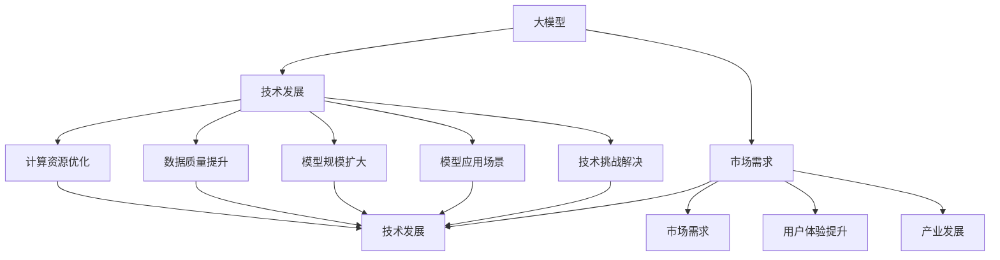

                 

# 大模型的技术发展与市场需求

> 关键词：
- 大模型
- 技术发展
- 市场需求
- 人工智能
- 深度学习
- 数据科学
- 自然语言处理

## 1. 背景介绍

### 1.1 问题由来
在过去的十年里，人工智能（AI）技术迅猛发展，其中大模型（Large Models）的应用尤为引人注目。大模型，特别是深度学习模型，已经成为现代AI的核心工具。这些模型能够处理复杂的数据，并且在大规模数据集上进行训练，进而能够实现高精度的预测和决策。然而，随着模型规模的不断扩大，训练和维护这些模型的成本也越来越高，并且对计算资源的要求也越来越高。

### 1.2 问题核心关键点
目前，大模型的技术发展与市场需求之间存在着紧密的联系。技术发展推动了市场的扩展，而市场需求则驱动了技术创新的不断进行。对于大模型的技术发展来说，以下几个关键点需要特别注意：

- **计算资源**：大模型的训练和推理需要大量的计算资源，包括高性能计算集群、GPU等。
- **数据质量**：大模型需要大量的高质量数据进行训练，数据的获取和标注往往是一个瓶颈。
- **模型规模**：模型规模的增加带来了更高的精度和更好的泛化能力，但同时也增加了训练和推理的难度。
- **模型应用**：模型需要被有效地应用于各种实际场景，包括自然语言处理、计算机视觉、推荐系统等。
- **技术挑战**：模型训练中的过拟合、梯度消失等问题，以及如何提高模型的可解释性等。

### 1.3 问题研究意义
研究大模型的技术发展与市场需求之间的联系，对于推动AI技术在实际场景中的应用具有重要的意义：

1. **促进技术进步**：了解市场需求可以指导技术的研发方向，推动技术的创新和进步。
2. **优化资源配置**：市场需求可以帮助更好地配置计算资源，降低成本。
3. **加速应用落地**：市场需求指导模型应用场景，加速AI技术的实际应用。
4. **提高用户体验**：了解市场需求可以提升AI系统的用户体验，增强用户粘性。
5. **推动产业发展**：市场需求可以推动AI产业的发展，带动相关产业的崛起。

## 2. 核心概念与联系

### 2.1 核心概念概述

要全面理解大模型的技术发展与市场需求之间的关系，需要了解以下几个核心概念：

- **大模型**：指能够处理大规模数据并具有高精度的模型，如BERT、GPT-3、XLNet等。
- **技术发展**：指模型结构的改进、训练算法的研究、计算资源的优化等。
- **市场需求**：指模型在实际应用场景中的需求，如自然语言处理、计算机视觉、推荐系统等。
- **技术-市场需求联系**：指技术发展如何响应市场需求，市场需求如何推动技术进步。

### 2.2 核心概念原理和架构的 Mermaid 流程图(Mermaid 流程节点中不要有括号、逗号等特殊字符)



这个流程图展示了大模型技术发展与市场需求之间的相互作用关系。技术发展推动了市场需求，而市场需求又反过来驱动技术进步。

## 3. 核心算法原理 & 具体操作步骤
### 3.1 算法原理概述

大模型的核心算法原理主要基于深度学习，特别是神经网络模型。这些模型通过多层非线性变换，可以学习到复杂的特征表示，从而实现对数据的有效处理和预测。在大模型的训练过程中，通常采用反向传播算法（Backpropagation）来更新模型参数，以最小化预测误差。

### 3.2 算法步骤详解

大模型的训练一般包括以下几个关键步骤：

**Step 1: 数据预处理**
- 数据清洗和预处理，包括去除噪声、标准化、分词等。
- 将数据划分为训练集、验证集和测试集。

**Step 2: 模型构建**
- 选择合适的模型架构，如卷积神经网络（CNN）、循环神经网络（RNN）、Transformer等。
- 设置模型的超参数，如学习率、批量大小、迭代次数等。

**Step 3: 模型训练**
- 使用训练集对模型进行训练，不断调整模型参数以最小化损失函数。
- 使用验证集对模型进行评估，防止过拟合。

**Step 4: 模型评估**
- 使用测试集对模型进行测试，评估模型性能。
- 根据测试结果调整模型参数或超参数。

**Step 5: 模型部署**
- 将模型导出为可部署格式，如TensorFlow模型或PyTorch模型。
- 将模型部署到生产环境，提供API服务。

### 3.3 算法优缺点

大模型的优点包括：

- **高精度**：大模型通常具有较高的精度，特别是在处理大规模数据时。
- **泛化能力强**：大模型能够学习到复杂的特征表示，具有较好的泛化能力。
- **可扩展性强**：大模型可以很容易地扩展到多个应用场景，如自然语言处理、计算机视觉等。

大模型的缺点包括：

- **计算资源消耗高**：大模型的训练和推理需要大量的计算资源，包括高性能计算集群、GPU等。
- **数据需求量大**：大模型的训练需要大量的高质量数据，数据的获取和标注往往是一个瓶颈。
- **模型复杂度高**：大模型的结构复杂，难以理解和调试。
- **易过拟合**：大模型容易过拟合，尤其是在训练数据不足的情况下。

### 3.4 算法应用领域

大模型已经在多个领域得到了广泛的应用，如自然语言处理（NLP）、计算机视觉（CV）、推荐系统、语音识别等。以下是几个典型应用领域：

**自然语言处理（NLP）**：包括文本分类、机器翻译、情感分析、问答系统等。大模型可以学习到复杂的语言表示，从而在这些任务上取得优异的性能。

**计算机视觉（CV）**：包括图像分类、物体检测、图像生成等。大模型可以学习到复杂的视觉特征，从而在这些任务上取得优异的性能。

**推荐系统**：包括电商推荐、内容推荐、广告推荐等。大模型可以学习到用户的行为和兴趣，从而在这些任务上取得优异的性能。

## 4. 数学模型和公式 & 详细讲解 & 举例说明

### 4.1 数学模型构建

大模型的数学模型构建通常基于深度学习，特别是神经网络模型。以下是一个典型的卷积神经网络（CNN）的数学模型构建：

**输入层**：输入数据 $x$。

**卷积层**：卷积核 $w$，通过卷积操作得到特征图 $f$。

**激活层**：非线性激活函数 $\sigma$，对特征图进行处理。

**池化层**：池化操作，对特征图进行降维。

**全连接层**：将特征图展开为向量，通过全连接层进行分类或回归。

### 4.2 公式推导过程

卷积神经网络（CNN）的公式推导过程如下：

$$
f(x) = \sigma(\sum_k w_k * g(x, \theta_k) + b_k)
$$

其中，$g(x, \theta_k)$ 表示卷积核在输入数据 $x$ 上的卷积操作，$\sigma$ 表示激活函数，$b_k$ 表示偏置项。

### 4.3 案例分析与讲解

以下是一个使用卷积神经网络（CNN）进行图像分类的例子：

- **输入**：一张28x28的灰度图像。
- **卷积层**：使用3x3的卷积核，步长为1，padding为0，得到特征图。
- **激活层**：使用ReLU激活函数。
- **池化层**：使用2x2的最大池化操作，步长为2。
- **全连接层**：将特征图展开为向量，通过全连接层进行分类。

## 5. 项目实践：代码实例和详细解释说明
### 5.1 开发环境搭建

在进行大模型项目实践前，我们需要准备好开发环境。以下是使用Python进行PyTorch开发的环境配置流程：

1. 安装Anaconda：从官网下载并安装Anaconda，用于创建独立的Python环境。

2. 创建并激活虚拟环境：
```bash
conda create -n pytorch-env python=3.8 
conda activate pytorch-env
```

3. 安装PyTorch：根据CUDA版本，从官网获取对应的安装命令。例如：
```bash
conda install pytorch torchvision torchaudio cudatoolkit=11.1 -c pytorch -c conda-forge
```

4. 安装Transformers库：
```bash
pip install transformers
```

5. 安装各类工具包：
```bash
pip install numpy pandas scikit-learn matplotlib tqdm jupyter notebook ipython
```

完成上述步骤后，即可在`pytorch-env`环境中开始项目实践。

### 5.2 源代码详细实现

以下是一个使用PyTorch实现卷积神经网络（CNN）进行图像分类的例子。

```python
import torch
import torch.nn as nn
import torch.optim as optim
from torch.utils.data import DataLoader
from torchvision import datasets, transforms

# 定义模型
class CNN(nn.Module):
    def __init__(self):
        super(CNN, self).__init__()
        self.conv1 = nn.Conv2d(1, 32, 3, 1)
        self.conv2 = nn.Conv2d(32, 64, 3, 1)
        self.pool = nn.MaxPool2d(2, 2)
        self.fc1 = nn.Linear(64 * 14 * 14, 128)
        self.fc2 = nn.Linear(128, 10)

    def forward(self, x):
        x = self.pool(torch.relu(self.conv1(x)))
        x = self.pool(torch.relu(self.conv2(x)))
        x = x.view(-1, 64 * 14 * 14)
        x = torch.relu(self.fc1(x))
        x = self.fc2(x)
        return x

# 加载数据集
transform = transforms.Compose([
    transforms.ToTensor(),
    transforms.Normalize((0.5,), (0.5,))
])
train_dataset = datasets.MNIST('data', train=True, download=True, transform=transform)
test_dataset = datasets.MNIST('data', train=False, download=True, transform=transform)
train_loader = DataLoader(train_dataset, batch_size=64, shuffle=True)
test_loader = DataLoader(test_dataset, batch_size=64, shuffle=False)

# 定义模型和优化器
model = CNN()
optimizer = optim.Adam(model.parameters(), lr=0.001)

# 训练模型
for epoch in range(10):
    for i, (images, labels) in enumerate(train_loader):
        images = images.to(device)
        labels = labels.to(device)
        optimizer.zero_grad()
        outputs = model(images)
        loss = nn.CrossEntropyLoss()(outputs, labels)
        loss.backward()
        optimizer.step()
        if (i+1) % 100 == 0:
            print(f'Epoch [{epoch+1}/{10}], Step [{i+1}/{len(train_loader)}], Loss: {loss.item():.4f}')
    
    # 评估模型
    with torch.no_grad():
        correct = 0
        total = 0
        for images, labels in test_loader:
            images = images.to(device)
            labels = labels.to(device)
            outputs = model(images)
            _, predicted = torch.max(outputs.data, 1)
            total += labels.size(0)
            correct += (predicted == labels).sum().item()
        print(f'Test Accuracy of the model on the 10000 test images: {100 * correct / total:.2f}%')
```

### 5.3 代码解读与分析

让我们再详细解读一下关键代码的实现细节：

**CNN类**：
- `__init__`方法：定义模型结构，包括卷积层、激活层、池化层和全连接层。
- `forward`方法：定义前向传播过程。

**数据加载**：
- 使用`torchvision.datasets.MNIST`加载MNIST数据集。
- 定义数据增强操作，包括Tensor化和归一化。

**模型训练**：
- 定义模型和优化器。
- 使用`nn.CrossEntropyLoss`作为损失函数。
- 使用`torch.utils.data.DataLoader`加载数据。
- 在每个epoch内，对训练集进行迭代训练，并在测试集上评估模型性能。

## 6. 实际应用场景
### 6.1 智能推荐系统

大模型在智能推荐系统中发挥着重要的作用。通过分析用户的历史行为数据，大模型可以学习到用户的兴趣和偏好，从而在推荐系统中提供个性化的内容推荐。

在实践中，可以使用大模型对用户的行为数据进行建模，并预测用户对不同内容的兴趣。例如，可以使用大模型对用户的历史点击、购买、浏览等行为进行建模，预测用户对未来内容的兴趣。同时，可以将大模型的输出与用户画像、商品属性等特征进行融合，生成个性化的推荐结果。

### 6.2 智能客服

大模型在智能客服系统中也有着广泛的应用。通过分析用户的问题和语境，大模型可以自动生成智能回复，提升客服系统的响应速度和准确性。

在实践中，可以使用大模型对用户的查询进行自然语言理解，并匹配最佳答案模板。例如，可以使用大模型对用户的问题进行意图识别，然后根据意图生成相应的回复。同时，可以将大模型与知识库、FAQ等辅助信息结合，提升系统的智能化水平。

### 6.3 金融风控

大模型在金融风控领域也有着重要的应用。通过分析用户的信用记录、交易行为等数据，大模型可以评估用户的信用风险，从而实现更精准的风险控制。

在实践中，可以使用大模型对用户的信用记录、交易行为等数据进行建模，预测用户的信用风险。例如，可以使用大模型对用户的信用记录进行建模，预测用户的违约概率。同时，可以将大模型的输出与信用评分、贷款额度等辅助信息结合，生成更精准的信用评估结果。

### 6.4 未来应用展望

随着大模型的不断发展和应用，未来其在各个领域的应用前景将更加广阔。以下是几个未来可能的应用方向：

**医疗健康**：大模型可以应用于医学影像分析、病历分析、药物研发等领域，提升医疗服务的智能化水平，辅助医生诊疗，加速新药开发进程。

**智慧城市**：大模型可以应用于城市事件监测、舆情分析、应急指挥等环节，提高城市管理的自动化和智能化水平，构建更安全、高效的未来城市。

**教育**：大模型可以应用于作业批改、学情分析、知识推荐等领域，因材施教，促进教育公平，提高教学质量。

**媒体娱乐**：大模型可以应用于内容生成、推荐、广告投放等领域，提升用户的体验，提高内容的质量和效果。

## 7. 工具和资源推荐
### 7.1 学习资源推荐

为了帮助开发者系统掌握大模型的技术发展和市场需求，这里推荐一些优质的学习资源：

1. **深度学习课程**：如斯坦福大学的CS231n课程、斯坦福大学的CS224n课程，可以系统学习深度学习的基本概念和应用。
2. **大模型库**：如TensorFlow Hub、Hugging Face的Transformers库，提供了大量预训练模型和样例代码，是学习和实践大模型的重要资源。
3. **开源项目**：如PyTorch Lightning、TensorFlow Extended（TFX），提供了高效的模型训练和部署框架，可以加速模型开发和部署。
4. **论文和书籍**：如《Deep Learning》、《Hands-On Machine Learning with Scikit-Learn, Keras, and TensorFlow》，可以深入了解深度学习的原理和应用。
5. **社区和论坛**：如GitHub、Stack Overflow、Kaggle，可以获取最新的技术动态和社区讨论，解决实际问题。

通过对这些资源的学习实践，相信你一定能够全面掌握大模型的技术发展和市场需求，并用于解决实际的AI问题。

### 7.2 开发工具推荐

高效的开发离不开优秀的工具支持。以下是几款用于大模型开发和应用开发的常用工具：

1. **TensorFlow**：Google开发的高性能深度学习框架，生产部署方便，适合大规模工程应用。
2. **PyTorch**：Facebook开发的开源深度学习框架，灵活动态的计算图，适合快速迭代研究。
3. **Hugging Face Transformers**：提供了大量预训练模型和接口，方便模型开发和微调。
4. **Jupyter Notebook**：强大的交互式开发环境，方便模型调试和代码展示。
5. **Google Colab**：免费的在线Jupyter Notebook环境，方便进行模型训练和分享学习笔记。

合理利用这些工具，可以显著提升大模型开发和应用的效率，加快创新迭代的步伐。

### 7.3 相关论文推荐

大模型的发展离不开学界的持续研究。以下是几篇奠基性的相关论文，推荐阅读：

1. **Attention is All You Need**：提出了Transformer结构，开启了NLP领域的预训练大模型时代。
2. **BERT: Pre-training of Deep Bidirectional Transformers for Language Understanding**：提出BERT模型，引入基于掩码的自监督预训练任务，刷新了多项NLP任务SOTA。
3. **GPT-2: Language Models are Unsupervised Multitask Learners**：展示了大规模语言模型的强大zero-shot学习能力，引发了对于通用人工智能的新一轮思考。
4. **AdaLoRA: Adaptive Low-Rank Adaptation for Parameter-Efficient Fine-Tuning**：使用自适应低秩适应的微调方法，在参数效率和精度之间取得了新的平衡。
5. **LoRA: Latent Optimisation-Augmented Representations for Scalable Transfer Learning**：提出低秩因子分解的微调方法，在保证模型效率的同时，提高了微调效果。

这些论文代表了大模型技术的发展脉络。通过学习这些前沿成果，可以帮助研究者把握学科前进方向，激发更多的创新灵感。

## 8. 总结：未来发展趋势与挑战
### 8.1 总结

本文对大模型的技术发展与市场需求进行了全面系统的介绍。首先，阐述了大模型的技术发展历程和市场需求背景，明确了技术发展如何响应市场需求，市场需求如何推动技术进步。其次，从原理到实践，详细讲解了大模型的核心算法原理和操作步骤，给出了大模型开发和应用的完整代码实例。同时，本文还广泛探讨了未来大模型在各个领域的应用前景，展示了其广阔的发展空间。

通过本文的系统梳理，可以看到，大模型的技术发展与市场需求之间存在着紧密的联系，技术进步驱动了市场需求，市场需求又反过来促进了技术创新。未来，随着技术的不断进步，大模型将在更多领域得到应用，为AI技术的发展注入新的动力。

### 8.2 未来发展趋势

展望未来，大模型的技术发展将呈现以下几个趋势：

1. **计算资源优化**：随着计算资源成本的下降和计算能力的提升，大模型的训练和推理将变得更加高效，对计算资源的需求也将进一步降低。
2. **数据质量提升**：随着数据标注技术的进步，大模型的训练数据质量将进一步提升，从而提升模型的性能和泛化能力。
3. **模型规模扩大**：随着模型的不断优化和改进，大模型的规模将进一步扩大，模型的精度和泛化能力也将进一步提升。
4. **模型应用场景扩展**：大模型将逐渐应用于更多的领域，包括医疗、金融、教育等，带来更多的应用场景。
5. **技术挑战解决**：大模型将面临更多的技术挑战，如过拟合、梯度消失等问题，未来的研究将更多地关注这些问题并寻求解决方案。

### 8.3 面临的挑战

尽管大模型的技术发展取得了显著的进展，但在迈向更加智能化、普适化应用的过程中，仍面临着诸多挑战：

1. **计算资源消耗高**：大模型的训练和推理需要大量的计算资源，包括高性能计算集群、GPU等。
2. **数据需求量大**：大模型的训练需要大量的高质量数据，数据的获取和标注往往是一个瓶颈。
3. **模型复杂度高**：大模型的结构复杂，难以理解和调试。
4. **易过拟合**：大模型容易过拟合，尤其是在训练数据不足的情况下。
5. **模型解释性不足**：大模型通常被视为"黑盒"系统，难以解释其内部工作机制和决策逻辑。

### 8.4 研究展望

面对大模型所面临的挑战，未来的研究需要在以下几个方面寻求新的突破：

1. **计算资源优化**：开发更高效的计算资源优化技术，如混合精度训练、模型并行等。
2. **数据质量提升**：研究更高效的数据获取和标注技术，如主动学习、半监督学习等。
3. **模型规模优化**：研究更高效的模型结构设计，如蒸馏、知识蒸馏等。
4. **模型解释性增强**：研究更高效的模型解释技术，如可解释性深度学习、局部可解释性模型等。
5. **模型性能提升**：研究更高效的模型训练技术，如梯度累积、自适应学习率等。

这些研究方向的探索，将引领大模型技术迈向更高的台阶，为AI技术的发展注入新的动力。面向未来，大模型技术需要与其他AI技术进行更深入的融合，如知识表示、因果推理、强化学习等，多路径协同发力，共同推动自然语言理解和智能交互系统的进步。只有勇于创新、敢于突破，才能不断拓展大模型的边界，让智能技术更好地造福人类社会。

## 9. 附录：常见问题与解答
### 9.1 大模型的规模越大越好吗？

**Q1:** 大模型的规模越大越好吗？
**A:** 不是的。虽然大规模模型通常具有更高的精度和更好的泛化能力，但模型的规模并不是唯一的决定因素。模型的复杂度、训练数据的数量和质量、计算资源的限制等因素都可能影响模型的性能。在实际应用中，需要根据具体场景和需求，选择适合的模型规模。

### 9.2 大模型是否需要每次都从头训练？

**Q2:** 大模型是否需要每次都从头训练？
**A:** 不是的。通过微调（Fine-Tuning）或迁移学习（Transfer Learning），大模型可以在已有预训练模型的基础上，针对特定任务进行快速适应和优化，从而提高模型的性能和泛化能力。微调和迁移学习可以在保留大部分预训练权重的同时，更新少数特定任务相关的参数，从而降低训练成本和计算资源消耗。

### 9.3 大模型是否可以应用于任何任务？

**Q3:** 大模型是否可以应用于任何任务？
**A:** 不是的。虽然大模型在多个领域都有广泛的应用，但在某些特定的任务上，可能需要进一步的定制和优化。例如，在医疗领域，仅仅依靠通用语料预训练的模型可能难以很好地适应。此时需要在特定领域语料上进一步预训练，再进行微调，才能获得理想效果。

### 9.4 大模型训练是否需要大量数据？

**Q4:** 大模型训练是否需要大量数据？
**A:** 是的。大模型的训练需要大量的高质量数据，数据的获取和标注往往是一个瓶颈。因此，研究和开发更高效的数据获取和标注技术，是大模型发展的重要方向之一。

### 9.5 大模型是否需要过多的计算资源？

**Q5:** 大模型是否需要过多的计算资源？
**A:** 是的。大模型的训练和推理需要大量的计算资源，包括高性能计算集群、GPU等。因此，研究和开发更高效的计算资源优化技术，是大模型应用的重要方向之一。

作者：禅与计算机程序设计艺术 / Zen and the Art of Computer Programming

