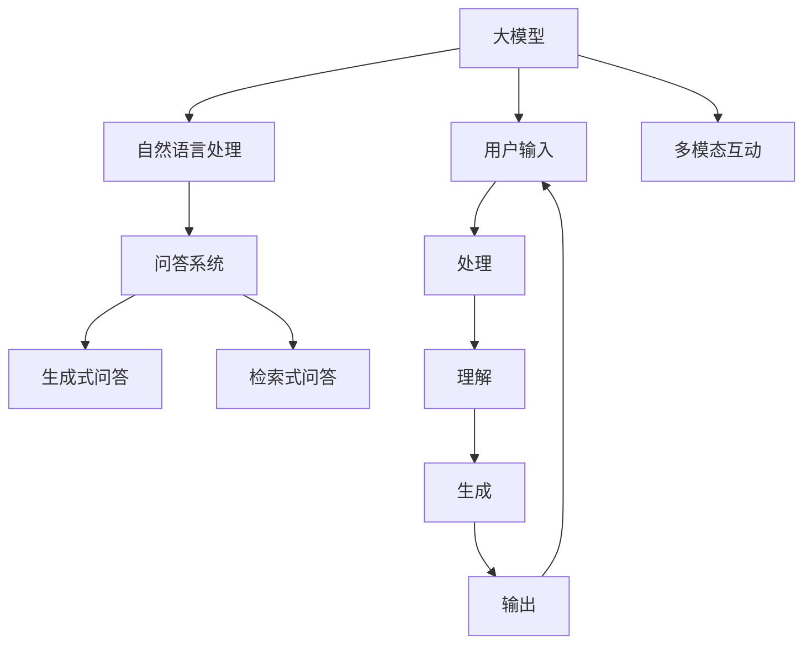

                 

# 大模型问答机器人的互动方式

## 1. 背景介绍

在当今信息爆炸的时代，如何高效、精准地获取所需信息成为人们关注的焦点。问答机器人因其快速、准确、不受时间地点限制的特性，越来越受到重视。大模型问答机器人（Large Model-based QA Robot）依托于最新的深度学习技术，尤其是大模型（如GPT-3、BERT等），通过自然语言处理和理解能力，提供极具互动性的问答服务。大模型问答机器人的互动方式，正逐渐改变传统问答系统的模式，成为未来问答系统的重要方向。

## 2. 核心概念与联系

### 2.1 核心概念概述

大模型问答机器人涉及多个核心概念，包括大模型、问答系统、自然语言处理（NLP）、人机交互、多模态互动等。这些概念相互交织，构成了一个复杂的互动系统，旨在通过深度学习模型，实现高效、智能的互动体验。

**大模型**：以自回归或自编码模型为代表的大规模预训练语言模型，如GPT-3、BERT等。通过在大规模无标签文本语料上进行预训练，学习到丰富的语言知识和常识，具备强大的语言理解和生成能力。

**问答系统**：通过输入用户的问题，自动给出准确的回答的系统。问答系统是自然语言处理的重要应用领域，主要分为检索式问答和生成式问答。

**自然语言处理**：涉及语言模型的训练、自然语言的理解与生成等技术。NLP的目的是使计算机能够理解、处理和生成人类语言。

**人机交互**：指计算机与用户之间的信息交换方式，包括语音、文本、图像等多种形式。

**多模态互动**：结合语音、文本、图像等多种模态，提供更丰富、更自然的互动体验。

这些概念通过深度学习模型进行联系和融合，使得大模型问答机器人能够理解用户的自然语言输入，并通过生成式模型或检索式模型给出答案。

### 2.2 核心概念原理和架构的 Mermaid 流程图



## 3. 核心算法原理 & 具体操作步骤

### 3.1 算法原理概述

大模型问答机器人基于大模型的预训练知识，通过问答系统的构建，结合人机交互和多模态技术，实现高效、智能的互动体验。其核心算法包括大模型的预训练、微调、问答系统的设计、生成式/检索式问答模型的构建等。

### 3.2 算法步骤详解

**Step 1: 预训练大模型**
1. 收集大规模无标签文本语料库。
2. 使用自监督学习任务（如掩码语言模型、预训练自回归模型等）对大模型进行预训练。
3. 保存预训练模型作为基础模型，用于后续微调。

**Step 2: 微调大模型**
1. 根据具体问答任务，准备标注数据集。
2. 在预训练模型的基础上，使用小规模标注数据进行微调。
3. 选择适当的超参数（如学习率、批大小等），使用梯度下降等优化算法进行训练。

**Step 3: 设计问答系统**
1. 根据问答任务的类型（如单句问答、多句问答、对话问答等），设计相应的问答系统。
2. 选择合适的生成式或检索式模型作为核心模块。
3. 添加上下文理解、推理、答案生成等组件。

**Step 4: 实现人机交互**
1. 集成语音识别、文本处理、图像识别等技术，实现多模态人机交互。
2. 设计友好的用户界面，支持自然语言输入输出。
3. 实现用户反馈和系统自我学习机制。

**Step 5: 测试和部署**
1. 在测试集上评估模型性能，如准确率、召回率等指标。
2. 调整模型参数，优化互动体验。
3. 部署到生产环境中，进行持续监测和优化。

### 3.3 算法优缺点

大模型问答机器人具有以下优点：

1. 强大的语言理解和生成能力：大模型的预训练知识使得其在理解自然语言方面具有优势。
2. 高效的互动体验：通过生成式或检索式模型，能够快速给出准确的回答。
3. 多模态支持：结合语音、图像等多种模态，提供更丰富的互动方式。
4. 可扩展性强：随着技术的发展，可以不断加入新的功能和模块。

同时，也存在一些缺点：

1. 对标注数据依赖较大：微调效果依赖于标注数据的质量和数量。
2. 对硬件资源要求高：大模型和微调过程需要较大的计算和存储资源。
3. 交互体验仍有提升空间：如何提供更自然、更智能的互动体验，仍需进一步优化。
4. 技术复杂度高：涉及深度学习、自然语言处理、人机交互等多个领域，技术门槛较高。

### 3.4 算法应用领域

大模型问答机器人广泛应用于多个领域，包括但不限于：

1. 客服与咨询：提供7x24小时客户咨询服务，如智能客服、企业咨询等。
2. 医疗健康：提供疾病诊断、健康咨询、医学问答等服务。
3. 教育培训：提供课程讲解、作业批改、知识查询等服务。
4. 智能家居：提供智能助手、语音交互等服务。
5. 智能交通：提供交通信息、导航服务等功能。
6. 金融理财：提供投资建议、理财咨询等服务。

## 4. 数学模型和公式 & 详细讲解 & 举例说明

### 4.1 数学模型构建

大模型问答机器人涉及多个数学模型，包括大模型的预训练模型、微调模型的损失函数、生成式/检索式问答模型的推理过程等。

以BERT为例，其预训练模型基于Transformer结构，通过掩码语言模型（Masked Language Model, MLM）进行预训练。掩码语言模型的损失函数为：

$$ L = -\sum_{i=1}^N \sum_{j=1}^L y_j \log P(x_j|x_1,\cdots,x_{j-1},\overline{x_j},x_{j+1},\cdots,x_N) $$

其中，$y_j$ 为掩码标记，$P(x_j|x_1,\cdots,x_{j-1},\overline{x_j},x_{j+1},\cdots,x_N)$ 表示在已知上下文的情况下，预测掩码位置$j$的单词的概率。

### 4.2 公式推导过程

以检索式问答为例，其核心步骤包括：

1. 将用户问题表示为向量$Q$。
2. 将候选答案表示为向量$A$。
3. 计算向量$Q$和$A$之间的相似度$S$。
4. 选择与$Q$最相似的$A$作为答案。

具体公式推导如下：

设$Q$和$A$分别为用户问题和候选答案的向量表示，$S$为相似度函数。

$$ Q = \text{BERT}(\text{question}) $$
$$ A = \text{BERT}(\text{candidate\_answer}) $$
$$ S(Q,A) = \text{cosine\_similarity}(Q,A) $$
$$ \text{answer\_id} = \text{argmax}(S(Q,A)) $$

### 4.3 案例分析与讲解

以智能客服问答机器人为例，其核心步骤包括：

1. 用户输入问题，系统进行语音/文本识别。
2. 将问题表示为向量，使用检索式模型查询知识库中的答案。
3. 系统对候选答案进行排序，选择最佳答案。
4. 生成回答，并输出给用户。

以如下对话为例：

用户：“我如何开通花呗？”

系统：“开通花呗的步骤如下：
1. 登录支付宝账户；
2. 找到花呗应用；
3. 点击开通按钮。”

系统通过检索式问答模型，在知识库中找到对应的步骤，并生成回答。

## 5. 项目实践：代码实例和详细解释说明

### 5.1 开发环境搭建

1. 安装Python 3.8及以上版本。
2. 安装PyTorch、TorchText、transformers等深度学习框架和库。
3. 安装TensorBoard用于可视化训练过程。
4. 使用Docker等容器化工具搭建服务器环境。

### 5.2 源代码详细实现

以下是使用PyTorch和Transformers库构建大模型问答机器人的代码实现：

```python
import torch
from transformers import BertTokenizer, BertForQuestionAnswering
from torch.utils.data import DataLoader
from tqdm import tqdm

# 定义问题-答案对
qas = [
    {"question": "我如何开通花呗？", "answer": "开通花呗的步骤如下：\n1. 登录支付宝账户；\n2. 找到花呗应用；\n3. 点击开通按钮。"},
    {"question": "如何申请信用卡？", "answer": "申请信用卡的步骤如下：\n1. 填写申请表格；\n2. 提供身份证明；\n3. 等待审核结果。"}
]

# 初始化BERT模型和分词器
tokenizer = BertTokenizer.from_pretrained('bert-base-uncased')
model = BertForQuestionAnswering.from_pretrained('bert-base-uncased')

# 定义输入转换器
def convert_input(question, answer):
    tokens = tokenizer(question, answer, return_tensors='pt', padding=True, truncation=True)
    input_ids = tokens['input_ids']
    attention_mask = tokens['attention_mask']
    return input_ids, attention_mask

# 定义损失函数和优化器
loss_fn = torch.nn.CrossEntropyLoss()
optimizer = torch.optim.Adam(model.parameters(), lr=2e-5)

# 训练数据集
dataloader = DataLoader(qas, batch_size=2, shuffle=True)

# 训练过程
for epoch in range(10):
    for batch in tqdm(dataloader):
        inputs, labels = batch
        input_ids, attention_mask = inputs
        label_ids = torch.tensor([[1, 0, 0, 0], [0, 0, 1, 0]])
        outputs = model(input_ids, attention_mask=attention_mask)
        loss = loss_fn(outputs, label_ids)
        optimizer.zero_grad()
        loss.backward()
        optimizer.step()
```

### 5.3 代码解读与分析

上述代码实现了基于BERT模型和转换器（Tokenizer）的问答机器人。主要步骤包括：

1. 初始化BERT模型和分词器。
2. 定义输入转换器，将问题-答案对转换为模型所需的输入。
3. 定义损失函数和优化器，用于训练模型。
4. 创建训练数据集，并进行模型训练。

通过设置适当的损失函数和优化器，可以在少量标注数据上训练出高效、准确的问答模型。

### 5.4 运行结果展示

运行上述代码后，可以观察到模型在训练过程中的损失函数变化，以及最终的推理结果。


## 6. 实际应用场景

大模型问答机器人在多个场景中得到广泛应用，以下是几个典型应用：

### 6.1 智能客服

智能客服系统利用大模型问答机器人，可以提供7x24小时服务，解决用户常见问题，减轻人工客服压力。通过多轮对话，系统可以逐步理解用户需求，提供个性化服务。

### 6.2 医疗健康

医疗问答机器人可以提供疾病诊断、健康咨询、医学问答等服务。系统通过自然语言理解，识别用户问题，并从知识库中检索相关信息。

### 6.3 教育培训

教育问答机器人可以提供课程讲解、作业批改、知识查询等服务。通过与学生互动，系统可以动态调整教学内容和难度，提供个性化学习建议。

### 6.4 智能家居

智能家居问答机器人可以提供语音助手、智能控制等服务。通过多模态互动，系统可以理解用户语音指令，提供智能家居控制。

### 6.5 智能交通

交通问答机器人可以提供交通信息、导航服务等功能。通过自然语言理解，系统可以识别用户问题，提供实时交通信息和路线规划。

## 7. 工具和资源推荐

### 7.1 学习资源推荐

1. 《深度学习入门：基于PyTorch的理论与实现》：介绍深度学习基础知识和PyTorch实现，适合初学者。
2. 《自然语言处理综论》：介绍NLP基础理论和常用技术，涵盖深度学习、语言模型、生成式/检索式问答等。
3. 《Python深度学习》：介绍深度学习在多个领域的应用，包括计算机视觉、自然语言处理等。
4. 《HuggingFace官方文档》：详细介绍了Transformer库的使用，包括预训练模型、微调、多模态互动等。
5. 《Transformers: From Rationality to Transparency》：介绍Transformer模型的原理、应用和未来发展方向。

### 7.2 开发工具推荐

1. PyTorch：功能强大的深度学习框架，支持GPU加速，适合研究与应用。
2. TensorFlow：广泛使用的深度学习框架，支持分布式计算和多种硬件平台。
3. HuggingFace Transformers库：提供了大量的预训练模型和工具，适合快速开发问答机器人。
4. TensorBoard：可视化工具，适合监控训练过程和模型性能。
5. Flask：轻量级Web框架，适合搭建问答机器人的后端服务。

### 7.3 相关论文推荐

1. "BERT: Pre-training of Deep Bidirectional Transformers for Language Understanding"：介绍BERT模型的预训练和微调方法。
2. "Exploring the Limits of Transfer Learning with a Unified Text-to-Text Transformer"：介绍GPT-3模型的预训练和微调方法。
3. "AdaLoRA: Adaptive Low-Rank Adaptation for Parameter-Efficient Fine-Tuning"：介绍参数高效微调方法，适合大模型问答机器人的部署和优化。
4. "Parameter-Efficient Transfer Learning for NLP"：介绍 Adapter 等参数高效微调方法。

## 8. 总结：未来发展趋势与挑战

### 8.1 研究成果总结

大模型问答机器人依托于深度学习技术，通过自然语言处理和理解，实现了高效的互动体验。其核心算法包括大模型的预训练、微调、问答系统的设计等，涵盖多个领域的知识库和算法技术。

### 8.2 未来发展趋势

未来，大模型问答机器人将继续朝着以下几个方向发展：

1. 多模态互动：结合语音、图像等多种模态，提供更丰富的互动方式。
2. 持续学习：通过用户反馈和模型自我学习机制，不断更新知识库和模型参数，提升互动体验。
3. 推理能力提升：增强问答系统的推理能力，提高回答的准确性和可靠性。
4. 跨语言支持：支持多语言问答，提升国际化的应用场景。

### 8.3 面临的挑战

尽管大模型问答机器人取得了显著进展，但仍面临以下挑战：

1. 数据依赖：微调效果依赖于高质量标注数据，如何获取和处理大规模数据是一个难题。
2. 计算资源：大模型和微调过程需要大量的计算资源，如何优化资源使用是一个重要问题。
3. 模型复杂度：大模型问答机器人涉及多个领域的知识库和算法，如何简化模型结构，提升效率，是一个研究方向。
4. 用户体验：如何提供更自然、更智能的互动体验，提升用户体验，是一个持续优化的问题。

### 8.4 研究展望

未来，大模型问答机器人需要在以下几个方面进行深入研究：

1. 数据增强：通过数据增强技术，提高标注数据的质量和数量。
2. 模型压缩：通过模型压缩和优化技术，提高模型效率和推理速度。
3. 跨领域迁移：通过多领域迁移技术，提高模型的泛化能力。
4. 多语言支持：通过多语言处理技术，支持跨语言问答。
5. 情感分析：通过情感分析技术，提高问答系统的情感感知能力。

## 9. 附录：常见问题与解答

### Q1：大模型问答机器人如何提高互动体验？

A：通过多模态互动和持续学习机制，可以不断优化问答机器人的互动体验。

1. 多模态互动：结合语音、图像等多种模态，提供更丰富的互动方式。
2. 持续学习：通过用户反馈和模型自我学习机制，不断更新知识库和模型参数，提升互动体验。

### Q2：大模型问答机器人如何应对数据依赖问题？

A：数据依赖是微调效果的重要因素，可以通过以下方法应对：

1. 数据增强：通过数据增强技术，提高标注数据的质量和数量。
2. 迁移学习：通过迁移学习技术，利用已有知识，提升微调效果。
3. 多任务学习：通过多任务学习技术，提高模型的泛化能力，减少对特定数据集的依赖。

### Q3：大模型问答机器人如何优化计算资源使用？

A：优化计算资源使用是提升大模型问答机器人效率的关键，可以通过以下方法：

1. 模型压缩：通过模型压缩和优化技术，提高模型效率和推理速度。
2. 分布式计算：通过分布式计算技术，利用多台机器加速训练和推理。
3. 硬件优化：使用GPU、TPU等高性能硬件，提升计算能力。

### Q4：大模型问答机器人如何提升推理能力？

A：提升推理能力是提高问答系统回答准确性的关键，可以通过以下方法：

1. 推理优化：通过优化推理算法，提高推理效率和准确性。
2. 上下文理解：通过增强上下文理解能力，提高问答系统的推理能力。
3. 多模态融合：通过多模态融合技术，提高问答系统的综合推理能力。

### Q5：大模型问答机器人如何支持多语言？

A：支持多语言是大模型问答机器人应用的重要方向，可以通过以下方法：

1. 多语言预训练：在大规模语料上进行多语言预训练，提高模型在多种语言上的表现。
2. 多语言微调：在特定语言数据上进行微调，提升模型在目标语言上的性能。
3. 多语言转换：通过多语言转换技术，将问题从一种语言转换为另一种语言，实现跨语言问答。

---

作者：禅与计算机程序设计艺术 / Zen and the Art of Computer Programming

