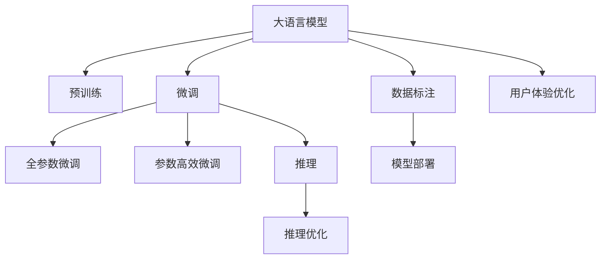

                 

# 大模型问答机器人的训练技术

> 关键词：大模型，问答机器人，训练技术，深度学习，Transformer，BERT，自然语言处理（NLP），推理优化，微调

## 1. 背景介绍

### 1.1 问题由来

随着人工智能技术的迅猛发展，自然语言处理（NLP）领域中的问答机器人（Q&A robots）逐渐成为热点研究领域之一。问答机器人可以通过理解用户提出的问题，自动从大量知识库中筛选出相关答案，从而实现智能化的信息获取和知识检索功能。然而，构建一个性能出色、泛化能力强、用户满意度高的问答机器人并非易事，需要在大规模语料上进行预训练，并在具体的问答任务上微调进行优化。

近年来，大语言模型（Large Language Models, LLMs）如GPT、BERT、T5等，通过在预训练阶段学习通用的语言表示，已经在多项NLP任务上取得了突破性的进展。然而，由于大规模语言模型的参数量巨大，推理计算复杂度高，因此，如何高效地训练和优化问答机器人成为了研究者关注的重点。

本文旨在通过介绍大语言模型在问答机器人训练中的应用，详细解析微调（Fine-tuning）、推理优化等核心技术，以期为问答机器人的开发和优化提供参考和指导。

### 1.2 问题核心关键点

问答机器人的训练过程中，核心问题包括：

1. **预训练和微调技术**：如何利用大语言模型在预训练阶段学习到的语言知识，通过微调技术提升在特定问答任务上的表现。
2. **推理优化**：在问答任务中，如何快速准确地进行推理，生成高质量的响应。
3. **数据标注**：问答机器人训练所需的高质量标注数据，如何高效获取和利用。
4. **模型部署**：如何将训练好的模型部署到实际应用中，保障其高性能、低延迟、高可扩展性。
5. **用户体验优化**：如何在问答交互中提升用户满意度，构建自然流畅的对话体验。

## 2. 核心概念与联系

### 2.1 核心概念概述

为了深入理解问答机器人训练技术，本文首先介绍几个核心概念：

- **大语言模型**：如GPT、BERT等，通过在大规模无标签文本语料上进行预训练，学习通用的语言表示，具备强大的语言理解和生成能力。
- **预训练**：在大规模无标签文本语料上，通过自监督学习任务训练通用语言模型的过程。常见的预训练任务包括言语建模、掩码语言模型等。
- **微调**：在预训练模型的基础上，使用下游任务的少量标注数据，通过有监督地训练优化模型在特定任务上的性能。
- **推理**：基于训练好的模型，对输入问题进行理解和回答的过程。
- **优化算法**：如AdamW、SGD等，用于更新模型参数，最小化损失函数，提升模型性能。

### 2.2 核心概念原理和架构的 Mermaid 流程图(Mermaid 流程节点中不要有括号、逗号等特殊字符)



### 2.3 核心概念之间的联系

这些核心概念之间存在紧密的联系，共同构成了问答机器人训练和优化的全流程。

- 大语言模型在预训练阶段学习语言知识，为后续微调和推理提供了基础。
- 微调将通用语言模型针对特定任务进行优化，提升模型的任务表现。
- 推理优化旨在提高模型在实际应用中的推理速度和准确度。
- 数据标注是微调的基础，高质量标注数据可以提升模型训练效果。
- 模型部署将训练好的模型应用到实际场景中，保障系统的高效稳定运行。
- 用户体验优化关注用户交互的自然流畅度，提升系统的人机交互体验。

## 3. 核心算法原理 & 具体操作步骤

### 3.1 算法原理概述

问答机器人的训练主要基于深度学习技术，通过在大规模语料上进行预训练，学习到通用的语言表示，然后在特定问答任务上进行微调，优化模型在任务上的表现。其核心算法如下：

1. **预训练**：在大规模无标签文本语料上进行自监督学习任务，如掩码语言模型（Masked Language Modeling, MLM），以学习语言的基本规律和知识。
2. **微调**：在特定问答任务上，使用少量标注数据进行有监督学习，优化模型在任务上的表现。
3. **推理**：基于微调后的模型，对输入问题进行理解和回答，生成最终答案。

### 3.2 算法步骤详解

以下详细介绍问答机器人的训练流程：

#### 3.2.1 数据准备

1. **数据收集**：收集和整理相关的问答数据，包括问题（Query）和答案（Answer）。常见数据集如SQuAD、Wikipedia QA等。
2. **数据预处理**：对数据进行清洗、去重、分词、编码等处理，确保数据格式一致。
3. **标注数据准备**：为每个问题准备答案，生成标注数据集，如Query-Answer pairs。

#### 3.2.2 模型选择和初始化

1. **选择模型**：根据任务特点选择适合的预训练语言模型，如BERT、GPT等。
2. **模型初始化**：将预训练模型作为初始化参数，在特定任务上微调。

#### 3.2.3 微调

1. **模型适配**：在预训练模型的基础上，添加或修改适应问答任务的输出层和损失函数。例如，对于分类任务，添加分类器；对于生成任务，使用解码器输出概率分布。
2. **优化器选择**：选择合适的优化器，如AdamW、SGD等，设置学习率、批大小、迭代轮数等超参数。
3. **损失函数设计**：根据问答任务设计合适的损失函数，如交叉熵损失、均方误差损失等。
4. **训练和评估**：在标注数据集上使用优化器进行训练，周期性在验证集上评估模型性能，根据性能指标决定是否触发Early Stopping。重复上述步骤直至满足预设的迭代轮数或Early Stopping条件。

#### 3.2.4 推理

1. **模型推理**：使用训练好的模型对输入问题进行推理，生成答案。
2. **后处理**：对生成的答案进行后处理，如去重、排序、格式化等，确保回答的质量和一致性。

### 3.3 算法优缺点

基于深度学习的问答机器人训练方法具有以下优点：

1. **高效性**：通过预训练和微调技术，在大规模语料上进行训练，能够在较短时间内构建高性能的问答系统。
2. **泛化能力**：通过微调技术，模型能够在特定问答任务上取得良好的泛化能力，提升模型在不同数据分布上的表现。
3. **可扩展性**：深度学习模型可以部署在分布式系统中，实现高可扩展性，支持大规模问答应用。

然而，该方法也存在一些缺点：

1. **计算资源需求高**：大语言模型的预训练和微调需要大量的计算资源，对硬件设备有较高要求。
2. **模型复杂度高**：深度学习模型的复杂性较高，推理计算耗时较长，对系统性能有挑战。
3. **数据标注成本高**：高质量的标注数据集获取难度大，标注成本高。
4. **模型解释性不足**：深度学习模型通常被视为"黑盒"，难以解释其决策过程和推理机制。
5. **对抗性风险**：模型可能存在对抗性漏洞，对恶意攻击的鲁棒性不足。

### 3.4 算法应用领域

问答机器人训练技术已经在多个领域得到应用，例如：

1. **智能客服**：提供24小时在线客服，帮助企业处理用户咨询。
2. **医疗咨询**：辅助医生快速查询病例、药品信息等，提升医疗服务效率。
3. **教育辅导**：提供个性化学习建议、作业解答等，提升教育质量。
4. **智能搜索**：通过问答系统优化搜索引擎，提高搜索准确性和用户体验。
5. **智能助理**：在智能家居、车载系统等场景中，为用户提供语音问答服务。

## 4. 数学模型和公式 & 详细讲解 & 举例说明

### 4.1 数学模型构建

在问答机器人训练过程中，常见的数学模型包括：

- **预训练模型**：如BERT，采用掩码语言模型（MLM）进行预训练，模型参数为 $\theta$。
- **微调模型**：在特定问答任务上，微调后的模型参数为 $\theta'$。

数学模型构建如下：

1. **预训练模型**：
   $$
   \mathcal{L}_{\text{pre}}(\theta) = \frac{1}{N}\sum_{i=1}^N \ell_{\text{pre}}(\theta, x_i)
   $$
   其中，$x_i$ 为预训练样本，$\ell_{\text{pre}}$ 为预训练损失函数。

2. **微调模型**：
   $$
   \mathcal{L}_{\text{fin}}(\theta') = \frac{1}{N}\sum_{i=1}^N \ell_{\text{fin}}(\theta', x_i, y_i)
   $$
   其中，$x_i$ 为微调样本，$y_i$ 为标签，$\ell_{\text{fin}}$ 为微调损失函数。

### 4.2 公式推导过程

以问答分类任务为例，推导微调模型的损失函数：

1. **预训练损失函数**：
   $$
   \ell_{\text{pre}}(\theta, x) = -\log \frac{\exp(\hat{y}\log \sigma(\theta, x))}{\sum_j \exp(\log \sigma(\theta, x_j))}
   $$
   其中，$\hat{y}$ 为模型预测输出，$\sigma(\theta, x)$ 为模型的softmax输出。

2. **微调损失函数**：
   $$
   \ell_{\text{fin}}(\theta', x, y) = -\log \frac{\exp(\hat{y}\log \sigma(\theta', x))}{\sum_j \exp(\log \sigma(\theta', x_j))}
   $$
   其中，$\hat{y}$ 为模型预测输出，$\sigma(\theta', x)$ 为模型的softmax输出。

### 4.3 案例分析与讲解

以SQuAD数据集为例，分析微调过程：

1. **数据集准备**：SQuAD数据集包含问答对，每个问题有多个候选答案，需要构建标注数据集。
2. **模型选择**：选择BERT作为预训练模型，并添加分类器。
3. **微调训练**：在标注数据集上使用AdamW优化器进行训练，设置适当的超参数，最小化微调损失函数。
4. **推理验证**：使用验证集评估模型性能，根据评估结果调整模型参数，重复训练过程。

## 5. 项目实践：代码实例和详细解释说明

### 5.1 开发环境搭建

1. **环境安装**：安装Python、PyTorch、TensorFlow等深度学习框架。
2. **模型选择**：选择预训练模型，如BERT、GPT等。
3. **工具安装**：安装TensorBoard、Weights & Biases等可视化工具，用于模型训练监控和性能评估。

### 5.2 源代码详细实现

以下是一个使用PyTorch框架的问答机器人的示例代码：

```python
import torch
import torch.nn as nn
import torch.optim as optim
from transformers import BertTokenizer, BertForQuestionAnswering

class QAModel(nn.Module):
    def __init__(self):
        super(QAModel, self).__init__()
        self.bert = BertForQuestionAnswering.from_pretrained('bert-base-uncased')
        self.classifier = nn.Linear(768, 2)
        
    def forward(self, query, context):
        tokenized_query = self.tokenizer(query, return_tensors='pt', padding=True)
        tokenized_context = self.tokenizer(context, return_tensors='pt', padding=True)
        outputs = self.bert(tokenized_query['input_ids'], tokenized_context['input_ids'])
        logits = self.classifier(outputs[0])
        return logits

# 初始化模型和优化器
model = QAModel()
optimizer = optim.Adam(model.parameters(), lr=2e-5)
tokenizer = BertTokenizer.from_pretrained('bert-base-uncased')

# 数据预处理
train_dataset = ...
dev_dataset = ...
test_dataset = ...

# 训练过程
epochs = 5
for epoch in range(epochs):
    train_loss = 0.0
    for query, context, answer in train_dataset:
        optimizer.zero_grad()
        logits = model(query, context)
        loss = nn.CrossEntropyLoss()(logits, answer)
        loss.backward()
        optimizer.step()
        train_loss += loss.item()
    print(f'Epoch {epoch+1}, train loss: {train_loss/len(train_dataset)}')
    
    dev_loss = 0.0
    for query, context, answer in dev_dataset:
        logits = model(query, context)
        loss = nn.CrossEntropyLoss()(logits, answer)
        dev_loss += loss.item()
    print(f'Epoch {epoch+1}, dev loss: {dev_loss/len(dev_dataset)}')
    
    test_loss = 0.0
    for query, context, answer in test_dataset:
        logits = model(query, context)
        loss = nn.CrossEntropyLoss()(logits, answer)
        test_loss += loss.item()
    print(f'Epoch {epoch+1}, test loss: {test_loss/len(test_dataset)}')
```

### 5.3 代码解读与分析

代码实现中，关键步骤如下：

1. **模型选择和初始化**：选择BERT作为预训练模型，并添加线性分类器作为微调层。
2. **训练和评估**：使用AdamW优化器进行模型训练，周期性在验证集和测试集上评估模型性能。
3. **推理过程**：使用训练好的模型对新查询进行推理，生成答案。

### 5.4 运行结果展示

通过上述代码实现，可以实现对问答数据集的微调，并在验证集和测试集上评估模型性能。最终的推理结果可以用来回答用户提出的问题。

## 6. 实际应用场景

### 6.1 智能客服系统

问答机器人可以集成到智能客服系统中，提供24小时在线咨询服务。系统可以实时接收用户咨询，通过问答机器人快速响应，并根据用户输入生成自然流畅的回复，提升用户满意度。

### 6.2 医疗咨询平台

在医疗咨询平台中，问答机器人可以辅助医生查询病历、药物信息等，提供个性化医疗建议。系统通过构建医疗领域专有数据集，训练微调后的模型，确保医疗咨询的准确性和专业性。

### 6.3 智能教育应用

在智能教育应用中，问答机器人可以提供个性化学习建议、作业解答等服务。系统通过收集学生学习数据，训练微调后的模型，生成针对不同学生的学习建议和答案，提升教育质量。

### 6.4 未来应用展望

未来，问答机器人在各个领域的应用将会更加广泛，如智能家居、车载系统、智慧城市等。通过结合多模态信息、增强知识库、优化推理算法等技术手段，问答机器人将进一步提升智能水平，构建更加高效、智能的人机交互体验。

## 7. 工具和资源推荐

### 7.1 学习资源推荐

为了帮助开发者系统掌握问答机器人训练技术，以下是一些优质的学习资源：

1. **《自然语言处理综论》**：介绍了NLP领域的基础理论和经典模型，适合初学者入门。
2. **《深度学习框架PyTorch入门与实战》**：详细讲解了PyTorch框架的使用方法，适合实战练习。
3. **《Transformer原理与应用》**：介绍了Transformer模型的原理和应用，适合深入学习。
4. **HuggingFace官方文档**：提供了丰富的预训练模型和微调样例，适合实践开发。
5. **NLP公开课**：斯坦福大学、MIT等名校开设的NLP课程，涵盖多个NLP任务和前沿技术，适合系统学习。

通过这些资源的学习，相信你一定能够快速掌握问答机器人训练的精髓，并用于解决实际的NLP问题。

### 7.2 开发工具推荐

为了高效开发问答机器人，以下是一些常用的开发工具：

1. **PyTorch**：灵活高效的深度学习框架，适合构建复杂的模型和算法。
2. **TensorFlow**：易于部署、生产友好的深度学习框架，适合大规模应用场景。
3. **Transformers库**：提供了丰富的预训练模型和微调工具，方便开发者快速上手。
4. **TensorBoard**：可视化工具，可以实时监控模型训练状态，分析模型性能。
5. **Weights & Biases**：实验跟踪工具，记录和可视化模型训练过程中的各项指标，方便调试和优化。

### 7.3 相关论文推荐

问答机器人训练技术的发展源于学界的持续研究。以下是几篇具有代表性的相关论文，推荐阅读：

1. **BERT: Pre-training of Deep Bidirectional Transformers for Language Understanding**：提出BERT模型，引入掩码语言模型预训练，提升了模型在NLP任务上的表现。
2. **GPT-2: Language Models are Unsupervised Multitask Learners**：展示了GPT-2模型的强大zero-shot学习能力，推动了语言模型的发展。
3. **AdaLoRA: Adaptive Low-Rank Adaptation for Parameter-Efficient Fine-Tuning**：提出AdaLoRA方法，通过自适应低秩适应，提升了微调的参数效率。
4. **Adaptive Prompt Tuning for Few-Shot Machine Translation**：提出Adaptive Prompt Tuning方法，提升了微调模型的少样本学习能力。
5. **Dynamic Question Answering with Multimodal Reasoning**：提出多模态推理方法，结合视觉和语言信息，提升了问答机器人的理解能力。

这些论文代表了大语言模型微调技术的发展脉络，通过学习这些前沿成果，可以帮助研究者把握学科前进方向，激发更多的创新灵感。

## 8. 总结：未来发展趋势与挑战

### 8.1 总结

本文对基于深度学习的问答机器人训练技术进行了全面系统的介绍。首先阐述了问答机器人在各个领域的应用背景和意义，明确了微调、推理优化等核心技术在训练过程中的重要性。其次，通过数学模型和公式推导，详细讲解了微调和推理的原理和实现方法。最后，介绍了问答机器人的项目实践和应用场景，提供了丰富的学习资源和开发工具，助力问答机器人的开发和优化。

通过本文的系统梳理，可以看到，基于大语言模型的问答机器人训练方法正在成为NLP领域的重要范式，极大地拓展了语言模型的应用边界，催生了更多的落地场景。受益于大规模语料的预训练和微调技术的持续演进，问答机器人必将在各个领域大放异彩，为人类认知智能的进化带来深远影响。

### 8.2 未来发展趋势

展望未来，问答机器人训练技术将呈现以下几个发展趋势：

1. **模型规模增大**：预训练语言模型的参数量将进一步增大，提升模型的泛化能力和表现。
2. **推理速度优化**：通过推理优化技术，提升模型推理速度，保障实时性。
3. **多模态融合**：结合视觉、语音等多模态信息，提升问答系统的理解和生成能力。
4. **知识库增强**：引入知识图谱、逻辑规则等外部知识，提升问答系统的准确性和可信度。
5. **智能交互**：结合自然语言生成、对话系统等技术，构建更加智能、自然的交互体验。

这些趋势将推动问答机器人技术不断进步，为各行业带来更加智能、高效、可靠的服务。

### 8.3 面临的挑战

尽管问答机器人训练技术已经取得了显著成果，但在实际应用中仍面临诸多挑战：

1. **数据获取难度大**：高质量的标注数据集获取难度大，限制了模型的训练效果。
2. **模型复杂度高**：大语言模型和推理算法复杂，对计算资源和硬件设备有较高要求。
3. **模型解释性不足**：深度学习模型缺乏可解释性，难以解释其决策过程。
4. **对抗性风险**：模型可能存在对抗性漏洞，对恶意攻击的鲁棒性不足。
5. **用户体验优化**：需要进一步优化交互界面和对话体验，提升用户满意度。

### 8.4 研究展望

面对问答机器人训练技术所面临的挑战，未来的研究需要在以下几个方面寻求新的突破：

1. **无监督学习**：探索无监督和半监督学习技术，降低数据标注成本，提高模型的泛化能力。
2. **推理优化**：开发高效的推理算法，提升模型推理速度和准确度。
3. **多模态融合**：结合视觉、语音等多模态信息，增强模型的理解和生成能力。
4. **知识库增强**：引入知识图谱、逻辑规则等外部知识，提升模型的准确性和可信度。
5. **可解释性增强**：结合符号计算和可解释性技术，提升模型的解释性和可理解性。
6. **对抗性攻击防御**：研究对抗性攻击检测和防御技术，提升模型的鲁棒性和安全性。

这些研究方向的探索，将推动问答机器人技术向更加智能、高效、可解释和可信的方向发展，为构建更加安全、可靠、可控的智能系统铺平道路。

## 9. 附录：常见问题与解答

**Q1：问答机器人训练需要多少数据标注？**

A: 问答机器人训练所需的数据标注量取决于任务复杂度和数据质量。通常情况下，大规模语料预训练和下游任务微调所需的标注数据量较小，但标注数据质量对训练效果有很大影响。

**Q2：如何选择适合的优化器？**

A: 选择合适的优化器可以提高模型的训练效率和效果。常用的优化器包括AdamW、SGD等。AdamW适用于大规模模型，收敛速度快；SGD适用于小型模型，便于调参。

**Q3：如何进行模型压缩和推理优化？**

A: 模型压缩和推理优化是提高问答机器人性能的重要手段。常用的方法包括剪枝、量化、蒸馏等，可以有效降低模型参数量和推理计算量，提升推理速度和效率。

**Q4：如何应对对抗性攻击？**

A: 对抗性攻击是问答机器人训练过程中常见的问题。可以通过对抗训练、防御模型等方式，提升模型的鲁棒性和安全性。

**Q5：如何提升模型的可解释性？**

A: 模型的可解释性可以通过结合符号计算、规则推理等技术手段，增强模型的解释性和可理解性。例如，使用可解释性库（如LIME、SHAP）进行模型解释。

---

作者：禅与计算机程序设计艺术 / Zen and the Art of Computer Programming

