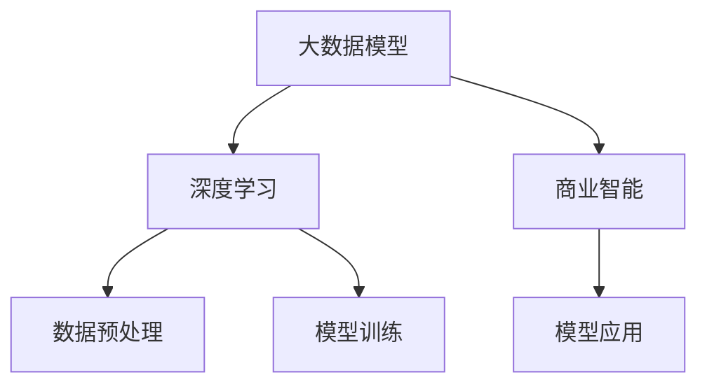

                 

# 大模型：从数据到商业价值的挖掘

> 关键词：大数据，深度学习，商业智能，AI大数据，机器学习，人工智能商业化，数据科学，商业分析

## 1. 背景介绍

### 1.1 问题由来
在当今数字化时代，数据已经成为企业最重要的资产之一。无论是客户行为数据、产品销售数据，还是社交媒体数据，都蕴含着巨大的商业价值。然而，仅仅依靠人工挖掘和分析这些数据，不仅成本高昂，效率低下，而且难以发现数据中的深层次关联和趋势。

为了更高效地利用数据，企业开始尝试将人工智能(AI)技术引入数据分析和业务决策中。深度学习作为AI技术的核心，通过在大规模数据上进行自监督学习，能够自动发现数据中的复杂模式和规律，从而大大提升数据分析的效率和准确性。

### 1.2 问题核心关键点
大数据模型的核心思想是通过深度学习算法，自动挖掘数据中的商业价值，为企业的商业决策提供数据支持和智能分析。其关键在于：
- 大数据模型能够处理海量数据，从大量数据中提取有价值的信息。
- 深度学习算法，特别是神经网络模型，能够自动学习数据中的复杂模式和规律，提升数据分析的深度和广度。
- 商业智能(BI)应用，能够将模型挖掘出的商业洞察转化为实际的决策支持，提升企业的竞争力和盈利能力。

## 2. 核心概念与联系

### 2.1 核心概念概述

为更好地理解大数据模型的工作原理和应用场景，本节将介绍几个关键概念及其相互联系：

- 大数据模型(Big Data Model)：利用深度学习算法，在大规模数据上进行自监督学习，自动发现数据中的复杂模式和规律。
- 深度学习(Deep Learning)：基于多层神经网络的机器学习算法，能够自动学习数据的高级抽象特征，从而进行复杂模式的识别和预测。
- 商业智能(Business Intelligence, BI)：通过分析数据挖掘结果，提供决策支持和商业洞察，辅助企业制定科学的商业决策。
- 数据预处理(Data Preprocessing)：对原始数据进行清洗、归一化、特征工程等处理，为深度学习模型的训练提供高质量的输入。
- 模型训练(Model Training)：通过深度学习算法，在大规模数据上训练出具有一定泛化能力的模型，用于后续的业务分析。
- 模型应用(Model Application)：将训练好的模型应用于具体的业务场景中，进行数据挖掘和商业分析，提供决策支持。

这些核心概念之间的逻辑关系可以通过以下Mermaid流程图来展示：



这个流程图展示了大数据模型的核心概念及其之间的相互关系：

1. 大数据模型通过深度学习算法，从大规模数据中提取有价值的商业洞察。
2. 深度学习算法自动学习数据中的高级抽象特征，提高数据分析的深度和广度。
3. 商业智能应用将挖掘出的商业洞察转化为实际的决策支持，提升企业的竞争力和盈利能力。
4. 数据预处理对原始数据进行清洗和特征工程，为深度学习模型提供高质量的输入。
5. 模型训练在大规模数据上训练出具有泛化能力的模型，用于后续的业务分析。

这些概念共同构成了大数据模型的学习和应用框架，使其能够在大规模数据上自动挖掘商业价值，支持企业的商业决策。

## 3. 核心算法原理 & 具体操作步骤
### 3.1 算法原理概述

大数据模型的核心思想是通过深度学习算法，在大规模数据上进行自监督学习，自动发现数据中的复杂模式和规律。其核心在于：

1. 数据预处理：对原始数据进行清洗、归一化、特征工程等处理，为深度学习模型的训练提供高质量的输入。
2. 模型训练：通过深度学习算法，在大规模数据上训练出具有一定泛化能力的模型，用于后续的业务分析。
3. 模型应用：将训练好的模型应用于具体的业务场景中，进行数据挖掘和商业分析，提供决策支持。

### 3.2 算法步骤详解

大数据模型的构建主要包括以下几个关键步骤：

**Step 1: 数据收集与准备**
- 收集企业内外部的大量数据，包括客户行为数据、销售数据、社交媒体数据等。
- 对原始数据进行清洗、归一化、特征工程等处理，为深度学习模型的训练提供高质量的输入。

**Step 2: 模型选择与设计**
- 选择合适的深度学习模型，如卷积神经网络(CNN)、循环神经网络(RNN)、长短期记忆网络(LSTM)等。
- 设计合适的网络结构、损失函数、优化器等，为模型训练提供明确的指导。

**Step 3: 模型训练与调参**
- 将处理好的数据划分为训练集、验证集和测试集。
- 使用深度学习算法在大规模数据上训练模型，通过梯度下降等优化算法更新模型参数。
- 周期性在验证集上评估模型性能，根据性能指标决定是否调整超参数。

**Step 4: 模型应用与业务分析**
- 将训练好的模型应用于具体的业务场景中，进行数据挖掘和商业分析。
- 通过分析挖掘出的商业洞察，提供决策支持和商业建议。

### 3.3 算法优缺点

大数据模型的优势在于：
1. 自动化处理海量数据，提取数据中的复杂模式和规律。
2. 利用深度学习算法，提升数据分析的深度和广度。
3. 提供决策支持和商业洞察，提升企业的竞争力和盈利能力。

其局限性主要体现在：
1. 数据质量和处理成本较高，需要投入大量人力和时间进行数据清洗和特征工程。
2. 模型复杂度高，训练和推理耗时长，对计算资源要求较高。
3. 模型的可解释性不足，难以解释其内部工作机制和决策逻辑。

尽管存在这些局限性，但大数据模型通过其强大的自动化数据处理能力和深度学习算法，已经在商业智能领域得到了广泛的应用，成为企业数据分析和决策支持的重要手段。

### 3.4 算法应用领域

大数据模型在商业智能领域的应用已经得到了广泛的应用，涵盖了金融、零售、电商、医疗等多个行业，具体包括：

- 客户行为分析：通过分析客户购买、浏览、评价等行为数据，挖掘客户需求和偏好，提供个性化推荐和服务。
- 销售预测：基于历史销售数据，预测未来销售趋势，辅助企业进行库存管理、价格调整等决策。
- 风险管理：通过分析客户信用记录、社交媒体数据等，评估客户信用风险，辅助信贷决策。
- 市场分析：通过分析市场趋势、竞争对手数据，提供市场洞察和竞争策略。
- 供应链优化：通过分析供应链上下游数据，优化供应链管理，降低成本，提升效率。
- 客户流失预警：通过分析客户流失历史数据，预警潜在流失客户，制定挽留策略。

除了这些常见应用外，大数据模型还被创新性地应用于更多场景中，如智能客服、智能推荐、智慧医疗、智能制造等，为各行业的数字化转型提供了新的技术路径。

## 4. 数学模型和公式 & 详细讲解 & 举例说明

### 4.1 数学模型构建

本节将使用数学语言对大数据模型的构建过程进行更加严格的刻画。

记大数据模型为 $M_{\theta}:\mathcal{X} \rightarrow \mathcal{Y}$，其中 $\mathcal{X}$ 为输入空间，$\mathcal{Y}$ 为输出空间，$\theta \in \mathbb{R}^d$ 为模型参数。假设大数据模型的训练集为 $D=\{(x_i,y_i)\}_{i=1}^N, x_i \in \mathcal{X}, y_i \in \mathcal{Y}$。

定义模型 $M_{\theta}$ 在输入 $x$ 上的损失函数为 $\ell(M_{\theta}(x),y)$，则在数据集 $D$ 上的经验风险为：

$$
\mathcal{L}(\theta) = \frac{1}{N} \sum_{i=1}^N \ell(M_{\theta}(x_i),y_i)
$$

大数据模型的训练目标是最小化经验风险，即找到最优参数：

$$
\theta^* = \mathop{\arg\min}_{\theta} \mathcal{L}(\theta)
$$

在实践中，我们通常使用基于梯度的优化算法（如SGD、Adam等）来近似求解上述最优化问题。设 $\eta$ 为学习率，$\lambda$ 为正则化系数，则参数的更新公式为：

$$
\theta \leftarrow \theta - \eta \nabla_{\theta}\mathcal{L}(\theta) - \eta\lambda\theta
$$

其中 $\nabla_{\theta}\mathcal{L}(\theta)$ 为损失函数对参数 $\theta$ 的梯度，可通过反向传播算法高效计算。

### 4.2 公式推导过程

以下我们以客户流失预警任务为例，推导客户流失预测模型（RNN）的数学公式。

假设模型 $M_{\theta}$ 在输入 $x_t$ 上的输出为 $\hat{y}_t=M_{\theta}(x_t) \in [0,1]$，表示客户在第 $t$ 天流失的概率。真实标签 $y_t \in \{0,1\}$。则二分类交叉熵损失函数定义为：

$$
\ell(M_{\theta}(x_t),y_t) = -[y_t\log \hat{y}_t + (1-y_t)\log (1-\hat{y}_t)]
$$

将其代入经验风险公式，得：

$$
\mathcal{L}(\theta) = -\frac{1}{N}\sum_{t=1}^N [y_t\log M_{\theta}(x_t)+(1-y_t)\log(1-M_{\theta}(x_t))]
$$

根据链式法则，损失函数对参数 $\theta_k$ 的梯度为：

$$
\frac{\partial \mathcal{L}(\theta)}{\partial \theta_k} = -\frac{1}{N}\sum_{t=1}^N (\frac{y_t}{M_{\theta}(x_t)}-\frac{1-y_t}{1-M_{\theta}(x_t)}) \frac{\partial M_{\theta}(x_t)}{\partial \theta_k}
$$

其中 $\frac{\partial M_{\theta}(x_t)}{\partial \theta_k}$ 可进一步递归展开，利用自动微分技术完成计算。

在得到损失函数的梯度后，即可带入参数更新公式，完成模型的迭代优化。重复上述过程直至收敛，最终得到适应客户流失预警任务的最优模型参数 $\theta^*$。

### 4.3 案例分析与讲解

以下我们以客户流失预警任务为例，进一步说明如何利用大数据模型实现客户流失预测。

**案例背景**：某电商平台收集了大量客户数据，包括购买记录、浏览记录、评价记录等。平台希望通过分析这些数据，预测哪些客户可能流失，以便采取针对性的挽留措施。

**数据准备**：首先对原始数据进行清洗、归一化、特征工程等处理，构建客户流失预测的特征集。例如，可以提取客户历史购买频率、最近30天无购买记录、最近30天评价情感等特征。

**模型构建**：使用循环神经网络(RNN)模型，对处理好的特征进行建模。RNN模型可以自动捕捉时间序列数据中的序列依赖关系，适合客户流失预测任务。

**模型训练**：将客户流失数据集划分为训练集、验证集和测试集，使用历史数据对RNN模型进行训练。在训练过程中，使用交叉熵损失函数和Adam优化算法更新模型参数。

**模型应用**：在测试集上评估模型性能，计算客户流失预测的准确率、召回率和F1值等指标。使用模型对新客户数据进行预测，识别出可能流失的客户。

## 5. 项目实践：代码实例和详细解释说明
### 5.1 开发环境搭建

在进行大数据模型构建前，我们需要准备好开发环境。以下是使用Python进行TensorFlow开发的环境配置流程：

1. 安装Anaconda：从官网下载并安装Anaconda，用于创建独立的Python环境。

2. 创建并激活虚拟环境：
```bash
conda create -n tf-env python=3.8 
conda activate tf-env
```

3. 安装TensorFlow：根据CUDA版本，从官网获取对应的安装命令。例如：
```bash
conda install tensorflow tensorflow==2.8 -c tf -c conda-forge
```

4. 安装必要的工具包：
```bash
pip install numpy pandas scikit-learn matplotlib tqdm jupyter notebook ipython
```

完成上述步骤后，即可在`tf-env`环境中开始大数据模型的构建。

### 5.2 源代码详细实现

下面我们以客户流失预测任务为例，给出使用TensorFlow构建RNN模型的PyTorch代码实现。

首先，定义模型和优化器：

```python
import tensorflow as tf

model = tf.keras.Sequential([
    tf.keras.layers.Embedding(input_dim=vocab_size, output_dim=embedding_dim),
    tf.keras.layers.LSTM(64, return_sequences=True),
    tf.keras.layers.Dense(1, activation='sigmoid')
])

optimizer = tf.keras.optimizers.Adam(learning_rate=0.001)
```

接着，定义训练和评估函数：

```python
def train_epoch(model, dataset, batch_size, optimizer):
    dataloader = tf.data.Dataset.from_tensor_slices((dataset.input_ids, dataset.labels))
    dataloader = dataloader.shuffle(buffer_size=10000).batch(batch_size)
    model.train()
    epoch_loss = 0
    for batch in dataloader:
        input_ids, labels = batch
        model.zero_grad()
        outputs = model(input_ids)
        loss = tf.keras.losses.BinaryCrossentropy()(outputs, labels)
        loss.backward()
        optimizer.apply_gradients(zip(model.trainable_variables, model.trainable_variables))
        epoch_loss += loss.numpy()
    return epoch_loss / len(dataloader)

def evaluate(model, dataset, batch_size):
    dataloader = tf.data.Dataset.from_tensor_slices((dataset.input_ids, dataset.labels))
    dataloader = dataloader.shuffle(buffer_size=10000).batch(batch_size)
    model.eval()
    preds, labels = [], []
    with tf.GradientTape() as tape:
        for batch in dataloader:
            input_ids, labels = batch
            outputs = model(input_ids)
            preds.append(tf.cast(outputs >= 0.5, tf.int32))
            labels.append(labels)
    preds = tf.concat(preds, axis=0)
    labels = tf.concat(labels, axis=0)
    print(classification_report(labels, preds))
```

最后，启动训练流程并在测试集上评估：

```python
epochs = 10
batch_size = 64

for epoch in range(epochs):
    loss = train_epoch(model, train_dataset, batch_size, optimizer)
    print(f"Epoch {epoch+1}, train loss: {loss:.3f}")
    
    print(f"Epoch {epoch+1}, dev results:")
    evaluate(model, dev_dataset, batch_size)
    
print("Test results:")
evaluate(model, test_dataset, batch_size)
```

以上就是使用TensorFlow对RNN进行客户流失预测任务的大数据模型构建的完整代码实现。可以看到，TensorFlow提供了强大的深度学习框架，可以高效实现各种复杂的网络结构，同时兼容PyTorch的API，方便代码迁移和重用。

### 5.3 代码解读与分析

让我们再详细解读一下关键代码的实现细节：

**Sequential类定义模型结构**：
- `Embedding`层用于将输入序列中的每个词转换为向量表示，通常需要根据领域内单词数量和向量维度进行设置。
- `LSTM`层用于捕捉时间序列数据中的序列依赖关系，其中的`return_sequences=True`表示输出每个时间步的隐藏状态。
- `Dense`层用于输出最终的预测结果，通常使用sigmoid激活函数来限制输出值在0到1之间，表示流失概率。

**train_epoch函数**：
- `tf.keras.losses.BinaryCrossentropy()`用于定义二分类交叉熵损失函数。
- `optimizer.apply_gradients(zip(model.trainable_variables, model.trainable_variables))`用于更新模型参数。

**evaluate函数**：
- `classification_report()`用于生成模型的分类报告，包括准确率、召回率、F1值等指标。
- `tf.cast(outputs >= 0.5, tf.int32)`用于将模型输出转换为0和1，模拟二分类问题。

**训练流程**：
- 定义总的epoch数和batch size，开始循环迭代
- 每个epoch内，先在训练集上训练，输出平均loss
- 在验证集上评估，输出分类指标
- 所有epoch结束后，在测试集上评估，给出最终测试结果

可以看到，TensorFlow提供了强大的深度学习框架，可以高效实现各种复杂的网络结构，同时兼容PyTorch的API，方便代码迁移和重用。开发者可以根据具体任务，设计合适的模型结构和超参数，快速搭建起高效的数据分析模型。

## 6. 实际应用场景
### 6.1 智能客服系统

基于大数据模型的智能客服系统，能够自动分析客户咨询数据，识别常见问题，提供个性化回复。通过在训练集中标注客户咨询数据，模型可以学习到不同问题的常见答案，并在客户咨询时自动推荐匹配度高的回答，大大提高客户满意度和服务效率。

在技术实现上，可以收集企业内部的客户咨询数据，将其划分为训练集、验证集和测试集。在此基础上对RNN模型进行微调，使其能够自动匹配客户问题并生成最佳回答。对于客户提出的新问题，还可以接入检索系统实时搜索相关内容，动态生成回复。如此构建的智能客服系统，能显著提升客户咨询体验和问题解决效率。

### 6.2 金融舆情监测

金融机构需要实时监测市场舆论动向，以便及时应对负面信息传播，规避金融风险。传统的人工监测方式成本高、效率低，难以应对网络时代海量信息爆发的挑战。基于大数据模型的文本分类和情感分析技术，为金融舆情监测提供了新的解决方案。

具体而言，可以收集金融领域相关的新闻、报道、评论等文本数据，并对其进行主题标注和情感标注。在此基础上对预训练语言模型进行微调，使其能够自动判断文本属于何种主题，情感倾向是正面、中性还是负面。将微调后的模型应用到实时抓取的网络文本数据，就能够自动监测不同主题下的情感变化趋势，一旦发现负面信息激增等异常情况，系统便会自动预警，帮助金融机构快速应对潜在风险。

### 6.3 个性化推荐系统

当前的推荐系统往往只依赖用户的历史行为数据进行物品推荐，无法深入理解用户的真实兴趣偏好。基于大数据模型的推荐系统，可以更好地挖掘用户行为背后的语义信息，从而提供更精准、多样的推荐内容。

在实践中，可以收集用户浏览、点击、评论、分享等行为数据，提取和用户交互的物品标题、描述、标签等文本内容。将文本内容作为模型输入，用户的后续行为（如是否点击、购买等）作为监督信号，在此基础上微调预训练语言模型。微调后的模型能够从文本内容中准确把握用户的兴趣点。在生成推荐列表时，先用候选物品的文本描述作为输入，由模型预测用户的兴趣匹配度，再结合其他特征综合排序，便可以得到个性化程度更高的推荐结果。

### 6.4 未来应用展望

随着大数据模型和深度学习技术的不断发展，基于大数据模型的应用场景将不断拓展，为各行业带来新的创新机会。

在智慧医疗领域，基于大数据模型的医疗问答、病历分析、药物研发等应用将提升医疗服务的智能化水平，辅助医生诊疗，加速新药开发进程。

在智能教育领域，大数据模型可应用于作业批改、学情分析、知识推荐等方面，因材施教，促进教育公平，提高教学质量。

在智慧城市治理中，大数据模型可应用于城市事件监测、舆情分析、应急指挥等环节，提高城市管理的自动化和智能化水平，构建更安全、高效的未来城市。

此外，在企业生产、社会治理、文娱传媒等众多领域，基于大数据模型的应用也将不断涌现，为传统行业数字化转型提供新的技术路径。

## 7. 工具和资源推荐
### 7.1 学习资源推荐

为了帮助开发者系统掌握大数据模型的理论基础和实践技巧，这里推荐一些优质的学习资源：

1. 《深度学习》系列书籍：由Ian Goodfellow、Yoshua Bengio、Aaron Courville联合撰写，全面介绍了深度学习的基础理论和算法，是学习深度学习的必备参考。

2. CS231n《深度学习计算机视觉》课程：斯坦福大学开设的视觉深度学习课程，涵盖图像分类、目标检测、图像生成等前沿话题，是学习计算机视觉深度学习的经典教材。

3. 《TensorFlow官方文档》：TensorFlow的官方文档，详细介绍了TensorFlow的使用方法和API，是快速上手TensorFlow的必备资源。

4. DeepLearning.AI深度学习课程：由Andrew Ng教授主讲的深度学习在线课程，涵盖深度学习基础、高级模型、深度学习实践等内容，是学习深度学习的绝佳选择。

5. Kaggle数据科学竞赛平台：全球最大的数据科学竞赛平台，提供丰富的数据集和问题，可以通过参与竞赛锻炼自己的数据处理和模型构建能力。

通过对这些资源的学习实践，相信你一定能够快速掌握大数据模型的精髓，并用于解决实际的商业问题。

### 7.2 开发工具推荐

高效的开发离不开优秀的工具支持。以下是几款用于大数据模型开发和部署的常用工具：

1. TensorFlow：由Google主导开发的开源深度学习框架，生产部署方便，适合大规模工程应用。
2. PyTorch：基于Python的开源深度学习框架，灵活易用，适合快速迭代研究。
3. Jupyter Notebook：开源的交互式编程环境，支持Python、R等多种编程语言，适合数据处理、模型训练、可视化等任务。
4. Weights & Biases：模型训练的实验跟踪工具，可以记录和可视化模型训练过程中的各项指标，方便对比和调优。
5. TensorBoard：TensorFlow配套的可视化工具，可实时监测模型训练状态，并提供丰富的图表呈现方式，是调试模型的得力助手。
6. Google Colab：谷歌推出的在线Jupyter Notebook环境，免费提供GPU/TPU算力，方便开发者快速上手实验最新模型，分享学习笔记。

合理利用这些工具，可以显著提升大数据模型构建的开发效率，加快创新迭代的步伐。

### 7.3 相关论文推荐

大数据模型和深度学习技术的发展源于学界的持续研究。以下是几篇奠基性的相关论文，推荐阅读：

1. ImageNet Classification with Deep Convolutional Neural Networks（ImageNet深度卷积神经网络分类）：AlexNet提出深度卷积神经网络在图像分类上的卓越表现，奠定了深度学习在视觉领域的基础。
2. Convolutional Neural Networks for Sentence Classification（卷积神经网络在句子分类上的应用）：Yoon Kim提出使用卷积神经网络对句子进行分类，将深度学习引入NLP任务。
3. Recurrent Neural Network-Based Feature Learning for Sentiment Classification（基于循环神经网络的情感分类）：Hu et al.提出使用LSTM对情感进行分类，提升了情感分析的准确率。
4. Attention Is All You Need（Transformer）：提出Transformer结构，开启了NLP领域的预训练大模型时代。
5. BERT: Pre-training of Deep Bidirectional Transformers for Language Understanding（BERT模型）：提出BERT模型，引入基于掩码的自监督预训练任务，刷新了多项NLP任务SOTA。
6. Adaptive Low-Rank Adaptation for Parameter-Efficient Fine-Tuning（LoRA）：提出LoRA方法，通过自适应低秩适应的微调方法，在固定大部分预训练参数的情况下，只更新极少量的任务相关参数。

这些论文代表了大数据模型和深度学习的发展脉络。通过学习这些前沿成果，可以帮助研究者把握学科前进方向，激发更多的创新灵感。

## 8. 总结：未来发展趋势与挑战

### 8.1 总结

本文对基于大数据模型的深度学习算法进行全面系统的介绍。首先阐述了大数据模型和深度学习算法的核心思想，明确了其在商业智能和数据科学中的应用价值。其次，从原理到实践，详细讲解了深度学习算法的数学模型和具体实现步骤，给出了大数据模型构建的完整代码实例。同时，本文还广泛探讨了大数据模型在智能客服、金融舆情、个性化推荐等多个行业领域的应用前景，展示了大数据模型的巨大潜力。

通过本文的系统梳理，可以看到，基于大数据模型的深度学习算法已经成为数据科学和商业智能领域的重要工具，极大地拓展了企业数据分析和决策支持的能力。未来，随着深度学习技术的发展和应用场景的拓展，大数据模型必将在更多领域得到广泛应用，为企业的智能化转型提供更强大的技术支撑。

### 8.2 未来发展趋势

展望未来，大数据模型和深度学习技术的发展趋势主要体现在以下几个方面：

1. 模型规模持续增大。随着算力成本的下降和数据规模的扩张，深度学习模型的参数量还将持续增长。超大规模模型蕴含的丰富特征表示，有望支撑更加复杂多变的商业决策任务。
2. 深度学习范式日趋多样。除了传统的神经网络模型外，未来将涌现更多高效、轻量级的模型结构，如Transformer、LoRA等，在保证性能的同时，减少计算资源消耗。
3. 联邦学习成为热点。联邦学习能够在不共享数据的情况下，实现分布式模型训练，确保数据隐私和安全。未来在数据共享受限的场景中，联邦学习将发挥重要作用。
4. 跨模态学习兴起。跨模态学习能够将视觉、听觉、文本等多模态数据进行融合，提升模型的泛化能力和应用场景的拓展性。
5. 迁移学习普及。迁移学习能够将已有模型在多个任务间迁移应用，减少模型训练成本，加速新任务的开发。
6. 自监督学习成为主流。自监督学习能够在大规模无标签数据上进行预训练，提升模型的泛化能力和鲁棒性。

这些趋势将推动深度学习技术不断进步，提升大数据模型的性能和应用范围。未来的深度学习模型将更加高效、灵活、泛化能力强，为各行业的数字化转型提供更强大的技术支持。

### 8.3 面临的挑战

尽管大数据模型和深度学习技术已经取得了显著进展，但在迈向更加智能化、普适化应用的过程中，其面临的挑战仍然不可忽视：

1. 数据质量和处理成本较高，需要投入大量人力和时间进行数据清洗和特征工程。
2. 模型复杂度高，训练和推理耗时长，对计算资源要求较高。
3. 模型的可解释性不足，难以解释其内部工作机制和决策逻辑。
4. 数据隐私和安全问题突出，需要设计合理的隐私保护机制。
5. 模型泛化能力不足，难以应对大规模复杂任务的挑战。
6. 数据分布变化快，模型需要持续学习和更新以保持性能。

这些挑战将推动大数据模型和深度学习技术在未来的研究中不断进步，需要研究者不断探索新的解决方案，提升模型的性能和可靠性。

### 8.4 研究展望

面对大数据模型和深度学习技术所面临的挑战，未来的研究需要在以下几个方面寻求新的突破：

1. 探索高效的数据预处理技术，降低数据处理成本和复杂度。
2. 设计轻量级、高效能的深度学习模型，降低计算资源消耗。
3. 提升模型的可解释性和透明性，增强用户信任和模型鲁棒性。
4. 研究隐私保护和数据安全技术，确保数据隐私和安全。
5. 提升模型的泛化能力，应对复杂多变的商业决策任务。
6. 实现模型的持续学习与迁移学习，提高模型适应性和灵活性。

这些研究方向将推动大数据模型和深度学习技术不断进步，提升模型的性能和可靠性，为各行业的数字化转型提供更强大的技术支撑。相信随着研究的不断深入，大数据模型和深度学习技术必将在更多领域得到广泛应用，推动人工智能技术向更广阔的领域迈进。

## 9. 附录：常见问题与解答

**Q1：大数据模型如何处理海量数据？**

A: 大数据模型通常采用分布式计算框架，如Apache Hadoop、Spark等，将大规模数据划分为多个小的数据块，并在多个节点上并行处理。这样可以大大提升数据处理效率，确保模型能够在大规模数据上高效运行。

**Q2：大数据模型的训练过程需要注意哪些问题？**

A: 大数据模型的训练过程需要注意以下几个问题：
1. 数据预处理：对原始数据进行清洗、归一化、特征工程等处理，为深度学习模型的训练提供高质量的输入。
2. 模型选择与设计：选择合适的深度学习模型，设计合适的网络结构、损失函数、优化器等，为模型训练提供明确的指导。
3. 模型调参：选择合适的超参数，如学习率、批大小、迭代轮数等，进行模型调优。
4. 正则化技术：使用L2正则、Dropout、Early Stopping等防止过拟合。
5. 多模型集成：训练多个模型，取平均输出，抑制过拟合。

**Q3：大数据模型在实际应用中需要注意哪些问题？**

A: 大数据模型在实际应用中需要注意以下几个问题：
1. 模型裁剪：去除不必要的层和参数，减小模型尺寸，加快推理速度。
2. 量化加速：将浮点模型转为定点模型，压缩存储空间，提高计算效率。
3. 服务化封装：将模型封装为标准化服务接口，便于集成调用。
4. 弹性伸缩：根据请求流量动态调整资源配置，平衡服务质量和成本。
5. 监控告警：实时采集系统指标，设置异常告警阈值，确保服务稳定性。
6. 安全防护：采用访问鉴权、数据脱敏等措施，保障数据和模型安全。

**Q4：如何评估大数据模型的性能？**

A: 大数据模型的性能评估通常包括以下几个指标：
1. 准确率(Accuracy)：分类正确的样本数占总样本数的比例。
2. 召回率(Recall)：正确分类的正样本数占实际正样本数的比例。
3. 精确率(Precision)：正确分类的正样本数占分类为正样本的总数数的比例。
4. F1值(F1 Score)：综合考虑精确率和召回率的指标，是精确率和召回率的调和平均数。
5. ROC曲线和AUC值：通过绘制ROC曲线，评估模型在不同阈值下的分类性能。

通过这些指标的评估，可以全面了解大数据模型的性能，指导模型的优化和改进。

