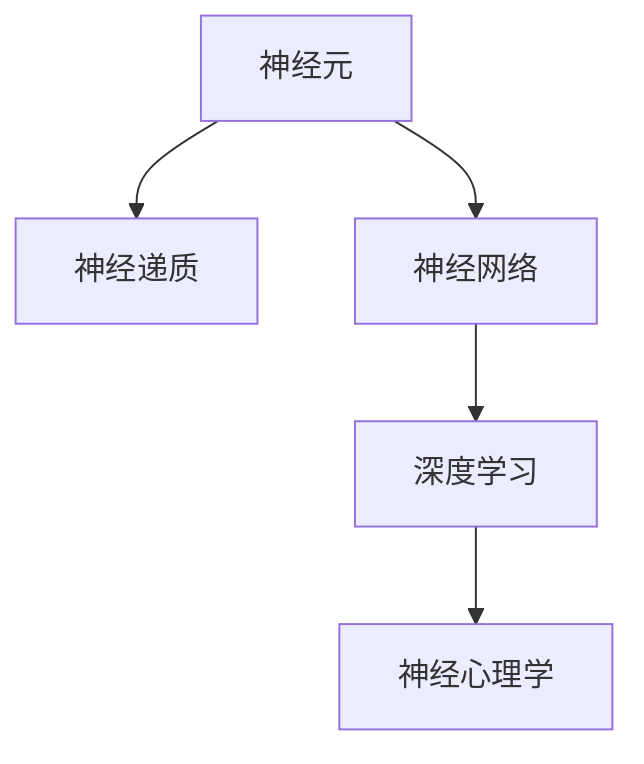

                 

# 大脑：有机化合物的奇迹

> 关键词：神经元、神经递质、神经网络、深度学习、神经心理学

## 1. 背景介绍

### 1.1 问题由来
大脑是人体最复杂的器官之一，负责感知、思考、运动等所有生理功能。对大脑的研究一直是科学界的重点和难点。近年来，随着计算能力、数据量的大幅增长，人们对大脑的理解逐步深入，开始尝试用计算机模拟和理解大脑机制。

神经元是构成大脑的基本单元，通过相互连接形成复杂的神经网络，实现信息的处理和传递。单个神经元每秒可产生千次以上的电信号，并通过神经递质传递信号到其他神经元。在大脑中，数以亿计的神经元以高度复杂的结构方式相互连接，形成巨大的神经网络，实现高级认知功能。

理解神经元如何传递信息，神经网络如何工作，以及大脑如何处理信息，是当前神经科学的重大挑战之一。本文将从神经元、神经网络、深度学习等角度，深入探讨大脑的奇迹。

### 1.2 问题核心关键点
本文将重点讨论以下关键问题：

1. 神经元如何传递信号？
2. 神经网络如何构建和训练？
3. 深度学习在理解大脑机制中的应用。
4. 神经心理学与深度学习的结合。

## 2. 核心概念与联系

### 2.1 核心概念概述

为更好地理解大脑的机制，本节将介绍几个密切相关的核心概念：

- 神经元(Neuron)：构成大脑的基本单元，负责接受、处理和传递信息。
- 神经递质(Neurotransmitter)：神经元间传递信号的化学物质，如多巴胺、血清素、乙酰胆碱等。
- 神经网络(Neural Network)：由大量神经元通过连接形成的网络，实现信息处理和传递。
- 深度学习(Deep Learning)：一种基于神经网络的机器学习技术，通过多层次的非线性变换实现高级模式识别。
- 神经心理学(Neuropsychology)：研究神经疾病、心理疾病对大脑功能的影响。

这些核心概念之间的逻辑关系可以通过以下Mermaid流程图来展示：



这个流程图展示了大脑的核心概念及其之间的关系：

1. 神经元通过神经递质传递信息，构成神经网络。
2. 神经网络通过深度学习实现复杂的信息处理。
3. 深度学习在理解大脑机制上起到了重要的作用。
4. 神经心理学研究大脑与心理疾病之间的关系。

## 3. 核心算法原理 & 具体操作步骤
### 3.1 算法原理概述

神经元是构成大脑的基础单元，它们通过相互连接形成神经网络，实现信息的传递和处理。神经元的传递信息的方式主要包括电信号和化学信号。

电信号的传递：神经元在接受刺激后，会在细胞膜上产生电位变化，这种电位变化沿着轴突传导到其他神经元，形成神经冲动。

化学信号的传递：神经元通过释放神经递质到突触间隙，传递信号到其他神经元。神经递质与突触后神经元上的受体结合，引起突触后神经元电位变化。

神经网络的构建和训练主要基于深度学习技术。深度学习是一种基于神经网络的机器学习方法，通过多层次的非线性变换实现高级模式识别。深度学习模型的核心是神经网络，通常包含输入层、隐藏层和输出层。

### 3.2 算法步骤详解

神经网络的构建通常分为以下步骤：

1. 数据预处理：将原始数据转化为神经网络所需的输入格式。
2. 构建网络结构：定义神经网络的层数、每层神经元数量等参数。
3. 初始化权重：对网络中各层权重进行随机初始化。
4. 前向传播：将输入数据通过网络计算，得到预测输出。
5. 反向传播：计算预测输出与真实标签之间的误差，反向传播误差并更新网络权重。
6. 迭代训练：重复前向传播和反向传播，逐步优化网络参数。
7. 测试评估：在测试集上评估模型性能，如准确率、误差率等。

深度学习的训练通常需要大量的标注数据和计算资源，通过优化算法（如梯度下降、Adam等）来最小化损失函数，得到最优的模型参数。在训练过程中，还需要对网络进行正则化（如Dropout、L2正则等），避免过拟合。

### 3.3 算法优缺点

深度学习在理解大脑机制上的优势包括：

1. 强大的模式识别能力：深度学习能够处理复杂的数据集，识别出其中的模式和规律。
2. 多层次的非线性变换：深度网络能够实现多层次的非线性变换，模拟大脑的高级认知功能。
3. 可解释性：通过可视化神经网络的结构和权重，可以部分理解深度学习的决策过程。

同时，深度学习也存在一些局限性：

1. 数据依赖：深度学习需要大量的标注数据进行训练，对于数据稀疏的场景，效果可能不佳。
2. 计算资源需求高：深度学习需要大量的计算资源，难以在边缘计算设备上部署。
3. 可解释性不足：深度学习模型通常被视为"黑盒"系统，难以解释其内部工作机制。
4. 易受干扰：深度学习模型在对抗样本攻击下，容易产生不稳定输出。

尽管存在这些局限性，但深度学习在理解大脑机制上的强大能力，使得其在神经科学领域得到了广泛应用。未来相关研究的重点在于如何进一步降低深度学习对标注数据的依赖，提高模型的可解释性和鲁棒性，同时兼顾计算效率。

### 3.4 算法应用领域

深度学习在神经科学中的应用领域广泛，包括：

1. 脑疾病诊断：通过深度学习分析脑图像，诊断脑部疾病，如阿尔茨海默病、脑肿瘤等。
2. 行为预测：通过深度学习模型预测大脑行为，如情绪、注意力等。
3. 认知研究：通过深度学习分析认知功能，如记忆、语言理解等。
4. 神经科学模拟：通过深度学习模拟神经网络结构，研究神经机制。
5. 脑机接口：通过深度学习算法解析脑电信号，实现人机交互。

除了这些常见的应用外，深度学习还被创新性地应用到更多场景中，如神经芯片、神经网络硬件加速器等，为神经科学带来了新的突破。

## 4. 数学模型和公式 & 详细讲解 & 举例说明

### 4.1 数学模型构建

深度学习的核心模型是神经网络，其数学模型可以通过以下几个公式来描述：

1. 激活函数：$g(z) = \max(0,z)$，将神经元的输入$z$通过激活函数转换为输出$g(z)$。
2. 线性变换：$W^TX+b$，将输入$X$通过权重矩阵$W$和偏置向量$b$进行线性变换。
3. 神经网络前向传播：$\hat{y} = g(W^TX+b)$，将输入$X$通过神经网络得到预测输出$\hat{y}$。

### 4.2 公式推导过程

以一个简单的两层神经网络为例，推导其前向传播和反向传播公式：

设神经网络输入$x$，权重矩阵$W_1$、$W_2$，偏置向量$b_1$、$b_2$，激活函数$g(z)$，损失函数$L$。

前向传播公式为：

$$
h = g(W_1x+b_1)
$$

$$
\hat{y} = g(W_2h+b_2)
$$

反向传播公式为：

$$
\frac{\partial L}{\partial W_2} = \frac{\partial L}{\partial \hat{y}} \frac{\partial \hat{y}}{\partial h} \frac{\partial h}{\partial W_1} = (\frac{\partial L}{\partial \hat{y}} * g'(h)) * g'(W_1x+b_1)
$$

$$
\frac{\partial L}{\partial W_1} = \frac{\partial L}{\partial \hat{y}} \frac{\partial \hat{y}}{\partial h} \frac{\partial h}{\partial x} = (\frac{\partial L}{\partial \hat{y}} * g'(h)) * g'(W_1x+b_1) * W_1
$$

其中$g'$为激活函数的导数。

### 4.3 案例分析与讲解

以一个简单的手写数字识别为例，分析神经网络模型的训练过程：

1. 数据预处理：将手写数字图像转化为神经网络所需的像素向量。
2. 构建网络结构：定义一个包含两个隐藏层、ReLU激活函数的网络结构。
3. 初始化权重：对网络中各层权重进行随机初始化。
4. 前向传播：将像素向量通过网络计算，得到预测输出。
5. 反向传播：计算预测输出与真实标签之间的误差，反向传播误差并更新网络权重。
6. 迭代训练：重复前向传播和反向传播，逐步优化网络参数。
7. 测试评估：在测试集上评估模型性能，如准确率、误差率等。

## 5. 项目实践：代码实例和详细解释说明

### 5.1 开发环境搭建

在进行神经网络项目开发前，我们需要准备好开发环境。以下是使用Python进行PyTorch开发的环境配置流程：

1. 安装Anaconda：从官网下载并安装Anaconda，用于创建独立的Python环境。

2. 创建并激活虚拟环境：
```bash
conda create -n pytorch-env python=3.8 
conda activate pytorch-env
```

3. 安装PyTorch：根据CUDA版本，从官网获取对应的安装命令。例如：
```bash
conda install pytorch torchvision torchaudio cudatoolkit=11.1 -c pytorch -c conda-forge
```

4. 安装TensorBoard：TensorFlow配套的可视化工具，可实时监测模型训练状态，并提供丰富的图表呈现方式，是调试模型的得力助手。
```bash
pip install tensorboard
```

完成上述步骤后，即可在`pytorch-env`环境中开始神经网络开发。

### 5.2 源代码详细实现

下面我们以手写数字识别为例，给出使用PyTorch构建和训练神经网络的PyTorch代码实现。

```python
import torch
import torch.nn as nn
import torchvision.transforms as transforms
import torchvision.datasets as datasets
import torch.optim as optim
import tensorboardX as SummaryWriter

# 数据预处理
transform = transforms.Compose([
    transforms.ToTensor(),
    transforms.Normalize([0.1307], [0.3081])
])

train_dataset = datasets.MNIST('data', train=True, download=True, transform=transform)
test_dataset = datasets.MNIST('data', train=False, download=True, transform=transform)

# 构建网络结构
class Net(nn.Module):
    def __init__(self):
        super(Net, self).__init__()
        self.fc1 = nn.Linear(784, 128)
        self.fc2 = nn.Linear(128, 64)
        self.fc3 = nn.Linear(64, 10)
        
    def forward(self, x):
        x = x.view(-1, 784)
        x = torch.relu(self.fc1(x))
        x = torch.relu(self.fc2(x))
        x = self.fc3(x)
        return x

# 定义损失函数和优化器
model = Net()
criterion = nn.CrossEntropyLoss()
optimizer = optim.Adam(model.parameters(), lr=0.001)

# 训练模型
epochs = 5
batch_size = 100

writer = SummaryWriter()
for epoch in range(epochs):
    for i, (inputs, labels) in enumerate(train_loader):
        inputs, labels = inputs.to(device), labels.to(device)
        
        # 前向传播
        outputs = model(inputs)
        loss = criterion(outputs, labels)
        
        # 反向传播
        optimizer.zero_grad()
        loss.backward()
        optimizer.step()
        
        writer.add_scalar('train loss', loss.item(), epoch)
        writer.add_scalar('train accuracy', (labels == outputs.argmax(dim=1)).float().mean().item(), epoch)
        
    # 测试模型
    with torch.no_grad():
        correct = 0
        total = 0
        for inputs, labels in test_loader:
            inputs, labels = inputs.to(device), labels.to(device)
            outputs = model(inputs)
            _, predicted = torch.max(outputs.data, 1)
            total += labels.size(0)
            correct += (predicted == labels).sum().item()
        
        accuracy = 100 * correct / total
        print(f'Epoch {epoch+1}, Accuracy: {accuracy:.2f}%')
        writer.add_scalar('test accuracy', accuracy, epoch)
```

以上就是使用PyTorch构建和训练神经网络的完整代码实现。可以看到，得益于PyTorch的强大封装，我们可以用相对简洁的代码实现复杂的神经网络。

### 5.3 代码解读与分析

让我们再详细解读一下关键代码的实现细节：

**Net类定义**：
- `__init__`方法：定义神经网络的结构，包括输入层、隐藏层和输出层。
- `forward`方法：实现前向传播，将输入数据通过神经网络计算得到输出。

**损失函数和优化器**：
- `criterion`：定义交叉熵损失函数。
- `optimizer`：定义Adam优化器。

**训练和测试**：
- `epochs`和`batch_size`：定义训练轮数和批大小。
- `train_loader`和`test_loader`：使用`DataLoader`将数据集分为训练集和测试集，进行批量加载。
- `writer.add_scalar`：使用TensorBoardX记录训练过程中的损失和准确率。

可以看到，PyTorch使得神经网络的开发和训练变得更加便捷高效，开发者可以专注于模型结构和算法优化。

当然，工业级的系统实现还需考虑更多因素，如模型的保存和部署、超参数的自动搜索、更灵活的网络结构设计等。但核心的构建和训练流程基本与此类似。

## 6. 实际应用场景

### 6.1 医疗影像分析

神经网络在医疗影像分析中得到了广泛应用。传统的影像诊断依赖医生的人工判断，容易产生误诊和漏诊。通过深度学习训练的神经网络，可以自动识别医学影像中的病变区域，辅助医生进行诊断和治疗。

例如，在X光片、CT扫描等影像数据上，神经网络可以学习到不同类型的病变特征，如肿瘤、结节等。通过将病变更转化为数字特征，神经网络可以准确识别出病变的类型和位置。

在实践中，可以将病历信息作为标注数据，训练神经网络进行影像分类和分割。训练后的模型可以自动标注影像数据，节省医生的时间，提升诊断效率。

### 6.2 语音识别

神经网络在语音识别中也有着重要应用。传统的语音识别依赖大量的语音标注数据和复杂的特征提取算法。而神经网络可以直接将语音信号作为输入，进行端到端的语音识别。

例如，在语音命令识别中，神经网络可以将语音信号转化为文本，识别出用户的命令。通过预训练的语音识别模型，可以在实时场景中进行高效的人机交互。

在实践中，可以将语音命令作为标注数据，训练神经网络进行语音识别。训练后的模型可以实时识别用户的语音命令，提高交互效率。

### 6.3 自然语言处理

神经网络在自然语言处理中也有着广泛应用。传统的NLP任务依赖复杂的特征工程和规则设计。而神经网络可以直接将文本作为输入，进行端到端的语言处理。

例如，在情感分析中，神经网络可以将文本转化为情感标签，识别出文本的情感倾向。通过预训练的语言模型，可以在实时场景中进行高效的情感分析。

在实践中，可以将情感标签作为标注数据，训练神经网络进行情感分析。训练后的模型可以实时分析用户评论、社交媒体等文本数据，帮助企业进行舆情监测和情感分析。

### 6.4 未来应用展望

随着深度学习的不断发展，神经网络在更多领域得到了应用。未来，神经网络将在以下几个方面继续发挥作用：

1. 无人驾驶：通过神经网络处理传感器数据，实现自主驾驶。
2. 机器人控制：通过神经网络控制机器人完成复杂任务。
3. 智慧城市：通过神经网络处理交通、环境等数据，实现城市管理智能化。
4. 金融分析：通过神经网络处理海量金融数据，实现风险控制和预测。

未来，神经网络将在更多场景中得到应用，为各行各业带来新的突破。

## 7. 工具和资源推荐

### 7.1 学习资源推荐

为了帮助开发者系统掌握深度学习的基础知识和应用技巧，这里推荐一些优质的学习资源：

1. 《深度学习》书籍：由Ian Goodfellow等作者所著，全面介绍了深度学习的基本概念和算法。
2. CS231n《深度学习在计算机视觉中的应用》课程：斯坦福大学开设的深度学习课程，涵盖计算机视觉、自然语言处理等多个领域。
3. Deep Learning Specialization：由Andrew Ng等知名学者授课，涵盖深度学习的各个方面，从理论到实践。
4. Kaggle竞赛：参加Kaggle数据科学竞赛，挑战各类深度学习任务，提升实战能力。
5. arXiv论文：阅读最新的深度学习论文，了解最新研究进展。

通过对这些资源的学习实践，相信你一定能够快速掌握深度学习的基本概念和应用技巧，并用于解决实际的深度学习问题。

### 7.2 开发工具推荐

高效的深度学习开发离不开优秀的工具支持。以下是几款用于深度学习开发的常用工具：

1. PyTorch：基于Python的开源深度学习框架，灵活动态的计算图，适合快速迭代研究。
2. TensorFlow：由Google主导开发的开源深度学习框架，生产部署方便，适合大规模工程应用。
3. Keras：高层次的深度学习框架，支持多种后端，易于使用。
4. Jupyter Notebook：Python的交互式开发环境，方便实时调试和可视化。
5. TensorBoard：TensorFlow配套的可视化工具，可实时监测模型训练状态，并提供丰富的图表呈现方式。

合理利用这些工具，可以显著提升深度学习模型的开发效率，加快创新迭代的步伐。

### 7.3 相关论文推荐

深度学习在神经科学中的应用得到了广泛研究。以下是几篇奠基性的相关论文，推荐阅读：

1. Deep Neural Networks for Pattern Recognition：由Hinton等学者发表的深度学习奠基论文，提出多层感知器，推动了深度学习的广泛应用。
2. Convolutional Neural Networks for Document Recognition：由LeCun等学者发表的卷积神经网络论文，提出卷积神经网络，推动了计算机视觉的发展。
3. A Tutorial on Deep Learning for Natural Language Processing：由Goodfellow等学者发表的深度学习在自然语言处理中的论文，介绍了深度学习在NLP中的应用。
4. ImageNet Classification with Deep Convolutional Neural Networks：由Krizhevsky等学者发表的卷积神经网络在图像分类中的应用论文，推动了计算机视觉的进一步发展。

这些论文代表了大深度学习的发展脉络。通过学习这些前沿成果，可以帮助研究者把握学科前进方向，激发更多的创新灵感。

## 8. 总结：未来发展趋势与挑战

### 8.1 总结

本文对深度学习在神经科学中的应用进行了全面系统的介绍。首先阐述了神经元、神经递质、神经网络等核心概念，明确了神经网络在深度学习中的重要地位。其次，从原理到实践，详细讲解了神经网络构建、训练等关键步骤，给出了深度学习任务开发的完整代码实例。同时，本文还广泛探讨了深度学习在医疗影像分析、语音识别、自然语言处理等多个领域的应用前景，展示了深度学习的巨大潜力。此外，本文精选了深度学习的各类学习资源，力求为读者提供全方位的技术指引。

通过本文的系统梳理，可以看到，深度学习在理解大脑机制上的强大能力，使得其在神经科学领域得到了广泛应用。未来，伴随深度学习的不断发展，深度学习必将在更多领域得到应用，为各行各业带来新的突破。

### 8.2 未来发展趋势

展望未来，深度学习在神经科学中的应用将呈现以下几个发展趋势：

1. 更大规模的深度学习模型：随着算力成本的下降和数据量的增加，深度学习模型规模将进一步增大，实现更复杂的认知功能。
2. 更加高效的深度学习算法：未来的深度学习算法将更加高效，能够在边缘计算设备上实现实时处理。
3. 更强的可解释性：未来的深度学习模型将具备更强的可解释性，帮助理解其内部工作机制和决策过程。
4. 更好的泛化能力：未来的深度学习模型将具备更好的泛化能力，能够在不同的数据集上实现稳定输出。
5. 更加强大的适应性：未来的深度学习模型将具备更强的适应性，能够在不同的应用场景中实现良好的性能。

以上趋势凸显了深度学习在神经科学领域的广阔前景。这些方向的探索发展，必将进一步提升深度学习的性能和应用范围，为神经科学带来新的突破。

### 8.3 面临的挑战

尽管深度学习在神经科学中的应用已经取得了瞩目成就，但在迈向更加智能化、普适化应用的过程中，它仍面临着诸多挑战：

1. 数据依赖：深度学习需要大量的标注数据进行训练，对于数据稀疏的场景，效果可能不佳。如何进一步降低深度学习对标注数据的依赖，将是一大难题。
2. 计算资源需求高：深度学习需要大量的计算资源，难以在边缘计算设备上部署。如何降低计算资源需求，提高深度学习模型的效率，还需进一步研究。
3. 可解释性不足：深度学习模型通常被视为"黑盒"系统，难以解释其内部工作机制。如何赋予深度学习模型更强的可解释性，将是亟待攻克的难题。
4. 鲁棒性不足：深度学习模型在对抗样本攻击下，容易产生不稳定输出。如何提高深度学习模型的鲁棒性，避免过拟合，还需要更多理论和实践的积累。
5. 数据安全：深度学习模型可能会学习到有偏见、有害的信息，如何保障数据和模型安全，避免恶意用途，确保输出的安全性，也将是重要的研究方向。

尽管存在这些挑战，但深度学习在神经科学领域的强大能力，使得其在神经科学领域得到了广泛应用。未来相关研究的重点在于如何进一步降低深度学习对标注数据的依赖，提高模型的可解释性和鲁棒性，同时兼顾计算效率。

### 8.4 未来突破

面对深度学习在神经科学中面临的种种挑战，未来的研究需要在以下几个方面寻求新的突破：

1. 无监督和半监督学习：摆脱对大规模标注数据的依赖，利用自监督学习、主动学习等无监督和半监督范式，最大限度利用非结构化数据，实现更加灵活高效的深度学习。
2. 参数高效的深度学习：开发更加参数高效的深度学习模型，在固定大部分预训练参数的同时，只更新极少量的任务相关参数。
3. 更加高效的算法：未来的深度学习算法将更加高效，能够在边缘计算设备上实现实时处理。
4. 更好的可解释性：未来的深度学习模型将具备更强的可解释性，帮助理解其内部工作机制和决策过程。
5. 更好的泛化能力：未来的深度学习模型将具备更好的泛化能力，能够在不同的数据集上实现稳定输出。
6. 更加强大的适应性：未来的深度学习模型将具备更强的适应性，能够在不同的应用场景中实现良好的性能。

这些研究方向的探索，必将引领深度学习在神经科学领域的进一步发展，为神经科学带来新的突破。面向未来，深度学习还需要与其他人工智能技术进行更深入的融合，如知识表示、因果推理、强化学习等，多路径协同发力，共同推动深度学习的发展。只有勇于创新、敢于突破，才能不断拓展深度学习的边界，让智能技术更好地造福人类社会。

## 9. 附录：常见问题与解答

**Q1：深度学习在理解大脑机制上有什么优势？**

A: 深度学习在理解大脑机制上的优势包括：

1. 强大的模式识别能力：深度学习能够处理复杂的数据集，识别出其中的模式和规律。
2. 多层次的非线性变换：深度学习能够实现多层次的非线性变换，模拟大脑的高级认知功能。
3. 可解释性：通过可视化神经网络的结构和权重，可以部分理解深度学习的决策过程。

**Q2：深度学习在神经科学中存在哪些挑战？**

A: 深度学习在神经科学中存在以下挑战：

1. 数据依赖：深度学习需要大量的标注数据进行训练，对于数据稀疏的场景，效果可能不佳。
2. 计算资源需求高：深度学习需要大量的计算资源，难以在边缘计算设备上部署。
3. 可解释性不足：深度学习模型通常被视为"黑盒"系统，难以解释其内部工作机制。
4. 鲁棒性不足：深度学习模型在对抗样本攻击下，容易产生不稳定输出。
5. 数据安全：深度学习模型可能会学习到有偏见、有害的信息，如何保障数据和模型安全，避免恶意用途，确保输出的安全性，也将是重要的研究方向。

**Q3：如何降低深度学习对标注数据的依赖？**

A: 降低深度学习对标注数据的依赖，可以采用以下方法：

1. 无监督学习：利用自监督学习、主动学习等无监督学习范式，最大限度利用非结构化数据，实现更加灵活高效的深度学习。
2. 半监督学习：结合少量标注数据和大量非标注数据，实现更高效的深度学习训练。
3. 弱监督学习：利用弱标注数据进行深度学习训练，提高数据利用率。
4. 生成对抗网络（GAN）：利用GAN生成模拟数据，扩充训练集，降低标注数据的需求。

**Q4：深度学习在医疗影像分析中如何应用？**

A: 深度学习在医疗影像分析中主要应用在以下几个方面：

1. 图像分类：利用深度学习模型对医疗影像进行分类，识别出不同类型的病变。
2. 分割：利用深度学习模型对医疗影像进行分割，识别出病变的具体位置。
3. 检测：利用深度学习模型对医疗影像进行检测，识别出细微的病变。
4. 预测：利用深度学习模型对医疗影像进行预测，辅助医生进行诊断和治疗。

**Q5：深度学习在自然语言处理中如何应用？**

A: 深度学习在自然语言处理中主要应用在以下几个方面：

1. 语言模型：利用深度学习模型对自然语言进行建模，预测下一个单词或句子的概率。
2. 机器翻译：利用深度学习模型实现语言之间的翻译。
3. 文本分类：利用深度学习模型对文本进行分类，识别出文本的主题和情感。
4. 文本生成：利用深度学习模型生成自然语言文本，如自动摘要、对话生成等。

---

作者：禅与计算机程序设计艺术 / Zen and the Art of Computer Programming

