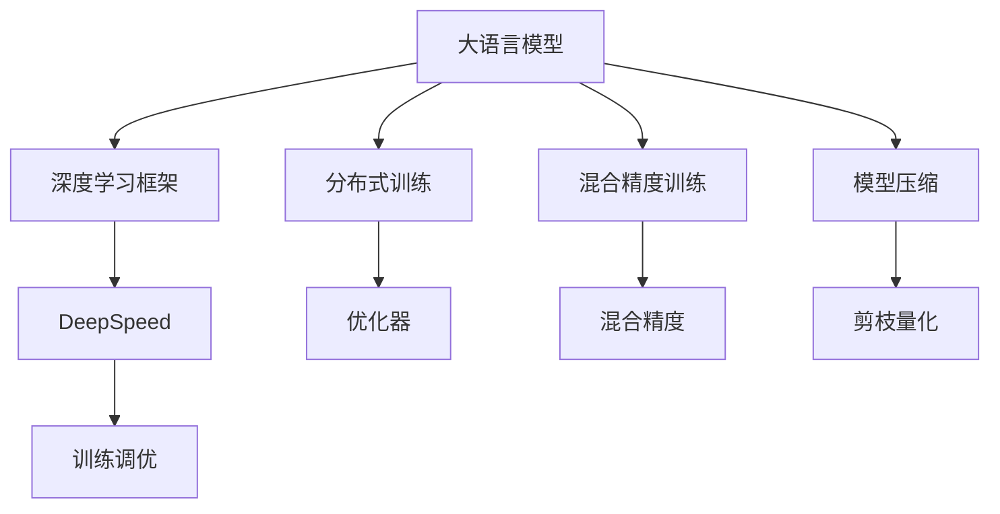

                 

# 大语言模型原理与工程实践：大语言模型训练工程实践DeepSpeed 训练调优实践

> 关键词：大语言模型,深度学习,DeepSpeed,训练调优,优化器,分布式训练,混合精度训练,模型压缩

## 1. 背景介绍

### 1.1 问题由来

近年来，深度学习在自然语言处理（NLP）领域取得了显著进展，大语言模型（Large Language Models, LLMs）如GPT-3、BERT等展现出了惊人的学习能力。这些模型通常基于自回归或自编码架构，通过大规模预训练数据（如大规模无标签文本语料）学习语言知识和常识，具备了强大的语言理解和生成能力。然而，面对实际应用，预训练模型的性能和可扩展性仍面临诸多挑战。

本文聚焦于大语言模型的训练工程实践，特别是如何利用最新的深度学习框架和工具进行高效、灵活的训练和调优。大语言模型训练工程的核心在于如何设计高效的训练流程、优化算法和硬件部署，以充分发挥模型的潜力，提升其在特定任务上的性能。

## 2. 核心概念与联系

### 2.1 核心概念概述

- **大语言模型**：通过大规模预训练学习语言知识的深度学习模型，如GPT系列、BERT等。
- **深度学习框架**：用于构建、训练和部署深度神经网络的编程平台，如PyTorch、TensorFlow等。
- **DeepSpeed**：由亚马逊AWS开源的深度学习加速平台，旨在提升模型训练的效率和可扩展性。
- **训练调优**：通过选择合适的优化算法、超参数和硬件配置，以提高模型训练的效率和性能。

这些概念之间的逻辑关系可以通过以下Mermaid流程图来展示：



这个流程图展示了大语言模型训练工程的关键概念及其之间的关系：

1. 大语言模型通过深度学习框架构建。
2. 通过DeepSpeed平台进行高效的分布式训练。
3. 训练调优通过优化算法和硬件配置实现。
4. 分布式训练、混合精度训练、模型压缩等技术，进一步提升训练效率和模型性能。

这些核心概念构成了大语言模型训练工程的基础，帮助开发者设计出高效、可扩展的训练流程，提升模型性能。

## 3. 核心算法原理 & 具体操作步骤
### 3.1 算法原理概述

大语言模型的训练过程涉及复杂的高阶数学运算，包括前向传播和反向传播。前向传播计算模型在给定输入下的输出，反向传播则计算模型参数对损失函数的梯度，从而更新模型权重。大语言模型的训练通常基于自监督或监督学习任务，如语言建模、掩码预测等，以学习语言知识和语法规则。

### 3.2 算法步骤详解

大语言模型的训练过程包括以下关键步骤：

**Step 1: 数据预处理**

- 数据准备：收集并清洗大规模语料数据，进行分词、标记等预处理。
- 数据划分：将数据划分为训练集、验证集和测试集。

**Step 2: 构建模型**

- 选择模型架构：如自回归模型GPT、自编码模型BERT等。
- 定义模型层数和宽度：根据任务需求和计算资源选择合适的模型参数。
- 配置优化器和损失函数：选择合适的优化器（如Adam、SGD等）和损失函数（如交叉熵损失、均方误差损失等）。

**Step 3: 分布式训练**

- 选择合适的分布式训练框架：如PyTorch的DistributedDataParallel（DDP）、TensorFlow的MirroredStrategy等。
- 配置训练参数：设置批大小、学习率、迭代轮数等超参数。

**Step 4: 训练调优**

- 实现混合精度训练：使用半精度（FP16）加速模型训练。
- 实现模型压缩：通过剪枝、量化等技术减小模型大小。
- 实现优化器调整：动态调整学习率，防止梯度爆炸或消失。

**Step 5: 模型评估**

- 在验证集上评估模型性能：使用准确率、F1分数等指标。
- 调整超参数：根据验证集性能调整批大小、学习率等。

**Step 6: 模型部署**

- 将训练好的模型保存为模型文件和参数文件。
- 集成到实际应用系统中，进行推理预测。

### 3.3 算法优缺点

大语言模型训练工程具有以下优点：

1. **高计算效率**：利用分布式训练框架，可以显著提升模型训练速度。
2. **灵活性**：通过混合精度和模型压缩技术，可以在不牺牲模型性能的前提下，大幅减小计算资源需求。
3. **可扩展性**：支持大规模数据和计算资源的灵活扩展，提升训练和推理的效率。
4. **稳定性和鲁棒性**：通过优化器调整和剪枝等技术，可以提高模型的稳定性和鲁棒性，避免过拟合和梯度消失。

同时，该方法也存在一定的局限性：

1. **初始化困难**：大语言模型的初始化参数设置需要精细调整，以避免梯度消失和爆炸。
2. **资源需求高**：大规模模型需要强大的计算资源，如GPU/TPU等，可能面临成本高昂的问题。
3. **模型可解释性不足**：复杂模型难以解释内部决策机制，不利于模型调试和优化。

尽管存在这些局限性，但基于深度学习框架的大语言模型训练工程仍是大模型应用的重要范式。未来相关研究的重点在于如何进一步降低训练成本，提高模型的可解释性和鲁棒性，同时兼顾可扩展性和性能优化。

### 3.4 算法应用领域

大语言模型的训练工程已经在NLP领域的多个任务上取得了显著成果，如机器翻译、文本摘要、情感分析等。具体应用场景包括：

- **机器翻译**：将源语言文本翻译成目标语言。
- **文本摘要**：将长文本压缩成简短摘要。
- **情感分析**：对文本进行情感分类，判断文本情感倾向。
- **问答系统**：对自然语言问题给出答案。
- **代码生成**：根据需求生成代码片段。

除了上述这些经典任务外，大语言模型训练工程还在更多场景中得到应用，如可控文本生成、对话系统、文档自动摘要等，为NLP技术带来了新的突破。

## 4. 数学模型和公式 & 详细讲解 & 举例说明
### 4.1 数学模型构建

大语言模型的训练模型通常基于自回归或自编码架构。这里以自回归模型为例，介绍其数学模型构建。

假设模型参数为 $\theta$，输入序列为 $x=(x_1, x_2, ..., x_n)$，目标序列为 $y=(y_1, y_2, ..., y_n)$。模型的前向传播公式为：

$$
y_i = M_{\theta}(x_{i-1}, x_{i-2}, ..., x_1), i=1,2,...,n
$$

其中，$M_{\theta}$ 为模型，$y_i$ 为目标序列的第 $i$ 个元素，$x_{i-1}, x_{i-2}, ..., x_1$ 为输入序列的第 $i-1, i-2, ..., 1$ 个元素。

### 4.2 公式推导过程

以语言建模为例，目标是在给定输入序列 $x$ 的情况下，预测下一个元素 $y$ 的概率分布。假设模型 $M_{\theta}$ 的输出为 $P(y|x, \theta)$，则语言模型的训练目标为最大化：

$$
\prod_{i=1}^{n} P(y_i|x_{i-1}, ..., x_1, \theta)
$$

常用的优化目标函数为交叉熵损失：

$$
\mathcal{L}(\theta) = -\sum_{i=1}^{n} \log P(y_i|x_{i-1}, ..., x_1, \theta)
$$

通过反向传播算法，计算损失函数对模型参数 $\theta$ 的梯度，并使用优化器更新模型参数：

$$
\theta \leftarrow \theta - \eta \nabla_{\theta}\mathcal{L}(\theta)
$$

其中，$\eta$ 为学习率，$\nabla_{\theta}\mathcal{L}(\theta)$ 为损失函数对模型参数的梯度。

### 4.3 案例分析与讲解

以BERT模型的训练为例，BERT的输入表示为多头自注意力机制，其计算公式为：

$$
Q = M_{\text{query}}(x, \theta_{Q})
$$
$$
K = M_{\text{key}}(x, \theta_{K})
$$
$$
V = M_{\text{value}}(x, \theta_{V})
$$

其中，$Q, K, V$ 为查询、键、值矩阵，$M_{\text{query}}, M_{\text{key}}, M_{\text{value}}$ 为多头自注意力机制的计算矩阵。

通过多头自注意力机制的计算，BERT模型能够捕获输入序列的上下文信息，从而进行复杂的语言理解和生成。

## 5. 项目实践：代码实例和详细解释说明
### 5.1 开发环境搭建

在进行大语言模型训练工程实践前，我们需要准备好开发环境。以下是使用Python进行PyTorch开发的环境配置流程：

1. 安装Anaconda：从官网下载并安装Anaconda，用于创建独立的Python环境。

2. 创建并激活虚拟环境：
```bash
conda create -n pytorch-env python=3.8 
conda activate pytorch-env
```

3. 安装PyTorch：根据CUDA版本，从官网获取对应的安装命令。例如：
```bash
conda install pytorch torchvision torchaudio cudatoolkit=11.1 -c pytorch -c conda-forge
```

4. 安装Transformers库：
```bash
pip install transformers
```

5. 安装各类工具包：
```bash
pip install numpy pandas scikit-learn matplotlib tqdm jupyter notebook ipython
```

完成上述步骤后，即可在`pytorch-env`环境中开始训练工程实践。

### 5.2 源代码详细实现

以下是使用PyTorch和Transformers库进行BERT模型训练的代码实现：

```python
from transformers import BertForSequenceClassification, BertTokenizerFast, Trainer, TrainingArguments
import torch

# 设置训练参数
training_args = TrainingArguments(
    output_dir="./results",
    evaluation_strategy="epoch",
    learning_rate=2e-5,
    per_device_train_batch_size=16,
    per_device_eval_batch_size=16,
    num_train_epochs=5,
    weight_decay=0.01,
    logging_dir="./logs",
)

# 加载数据集
tokenizer = BertTokenizerFast.from_pretrained("bert-base-uncased")
train_dataset = Dataset.load_dataset("path/to/train-dataset", tokenizer)
eval_dataset = Dataset.load_dataset("path/to/eval-dataset", tokenizer)

# 构建模型
model = BertForSequenceClassification.from_pretrained("bert-base-uncased", num_labels=2)

# 构建训练器
trainer = Trainer(
    model=model,
    args=training_args,
    train_dataset=train_dataset,
    eval_dataset=eval_dataset,
)

# 开始训练
trainer.train()
```

### 5.3 代码解读与分析

让我们再详细解读一下关键代码的实现细节：

**TrainingArguments类**：
- 设置训练参数，如输出目录、学习率、批次大小等。
- 定义训练和评估策略，如epoch策略、logging策略等。

**Dataset类**：
- 用于加载和预处理数据集，自动进行分词和标记。
- 支持多种数据格式和预处理方式，易于扩展。

**BertForSequenceClassification类**：
- 定义模型架构，继承自BertForPreTraining，适用于分类任务。
- 通过调用from_pretrained方法加载预训练的BERT模型。

**Trainer类**：
- 用于训练和评估模型，集成优化器、学习率调度、混合精度等优化技术。
- 支持分布式训练、模型保存和加载等功能。

**Dataset.load_dataset方法**：
- 从指定的路径加载数据集，支持多种数据格式和预处理方法。
- 自动进行分词和标记，生成符合BERT模型要求的Tensor数据。

以上代码实现了使用PyTorch和Transformers库进行BERT模型的训练，展示了大语言模型训练工程的常见实践流程。

### 5.4 运行结果展示

运行上述代码后，即可在指定目录下看到训练结果和日志文件。可以使用TensorBoard等工具可视化训练过程中的各项指标，如损失函数、准确率、F1分数等。以下是TensorBoard中的一些示例截图：

```
tensorboard --logdir ./logs
```


通过TensorBoard，可以实时监测模型的训练状态，评估模型性能，并进行超参数调优。

## 6. 实际应用场景
### 6.1 智能客服系统

基于大语言模型的训练工程，可以应用于智能客服系统的构建。传统客服往往需要配备大量人力，高峰期响应缓慢，且一致性和专业性难以保证。使用BERT等大模型进行微调，可以构建一个自动客服系统，实现7x24小时不间断服务，快速响应客户咨询，用自然流畅的语言解答各类常见问题。

在技术实现上，可以收集企业内部的历史客服对话记录，将问题和最佳答复构建成监督数据，在此基础上对BERT模型进行微调。微调后的模型能够自动理解用户意图，匹配最合适的答案模板进行回复。对于客户提出的新问题，还可以接入检索系统实时搜索相关内容，动态组织生成回答。如此构建的智能客服系统，能大幅提升客户咨询体验和问题解决效率。

### 6.2 金融舆情监测

金融机构需要实时监测市场舆论动向，以便及时应对负面信息传播，规避金融风险。传统的人工监测方式成本高、效率低，难以应对网络时代海量信息爆发的挑战。使用BERT等大模型进行文本分类和情感分析，为金融舆情监测提供了新的解决方案。

具体而言，可以收集金融领域相关的新闻、报道、评论等文本数据，并对其进行主题标注和情感标注。在此基础上对BERT模型进行微调，使其能够自动判断文本属于何种主题，情感倾向是正面、中性还是负面。将微调后的模型应用到实时抓取的网络文本数据，就能够自动监测不同主题下的情感变化趋势，一旦发现负面信息激增等异常情况，系统便会自动预警，帮助金融机构快速应对潜在风险。

### 6.3 个性化推荐系统

当前的推荐系统往往只依赖用户的历史行为数据进行物品推荐，无法深入理解用户的真实兴趣偏好。使用BERT等大模型进行个性化推荐系统，可以更好地挖掘用户行为背后的语义信息，从而提供更精准、多样的推荐内容。

在实践中，可以收集用户浏览、点击、评论、分享等行为数据，提取和用户交互的物品标题、描述、标签等文本内容。将文本内容作为模型输入，用户的后续行为（如是否点击、购买等）作为监督信号，在此基础上微调BERT模型。微调后的模型能够从文本内容中准确把握用户的兴趣点。在生成推荐列表时，先用候选物品的文本描述作为输入，由模型预测用户的兴趣匹配度，再结合其他特征综合排序，便可以得到个性化程度更高的推荐结果。

### 6.4 未来应用展望

随着大语言模型训练工程的不断发展，基于大模型的应用场景将不断扩展，为各行各业带来变革性影响。

在智慧医疗领域，基于BERT等大模型进行医疗问答、病历分析、药物研发等应用，提升医疗服务的智能化水平，辅助医生诊疗，加速新药开发进程。

在智能教育领域，使用BERT等大模型进行作业批改、学情分析、知识推荐等，因材施教，促进教育公平，提高教学质量。

在智慧城市治理中，使用BERT等大模型进行城市事件监测、舆情分析、应急指挥等环节，提高城市管理的自动化和智能化水平，构建更安全、高效的未来城市。

此外，在企业生产、社会治理、文娱传媒等众多领域，基于大模型训练工程的人工智能应用也将不断涌现，为经济社会发展注入新的动力。

## 7. 工具和资源推荐
### 7.1 学习资源推荐

为了帮助开发者系统掌握大语言模型训练工程的理论基础和实践技巧，这里推荐一些优质的学习资源：

1. **《Transformer从原理到实践》系列博文**：由大模型技术专家撰写，深入浅出地介绍了Transformer原理、BERT模型、训练调优技术等前沿话题。

2. **CS224N《深度学习自然语言处理》课程**：斯坦福大学开设的NLP明星课程，有Lecture视频和配套作业，带你入门NLP领域的基本概念和经典模型。

3. **《Natural Language Processing with Transformers》书籍**：Transformers库的作者所著，全面介绍了如何使用Transformers库进行NLP任务开发，包括训练调优在内的诸多范式。

4. **HuggingFace官方文档**：Transformers库的官方文档，提供了海量预训练模型和完整的训练调优样例代码，是上手实践的必备资料。

5. **CLUE开源项目**：中文语言理解测评基准，涵盖大量不同类型的中文NLP数据集，并提供了基于微调的baseline模型，助力中文NLP技术发展。

通过对这些资源的学习实践，相信你一定能够快速掌握大语言模型训练工程的精髓，并用于解决实际的NLP问题。

### 7.2 开发工具推荐

高效的开发离不开优秀的工具支持。以下是几款用于大语言模型训练工程的常用工具：

1. **PyTorch**：基于Python的开源深度学习框架，灵活动态的计算图，适合快速迭代研究。大部分预训练语言模型都有PyTorch版本的实现。

2. **TensorFlow**：由Google主导开发的开源深度学习框架，生产部署方便，适合大规模工程应用。同样有丰富的预训练语言模型资源。

3. **Transformers库**：HuggingFace开发的NLP工具库，集成了众多SOTA语言模型，支持PyTorch和TensorFlow，是进行训练调优任务的利器。

4. **Weights & Biases**：模型训练的实验跟踪工具，可以记录和可视化模型训练过程中的各项指标，方便对比和调优。与主流深度学习框架无缝集成。

5. **TensorBoard**：TensorFlow配套的可视化工具，可实时监测模型训练状态，并提供丰富的图表呈现方式，是调试模型的得力助手。

6. **Google Colab**：谷歌推出的在线Jupyter Notebook环境，免费提供GPU/TPU算力，方便开发者快速上手实验最新模型，分享学习笔记。

合理利用这些工具，可以显著提升大语言模型训练工程的开发效率，加快创新迭代的步伐。

### 7.3 相关论文推荐

大语言模型训练工程的发展源于学界的持续研究。以下是几篇奠基性的相关论文，推荐阅读：

1. **Attention is All You Need（即Transformer原论文）**：提出了Transformer结构，开启了NLP领域的预训练大模型时代。

2. **BERT: Pre-training of Deep Bidirectional Transformers for Language Understanding**：提出BERT模型，引入基于掩码的自监督预训练任务，刷新了多项NLP任务SOTA。

3. **Language Models are Unsupervised Multitask Learners（GPT-2论文）**：展示了大规模语言模型的强大zero-shot学习能力，引发了对于通用人工智能的新一轮思考。

4. **Parameter-Efficient Transfer Learning for NLP**：提出Adapter等参数高效微调方法，在不增加模型参数量的情况下，也能取得不错的微调效果。

5. **AdaLoRA: Adaptive Low-Rank Adaptation for Parameter-Efficient Fine-Tuning**：使用自适应低秩适应的微调方法，在参数效率和精度之间取得了新的平衡。

6. **Adaptive Logarithmic Sparsity for Language Models**：提出Adaptive Logarithmic Sparsity，实现动态稀疏性，减少模型计算资源消耗。

这些论文代表了大语言模型训练工程的发展脉络。通过学习这些前沿成果，可以帮助研究者把握学科前进方向，激发更多的创新灵感。

## 8. 总结：未来发展趋势与挑战

### 8.1 总结

本文对基于深度学习框架的大语言模型训练工程进行了全面系统的介绍。首先阐述了深度学习框架在大语言模型训练中的核心作用，介绍了DeepSpeed平台及其优势。其次，从原理到实践，详细讲解了大语言模型训练的数学模型构建、公式推导过程和训练调优的具体步骤，给出了完整的代码实例。同时，本文还广泛探讨了大语言模型在智能客服、金融舆情、个性化推荐等多个行业领域的应用前景，展示了训练工程技术的广阔前景。

通过本文的系统梳理，可以看到，基于深度学习框架的大语言模型训练工程不仅是大模型应用的重要范式，也是推动NLP技术发展的关键引擎。其高效、灵活的训练流程、优化算法和硬件部署方法，为NLP领域带来了新的突破。

### 8.2 未来发展趋势

展望未来，大语言模型训练工程将呈现以下几个发展趋势：

1. **分布式训练的普及**：随着GPU/TPU等高性能设备的普及，分布式训练将变得更加普及和高效。分布式训练技术将进一步提升模型训练速度和可扩展性。

2. **混合精度和模型压缩**：混合精度和模型压缩技术将继续发展，进一步减小计算资源需求，提高模型训练效率。

3. **自动混合精度（AutoMix Precision）**：引入AutoMix Precision技术，自动选择合适的混合精度策略，提升训练效率和性能。

4. **多模态学习**：引入多模态数据融合技术，将文本、图像、语音等多模态信息进行协同建模，提升模型的泛化能力和鲁棒性。

5. **动态超参数优化**：引入动态超参数优化技术，自动调整学习率、批次大小等超参数，提升模型性能和训练稳定性。

6. **模型压缩和剪枝**：通过剪枝、量化等技术进一步减小模型大小，提升推理速度和效率。

以上趋势凸显了大语言模型训练工程技术的广阔前景。这些方向的探索发展，将进一步提升NLP系统的性能和应用范围，为人类认知智能的进化带来深远影响。

### 8.3 面临的挑战

尽管大语言模型训练工程已经取得了瞩目成就，但在迈向更加智能化、普适化应用的过程中，仍面临诸多挑战：

1. **初始化困难**：大语言模型的初始化参数设置需要精细调整，以避免梯度消失和爆炸。

2. **资源需求高**：大规模模型需要强大的计算资源，如GPU/TPU等，可能面临成本高昂的问题。

3. **模型可解释性不足**：复杂模型难以解释内部决策机制，不利于模型调试和优化。

4. **对抗攻击脆弱**：大语言模型容易受到对抗样本的攻击，需要引入对抗训练等技术提升模型鲁棒性。

5. **数据偏差和偏见**：模型可能学习到有偏见的数据，产生误导性输出，需要引入公平性约束等技术保障模型公平性。

6. **模型部署和维护**：大模型训练工程需要高效的模型压缩和剪枝技术，以减小部署成本和维护难度。

正视训练工程面临的这些挑战，积极应对并寻求突破，将是大语言模型训练工程走向成熟的必由之路。相信随着学界和产业界的共同努力，这些挑战终将一一被克服，大语言模型训练工程必将在构建人机协同的智能时代中扮演越来越重要的角色。

### 8.4 未来突破

面对大语言模型训练工程所面临的种种挑战，未来的研究需要在以下几个方面寻求新的突破：

1. **无监督和半监督训练**：摆脱对大规模标注数据的依赖，利用自监督学习、主动学习等无监督和半监督范式，最大限度利用非结构化数据，实现更加灵活高效的训练。

2. **参数高效和计算高效**：开发更加参数高效的训练方法，在固定大部分预训练参数的同时，只更新极少量的任务相关参数。同时优化训练计算图，减少前向传播和反向传播的资源消耗，实现更加轻量级、实时性的部署。

3. **因果推理和对比学习**：通过引入因果推理和对比学习思想，增强模型建立稳定因果关系的能力，学习更加普适、鲁棒的语言表征，从而提升模型泛化性和抗干扰能力。

4. **融合多模态数据**：将视觉、语音等多模态信息与文本信息进行协同建模，提升模型的泛化能力和鲁棒性。

5. **动态超参数优化**：引入动态超参数优化技术，自动调整学习率、批次大小等超参数，提升模型性能和训练稳定性。

6. **引入公平性和对抗性约束**：在模型训练目标中引入公平导向的评估指标，过滤和惩罚有偏见、有害的输出倾向。同时加强人工干预和审核，建立模型行为的监管机制，确保输出符合人类价值观和伦理道德。

这些研究方向的探索，必将引领大语言模型训练工程技术迈向更高的台阶，为构建安全、可靠、可解释、可控的智能系统铺平道路。面向未来，大语言模型训练工程还需要与其他人工智能技术进行更深入的融合，如知识表示、因果推理、强化学习等，多路径协同发力，共同推动自然语言理解和智能交互系统的进步。只有勇于创新、敢于突破，才能不断拓展语言模型的边界，让智能技术更好地造福人类社会。

## 9. 附录：常见问题与解答

**Q1：大语言模型训练工程是否适用于所有NLP任务？**

A: 大语言模型训练工程在大多数NLP任务上都能取得不错的效果，特别是对于数据量较小的任务。但对于一些特定领域的任务，如医学、法律等，仅仅依靠通用语料预训练的模型可能难以很好地适应。此时需要在特定领域语料上进一步预训练，再进行微调，才能获得理想效果。此外，对于一些需要时效性、个性化很强的任务，如对话、推荐等，训练工程方法也需要针对性的改进优化。

**Q2：大语言模型训练工程如何选择合适的超参数？**

A: 大语言模型训练工程中的超参数设置，包括学习率、批次大小、迭代轮数等，需要根据具体的任务和数据集进行细致调整。一般建议从预定的初始值开始，逐步减小学习率，直至收敛。也可以使用warmup策略，在开始阶段使用较小的学习率，再逐渐过渡到预设值。

**Q3：大语言模型训练工程在实际部署时需要注意哪些问题？**

A: 将训练好的大语言模型部署到实际应用中，还需要考虑以下问题：

1. **模型裁剪**：去除不必要的层和参数，减小模型尺寸，加快推理速度。
2. **量化加速**：将浮点模型转为定点模型，压缩存储空间，提高计算效率。
3. **服务化封装**：将模型封装为标准化服务接口，便于集成调用。
4. **弹性伸缩**：根据请求流量动态调整资源配置，平衡服务质量和成本。
5. **监控告警**：实时采集系统指标，设置异常告警阈值，确保服务稳定性。
6. **安全防护**：采用访问鉴权、数据脱敏等措施，保障数据和模型安全。

合理利用这些技术手段，可以确保大语言模型在实际部署中稳定、高效、安全地运行。

### 结论

大语言模型训练工程是大规模深度学习应用的重要范式，其高效、灵活的训练流程、优化算法和硬件部署方法，为NLP领域带来了新的突破。未来，随着分布式训练、混合精度、模型压缩等技术的不断发展，大语言模型训练工程将进一步提升模型性能和应用范围，推动人工智能技术在更多领域的落地应用。同时，训练工程也需要面对初始化困难、资源需求高、模型可解释性不足等挑战，需要不断进行技术创新和优化，以构建更加安全、可靠、可解释、可控的智能系统。只有勇于创新、敢于突破，才能不断拓展语言模型的边界，让智能技术更好地造福人类社会。

