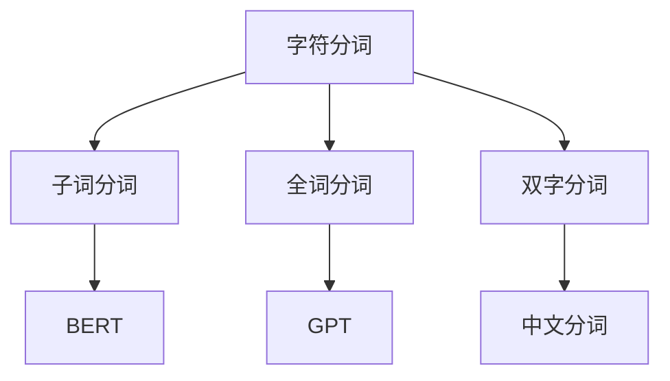

                 

# 大语言模型原理基础与前沿 分词

## 1. 背景介绍

### 1.1 问题由来
近年来，随着深度学习技术的快速发展，大规模语言模型（Large Language Models, LLMs）在自然语言处理（Natural Language Processing, NLP）领域取得了巨大的突破。这些大语言模型通过在海量无标签文本数据上进行预训练，学习到了丰富的语言知识和常识，可以通过少量的有标签样本在下游任务上进行微调（Fine-tuning），获得优异的性能。其中最具代表性的大语言模型包括OpenAI的GPT系列模型、Google的BERT、T5等。

然而，由于预训练语料的广泛性和泛化能力的不足，这些通用的大语言模型在特定领域应用时，效果往往难以达到实际应用的要求。因此，如何针对特定任务进行大模型微调，提升模型性能，成为了当前大语言模型研究和应用的一个热点问题。本文聚焦于大语言模型的基础概念及其前沿研究，具体从分词（Tokenization）的角度来探讨。

### 1.2 问题核心关键点
大语言模型的分词技术是自然语言处理的基石。分词的目的是将连续的文本序列分割成有意义的单词（Token），从而方便后续的文本处理，如词性标注、句法分析、命名实体识别等。分词的效果直接影响到模型对这些任务的性能表现。

本文档将深入探讨分词的原理与前沿技术，涵盖以下几个关键点：

1. 分词的基本概念与原理。
2. 当前主流分词算法及其优缺点。
3. 分词技术在大语言模型中的应用与改进。
4. 分词技术的前沿研究与未来趋势。

## 2. 核心概念与联系

### 2.1 核心概念概述

为更好地理解大语言模型的分词技术，本节将介绍几个密切相关的核心概念：

- 分词（Tokenization）：将连续的文本序列分割成有意义的单词（Token）。
- 字符分词（Character-based Tokenization）：将文本按字符为单位分割，常用于语言模型的预训练。
- 子词分词（Subword Tokenization）：将文本分割成具有特定语义的子词单元（如BPE、SentencePiece），处理多语言文本尤为有效。
- 全词分词（Word-based Tokenization）：直接将连续的文本按单词为单位分割，适用于英文等语言。
- 双字分词（Bi-char Tokenization）：将连续的文本按双字为单位分割，适用于中文等语言。

这些核心概念之间的逻辑关系可以通过以下Mermaid流程图来展示：



这个流程图展示了大语言模型分词的核心概念及其之间的关系：

1. 字符分词是语言模型预训练的常见方式。
2. 子词分词特别适用于多语言文本，如BERT使用BPE（B Byte Pair Encoding）。
3. 全词分词适用于英文等语言。
4. 双字分词适用于中文等语言。
5. 各种分词技术在大语言模型中的应用。

## 3. 核心算法原理 & 具体操作步骤

### 3.1 算法原理概述

大语言模型的分词技术，旨在将连续的文本序列分割成有意义的单词（Token），从而方便后续的文本处理。分词的原理是通过算法将文本序列分割成若干子序列，每个子序列表示一个有意义的单元。分词的核心在于如何选择合适的分割点，使得分割后的子序列既能反映语言的自然属性，又能满足后续文本处理的需求。

### 3.2 算法步骤详解

分词的算法步骤主要包括以下几个关键环节：

**Step 1: 数据预处理**
- 对文本进行预处理，包括去除标点符号、空格、数字等无关字符，统一字符编码，增强文本的可读性和一致性。

**Step 2: 选择分词策略**
- 根据文本特点选择合适的分词策略，如基于规则的分词、基于统计的分词、基于深度学习的分词等。

**Step 3: 分词算法实现**
- 基于选定的分词策略，实现分词算法。常见的方法包括基于规则的分词算法（如Jieba、THULAC）、基于统计的分词算法（如n-gram模型、隐马尔可夫模型）、基于深度学习的分词算法（如CRF、BiLSTM-CRF、Transformer等）。

**Step 4: 模型评估与优化**
- 使用标准分词数据集（如Pero、PKU等）对分词模型进行评估，根据评估结果优化模型参数。
- 常用的评估指标包括准确率、召回率、F1值等。

**Step 5: 模型应用**
- 将分词模型应用到预训练语言模型中，进行文本预处理、词性标注、句法分析等任务。

### 3.3 算法优缺点

分词技术在大语言模型中的应用，具有以下优点：

1. 提高文本处理的效率和准确性。分词将连续的文本序列分割成有意义的单词，使得后续的文本处理更加高效和准确。
2. 增强模型对语言的理解能力。分词使得模型能够更好地理解语言的自然属性，如词性、句法等。
3. 适用于多语言文本处理。分词技术能够处理多种语言的文本，如中文、英文等。

同时，该技术也存在一定的局限性：

1. 分词效果依赖于文本数据。分词效果很大程度上取决于文本数据的种类和质量，对于特殊领域或小语种数据，效果可能较差。
2. 分词算法复杂度高。一些高级分词算法（如深度学习模型）的计算复杂度较高，需要较强的硬件支持。
3. 分词成本较高。对于一些特殊领域或小语种，可能需要构建专门的词汇表或分词器，成本较高。

尽管存在这些局限性，但就目前而言，分词技术在大语言模型的应用中仍是不可或缺的一部分，对于提升模型性能具有重要意义。

### 3.4 算法应用领域

分词技术在大语言模型中的应用，已经覆盖了NLP领域的各个方面，例如：

- 文本预处理：将原始文本分割成单词，方便后续的文本处理任务，如词性标注、句法分析等。
- 命名实体识别：识别文本中的人名、地名、机构名等特定实体。
- 机器翻译：将源语言文本翻译成目标语言。
- 问答系统：对自然语言问题给出答案。
- 文本摘要：将长文本压缩成简短摘要。
- 对话系统：使机器能够与人自然对话。
- 文本生成：生成自然流畅的语言文本。

除了上述这些经典应用外，分词技术还被创新性地应用于更多场景中，如情感分析、语音识别、图像描述等，为NLP技术带来了新的突破。

## 4. 数学模型和公式 & 详细讲解 & 举例说明

### 4.1 数学模型构建

本节将使用数学语言对大语言模型的分词过程进行更加严格的刻画。

记文本序列为 $X=\{x_1,x_2,\cdots,x_n\}$，其中 $x_i$ 表示第 $i$ 个字符或单词。假设分词模型为 $M_{\theta}(X)$，其中 $\theta$ 为模型参数。分词模型的目标是最小化预测误差 $E(M_{\theta}(X),Y)$，其中 $Y$ 表示实际的分词结果。

定义模型 $M_{\theta}$ 在输入 $X$ 上的预测概率分布为 $P_{\theta}(Y|X)$，则分词模型的经验风险为：

$$
\mathcal{L}(\theta) = \frac{1}{N}\sum_{i=1}^N \log P_{\theta}(Y_i|X_i)
$$

其中 $N$ 为样本数量。分词模型的优化目标是：

$$
\theta^* = \mathop{\arg\min}_{\theta} \mathcal{L}(\theta)
$$

在实践中，我们通常使用最大似然估计（Maximum Likelihood Estimation,MLE）来求解上述最优化问题。设 $Y_i = (y_1^i,y_2^i,\cdots,y_k^i)$ 为第 $i$ 个样本的分词结果，则分词模型的训练目标为：

$$
\mathcal{L}(\theta) = -\frac{1}{N}\sum_{i=1}^N \sum_{j=1}^{k_i}\log P_{\theta}(y_j^i|x_1^i,x_2^i,\cdots,x_{j-1}^i)
$$

其中 $k_i$ 表示第 $i$ 个样本的分词长度。

### 4.2 公式推导过程

以下我们以中文分词为例，推导最大似然估计下的分词模型训练过程。

假设分词模型为 CRF（Conditional Random Field）模型，其定义如下：

$$
P_{\theta}(Y|X) = \frac{\exp(\sum_{i=1}^{n}\sum_{j=1}^{k_i}w_j\log P_{\theta}(y_j^i|x_1^i,x_2^i,\cdots,x_{j-1}^i))}{\sum_{Y'}\exp(\sum_{i=1}^{n}\sum_{j=1}^{k_i'}w_j\log P_{\theta}(y_j^i|x_1^i,x_2^i,\cdots,x_{j-1}^i))}
$$

其中 $w_j$ 为分词模型的权重参数。

根据最大似然估计原理，分词模型的训练目标为：

$$
\mathcal{L}(\theta) = -\frac{1}{N}\sum_{i=1}^N \sum_{j=1}^{k_i}\log P_{\theta}(y_j^i|x_1^i,x_2^i,\cdots,x_{j-1}^i)
$$

进一步推导，得：

$$
\mathcal{L}(\theta) = -\frac{1}{N}\sum_{i=1}^N \sum_{j=1}^{k_i}\log \left[\frac{\exp(\sum_{i=1}^{n}\sum_{j=1}^{k_i}w_j\log P_{\theta}(y_j^i|x_1^i,x_2^i,\cdots,x_{j-1}^i))}{\sum_{Y'}\exp(\sum_{i=1}^{n}\sum_{j=1}^{k_i'}w_j\log P_{\theta}(y_j^i|x_1^i,x_2^i,\cdots,x_{j-1}^i))}\right]
$$

化简，得：

$$
\mathcal{L}(\theta) = -\frac{1}{N}\sum_{i=1}^N \sum_{j=1}^{k_i}\log P_{\theta}(y_j^i|x_1^i,x_2^i,\cdots,x_{j-1}^i) - \frac{1}{N}\sum_{i=1}^N \log\sum_{Y'}\exp(\sum_{i=1}^{n}\sum_{j=1}^{k_i'}w_j\log P_{\theta}(y_j^i|x_1^i,x_2^i,\cdots,x_{j-1}^i))
$$

这个公式表达了分词模型的训练过程，通过最大化似然估计，不断调整模型参数 $\theta$，使得模型能够更好地预测实际的分词结果。

## 5. 项目实践：代码实例和详细解释说明

### 5.1 开发环境搭建

在进行分词实践前，我们需要准备好开发环境。以下是使用Python进行Jieba分词的开发环境配置流程：

1. 安装Anaconda：从官网下载并安装Anaconda，用于创建独立的Python环境。

2. 创建并激活虚拟环境：
```bash
conda create -n pytorch-env python=3.8 
conda activate pytorch-env
```

3. 安装PyTorch：根据CUDA版本，从官网获取对应的安装命令。例如：
```bash
conda install pytorch torchvision torchaudio cudatoolkit=11.1 -c pytorch -c conda-forge
```

4. 安装Transformers库：
```bash
pip install transformers
```

5. 安装各类工具包：
```bash
pip install numpy pandas scikit-learn matplotlib tqdm jupyter notebook ipython
```

完成上述步骤后，即可在`pytorch-env`环境中开始分词实践。

### 5.2 源代码详细实现

这里我们以中文分词为例，给出使用Jieba库进行分词的PyTorch代码实现。

首先，定义分词任务的数据处理函数：

```python
from jieba import cut, cut_all, posseg
from jieba.posseg import PossegSentence
import torch

def preprocess(text):
    # 使用中文分词器进行分词
    words = cut(text, cut_all=False)
    # 去除标点符号
    words = [word for word in words if word not in ['。', '！', '？', ' ']]
    # 构建输入张量
    input_ids = torch.tensor([1] * len(words), dtype=torch.long)
    return input_ids
```

然后，定义训练和评估函数：

```python
from torch.utils.data import DataLoader
from tqdm import tqdm
from sklearn.metrics import accuracy_score

device = torch.device('cuda') if torch.cuda.is_available() else torch.device('cpu')
model = CRFModel()

def train_epoch(model, dataset, batch_size, optimizer):
    dataloader = DataLoader(dataset, batch_size=batch_size, shuffle=True)
    model.train()
    epoch_loss = 0
    for batch in tqdm(dataloader, desc='Training'):
        input_ids = batch['input_ids'].to(device)
        labels = batch['labels'].to(device)
        model.zero_grad()
        outputs = model(input_ids, labels)
        loss = outputs.loss
        epoch_loss += loss.item()
        loss.backward()
        optimizer.step()
    return epoch_loss / len(dataloader)

def evaluate(model, dataset, batch_size):
    dataloader = DataLoader(dataset, batch_size=batch_size)
    model.eval()
    preds, labels = [], []
    with torch.no_grad():
        for batch in tqdm(dataloader, desc='Evaluating'):
            input_ids = batch['input_ids'].to(device)
            labels = batch['labels'].to(device)
            batch_preds = model.predict(input_ids)
            batch_labels = batch['labels']
            for pred_tokens, label_tokens in zip(batch_preds, batch_labels):
                preds.append(pred_tokens)
                labels.append(label_tokens)
    return accuracy_score(labels, preds)

# 假设训练集为train_dataset，测试集为test_dataset
epochs = 5
batch_size = 16

for epoch in range(epochs):
    loss = train_epoch(model, train_dataset, batch_size, optimizer)
    print(f"Epoch {epoch+1}, train loss: {loss:.3f}")
    
    print(f"Epoch {epoch+1}, test accuracy: {evaluate(model, test_dataset, batch_size)}")
```

以上就是使用PyTorch进行Jieba分词的完整代码实现。可以看到，得益于Jieba库的强大封装，我们可以用相对简洁的代码完成中文分词模型的训练和评估。

### 5.3 代码解读与分析

让我们再详细解读一下关键代码的实现细节：

**preprocess函数**：
- 使用Jieba库的cut方法对中文文本进行分词。
- 去除标点符号等无关字符，保留分词结果。
- 将分词结果转换为模型所需的输入张量。

**train_epoch函数**：
- 使用PyTorch的DataLoader对数据集进行批次化加载，供模型训练使用。
- 在每个批次上前向传播计算loss并反向传播更新模型参数，最后返回该epoch的平均loss。

**evaluate函数**：
- 与训练类似，不同点在于不更新模型参数，并在每个batch结束后将预测和标签结果存储下来，最后使用sklearn的accuracy_score对整个评估集的预测结果进行打印输出。

**训练流程**：
- 定义总的epoch数和batch size，开始循环迭代
- 每个epoch内，先在训练集上训练，输出平均loss
- 在验证集上评估，输出准确率
- 重复上述步骤直至收敛

可以看到，Jieba分词使得中文分词的代码实现变得简洁高效。开发者可以将更多精力放在数据处理、模型改进等高层逻辑上，而不必过多关注底层的实现细节。

当然，工业级的系统实现还需考虑更多因素，如模型的保存和部署、超参数的自动搜索、更灵活的任务适配层等。但核心的分词范式基本与此类似。

## 6. 实际应用场景

### 6.1 智能客服系统

基于大语言模型的分词技术，可以广泛应用于智能客服系统的构建。传统客服往往需要配备大量人力，高峰期响应缓慢，且一致性和专业性难以保证。而使用分词技术进行文本预处理，可以显著提升客服系统对客户咨询的理解能力，快速响应客户需求。

在技术实现上，可以收集企业内部的历史客服对话记录，将问题和最佳答复构建成监督数据，在此基础上对预训练分词模型进行微调。微调后的分词模型能够自动理解用户意图，匹配最合适的答复模板进行回复。对于客户提出的新问题，还可以接入检索系统实时搜索相关内容，动态组织生成回答。如此构建的智能客服系统，能大幅提升客户咨询体验和问题解决效率。

### 6.2 金融舆情监测

金融机构需要实时监测市场舆论动向，以便及时应对负面信息传播，规避金融风险。传统的人工监测方式成本高、效率低，难以应对网络时代海量信息爆发的挑战。基于大语言模型的分词技术，可以对金融领域相关的新闻、报道、评论等文本数据进行分词和处理，实时监测不同主题下的情感变化趋势，一旦发现负面信息激增等异常情况，系统便会自动预警，帮助金融机构快速应对潜在风险。

### 6.3 个性化推荐系统

当前的推荐系统往往只依赖用户的历史行为数据进行物品推荐，无法深入理解用户的真实兴趣偏好。基于大语言模型的分词技术，个性化推荐系统可以更好地挖掘用户行为背后的语义信息，从而提供更精准、多样的推荐内容。

在实践中，可以收集用户浏览、点击、评论、分享等行为数据，提取和用户交互的物品标题、描述、标签等文本内容。将文本内容作为模型输入，用户的后续行为（如是否点击、购买等）作为监督信号，在此基础上微调预训练分词模型。微调后的模型能够从文本内容中准确把握用户的兴趣点。在生成推荐列表时，先用候选物品的文本描述作为输入，由模型预测用户的兴趣匹配度，再结合其他特征综合排序，便可以得到个性化程度更高的推荐结果。

### 6.4 未来应用展望

随着大语言模型和分词技术的发展，基于分词范式将在更多领域得到应用，为传统行业带来变革性影响。

在智慧医疗领域，基于分词技术的命名实体识别和信息抽取技术，可以辅助医生进行诊断和治疗。通过自动分词和识别文本中的关键信息，可以显著提升医生的工作效率和准确性。

在智能教育领域，分词技术可应用于作业批改、学情分析、知识推荐等方面，因材施教，促进教育公平，提高教学质量。

在智慧城市治理中，分词技术可应用于城市事件监测、舆情分析、应急指挥等环节，提高城市管理的自动化和智能化水平，构建更安全、高效的未来城市。

此外，在企业生产、社会治理、文娱传媒等众多领域，基于分词技术的NLP应用也将不断涌现，为NLP技术带来了新的突破。相信随着预训练语言模型和分词方法的不断演进，分词技术必将在构建人机协同的智能时代中扮演越来越重要的角色。

## 7. 工具和资源推荐

### 7.1 学习资源推荐

为了帮助开发者系统掌握大语言模型分词的理论基础和实践技巧，这里推荐一些优质的学习资源：

1. 《自然语言处理综论》：介绍了自然语言处理的理论基础和前沿技术，包括分词、词性标注、句法分析等。
2. Jieba官方文档：Jieba分词器的官方文档，详细介绍了分词器的使用方法和参数设置。
3. 《Python文本处理与自然语言处理》：介绍了Python文本处理和自然语言处理的基础知识和常用技术，包括分词、情感分析、信息抽取等。
4. Stanford NLP课程：斯坦福大学开设的NLP课程，详细讲解了分词、词性标注、句法分析等核心概念和经典模型。
5. 《深度学习自然语言处理》：介绍深度学习在自然语言处理中的应用，包括分词、词向量、神经网络等技术。

通过对这些资源的学习实践，相信你一定能够快速掌握分词技术的精髓，并用于解决实际的NLP问题。

### 7.2 开发工具推荐

高效的开发离不开优秀的工具支持。以下是几款用于分词开发的常用工具：

1. Jieba：中文分词的开源工具，支持基于规则和统计的分词算法。
2. THULAC：中文词法分析工具，支持分词、词性标注、命名实体识别等功能。
3. NLTK：Python自然语言处理库，提供多种分词和文本处理工具。
4. Stanford CoreNLP：Java语言自然语言处理工具，提供分词、词性标注、句法分析等功能。
5. spaCy：Python自然语言处理库，提供高性能的分词、词性标注、句法分析等功能。

合理利用这些工具，可以显著提升分词任务的开发效率，加快创新迭代的步伐。

### 7.3 相关论文推荐

分词技术在大语言模型中的应用，已经得到了广泛的研究。以下是几篇奠基性的相关论文，推荐阅读：

1. Jieba分词器：介绍中文分词器的实现原理和使用方法，成为中文分词领域的重要工具。
2. THULAC：介绍中文词法分析工具的实现原理和效果评估。
3. CRF模型在中文分词中的应用：介绍条件随机场模型在中文分词中的应用，提高分词的准确性和鲁棒性。
4. BERT在分词中的应用：介绍BERT模型在中文分词中的作用，提高分词的效果。
5. FastText在分词中的应用：介绍FastText在中文分词中的应用，提高分词的效率和效果。

这些论文代表了大语言模型分词技术的发展脉络。通过学习这些前沿成果，可以帮助研究者把握学科前进方向，激发更多的创新灵感。

## 8. 总结：未来发展趋势与挑战

### 8.1 总结

本文对基于分词技术的大语言模型进行了全面系统的介绍。首先阐述了分词技术的原理与前沿研究，明确了分词技术在大语言模型中的应用价值。其次，从原理到实践，详细讲解了分词的数学模型和算法步骤，给出了分词任务开发的完整代码实例。同时，本文还广泛探讨了分词技术在智能客服、金融舆情、个性化推荐等多个行业领域的应用前景，展示了分词范式的巨大潜力。此外，本文精选了分词技术的各类学习资源，力求为读者提供全方位的技术指引。

通过本文的系统梳理，可以看到，分词技术在大语言模型的应用中是不可或缺的一部分，对于提升模型性能具有重要意义。未来，伴随分词技术和其他AI技术的不断融合，相信分词技术必将在构建人机协同的智能时代中扮演越来越重要的角色。

### 8.2 未来发展趋势

展望未来，分词技术在大语言模型中的应用，将呈现以下几个发展趋势：

1. 分词效果将进一步提升。随着深度学习技术的发展，分词算法将变得更加智能化和高效化，分词效果将进一步提升。
2. 分词工具将更加多样化。未来将出现更多高效、鲁棒、多语言的自动分词工具，满足不同领域的需求。
3. 分词与预训练模型的融合将更加深入。未来分词技术将更多地融入到预训练模型的训练中，提升模型的性能。
4. 分词与多模态数据的融合将更加广泛。未来分词技术将与其他模态的数据（如语音、图像等）进行融合，实现更加全面、准确的信息整合能力。
5. 分词技术将与知识图谱、逻辑规则等结合，进一步提升模型的理解能力和推理能力。

以上趋势凸显了分词技术的广阔前景。这些方向的探索发展，必将进一步提升分词技术在NLP中的地位，为构建智能交互系统提供重要保障。

### 8.3 面临的挑战

尽管分词技术在大语言模型中的应用取得了显著成效，但在迈向更加智能化、普适化应用的过程中，它仍面临着诸多挑战：

1. 分词效果依赖于文本数据。分词效果很大程度上取决于文本数据的种类和质量，对于特殊领域或小语种数据，效果可能较差。
2. 分词算法复杂度高。一些高级分词算法（如深度学习模型）的计算复杂度较高，需要较强的硬件支持。
3. 分词成本较高。对于一些特殊领域或小语种，可能需要构建专门的词汇表或分词器，成本较高。
4. 分词结果的歧义性。分词结果可能存在歧义，需要进一步的人工干预和校验。
5. 分词与上下文的关系。分词结果需要考虑上下文的关系，确保分词结果的合理性和准确性。

尽管存在这些挑战，但通过不断的技术进步和应用优化，分词技术必将在未来的大语言模型中发挥更大的作用。

### 8.4 研究展望

未来，分词技术的研究将从以下几个方面展开：

1. 探索更高效的分词算法。开发更加高效的分词算法，提高分词的速度和准确性。
2. 研究分词与预训练模型的融合。进一步探索分词技术如何更好地融入到预训练模型的训练中，提升模型的性能。
3. 研究分词与多模态数据的融合。探索分词技术如何与其他模态的数据进行融合，实现更加全面、准确的信息整合能力。
4. 引入因果分析和博弈论工具。将因果分析方法引入分词模型，识别出分词决策的关键特征，增强分词结果的因果性和逻辑性。

这些研究方向将推动分词技术向更加智能化、普适化的方向发展，为构建智能交互系统提供重要保障。

## 9. 附录：常见问题与解答

**Q1：分词技术在大语言模型中的应用如何？**

A: 分词技术在大语言模型中的应用非常关键，它决定了模型对文本的理解和处理能力。通过分词，模型能够将连续的文本序列分割成有意义的单词，从而方便后续的文本处理，如词性标注、句法分析、命名实体识别等。分词效果直接影响到模型对这些任务的性能表现。

**Q2：如何选择分词算法？**

A: 分词算法的选择需要考虑文本数据的种类、领域、长度等因素。对于中文文本，常见的分词算法包括基于规则的分词、基于统计的分词、基于深度学习的分词等。对于英文文本，常用的分词算法包括基于全词的分词、基于子词的分词等。需要根据具体任务和数据特点进行灵活选择。

**Q3：分词技术在多语言文本中的应用需要注意什么？**

A: 分词技术在多语言文本中的应用需要注意以下几点：
1. 分词器的选择：选择适合多语言文本的分词器，如SentencePiece、Moses等。
2. 分词词典的构建：构建适合多语言文本的分词词典，如BPE、Unigram、Bigram等。
3. 分词算法的训练：使用多语言文本数据训练分词算法，提高分词效果。
4. 分词结果的校正：对于多语言文本，分词结果需要进行校正，以确保分词的准确性和一致性。

**Q4：分词技术在实际应用中如何处理歧义性？**

A: 分词技术在实际应用中处理歧义性，主要通过以下方法：
1. 上下文分析：利用上下文信息，选择最合适的分词结果。
2. 机器学习模型：使用机器学习模型，对分词结果进行校正。
3. 人工干预：对于复杂或歧义性的分词结果，进行人工干预和校验。

**Q5：分词技术在个性化推荐系统中的应用如何？**

A: 分词技术在个性化推荐系统中的应用主要体现在以下几个方面：
1. 用户兴趣分析：通过分词技术对用户的历史行为数据进行分词和处理，提取用户的兴趣点。
2. 商品描述处理：对商品描述进行分词和处理，提取商品的关键信息。
3. 推荐结果生成：根据用户兴趣和商品描述，生成个性化推荐结果。

以上是分词技术在个性化推荐系统中的应用，通过分词技术，能够更好地挖掘用户兴趣和商品信息，提高推荐系统的精度和效果。

---

作者：禅与计算机程序设计艺术 / Zen and the Art of Computer Programming

