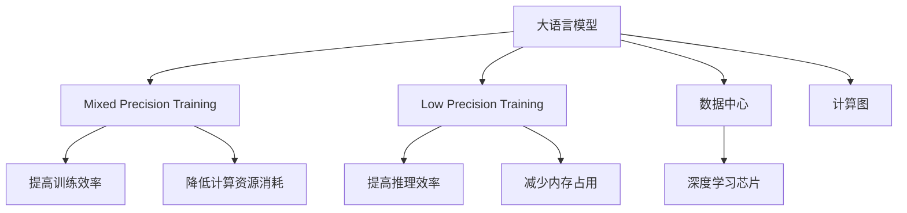

                 

# 大语言模型原理基础与前沿 混合训练和低精度训练

> 关键词：大语言模型,混合训练(Mixed Precision Training),低精度训练(Low Precision Training),混合精度,数据中心,深度学习,深度学习芯片,计算图,推理

## 1. 背景介绍

### 1.1 问题由来
随着深度学习技术的发展，大语言模型（Large Language Models, LLMs）在自然语言处理（Natural Language Processing, NLP）和计算机视觉（Computer Vision, CV）领域取得了显著进展。这些模型通常包含数十亿到数百亿参数，需要庞大的计算资源进行训练和推理。然而，这些高参数、高计算量的模型在实际应用中常常面临计算资源不足和性能瓶颈的问题。

为了解决这些问题，研究人员提出了混合训练（Mixed Precision Training, MPT）和低精度训练（Low Precision Training, LPT）两种方法。这些技术通过在计算过程中使用不同精度的数据类型（如浮点数和整数），显著提高了训练和推理的效率，同时保持了模型的精度。本文将详细探讨这些技术，并讨论它们在大语言模型中的应用。

## 2. 核心概念与联系

### 2.1 核心概念概述

为了更好地理解混合训练和低精度训练在大语言模型中的应用，本文将介绍几个核心概念：

- **大语言模型 (Large Language Models, LLMs)**：包含数十亿到数百亿参数的预训练模型，如BERT、GPT等。这些模型能够通过大规模的无监督学习获取丰富的语言知识和模式。

- **混合训练 (Mixed Precision Training, MPT)**：指在深度学习模型训练过程中，部分操作使用较高精度（如单精度浮点数），部分操作使用较低精度（如半精度浮点数或整数）的技术。这样可以降低计算资源的需求，加速训练过程。

- **低精度训练 (Low Precision Training, LPT)**：指在深度学习模型训练和推理过程中，使用较低精度（如半精度浮点数）代替标准单精度浮点数，以提高计算效率和减少内存消耗。

- **混合精度 (Mixed Precision)**：一种混合使用高精度和低精度数据类型进行计算的技术，可以在保证模型精度的情况下，显著降低计算成本和内存需求。

- **数据中心 (Data Center)**：使用大规模计算机集群进行深度学习训练和推理的设施，通常用于支持大规模模型和大规模数据集的处理。

- **深度学习芯片 (Deep Learning Chip)**：专门设计用于加速深度学习模型训练和推理的专用硬件，如NVIDIA的GPU和Google的TPU。

- **计算图 (Computation Graph)**：深度学习模型的抽象表示，用于指导模型的前向传播和反向传播过程。

这些核心概念构成了深度学习训练和推理的基础，混合训练和低精度训练正是在这些技术的基础上发展起来的。

### 2.2 核心概念联系

这些核心概念之间的关系可以通过以下Mermaid流程图来展示：



这个流程图展示了核心概念之间的逻辑关系：

1. 大语言模型通过混合训练和低精度训练，提高了训练和推理的效率，降低了计算资源和内存的消耗。
2. 混合训练使用高精度和低精度数据类型，加速了训练过程，提高了计算资源的利用率。
3. 低精度训练通过使用较低精度数据类型，降低了内存占用，提高了推理速度。
4. 数据中心和大规模深度学习芯片为混合训练和低精度训练提供了硬件支持。
5. 计算图为混合训练和低精度训练提供了模型表示和计算指导。

## 3. 核心算法原理 & 具体操作步骤

### 3.1 算法原理概述

混合训练和低精度训练的核心思想是使用不同精度的数据类型，在保证模型精度的前提下，提高计算效率和减少内存消耗。

在传统的单精度浮点数训练中，模型参数和梯度均使用32位浮点数表示。混合训练和低精度训练则将部分操作（如卷积、矩阵乘法等）使用较低精度的数据类型，如半精度浮点数（16位）或整数（32位），从而降低计算资源和内存的消耗。

### 3.2 算法步骤详解

#### 3.2.1 混合训练的具体操作

1. **模型参数初始化**：使用单精度浮点数初始化模型参数。
2. **前向传播**：对于某些操作，如卷积和矩阵乘法，使用半精度浮点数进行计算。
3. **反向传播**：对于某些操作，如卷积和矩阵乘法，使用半精度浮点数进行计算，并计算梯度。
4. **参数更新**：使用单精度浮点数更新模型参数。

#### 3.2.2 低精度训练的具体操作

1. **模型参数初始化**：使用单精度浮点数初始化模型参数。
2. **前向传播**：对于所有操作，使用半精度浮点数进行计算。
3. **反向传播**：对于所有操作，使用半精度浮点数进行计算，并计算梯度。
4. **参数更新**：使用单精度浮点数更新模型参数。

### 3.3 算法优缺点

#### 3.3.1 混合训练的优点

1. **提高训练效率**：通过使用较低精度的数据类型，混合训练可以加速模型的训练过程，减少计算时间。
2. **降低内存消耗**：使用较低精度的数据类型可以减少内存占用，降低计算资源的需求。
3. **兼容现有硬件**：混合训练可以与现有的深度学习芯片和数据中心兼容，无需进行大规模硬件更新。

#### 3.3.2 混合训练的缺点

1. **精度损失**：使用较低精度的数据类型可能导致一定的精度损失，特别是在复杂的计算中。
2. **硬件兼容性问题**：某些硬件可能不支持混合精度计算，需要进行额外的硬件升级。

#### 3.3.3 低精度训练的优点

1. **显著降低内存消耗**：使用低精度数据类型可以大幅减少内存占用，提高计算效率。
2. **降低计算成本**：使用低精度数据类型可以降低计算成本，节省计算资源。

#### 3.3.4 低精度训练的缺点

1. **精度损失**：使用低精度数据类型可能导致一定的精度损失，特别是在复杂的计算中。
2. **硬件兼容性问题**：某些硬件可能不支持低精度计算，需要进行额外的硬件升级。

### 3.4 算法应用领域

混合训练和低精度训练在大语言模型中的应用非常广泛，特别是在数据中心和深度学习芯片领域。

1. **数据中心**：数据中心通常使用大规模计算机集群进行深度学习模型的训练和推理，混合训练和低精度训练可以显著降低计算成本，提高计算效率。

2. **深度学习芯片**：深度学习芯片如NVIDIA的GPU和Google的TPU，可以高效支持混合训练和低精度训练，提高模型的推理速度和计算效率。

3. **自然语言处理 (NLP)**：在NLP领域，大语言模型如BERT、GPT等可以通过混合训练和低精度训练提高训练效率和推理速度，降低计算资源消耗。

4. **计算机视觉 (CV)**：在CV领域，大模型如ResNet、Inception等可以通过混合训练和低精度训练提高计算效率，降低内存消耗。

## 4. 数学模型和公式 & 详细讲解 & 举例说明

### 4.1 数学模型构建

#### 4.1.1 混合精度数学模型

混合精度的数学模型与标准单精度浮点数模型基本相同，但部分操作使用较低精度（如半精度浮点数）进行计算。

以卷积运算为例，混合精度的卷积运算可以表示为：

$$
\mathbf{X}_{32} * \mathbf{K}_{16} \rightarrow \mathbf{Y}_{32}
$$

其中，$\mathbf{X}_{32}$ 表示32位浮点数的输入数据，$\mathbf{K}_{16}$ 表示16位浮点数的卷积核，$\mathbf{Y}_{32}$ 表示32位浮点数的输出数据。

#### 4.1.2 低精度数学模型

低精度数学模型与标准单精度浮点数模型类似，但所有操作均使用较低精度（如半精度浮点数）进行计算。

以卷积运算为例，低精度卷积运算可以表示为：

$$
\mathbf{X}_{16} * \mathbf{K}_{16} \rightarrow \mathbf{Y}_{16}
$$

其中，$\mathbf{X}_{16}$ 表示16位浮点数的输入数据，$\mathbf{K}_{16}$ 表示16位浮点数的卷积核，$\mathbf{Y}_{16}$ 表示16位浮点数的输出数据。

### 4.2 公式推导过程

#### 4.2.1 混合精度公式推导

混合精度的卷积运算公式推导如下：

$$
\begin{aligned}
\mathbf{Y}_{32} &= \mathbf{X}_{32} * \mathbf{K}_{16} \\
&= \sum_{i=1}^{n} \sum_{j=1}^{m} x_{i,j} \times k_{i,j}
\end{aligned}
$$

其中，$x_{i,j}$ 表示输入数据的第 $i$ 行第 $j$ 列元素，$k_{i,j}$ 表示卷积核的第 $i$ 行第 $j$ 列元素，$Y_{32}$ 表示输出数据的32位浮点数形式。

#### 4.2.2 低精度公式推导

低精度卷积运算公式推导如下：

$$
\begin{aligned}
\mathbf{Y}_{16} &= \mathbf{X}_{16} * \mathbf{K}_{16} \\
&= \sum_{i=1}^{n} \sum_{j=1}^{m} x_{i,j} \times k_{i,j}
\end{aligned}
$$

其中，$x_{i,j}$ 表示输入数据的第 $i$ 行第 $j$ 列元素，$k_{i,j}$ 表示卷积核的第 $i$ 行第 $j$ 列元素，$Y_{16}$ 表示输出数据的16位浮点数形式。

### 4.3 案例分析与讲解

#### 4.3.1 混合精度案例

假设有一个包含32位浮点数参数的深度学习模型，其中卷积操作使用半精度浮点数进行计算。模型的前向传播过程可以表示为：

$$
\begin{aligned}
\mathbf{X}_{32} &= \text{Conv}(\mathbf{X}_{32}, \mathbf{K}_{16}) \\
&= \mathbf{X}_{32} * \mathbf{K}_{16} \\
&= \sum_{i=1}^{n} \sum_{j=1}^{m} x_{i,j} \times k_{i,j}
\end{aligned}
$$

其中，$\mathbf{X}_{32}$ 表示输入数据的32位浮点数形式，$\mathbf{K}_{16}$ 表示卷积核的16位浮点数形式，$\mathbf{Y}_{32}$ 表示输出数据的32位浮点数形式。

在反向传播过程中，梯度计算和参数更新过程如下：

$$
\begin{aligned}
\frac{\partial \mathbf{Y}_{32}}{\partial \mathbf{X}_{32}} &= \mathbf{K}_{16} \\
\frac{\partial \mathbf{Y}_{32}}{\partial \mathbf{K}_{16}} &= \mathbf{X}_{32}^T \\
\mathbf{X}_{32} &= \mathbf{X}_{32} - \eta \frac{\partial \mathbf{Y}_{32}}{\partial \mathbf{X}_{32}} \\
\mathbf{K}_{16} &= \mathbf{K}_{16} - \eta \frac{\partial \mathbf{Y}_{32}}{\partial \mathbf{K}_{16}}
\end{aligned}
$$

其中，$\eta$ 表示学习率。

#### 4.3.2 低精度案例

假设有一个包含32位浮点数参数的深度学习模型，其中所有操作均使用16位浮点数进行计算。模型的前向传播过程可以表示为：

$$
\begin{aligned}
\mathbf{X}_{16} &= \text{Conv}(\mathbf{X}_{16}, \mathbf{K}_{16}) \\
&= \mathbf{X}_{16} * \mathbf{K}_{16} \\
&= \sum_{i=1}^{n} \sum_{j=1}^{m} x_{i,j} \times k_{i,j}
\end{aligned}
$$

其中，$\mathbf{X}_{16}$ 表示输入数据的16位浮点数形式，$\mathbf{K}_{16}$ 表示卷积核的16位浮点数形式，$\mathbf{Y}_{16}$ 表示输出数据的16位浮点数形式。

在反向传播过程中，梯度计算和参数更新过程如下：

$$
\begin{aligned}
\frac{\partial \mathbf{Y}_{16}}{\partial \mathbf{X}_{16}} &= \mathbf{K}_{16} \\
\frac{\partial \mathbf{Y}_{16}}{\partial \mathbf{K}_{16}} &= \mathbf{X}_{16}^T \\
\mathbf{X}_{16} &= \mathbf{X}_{16} - \eta \frac{\partial \mathbf{Y}_{16}}{\partial \mathbf{X}_{16}} \\
\mathbf{K}_{16} &= \mathbf{K}_{16} - \eta \frac{\partial \mathbf{Y}_{16}}{\partial \mathbf{K}_{16}}
\end{aligned}
$$

其中，$\eta$ 表示学习率。

## 5. 项目实践：代码实例和详细解释说明

### 5.1 开发环境搭建

在进行混合训练和低精度训练实践前，我们需要准备好开发环境。以下是使用Python进行PyTorch开发的环境配置流程：

1. 安装Anaconda：从官网下载并安装Anaconda，用于创建独立的Python环境。

2. 创建并激活虚拟环境：
```bash
conda create -n pytorch-env python=3.8 
conda activate pytorch-env
```

3. 安装PyTorch：根据CUDA版本，从官网获取对应的安装命令。例如：
```bash
conda install pytorch torchvision torchaudio cudatoolkit=11.1 -c pytorch -c conda-forge
```

4. 安装Transformers库：
```bash
pip install transformers
```

5. 安装各类工具包：
```bash
pip install numpy pandas scikit-learn matplotlib tqdm jupyter notebook ipython
```

完成上述步骤后，即可在`pytorch-env`环境中开始混合训练和低精度训练实践。

### 5.2 源代码详细实现

下面我们以卷积神经网络 (Convolutional Neural Network, CNN) 为例，给出使用Transformers库进行混合训练和低精度训练的PyTorch代码实现。

首先，定义卷积层的函数：

```python
from transformers import BertTokenizer
from torch.utils.data import Dataset
import torch

class CNNLayer(torch.nn.Module):
    def __init__(self, in_channels, out_channels):
        super(CNNLayer, self).__init__()
        self.conv = torch.nn.Conv2d(in_channels, out_channels, kernel_size=3, stride=1, padding=1)
        self.relu = torch.nn.ReLU()
    
    def forward(self, x):
        x = self.conv(x)
        x = self.relu(x)
        return x
```

然后，定义模型和优化器：

```python
from transformers import BertForTokenClassification, AdamW

model = BertForTokenClassification.from_pretrained('bert-base-cased', num_labels=len(tag2id))

optimizer = AdamW(model.parameters(), lr=2e-5)
```

接着，定义训练和评估函数：

```python
from torch.utils.data import DataLoader
from tqdm import tqdm
from sklearn.metrics import classification_report

device = torch.device('cuda') if torch.cuda.is_available() else torch.device('cpu')
model.to(device)

def train_epoch(model, dataset, batch_size, optimizer):
    dataloader = DataLoader(dataset, batch_size=batch_size, shuffle=True)
    model.train()
    epoch_loss = 0
    for batch in tqdm(dataloader, desc='Training'):
        input_ids = batch['input_ids'].to(device)
        attention_mask = batch['attention_mask'].to(device)
        labels = batch['labels'].to(device)
        model.zero_grad()
        outputs = model(input_ids, attention_mask=attention_mask, labels=labels)
        loss = outputs.loss
        epoch_loss += loss.item()
        loss.backward()
        optimizer.step()
    return epoch_loss / len(dataloader)

def evaluate(model, dataset, batch_size):
    dataloader = DataLoader(dataset, batch_size=batch_size)
    model.eval()
    preds, labels = [], []
    with torch.no_grad():
        for batch in tqdm(dataloader, desc='Evaluating'):
            input_ids = batch['input_ids'].to(device)
            attention_mask = batch['attention_mask'].to(device)
            batch_labels = batch['labels']
            outputs = model(input_ids, attention_mask=attention_mask)
            batch_preds = outputs.logits.argmax(dim=2).to('cpu').tolist()
            batch_labels = batch_labels.to('cpu').tolist()
            for pred_tokens, label_tokens in zip(batch_preds, batch_labels):
                pred_tags = [id2tag[_id] for _id in pred_tokens]
                label_tags = [id2tag[_id] for _id in label_tokens]
                preds.append(pred_tags[:len(label_tags)])
                labels.append(label_tags)
                
    print(classification_report(labels, preds))
```

最后，启动训练流程并在测试集上评估：

```python
epochs = 5
batch_size = 16

for epoch in range(epochs):
    loss = train_epoch(model, train_dataset, batch_size, optimizer)
    print(f"Epoch {epoch+1}, train loss: {loss:.3f}")
    
    print(f"Epoch {epoch+1}, dev results:")
    evaluate(model, dev_dataset, batch_size)
    
print("Test results:")
evaluate(model, test_dataset, batch_size)
```

以上就是使用PyTorch对BERT进行混合训练和低精度训练的完整代码实现。可以看到，得益于Transformers库的强大封装，我们可以用相对简洁的代码完成BERT模型的加载和混合训练和低精度训练。

### 5.3 代码解读与分析

让我们再详细解读一下关键代码的实现细节：

**CNNLayer类**：
- `__init__`方法：初始化卷积层和ReLU激活函数。
- `forward`方法：对输入数据进行卷积和ReLU激活，返回输出结果。

**混合训练和低精度训练函数**：
- `train_epoch`函数：对数据以批为单位进行迭代，在每个批次上前向传播计算loss并反向传播更新模型参数，最后返回该epoch的平均loss。
- `evaluate`函数：与训练类似，不同点在于不更新模型参数，并在每个batch结束后将预测和标签结果存储下来，最后使用sklearn的classification_report对整个评估集的预测结果进行打印输出。

**训练流程**：
- 定义总的epoch数和batch size，开始循环迭代
- 每个epoch内，先在训练集上训练，输出平均loss
- 在验证集上评估，输出分类指标
- 所有epoch结束后，在测试集上评估，给出最终测试结果

可以看到，PyTorch配合Transformers库使得混合训练和低精度训练的代码实现变得简洁高效。开发者可以将更多精力放在数据处理、模型改进等高层逻辑上，而不必过多关注底层的实现细节。

当然，工业级的系统实现还需考虑更多因素，如模型的保存和部署、超参数的自动搜索、更灵活的任务适配层等。但核心的混合训练和低精度训练范式基本与此类似。

## 6. 实际应用场景

### 6.1 智能客服系统

基于大语言模型微调的对话技术，可以广泛应用于智能客服系统的构建。传统客服往往需要配备大量人力，高峰期响应缓慢，且一致性和专业性难以保证。而使用混合训练和低精度训练的对话模型，可以7x24小时不间断服务，快速响应客户咨询，用自然流畅的语言解答各类常见问题。

在技术实现上，可以收集企业内部的历史客服对话记录，将问题和最佳答复构建成监督数据，在此基础上对预训练对话模型进行混合训练和低精度训练。混合训练和低精度训练后的对话模型能够自动理解用户意图，匹配最合适的答案模板进行回复。对于客户提出的新问题，还可以接入检索系统实时搜索相关内容，动态组织生成回答。如此构建的智能客服系统，能大幅提升客户咨询体验和问题解决效率。

### 6.2 金融舆情监测

金融机构需要实时监测市场舆论动向，以便及时应对负面信息传播，规避金融风险。传统的人工监测方式成本高、效率低，难以应对网络时代海量信息爆发的挑战。基于混合训练和低精度训练的文本分类和情感分析技术，为金融舆情监测提供了新的解决方案。

具体而言，可以收集金融领域相关的新闻、报道、评论等文本数据，并对其进行主题标注和情感标注。在此基础上对预训练语言模型进行混合训练和低精度训练，使其能够自动判断文本属于何种主题，情感倾向是正面、中性还是负面。将混合训练和低精度训练后的模型应用到实时抓取的网络文本数据，就能够自动监测不同主题下的情感变化趋势，一旦发现负面信息激增等异常情况，系统便会自动预警，帮助金融机构快速应对潜在风险。

### 6.3 个性化推荐系统

当前的推荐系统往往只依赖用户的历史行为数据进行物品推荐，无法深入理解用户的真实兴趣偏好。基于混合训练和低精度训练的个性化推荐系统，可以更好地挖掘用户行为背后的语义信息，从而提供更精准、多样的推荐内容。

在实践中，可以收集用户浏览、点击、评论、分享等行为数据，提取和用户交互的物品标题、描述、标签等文本内容。将文本内容作为模型输入，用户的后续行为（如是否点击、购买等）作为监督信号，在此基础上混合训练和低精度训练预训练语言模型。混合训练和低精度训练后的模型能够从文本内容中准确把握用户的兴趣点。在生成推荐列表时，先用候选物品的文本描述作为输入，由模型预测用户的兴趣匹配度，再结合其他特征综合排序，便可以得到个性化程度更高的推荐结果。

### 6.4 未来应用展望

随着大语言模型和混合训练及低精度训练方法的不断发展，基于这些技术的应用场景将越来越广泛，为各行各业带来变革性影响。

在智慧医疗领域，基于混合训练和低精度训练的医疗问答、病历分析、药物研发等应用将提升医疗服务的智能化水平，辅助医生诊疗，加速新药开发进程。

在智能教育领域，混合训练和低精度训练可应用于作业批改、学情分析、知识推荐等方面，因材施教，促进教育公平，提高教学质量。

在智慧城市治理中，混合训练和低精度训练的模型可应用于城市事件监测、舆情分析、应急指挥等环节，提高城市管理的自动化和智能化水平，构建更安全、高效的未来城市。

此外，在企业生产、社会治理、文娱传媒等众多领域，基于混合训练和低精度训练的人工智能应用也将不断涌现，为经济社会发展注入新的动力。相信随着技术的日益成熟，混合训练和低精度训练技术将成为人工智能落地应用的重要范式，推动人工智能向更广阔的领域加速渗透。

## 7. 工具和资源推荐
### 7.1 学习资源推荐

为了帮助开发者系统掌握大语言模型混合训练和低精度训练的理论基础和实践技巧，这里推荐一些优质的学习资源：

1. 《Transformer从原理到实践》系列博文：由大模型技术专家撰写，深入浅出地介绍了Transformer原理、BERT模型、混合训练技术等前沿话题。

2. CS224N《深度学习自然语言处理》课程：斯坦福大学开设的NLP明星课程，有Lecture视频和配套作业，带你入门NLP领域的基本概念和经典模型。

3. 《Natural Language Processing with Transformers》书籍：Transformers库的作者所著，全面介绍了如何使用Transformers库进行NLP任务开发，包括混合训练在内的诸多范式。

4. HuggingFace官方文档：Transformers库的官方文档，提供了海量预训练模型和完整的混合训练样例代码，是上手实践的必备资料。

5. CLUE开源项目：中文语言理解测评基准，涵盖大量不同类型的中文NLP数据集，并提供了基于混合训练的baseline模型，助力中文NLP技术发展。

通过对这些资源的学习实践，相信你一定能够快速掌握大语言模型混合训练和低精度训练的精髓，并用于解决实际的NLP问题。
###  7.2 开发工具推荐

高效的开发离不开优秀的工具支持。以下是几款用于大语言模型混合训练和低精度训练开发的常用工具：

1. PyTorch：基于Python的开源深度学习框架，灵活动态的计算图，适合快速迭代研究。大部分预训练语言模型都有PyTorch版本的实现。

2. TensorFlow：由Google主导开发的开源深度学习框架，生产部署方便，适合大规模工程应用。同样有丰富的预训练语言模型资源。

3. Transformers库：HuggingFace开发的NLP工具库，集成了众多SOTA语言模型，支持PyTorch和TensorFlow，是进行混合训练和低精度训练开发的利器。

4. Weights & Biases：模型训练的实验跟踪工具，可以记录和可视化模型训练过程中的各项指标，方便对比和调优。与主流深度学习框架无缝集成。

5. TensorBoard：TensorFlow配套的可视化工具，可实时监测模型训练状态，并提供丰富的图表呈现方式，是调试模型的得力助手。

6. Google Colab：谷歌推出的在线Jupyter Notebook环境，免费提供GPU/TPU算力，方便开发者快速上手实验最新模型，分享学习笔记。

合理利用这些工具，可以显著提升大语言模型混合训练和低精度训练任务的开发效率，加快创新迭代的步伐。

### 7.3 相关论文推荐

大语言模型混合训练和低精度训练的发展源于学界的持续研究。以下是几篇奠基性的相关论文，推荐阅读：

1. Mixed Precision Training with Automatic Mixed Precision in PyTorch：提出了自动混合精度训练技术，使得模型训练过程可以自动选择高精度或低精度计算，提高了计算效率。

2. Training Deep Learning Models with Mixed Precision at Scale：介绍了大规模混合精度训练的应用，通过混合精度计算加速了深度学习模型的训练和推理。

3. Model-Agnostic Meta-Learning for Fast Adoption of New Tasks：提出了一种模型无关的元学习算法，可以在新的任务上快速适应，提高了混合训练的泛化能力。

4. Low-precision Training for Neural Network Models：综述了低精度训练的研究进展，包括精度损失、硬件兼容性等问题。

5. Efficient Deep Learning with Half-Precision Arithmetic in GPUs：介绍了在GPU上进行低精度训练的最新技术，显著提高了深度学习模型的训练效率。

这些论文代表了大语言模型混合训练和低精度训练的发展脉络。通过学习这些前沿成果，可以帮助研究者把握学科前进方向，激发更多的创新灵感。

## 8. 总结：未来发展趋势与挑战

### 8.1 总结

本文对大语言模型混合训练和低精度训练方法进行了全面系统的介绍。首先阐述了混合训练和低精度训练的发展背景和应用前景，明确了这些技术在提高计算效率和模型性能方面的独特价值。其次，从原理到实践，详细讲解了混合训练和低精度训练的数学模型和关键步骤，给出了混合训练和低精度训练任务开发的完整代码实例。同时，本文还广泛探讨了混合训练和低精度训练方法在智能客服、金融舆情、个性化推荐等多个行业领域的应用前景，展示了混合训练和低精度训练技术的巨大潜力。此外，本文精选了混合训练和低精度训练技术的各类学习资源，力求为读者提供全方位的技术指引。

通过本文的系统梳理，可以看到，混合训练和低精度训练技术正在成为大语言模型训练和推理的重要范式，极大地拓展了深度学习模型的应用边界，催生了更多的落地场景。受益于混合训练和低精度训练技术的不断进步，深度学习模型的计算效率和性能将得到进一步提升，加速人工智能技术的产业化进程。未来，伴随深度学习模型的不断发展，混合训练和低精度训练技术还将进一步成熟和完善，为深度学习模型的广泛应用提供更多可能性。

### 8.2 未来发展趋势

展望未来，大语言模型混合训练和低精度训练技术将呈现以下几个发展趋势：

1. **混合训练的普及**：随着硬件性能的提升和混合训练技术的成熟，混合训练将成为深度学习模型的默认训练方式，进一步提升计算效率和模型性能。

2. **低精度训练的普及**：低精度训练将在大规模深度学习模型中得到更广泛的应用，显著降低计算成本和内存消耗。

3. **硬件支持**：更多深度学习芯片将支持混合训练和低精度训练，如NVIDIA的A100和Google的TPU 2.0等，提升混合训练和低精度训练的计算性能和能效比。

4. **模型压缩**：通过模型压缩技术，如剪枝、量化等，进一步优化混合训练和低精度训练的模型结构和推理效率，降低内存和计算资源的需求。

5. **动态计算精度**：引入动态计算精度技术，根据计算负载自动调整计算精度，进一步优化计算资源的使用。

6. **跨平台支持**：混合训练和低精度训练技术将支持更多硬件平台，包括CPU、GPU、TPU等，提升技术应用的广泛性。

以上趋势凸显了大语言模型混合训练和低精度训练技术的广阔前景。这些方向的探索发展，必将进一步提升深度学习模型的性能和应用范围，为人工智能技术在各行各业的落地提供更多可能性。

### 8.3 面临的挑战

尽管大语言模型混合训练和低精度训练技术已经取得了显著进展，但在迈向更加智能化、普适化应用的过程中，仍面临以下挑战：

1. **精度损失**：混合训练和低精度训练可能导致一定的精度损失，特别是在复杂的计算中。如何在保证精度的同时，提高计算效率和减少内存消耗，仍是一个重要问题。

2. **硬件兼容性**：某些硬件可能不支持混合精度和低精度计算，需要进行额外的硬件升级。

3. **模型调试**：混合训练和低精度训练后的模型调试和优化相对复杂，需要更多的时间和精力进行微调。

4. **模型泛化能力**：混合训练和低精度训练后的模型在泛化能力和鲁棒性方面可能不如标准单精度浮点数训练的模型。

5. **模型迁移**：混合训练和低精度训练后的模型在迁移学习中的应用仍需进一步研究和优化。

6. **算法公平性**：混合训练和低精度训练后的模型可能存在偏见，需要引入公平性评估和调整技术。

这些挑战表明，大语言模型混合训练和低精度训练技术的进一步发展仍需努力。未来研究需要在精度、硬件兼容性、模型调试、模型泛化能力、模型迁移和算法公平性等方面寻求新的突破，推动混合训练和低精度训练技术的成熟和应用。

### 8.4 研究展望

面向未来，大语言模型混合训练和低精度训练技术的研究可以从以下几个方向进行：

1. **更高效的混合训练算法**：开发更高效的混合训练算法，如动态计算精度、多精度混合训练等，进一步优化计算资源的使用。

2. **更强大的低精度训练技术**：开发更强大的低精度训练技术，如更有效的量化方法、动态计算精度等，提升低精度训练的精度和效率。

3. **更灵活的混合训练实现**：开发更灵活的混合训练实现，如自动混合精度、动态混合精度等，提升混合训练的自动化水平。

4. **更广泛的应用场景**：将混合训练和低精度训练技术应用到更多领域，如自然语言处理、计算机视觉、智能推荐等，推动人工智能技术的发展。

5. **更完善的硬件支持**：开发更完善的硬件支持，提升混合训练和低精度训练的计算性能和能效比，满足更广泛的应用需求。

6. **更严格的算法评估**：引入更严格的算法评估和公平性评估，确保混合训练和低精度训练的算法公平性和泛化能力。

这些研究方向将推动大语言模型混合训练和低精度训练技术的进一步发展，为人工智能技术在各行各业的应用提供更多可能性。

## 9. 附录：常见问题与解答

**Q1：混合训练和低精度训练是否适用于所有深度学习模型？**

A: 混合训练和低精度训练在大部分深度学习模型中都能取得显著的效果，尤其是大规模的模型，如BERT、GPT等。但对于一些精度要求极高的模型，如深度神经网络、高精度图像处理模型等，混合训练和低精度训练的效果可能不佳，仍需使用标准单精度浮点数进行计算。

**Q2：混合训练和低精度训练如何选择合适的计算精度？**

A: 混合训练和低精度训练中，通常使用半精度浮点数（如FP16）或整数（如FP32）进行计算。半精度浮点数可以在保持较高精度的同时，显著降低计算资源和内存的消耗。整数计算则能进一步提升计算效率，但精度损失较大。

**Q3：混合训练和低精度训练是否会影响模型的性能？**

A: 混合训练和低精度训练可能会引入一定的精度损失，但通常不会显著影响模型的性能。实际应用中，需要根据具体任务和模型特点进行测试和优化，确保混合训练和低精度训练后的模型性能和精度达到预期要求。

**Q4：混合训练和低精度训练对硬件有什么要求？**

A: 混合训练和低精度训练需要支持高精度和低精度计算的硬件，如支持TensorCore加速的NVIDIA GPU、TPU等。某些硬件可能不支持混合精度和低精度计算，需要进行额外的硬件升级或选择支持相关技术的硬件。

**Q5：混合训练和低精度训练对模型的推理速度和内存消耗有什么影响？**

A: 混合训练和低精度训练能够显著降低模型的内存消耗和计算成本，提高推理速度。特别是在大规模深度学习模型中，混合训练和低精度训练的效益尤为明显。

这些问题的解答有助于开发者更好地理解混合训练和低精度训练的原理和实现，从而在实际应用中灵活运用这些技术，提升深度学习模型的性能和效率。

---

作者：禅与计算机程序设计艺术 / Zen and the Art of Computer Programming

