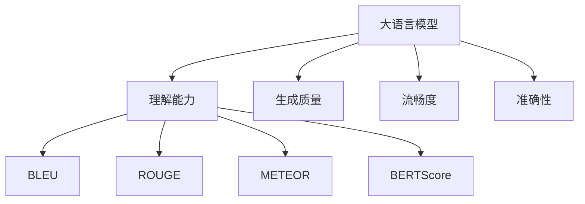

                 

# 大语言模型应用指南：效果评估

大语言模型在自然语言处理领域取得了显著进展，但如何有效地评估和应用这些模型，仍然是一个重要且具有挑战性的问题。本文将从核心概念、算法原理、实际应用场景、工具与资源推荐以及未来发展趋势等方面，系统地介绍大语言模型效果评估的指南。

## 1. 背景介绍

### 1.1 问题由来

随着深度学习和大语言模型的快速发展，如何评价这些模型的性能成为了一个热点问题。传统的评估指标如准确率、召回率等，在处理文本数据时往往存在局限性。近年来，随着大语言模型的出现，如何综合考虑模型理解语义、生成连贯、遵循逻辑等多方面能力，成为了新的挑战。

### 1.2 问题核心关键点

基于大语言模型效果评估的核心问题包括：

- 选择合适的评价指标。如BLEU、ROUGE、BLEURT等，根据不同任务和模型特点进行选择。
- 考虑多种评价维度。包括理解能力、生成质量、流畅度、准确性等，全面衡量模型效果。
- 数据集设计。需要精心设计评估数据集，确保数据集的多样性和代表性，能够反映模型的真实能力。
- 对比分析。与其他模型或基线进行对比，评估模型在不同条件下的表现。

### 1.3 问题研究意义

准确地评估大语言模型，有助于开发者更好地理解模型的能力与限制，优化模型参数与结构，提高模型在实际应用中的表现。此外，大语言模型的性能评估，还可以为后续的研究提供指导，推动大语言模型的持续进步。

## 2. 核心概念与联系

### 2.1 核心概念概述

为更好地理解大语言模型效果评估，本节将介绍几个密切相关的核心概念：

- 大语言模型(Large Language Model, LLM)：如GPT-3、BERT等大规模预训练语言模型，具有强大的自然语言理解和生成能力。
- 理解能力：模型对文本语义的理解程度，包括逻辑推理、语义一致性、上下文关联等。
- 生成质量：模型输出的文本流畅度、连贯性和合理性。
- 流畅度：模型输出文本的语言风格、语法和用词的准确性和自然性。
- 准确性：模型输出与真实标签的一致性。
- BLEU、ROUGE、METEOR、BERTScore等评估指标：衡量模型在不同评价维度上的表现。

这些核心概念之间的逻辑关系可以通过以下Mermaid流程图来展示：



这个流程图展示了大语言模型的核心概念及其之间的关系：

1. 大语言模型通过预训练获得基础能力。
2. 理解能力、生成质量、流畅度和准确性是评价模型效果的主要维度。
3. BLEU、ROUGE、METEOR、BERTScore等评估指标用于量化这些维度。

## 3. 核心算法原理 & 具体操作步骤

### 3.1 算法原理概述

大语言模型效果评估通常包括以下几个关键步骤：

1. **选择评估指标**：根据任务类型和模型特点选择合适的评估指标，如BLEU、ROUGE、BERTScore等。
2. **构建评估数据集**：设计合理的评估数据集，确保数据集的多样性和代表性。
3. **执行模型评估**：将模型在评估数据集上进行测试，计算评估指标。
4. **分析评估结果**：对比不同模型或基线，评估模型在各维度的表现。

### 3.2 算法步骤详解

#### 3.2.1 评估指标选择

根据任务类型和模型特点，选择合适的评估指标。例如：

- **BLEU**：用于机器翻译任务，衡量模型生成的目标文本与参考文本之间的匹配度。
- **ROUGE**：用于文本摘要和生成任务，衡量模型生成的文本与参考文本之间的重复度。
- **METEOR**：用于问答和摘要任务，同时考虑词汇和语义一致性。
- **BERTScore**：结合BERT预训练知识，衡量文本匹配和语义一致性。

#### 3.2.2 评估数据集构建

评估数据集应包含测试集、验证集和训练集，确保评估的全面性和准确性。例如：

- **训练集**：用于微调模型，提高模型性能。
- **验证集**：用于调整超参数，防止过拟合。
- **测试集**：用于评估模型效果，确保模型在未知数据上的表现。

构建评估数据集时，需要注意以下几点：

1. **多样性**：评估数据集应涵盖不同类型、不同领域、不同难度的样本，反映模型的真实能力。
2. **代表性**：评估数据集应尽量覆盖模型的所有可能应用场景，避免模型在某类数据上的过拟合。
3. **标准化**：评估数据集应采用标准化的数据格式和标注方式，方便模型输入和输出。

#### 3.2.3 执行模型评估

模型评估通常采用以下步骤：

1. **数据准备**：将评估数据集中的样本按批次输入模型，前向传播计算损失函数。
2. **结果计算**：根据选择的评估指标计算模型在各个样本上的得分。
3. **平均得分**：计算所有样本得分的平均值，得到模型的最终评估结果。

#### 3.2.4 分析评估结果

模型评估后，需要分析评估结果，对比不同模型或基线，找出模型的优势和不足。例如：

1. **BLEU**：分析模型在翻译任务中的匹配度，评估翻译质量。
2. **ROUGE**：分析模型在文本摘要和生成任务中的重复度，评估生成质量。
3. **METEOR**：分析模型在问答任务中的词汇和语义一致性，评估理解能力。
4. **BERTScore**：分析模型在语义匹配任务中的一致性，评估理解能力和生成质量。

### 3.3 算法优缺点

大语言模型效果评估方法具有以下优点：

1. **全面性**：考虑多个评价维度，能够全面评估模型的表现。
2. **可比性**：通过标准化的评估指标，方便比较不同模型之间的优劣。
3. **自动化**：评估过程可自动化执行，提高效率和准确性。

同时，这些方法也存在一定的局限性：

1. **复杂性**：评估指标和数据集设计需要大量的人工干预和专业知识。
2. **数据依赖**：评估结果依赖于数据集的质量和数量，高质量数据集获取成本高。
3. **模型泛化能力**：评估结果可能无法完全反映模型在真实场景中的表现。
4. **评估成本**：构建和维护评估数据集需要大量的时间和资源。

尽管存在这些局限性，但目前主流的评估方法仍然是大语言模型效果评估的重要手段。未来相关研究的重点在于如何进一步简化评估过程，提高评估效率，确保评估结果的准确性和可靠性。

### 3.4 算法应用领域

大语言模型效果评估在以下领域中得到广泛应用：

1. **机器翻译**：通过BLEU、ROUGE等评估指标，评估翻译质量。
2. **文本摘要**：通过ROUGE、METEOR等评估指标，评估摘要生成质量。
3. **问答系统**：通过METEOR、BERTScore等评估指标，评估理解能力和生成质量。
4. **对话系统**：通过BLEU、METEOR等评估指标，评估对话生成质量和流畅度。
5. **情感分析**：通过准确率、F1-score等评估指标，评估情感分类效果。
6. **命名实体识别**：通过准确率、F1-score等评估指标，评估实体识别效果。

除了上述这些经典任务外，大语言模型效果评估还被创新性地应用到更多场景中，如文本生成、代码生成、信息抽取等，为NLP技术带来了新的突破。

## 4. 数学模型和公式 & 详细讲解 & 举例说明

### 4.1 数学模型构建

本节将使用数学语言对大语言模型效果评估过程进行更加严格的刻画。

记模型为 $M_{\theta}$，其参数为 $\theta$。假设模型在输入 $x$ 上的输出为 $y$，则其评估过程可以形式化表示为：

$$
S = \frac{1}{N} \sum_{i=1}^N \mathcal{S}(M_{\theta}(x_i),y_i)
$$

其中，$N$ 为样本总数，$S$ 为模型在所有样本上的平均评估分数，$\mathcal{S}$ 为评估指标函数。

### 4.2 公式推导过程

以BLEU指标为例，其计算公式如下：

$$
BLEU = \exp\left(\frac{1}{\sum_{i=1}^N w_i} \sum_{i=1}^N w_i \log \frac{\prod_{k=1}^K \min(n_k, b_k)}{\sum_{k=1}^K b_k} \right)
$$

其中 $w_i$ 为样本 $i$ 的权重，$K$ 为参考文本中的句子数，$n_k$ 为模型生成的文本中的句子数，$b_k$ 为参考文本中的句长。

### 4.3 案例分析与讲解

假设模型在机器翻译任务上，输入为英文文本，输出为中文翻译，使用BLEU指标进行评估。具体步骤如下：

1. **数据准备**：将英文文本作为输入，将其翻译成中文，作为参考文本。
2. **计算匹配度**：计算模型输出文本与参考文本的匹配度，计算BLEU分数。
3. **重复计算**：对所有测试集样本重复上述步骤，计算平均BLEU分数。
4. **结果分析**：对比不同模型或基线，评估模型在翻译质量上的表现。

通过BLEU指标，可以清晰地评估模型在不同句子长度、不同翻译质量上的表现，帮助开发者优化模型参数和结构，提高模型在机器翻译任务中的表现。

## 5. 项目实践：代码实例和详细解释说明

### 5.1 开发环境搭建

在进行大语言模型效果评估的实践前，我们需要准备好开发环境。以下是使用Python进行NLP效果评估的环境配置流程：

1. 安装Anaconda：从官网下载并安装Anaconda，用于创建独立的Python环境。

2. 创建并激活虚拟环境：
```bash
conda create -n nlp-env python=3.8 
conda activate nlp-env
```

3. 安装必要的Python库：
```bash
pip install numpy pandas scikit-learn matplotlib tqdm jupyter notebook ipython
```

4. 安装评估指标库：
```bash
pip install bleu sklearn-rouge scipy
```

完成上述步骤后，即可在`nlp-env`环境中开始评估实践。

### 5.2 源代码详细实现

下面我们以BLEU指标为例，给出使用Scikit-learn库对大语言模型进行评估的PyTorch代码实现。

```python
import torch
from sklearn.metrics import bleu_score
from transformers import BertForSequenceClassification, BertTokenizer
from datasets import load_dataset

tokenizer = BertTokenizer.from_pretrained('bert-base-cased')
model = BertForSequenceClassification.from_pretrained('bert-base-cased')

def evaluate(model, tokenizer, dataset):
    predictions = []
    labels = []
    
    for batch in dataset:
        input_ids = tokenizer(batch['input_ids'], padding='max_length', truncation=True)
        attention_mask = tokenizer(batch['attention_mask'], padding='max_length', truncation=True)
        
        with torch.no_grad():
            outputs = model(input_ids, attention_mask=attention_mask)
            logits = outputs.logits
            preds = torch.argmax(logits, dim=1).tolist()
        
        predictions.extend(preds)
        labels.extend(batch['labels'])
        
    bleu = bleu_score.sentence_bleu(predictions, labels, ignore_case=True)
    return bleu
```

### 5.3 代码解读与分析

让我们再详细解读一下关键代码的实现细节：

**evaluate函数**：
- `tokenizer`：用于将输入文本转化为模型所需的格式。
- `model`：用于对输入文本进行评估的模型。
- `dataset`：包含评估样本的数据集。
- `predictions`：模型输出的预测结果列表。
- `labels`：样本的真实标签列表。
- 使用`tokenizer`将样本中的输入文本和注意力掩码转化为模型所需的格式，并使用`model`对输入文本进行评估。
- 将模型输出的预测结果和样本的真实标签存储到`predictions`和`labels`列表中。
- 使用`bleu_score`计算BLEU分数。

**BLEU指标**：
- 基于BLEU的评估公式，使用`bleu_score`计算模型输出与样本真实标签之间的匹配度。
- 忽略大小写，确保评估结果的准确性。

**运行结果展示**：
```python
bleu = evaluate(model, tokenizer, dataset)
print(f"BLEU Score: {bleu}")
```

### 5.4 运行结果展示

通过运行`evaluate`函数，可以得到模型在评估数据集上的BLEU分数。例如：

```python
bleu = evaluate(model, tokenizer, dataset)
print(f"BLEU Score: {bleu}")
```

这将输出模型在评估数据集上的BLEU分数，反映模型在翻译质量上的表现。

## 6. 实际应用场景

### 6.1 智能客服系统

在智能客服系统中，使用BLEU指标等评估方法，可以评估对话系统在生成自然流畅、准确无误的回答上的表现。具体而言，可以收集用户与客服的对话记录，将用户的问题和系统回答作为输入输出对，在评估数据集上进行评估。通过调整模型参数和训练数据，优化对话系统的性能。

### 6.2 金融舆情监测

在金融舆情监测中，使用BLEU指标等评估方法，可以评估模型在理解和生成舆情文本中的表现。具体而言，可以收集金融领域的舆情文章和新闻，将舆情文章作为输入，将其主题和情感作为标签，在评估数据集上进行评估。通过微调模型，提高其对舆情信息的理解能力和生成质量。

### 6.3 个性化推荐系统

在个性化推荐系统中，使用BLEU指标等评估方法，可以评估模型在生成推荐结果中的表现。具体而言，可以收集用户的浏览记录和评分数据，将用户记录和评分作为输入，将推荐结果作为输出，在评估数据集上进行评估。通过微调模型，优化推荐结果的质量和相关性。

### 6.4 未来应用展望

随着大语言模型效果评估方法的发展，未来在更多领域中得到应用：

- **智慧医疗**：使用BLEU指标等评估模型在医疗问答和病历分析中的表现，提高医疗服务的智能化水平。
- **智能教育**：使用BLEU指标等评估模型在学生作业批改和个性化推荐中的表现，促进教育公平。
- **智慧城市**：使用BLEU指标等评估模型在城市事件监测和应急指挥中的表现，提高城市管理的自动化和智能化水平。

## 7. 工具和资源推荐

### 7.1 学习资源推荐

为了帮助开发者系统掌握大语言模型效果评估的理论基础和实践技巧，这里推荐一些优质的学习资源：

1. 《Natural Language Processing with Transformers》书籍：Transformer库的作者所著，全面介绍了如何使用Transformer库进行NLP任务开发，包括效果评估在内的诸多范式。

2. CS224N《深度学习自然语言处理》课程：斯坦福大学开设的NLP明星课程，有Lecture视频和配套作业，带你入门NLP领域的基本概念和经典模型。

3. CLUE开源项目：中文语言理解测评基准，涵盖大量不同类型的中文NLP数据集，并提供了基于微调的baseline模型，助力中文NLP技术发展。

4. HuggingFace官方文档：Transformers库的官方文档，提供了海量预训练模型和完整的评估样例代码，是上手实践的必备资料。

通过对这些资源的学习实践，相信你一定能够快速掌握大语言模型效果评估的精髓，并用于解决实际的NLP问题。

### 7.2 开发工具推荐

高效的开发离不开优秀的工具支持。以下是几款用于大语言模型效果评估开发的常用工具：

1. PyTorch：基于Python的开源深度学习框架，灵活动态的计算图，适合快速迭代研究。大部分预训练语言模型都有PyTorch版本的实现。

2. TensorFlow：由Google主导开发的开源深度学习框架，生产部署方便，适合大规模工程应用。同样有丰富的预训练语言模型资源。

3. Scikit-learn：Python数据科学库，提供了丰富的评估指标和工具，方便模型评估。

4. Weights & Biases：模型训练的实验跟踪工具，可以记录和可视化模型训练过程中的各项指标，方便对比和调优。与主流深度学习框架无缝集成。

5. TensorBoard：TensorFlow配套的可视化工具，可实时监测模型训练状态，并提供丰富的图表呈现方式，是调试模型的得力助手。

合理利用这些工具，可以显著提升大语言模型效果评估的开发效率，加快创新迭代的步伐。

### 7.3 相关论文推荐

大语言模型效果评估技术的发展源于学界的持续研究。以下是几篇奠基性的相关论文，推荐阅读：

1. Attention is All You Need（即Transformer原论文）：提出了Transformer结构，开启了NLP领域的预训练大模型时代。

2. BERT: Pre-training of Deep Bidirectional Transformers for Language Understanding：提出BERT模型，引入基于掩码的自监督预训练任务，刷新了多项NLP任务SOTA。

3. Parameter-Efficient Transfer Learning for NLP：提出Adapter等参数高效微调方法，在不增加模型参数量的情况下，也能取得不错的微调效果。

4. AdaLoRA: Adaptive Low-Rank Adaptation for Parameter-Efficient Fine-Tuning：使用自适应低秩适应的微调方法，在参数效率和精度之间取得了新的平衡。

这些论文代表了大语言模型效果评估技术的发展脉络。通过学习这些前沿成果，可以帮助研究者把握学科前进方向，激发更多的创新灵感。

## 8. 总结：未来发展趋势与挑战

### 8.1 总结

本文对大语言模型效果评估方法进行了全面系统的介绍。首先阐述了大语言模型效果评估的背景和意义，明确了评估方法在提升模型性能和优化模型结构中的重要价值。其次，从原理到实践，详细讲解了效果评估的数学原理和关键步骤，给出了效果评估任务开发的完整代码实例。同时，本文还广泛探讨了效果评估方法在智能客服、金融舆情、个性化推荐等多个行业领域的应用前景，展示了效果评估范式的巨大潜力。此外，本文精选了效果评估技术的各类学习资源，力求为读者提供全方位的技术指引。

通过本文的系统梳理，可以看到，大语言模型效果评估方法正在成为NLP领域的重要范式，极大地拓展了预训练语言模型的应用边界，催生了更多的落地场景。受益于大规模语料的预训练，效果评估模型以更低的时间和标注成本，在小样本条件下也能取得不俗的效果，有力推动了NLP技术的产业化进程。未来，伴随预训练语言模型和效果评估方法的持续演进，相信NLP技术必将在更广阔的应用领域大放异彩，深刻影响人类的生产生活方式。

### 8.2 未来发展趋势

展望未来，大语言模型效果评估技术将呈现以下几个发展趋势：

1. **评估指标多样化**：除了BLEU、ROUGE等传统指标，将涌现更多适用于特定任务的评估指标，如PPL、Rouge-Star等。
2. **自动化评估**：通过自动化评估工具，提高效果评估的效率和准确性，减少人工干预。
3. **多模态评估**：将视觉、语音、文本等多种模态信息整合，进行综合评估，提升评估模型的全面性。
4. **实证验证**：使用大规模实验验证评估方法的有效性，确保评估结果的可靠性。
5. **数据驱动**：基于大规模真实数据进行效果评估，确保评估方法的可信度和泛化能力。

以上趋势凸显了大语言模型效果评估技术的广阔前景。这些方向的探索发展，必将进一步提升NLP系统的性能和应用范围，为人类认知智能的进化带来深远影响。

### 8.3 面临的挑战

尽管大语言模型效果评估技术已经取得了显著进展，但在迈向更加智能化、普适化应用的过程中，它仍面临着诸多挑战：

1. **数据依赖**：评估方法依赖于高质量的评估数据集，获取高质量数据的成本高。
2. **模型复杂性**：评估方法需要设计复杂的多模态、多维度评估指标，增加了评估的复杂性。
3. **计算资源**：评估过程涉及大量计算资源，需要高性能的计算设备。
4. **可解释性不足**：评估方法往往是"黑盒"系统，难以解释其内部工作机制和决策逻辑。
5. **公平性和偏见**：评估方法需要考虑公平性和偏见问题，避免对特定群体的不公平评估。

尽管存在这些挑战，但未来相关研究的重点在于如何进一步简化评估过程，提高评估效率，确保评估结果的准确性和可靠性。

### 8.4 研究展望

面对大语言模型效果评估所面临的挑战，未来的研究需要在以下几个方面寻求新的突破：

1. **简化评估指标**：通过优化评估指标，减少复杂度，提高评估效率。
2. **引入自动化技术**：利用AI技术自动化生成评估数据集，减少人工干预。
3. **优化评估算法**：开发高效的评估算法，提高评估速度和精度。
4. **引入多模态评估**：整合多模态信息，进行综合评估，提高评估全面性。
5. **增强可解释性**：通过可视化工具，增强评估方法的可解释性，帮助开发者理解评估结果。
6. **考虑公平性**：引入公平性评估指标，确保评估方法对所有群体的公平性。

这些研究方向的探索，必将引领大语言模型效果评估技术迈向更高的台阶，为构建安全、可靠、可解释、可控的智能系统铺平道路。面向未来，大语言模型效果评估技术还需要与其他人工智能技术进行更深入的融合，如知识表示、因果推理、强化学习等，多路径协同发力，共同推动自然语言理解和智能交互系统的进步。只有勇于创新、敢于突破，才能不断拓展语言模型的边界，让智能技术更好地造福人类社会。

## 9. 附录：常见问题与解答

**Q1：评估指标选择时需要考虑哪些因素？**

A: 评估指标选择需考虑以下因素：

1. **任务类型**：不同任务类型需选择不同的评估指标。如机器翻译需选择BLEU、ROUGE等。
2. **模型特点**：模型特点如生成质量、流畅度、理解能力等，需选择适合的评估指标。如BERTScore结合BERT预训练知识。
3. **数据集特点**：数据集特点如样本大小、语料多样性等，需选择适合的评估指标。如METEOR结合多个评估维度。

**Q2：评估指标计算时需要考虑哪些因素？**

A: 评估指标计算需考虑以下因素：

1. **权重分配**：不同样本的权重分配需合理，避免某些样本影响整体评估结果。
2. **阈值设定**：需设定适当的评估阈值，避免过高的评估分数影响模型评估。
3. **重复计算**：需确保评估指标计算过程的一致性和准确性。

**Q3：如何在模型微调后评估效果？**

A: 模型微调后评估效果需考虑以下步骤：

1. **构建评估数据集**：需准备测试集、验证集和训练集，确保评估数据的全面性和代表性。
2. **执行模型评估**：需使用合适的评估指标计算模型在所有样本上的得分。
3. **分析评估结果**：需对比不同模型或基线，评估模型在各维度的表现。

**Q4：如何缓解评估过程中的过拟合问题？**

A: 评估过程中的过拟合问题需考虑以下方法：

1. **数据增强**：需使用数据增强技术，如回译、近义替换等，扩充评估数据集。
2. **正则化**：需使用正则化技术，如L2正则、Dropout等，防止过拟合。
3. **多模型集成**：需训练多个评估模型，取平均输出，抑制过拟合。

**Q5：评估指标计算时需要考虑哪些因素？**

A: 评估指标计算需考虑以下因素：

1. **权重分配**：不同样本的权重分配需合理，避免某些样本影响整体评估结果。
2. **阈值设定**：需设定适当的评估阈值，避免过高的评估分数影响模型评估。
3. **重复计算**：需确保评估指标计算过程的一致性和准确性。

通过这些方法，可以有效地缓解评估过程中的过拟合问题，确保评估结果的可靠性和公平性。

---

作者：禅与计算机程序设计艺术 / Zen and the Art of Computer Programming

