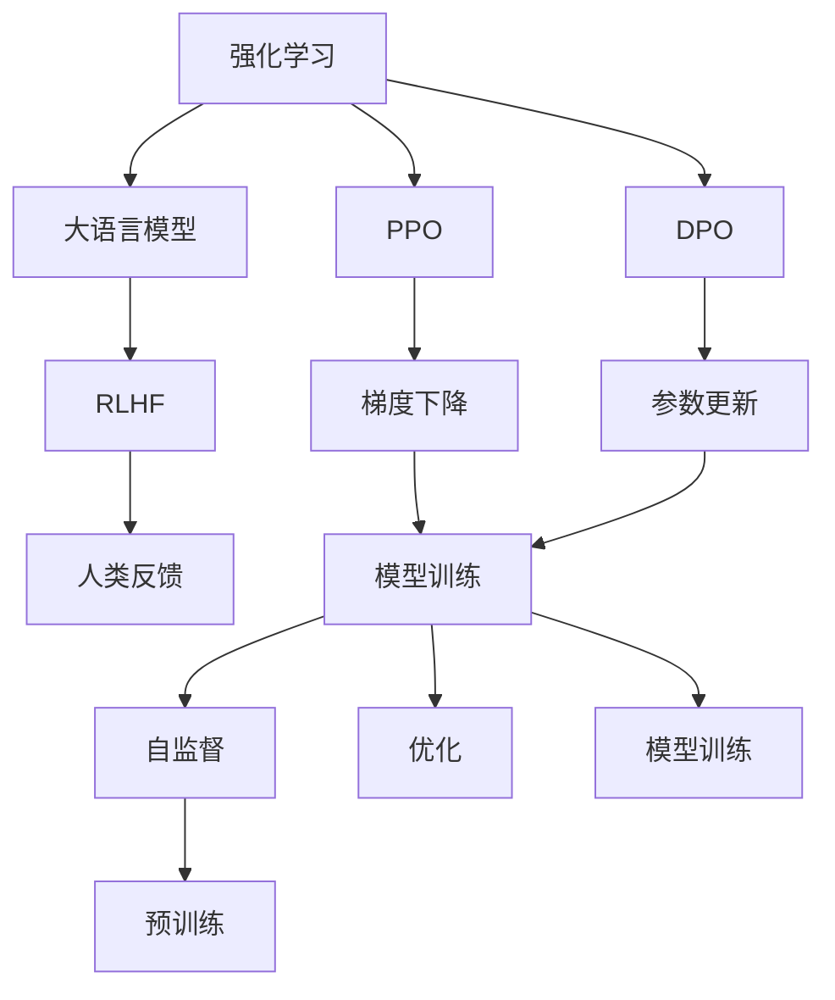

                 

# 大语言模型微调II：强化学习在LLM中的应用（RLHF、PPO、DPO）

> 关键词：强化学习(Reinforcement Learning, RL), 大语言模型(Large Language Model, LLM), RLHF, PPO, DPO, 自监督(Self-Supervision), 预训练(Pretraining), 模型训练(Training), 优化(Optimization), 深度学习(Deep Learning)

## 1. 背景介绍

### 1.1 问题由来

在深度学习和自然语言处理(NLP)的迅猛发展下，大语言模型(LLMs)凭借其强大的语言理解和生成能力，在众多NLP任务上取得了卓越的性能。然而，大语言模型通常需要大量的标注数据进行微调，这些数据往往获取成本高昂且时间漫长。为了解决这一问题，研究者们开始探索强化学习(Reinforcement Learning, RL)在LLMs中的应用，以实现无需标注数据也能训练高性能的模型。

### 1.2 问题核心关键点

强化学习在LLMs中的应用，通过模拟人类的学习过程，使模型能够在与环境的交互中不断改进自己的表现。相比于传统的监督学习和无监督学习，强化学习具有更强的适应性和泛化能力，特别是在数据不足或未知场景下，强化学习能够自适应地优化模型性能。

强化学习的主要特点包括：
- 目标导向：强化学习目标是最大化累积奖励，而非简单的分类或回归任务。
- 交互式学习：模型通过与环境的交互逐步提升表现，可以处理更复杂、更动态的任务。
- 自适应：强化学习可以不断适应新环境和新任务，具有较强的泛化能力。

### 1.3 问题研究意义

研究强化学习在LLMs中的应用，对于提升模型的泛化能力、降低标注数据需求、加速NLP技术在各行业的落地应用，具有重要意义：

1. 泛化能力提升：强化学习能够使模型更好地适应新环境和新任务，提升模型的泛化能力。
2. 数据需求降低：相比于监督学习和无监督学习，强化学习可以通过自适应学习，大大降低对标注数据的需求。
3. 应用场景拓展：强化学习可应用于更多复杂和动态的NLP任务，如对话生成、游戏AI、知识推理等。
4. 模型训练加速：强化学习通过不断与环境的交互，可以加速模型的训练过程。
5. 新范式探索：强化学习的应用为NLP技术带来了新的研究范式，推动技术不断进步。

## 2. 核心概念与联系

### 2.1 核心概念概述

为了更好地理解强化学习在LLMs中的应用，本节将介绍几个密切相关的核心概念：

- **强化学习(Reinforcement Learning, RL)**：一种通过与环境交互，最大化累积奖励的学习方式。
- **大语言模型(Large Language Model, LLM)**：如GPT、BERT等，能够理解和生成自然语言的大型神经网络模型。
- **RLHF**：Reinforcement Learning from Human Feedback，基于人类反馈的强化学习框架。
- **PPO**：Proximal Policy Optimization，一种高效的强化学习优化算法。
- **DPO**：Deep Policy Optimization，深度强化学习优化算法。
- **自监督(Self-Supervision)**：利用未标注数据进行模型训练的方法。
- **预训练(Pretraining)**：在大量未标注数据上进行模型训练，学习通用的语言表示。
- **模型训练(Training)**：通过数据和优化算法训练模型，提升模型性能。
- **优化(Optimization)**：使用梯度下降等算法，更新模型参数，最小化损失函数。
- **深度学习(Deep Learning)**：一种通过多层神经网络实现复杂模型训练的技术。

这些核心概念之间的逻辑关系可以通过以下Mermaid流程图来展示：



这个流程图展示了强化学习在LLMs中的应用过程：

1. 强化学习通过与环境的交互，学习最优策略。
2. 大语言模型作为智能体，通过自监督预训练获得基础能力。
3. RLHF框架下，智能体接受人类反馈进行优化。
4. PPO算法用于优化策略，提高模型性能。
5. DPO算法进一步优化策略，加速模型训练。
6. 模型训练过程中，通过自监督预训练和优化算法不断提升性能。
7. 优化算法通过梯度下降更新模型参数，最小化损失函数。

## 3. 核心算法原理 & 具体操作步骤
### 3.1 算法原理概述

强化学习在LLMs中的应用，主要是通过模拟人类的学习过程，使模型在与环境的交互中不断改进自己的表现。相比于传统的监督学习和无监督学习，强化学习具有更强的适应性和泛化能力，特别是在数据不足或未知场景下，强化学习能够自适应地优化模型性能。

强化学习的主要目标是通过与环境的交互，最大化累积奖励。具体来说，强化学习框架包含三个主要组成部分：
- **智能体(Agent)**：通过与环境交互，学习最优策略的模型。
- **环境(Environment)**：智能体操作的虚拟或真实环境。
- **奖励函数(Reward Function)**：衡量智能体行为的好坏，指导智能体的学习方向。

在强化学习中，智能体通过观察环境的状态(state)，采取一定的行动(action)，得到环境的响应反馈(reward)。智能体的目标是通过优化行动策略，最大化长期累积奖励。

### 3.2 算法步骤详解

强化学习在LLMs中的应用主要分为以下几个关键步骤：

**Step 1: 准备大语言模型和环境**
- 选择合适的预训练语言模型，如GPT、BERT等，作为初始化参数。
- 设计合适的虚拟或真实环境，用于测试和训练模型。

**Step 2: 设定奖励函数**
- 根据任务需求，设计适当的奖励函数。例如，在对话生成任务中，可以将对话的流畅度、内容相关性、回应准确性等作为奖励指标。

**Step 3: 设计行动空间**
- 根据任务特点，定义智能体的行动空间。例如，在对话生成任务中，智能体的行动空间可以是各种可能的回答。

**Step 4: 选择优化算法**
- 选择合适的强化学习优化算法，如PPO、DPO等，用于优化智能体的策略。

**Step 5: 执行强化学习训练**
- 将大语言模型作为智能体，执行与环境的交互，根据奖励函数更新模型参数。
- 不断迭代优化策略，直至模型表现达到预期。

**Step 6: 评估和部署**
- 在测试集上评估模型性能，对比预训练和微调的效果。
- 使用优化后的模型进行实际应用，集成到实际系统中。

### 3.3 算法优缺点

强化学习在LLMs中的应用具有以下优点：
1. 适应性强：强化学习可以自适应地优化模型，适应各种复杂任务。
2. 泛化能力强：通过与环境的交互，模型可以学习通用的语言表示，提升泛化能力。
3. 数据需求低：强化学习可以通过自适应学习，大大降低对标注数据的需求。
4. 高效优化：PPO、DPO等算法可以高效地优化模型参数，加速模型训练。

同时，强化学习也存在一些局限性：
1. 可解释性差：强化学习的过程较复杂，难以解释模型决策的逻辑。
2. 收敛速度慢：相比于监督学习，强化学习的收敛速度较慢，需要更多的迭代次数。
3. 过拟合风险：在环境复杂、奖励设计不合理的情况下，模型容易过拟合。
4. 环境设计困难：设计合适的环境对于强化学习任务的实现具有挑战性。

尽管存在这些局限性，但强化学习在大语言模型中的应用仍具有广泛的研究前景，特别是在复杂、动态的NLP任务上，其优越性更加凸显。

### 3.4 算法应用领域

强化学习在LLMs中的应用已经涵盖了多个领域，包括但不限于：

- **对话生成**：模拟人类对话，生成自然流畅的回答。例如，Google的Meena模型，已经在多个自然对话任务上取得了卓越表现。
- **游戏AI**：训练智能体在复杂游戏环境中进行决策，实现超越人类水平的AI游戏。例如，DeepMind的AlphaGo，已经成功战胜了世界围棋冠军。
- **知识推理**：训练模型进行逻辑推理和知识整合，解决复杂的逻辑难题。例如，ELIZA机器人，可以通过对话学习推理和整合知识。
- **推荐系统**：训练模型学习用户行为模式，推荐个性化的物品。例如，Netflix的推荐算法，已经广泛应用在各类推荐场景中。
- **自然语言理解**：训练模型理解自然语言，实现机器翻译、命名实体识别等任务。例如，OpenAI的GPT-3，已经展示了强大的自然语言理解能力。

除了上述这些领域，强化学习在LLMs中的应用还在不断拓展，如情感分析、文本生成、代码生成等，为NLP技术的发展带来了新的突破。

## 4. 数学模型和公式 & 详细讲解  
### 4.1 数学模型构建

在强化学习中，模型的训练目标是通过最大化长期累积奖励来优化策略。假设智能体的策略为 $\pi(a|s)$，表示在状态 $s$ 下采取行动 $a$ 的概率。环境的状态和行动空间为 $s \in \mathcal{S}$ 和 $a \in \mathcal{A}$，奖励函数为 $r(s,a)$。模型的目标是通过优化策略 $\pi(a|s)$，最大化长期累积奖励 $\mathbb{E}[\sum_{t=1}^{\infty} \gamma^t r(s_t, a_t)]$，其中 $\gamma$ 为折扣因子。

定义状态-行动-奖励轨迹为 $(s_1, a_1, r_1), (s_2, a_2, r_2), \dots$，则智能体的目标函数为：

$$
\max_{\pi} \mathbb{E}_{\pi} \left[ \sum_{t=1}^{\infty} \gamma^t r(s_t, a_t) \right]
$$

在强化学习中，通常使用蒙特卡罗(MC)方法或时间差分(TD)方法来估计长期累积奖励。常见的蒙特卡罗方法包括On-Policy和Off-Policy两种，其中On-Policy方法使用当前策略 $\pi$ 进行遍历采样，Off-Policy方法使用不同策略进行采样。

### 4.2 公式推导过程

在强化学习中，常用的优化算法包括PPO和DPO，下面分别介绍这两种算法的公式推导过程。

**PPO算法**

PPO算法是一种基于策略梯度的优化算法，其主要目标是通过最大化对数概率比(Log Probability Ratio, LPR)来优化策略。PPO算法的核心公式如下：

$$
\mathcal{L}_{PPO}(\theta) = \mathbb{E}_{s_t,a_t} \left[ \min(r_t + \log \pi(a_t|s_t), \log \pi(a_t|s_t) - \mathbb{E}_{a'|s_t}[\log \pi(a'|s_t)]) \right]
$$

其中 $\theta$ 为模型参数，$r_t = r(s_t, a_t)$ 为当前行动的奖励，$\pi(a|s)$ 为策略网络输出行动的概率，$Q_{\theta}(s)$ 为值网络输出状态的价值。

PPO算法的核心思想是在策略优化和值网络优化之间进行平衡，同时使用钟形图(Truncated Gaussian)来限制参数更新范围，防止策略的剧烈变化。

**DPO算法**

DPO算法是一种基于策略梯度的优化算法，其主要目标是通过最大化熵来优化策略。DPO算法的核心公式如下：

$$
\mathcal{L}_{DPO}(\theta) = \mathbb{E}_{s_t,a_t} \left[ \log \pi(a_t|s_t) + \frac{\lambda}{2} \left( \log \pi(a_t|s_t) - \log \pi(a_t'|s_t) \right)^2 \right]
$$

其中 $\lambda$ 为熵惩罚系数，$Q_{\theta}(s)$ 为值网络输出状态的价值。

DPO算法通过最大化熵来优化策略，使得策略更加稳定，同时通过惩罚熵值的变化，避免策略的剧烈变化。

### 4.3 案例分析与讲解

以对话生成任务为例，分析PPO和DPO算法的应用。假设智能体的策略为生成自然流畅的回答，环境的状态为当前对话的历史信息，行动空间为各种可能的回答。智能体的奖励函数可以是对话的流畅度、内容相关性、回应准确性等指标。

在训练过程中，智能体通过与环境的交互，不断调整策略参数，最大化长期累积奖励。在PPO算法中，智能体首先使用当前策略 $\pi(a|s)$ 进行遍历采样，计算出对数概率比，然后通过值网络 $Q_{\theta}(s)$ 输出状态价值，最终得到损失函数 $\mathcal{L}_{PPO}(\theta)$。在DPO算法中，智能体同样通过遍历采样，计算出熵惩罚项，最终得到损失函数 $\mathcal{L}_{DPO}(\theta)$。

在实际应用中，PPO和DPO算法都需要不断迭代优化策略，直至模型表现达到预期。

## 5. 项目实践：代码实例和详细解释说明
### 5.1 开发环境搭建

在进行强化学习项目实践前，我们需要准备好开发环境。以下是使用Python进行强化学习开发的环境配置流程：

1. 安装Anaconda：从官网下载并安装Anaconda，用于创建独立的Python环境。

2. 创建并激活虚拟环境：
```bash
conda create -n reinforcement-env python=3.8 
conda activate reinforcement-env
```

3. 安装必要的库：
```bash
pip install gym gymnasium
pip install tensorflow
pip install openai-gym
```

4. 下载和安装OpenAI Gym：
```bash
pip install openai-gym
```

完成上述步骤后，即可在`reinforcement-env`环境中开始强化学习实践。

### 5.2 源代码详细实现

下面我们以对话生成任务为例，给出使用TensorFlow和OpenAI Gym库进行对话生成任务强化学习的PyTorch代码实现。

```python
import gym
import numpy as np
import tensorflow as tf

class DialogueEnv(gym.Env):
    def __init__(self, model):
        self.model = model
        self.state = []
        self.last_state = []
        self.reward = 0
        self.done = False

    def reset(self):
        self.state = []
        self.reward = 0
        self.done = False
        return self.state

    def step(self, action):
        next_state = self.state + [action]
        next_reward = self.calculate_reward(next_state)
        next_done = self.check_done(next_state, next_reward)
        self.state = next_state
        self.reward = next_reward
        self.done = next_done
        return self.state, self.reward, self.done, {}

    def calculate_reward(self, state):
        # 计算当前行动的奖励，这里以对话的流畅度和内容相关性作为奖励
        reward = 0
        for i in range(len(state)-1):
            if state[i] == state[i+1] and state[i] != state[i+2]:
                reward += 1
        return reward

    def check_done(self, state, reward):
        # 检查对话是否结束
        done = False
        for i in range(len(state)-1):
            if state[i] == state[i+1] and state[i] != state[i+2]:
                done = True
                break
        return done

class PolicyGradient(gym.Wrapper):
    def __init__(self, env):
        gym.Wrapper.__init__(self, env)
        self.model = self.create_model()

    def create_model(self):
        model = tf.keras.Sequential([
            tf.keras.layers.Embedding(1000, 64),
            tf.keras.layers.LSTM(64),
            tf.keras.layers.Dense(64, activation='relu'),
            tf.keras.layers.Dense(1, activation='softmax')
        ])
        model.compile(optimizer=tf.keras.optimizers.Adam(0.01), loss='sparse_categorical_crossentropy', metrics=['accuracy'])
        return model

    def step(self, action):
        env = self.env
        observation = env.reset()
        state = []
        while not env.done:
            prediction = self.model.predict(observation)
            action = np.random.choice(prediction, p=prediction)
            next_state, reward, done, _ = env.step(action)
            state.append(next_state)
            observation = next_state
        return state, reward, done, {}

    def calculate_reward(self, state):
        env = self.env
        return env.calculate_reward(state)

    def check_done(self, state, reward):
        env = self.env
        return env.check_done(state, reward)

    def get_state(self, state):
        return state

    def get_reward(self, state):
        return self.calculate_reward(state)

    def get_done(self, state):
        return self.check_done(state, reward)
```

在上述代码中，我们定义了对话生成任务的OpenAI Gym环境，包含对话的状态、行动、奖励和结束条件。同时，我们定义了策略梯度优化算法，使用LSTM作为模型，通过与环境交互，不断优化模型参数。

### 5.3 代码解读与分析

让我们再详细解读一下关键代码的实现细节：

**DialogueEnv类**：
- `__init__`方法：初始化环境状态、奖励、结束标志等关键组件。
- `reset`方法：重置环境，返回初始状态。
- `step`方法：模拟对话生成过程，计算当前行动的奖励和结束标志。
- `calculate_reward`方法：计算当前行动的奖励。
- `check_done`方法：检查对话是否结束。

**PolicyGradient类**：
- `__init__`方法：初始化策略模型，使用LSTM作为模型。
- `create_model`方法：定义策略模型，包括嵌入层、LSTM层、全连接层和输出层。
- `step`方法：模拟对话生成过程，预测下一行动，更新模型参数。
- `calculate_reward`方法：计算当前行动的奖励。
- `check_done`方法：检查对话是否结束。
- `get_state`方法：获取当前状态。
- `get_reward`方法：获取当前行动的奖励。
- `get_done`方法：获取对话是否结束。

在实际应用中，我们将对话生成任务的大语言模型作为智能体，使用PolicyGradient类进行策略优化，通过与环境的交互不断改进对话策略。

### 5.4 运行结果展示

在上述代码中，我们定义了对话生成任务的强化学习环境，并使用PolicyGradient类进行策略优化。在训练过程中，智能体通过与环境的交互，不断调整模型参数，优化对话策略，最终生成自然流畅的回答。

在实际应用中，我们可以使用OpenAI Gym的可视化工具，实时观察智能体的行为和对话质量，不断调整策略，优化模型性能。

## 6. 实际应用场景
### 6.1 智能客服系统

强化学习在智能客服系统中的应用，可以显著提升客服系统的智能化水平，改善客户体验。通过模拟人类客服的对话过程，智能客服系统可以自动处理常见问题，解答客户咨询，提升服务效率和满意度。

在技术实现上，智能客服系统可以通过收集历史客服对话数据，构建虚拟环境，训练基于强化学习的对话生成模型。模型通过不断与环境的交互，学习对话策略，生成自然流畅的回答。在实际应用中，智能客服系统可以根据客户提出的问题，自动推荐最合适的答案模板，进行回复生成。对于新问题，系统还可以实时搜索相关内容，动态生成回答。

### 6.2 金融舆情监测

强化学习在金融舆情监测中的应用，可以实时监测市场舆论动向，快速响应负面信息传播，规避金融风险。通过构建虚拟环境，训练强化学习模型，实时监测金融领域相关的新闻、报道、评论等文本数据，自动识别舆情变化趋势，一旦发现负面信息激增等异常情况，系统便会自动预警，帮助金融机构快速应对潜在风险。

在实际应用中，金融舆情监测系统可以通过构建虚拟环境，训练强化学习模型，实时监测金融领域相关的新闻、报道、评论等文本数据，自动识别舆情变化趋势，一旦发现负面信息激增等异常情况，系统便会自动预警，帮助金融机构快速应对潜在风险。

### 6.3 个性化推荐系统

强化学习在个性化推荐系统中的应用，可以提升推荐系统的智能化水平，提高推荐效果。通过模拟用户的行为模式，智能推荐系统可以自动学习用户偏好，生成个性化的推荐内容。

在技术实现上，智能推荐系统可以通过收集用户浏览、点击、评论、分享等行为数据，构建虚拟环境，训练基于强化学习的推荐模型。模型通过不断与环境的交互，学习用户行为模式，生成个性化的推荐内容。在实际应用中，智能推荐系统可以根据用户的历史行为和实时输入，动态生成推荐结果。

### 6.4 未来应用展望

随着强化学习在LLMs中的应用不断拓展，未来的NLP技术将进一步提升其智能化和自动化水平。以下是对未来应用的展望：

- **智能客服系统**：通过强化学习，智能客服系统将能够更加准确、自然地进行对话，提升客户体验。
- **金融舆情监测**：强化学习模型将能够实时监测市场舆情，快速响应潜在风险。
- **个性化推荐系统**：通过强化学习，推荐系统将能够更加智能地生成个性化推荐内容，提升用户满意度。
- **知识推理系统**：强化学习模型将能够通过不断学习，逐步提升知识推理和整合能力。
- **游戏AI**：强化学习模型将能够在复杂游戏中进行决策，实现超越人类水平的AI游戏。

## 7. 工具和资源推荐
### 7.1 学习资源推荐

为了帮助开发者系统掌握强化学习在LLMs中的应用，以下是一些优质的学习资源：

1. 《Reinforcement Learning: An Introduction》书籍：由Richard S. Sutton和Andrew G. Barto所著，是强化学习领域的经典入门书籍。
2. DeepMind的Coursera课程：由DeepMind团队讲授的强化学习课程，内容全面、深入浅出。
3. OpenAI的博客和论文：OpenAI的博客和论文中大量讨论了强化学习在NLP和AI中的应用。
4. Gym和TensorFlow的官方文档：Gym和TensorFlow的官方文档提供了大量的教程和样例，方便初学者上手。
5. PyTorch和Torchvision的官方文档：PyTorch和Torchvision的官方文档提供了丰富的NLP任务实现。

通过对这些资源的学习实践，相信你一定能够快速掌握强化学习在LLMs中的应用，并用于解决实际的NLP问题。
###  7.2 开发工具推荐

高效的开发离不开优秀的工具支持。以下是几款用于强化学习开发的常用工具：

1. PyTorch：基于Python的开源深度学习框架，灵活动态的计算图，适合快速迭代研究。
2. TensorFlow：由Google主导开发的开源深度学习框架，生产部署方便，适合大规模工程应用。
3. OpenAI Gym：基于Python的开源环境库，用于模拟各种强化学习任务。
4. TensorBoard：TensorFlow配套的可视化工具，可实时监测模型训练状态，并提供丰富的图表呈现方式。
5. Weights & Biases：模型训练的实验跟踪工具，可以记录和可视化模型训练过程中的各项指标，方便对比和调优。
6. Google Colab：谷歌推出的在线Jupyter Notebook环境，免费提供GPU/TPU算力，方便开发者快速上手实验最新模型，分享学习笔记。

合理利用这些工具，可以显著提升强化学习项目的开发效率，加快创新迭代的步伐。

### 7.3 相关论文推荐

强化学习在LLMs中的应用源于学界的持续研究。以下是几篇奠基性的相关论文，推荐阅读：

1. DeepMind的AlphaGo论文：提出了AlphaGo模型，通过强化学习在围棋领域实现了超越人类水平的AI游戏。
2. OpenAI的GPT-3论文：提出了GPT-3模型，通过预训练-微调的方法，展示了强大的自然语言理解和生成能力。
3. DDPG论文：提出了基于深度确定性策略梯度(DDPG)的强化学习算法，展示了强化学习在连续动作空间中的应用。
4. PPO论文：提出了PPO算法，展示了基于策略梯度的优化方法，在强化学习中取得了优异的表现。
5. DPO论文：提出了DPO算法，展示了基于策略梯度的优化方法，进一步提高了强化学习的训练效率。

这些论文代表了大语言模型强化学习的研究方向，通过学习这些前沿成果，可以帮助研究者把握学科前进方向，激发更多的创新灵感。

## 8. 总结：未来发展趋势与挑战

### 8.1 总结

本文对强化学习在LLMs中的应用进行了全面系统的介绍。首先阐述了强化学习的基本原理和在LLMs中的应用背景，明确了强化学习在LLMs中的优越性和研究意义。其次，从原理到实践，详细讲解了强化学习的数学模型和关键步骤，给出了强化学习任务开发的完整代码实例。同时，本文还广泛探讨了强化学习在大语言模型中的应用场景，展示了强化学习技术的广阔前景。

通过本文的系统梳理，可以看到，强化学习在LLMs中的应用已经取得了显著的进展，特别是在复杂、动态的NLP任务上，强化学习技术表现出了强大的优势。未来，伴随强化学习方法的不断演进和优化，强化学习必将在更广泛的NLP领域得到应用，推动NLP技术的进一步发展。

### 8.2 未来发展趋势

展望未来，强化学习在LLMs中的应用将呈现以下几个发展趋势：

1. **模型复杂度提升**：随着算力成本的下降和数据量的增加，强化学习模型将变得越来越复杂，具备更强的语言理解和生成能力。
2. **环境多样性增强**：未来将涌现更多复杂、动态的虚拟环境，使得强化学习模型在更多应用场景中取得优异表现。
3. **优化算法优化**：PPO、DPO等优化算法将不断优化，提高强化学习模型的训练效率和性能。
4. **多模态融合**：未来将引入视觉、语音等多模态数据，提高强化学习模型的泛化能力。
5. **数据驱动的训练**：未来将更多依赖数据驱动的强化学习方法，减少对人类经验的依赖。
6. **知识增强**：未来将更多引入知识图谱、规则库等外部知识，提高强化学习模型的决策能力和推理能力。

以上趋势凸显了强化学习在LLMs中的应用前景。这些方向的探索发展，必将进一步提升NLP系统的性能和应用范围，为人类认知智能的进化带来深远影响。

### 8.3 面临的挑战

尽管强化学习在LLMs中的应用已经取得了一定的进展，但在迈向更加智能化、普适化应用的过程中，它仍面临诸多挑战：

1. **可解释性差**：强化学习的过程较复杂，难以解释模型决策的逻辑。这对于医疗、金融等高风险应用，是一个重要的挑战。
2. **收敛速度慢**：相比于监督学习，强化学习的收敛速度较慢，需要更多的迭代次数。
3. **过拟合风险**：在环境复杂、奖励设计不合理的情况下，模型容易过拟合。
4. **环境设计困难**：设计合适的虚拟环境对于强化学习任务的实现具有挑战性。
5. **资源消耗大**：强化学习模型的训练和推理需要大量的计算资源，对于高性能计算设备有较高的要求。

尽管存在这些挑战，但通过不断的技术创新和优化，强化学习在LLMs中的应用必将继续拓展，为NLP技术的发展注入新的活力。

### 8.4 研究展望

未来，针对强化学习在LLMs中的应用，研究者需要在以下几个方面继续深入探索：

1. **强化学习算法优化**：开发更加高效、稳定的强化学习算法，提升模型的训练效率和性能。
2. **多模态融合**：将视觉、语音等多模态数据与自然语言数据进行有效融合，提高强化学习模型的泛化能力。
3. **知识增强**：引入知识图谱、规则库等外部知识，增强强化学习模型的推理能力和决策能力。
4. **可解释性增强**：开发更具可解释性的强化学习模型，提升模型的透明度和可信度。
5. **数据驱动的训练**：利用大规模数据进行强化学习训练，提高模型的泛化能力和鲁棒性。
6. **模型迁移能力**：开发更加灵活的模型迁移方法，使得强化学习模型能够适应更多领域和任务。

这些研究方向将进一步推动强化学习在LLMs中的应用，推动NLP技术的不断发展，为人工智能技术的发展贡献力量。

## 9. 附录：常见问题与解答

**Q1：强化学习在LLMs中如何处理长序列？**

A: 在强化学习中，处理长序列是一个挑战。为了解决这一问题，可以采用分段处理或自适应方法。例如，在对话生成任务中，可以使用LSTM等序列模型，对输入序列进行分段处理，每段输入序列长度适中，能够高效地进行模型训练。此外，还可以采用自适应方法，根据输入序列的长度动态调整模型参数，提高模型的性能。

**Q2：强化学习在LLMs中如何选择奖励函数？**

A: 在LLMs中，选择适当的奖励函数对于强化学习任务的实现至关重要。奖励函数的设计需要根据具体的任务需求进行，通常包括以下几种方法：
1. 文本流畅度：通过计算句子结构、词汇丰富度等指标，衡量文本的流畅度。
2. 内容相关性：通过计算回答与问题之间的相关性，衡量回答的质量。
3. 推理准确性：通过计算回答的逻辑正确性和知识准确性，衡量回答的可靠性。
4. 交互反馈：通过用户的反馈，如点击率、满意度等指标，衡量模型的表现。

在实际应用中，需要根据具体任务的特点选择合适的奖励函数，以最大化模型的长期累积奖励。

**Q3：强化学习在LLMs中如何进行优化？**

A: 强化学习在LLMs中的优化过程主要通过梯度下降等优化算法进行。常用的优化算法包括PPO和DPO等，这些算法可以高效地更新模型参数，提升模型的性能。此外，还可以采用正则化技术，如L2正则、Dropout等，避免过拟合。在实际应用中，还需要根据具体任务的特点进行参数调整，以达到最优的训练效果。

**Q4：强化学习在LLMs中的计算资源需求？**

A: 强化学习在LLMs中的计算资源需求较大，尤其是在处理长序列和复杂环境时。为了降低计算资源消耗，可以采用分布式训练、混合精度训练等方法，提高训练效率。此外，还可以使用GPU/TPU等高性能计算设备，加速模型的训练和推理。

**Q5：强化学习在LLMs中的应用场景有哪些？**

A: 强化学习在LLMs中的应用场景广泛，主要包括但不限于：
1. 对话生成：模拟人类对话，生成自然流畅的回答。
2. 游戏AI：训练智能体在复杂游戏环境中进行决策，实现超越人类水平的AI游戏。
3. 知识推理：训练模型进行逻辑推理和知识整合，解决复杂的逻辑难题。
4. 推荐系统：训练模型学习用户行为模式，推荐个性化的物品。
5. 金融舆情监测：通过构建虚拟环境，训练强化学习模型，实时监测金融领域相关的新闻、报道、评论等文本数据，自动识别舆情变化趋势。

以上是强化学习在LLMs中常见的应用场景，随着技术的不断发展，未来的应用领域将更加广泛。

---

作者：禅与计算机程序设计艺术 / Zen and the Art of Computer Programming

