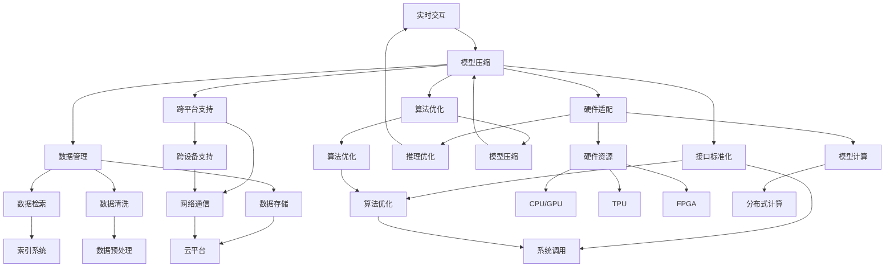

                 

# 大语言模型操作系统的应用前景

> 关键词：大语言模型,操作系统,自然语言处理(NLP),人工智能(AI),自动编码,系统集成,实时交互,多模态融合

## 1. 背景介绍

### 1.1 问题由来
随着人工智能技术的迅猛发展，大语言模型在自然语言处理(NLP)领域取得了显著的突破。从早期的语言模型到现代的Transformer、BERT、GPT等架构，大语言模型已经成为推动NLP应用的重要引擎。它们不仅能够理解、生成和处理自然语言，还具备了广泛的常识性知识，能够回答复杂问题。这些模型在搜索引擎、智能客服、翻译、自动摘要、情感分析等众多场景中得到了应用，极大地提升了NLP技术的实用性和便利性。

然而，尽管大语言模型具有强大的功能，其在实际部署和应用中仍然存在一些挑战。主要表现在：

- **资源消耗大**：大模型的参数量往往数亿甚至数十亿，训练和推理所需的硬件资源非常庞大。
- **效率问题**：推理速度较慢，无法满足实时交互的需求。
- **复杂度管理**：模型的结构复杂，如何高效管理和调度这些资源成为了难题。
- **接口和兼容性**：模型需要和多个系统组件进行集成，接口标准化和兼容性问题突出。
- **可扩展性**：在大规模部署和分布式计算环境中，如何扩展和优化模型性能和资源管理是关键。

为了解决这些问题，大语言模型操作系统应运而生。它通过提供一个统一的操作平台，整合了模型、数据、硬件、软件等多个层面的资源，使得模型的部署、运行和优化更加高效、灵活和可靠。本文将从核心概念、算法原理、应用场景等多个角度，全面探讨大语言模型操作系统的应用前景。

### 1.2 问题核心关键点
大语言模型操作系统旨在通过构建一个统一的计算平台，为大语言模型提供必要的支持和优化，使其能够在各种应用场景中发挥最大效能。它的核心关键点包括：

- **模型集成和调度**：将大语言模型集成到系统中，并实现高效的资源调度和优化。
- **数据管理**：提供数据存储、检索、清洗等功能，支持模型训练和推理所需的各类数据。
- **硬件适配**：兼容各种硬件资源，实现高效的模型计算和推理。
- **算法优化**：通过算法优化和模型压缩，提高模型性能和资源利用率。
- **接口标准化**：定义统一的API接口，实现模型与其他系统组件的无缝集成。
- **跨平台支持**：实现跨设备、跨平台的操作支持，支持多模态融合和异构系统集成。

这些核心关键点共同构成了大语言模型操作系统的基础框架，为模型的应用和优化提供了有力支撑。

## 2. 核心概念与联系

### 2.1 核心概念概述

为了更好地理解大语言模型操作系统的原理和架构，本节将介绍几个关键的概念及其相互关系。

- **大语言模型(Large Language Model, LLM)**：以自回归(如GPT)或自编码(如BERT)模型为代表的大规模预训练语言模型。通过在海量无标签文本数据上进行预训练，学习通用的语言知识，具备强大的语言理解和生成能力。

- **操作系统(OS)**：一种系统软件，负责管理计算机硬件和软件资源，为用户提供便利的操作界面。

- **自然语言处理(NLP)**：涉及计算机与人类语言交互的技术领域，包括文本处理、语音识别、机器翻译、情感分析等。

- **多模态融合**：指结合文本、图像、语音等多种信息形式，实现跨模态信息处理的技术。

- **分布式计算**：通过网络将多个计算节点连接起来，协同完成计算任务，提高计算效率和资源利用率。

- **实时交互**：在用户与系统的交互过程中，系统能够即时响应用户请求，提供即时的反馈和结果。

这些核心概念之间存在紧密的联系，通过操作系统平台，可以将大语言模型与各种资源、数据、硬件进行高效集成和调度，实现多模态融合和实时交互，从而提升模型的应用性能和用户体验。

### 2.2 核心概念原理和架构的 Mermaid 流程图



这个Mermaid流程图展示了大语言模型操作系统的主要组成部分及其相互关系。通过这些组件，操作系统实现了对大语言模型的全面管理和优化，支持其在各种应用场景下的高效运行。

## 3. 核心算法原理 & 具体操作步骤

### 3.1 算法原理概述

大语言模型操作系统的核心算法原理可以概括为模型集成、数据管理、硬件适配、算法优化和接口标准化五个方面。

- **模型集成**：通过操作系统平台，将大语言模型集成到系统中，提供模型加载、卸载、更新等操作。
- **数据管理**：操作系统提供数据存储、检索、清洗等功能，支持模型训练和推理所需的各类数据。
- **硬件适配**：兼容各种硬件资源，实现高效的模型计算和推理。
- **算法优化**：通过算法优化和模型压缩，提高模型性能和资源利用率。
- **接口标准化**：定义统一的API接口，实现模型与其他系统组件的无缝集成。

这些算法原理共同构成了大语言模型操作系统的基础。通过这些算法，操作系统能够实现对大语言模型的全面管理和优化，支持其在各种应用场景下的高效运行。

### 3.2 算法步骤详解

大语言模型操作系统的算法步骤主要包括以下几个关键步骤：

**Step 1: 准备环境**
- 选择合适的硬件资源，包括CPU、GPU、TPU等，并确保操作系统和库文件安装正常。
- 准备模型、数据、应用等资源，确保资源一致性。

**Step 2: 模型集成**
- 将大语言模型部署到操作系统平台，通过API接口进行加载和卸载。
- 根据应用需求，设置模型参数和超参数。

**Step 3: 数据管理**
- 使用操作系统提供的API接口，进行数据存储、检索、清洗等操作。
- 根据模型需求，从存储系统中读取数据，并进行预处理。

**Step 4: 硬件适配**
- 通过API接口，将模型与硬件资源进行适配，实现高效的计算和推理。
- 根据硬件资源情况，动态调整模型参数和计算策略。

**Step 5: 算法优化**
- 使用操作系统提供的优化算法，进行模型压缩、参数剪枝、计算图优化等操作。
- 通过监控和分析系统性能，动态调整模型和资源配置。

**Step 6: 接口标准化**
- 定义统一的API接口，实现模型与其他系统组件的无缝集成。
- 通过API接口，实现实时交互和分布式计算等功能。

**Step 7: 应用部署**
- 将模型集成到实际应用中，进行部署和测试。
- 根据测试结果，进行优化和调整，确保应用稳定可靠。

### 3.3 算法优缺点

大语言模型操作系统具有以下优点：
1. **资源管理高效**：通过集中管理硬件资源和模型资源，提高资源利用率和系统效率。
2. **性能优化显著**：通过算法优化和模型压缩，提高模型性能和计算效率。
3. **跨平台兼容性**：支持多平台、多设备的操作，提高系统的可扩展性。
4. **无缝集成**：通过统一API接口，实现模型与系统组件的无缝集成，提高系统灵活性。
5. **实时交互能力**：支持实时交互和分布式计算，提高用户使用体验。

同时，该算法也存在一些缺点：
1. **开发和部署复杂**：操作系统和模型集成的过程较为复杂，需要较高的技术门槛。
2. **依赖硬件资源**：操作系统依赖于高性能硬件资源，对于小型应用场景可能不适用。
3. **成本较高**：开发和部署操作系统平台需要较高的成本投入，适用于大规模应用。
4. **接口标准化难度大**：实现统一的API接口需要协调多方利益，可能存在一定的挑战。

尽管存在这些局限性，大语言模型操作系统仍是大语言模型应用的重要手段，通过系统化的管理与优化，可以显著提升模型性能和应用体验，推动NLP技术的产业化进程。

### 3.4 算法应用领域

大语言模型操作系统已经在多个领域得到了应用，具体包括：

- **搜索引擎**：通过集成大语言模型，实现智能搜索和自动补全，提升搜索效率和用户体验。
- **智能客服**：使用大语言模型进行问答和对话，提升客服响应速度和质量。
- **翻译系统**：通过大语言模型进行实时翻译，提高翻译准确性和流畅度。
- **语音识别和生成**：结合大语言模型进行语音识别和生成，提升语音交互体验。
- **情感分析**：通过大语言模型进行情感分析，实现智能推荐和情感管理。
- **医疗诊断**：使用大语言模型进行医学文本分析，辅助医疗诊断和治疗。
- **自动摘要**：通过大语言模型进行文本摘要，提取关键信息。
- **游戏和娱乐**：结合大语言模型进行自然语言处理，提高游戏和娱乐体验。

这些应用场景展示了大语言模型操作系统的广泛适用性，通过系统的集成和优化，可以提升模型性能和用户体验，推动NLP技术在各行业的应用和发展。

## 4. 数学模型和公式 & 详细讲解 & 举例说明

### 4.1 数学模型构建

大语言模型操作系统的数学模型主要涉及模型的加载、训练、推理和优化等方面。以一个基于Transformer的大语言模型为例，其数学模型可以表示为：

$$
M = \text{Multi-Layer Transformer}(\text{Embedding}, \text{Positional Encoding}, \text{Self-Attention}, \text{FFN}, \text{LayerNorm}, \ldots)
$$

其中，Transformer由多个层组成，包括嵌入层、位置编码层、自注意力层、前馈神经网络层、归一化层等。通过这些层，模型可以对输入文本进行编码和解码，生成输出文本。

### 4.2 公式推导过程

以一个简单的分类任务为例，我们通过计算损失函数和梯度更新模型参数的过程，来详细讲解数学模型的推导过程。

假设输入文本为 $x$，模型预测输出为 $y$，真实标签为 $t$。模型使用交叉熵损失函数，损失函数可以表示为：

$$
L = -\sum_{i=1}^n \log y_i^t
$$

其中，$n$ 为样本数量，$y_i$ 为模型对样本 $i$ 的预测概率，$t_i$ 为样本 $i$ 的真实标签。

模型的前向传播过程为：

$$
y = M(x)
$$

模型的梯度更新过程为：

$$
\frac{\partial L}{\partial \theta} = -\sum_{i=1}^n \frac{t_i}{y_i} \frac{\partial y}{\partial x} \frac{\partial x}{\partial \theta}
$$

其中，$\theta$ 为模型参数，$\frac{\partial y}{\partial x}$ 为输出对输入的导数，$\frac{\partial x}{\partial \theta}$ 为输入对参数的导数。

### 4.3 案例分析与讲解

以一个基于BERT的情感分析任务为例，我们详细讲解其数学模型的构建和公式推导过程。

假设输入文本为 $x$，模型预测输出为 $y$，真实标签为 $t$。模型使用交叉熵损失函数，损失函数可以表示为：

$$
L = -\sum_{i=1}^n \log y_i^t
$$

其中，$n$ 为样本数量，$y_i$ 为模型对样本 $i$ 的预测概率，$t_i$ 为样本 $i$ 的真实标签。

模型的前向传播过程为：

$$
y = BERT(x)
$$

模型的梯度更新过程为：

$$
\frac{\partial L}{\partial \theta} = -\sum_{i=1}^n \frac{t_i}{y_i} \frac{\partial y}{\partial x} \frac{\partial x}{\partial \theta}
$$

其中，$\theta$ 为BERT模型参数，$\frac{\partial y}{\partial x}$ 为输出对输入的导数，$\frac{\partial x}{\partial \theta}$ 为输入对参数的导数。

在实际应用中，我们还需要将模型集成到操作系统中，进行数据读取、模型加载、优化和推理等操作。这些操作的实现需要借助操作系统的API接口和算法库，才能高效地完成。

## 5. 项目实践：代码实例和详细解释说明

### 5.1 开发环境搭建

在进行项目实践前，我们需要准备好开发环境。以下是使用Python进行PyTorch开发的环境配置流程：

1. 安装Anaconda：从官网下载并安装Anaconda，用于创建独立的Python环境。

2. 创建并激活虚拟环境：
```bash
conda create -n pytorch-env python=3.8 
conda activate pytorch-env
```

3. 安装PyTorch：根据CUDA版本，从官网获取对应的安装命令。例如：
```bash
conda install pytorch torchvision torchaudio cudatoolkit=11.1 -c pytorch -c conda-forge
```

4. 安装Transformer库：
```bash
pip install transformers
```

5. 安装各类工具包：
```bash
pip install numpy pandas scikit-learn matplotlib tqdm jupyter notebook ipython
```

完成上述步骤后，即可在`pytorch-env`环境中开始项目实践。

### 5.2 源代码详细实现

下面以情感分析任务为例，给出使用PyTorch对BERT模型进行微调的代码实现。

首先，定义情感分析任务的数据处理函数：

```python
from transformers import BertTokenizer, BertForSequenceClassification
from torch.utils.data import Dataset
import torch

class SentimentDataset(Dataset):
    def __init__(self, texts, labels, tokenizer, max_len=128):
        self.texts = texts
        self.labels = labels
        self.tokenizer = tokenizer
        self.max_len = max_len
        
    def __len__(self):
        return len(self.texts)
    
    def __getitem__(self, item):
        text = self.texts[item]
        label = self.labels[item]
        
        encoding = self.tokenizer(text, return_tensors='pt', max_length=self.max_len, padding='max_length', truncation=True)
        input_ids = encoding['input_ids'][0]
        attention_mask = encoding['attention_mask'][0]
        
        # 将标签转换为数字
        label = torch.tensor(label, dtype=torch.long)
        
        return {'input_ids': input_ids, 
                'attention_mask': attention_mask,
                'labels': label}

# 标签编码
label2id = {'negative': 0, 'positive': 1}
id2label = {0: 'negative', 1: 'positive'}

# 创建dataset
tokenizer = BertTokenizer.from_pretrained('bert-base-cased')

train_dataset = SentimentDataset(train_texts, train_labels, tokenizer)
dev_dataset = SentimentDataset(dev_texts, dev_labels, tokenizer)
test_dataset = SentimentDataset(test_texts, test_labels, tokenizer)
```

然后，定义模型和优化器：

```python
from transformers import AdamW

model = BertForSequenceClassification.from_pretrained('bert-base-cased', num_labels=2)

optimizer = AdamW(model.parameters(), lr=2e-5)
```

接着，定义训练和评估函数：

```python
from torch.utils.data import DataLoader
from tqdm import tqdm
from sklearn.metrics import accuracy_score

device = torch.device('cuda') if torch.cuda.is_available() else torch.device('cpu')
model.to(device)

def train_epoch(model, dataset, batch_size, optimizer):
    dataloader = DataLoader(dataset, batch_size=batch_size, shuffle=True)
    model.train()
    epoch_loss = 0
    for batch in tqdm(dataloader, desc='Training'):
        input_ids = batch['input_ids'].to(device)
        attention_mask = batch['attention_mask'].to(device)
        labels = batch['labels'].to(device)
        model.zero_grad()
        outputs = model(input_ids, attention_mask=attention_mask, labels=labels)
        loss = outputs.loss
        epoch_loss += loss.item()
        loss.backward()
        optimizer.step()
    return epoch_loss / len(dataloader)

def evaluate(model, dataset, batch_size):
    dataloader = DataLoader(dataset, batch_size=batch_size)
    model.eval()
    preds, labels = [], []
    with torch.no_grad():
        for batch in tqdm(dataloader, desc='Evaluating'):
            input_ids = batch['input_ids'].to(device)
            attention_mask = batch['attention_mask'].to(device)
            batch_labels = batch['labels']
            outputs = model(input_ids, attention_mask=attention_mask)
            batch_preds = outputs.logits.argmax(dim=2).to('cpu').tolist()
            batch_labels = batch_labels.to('cpu').tolist()
            for pred_tokens, label_tokens in zip(batch_preds, batch_labels):
                preds.append(pred_tokens[:len(label_tokens)])
                labels.append(label_tokens)
                
    return accuracy_score(labels, preds)

```

最后，启动训练流程并在测试集上评估：

```python
epochs = 5
batch_size = 16

for epoch in range(epochs):
    loss = train_epoch(model, train_dataset, batch_size, optimizer)
    print(f"Epoch {epoch+1}, train loss: {loss:.3f}")
    
    print(f"Epoch {epoch+1}, dev accuracy: {evaluate(model, dev_dataset, batch_size)}")
    
print("Test accuracy:")
print(evaluate(model, test_dataset, batch_size))
```

以上就是使用PyTorch对BERT进行情感分析任务微调的完整代码实现。可以看到，得益于Transformer库的强大封装，我们可以用相对简洁的代码完成BERT模型的加载和微调。

### 5.3 代码解读与分析

让我们再详细解读一下关键代码的实现细节：

**SentimentDataset类**：
- `__init__`方法：初始化文本、标签、分词器等关键组件。
- `__len__`方法：返回数据集的样本数量。
- `__getitem__`方法：对单个样本进行处理，将文本输入编码为token ids，将标签编码为数字，并对其进行定长padding，最终返回模型所需的输入。

**label2id和id2label字典**：
- 定义了标签与数字id之间的映射关系，用于将数字标签解码为文本标签。

**训练和评估函数**：
- 使用PyTorch的DataLoader对数据集进行批次化加载，供模型训练和推理使用。
- 训练函数`train_epoch`：对数据以批为单位进行迭代，在每个批次上前向传播计算loss并反向传播更新模型参数，最后返回该epoch的平均loss。
- 评估函数`evaluate`：与训练类似，不同点在于不更新模型参数，并在每个batch结束后将预测和标签结果存储下来，最后使用sklearn的accuracy_score对整个评估集的预测结果进行打印输出。

**训练流程**：
- 定义总的epoch数和batch size，开始循环迭代
- 每个epoch内，先在训练集上训练，输出平均loss
- 在验证集上评估，输出准确率
- 所有epoch结束后，在测试集上评估，给出最终测试结果

可以看到，PyTorch配合Transformer库使得BERT微调的代码实现变得简洁高效。开发者可以将更多精力放在数据处理、模型改进等高层逻辑上，而不必过多关注底层的实现细节。

当然，工业级的系统实现还需考虑更多因素，如模型的保存和部署、超参数的自动搜索、更灵活的任务适配层等。但核心的微调范式基本与此类似。

## 6. 实际应用场景

### 6.1 智能客服系统

基于大语言模型操作系统的智能客服系统，可以广泛应用于智能客服系统的构建。传统客服往往需要配备大量人力，高峰期响应缓慢，且一致性和专业性难以保证。而使用大语言模型操作系统的对话技术，可以7x24小时不间断服务，快速响应客户咨询，用自然流畅的语言解答各类常见问题。

在技术实现上，可以收集企业内部的历史客服对话记录，将问题和最佳答复构建成监督数据，在此基础上对预训练对话模型进行微调。微调后的对话模型能够自动理解用户意图，匹配最合适的答案模板进行回复。对于客户提出的新问题，还可以接入检索系统实时搜索相关内容，动态组织生成回答。如此构建的智能客服系统，能大幅提升客户咨询体验和问题解决效率。

### 6.2 金融舆情监测

金融机构需要实时监测市场舆论动向，以便及时应对负面信息传播，规避金融风险。传统的人工监测方式成本高、效率低，难以应对网络时代海量信息爆发的挑战。基于大语言模型操作系统的文本分类和情感分析技术，为金融舆情监测提供了新的解决方案。

具体而言，可以收集金融领域相关的新闻、报道、评论等文本数据，并对其进行主题标注和情感标注。在此基础上对预训练语言模型进行微调，使其能够自动判断文本属于何种主题，情感倾向是正面、中性还是负面。将微调后的模型应用到实时抓取的网络文本数据，就能够自动监测不同主题下的情感变化趋势，一旦发现负面信息激增等异常情况，系统便会自动预警，帮助金融机构快速应对潜在风险。

### 6.3 个性化推荐系统

当前的推荐系统往往只依赖用户的历史行为数据进行物品推荐，无法深入理解用户的真实兴趣偏好。基于大语言模型操作系统的个性化推荐系统可以更好地挖掘用户行为背后的语义信息，从而提供更精准、多样的推荐内容。

在实践中，可以收集用户浏览、点击、评论、分享等行为数据，提取和用户交互的物品标题、描述、标签等文本内容。将文本内容作为模型输入，用户的后续行为（如是否点击、购买等）作为监督信号，在此基础上微调预训练语言模型。微调后的模型能够从文本内容中准确把握用户的兴趣点。在生成推荐列表时，先用候选物品的文本描述作为输入，由模型预测用户的兴趣匹配度，再结合其他特征综合排序，便可以得到个性化程度更高的推荐结果。

### 6.4 未来应用展望

随着大语言模型和微调方法的不断发展，基于微调范式将在更多领域得到应用，为传统行业带来变革性影响。

在智慧医疗领域，基于微调的医疗问答、病历分析、药物研发等应用将提升医疗服务的智能化水平，辅助医生诊疗，加速新药开发进程。

在智能教育领域，微调技术可应用于作业批改、学情分析、知识推荐等方面，因材施教，促进教育公平，提高教学质量。

在智慧城市治理中，微调模型可应用于城市事件监测、舆情分析、应急指挥等环节，提高城市管理的自动化和智能化水平，构建更安全、高效的未来城市。

此外，在企业生产、社会治理、文娱传媒等众多领域，基于大语言模型操作系统的AI应用也将不断涌现，为经济社会发展注入新的动力。相信随着技术的日益成熟，微调方法将成为人工智能落地应用的重要范式，推动人工智能技术在更广阔的领域大放异彩。

## 7. 工具和资源推荐

### 7.1 学习资源推荐

为了帮助开发者系统掌握大语言模型操作系统的理论基础和实践技巧，这里推荐一些优质的学习资源：

1. 《Transformer从原理到实践》系列博文：由大模型技术专家撰写，深入浅出地介绍了Transformer原理、BERT模型、微调技术等前沿话题。

2. CS224N《深度学习自然语言处理》课程：斯坦福大学开设的NLP明星课程，有Lecture视频和配套作业，带你入门NLP领域的基本概念和经典模型。

3. 《Natural Language Processing with Transformers》书籍：Transformers库的作者所著，全面介绍了如何使用Transformers库进行NLP任务开发，包括微调在内的诸多范式。

4. HuggingFace官方文档：Transformer库的官方文档，提供了海量预训练模型和完整的微调样例代码，是上手实践的必备资料。

5. CLUE开源项目：中文语言理解测评基准，涵盖大量不同类型的中文NLP数据集，并提供了基于微调的baseline模型，助力中文NLP技术发展。

通过对这些资源的学习实践，相信你一定能够快速掌握大语言模型操作系统的精髓，并用于解决实际的NLP问题。
###  7.2 开发工具推荐

高效的开发离不开优秀的工具支持。以下是几款用于大语言模型微调开发的常用工具：

1. PyTorch：基于Python的开源深度学习框架，灵活动态的计算图，适合快速迭代研究。大部分预训练语言模型都有PyTorch版本的实现。

2. TensorFlow：由Google主导开发的开源深度学习框架，生产部署方便，适合大规模工程应用。同样有丰富的预训练语言模型资源。

3. Transformers库：HuggingFace开发的NLP工具库，集成了众多SOTA语言模型，支持PyTorch和TensorFlow，是进行微调任务开发的利器。

4. Weights & Biases：模型训练的实验跟踪工具，可以记录和可视化模型训练过程中的各项指标，方便对比和调优。与主流深度学习框架无缝集成。

5. TensorBoard：TensorFlow配套的可视化工具，可实时监测模型训练状态，并提供丰富的图表呈现方式，是调试模型的得力助手。

6. Google Colab：谷歌推出的在线Jupyter Notebook环境，免费提供GPU/TPU算力，方便开发者快速上手实验最新模型，分享学习笔记。

合理利用这些工具，可以显著提升大语言模型操作系统的开发效率，加快创新迭代的步伐。

### 7.3 相关论文推荐

大语言模型和微调技术的发展源于学界的持续研究。以下是几篇奠基性的相关论文，推荐阅读：

1. Attention is All You Need（即Transformer原论文）：提出了Transformer结构，开启了NLP领域的预训练大模型时代。

2. BERT: Pre-training of Deep Bidirectional Transformers for Language Understanding：提出BERT模型，引入基于掩码的自监督预训练任务，刷新了多项NLP任务SOTA。

3. Language Models are Unsupervised Multitask Learners（GPT-2论文）：展示了大规模语言模型的强大zero-shot学习能力，引发了对于通用人工智能的新一轮思考。

4. Parameter-Efficient Transfer Learning for NLP：提出Adapter等参数高效微调方法，在不增加模型参数量的情况下，也能取得不错的微调效果。

5. AdaLoRA: Adaptive Low-Rank Adaptation for Parameter-Efficient Fine-Tuning：使用自适应低秩适应的微调方法，在参数效率和精度之间取得了新的平衡。

这些论文代表了大语言模型微调技术的发展脉络。通过学习这些前沿成果，可以帮助研究者把握学科前进方向，激发更多的创新灵感。

## 8. 总结：未来发展趋势与挑战

### 8.1 总结

本文对大语言模型操作系统的核心概念、算法原理、具体实现、应用场景等进行了全面系统的介绍。通过系统化的阐述，帮助读者更好地理解和应用大语言模型操作系统，提升NLP应用的性能和效率。

通过本文的系统梳理，可以看到，大语言模型操作系统在大规模语言模型的部署和应用中扮演了重要角色，通过集中的资源管理和算法优化，显著提高了模型的性能和用户体验。大语言模型操作系统的应用前景广阔，通过系统化的管理和优化，可以显著提升模型性能和应用体验，推动NLP技术的产业化进程。

### 8.2 未来发展趋势

展望未来，大语言模型操作系统将呈现以下几个发展趋势：

1. **分布式计算**：随着数据和模型规模的不断增大，分布式计算和分布式存储将成为大语言模型操作系统的标配，支持更大规模的模型训练和推理。

2. **硬件加速**：随着硬件技术的不断进步，大语言模型操作系统将越来越多地依赖于GPU、TPU等高性能计算资源，实现高效计算和推理。

3. **多模态融合**：结合视觉、语音、文本等多种信息形式，实现跨模态信息处理，提升模型的应用能力。

4. **实时交互和边缘计算**：支持实时交互和边缘计算，提高系统的响应速度和可用性。

5. **跨平台和跨设备支持**：支持跨平台和跨设备的操作，实现系统的高可用性和可扩展性。

6. **自动化和智能化**：引入自动化调参、自动化模型优化等技术，提升系统的智能性和自动化程度。

以上趋势凸显了大语言模型操作系统的广阔前景。这些方向的探索发展，必将进一步提升模型的性能和应用体验，推动NLP技术在各行业的应用和发展。

### 8.3 面临的挑战

尽管大语言模型操作系统在大语言模型的应用中发挥了重要作用，但在迈向更加智能化、普适化应用的过程中，它仍面临一些挑战：

1. **资源消耗大**：大模型的参数量往往数亿甚至数十亿，训练和推理所需的硬件资源非常庞大。

2. **性能优化困难**：模型推理速度慢，难以满足实时交互的需求，优化难度大。

3. **模型鲁棒性不足**：面对域外数据时，泛化性能往往大打折扣，如何提高模型的鲁棒性是一个难题。

4. **接口标准化难度大**：实现统一的API接口需要协调多方利益，可能存在一定的挑战。

5. **系统复杂度高**：系统集成和优化复杂，需要更高的技术门槛。

尽管存在这些挑战，大语言模型操作系统仍是大语言模型应用的重要手段，通过系统化的管理与优化，可以显著提升模型性能和应用体验，推动NLP技术的产业化进程。

### 8.4 研究展望

面对大语言模型操作系统的挑战，未来的研究需要在以下几个方面寻求新的突破：

1. **优化算法和模型压缩**：开发更加参数高效的微调方法，在固定大部分预训练参数的同时，只更新极少量的任务相关参数。同时优化微调模型的计算图，减少前向传播和反向传播的资源消耗，实现更加轻量级、实时性的部署。

2. **多模态融合和自监督学习**：结合视觉、语音、文本等多种信息形式，实现跨模态信息处理，提升模型的应用能力。同时引入自监督学习，进一步提升模型的泛化能力和性能。

3. **自动化调参和智能优化**：引入自动化调参、自动化模型优化等技术，提升系统的智能性和自动化程度。

4. **跨平台和跨设备支持**：支持跨平台和跨设备的操作，实现系统的高可用性和可扩展性。

5. **模型鲁棒性和安全性**：引入对抗训练、数据清洗等技术，提高模型的鲁棒性和安全性。

6. **知识整合和伦理道德**：将符号化的先验知识，如知识图谱、逻辑规则等，与神经网络模型进行巧妙融合，引导微调过程学习更准确、合理的语言模型。同时加强数据和算法的伦理审查，确保输出的安全性。

这些研究方向的探索，必将引领大语言模型操作系统的进一步发展，为构建安全、可靠、可解释、可控的智能系统铺平道路。面向未来，大语言模型操作系统还需要与其他人工智能技术进行更深入的融合，如知识表示、因果推理、强化学习等，多路径协同发力，共同推动自然语言理解和智能交互系统的进步。只有勇于创新、敢于突破，才能不断拓展语言模型的边界，让智能技术更好地造福人类社会。

## 9. 附录：常见问题与解答

**Q1：大语言模型操作系统是否适用于所有NLP任务？**

A: 大语言模型操作系统在大规模语言模型的部署和应用中发挥了重要作用，适用于大多数NLP任务，特别是对数据量较大的任务。但对于一些特定领域的任务，如医学、法律等，仍然需要进一步预训练和微调，才能取得理想的效果。此外，对于一些需要时效性、个性化很强的任务，如对话、推荐等，微调方法也需要针对性的改进优化。

**Q2：操作系统和模型的集成过程中需要注意哪些问题？**

A: 操作系统和模型的集成过程中，需要注意以下几个问题：
1. 模型的加载和卸载机制：需要实现模型的高效加载和卸载，支持热部署和动态更新。
2. 模型参数的管理：需要保证模型参数的一致性和安全性，避免参数冲突和泄露。
3. 资源调度和优化：需要实现资源的动态调度和优化，提高系统的性能和效率。
4. 接口的标准化：需要定义统一的API接口，实现模型与其他系统组件的无缝集成。

**Q3：如何提高大语言模型操作系统的性能和效率？**

A: 提高大语言模型操作系统的性能和效率，可以从以下几个方面入手：
1. 引入分布式计算和分布式存储，支持更大规模的模型训练和推理。
2. 引入硬件加速技术，如GPU、TPU等，提高模型的计算和推理速度。
3. 优化模型的计算图，减少前向传播和反向传播的资源消耗，实现更加轻量级、实时性的部署。
4. 引入自动化调参和智能优化技术，提升系统的智能性和自动化程度。
5. 引入多模态融合和自监督学习，提升模型的泛化能力和性能。

**Q4：大语言模型操作系统的安全性如何保障？**

A: 大语言模型操作系统的安全性主要通过以下几个方面来保障：
1. 数据加密和安全传输：采用数据加密和安全传输技术，保障数据的安全性。
2. 模型参数的访问控制：实现模型参数的访问控制，防止未经授权的访问和修改。
3. 对抗训练和数据清洗：引入对抗训练和数据清洗技术，提高模型的鲁棒性和安全性。
4. 伦理和法律审查：加强算法的伦理审查和法律审查，确保输出的安全性。

**Q5：大语言模型操作系统的跨平台和跨设备支持有何意义？**

A: 大语言模型操作系统的跨平台和跨设备支持，具有以下几方面的意义：
1. 提升系统的可扩展性和灵活性：支持跨平台和跨设备的操作，实现系统的高可用性和可扩展性。
2. 提高系统的兼容性和互通性：实现与其他系统组件的无缝集成，提升系统的互操作性。
3. 支持多模态融合和异构系统集成：支持视觉、语音、文本等多种信息形式的融合，实现多模态信息处理。
4. 支持分布式计算和云计算：支持分布式计算和云计算，实现资源的灵活调度和管理。

通过跨平台和跨设备支持，可以提升大语言模型操作系统的应用范围和性能，推动NLP技术在各行业的应用和发展。

---

作者：禅与计算机程序设计艺术 / Zen and the Art of Computer Programming

