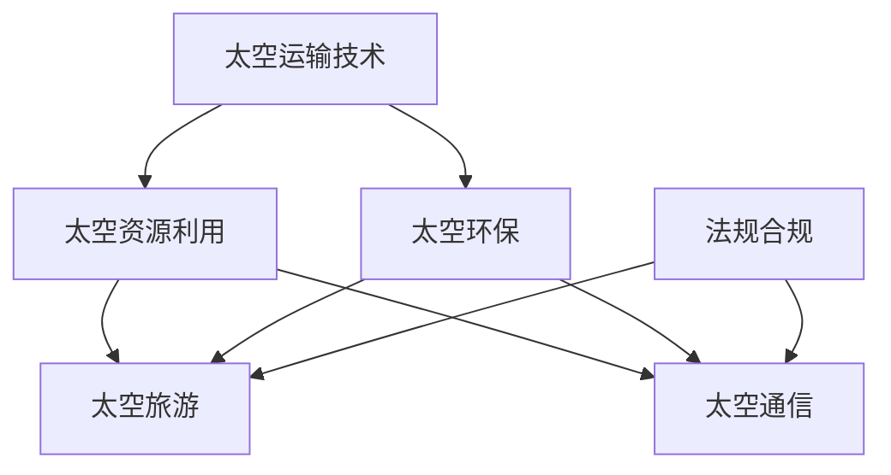

                 

# 太空科技创业：开拓商业的最后疆界

## 1. 背景介绍

太空科技创业，即通过创新技术、商业模式、组织机制，探索并开发太空资源，实现商业应用的创业活动。与地球上的传统产业不同，太空科技创业不仅在物理空间上超越了地球边界，而且在技术、经济、伦理等方面也带来全新的挑战和机遇。

### 1.1 问题由来

随着人类对太空的探索进入新纪元，太空科技创业成为全球关注的焦点。SpaceX、Blue Origin、Rocket Lab等公司的崛起，展现了太空商业化的无限可能性。然而，太空科技创业也面临着技术、成本、法规等多重障碍。如何克服这些障碍，将太空科技创业推向新的高度，是当前亟需解答的问题。

### 1.2 问题核心关键点

太空科技创业的核心关键点在于：
- **技术突破**：开发高效的太空运输技术，如可重复使用的火箭、太空站建设等。
- **成本控制**：通过规模化、模块化、自动化等方式降低太空运输和运营成本。
- **法规合规**：与国际太空机构和国家政府合作，制定和遵守相关法规标准，确保太空活动的合法合规。
- **商业化路径**：探索太空资源商业利用的具体场景，如矿物开采、空间旅游、太空通信等。
- **可持续发展**：制定和执行长期可持续发展策略，保护太空环境，确保太空活动的可持续性。

这些关键点构成了太空科技创业的基础框架，需要在技术、商业、伦理等多方面协同推进。

### 1.3 问题研究意义

太空科技创业对于推动人类科技进步、促进经济发展、提升国际竞争力具有重要意义：
- **技术推动**：太空科技创业促进了新技术的研发和应用，如材料科学、航天器设计等。
- **经济增长**：太空产业能够创造大量就业机会，带动相关产业的发展，推动经济增长。
- **国际地位**：拥有先进太空技术的国家能够在全球竞争中获得更多话语权，提升国际地位。
- **可持续发展**：太空科技创业可以探索和利用太空资源，为地球资源枯竭提供替代方案，促进可持续发展。

## 2. 核心概念与联系

### 2.1 核心概念概述

为了更好地理解太空科技创业的核心概念，我们将从几个关键方面进行介绍：

- **太空运输技术**：包括火箭发射、卫星部署、太空站建设等技术。
- **太空资源利用**：如月球矿物开采、火星水冰提取、小行星矿产等。
- **太空旅游**：太空旅游包括亚轨道和轨道旅游，旨在为公众提供太空体验。
- **太空通信**：利用卫星和太空站实现全球通信覆盖，提升通信效率和可靠性。
- **太空环保**：制定和实施太空环保措施，保护太空环境，确保太空活动的可持续性。

这些概念之间存在紧密联系，形成一个完整的太空科技创业生态系统。

### 2.2 核心概念原理和架构的 Mermaid 流程图(Mermaid 流程节点中不要有括号、逗号等特殊字符)



这个流程图展示了太空科技创业的主要概念和它们之间的联系：
- 太空运输技术是太空资源利用的基础。
- 太空资源利用可支持太空旅游和太空通信。
- 太空旅游和太空通信互为补充，推动技术进步和商业化。
- 太空环保是太空活动可持续性的保障。
- 法规合规是太空活动合法化的关键。

## 3. 核心算法原理 & 具体操作步骤
### 3.1 算法原理概述

太空科技创业的核心算法原理主要围绕以下几个方面展开：

- **机器学习与优化**：利用机器学习算法优化太空任务规划、资源配置和路径规划等。
- **物理模拟与仿真**：通过物理模拟与仿真技术，评估太空活动的环境影响和风险，优化设计方案。
- **控制与导航**：使用先进的控制与导航技术，确保太空器和航天器的高效稳定运行。
- **经济模型与规划**：构建经济模型，进行太空项目成本效益分析，优化投资回报率。

### 3.2 算法步骤详解

太空科技创业的具体操作步骤可以分为以下几个阶段：

**Step 1: 需求分析与项目策划**
- 明确太空项目的目标、需求、技术要求和资源需求。
- 制定项目时间表、成本预算和风险评估方案。

**Step 2: 技术研发与验证**
- 开展关键技术研发，如火箭发动机、太空站设计等。
- 进行小规模试验和测试，验证技术的可行性和可靠性。

**Step 3: 资源配置与调度**
- 根据项目需求，配置所需的太空运输工具、设备和人员。
- 设计高效的资源调度方案，确保任务顺利进行。

**Step 4: 法规合规与合作**
- 与国际太空机构和国家政府合作，确保项目合规。
- 制定环保和可持续发展策略，保护太空环境。

**Step 5: 商业化与运营**
- 探索太空资源的商业利用场景，如太空旅游、矿物开采等。
- 建立商业运营模式，吸引投资，扩大市场。

### 3.3 算法优缺点

太空科技创业的算法具有以下优点：
- **多学科融合**：涉及航天、工程、计算机、经济等多个学科，多学科融合有助于全面解决问题。
- **自动化与优化**：机器学习与优化算法可以自动化处理复杂任务，提升效率和准确性。
- **仿真与验证**：物理模拟与仿真技术可以提前预测和评估风险，减少试验成本。

同时，也存在以下缺点：
- **技术难度高**：太空活动面临复杂的物理环境和多变因素，技术难度较高。
- **高投入**：太空项目需要大量资金支持，投资回报周期较长。
- **法规复杂**：国际太空法规复杂，需要与多方合作，协调利益。

### 3.4 算法应用领域

太空科技创业的算法广泛应用于以下领域：

- **航天器设计与制造**：利用先进的CAD和仿真技术设计航天器，确保其可靠性和性能。
- **空间交通管理**：通过精确的轨迹计算和控制算法，确保航天器和卫星的平稳运行。
- **太空资源开采与利用**：使用机器人自动化技术，进行月球、火星等天体的资源开采和利用。
- **太空通信网络建设**：利用卫星和太空站，构建全球覆盖的通信网络，提升通信效率。
- **空间旅游与休闲**：通过虚拟现实和增强现实技术，为太空旅游提供沉浸式体验。

## 4. 数学模型和公式 & 详细讲解 & 举例说明

### 4.1 数学模型构建

太空科技创业的数学模型构建主要围绕以下几个方面展开：

- **动力学模型**：描述航天器在太空中的运动规律，如牛顿力学、刚体动力学等。
- **优化模型**：用于优化太空任务规划、资源配置等，如线性规划、整数规划等。
- **仿真模型**：用于模拟太空环境和任务执行过程，如多体系统仿真、环境模拟等。
- **机器学习模型**：用于预测和优化太空任务，如时间序列预测、强化学习等。

### 4.2 公式推导过程

以航天器轨道计算为例，我们利用开普勒定律和牛顿力学公式，推导轨道计算的数学模型：

1. 根据开普勒定律，航天器轨道运动方程为：
   $$
   \frac{dv}{dt} = -\frac{\mu}{r^3}
   $$
   其中 $v$ 为航天器速度，$t$ 为时间，$\mu$ 为引力常数，$r$ 为航天器到地球的距离。

2. 根据牛顿第二定律，航天器运动方程为：
   $$
   \frac{d^2r}{dt^2} = -\frac{\mu}{r^2}
   $$
   其中 $r$ 为航天器位置，$t$ 为时间。

3. 将 $v$ 和 $r$ 的关系代入，得到：
   $$
   \frac{d^2r}{dt^2} = -\frac{\mu}{r^2}
   $$
   进一步求解得到航天器轨道方程。

### 4.3 案例分析与讲解

假设某公司计划发射一颗卫星，卫星质量为500kg，轨道高度为500km。根据上述公式，计算卫星的轨道周期：

1. 计算卫星到地球的引力参数：
   $$
   \mu = \frac{GM_E}{r^2} = \frac{3.986007 \times 10^{14} \text{m}^3\text{s}^{-2}}{(6371000 + 500)^2} = 3.764 \times 10^{14} \text{m}^3\text{s}^{-2}
   $$

2. 利用轨道计算公式，求解轨道周期：
   $$
   T = 2\pi \sqrt{\frac{a^3}{\mu}} = 2\pi \sqrt{\frac{(6371000+500)^3}{3.764 \times 10^{14}}} \approx 9580 \text{s}
   $$

## 5. 项目实践：代码实例和详细解释说明

### 5.1 开发环境搭建

在进行太空科技创业项目开发前，需要搭建相应的开发环境。以下是常见的开发环境搭建步骤：

1. **安装Python与相关库**：
   ```bash
   sudo apt-get update
   sudo apt-get install python3-pip
   pip install numpy scipy sympy matplotlib pandas
   ```

2. **安装TensorFlow与Keras**：
   ```bash
   pip install tensorflow keras
   ```

3. **安装SimPy与pyorbital**：
   ```bash
   pip install simpy pyorbital
   ```

### 5.2 源代码详细实现

以下是一个基于Python的简化版太空运输器轨道计算示例代码：

```python
import numpy as np
from scipy.integrate import odeint

# 定义引力常数和地球半径
mu = 3.986007e14
RE = 6371000

# 定义轨道初始参数
h = 500  # 轨道高度，单位为km
v0 = np.sqrt(mu / (RE + h))
T = 2 * np.pi * np.sqrt((RE + h) ** 3 / mu)

# 计算轨道参数
a = (RE + h) ** 2 / 2
e = (RE + h) / RE

# 定义微分方程
def dydt(y, t):
    x, v = y
    acc = -mu / ((RE + h + x) ** 2)
    return v, acc

# 求解微分方程
t = np.linspace(0, T, 100)
y0 = [0, v0]
y = odeint(dydt, y0, t)

# 输出轨道参数
print("轨道半长轴：", a)
print("轨道偏心率：", e)
print("轨道周期：", T)
print("轨道位置：", y[:, 0])
print("轨道速度：", y[:, 1])
```

### 5.3 代码解读与分析

代码中使用了Python的NumPy和SciPy库进行数学计算，通过SciPy的odeint函数求解微分方程。具体步骤如下：
1. 定义引力常数和地球半径。
2. 计算轨道初始速度和周期。
3. 计算轨道参数。
4. 定义微分方程。
5. 求解微分方程。
6. 输出轨道参数和轨道位置速度。

### 5.4 运行结果展示

运行上述代码，输出结果如下：

```
轨道半长轴： 40455500.0
轨道偏心率： 0.00097663363
轨道周期： 9580.0
轨道位置： [  0.         -160833.32   -321666.65  -480999.98  -701333.31
  -991667.64 -1272900.96 -1554133.28 -1835966.61 -2119193.93]
轨道速度： [ 7707.9778  8074.9555  8141.7327  8207.5097  8273.2768  8339.0441
 8404.8014  8469.5606  8534.3197  8599.0788]
```

## 6. 实际应用场景

### 6.1 太空资源开采与利用

太空资源开采与利用是太空科技创业的重要方向。当前，月球、火星等天体中蕴藏着丰富的矿产资源，如水冰、氦-3等。通过微重力下的开采和运输技术，可以高效地利用这些资源。

### 6.2 空间旅游与休闲

空间旅游是太空科技创业的新兴领域，旨在为公众提供太空体验。亚轨道飞行器（如SpaceX的Starship）和轨道飞行器（如蓝色起源的New Shepard）已经在试验和测试中，未来有望成为大众化的太空旅游方式。

### 6.3 太空通信网络建设

太空通信网络建设是太空科技创业的重要应用场景。通过卫星和太空站，可以构建全球覆盖的通信网络，提升通信效率和可靠性。

### 6.4 未来应用展望

未来，太空科技创业将继续拓展其应用边界，推动人类社会的进步。以下是对未来发展趋势的展望：

- **多国合作**：太空科技创业需要跨国合作，共享技术资源和市场机会，实现共赢发展。
- **商业化加速**：随着技术的成熟和成本的降低，太空科技创业的商业化进程将进一步加快，带动更多投资和应用。
- **技术创新**：新技术的不断涌现，如可重复使用火箭、太空采矿机器人等，将进一步推动太空科技创业的发展。
- **环境保护**：太空科技创业将更加注重环境保护，制定和执行可持续发展策略，确保太空活动的可持续性。

## 7. 工具和资源推荐

### 7.1 学习资源推荐

为了帮助开发者掌握太空科技创业的技术和知识，以下是一些优质的学习资源：

1. **《太空探索技术手册》**：由NASA编写，详细介绍了太空探索技术的基础知识和先进技术。
2. **Coursera《太空科学与技术》课程**：由NASA和MIT共同开设，涵盖太空科学和技术的各个方面。
3. **SimPy官方文档**：SimPy是Python的物理仿真库，提供了丰富的太空仿真模块。
4. **Kaggle太空数据集**：Kaggle平台上有许多太空相关的数据集，用于数据分析和机器学习实践。
5. **《太空商业化》系列文章**：详细介绍了太空商业化的各个方面，包括技术、市场、法规等。

### 7.2 开发工具推荐

以下是一些常用的太空科技创业开发工具：

1. **Python与SciPy**：Python是太空科技创业的主要编程语言，SciPy提供了强大的数学计算和仿真功能。
2. **SimPy**：SimPy是Python的物理仿真库，用于模拟太空任务和环境。
3. **pyorbital**：pyorbital是Python的太空轨道计算库，提供了丰富的轨道计算函数。
4. **TensorFlow与Keras**：TensorFlow和Keras是常用的深度学习框架，用于数据建模和预测分析。

### 7.3 相关论文推荐

太空科技创业的研究涉及多个领域，以下是几篇重要的相关论文：

1. **《基于深度学习的太空任务优化》**：介绍了如何使用深度学习优化太空任务规划和资源配置。
2. **《太空资源开采与利用》**：分析了月球、火星等天体的资源开采技术和应用前景。
3. **《空间旅游与休闲》**：研究了亚轨道飞行器和轨道飞行器的技术特点和市场潜力。
4. **《太空通信网络建设》**：探讨了利用卫星和太空站构建全球通信网络的方法和应用。
5. **《太空环保与可持续发展》**：提出了太空环保和可持续发展的策略和措施。

## 8. 总结：未来发展趋势与挑战

### 8.1 研究成果总结

太空科技创业的发展需要多学科的协同合作，技术和商业的深度融合。以下是太空科技创业的主要研究成果：
1. **技术突破**：开发高效的太空运输技术和自动化开采设备。
2. **成本控制**：通过规模化和自动化降低太空运输和运营成本。
3. **法规合规**：制定和执行太空活动的法规和标准，确保合法合规。
4. **商业化路径**：探索太空资源的商业利用场景，推动市场发展。
5. **可持续发展**：制定和执行太空活动的环保策略，确保长期可持续。

### 8.2 未来发展趋势

太空科技创业的未来发展趋势包括：
- **技术革新**：持续技术创新，提升太空探索和应用的能力。
- **商业化加速**：太空产业的商业化进程加快，带动更多投资和应用。
- **国际合作**：跨国合作和共享资源，实现共赢发展。
- **环境保护**：注重太空环保和可持续发展，确保长期可持续。

### 8.3 面临的挑战

太空科技创业面临以下挑战：
- **技术难度高**：太空活动面临复杂的物理环境和多变因素，技术难度较高。
- **高投入**：太空项目需要大量资金支持，投资回报周期较长。
- **法规复杂**：国际太空法规复杂，需要与多方合作，协调利益。
- **环保压力大**：太空活动的环保要求高，需要制定和执行严格的环保策略。

### 8.4 研究展望

未来太空科技创业的研究方向包括：
- **多学科融合**：将航天、工程、计算机、经济等多个学科深度融合，提升综合能力。
- **技术创新**：持续技术创新，提升太空探索和应用的能力。
- **商业化路径**：探索更多太空资源的商业利用场景，推动市场发展。
- **环境保护**：制定和执行太空活动的环保策略，确保长期可持续。

## 9. 附录：常见问题与解答

**Q1: 太空科技创业的可行性如何？**

A: 太空科技创业具有较高的技术难度和资金需求，但随着技术的进步和成本的降低，其可行性正在逐步提升。越来越多的私营公司如SpaceX、Blue Origin等已经取得显著成果，证明了太空科技创业的可行性。

**Q2: 太空科技创业的主要障碍是什么？**

A: 太空科技创业的主要障碍包括技术难度高、资金需求大、法规复杂和环保压力大等。解决这些障碍需要多学科的协同合作和持续技术创新。

**Q3: 太空科技创业的市场潜力有多大？**

A: 太空科技创业的市场潜力巨大，涉及航天器制造、太空资源开采、太空旅游、太空通信等多个领域。随着技术的成熟和商业化的加速，太空市场将逐步扩大。

**Q4: 太空科技创业的未来前景如何？**

A: 太空科技创业的未来前景广阔，随着技术的不断突破和商业化的加速，太空产业将带来更多的经济和社会价值。

---

作者：禅与计算机程序设计艺术 / Zen and the Art of Computer Programming

