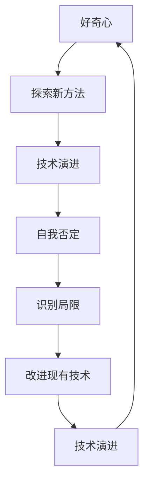

                 

## 1. 背景介绍

### 1.1 问题由来
好奇心是人类探索未知世界、不断进步的重要动力。在计算机科学领域，这种求知欲同样驱动着技术的不断创新与突破。技术的进展，往往源于对现状的不满和对新方法的探索。例如，随着互联网和社交媒体的发展，传统Web应用已无法满足用户日益增长的需求。Web前端开发者们开始探索新的技术，以提升用户体验和性能，React和Vue框架应运而生，大幅提升了Web应用的开发效率和用户体验。

在AI领域，好奇心亦是一个持续推进科技进步的重要因素。从早期的知识表示和符号推理，到机器学习、深度学习的兴起，再到现在的神经网络、Transformer模型，每一步进步都源于对现有技术的深入思考和探索。然而，这种探索常常伴随着自我否定，即对现有技术的缺陷和局限性的批判，并在此基础上寻求新方法的创新。本文旨在探讨好奇心与自我否定在技术进步中的作用，并从多个维度分析它们如何共同推动技术的不断演进。

### 1.2 问题核心关键点
好奇心与自我否定在技术进步中扮演着重要的角色，它们共同作用于技术的创新过程。好奇心驱动开发者探索新方法，激发对未知领域的兴趣；自我否定则促使开发者批判现有技术，挑战已有假设，寻求更高效、更鲁棒的解决方案。

本文将从以下几个方面深入探讨好奇心与自我否定在技术演进中的作用：

- 探索好奇心如何激发新方法的产生，推动技术进步。
- 分析自我否定如何批判现有技术，揭示其缺陷，指引新方向。
- 探讨好奇心与自我否定在技术演进过程中的互动关系。
- 讨论这两种动力如何驱动技术的未来发展。

## 2. 核心概念与联系

### 2.1 核心概念概述

为更好地理解好奇心与自我否定的关系，我们首先需要定义几个关键概念：

- **好奇心（Curiosity）**：驱动个体探索未知领域的心理倾向。在技术创新中，好奇心促使开发者持续学习，探索新的研究方法和应用场景。
- **自我否定（Self-criticism）**：对现有技术或方法进行反思和批判，识别其局限性和不足，并在此基础上寻求改进。
- **技术演进（Technological Evolution）**：通过创新和改进，现有技术不断迭代进步的过程。

这三个概念之间存在紧密联系，它们共同推动技术的持续发展。好奇心提供探索的动力，自我否定则指引探索的方向，技术演进则是结果。

### 2.2 核心概念原理和架构的 Mermaid 流程图(Mermaid 流程节点中不要有括号、逗号等特殊字符)

这个流程图展示了好奇心与自我否定在技术演进中的交互关系。好奇心驱动探索新方法，而对现有方法的自我否定则指引改进方向，促进技术的进一步演进。

## 3. 核心算法原理 & 具体操作步骤
### 3.1 算法原理概述

好奇心与自我否定的作用机制可以通过以下几个原理来理解：

1. **好奇心驱动探索**：好奇心促使开发者不断学习新知识，掌握新技能，从而探索未知领域，发现新问题。
2. **自我否定揭示缺陷**：通过自我否定，开发者能够识别现有技术的局限性和不足之处，引发改进需求。
3. **创新与改进的循环**：在探索与自我否定的循环中，技术不断优化，逐步演进。

### 3.2 算法步骤详解

基于好奇心与自我否定的作用机制，技术演进的总体流程可以分为以下步骤：

1. **激发好奇心**：开发人员通过阅读文献、参加会议、参与开源项目等方式，激发对新领域的好奇心。
2. **探索新方法**：在好奇心驱动下，开发者尝试新方法，并应用于实际项目中，验证其效果。
3. **自我否定批判**：在实践中，开发者通过评估新方法的表现，发现其不足之处，产生自我否定的反思。
4. **改进现有技术**：在自我否定的指导下，开发者进一步改进和优化现有技术，提高其性能和适用性。
5. **技术演进**：经过不断的探索和改进，技术不断演进，变得更加成熟和高效。

### 3.3 算法优缺点

基于好奇心与自我否定的技术演进方法具有以下优点：

1. **持续创新**：好奇心驱动下，开发者不断探索新方法，保持技术的新鲜感和创新性。
2. **高效改进**：自我否定促使开发者反思和改进现有技术，提高其适用性和稳定性。
3. **增强适应性**：在持续改进的过程中，技术能够更好地适应新环境和需求。

同时，该方法也存在一定的局限性：

1. **风险高**：探索新方法往往伴随着不确定性，可能失败或带来新的问题。
2. **成本高**：新技术的探索和验证需要大量时间和资源投入。
3. **依赖个人**：个人的好奇心和自我否定能力对技术演进有重要影响。

### 3.4 算法应用领域

好奇心与自我否定的技术演进方法广泛应用于以下几个领域：

1. **Web开发**：从早期HTML/CSS/JS到React/Vue等现代前端框架的诞生，都是开发者基于好奇心和自我否定的探索成果。
2. **AI与机器学习**：从早期的知识表示和符号推理到深度学习、神经网络，再到最新的Transformer模型，技术的每一步进展都源于对现有技术的深度批判和改进。
3. **云计算与分布式系统**：从早期的单体应用到微服务、容器化，再到现代的云原生架构，探索新技术不断优化系统架构。
4. **数据科学与大数据**：从传统的数据仓库到大数据平台、机器学习平台，技术演进始终伴随着对新数据处理技术和算法的探索和优化。
5. **物联网与边缘计算**：从简单的传感器到智能边缘设备，开发人员不断探索新的技术和方法，提升物联网系统的智能水平。

## 4. 数学模型和公式 & 详细讲解 & 举例说明（备注：数学公式请使用latex格式，latex嵌入文中独立段落使用 $$，段落内使用 $)
### 4.1 数学模型构建

在技术演进的过程中，数学模型常常作为分析工具，帮助开发者理解现有技术，探索新方法。以Web前端开发为例，我们可以建立一个简单的数学模型来描述技术演进的过程。

假设初始技术为 $T_0$，新方法的引入为 $T_1$。在探索过程中，技术通过改进逐步演进为 $T_n$。

1. **初始状态**：
   $$
   T_0 = \{S_0, F_0\}
   $$
   其中 $S_0$ 表示现有技术的系统结构，$F_0$ 表示系统的功能。

2. **新方法引入**：
   $$
   T_1 = \{S_1, F_1\}
   $$
   其中 $S_1$ 表示引入新方法后的系统结构，$F_1$ 表示改进后的功能。

3. **持续改进**：
   $$
   T_n = \{S_n, F_n\}
   $$
   其中 $S_n$ 表示第 $n$ 次改进后的系统结构，$F_n$ 表示系统的最新功能。

### 4.2 公式推导过程

通过上述模型，我们可以推导出技术演进的数学公式：

1. **系统结构改进**：
   $$
   S_{n+1} = S_n + \Delta S
   $$
   其中 $\Delta S$ 表示改进措施，可以是代码优化、架构重构等。

2. **功能扩展**：
   $$
   F_{n+1} = F_n + \Delta F
   $$
   其中 $\Delta F$ 表示新功能的增加，可以是新特性、新模块等。

3. **技术演进**：
   $$
   T_{n+1} = (S_{n+1}, F_{n+1})
   $$

通过不断改进系统结构和增加功能，技术逐步演进，变得更加高效和灵活。

### 4.3 案例分析与讲解

以Web前端开发为例，我们可以分析React和Vue框架的演进过程：

1. **React的演进**：
   - 最初，开发者通过阅读《JavaScript: The Good Parts》等书籍，对现有Web技术感到不满，激发好奇心。
   - 通过实验和探索，开发者引入了虚拟DOM和组件化的思想，引入新的前端框架React。
   - 在自我否定的驱动下，开发者识别React的不足之处，如单向数据流、虚拟DOM的性能问题等。
   - 开发者通过改进现有技术，引入新特性如React Hooks、React Suspense等，逐步优化React框架。

2. **Vue的演进**：
   - 同样，开发者通过阅读《JavaScript设计模式与设计原则》等书籍，激发好奇心。
   - 通过实验和探索，开发者引入了组件化、模板化的思想，引入Vue框架。
   - 在自我否定的驱动下，开发者识别Vue的不足之处，如单文件组件、双向数据绑定等。
   - 开发者通过改进现有技术，引入新特性如Vue Mixin、Vue Router等，逐步优化Vue框架。

## 5. 项目实践：代码实例和详细解释说明
### 5.1 开发环境搭建

在进行技术演进实践前，我们需要准备好开发环境。以下是使用Python进行Web开发的环境配置流程：

1. 安装Python：从官网下载并安装Python 3.x，推荐使用Python 3.8以上版本。
2. 安装Django：使用pip安装Django框架。
   ```
   pip install Django
   ```
3. 安装前端框架：使用npm安装React或Vue框架。
   ```
   npm install react react-dom
   ```
4. 创建Django项目和应用。
   ```
   django-admin startproject myproject
   cd myproject
   python manage.py startapp myapp
   ```
5. 创建数据库模型和迁移。
   ```
   python manage.py makemigrations
   python manage.py migrate
   ```

### 5.2 源代码详细实现

下面我们以React框架为例，给出使用Django后端和React前端开发Web应用的代码实现。

```python
# 后端代码
from django.shortcuts import render
from django.http import JsonResponse

def index(request):
    data = {
        'name': 'John Doe',
        'age': 30,
        'is_admin': True,
    }
    return JsonResponse(data)

# 前端代码
import React, { useState, useEffect } from 'react';
import ReactDOM from 'react-dom';

function App() {
    const [data, setData] = useState({});

    useEffect(() => {
        fetch('/api/data')
            .then(response => response.json())
            .then(data => setData(data))
            .catch(error => console.error(error));
    }, []);

    return (
        <div>
            <h1>{data.name}</h1>
            <p>{data.age} years old</p>
            {data.is_admin && <p>Admin</p>}
        </div>
    );
}

ReactDOM.render(<App />, document.getElementById('root'));
```

### 5.3 代码解读与分析

让我们再详细解读一下关键代码的实现细节：

**后端代码**：
- 使用Django框架创建了一个简单的Web应用，包含了路由和视图函数。
- 视图函数通过访问Django模型查询数据，并返回JSON格式的响应。

**前端代码**：
- 使用React创建了一个简单的组件，用于展示后端返回的数据。
- 使用useState和useEffect钩子进行状态管理和数据获取，实现异步数据获取和组件更新。

通过React和Django的结合，我们展示了Web应用的前端和后端开发过程，说明了技术演进中前后端之间的协同工作。

## 6. 实际应用场景

### 6.1 智慧城市

智慧城市建设需要大量的技术支持，包括数据采集、存储、分析、可视化和应用。技术的演进不断提升智慧城市的智能化水平，促进城市治理和公共服务的提升。

1. **物联网技术**：开发者通过好奇心探索新的物联网技术，如传感器、边缘计算等，提升城市的数据采集能力。
2. **大数据分析**：在数据采集的基础上，开发者通过自我否定识别现有分析方法的局限性，引入新的数据处理技术，如机器学习、深度学习等，提高数据分析的精度和效率。
3. **云计算平台**：开发者探索和优化云计算平台，提高数据存储和处理的可扩展性和安全性。
4. **智能应用**：通过探索和优化现有技术，引入新的智能应用，如智慧交通、智能安防等，提升城市治理效率和公众服务水平。

### 6.2 金融科技

金融科技的演进推动了金融行业的数字化转型，提高了金融服务的效率和便捷性。

1. **区块链技术**：开发者通过好奇心探索区块链技术，解决金融领域的信任和透明问题。
2. **智能合约**：在区块链技术的基础上，开发者探索智能合约的应用，提高金融交易的自动化和智能化水平。
3. **大数据风控**：在数据采集和处理的基础上，开发者通过自我否定识别现有风控方法的局限性，引入新的数据分析技术，提升风险控制能力。
4. **金融AI**：通过探索和优化现有技术，引入金融AI应用，如智能客服、智能投顾等，提升金融服务的智能化和个性化水平。

### 6.3 医疗健康

医疗健康领域的演进推动了医疗服务的智能化和个性化，提升了医疗服务质量和效率。

1. **医学影像技术**：开发者通过好奇心探索新的医学影像技术，如深度学习、医疗影像增强等，提升医学影像诊断的准确性。
2. **健康管理**：在医学影像技术的基础上，开发者通过自我否定识别现有健康管理方法的局限性，引入新的数据分析技术，提升健康管理的能力。
3. **远程医疗**：通过探索和优化现有技术，引入远程医疗应用，提高医疗服务的可及性和便利性。
4. **智能药物研发**：通过探索和优化现有技术，引入智能药物研发平台，加速新药的研发进程。

### 6.4 未来应用展望

随着技术的发展，未来技术演进将更加深入和广泛，推动更多领域数字化转型。

1. **工业4.0**：物联网、人工智能、机器人等技术的结合，推动制造业的智能化升级，提升生产效率和质量。
2. **自动驾驶**：通过探索和优化现有技术，引入自动驾驶技术，推动交通运输行业的智能化和自动化。
3. **教育科技**：通过探索和优化现有技术，引入教育科技应用，提升教育质量和效率，推动教育公平。
4. **智能家居**：通过探索和优化现有技术，引入智能家居设备，提升家庭生活的智能化水平。

## 7. 工具和资源推荐

### 7.1 学习资源推荐

为了帮助开发者系统掌握技术演进的相关知识，这里推荐一些优质的学习资源：

1. **《深入理解计算机系统》**：介绍计算机系统和操作系统，为技术演进提供底层支持。
2. **《计算机程序设计艺术》**：经典的技术书籍，涵盖算法、数据结构、操作系统等多个领域，为技术演进提供深入的理论基础。
3. **《Web开发实战》**：涵盖Web开发全栈技术，从前端到后端，为技术演进提供实战经验。
4. **《TensorFlow官方文档》**：深度学习框架TensorFlow的官方文档，提供丰富的教程和示例，为技术演进提供技术支持。
5. **《机器学习实战》**：涵盖机器学习和深度学习的基本概念和实践，为技术演进提供算法支持。

通过对这些资源的学习实践，相信你一定能够系统掌握技术演进的基础知识和实践技巧，为技术探索和自我否定提供坚实的理论基础。

### 7.2 开发工具推荐

高效的开发离不开优秀的工具支持。以下是几款用于技术演进开发的常用工具：

1. **GitHub**：全球最大的代码托管平台，提供丰富的开源项目和社区资源，方便开发者进行技术交流和合作。
2. **Visual Studio Code**：轻量级的前端开发工具，支持丰富的插件和扩展，提高开发效率。
3. **JIRA**：项目管理工具，帮助开发者进行任务分配和进度跟踪，优化团队协作。
4. **Docker**：容器化技术，帮助开发者进行环境管理和部署，提升应用的稳定性和可移植性。
5. **Kubernetes**：容器编排平台，帮助开发者进行应用部署和资源管理，提升应用的可扩展性和弹性。

合理利用这些工具，可以显著提升技术演进任务的开发效率，加快创新迭代的步伐。

### 7.3 相关论文推荐

技术演进的相关研究源于学界的持续探索。以下是几篇奠基性的相关论文，推荐阅读：

1. **《深度学习》**：深度学习领域的经典教材，介绍深度学习的基本概念、算法和应用。
2. **《计算机程序设计艺术》**：经典的技术书籍，涵盖算法、数据结构、操作系统等多个领域，为技术演进提供深入的理论基础。
3. **《机器学习实战》**：涵盖机器学习和深度学习的基本概念和实践，为技术演进提供算法支持。
4. **《Web前端开发实战》**：涵盖Web开发全栈技术，从前端到后端，为技术演进提供实战经验。
5. **《TensorFlow官方文档》**：深度学习框架TensorFlow的官方文档，提供丰富的教程和示例，为技术演进提供技术支持。

这些论文代表了大语言模型微调技术的发展脉络。通过学习这些前沿成果，可以帮助研究者把握学科前进方向，激发更多的创新灵感。

## 8. 总结：未来发展趋势与挑战

### 8.1 总结

本文对技术演进中好奇心与自我否定之间的关系进行了全面系统的介绍。首先阐述了好奇心和自我否定在技术演进中的重要角色，明确了两者在推动技术进步中的作用。其次，从原理到实践，详细讲解了技术演进过程中的好奇心驱动和自我否定指导，给出了技术演进实践的完整代码实例。同时，本文还广泛探讨了技术演进在智慧城市、金融科技、医疗健康等领域的广泛应用，展示了技术演进范式的巨大潜力。

通过本文的系统梳理，可以看到，好奇心与自我否定在技术演进中扮演着重要角色，它们共同作用于技术的创新过程。开发者通过好奇心探索新方法，激发对未知领域的兴趣；通过自我否定批判现有技术，揭示其缺陷，指引新方向。技术演进正是通过探索与批判的循环，不断优化和进步。

### 8.2 未来发展趋势

展望未来，技术演进的趋势将更加复杂和多样。以下是几个可能的趋势：

1. **跨领域融合**：随着技术的不断进步，不同领域的融合将更加深入。例如，AI与医疗、金融、教育等领域结合，推动各领域的智能化转型。
2. **边缘计算**：随着物联网技术的发展，边缘计算将成为未来计算的重要形式，提升计算的实时性和安全性。
3. **自动化与智能化**：自动化与智能化的技术不断进步，未来将更多地应用于生产、医疗、教育等领域，提升效率和质量。
4. **可持续发展**：技术的进步将更加注重环保和可持续发展，推动绿色技术和环保技术的发展。

### 8.3 面临的挑战

尽管技术演进不断进步，但在迈向更加智能化、普适化应用的过程中，仍面临诸多挑战：

1. **技术壁垒**：现有技术的技术壁垒使得新方法的探索和应用存在难度，需要更多的投入和研究。
2. **数据隐私**：技术演进中的数据隐私问题需要更多关注，如何在保护隐私的前提下进行数据共享和分析。
3. **伦理和法规**：技术演进需要更多关注伦理和法规问题，确保技术应用符合社会价值观和法律法规。
4. **资源和环境**：技术演进需要更多的资源投入，如何在资源和环境限制下进行技术创新。

### 8.4 研究展望

面对技术演进所面临的挑战，未来的研究需要在以下几个方面寻求新的突破：

1. **多模态融合**：探索多模态技术的融合，提高系统的智能化水平，更好地理解和处理复杂的多模态数据。
2. **自动化与智能化**：研究自动化与智能化的技术，提升生产、医疗、教育等领域的应用效率和质量。
3. **可持续发展**：推动绿色技术和环保技术的发展，实现技术的可持续发展。
4. **跨领域融合**：推动跨领域的融合，实现各领域的协同发展，提升整体的技术水平。

这些研究方向将引领技术演进走向更加智能化、普适化，推动各领域的数字化转型升级。

## 9. 附录：常见问题与解答

**Q1：技术演进中好奇心和自我否定的关系是什么？**

A: 好奇心和自我否定的关系是相辅相成的。好奇心驱动开发者探索新方法，激发对未知领域的兴趣；自我否定则促使开发者批判现有技术，揭示其缺陷，指引新方向。两者共同推动技术的不断优化和进步。

**Q2：技术演进中的自我否定应该如何进行？**

A: 技术演进中的自我否定需要从多个角度进行，包括：
1. **数据分析**：通过数据分析，识别现有技术的不足之处，如性能瓶颈、数据问题等。
2. **技术评审**：定期进行技术评审，邀请专家对现有技术进行评估和指导。
3. **用户反馈**：收集用户反馈，了解实际应用中的问题，进行改进。
4. **文献研究**：通过阅读最新的学术论文和研究报告，了解前沿技术进展，进行自我否定。

**Q3：技术演进中如何避免自我否定带来的负面影响？**

A: 自我否定可能会带来一些负面影响，如对现有技术的过度否定，导致技术不稳定和风险增加。为了避免这些负面影响，可以采取以下措施：
1. **平衡新旧技术**：在探索新技术的同时，保留原有技术的稳定性。
2. **渐进式更新**：逐步引入新技术，避免一次性大规模变更。
3. **风险评估**：在引入新技术前，进行充分的风险评估和测试，确保技术的稳定性。

**Q4：技术演进中好奇心和自我否定如何平衡？**

A: 好奇心和自我否定的平衡可以通过以下方式实现：
1. **明确目标**：设定明确的技术目标和演进方向，引导好奇心和自我否定的方向。
2. **合理投入**：在好奇心和自我否定之间合理分配资源，避免过度否定或过度探索。
3. **持续改进**：在探索新方法的同时，持续优化现有技术，确保技术演进的连续性和稳定性。

通过平衡好奇心和自我否定，可以实现技术的持续优化和稳定发展。

---

作者：禅与计算机程序设计艺术 / Zen and the Art of Computer Programming

