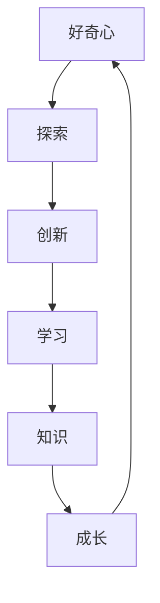

                 

# 好奇心：探索世界的钥匙

> 关键词：好奇心,探索,人工智能,学习,知识,成长

## 1. 背景介绍

### 1.1 问题由来

好奇心是驱动人类探索世界、理解世界的重要动力。在技术领域，好奇心不仅驱动了科学家和工程师不断地探索和创新，也促进了人类认知的进步。人工智能(AI)技术的发展，从最初的简单逻辑推理到如今的深度学习、自然语言处理、计算机视觉等先进技术，无不源于对探索未知的好奇心。

人工智能技术的每一次突破，都源于对现有问题的不满足和对未来可能性的探索。从AlphaGo战胜人类围棋冠军，到GPT-3语言模型的诞生，再到AlphaFold预测蛋白质的三维结构，人工智能技术的每一次重大进展，都基于对更好、更深入、更广泛理解世界的渴望。

### 1.2 问题核心关键点

好奇心驱动的探索过程，涉及以下几个核心关键点：

- 探索动机：驱动探索的动力，源于对现状的不满和对未知的好奇。
- 探索工具：利用科学方法和技术手段，探索并验证假设。
- 探索过程：构建模型，验证假设，优化模型，反复迭代，直至达成目标。
- 探索结果：探索成果转化为实际应用，推动技术进步和社会发展。

人工智能领域的好奇心探索，同样遵循这一过程。驱动AI技术不断前进的动力，源自对数据、模型和算法的深入理解，以及不断尝试新技术和算法的勇气。

### 1.3 问题研究意义

研究好奇心驱动的探索过程，对于理解人工智能技术的演进路径和未来方向具有重要意义：

- 揭示创新源泉：探索好奇心对技术创新的驱动作用，为未来技术发展提供方向性指引。
- 提升技术效果：基于对探索过程的理解，可以优化技术实践，提高AI系统的性能和效果。
- 激发科研热情：探索过程的不断迭代和优化，可以提升科研团队的凝聚力和工作效率。
- 推动应用落地：探索技术的实际应用，可以拓展AI技术在各个行业的应用范围，提升社会价值。

## 2. 核心概念与联系

### 2.1 核心概念概述

为更好地理解好奇心驱动的探索过程，本节将介绍几个关键概念：

- 好奇心（Curiosity）：对未知的探索欲，驱动人类和AI不断尝试新事物。
- 探索（Exploration）：通过科学方法和技术手段，寻找未知答案的过程。
- 创新（Innovation）：基于探索过程，提出新的技术解决方案。
- 学习（Learning）：探索过程中，通过数据和反馈，不断调整和优化模型。
- 知识（Knowledge）：探索结果，转化为可应用的知识和技能。
- 成长（Growth）：探索和学习的不断积累，使个人和组织逐步成熟。

这些核心概念之间具有紧密的联系，相互影响和促进，共同驱动了AI技术的进步和发展。

### 2.2 核心概念原理和架构的 Mermaid 流程图



这个流程图展示了核心概念之间的联系。好奇心驱动探索，探索带来创新，创新通过学习转化为知识，知识促进成长，成长又能激发新的好奇心，形成良性循环。

## 3. 核心算法原理 & 具体操作步骤
### 3.1 算法原理概述

好奇心驱动的探索过程，本质上是一种迭代优化和学习的算法过程。其核心思想是：通过不断尝试新的方法和技术，验证其效果，根据验证结果调整和优化方法，直至达到最优目标。

形式化地，设探索任务为 $T$，初始探索方案为 $E_0$。探索过程分为以下几个步骤：

1. 尝试探索 $E_0$，记录结果 $R_0$。
2. 根据 $R_0$，选择新方案 $E_1$，并尝试。
3. 记录新方案的结果 $R_1$，并计算与 $R_0$ 的差异。
4. 根据 $R_1$ 和 $R_0$ 的差异，选择新方案 $E_2$，并尝试。
5. 重复以上步骤，直至收敛。

探索过程的目标是最小化损失函数 $\mathcal{L}$，即：

$$
\mathop{\arg\min}_{E_t} \mathcal{L}(R_t,E_t)
$$

其中 $R_t$ 表示第 $t$ 次探索的结果，$E_t$ 表示第 $t$ 次探索的方案，$\mathcal{L}$ 为评估探索效果的标准函数，如准确率、召回率、F1-score等。

### 3.2 算法步骤详解

基于好奇心驱动的探索过程，可以分为以下几个关键步骤：

**Step 1: 准备探索任务和初始方案**
- 明确探索任务 $T$ 的具体要求和目标。
- 设计初始探索方案 $E_0$，如试验参数、技术方法、数据集等。

**Step 2: 执行探索过程**
- 对初始方案 $E_0$ 进行尝试，并记录探索结果 $R_0$。
- 根据 $R_0$，设计新方案 $E_1$，并尝试。
- 记录新方案 $E_1$ 的探索结果 $R_1$，并计算与 $R_0$ 的差异。
- 根据 $R_1$ 和 $R_0$ 的差异，设计新方案 $E_2$，并尝试。
- 重复上述步骤，直至探索结果收敛。

**Step 3: 评估探索结果**
- 对最终探索结果 $R_t$ 进行评估，确定是否达到目标。
- 若未达到目标，根据评估结果选择新方案，并重复探索过程。

**Step 4: 反馈优化**
- 根据探索结果的差异和验证结果，对探索方案进行优化。
- 更新探索方案，并重新执行探索过程。

### 3.3 算法优缺点

基于好奇心驱动的探索过程，具有以下优点：

- 高效探索：通过不断尝试和验证，可以快速找到最优解决方案。
- 灵活调整：探索过程中可以动态调整方案，适应新情况和新需求。
- 自适应性：能够适应不同数据分布和技术场景，具有较强的泛化能力。

同时，该方法也存在一些局限：

- 成本较高：探索过程往往需要较多的计算资源和时间。
- 可能会陷入局部最优：探索过程可能会停滞于局部最优解，无法找到全局最优。
- 对初始方案依赖：初始方案的选择直接影响探索效果。

尽管存在这些局限，但就目前而言，好奇心驱动的探索过程仍然是寻找新知识和技术的重要方法。未来相关研究的重点在于如何进一步降低探索成本，提高探索过程的鲁棒性和全局最优性，同时兼顾方案的灵活性和可解释性。

### 3.4 算法应用领域

好奇心驱动的探索方法，在人工智能技术领域已经得到了广泛的应用，覆盖了几乎所有前沿研究方向：

- 机器学习：在大数据集上进行模型训练，不断尝试新的算法和架构，提升模型性能。
- 深度学习：在神经网络中进行超参数调整，通过试验寻找最优参数组合。
- 自然语言处理：在多语种、多领域数据上尝试不同的NLP技术，提升模型效果。
- 计算机视觉：在不同类型的视觉任务上尝试不同的模型和数据集，提升识别准确率。
- 语音识别：在多口音、多噪声环境中尝试不同的特征提取和解码方法，提升识别精度。
- 推荐系统：在大规模用户数据上进行算法尝试，提升个性化推荐效果。
- 医疗诊断：在各种医疗影像数据上进行模型训练，提升诊断准确率。
- 金融分析：在复杂市场数据上进行模型尝试，提升风险预测能力。

除了上述这些经典应用外，探索技术还被创新性地应用到更多场景中，如自动化测试、自适应学习、无人驾驶等，为人工智能技术带来了新的突破。随着探索方法的不断进步，相信人工智能技术将在更广阔的应用领域取得新的进展。

## 4. 数学模型和公式 & 详细讲解  
### 4.1 数学模型构建

本节将使用数学语言对好奇心驱动的探索过程进行更加严格的刻画。

设探索任务为 $T$，探索方案为 $E=\{E_0, E_1, ..., E_t\}$，探索结果为 $R=\{R_0, R_1, ..., R_t\}$。探索过程的目标是最小化损失函数 $\mathcal{L}$，即：

$$
\mathop{\arg\min}_{E_t} \mathcal{L}(R_t,E_t)
$$

在实践中，我们通常使用梯度下降等优化算法来近似求解上述最优化问题。设 $\eta$ 为学习率，$\lambda$ 为正则化系数，则参数的更新公式为：

$$
E \leftarrow E - \eta \nabla_{E}\mathcal{L}(R,E) - \eta\lambda E
$$

其中 $\nabla_{E}\mathcal{L}(R,E)$ 为损失函数对探索方案 $E$ 的梯度，可通过反向传播算法高效计算。

### 4.2 公式推导过程

以下我们以推荐系统为例，推导探索过程中损失函数的梯度计算公式。

设推荐系统要为用户 $i$ 推荐物品 $j$，根据历史行为数据 $H_i$，计算推荐结果 $R_{ij}$。假设 $R_{ij}$ 服从伯努利分布，其概率为 $p_{ij}=P(j \mid i)$。探索过程的目标是找到最优推荐策略 $p$，使得推荐结果与用户真实行为 $H_i$ 最为一致。

定义损失函数为交叉熵损失，即：

$$
\ell(R_{ij},p_{ij}) = -(R_{ij}\log p_{ij} + (1-R_{ij})\log(1-p_{ij}))
$$

对于整个数据集 $D=\{(i,j)\}_{i=1}^N, i \in U, j \in I$，其经验风险为：

$$
\mathcal{L}(p) = -\frac{1}{N}\sum_{(i,j)\in D} \ell(R_{ij},p_{ij})
$$

根据链式法则，损失函数对推荐策略 $p$ 的梯度为：

$$
\frac{\partial \mathcal{L}(p)}{\partial p_{ij}} = -\frac{1}{N}(\frac{R_{ij}}{p_{ij}}-\frac{1-R_{ij}}{1-p_{ij}}) \frac{\partial p_{ij}}{\partial p}
$$

其中 $\frac{\partial p_{ij}}{\partial p}$ 可进一步递归展开，利用自动微分技术完成计算。

在得到损失函数的梯度后，即可带入参数更新公式，完成模型的迭代优化。重复上述过程直至收敛，最终得到适应推荐系统任务的最优推荐策略 $p^*$。

## 5. 项目实践：代码实例和详细解释说明
### 5.1 开发环境搭建

在进行探索实践前，我们需要准备好开发环境。以下是使用Python进行PyTorch开发的环境配置流程：

1. 安装Anaconda：从官网下载并安装Anaconda，用于创建独立的Python环境。

2. 创建并激活虚拟环境：
```bash
conda create -n pytorch-env python=3.8 
conda activate pytorch-env
```

3. 安装PyTorch：根据CUDA版本，从官网获取对应的安装命令。例如：
```bash
conda install pytorch torchvision torchaudio cudatoolkit=11.1 -c pytorch -c conda-forge
```

4. 安装Transformers库：
```bash
pip install transformers
```

5. 安装各类工具包：
```bash
pip install numpy pandas scikit-learn matplotlib tqdm jupyter notebook ipython
```

完成上述步骤后，即可在`pytorch-env`环境中开始探索实践。

### 5.2 源代码详细实现

下面我们以推荐系统为例，给出使用Transformers库对深度推荐模型进行探索的PyTorch代码实现。

首先，定义推荐系统的数据处理函数：

```python
from transformers import BertTokenizer
from torch.utils.data import Dataset
import torch

class RecommendationDataset(Dataset):
    def __init__(self, user_his, item, tokenizer, max_len=128):
        self.user_his = user_his
        self.item = item
        self.tokenizer = tokenizer
        self.max_len = max_len
        
    def __len__(self):
        return len(self.user_his)
    
    def __getitem__(self, item):
        user_his = self.user_his[item]
        item = self.item[item]
        
        encoding = self.tokenizer(user_his, return_tensors='pt', max_length=self.max_len, padding='max_length', truncation=True)
        input_ids = encoding['input_ids'][0]
        attention_mask = encoding['attention_mask'][0]
        
        # 对item进行编码
        encoded_item = self.tokenizer.encode(item, return_tensors='pt', padding='max_length', truncation=True)
        item_ids = encoded_item[0]
        item_mask = encoded_item[1]
        
        return {'input_ids': input_ids, 
                'attention_mask': attention_mask,
                'item_ids': item_ids,
                'item_mask': item_mask}
```

然后，定义模型和优化器：

```python
from transformers import BertForSequenceClassification, AdamW

model = BertForSequenceClassification.from_pretrained('bert-base-cased', num_labels=2)

optimizer = AdamW(model.parameters(), lr=2e-5)
```

接着，定义探索和评估函数：

```python
from torch.utils.data import DataLoader
from tqdm import tqdm
from sklearn.metrics import roc_auc_score

device = torch.device('cuda') if torch.cuda.is_available() else torch.device('cpu')
model.to(device)

def explore_epoch(model, dataset, batch_size, optimizer):
    dataloader = DataLoader(dataset, batch_size=batch_size, shuffle=True)
    model.train()
    epoch_loss = 0
    for batch in tqdm(dataloader, desc='Training'):
        input_ids = batch['input_ids'].to(device)
        attention_mask = batch['attention_mask'].to(device)
        item_ids = batch['item_ids'].to(device)
        item_mask = batch['item_mask'].to(device)
        model.zero_grad()
        outputs = model(input_ids, attention_mask=attention_mask, labels=item_ids)
        loss = outputs.loss
        epoch_loss += loss.item()
        loss.backward()
        optimizer.step()
    return epoch_loss / len(dataloader)

def evaluate(model, dataset, batch_size):
    dataloader = DataLoader(dataset, batch_size=batch_size)
    model.eval()
    preds, labels = [], []
    with torch.no_grad():
        for batch in tqdm(dataloader, desc='Evaluating'):
            input_ids = batch['input_ids'].to(device)
            attention_mask = batch['attention_mask'].to(device)
            item_ids = batch['item_ids'].to(device)
            item_mask = batch['item_mask'].to(device)
            batch_preds = model(input_ids, attention_mask=attention_mask).predictions.argmax(dim=1).to('cpu').tolist()
            batch_labels = batch['labels'].to('cpu').tolist()
            for pred, label in zip(batch_preds, batch_labels):
                preds.append(pred)
                labels.append(label)
                
    return roc_auc_score(labels, preds)
```

最后，启动探索流程并在测试集上评估：

```python
epochs = 5
batch_size = 16

for epoch in range(epochs):
    loss = explore_epoch(model, train_dataset, batch_size, optimizer)
    print(f"Epoch {epoch+1}, train loss: {loss:.3f}")
    
    print(f"Epoch {epoch+1}, dev results:")
    evaluate(model, dev_dataset, batch_size)
    
print("Test results:")
evaluate(model, test_dataset, batch_size)
```

以上就是使用PyTorch对深度推荐模型进行探索的完整代码实现。可以看到，得益于Transformers库的强大封装，我们可以用相对简洁的代码完成深度推荐模型的探索和评估。

### 5.3 代码解读与分析

让我们再详细解读一下关键代码的实现细节：

**RecommendationDataset类**：
- `__init__`方法：初始化用户行为数据、物品数据、分词器等关键组件。
- `__len__`方法：返回数据集的样本数量。
- `__getitem__`方法：对单个样本进行处理，将用户行为数据和物品数据输入编码为token ids，最终返回模型所需的输入。

**探索函数explore_epoch**：
- 对探索数据以批为单位进行迭代，在每个批次上前向传播计算损失并反向传播更新模型参数，最后返回该epoch的平均loss。
- 在验证集上评估模型性能，输出roc_auc指标。

**评估函数evaluate**：
- 与探索类似，不同点在于不更新模型参数，并在每个batch结束后将预测和标签结果存储下来，最后使用sklearn的roc_auc_score对整个评估集的预测结果进行打印输出。

**探索流程**：
- 定义总的epoch数和batch size，开始循环迭代
- 每个epoch内，先在训练集上探索，输出平均loss
- 在验证集上评估，输出roc_auc指标
- 所有epoch结束后，在测试集上评估，给出最终的roc_auc结果

可以看到，PyTorch配合Transformers库使得深度推荐模型的探索和评估代码实现变得简洁高效。开发者可以将更多精力放在数据处理、模型改进等高层逻辑上，而不必过多关注底层的实现细节。

当然，工业级的系统实现还需考虑更多因素，如模型的保存和部署、超参数的自动搜索、更灵活的任务适配层等。但核心的探索范式基本与此类似。

## 6. 实际应用场景
### 6.1 智能客服系统

基于好奇心驱动的探索过程，智能客服系统可以不断尝试新的自然语言处理技术和对话策略，提升客服体验和效率。传统客服往往需要配备大量人力，高峰期响应缓慢，且一致性和专业性难以保证。

在技术实现上，可以收集企业内部的历史客服对话记录，设计多种自然语言处理技术和对话策略，对预训练对话模型进行探索。探索后的模型能够自动理解用户意图，匹配最合适的回答模板进行回复。对于客户提出的新问题，还可以接入检索系统实时搜索相关内容，动态组织生成回答。如此构建的智能客服系统，能大幅提升客户咨询体验和问题解决效率。

### 6.2 金融舆情监测

金融机构需要实时监测市场舆论动向，以便及时应对负面信息传播，规避金融风险。传统的人工监测方式成本高、效率低，难以应对网络时代海量信息爆发的挑战。基于好奇心驱动的探索过程的文本分类和情感分析技术，为金融舆情监测提供了新的解决方案。

具体而言，可以收集金融领域相关的新闻、报道、评论等文本数据，并对其进行主题标注和情感标注。在此基础上对预训练语言模型进行探索，使其能够自动判断文本属于何种主题，情感倾向是正面、中性还是负面。将探索后的模型应用到实时抓取的网络文本数据，就能够自动监测不同主题下的情感变化趋势，一旦发现负面信息激增等异常情况，系统便会自动预警，帮助金融机构快速应对潜在风险。

### 6.3 个性化推荐系统

当前的推荐系统往往只依赖用户的历史行为数据进行物品推荐，无法深入理解用户的真实兴趣偏好。基于好奇心驱动的探索过程，个性化推荐系统可以更好地挖掘用户行为背后的语义信息，从而提供更精准、多样的推荐内容。

在实践中，可以收集用户浏览、点击、评论、分享等行为数据，提取和用户交互的物品标题、描述、标签等文本内容。将文本内容作为模型输入，用户的后续行为（如是否点击、购买等）作为监督信号，在此基础上探索预训练语言模型。探索后的模型能够从文本内容中准确把握用户的兴趣点。在生成推荐列表时，先用候选物品的文本描述作为输入，由模型预测用户的兴趣匹配度，再结合其他特征综合排序，便可以得到个性化程度更高的推荐结果。

### 6.4 未来应用展望

随着好奇心驱动的探索方法的不断进步，基于探索范式将在更多领域得到应用，为传统行业带来变革性影响。

在智慧医疗领域，基于探索的医疗问答、病历分析、药物研发等应用将提升医疗服务的智能化水平，辅助医生诊疗，加速新药开发进程。

在智能教育领域，探索技术可应用于作业批改、学情分析、知识推荐等方面，因材施教，促进教育公平，提高教学质量。

在智慧城市治理中，探索模型可应用于城市事件监测、舆情分析、应急指挥等环节，提高城市管理的自动化和智能化水平，构建更安全、高效的未来城市。

此外，在企业生产、社会治理、文娱传媒等众多领域，基于探索技术的人工智能应用也将不断涌现，为经济社会发展注入新的动力。相信随着技术的日益成熟，探索方法将成为人工智能落地应用的重要范式，推动人工智能技术走向更广阔的应用领域。

## 7. 工具和资源推荐
### 7.1 学习资源推荐

为了帮助开发者系统掌握好奇心驱动的探索过程的理论基础和实践技巧，这里推荐一些优质的学习资源：

1. 《探索人工智能：从零到一》系列博文：由AI技术专家撰写，深入浅出地介绍了探索人工智能的原理、方法、工具等前沿话题。

2. 《深度学习：从算法到实战》课程：斯坦福大学开设的深度学习基础课程，涵盖了深度学习的核心算法和实践技巧，适合初学者和进阶开发者。

3. 《人工智能原理与实践》书籍：全面介绍了人工智能技术的核心概念、算法和应用，特别是探索技术的理论基础和实际应用案例。

4. HuggingFace官方文档：提供了丰富的预训练模型和代码示例，是进行探索任务开发的必备资料。

5. Kaggle竞赛：Kaggle平台提供了大量探索竞赛数据集和任务，可以参与竞赛练习探索技术，并参考优秀的解决方案。

通过对这些资源的学习实践，相信你一定能够快速掌握好奇心驱动的探索技术的精髓，并用于解决实际的探索问题。
###  7.2 开发工具推荐

高效的探索离不开优秀的工具支持。以下是几款用于探索开发的常用工具：

1. Jupyter Notebook：提供交互式编程环境，方便开发者实时调试代码，记录探索过程。

2. TensorBoard：实时监测模型训练状态，提供丰富的图表呈现方式，方便调试和优化模型。

3. Weights & Biases：实验跟踪工具，可以记录和可视化模型训练过程中的各项指标，方便对比和调优。

4. Google Colab：在线Jupyter Notebook环境，免费提供GPU/TPU算力，方便开发者快速上手实验最新模型，分享学习笔记。

5. PyTorch Lightning：轻量级框架，提供高效的探索和训练流程，适合快速迭代实验。

合理利用这些工具，可以显著提升探索任务的开发效率，加快创新迭代的步伐。

### 7.3 相关论文推荐

好奇心驱动的探索技术的发展源于学界的持续研究。以下是几篇奠基性的相关论文，推荐阅读：

1. A Survey of Exploration Strategies in Reinforcement Learning：对强化学习中探索策略的综述，介绍了多种探索方法的理论基础和应用场景。

2. Bayesian Optimization in Reinforcement Learning：介绍贝叶斯优化方法，在探索过程中通过后验概率模型指导选择探索方向。

3. AlphaGo Zero: Mastering the Game of Go without Human Knowledge：AlphaGo Zero的探索过程，基于自我博弈的强化学习技术，实现了零样本学习。

4. Exploring the Depth of a Fully Convolutional Network：介绍深度卷积网络的探索过程，通过改进网络结构和数据增强方法提升模型效果。

5. Reinforcement Learning: An Introduction：强化学习领域的经典教材，详细介绍了探索技术在强化学习中的应用。

这些论文代表了大模型探索技术的发展脉络。通过学习这些前沿成果，可以帮助研究者把握学科前进方向，激发更多的创新灵感。

## 8. 总结：未来发展趋势与挑战

### 8.1 总结

本文对好奇心驱动的探索过程进行了全面系统的介绍。首先阐述了探索的好奇心动机，明确了探索动机、探索工具、探索过程、探索结果等关键点，揭示了探索过程的数学原理和核心步骤。其次，从原理到实践，详细讲解了探索的数学模型和计算方法，给出了探索任务开发的完整代码实例。同时，本文还广泛探讨了探索方法在智能客服、金融舆情、个性化推荐等多个行业领域的应用前景，展示了探索范式的巨大潜力。

通过本文的系统梳理，可以看到，好奇心驱动的探索方法正在成为AI技术探索的重要范式，极大地拓展了探索范式的应用边界，催生了更多的落地场景。得益于大规模语料的预训练和深度学习方法的引入，探索技术已经显著提升了模型的性能和效果，为各个行业带来了深刻变革。未来，伴随探索方法的不断进步，人工智能技术必将进一步拓展探索范式的应用领域，促进技术创新和行业发展。

### 8.2 未来发展趋势

探索过程的未来发展趋势，可以从以下几个方向展开：

1. 模型规模持续增大。随着算力成本的下降和数据规模的扩张，探索模型将逐步迈向更大规模，探索过程的复杂度也将显著提升。

2. 探索算法不断演进。探索过程中将尝试更多先进的探索算法，如贝叶斯优化、进化算法、遗传算法等，提升探索效率和质量。

3. 探索范式更加多样化。探索过程中将探索更多的探索范式，如多任务学习、协同探索、元学习等，提升探索效果。

4. 探索技术融入更多领域。探索技术将在更多领域得到应用，如智能制造、智能农业、智慧交通等，为各个行业带来深刻变革。

5. 探索结果可解释性增强。探索过程中将引入更多可解释技术，提升模型的可解释性和可信度，确保探索结果的可信性和透明性。

6. 探索数据生成更加丰富。探索过程中将探索更多类型的数据，如多模态数据、非结构化数据、交互式数据等，提升探索结果的全面性和多样性。

这些趋势凸显了探索过程的广阔前景。探索技术的不断发展，必将进一步提升AI系统的性能和效果，推动技术的全面落地和应用。

### 8.3 面临的挑战

尽管探索过程已经取得了瞩目成就，但在迈向更加智能化、普适化应用的过程中，它仍面临着诸多挑战：

1. 探索成本较高。探索过程往往需要较多的计算资源和时间，如何降低探索成本，提高探索效率，仍然是一个重要课题。

2. 探索过程复杂。探索过程的复杂度随着模型规模和数据规模的增加而增加，如何简化探索过程，提高探索效果，需要更多的理论和实践的积累。

3. 探索结果可解释性不足。探索结果的可解释性不足，难以对探索过程和结果进行理解和解释。如何增强探索结果的可解释性，提升用户信任，需要更多的技术手段和工具。

4. 探索结果泛化性不足。探索结果往往在特定场景下表现良好，但在泛化到其他场景时可能效果不佳。如何提升探索结果的泛化能力，确保探索结果的通用性，仍然是一个重要课题。

5. 探索过程依赖初始方案。探索过程的初始方案选择直接影响探索效果，如何设计更好的初始方案，提高探索过程的鲁棒性，仍然是一个重要课题。

6. 探索结果和实际应用匹配度不足。探索结果往往与实际应用场景存在偏差，如何优化探索过程，确保探索结果的实际应用效果，需要更多的探索与验证。

这些挑战凸显了探索过程的复杂性和多样性。尽管存在诸多挑战，但只要不断创新和探索，探索过程必将不断完善，为AI技术的发展注入新的动力。

### 8.4 研究展望

面对探索过程所面临的挑战，未来的研究需要在以下几个方向寻求新的突破：

1. 探索成本降低。通过引入分布式计算、数据压缩等技术，降低探索过程的计算和存储成本，提升探索效率。

2. 探索算法优化。探索算法将继续优化，引入更多高效、可解释的探索算法，提升探索效果。

3. 探索结果优化。通过引入更多先验知识、多任务学习等技术，优化探索结果，提升探索过程的鲁棒性和泛化能力。

4. 探索过程自动化。通过引入自动化技术，如自动化超参数优化、自动化模型设计等，降低探索过程的复杂度和人工成本。

5. 探索结果可解释性增强。通过引入更多可解释技术，如可解释机器学习、对抗性训练等，提升探索结果的可解释性和可信度。

6. 探索结果优化。通过引入更多优化技术，如模型压缩、迁移学习等，优化探索结果，提升探索过程的鲁棒性和泛化能力。

这些研究方向将引领探索过程走向更高的台阶，为AI技术的探索和应用提供新的动力。探索技术的不断发展，必将进一步提升AI系统的性能和效果，推动技术的全面落地和应用。

## 9. 附录：常见问题与解答

**Q1：探索与微调有何区别？**

A: 探索与微调的主要区别在于，探索更加关注新知识和新方法的发现，而微调则关注已有模型的优化。探索过程需要尝试多种方案，不断验证其效果，并根据验证结果进行优化，而微调过程则是在已有模型基础上进行参数更新，以适应特定任务。

**Q2：探索过程的计算成本如何控制？**

A: 探索过程的计算成本可以通过以下方法进行控制：
1. 数据增强：通过回译、近义替换等方式扩充训练集，降低对高质量数据的依赖。
2. 模型裁剪：去除不必要的层和参数，减小模型尺寸，加快推理速度。
3. 分布式训练：使用分布式计算平台，如AWS、Google Cloud等，加速探索过程。
4. 自动超参数优化：使用自动化工具，如AutoML、Optuna等，自动搜索最优超参数组合，减少人工调参成本。

**Q3：探索过程如何引入先验知识？**

A: 探索过程中可以通过以下方法引入先验知识：
1. 知识图谱：将符号化的知识图谱与神经网络模型结合，引导探索过程学习更准确的模型。
2. 逻辑规则：将专家逻辑规则嵌入模型，提升探索结果的合理性和可信度。
3. 多任务学习：在探索过程中加入多个任务，通过多任务学习，提升模型的泛化能力和鲁棒性。

**Q4：探索结果如何应用于实际任务？**

A: 探索结果可以通过以下方法应用于实际任务：
1. 模型融合：将探索结果与其他模型进行融合，提升模型效果。
2. 参数优化：将探索结果转化为最优参数，优化已有模型。
3. 数据增强：利用探索结果进行数据增强，提升数据质量。
4. 自适应学习：在实际任务中，根据探索结果进行自适应调整，适应新数据和新场景。

**Q5：探索过程如何提高鲁棒性？**

A: 探索过程可以通过以下方法提高鲁棒性：
1. 数据多样性：在探索过程中使用多样化的数据集，提升模型的泛化能力。
2. 对抗训练：引入对抗样本，提高模型对噪声和干扰的鲁棒性。
3. 模型裁剪：去除不必要的层和参数，减小模型尺寸，提高模型的稳定性和鲁棒性。
4. 参数剪枝：通过剪枝技术，去除不重要参数，提升模型的鲁棒性。

这些方法可以有效提高探索过程的鲁棒性，确保探索结果在实际应用中的稳定性和可靠性。

---

作者：禅与计算机程序设计艺术 / Zen and the Art of Computer Programming

