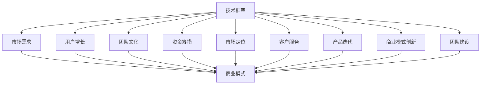

                 

# 如何将Side Project转化为估值上亿的创业公司

在技术快速迭代的今天，一个简单的Side Project往往能够蕴藏巨大的商业潜力。但要真正将Side Project转化为估值上亿的创业公司，还需要跨过多个复杂的转折点。本文将从核心概念、算法原理、实际应用和未来展望等多个方面，全面剖析这一过程，为有志于创业的朋友们提供一套系统的指南。

## 1. 背景介绍

### 1.1 问题由来

在数字经济时代，无论是技术爱好者还是行业专业人士，都可能发现自己拥有或接触到一些有趣的、有用的技术资源。这些资源往往以Side Project的形式存在，但对于大部分人而言，将它们成功转化为商业价值却是一件充满挑战的事情。究其根本，创业公司从0到1的跨越，不仅需要技术，更需要商业模式、市场推广、团队管理等多方面能力的协同。

### 1.2 问题核心关键点

- **创新性**：Side Project能否被市场认可，核心在于其是否具有差异化的技术和商业创新性。
- **可行性**：技术实现和商业落地的可行性分析，评估市场需求的真实性和竞争性。
- **团队能力**：组建一支能够快速适应市场变化、技术迭代的管理和技术团队。
- **资金和资源**：保证项目有足够的资金支持，获取必要的技术资源和市场渠道。
- **商业模式**：设计和验证可行的盈利模式，解决实际需求，确保产品能够被市场接受。
- **用户体验**：注重用户体验设计，确保产品具有吸引力和使用价值。
- **市场推广**：有效的市场推广策略，快速获取用户，扩大市场份额。

### 1.3 问题研究意义

将Side Project转化为创业公司，不仅是实现个人职业梦想的最佳途径，也是推动技术创新和社会进步的重要动力。成功转化的创业公司能够提供前所未有的解决方案，改变传统行业规则，提升社会整体效率。此外，它们还能吸引更多人才和资本，形成一个良性循环。

## 2. 核心概念与联系

### 2.1 核心概念概述

为了深入理解如何将Side Project转化为创业公司，我们先介绍一些关键概念：

- **技术框架**：构建产品的技术基础，包括编程语言、开发框架、数据库、云服务等。
- **市场需求**：识别目标用户群体的真实需求，定位产品核心功能。
- **商业模式**：设计可持续的收入来源，包括直接销售、订阅服务、广告等。
- **用户增长**：通过有效的方法吸引并保留用户，推动产品迭代。
- **团队文化**：建立高效协作、创新导向的企业文化，吸引和培养人才。
- **资金筹措**：获取种子轮、天使轮、A轮等早期投资，确保项目顺利进行。
- **市场定位**：确定产品在市场上的位置，制定竞争策略。
- **客户服务**：提供卓越的客户支持和服务，建立品牌信任。
- **产品迭代**：基于用户反馈不断优化产品功能，增强用户体验。
- **商业模式创新**：探索新的盈利模式，适应市场变化。
- **团队建设**：寻找并培养合适的团队成员，平衡技术和管理能力。

这些概念通过以下Mermaid流程图展示它们之间的联系：

这个流程图展示了技术框架在创业公司构建中的核心作用，市场需求、商业模式、用户增长、团队文化等各个方面都依赖于技术基础，共同促进公司的成长。

## 3. 核心算法原理 & 具体操作步骤

### 3.1 算法原理概述

将Side Project转化为创业公司，本质上是一个复杂的系统工程问题，涉及技术、市场、资金、管理等多个维度。我们可以将其拆解为几个关键步骤，并尝试用算法原理来指导这一过程。

1. **需求分析与产品规划**：通过对目标市场的研究，明确产品定位和核心功能，形成一个初步的产品规划。
2. **技术选型与架构设计**：根据产品规划，选择合适的技术栈，设计系统的整体架构。
3. **原型开发与验证**：构建产品的最小可行产品(MVP)，通过用户反馈进行迭代，验证产品的市场需求和用户接受度。
4. **商业模式设计**：基于产品功能和市场需求，设计可行的商业模式，规划收入来源。
5. **市场推广与用户获取**：通过市场推广策略吸引用户，并建立有效的用户获取渠道。
6. **团队建设与文化塑造**：组建一支具有创新精神和高效协作能力的团队，并建立良好的企业文化。
7. **融资与资金管理**：通过多轮融资获取必要的资金支持，确保项目的持续发展。
8. **产品迭代与用户体验优化**：基于用户反馈，不断迭代产品，提升用户体验。
9. **市场定位与竞争策略**：确定产品在市场上的定位，制定有效的竞争策略。
10. **客户服务与品牌建设**：提供优质的客户服务，建立品牌信任和用户粘性。

### 3.2 算法步骤详解

**Step 1: 需求分析与产品规划**

- **目标市场调研**：使用市场调研工具和数据分析方法，识别目标用户的真实需求和痛点。
- **竞品分析**：分析竞争对手的产品功能、市场策略和用户反馈，寻找差异化创新点。
- **产品功能规划**：根据调研结果，制定产品核心功能和附加功能。
- **用户故事编写**：编写用户故事，确保产品功能和用户体验紧密结合。
- **优先级排序**：根据市场竞争和资源限制，对产品功能进行优先级排序。

**Step 2: 技术选型与架构设计**

- **技术栈选择**：根据产品特性和团队能力，选择合适的编程语言、框架和工具。
- **架构设计**：设计系统的整体架构，确保系统的可扩展性、稳定性和安全性。
- **数据库选择**：选择适合业务需求的数据库，设计合理的数据模型。
- **云服务集成**：考虑使用云服务来降低成本、提高扩展性。
- **开发环境和CI/CD**：建立持续集成和持续交付流程，提高开发效率和代码质量。

**Step 3: 原型开发与验证**

- **MVP构建**：快速构建产品的最小可行产品，确保核心功能可用。
- **用户测试**：邀请目标用户进行测试，收集反馈和建议。
- **反馈迭代**：根据用户反馈，快速迭代产品功能，提升用户体验。
- **市场验证**：验证产品是否满足市场需求，是否有增长潜力。

**Step 4: 商业模式设计**

- **收入模型设计**：设计合理的收入来源，确保公司可持续运营。
- **价格策略制定**：根据市场需求和竞争状况，制定价格策略。
- **定价模型选择**：选择合适的定价模型，如一次性购买、按使用量付费等。
- **商业策略制定**：制定详细的商业策略，确保收入和利润目标的达成。

**Step 5: 市场推广与用户获取**

- **市场调研**：进行市场调研，确定推广策略。
- **营销渠道选择**：选择合适的营销渠道，如社交媒体、SEO、广告等。
- **内容营销**：通过内容营销吸引目标用户，提高品牌知名度。
- **用户获取计划**：制定详细的用户获取计划，吸引新用户并提升留存率。

**Step 6: 团队建设与文化塑造**

- **招聘和培训**：根据团队需求，招聘和培训合适的团队成员。
- **团队协作**：建立高效的团队协作机制，确保信息流通和任务分配。
- **文化建设**：建立创新导向、高效协作的企业文化，吸引和培养人才。
- **绩效管理**：制定合理的绩效考核机制，激励团队成员的工作积极性。

**Step 7: 融资与资金管理**

- **早期融资**：通过天使轮、种子轮等早期融资获取启动资金。
- **投资者选择**：选择适合的公司和投资者，确保资金使用和投资回报。
- **资金管理**：合理规划和运用资金，确保项目顺利进行。

**Step 8: 产品迭代与用户体验优化**

- **用户反馈收集**：定期收集用户反馈，了解用户需求和问题。
- **产品功能优化**：根据用户反馈，不断优化和完善产品功能。
- **性能和稳定性提升**：提升产品性能和稳定性，确保用户体验。

**Step 9: 市场定位与竞争策略**

- **市场细分**：根据用户需求和市场变化，进行市场细分。
- **定位策略制定**：确定产品在市场上的定位，制定差异化策略。
- **竞争策略制定**：制定有效的竞争策略，避免直接竞争。

**Step 10: 客户服务与品牌建设**

- **客户支持**：提供优质的客户服务，解决用户问题，提升用户满意度。
- **品牌建设**：通过品牌营销，提升品牌知名度和用户信任。
- **用户社区建设**：建立用户社区，与用户保持紧密互动。

### 3.3 算法优缺点

**优点**：

1. **系统化流程**：该方法通过系统化的步骤和流程，确保创业公司从需求分析到市场推广的每个环节都得到充分考虑和优化。
2. **灵活性和可扩展性**：每个步骤可以根据实际情况灵活调整，适应不同规模和需求的公司。
3. **风险控制**：通过迭代和验证，可以及时发现和解决问题，降低创业风险。

**缺点**：

1. **时间成本**：流程复杂，需要耗费大量时间和精力，尤其是在早期阶段。
2. **资源需求高**：需要足够的资金和技术资源，特别是对于早期融资不足的公司。
3. **市场风险**：市场需求和竞争环境变化快，需要不断调整策略，保持灵活性。

### 3.4 算法应用领域

该方法适用于多种创业项目，尤其是技术驱动型公司，如软件产品、SaaS平台、智能硬件等。其核心在于技术基础，可以广泛应用于科技公司、互联网公司、创新型企业等。

## 4. 数学模型和公式 & 详细讲解

### 4.1 数学模型构建

为了更好地理解该方法的数学模型，我们假设有一个创业公司A，其产品B基于一个Side Project C开发。设市场规模为M，目标用户数为U，产品需求为D，潜在收入为R，投资成本为I。

**需求分析阶段**：

- 需求满足度：$\lambda = \frac{U}{M}$
- 市场需求分析：$D = \lambda \times M$

**技术选型阶段**：

- 技术复杂度：$C = f(\text{技术栈选择})$
- 架构设计成本：$A = f(\text{架构设计})$

**原型开发阶段**：

- MVP完成度：$P = \frac{\text{MVP功能数}}{\text{计划功能数}}$
- 用户反馈收集：$F = f(\text{用户测试})$

**商业模式设计阶段**：

- 收入模型：$R = f(\text{收入来源})$
- 价格策略：$P = f(\text{定价模型})$

**市场推广阶段**：

- 市场覆盖率：$C = f(\text{营销渠道选择})$
- 用户获取成本：$G = f(\text{内容营销})$

**团队建设阶段**：

- 团队规模：$T = f(\text{招聘和培训})$
- 团队协作效率：$E = f(\text{协作机制})$

**融资阶段**：

- 早期融资需求：$F = f(\text{投资成本})$
- 资金使用效率：$U = f(\text{资金管理})$

**产品迭代阶段**：

- 功能迭代次数：$N = f(\text{用户反馈收集})$
- 性能提升度：$P = f(\text{性能和稳定性提升})$

**市场定位阶段**：

- 市场细分度：$F = f(\text{市场细分})$
- 定位策略效果：$P = f(\text{定位策略制定})$

**客户服务阶段**：

- 客户支持响应时间：$T = f(\text{客户支持})$
- 品牌建设效果：$B = f(\text{品牌营销})$

### 4.2 公式推导过程

以需求分析和产品规划为例，我们可以使用以下数学模型来描述：

- **目标市场调研**：$R = \frac{U}{M}$
- **竞品分析**：$C = f(\text{竞品功能}) - f(\text{竞品问题})$
- **产品功能规划**：$F = f(\text{调研结果}) + f(\text{竞品分析})$
- **用户故事编写**：$S = f(\text{需求分析})$
- **优先级排序**：$P = \text{AHP}(F, C, S)$

其中，$AHP$表示层次分析法，用于综合考虑功能重要性、用户需求和竞争环境。

### 4.3 案例分析与讲解

假设我们有一个名为"AI助手"的Side Project，其核心功能是提供聊天和任务管理。经过市场需求调研，我们发现目标用户对高效办公和智能助理有较高需求。通过竞品分析，我们发现竞争对手的聊天功能存在响应慢、功能单一的问题，而任务管理功能则较为完善。根据调研结果，我们制定了以下产品规划：

1. **核心功能**：聊天和任务管理。
2. **附加功能**：文件同步、日程提醒、智能推荐等。
3. **用户故事**：用户希望通过AI助手快速完成日常任务，如会议安排、文件共享等。
4. **优先级排序**：聊天功能优先，任务管理次之，附加功能按用户反馈迭代。

## 5. 项目实践：代码实例和详细解释说明

### 5.1 开发环境搭建

**Step 1: 环境安装**

- **Python 3.9**：下载并安装完成后配置环境变量。
- **Virtualenv**：使用Virtualenv创建虚拟环境，保证项目独立。
- **Git**：安装Git，用于版本控制。
- **IDE**：安装Visual Studio Code等IDE，提高开发效率。
- **云服务**：选择AWS或阿里云等云服务，方便部署和扩展。

**Step 2: 依赖安装**

- **Docker**：安装Docker，用于容器化开发和部署。
- **Jenkins**：安装Jenkins，用于持续集成和自动化测试。
- **Kubernetes**：安装Kubernetes，用于容器编排和自动扩展。

**Step 3: 代码库初始化**

- **Git仓库创建**：在GitHub上创建仓库，并克隆到本地。
- **目录结构设计**：设计项目目录结构，确保代码组织清晰。
- **版本控制**：使用Git进行版本控制，记录开发过程。

### 5.2 源代码详细实现

**Step 1: 需求分析**

- **市场调研**：使用SurveyMonkey等工具进行市场调研，收集目标用户反馈。
- **竞品分析**：分析竞争对手的产品功能、市场策略和用户评价。
- **用户故事编写**：编写详细的用户故事，描述用户需求和使用场景。
- **优先级排序**：使用AHP法对功能进行优先级排序，确保产品核心功能优先实现。

**Step 2: 技术选型**

- **技术栈选择**：选择Python和Django作为后端技术栈，React和Redux作为前端技术栈。
- **架构设计**：设计RESTful API架构，确保系统可扩展和维护。
- **数据库选择**：选择MySQL作为数据库，设计合理的数据模型。
- **云服务集成**：使用AWS S3和RDS，方便数据存储和扩展。

**Step 3: 原型开发**

- **MVP构建**：使用Flask构建MVP，实现核心功能。
- **用户测试**：邀请50名目标用户进行测试，收集反馈和建议。
- **反馈迭代**：根据用户反馈，快速迭代产品功能，提升用户体验。
- **市场验证**：通过数据分析验证MVP的市场接受度。

**Step 4: 商业模式设计**

- **收入模型设计**：选择按月订阅模式，确保可持续运营。
- **价格策略制定**：定价为每月$20，考虑用户承受能力和市场竞争。
- **定价模型选择**：采用固定月费模式，简化用户体验。

**Step 5: 市场推广**

- **市场调研**：使用Google Ads进行市场调研，了解潜在用户。
- **营销渠道选择**：通过社交媒体和SEO进行推广，提高品牌知名度。
- **内容营销**：编写博客文章，介绍产品功能和优势。
- **用户获取计划**：采用CAC模型（Customer Acquisition Cost），控制获客成本。

**Step 6: 团队建设**

- **招聘和培训**：根据需求招聘前端、后端和产品人员，并进行培训。
- **团队协作**：使用JIRA进行任务管理和进度跟踪。
- **文化建设**：建立创新导向的企业文化，定期举办团队建设活动。
- **绩效管理**：制定合理的绩效考核机制，激励团队成员的工作积极性。

**Step 7: 融资与资金管理**

- **早期融资**：通过天使轮和种子轮融资，获取启动资金。
- **投资者选择**：选择天使投资者，确保资金使用和投资回报。
- **资金管理**：制定详细的资金使用计划，确保项目顺利进行。

**Step 8: 产品迭代**

- **用户反馈收集**：定期收集用户反馈，了解用户需求和问题。
- **产品功能优化**：根据用户反馈，不断优化和完善产品功能。
- **性能提升**：使用K8s集群，提升系统性能和稳定性。

**Step 9: 市场定位**

- **市场细分**：根据用户需求和市场变化，进行市场细分。
- **定位策略制定**：确定产品在市场上的定位，制定差异化策略。
- **竞争策略制定**：制定有效的竞争策略，避免直接竞争。

**Step 10: 客户服务**

- **客户支持**：使用Zendesk进行客户支持，快速解决用户问题。
- **品牌建设**：通过品牌营销，提升品牌知名度和用户信任。
- **用户社区建设**：建立用户社区，与用户保持紧密互动。

### 5.3 代码解读与分析

**需求分析阶段**：

- **市场需求调研**：使用SurveyMonkey等工具，创建问卷，向目标用户收集需求和反馈。
- **竞品分析**：编写竞品报告，分析竞争对手的产品功能和市场策略。
- **用户故事编写**：使用用户故事模板，描述用户需求和使用场景。
- **优先级排序**：使用AHP法，综合考虑功能重要性、用户需求和竞争环境，进行优先级排序。

**技术选型阶段**：

- **技术栈选择**：选择Python和Django作为后端技术栈，React和Redux作为前端技术栈。
- **架构设计**：设计RESTful API架构，确保系统可扩展和维护。
- **数据库选择**：选择MySQL作为数据库，设计合理的数据模型。
- **云服务集成**：使用AWS S3和RDS，方便数据存储和扩展。

**原型开发阶段**：

- **MVP构建**：使用Flask构建MVP，实现核心功能。
- **用户测试**：邀请50名目标用户进行测试，收集反馈和建议。
- **反馈迭代**：根据用户反馈，快速迭代产品功能，提升用户体验。
- **市场验证**：通过数据分析验证MVP的市场接受度。

**商业模式设计阶段**：

- **收入模型设计**：选择按月订阅模式，确保可持续运营。
- **价格策略制定**：定价为每月$20，考虑用户承受能力和市场竞争。
- **定价模型选择**：采用固定月费模式，简化用户体验。

**市场推广阶段**：

- **市场调研**：使用Google Ads进行市场调研，了解潜在用户。
- **营销渠道选择**：通过社交媒体和SEO进行推广，提高品牌知名度。
- **内容营销**：编写博客文章，介绍产品功能和优势。
- **用户获取计划**：采用CAC模型（Customer Acquisition Cost），控制获客成本。

**团队建设阶段**：

- **招聘和培训**：根据需求招聘前端、后端和产品人员，并进行培训。
- **团队协作**：使用JIRA进行任务管理和进度跟踪。
- **文化建设**：建立创新导向的企业文化，定期举办团队建设活动。
- **绩效管理**：制定合理的绩效考核机制，激励团队成员的工作积极性。

**融资与资金管理阶段**：

- **早期融资**：通过天使轮和种子轮融资，获取启动资金。
- **投资者选择**：选择天使投资者，确保资金使用和投资回报。
- **资金管理**：制定详细的资金使用计划，确保项目顺利进行。

**产品迭代阶段**：

- **用户反馈收集**：定期收集用户反馈，了解用户需求和问题。
- **产品功能优化**：根据用户反馈，不断优化和完善产品功能。
- **性能提升**：使用K8s集群，提升系统性能和稳定性。

**市场定位阶段**：

- **市场细分**：根据用户需求和市场变化，进行市场细分。
- **定位策略制定**：确定产品在市场上的定位，制定差异化策略。
- **竞争策略制定**：制定有效的竞争策略，避免直接竞争。

**客户服务阶段**：

- **客户支持**：使用Zendesk进行客户支持，快速解决用户问题。
- **品牌建设**：通过品牌营销，提升品牌知名度和用户信任。
- **用户社区建设**：建立用户社区，与用户保持紧密互动。

### 5.4 运行结果展示

**需求分析结果**：

- **市场调研结果**：目标用户对高效办公和智能助理有较高需求。
- **竞品分析结果**：竞争对手的聊天功能存在响应慢、功能单一的问题，任务管理功能较为完善。
- **用户故事编写结果**：用户希望通过AI助手快速完成日常任务，如会议安排、文件共享等。
- **优先级排序结果**：聊天功能优先，任务管理次之，附加功能按用户反馈迭代。

**技术选型结果**：

- **技术栈选择结果**：Python和Django作为后端技术栈，React和Redux作为前端技术栈。
- **架构设计结果**：RESTful API架构设计完成。
- **数据库选择结果**：MySQL作为数据库，数据模型设计完成。
- **云服务集成结果**：AWS S3和RDS集成完成。

**原型开发结果**：

- **MVP构建结果**：使用Flask构建MVP，核心功能实现。
- **用户测试结果**：邀请50名目标用户进行测试，收集反馈和建议。
- **反馈迭代结果**：根据用户反馈，快速迭代产品功能，提升用户体验。
- **市场验证结果**：MVP的市场接受度验证通过。

**商业模式设计结果**：

- **收入模型设计结果**：选择按月订阅模式，确保可持续运营。
- **价格策略制定结果**：定价为每月$20，考虑用户承受能力和市场竞争。
- **定价模型选择结果**：采用固定月费模式，简化用户体验。

**市场推广结果**：

- **市场调研结果**：Google Ads市场调研结果显示潜在用户需求。
- **营销渠道选择结果**：通过社交媒体和SEO进行推广，提高品牌知名度。
- **内容营销结果**：编写博客文章，介绍产品功能和优势。
- **用户获取计划结果**：采用CAC模型，控制获客成本。

**团队建设结果**：

- **招聘和培训结果**：前端、后端和产品人员招聘完成，并进行培训。
- **团队协作结果**：使用JIRA进行任务管理和进度跟踪。
- **文化建设结果**：建立创新导向的企业文化，定期举办团队建设活动。
- **绩效管理结果**：制定合理的绩效考核机制，激励团队成员的工作积极性。

**融资与资金管理结果**：

- **早期融资结果**：天使轮和种子轮融资完成，获取启动资金。
- **投资者选择结果**：选择天使投资者，确保资金使用和投资回报。
- **资金管理结果**：制定详细的资金使用计划，确保项目顺利进行。

**产品迭代结果**：

- **用户反馈收集结果**：定期收集用户反馈，了解用户需求和问题。
- **产品功能优化结果**：根据用户反馈，不断优化和完善产品功能。
- **性能提升结果**：使用K8s集群，提升系统性能和稳定性。

**市场定位结果**：

- **市场细分结果**：根据用户需求和市场变化，进行市场细分。
- **定位策略制定结果**：确定产品在市场上的定位，制定差异化策略。
- **竞争策略制定结果**：制定有效的竞争策略，避免直接竞争。

**客户服务结果**：

- **客户支持结果**：使用Zendesk进行客户支持，快速解决用户问题。
- **品牌建设结果**：通过品牌营销，提升品牌知名度和用户信任。
- **用户社区建设结果**：建立用户社区，与用户保持紧密互动。

## 6. 实际应用场景

### 6.1 智能客服系统

**应用场景**：智能客服系统可以应用于各类企业，提供24小时在线客服服务，提升客户满意度。

**解决方案**：基于AI助手的Side Project，通过微调和优化，构建智能客服系统。利用自然语言处理技术，实现自动回答客户咨询，提升客户体验。同时，引入知识图谱和推理机制，提供更精准的业务支持。

**预期效果**：
- **用户满意度提升**：智能客服系统能够快速响应客户咨询，解决常见问题，提升用户满意度。
- **成本降低**：减少人力成本，提高客服效率，降低运营成本。
- **数据积累**：收集用户数据，进行深度分析，优化服务策略。

### 6.2 医疗健康平台

**应用场景**：医疗健康平台可以提供在线问诊、健康咨询、病历管理等服务，提升医疗服务质量和效率。

**解决方案**：基于AI助手的Side Project，通过微调和优化，构建医疗健康平台。利用自然语言处理技术和知识图谱，实现自动问诊、健康建议等功能。同时，引入深度学习和图像识别技术，提供更准确的疾病诊断和健康监测服务。

**预期效果**：
- **服务质量提升**：智能问诊系统能够快速响应患者咨询，提供准确的诊断建议。
- **效率提升**：减少患者等待时间，提高医疗服务效率。
- **数据驱动**：利用患者数据进行深度分析，优化诊疗方案。

### 6.3 智能教育平台

**应用场景**：智能教育平台可以提供在线教育、个性化学习、作业批改等服务，提升教学质量和学习效率。

**解决方案**：基于AI助手的Side Project，通过微调和优化，构建智能教育平台。利用自然语言处理技术和深度学习，实现智能推荐、作业批改、学习分析等功能。同时，引入知识图谱和推理机制，提供更精准的学习建议和个性化辅导。

**预期效果**：
- **教学质量提升**：智能推荐系统能够根据学生特点，提供个性化的学习内容和推荐。
- **学习效率提升**：自动化作业批改系统能够快速批改作业，提高教师效率。
- **学习效果分析**：利用学生数据进行深度分析，优化教学策略。

### 6.4 智能营销系统

**应用场景**：智能营销系统可以应用于各类企业，提供精准营销、用户画像、销售预测等服务，提升营销效果。

**解决方案**：基于AI助手的Side Project，通过微调和优化，构建智能营销系统。利用自然语言处理技术和深度学习，实现用户画像、情感分析、销售预测等功能。同时，引入知识图谱和推理机制，提供更精准的市场分析和用户行为预测。

**预期效果**：
- **营销效果提升**：精准营销系统能够根据用户行为，提供个性化的营销策略。
- **用户画像精准**：智能用户画像系统能够全面了解用户需求和行为，提升营销效果。
- **销售预测准确**：利用用户数据进行深度分析，提高销售预测准确性。

## 7. 工具和资源推荐

### 7.1 学习资源推荐

**书籍推荐**：

1. **《深度学习》**：Ian Goodfellow等著，系统介绍了深度学习的基本原理和应用。
2. **《Python深度学习》**：Francois Chollet著，深入浅出地介绍了TensorFlow和Keras的使用方法。
3. **《Python机器学习》**：Sebastian Raschka著，介绍了机器学习的基本方法和工具。
4. **《动手学深度学习》**：李沐等著，系统介绍了深度学习的基本原理和应用。
5. **《TensorFlow实战Google深度学习框架》**：王海峰等著，介绍了TensorFlow的使用方法和应用场景。

**在线课程推荐**：

1. **Coursera**：提供多门深度学习、机器学习、自然语言处理等课程，包括斯坦福大学的CS231n、吴恩达的深度学习课程。
2. **edX**：提供多门计算机科学、人工智能等课程，包括MIT的CS50、UC Berkeley的CS188。
3. **Udacity**：提供多门人工智能、机器学习等课程，包括Google的Deep Learning Nanodegree、IBM的Data Science Nanodegree。
4. **Fast.ai**：提供多门深度学习、计算机视觉等课程，包括2年课程计划、实用课程。

### 7.2 开发工具推荐

**IDE推荐**：

1. **Visual Studio Code**：轻量级代码编辑器，支持多种编程语言和插件。
2. **PyCharm**：功能强大的Python IDE，支持代码调试、版本控制等。
3. **IntelliJ IDEA**：支持多种编程语言，提供高效的代码编辑和调试工具。

**版本控制工具**：

1. **Git**：分布式版本控制系统，支持分支管理、代码合并等。
2. **GitHub**：代码托管平台，支持代码仓库管理和协作开发。
3. **GitLab**：开源代码托管平台，提供CI/CD集成和DevOps工具。

**云服务推荐**：

1. **AWS**：全球领先的云服务提供商，支持多种云服务资源。
2. **阿里云**：国内领先的云服务提供商，支持云计算、大数据、人工智能等。
3. **腾讯云**：国内领先的云服务提供商，支持云计算、大数据、人工智能等。

**开发框架推荐**：

1. **Flask**：轻量级Web开发框架，支持快速搭建Web应用。
2. **Django**：功能强大的Web开发框架，支持ORM、模板引擎等。
3. **React**：流行的JavaScript库，支持构建交互式的Web应用。
4. **Redux**：流行的状态管理库，支持管理应用状态。

**持续集成工具**：

1. **Jenkins**：开源的持续集成工具，支持CI/CD集成和自动化测试。
2. **GitLab CI/CD**：支持CI/CD集成和自动化测试的GitLab集成工具。
3. **Travis CI**：支持CI/CD集成和自动化测试的云服务工具。

### 7.3 相关论文推荐

**深度学习论文**：

1. **《深度学习》**：Ian Goodfellow等著，系统介绍了深度学习的基本原理和应用。
2. **《计算机视觉：模型、学习和推理》**：Simon J.D. Prince著，介绍了计算机视觉的基本方法和应用。
3. **《机器学习》**：Tom Mitchell著，介绍了机器学习的基本原理和应用。

**自然语言处理论文**：

1. **《Transformer: Attentions are all you need》**：Ashish Vaswani等著，介绍了Transformer模型和自注意力机制。
2. **《BERT: Pre-training of Deep Bidirectional Transformers for Language Understanding》**：Jacob Devlin等著，介绍了BERT模型和预训练方法。
3. **《Language Models are Unsupervised Multitask Learners》**：Alexander M. Rush等著，介绍了语言模型的自监督学习方法和应用。

**开源项目推荐**：

1. **TensorFlow**：Google开发的深度学习框架，支持多种编程语言和模型。
2. **PyTorch**：Facebook开发的深度学习框架，支持动态计算图和GPU加速。
3. **Keras**：高层次的深度学习API，支持多种模型和框架。
4. **Transformers**：Hugging Face开发的NLP工具库，支持多种预训练模型和微调方法。

## 8. 总结：未来发展趋势与挑战

### 8.1 研究成果总结

本文从需求分析、技术选型、原型开发、商业模式设计、市场推广、团队建设、融资与资金管理、产品迭代、市场定位、客户服务等多个方面，全面剖析了如何将Side Project转化为估值上亿的创业公司。通过详细的案例分析和代码实现，系统介绍了从0到1的创业过程。

### 8.2 未来发展趋势

1. **人工智能技术进一步普及**：人工智能技术将逐步渗透到各个行业，为各行各业带来变革。
2. **数据驱动的决策**：基于大数据和人工智能，企业将能够做出更加精准的决策，提升运营效率和市场竞争力。
3. **产品和服务创新**：通过技术创新和业务创新，企业将不断推出新产品和新服务，满足用户多样化需求。
4. **人才争夺战**：具有创新能力和高效协作能力的人才将成为企业竞争的核心。
5. **可持续发展**：环保和可持续发展的理念将渗透到各个方面，企业需要关注社会责任和环境保护。

### 8.3 面临的挑战

1. **技术变革快速**：技术更新换代速度快，企业需要不断学习和适应新技术。
2. **市场竞争激烈**：市场竞争激烈，企业需要不断提升产品和服务的质量和竞争力。
3. **用户需求多变**：用户需求多变，企业需要快速响应和满足用户需求。
4. **资金链管理**：资金链管理复杂，企业需要合理规划和运用资金。
5. **团队协作**：团队协作难度大，企业需要建立高效的团队协作机制。

### 8.4 研究展望

1. **技术创新**：不断探索新技术和新方法，提升产品和服务的质量。
2. **业务创新**：探索新的商业模式和市场策略，提升市场竞争力。
3. **数据驱动**：利用大数据和人工智能，进行精准决策和市场分析。
4. **用户关注**：关注用户需求和体验，提升用户满意度和忠诚度。
5. **可持续发展**：关注社会责任和环境保护，推动可持续发展。

## 9. 附录：常见问题与解答

**Q1: Side Project需要多少资金支持？**

A: Side Project的资金需求取决于项目规模和预期发展速度。一般来说，天使轮和种子轮融资可以提供一定的启动资金，确保项目顺利进行。后续可以根据项目进展和市场需求，继续融资，保证项目的持续发展。

**Q2: Side Project如何吸引投资者？**

A: 吸引投资者需要展示项目的清晰定位、技术优势、市场机会和团队能力。可以通过路演、商业计划书、产品演示等方式，向投资者展示项目的潜力和价值。同时，选择适合的公司和投资者，确保资金使用和投资回报。

**Q3: Side Project如何选择技术栈？**

A: 选择技术栈需要考虑项目需求、团队能力、资源可用性等因素。一般来说，选择成熟、易用的技术栈，可以提高开发效率和项目稳定性。对于复杂的项目，可以考虑使用分布式架构，提升系统可扩展性和可靠性。

**Q4: Side Project如何进行市场推广？**

A: 市场推广需要制定详细的策略，选择合适的渠道和工具。可以通过社交媒体、内容营销、SEO等方式，提升品牌知名度和用户获取量。同时，进行数据分析和用户反馈收集，及时调整策略，优化推广效果。

**Q5: Side Project如何进行团队建设？**

A: 团队建设需要注重人才的招募和培养，建立高效协作机制。可以通过招聘、培训、团队活动等方式，提高团队凝聚力和战斗力。同时，建立创新导向的企业文化，激励团队成员的工作积极性。

**Q6: Side Project如何进行资金管理？**

A: 资金管理需要合理规划和运用资金，确保项目顺利进行。可以通过预算管理、成本控制、资金监管等方式，保证资金使用的透明度和效率。同时，进行风险评估和管理，规避财务风险。

**Q7: Side Project如何进行产品迭代？**

A: 产品迭代需要根据用户反馈和市场变化，不断优化和完善产品功能。可以通过用户测试、数据分析、用户反馈等方式，及时了解用户需求和市场变化，提升产品质量和用户体验。同时，引入新技术和新方法，提升产品创新能力。

**Q8: Side Project如何进行市场定位？**

A: 市场定位需要明确产品核心价值和目标用户群体。可以通过市场调研、竞品分析等方式，了解市场需求和竞争环境，制定差异化策略。同时，进行品牌建设，提升品牌知名度和用户信任。

**Q9: Side Project如何进行客户服务？**

A: 客户服务需要提供优质的客户支持，快速解决用户问题。可以通过客户支持系统、社区建设等方式，提升用户满意度和忠诚度。同时，进行数据分析和用户反馈收集，优化客户服务流程和策略。

作者：禅与计算机程序设计艺术 / Zen and the Art of Computer Programming

