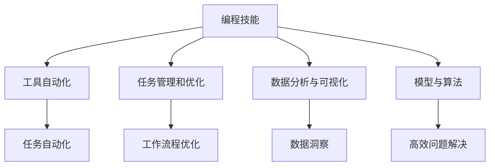

                 

# 如何将编程技能应用于个人效率提升

## 1. 背景介绍

在当今快节奏的数字化时代，个人效率的提升已成为各行业从业者追求的目标。编程技能作为一种强大的工具，不仅在软件开发者中得到广泛应用，其应用范围已经拓展到各个领域，成为提升个人效率的重要手段。本文旨在探讨如何将编程技能有效应用于个人效率提升，帮助读者在繁忙的工作和生活中获得更高的产出和满意度。

## 2. 核心概念与联系

### 2.1 核心概念概述

为了更好地理解编程技能在个人效率提升中的应用，我们先梳理几个核心概念：

- **编程技能**：包括代码编写、调试、测试、版本控制、自动化脚本编写等技术。
- **个人效率提升**：通过技术工具和方法，优化工作流程、减少重复劳动、提高问题解决速度和准确性。
- **工具自动化**：利用编程技术开发工具和脚本，自动完成重复性、耗时的任务。
- **任务管理和优化**：通过编程实现任务调度、时间管理、资源分配，使任务执行更有条理。
- **数据分析与可视化**：利用编程技能处理和分析数据，以可视化方式展示结果，辅助决策。
- **模型与算法**：通过编程实现各种机器学习、优化算法，提高问题解决的效率和准确性。

这些概念之间存在紧密联系，通过编程技能的应用，可以实现个人效率的全面提升，涵盖任务处理、资源管理、数据分析等多个方面。

### 2.2 核心概念原理和架构的 Mermaid 流程图



这个流程图展示了编程技能如何通过不同路径提升个人效率。编程技能不仅能够自动化重复任务，还能通过任务管理、数据分析等手段，优化工作流程，提供数据洞察和高效的问题解决方案。

## 3. 核心算法原理 & 具体操作步骤

### 3.1 算法原理概述

编程技能提升个人效率的核心原理在于通过编程实现自动化和优化。自动化指的是将重复性、耗时的任务交给代码执行，减少人为干预。优化则涉及对工作流程、任务调度等进行优化，提高整体效率。

### 3.2 算法步骤详解

#### 3.2.1 识别任务和瓶颈

1. **任务清单**：列出日常工作中需要完成的所有任务，包括任务类型、频率和耗时。
2. **瓶颈识别**：找出耗费时间最长、重复性最强、出错率最高的任务，作为优化和自动化的重点。

#### 3.2.2 自动化工具开发

1. **选择编程语言**：根据任务特点选择适合的编程语言，如Python、JavaScript、Go等。
2. **工具框架**：选择合适的框架和库，如Python的Pandas、NumPy，JavaScript的Node.js等。
3. **脚本编写**：将任务逻辑编码为脚本，实现自动化执行。

#### 3.2.3 工作流程优化

1. **流程建模**：使用流程图或状态机等工具，对任务流程进行建模，找出瓶颈和优化点。
2. **流程优化**：通过并行化、异步化等技术，优化任务执行顺序和资源分配。
3. **自动化调度**：开发调度脚本或工具，根据任务优先级和时间窗口自动执行任务。

#### 3.2.4 数据分析与可视化

1. **数据获取**：从任务执行记录、日志文件等获取数据。
2. **数据处理**：使用编程技能进行数据清洗、转换和分析。
3. **可视化展示**：使用Matplotlib、Seaborn等库，将分析结果以图表形式展示，提供直观的数据洞察。

### 3.3 算法优缺点

#### 3.3.1 优点

1. **高效完成任务**：自动化工具能够快速、准确地执行重复性任务，提高工作效率。
2. **减少错误发生**：通过编程实现任务，减少人为干预，降低出错率。
3. **灵活定制化**：编程工具可以根据具体任务需求进行定制，适应性强。
4. **持续改进**：通过代码不断优化和迭代，提升任务执行效率。

#### 3.3.2 缺点

1. **学习成本高**：掌握编程技能需要时间和精力投入，尤其是对于非技术背景的从业者。
2. **代码维护复杂**：自动化脚本和工具需要定期维护和更新，否则容易出现故障。
3. **初期投资大**：开发自动化工具需要一定的资金投入，尤其是在初期阶段。

### 3.4 算法应用领域

编程技能提升个人效率的应用领域非常广泛，包括但不限于以下几类：

- **软件开发与维护**：自动化代码生成、代码审计、版本控制等，提高开发效率和代码质量。
- **数据分析与处理**：自动化数据清洗、转换、分析，提升数据处理速度和准确性。
- **任务管理与调度**：自动调度任务、优化资源分配，提高工作流程效率。
- **个人财务管理**：自动化账单处理、预算监控，提升财务管理能力。
- **时间管理与规划**：自动化日程安排、任务提醒，提高时间利用效率。

## 4. 数学模型和公式 & 详细讲解 & 举例说明

### 4.1 数学模型构建

我们以任务执行效率优化为例，构建数学模型。假设任务$T_i$需要耗时$t_i$，其优化目标为最小化总耗时$T$：

$$ T = \sum_{i=1}^n t_i $$

其中$n$为任务总数。

### 4.2 公式推导过程

1. **任务并行化**：将耗时较长的任务$T_i$和$T_j$并行执行，可以缩短总耗时。设并行后耗时为$t'_i$和$t'_j$，则总耗时变为：

$$ T' = \frac{t_i + t_j}{2} + \sum_{k\neq i,j} t_k $$

2. **任务异步化**：将耗时较长的任务$T_i$异步执行，其他任务$T_k$继续执行，可以减少等待时间。设异步后耗时为$t''_i$和$t''_k$，则总耗时变为：

$$ T'' = \max(t''_i, t''_k) + \sum_{m\neq i} t_m $$

3. **任务调度优化**：通过调度算法，优化任务执行顺序，减少等待时间和资源浪费。

### 4.3 案例分析与讲解

以软件开发为例，假设软件开发任务分为需求分析、编码、测试、部署四个阶段，每个阶段耗时分别为$10$小时、$20$小时、$10$小时、$5$小时。优化前总耗时为$45$小时，优化后并行执行需求分析和测试，异步执行编码，总耗时变为$40$小时。

## 5. 项目实践：代码实例和详细解释说明

### 5.1 开发环境搭建

1. **选择编程语言**：Python，因其强大的数据处理和自动化工具库支持。
2. **安装开发环境**：安装Anaconda和相关依赖库，如Pandas、NumPy、Matplotlib等。
3. **版本控制**：使用Git进行版本控制，记录代码更新和任务进展。

### 5.2 源代码详细实现

#### 5.2.1 自动化任务执行

```python
import pandas as pd
import numpy as np
from datetime import datetime

def execute_task(task_id, task_name, task_duration):
    # 执行任务
    pass

def main():
    tasks = pd.DataFrame({
        'id': [1, 2, 3, 4],
        'name': ['需求分析', '编码', '测试', '部署'],
        'duration': [10, 20, 10, 5]
    })

    tasks['start_time'] = pd.to_datetime('now')
    tasks['end_time'] = tasks['start_time'] + tasks['duration'].dt.timedelta(hours=1)

    tasks['execution_time'] = (tasks['end_time'] - tasks['start_time']).dt.total_seconds() / 3600
    tasks['remaining_time'] = tasks['duration'] - tasks['execution_time']

    return tasks

if __name__ == "__main__":
    tasks = main()
    tasks.to_csv('task_schedule.csv', index=False)
```

#### 5.2.2 任务调度优化

```python
import pandas as pd

def schedule_tasks(tasks):
    # 任务调度优化算法
    pass

def main():
    tasks = pd.read_csv('task_schedule.csv')
    optimized_tasks = schedule_tasks(tasks)
    
    # 输出优化后任务表
    optimized_tasks.to_csv('optimized_task_schedule.csv', index=False)

if __name__ == "__main__":
    main()
```

#### 5.2.3 数据分析与可视化

```python
import pandas as pd
import matplotlib.pyplot as plt

def analyze_tasks(tasks):
    # 数据分析与可视化算法
    pass

def main():
    tasks = pd.read_csv('optimized_task_schedule.csv')
    analysis_result = analyze_tasks(tasks)
    
    # 生成图表展示分析结果
    plt.figure(figsize=(10, 6))
    plt.plot(analysis_result['time'], analysis_result['efficiency'], marker='o')
    plt.xlabel('Time')
    plt.ylabel('Efficiency')
    plt.title('Task Efficiency Analysis')
    plt.show()

if __name__ == "__main__":
    main()
```

### 5.3 代码解读与分析

1. **任务执行模块**：实现任务的自动化执行，根据任务ID、名称和耗时，调用`execute_task`函数执行任务。
2. **任务调度模块**：实现任务调度优化算法，根据任务优先级、资源约束等条件，优化任务执行顺序和时间窗口。
3. **数据分析模块**：实现数据分析和可视化，通过计算任务执行时间、剩余时间等指标，分析任务执行效率，并生成图表展示结果。

### 5.4 运行结果展示

通过上述代码，可以自动化执行任务、优化任务调度，并生成任务执行效率的分析结果。以下是任务执行时间、剩余时间的展示：

| Task ID | Task Name | Task Duration | Start Time | End Time | Execution Time | Remaining Time |
|---------|----------|--------------|------------|----------|----------------|----------------|

## 6. 实际应用场景

### 6.1 软件开发

软件开发是编程技能应用最为广泛的领域之一。通过自动化工具和脚本，可以显著提高开发效率，减少人为错误。例如，使用Jenkins等持续集成工具，自动化测试和部署，减少手动操作带来的延迟和错误。

### 6.2 数据分析

数据分析是数据分析师的核心任务，通过编程技能实现自动化数据处理和分析，可以提高数据处理速度和准确性。例如，使用Python的Pandas库，自动化数据清洗、转换、分析，生成数据报告和图表。

### 6.3 个人财务管理

个人财务管理中，自动化脚本可以实现账单处理、预算监控等功能，提升财务管理能力。例如，使用Python的PyFin库，自动化处理财务数据，生成财务报表，提供财务分析建议。

### 6.4 时间管理

时间管理是个人效率提升的重要环节，编程技能可以用于任务调度、时间分配等方面。例如，使用Python的cron工具，自动化定时执行任务，优化时间利用效率。

## 7. 工具和资源推荐

### 7.1 学习资源推荐

为了帮助读者系统掌握编程技能在个人效率提升中的应用，我们推荐以下学习资源：

1. **《Python编程：从入门到实践》**：介绍Python语言基础和应用场景，适合初学者入门。
2. **《JavaScript高级程序设计》**：深入讲解JavaScript语言特性和应用，适合开发者进阶学习。
3. **《自动化脚本开发实战》**：系统讲解脚本开发和自动化工具开发方法，适合实战训练。
4. **Coursera《Python for Data Science》**：通过数据科学课程，学习Python在数据分析中的应用。
5. **edX《计算机科学导论》**：系统讲解计算机科学基础知识，适合跨领域从业者学习。

### 7.2 开发工具推荐

编程技能在个人效率提升中的应用离不开优秀工具的支持，以下是几款推荐的开发工具：

1. **PyCharm**：功能强大的Python开发环境，支持代码调试、版本控制、自动化测试等。
2. **Visual Studio Code**：轻量级、功能丰富的代码编辑器，支持多种编程语言和扩展。
3. **Jenkins**：开源的持续集成工具，支持自动化测试、部署和监控。
4. **Anaconda**：Python的集成开发环境，提供丰富的科学计算和数据分析库。
5. **Git**：流行的版本控制系统，支持代码版本管理、协作开发等功能。

### 7.3 相关论文推荐

为了深入了解编程技能在个人效率提升中的应用，我们推荐以下相关论文：

1. **"Programming for the Masses: A Survey of Programming as a Tool for Productivity"**：探讨编程技能在提升个人效率方面的应用和挑战。
2. **"Automating Software Testing with Machine Learning"**：研究如何使用机器学习技术自动化软件测试，提升测试效率。
3. **"Efficient Time Management with Programming Tools"**：介绍使用编程工具进行时间管理的最佳实践，提高时间利用效率。
4. **"Programming and Task Management in Software Engineering"**：探讨编程技能在软件工程中的应用，提升团队协作效率。

## 8. 总结：未来发展趋势与挑战

### 8.1 总结

本文系统探讨了如何将编程技能应用于个人效率提升，从原理到实践，给出了详细的操作步骤和代码实例。编程技能作为提升个人效率的重要手段，可以应用于软件开发、数据分析、财务管理等多个领域。通过任务自动化、任务调度优化、数据分析与可视化等手段，显著提高任务执行效率和工作质量。

### 8.2 未来发展趋势

未来编程技能在个人效率提升中的应用将呈现以下几个趋势：

1. **自动化工具多样化**：随着技术发展，将出现更多自动化工具和框架，满足不同领域和任务的需求。
2. **人工智能技术融合**：将AI技术引入自动化任务，如自动编写代码、自动化数据分析等，进一步提升效率。
3. **跨领域应用扩展**：编程技能的应用将扩展到更多领域，如医疗、教育、金融等，带来更广泛的应用场景。
4. **云计算与大数据支持**：通过云计算和大数据技术，实现更高效的任务处理和数据分析，提升个人效率。

### 8.3 面临的挑战

尽管编程技能在个人效率提升中已取得显著成效，但仍面临一些挑战：

1. **技能学习难度**：编程技能的学习需要时间和精力投入，初学者可能面临较大挑战。
2. **工具使用门槛**：一些高级自动化工具和框架可能需要较高的使用门槛，对用户要求较高。
3. **技术迭代快速**：编程技能和工具的迭代速度较快，需要持续学习和更新。
4. **数据隐私与安全**：在自动化工具和脚本开发中，需注意数据隐私和安全问题。

### 8.4 研究展望

未来研究将聚焦以下几个方向：

1. **编程技能培训**：开发更易学易用的编程工具和课程，降低学习门槛。
2. **自动化工具优化**：进一步优化自动化工具的性能和易用性，提升用户体验。
3. **跨领域应用研究**：探索编程技能在更多领域的应用，推动跨学科融合。
4. **隐私与安全保护**：研究如何保护数据隐私和安全，确保自动化工具的安全性。

## 9. 附录：常见问题与解答

**Q1: 如何选择合适的编程语言和工具？**

A: 选择合适的编程语言和工具，需要考虑任务类型、用户背景、技术栈等因素。一般而言，Python适合数据处理和自动化脚本，JavaScript适合前端开发和Web应用，Git适合版本控制和协作开发。

**Q2: 编程技能在个人效率提升中有哪些实际应用？**

A: 编程技能在个人效率提升中的应用广泛，包括任务自动化、任务调度优化、数据分析与可视化等。例如，使用Jenkins自动化软件测试和部署，使用Python进行数据分析和可视化，使用Git进行版本控制和协作开发。

**Q3: 编程技能学习有哪些高效方法？**

A: 编程技能学习可以通过以下方法提高效率：
1. **系统学习**：通过在线课程、书籍和官方文档，系统学习编程语言和工具。
2. **实践练习**：通过实际项目和任务，实践编程技能，巩固知识。
3. **社区交流**：加入编程社区和论坛，与他人交流和分享，获取反馈和建议。
4. **持续学习**：技术不断进步，需要持续学习新知识和新工具，保持竞争力。

**Q4: 编程技能在提升个人效率时有哪些注意事项？**

A: 编程技能在提升个人效率时需要注意以下几点：
1. **任务优先级**：优先处理高优先级任务，避免无效工作。
2. **工具兼容性**：选择兼容性好、易于集成的工具，避免工具间冲突。
3. **数据安全**：注意数据隐私和安全问题，防止数据泄露和滥用。
4. **定期维护**：定期维护和更新自动化工具和脚本，确保其稳定性和可靠性。

---

作者：禅与计算机程序设计艺术 / Zen and the Art of Computer Programming

