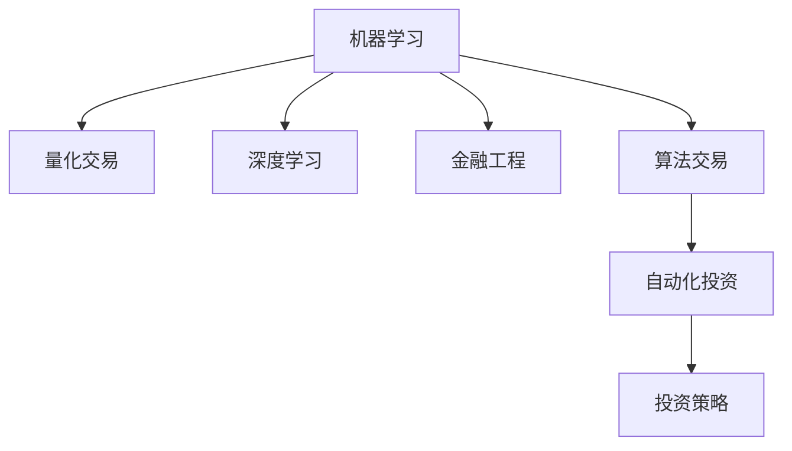

                 

## 1. 背景介绍

### 1.1 问题由来
随着金融科技的兴起，自动化投资策略正在成为越来越多的投资者和金融机构关注和探索的新方向。自动化投资通过机器学习算法自动化地执行买卖决策，能够显著提升投资收益、降低风险，成为应对复杂多变市场环境的有效工具。然而，构建高效、稳定的自动化投资系统，需要涉及深度学习、量化交易、金融工程等多个领域，对技术能力有较高的要求。如何将编程技能应用于自动化投资，成为了广大技术人员和投资者的关注热点。

### 1.2 问题核心关键点
自动化投资的核心在于使用编程技能构建、训练和部署机器学习模型，实现对市场的精准预测和风险控制。具体来说，包括以下几个方面：

- **算法设计**：选择合适的机器学习算法，如决策树、随机森林、支持向量机、深度神经网络等。
- **数据处理**：对历史市场数据进行清洗、预处理和特征工程，提取有意义的特征。
- **模型训练**：使用历史数据对模型进行训练，调整超参数，提高模型泛化能力。
- **策略优化**：设计投资策略，实现自动化的买入、卖出操作，同时进行风险控制。
- **系统部署**：将训练好的模型部署到生产环境，实时处理交易数据，实现自动化交易。
- **性能评估**：对模型在历史和实时数据上的表现进行评估，持续优化策略。

本文将系统地介绍如何将编程技能应用于自动化投资，并详细介绍各个关键环节的技术细节和实践经验。

## 2. 核心概念与联系

### 2.1 核心概念概述

为更好地理解如何应用编程技能于自动化投资，本节将介绍几个关键概念：

- **机器学习(ML)**：通过数据驱动的算法，让计算机自动学习和改进决策过程的科学。
- **量化交易(Quantitative Trading)**：利用数学和统计方法构建投资策略，并通过编程实现自动交易。
- **深度学习(DL)**：一种特殊的机器学习方法，通过多层神经网络结构学习特征，实现对复杂问题的建模和预测。
- **金融工程(Financial Engineering)**：结合数学、计算机科学、统计学和金融学，设计金融衍生品、算法交易等应用。
- **算法交易(Algorithmic Trading)**：使用计算机程序自动执行交易指令，降低交易成本，提高交易效率。
- **自动化投资(Automated Investment)**：使用编程实现投资策略，使投资决策完全自动化，提升收益和风险控制。

这些概念之间的关系可以通过以下Mermaid流程图来展示：



该图展示了机器学习、深度学习、量化交易、金融工程和算法交易与自动化投资之间的联系和互动，形成了一个完整的自动化投资技术体系。

## 3. 核心算法原理 & 具体操作步骤

### 3.1 算法原理概述

自动化投资的实现主要基于以下几个关键步骤：

1. **数据收集与预处理**：收集市场历史数据，进行数据清洗和预处理，提取有意义的特征。
2. **模型训练与优化**：使用历史数据训练机器学习模型，调整超参数，优化模型性能。
3. **策略设计**：根据市场特征设计投资策略，实现买入、卖出等交易操作。
4. **系统部署与运行**：将训练好的模型部署到生产环境，实时处理市场数据，进行自动化交易。
5. **性能评估与优化**：对模型性能进行评估，持续优化投资策略。

这些步骤中，编程技能的应用贯穿始终。

### 3.2 算法步骤详解

#### 3.2.1 数据收集与预处理

**步骤1：数据收集**
- 使用API接口获取历史市场数据，如股票价格、交易量、新闻、公司财报等。
- 选择合适的数据源，如Yahoo Finance、Alpha Vantage等。
- 设计数据采集程序，定期自动更新数据。

**步骤2：数据清洗与预处理**
- 处理缺失数据和异常值，确保数据完整性和可靠性。
- 进行数据归一化和标准化，提高模型的训练效率。
- 提取特征，如技术指标、基本面数据、市场情绪等。
- 设计特征工程方法，将原始数据转化为更有意义的特征。

**步骤3：数据划分**
- 将数据集划分为训练集、验证集和测试集，用于模型训练、调参和性能评估。

#### 3.2.2 模型训练与优化

**步骤1：选择合适的算法**
- 根据市场特征和投资目标，选择合适的机器学习算法。
- 考虑模型的计算复杂度和泛化能力。

**步骤2：特征选择与提取**
- 使用特征选择方法，如互信息、L1正则化等，选择对预测有用的特征。
- 提取时间序列特征，如均值、方差、移动平均线等。
- 构建新的特征组合，如技术指标、基本面数据、市场情绪等。

**步骤3：模型训练与调参**
- 使用历史数据对模型进行训练。
- 使用交叉验证和网格搜索方法，调整超参数。
- 使用正则化方法，如L1、L2正则化，防止过拟合。

**步骤4：模型评估与优化**
- 使用验证集评估模型性能，如准确率、召回率、F1分数等。
- 使用网格搜索和随机搜索方法，优化模型超参数。
- 使用集成学习方法，如Bagging、Boosting等，提高模型鲁棒性。

#### 3.2.3 策略设计

**步骤1：策略设计**
- 设计投资策略，如趋势跟踪、均值回归、套利等。
- 使用量化交易理论，如风险管理、资产配置等。
- 根据市场环境设计多种策略，进行策略回测。

**步骤2：策略实现**
- 使用编程语言实现投资策略，如Python、R等。
- 设计自动交易系统，实现买入、卖出等操作。
- 实现风险控制策略，如止损、仓位管理等。

#### 3.2.4 系统部署与运行

**步骤1：系统架构设计**
- 设计系统的整体架构，包括数据采集、存储、计算、展示等模块。
- 设计数据流动和处理流程，确保系统高效稳定。
- 选择合适的硬件和软件，如高性能计算集群、云服务、数据库等。

**步骤2：系统开发**
- 使用编程语言开发系统，如Python、Java等。
- 实现数据处理、模型训练、交易执行等模块。
- 设计数据接口和API，实现系统模块之间的通信。

**步骤3：系统测试与调试**
- 进行系统测试，确保系统各模块能够正常工作。
- 进行单元测试、集成测试和压力测试，保证系统的稳定性和可靠性。
- 修复系统中的bug，优化系统性能。

#### 3.2.5 性能评估与优化

**步骤1：策略评估**
- 使用历史数据评估投资策略的性能，如夏普比率、信息比率等。
- 使用回测工具，如Backtrader、QuantConnect等，评估策略的表现。
- 分析策略的优缺点，设计改进方案。

**步骤2：持续优化**
- 根据市场变化和策略表现，持续优化策略。
- 实时监控市场数据，调整策略参数。
- 定期进行策略评估和优化，确保策略的长期有效性。

## 4. 数学模型和公式 & 详细讲解

### 4.1 数学模型构建

自动化投资中常用的数学模型包括：

- **线性回归模型**：用于预测未来股票价格。
- **支持向量机(SVM)**：用于分类和回归问题，识别市场趋势和异常情况。
- **随机森林(Ensemble)**：用于多变量特征的决策树组合，提高模型的泛化能力。
- **深度神经网络(DNN)**：用于复杂的多变量特征学习和非线性建模。
- **时间序列模型**：如ARIMA、LSTM等，用于预测市场趋势和价格波动。

### 4.2 公式推导过程

**线性回归模型**
- 模型形式：$\hat{y} = \beta_0 + \beta_1x_1 + \ldots + \beta_nx_n$
- 最小二乘法：$\beta = (\sum x_ix_j^T)^{-1}\sum y_ix_i$

**支持向量机**
- 模型形式：$\min_{\alpha} \frac{1}{2}\alpha^TQ\alpha - \sum \alpha_iy_i$
- 核函数：$\phi(x)$
- 超平面：$w^Tx + b = 0$

**随机森林**
- 决策树：$g(x) = \sum_{j=1}^m w_j g_j(x)$
- 随机特征和随机样本：$\{s_j\}, \{\xi_j\}$
- 随机森林：$G(x) = \frac{1}{M}\sum_{j=1}^M g_j(x)$

**深度神经网络**
- 前向传播：$\hat{y} = h(W_1h_0 + b_1) = h(W_2h_1 + b_2) = \ldots = h(W_Lh_{L-1} + b_L)$
- 反向传播：$\frac{\partial L}{\partial W_i} = \frac{\partial L}{\partial \hat{y}}\frac{\partial \hat{y}}{\partial h_i}\frac{\partial h_i}{\partial W_i}$
- 梯度下降：$W_{i+1} \leftarrow W_{i+1} - \eta \frac{\partial L}{\partial W_i}$

**时间序列模型**
- ARIMA：$X_t = c + \sum_{i=1}^p\phi_iX_{t-i} + \sum_{j=1}^q\theta_j\epsilon_{t-j} + \epsilon_t$
- LSTM：$h_t = f(W_{h,t-1} + X_t)$

### 4.3 案例分析与讲解

**案例1：股票价格预测**
- 使用线性回归模型预测未来股票价格。
- 数据来源：Yahoo Finance。
- 特征提取：股票历史价格、交易量、技术指标等。
- 模型训练：最小二乘法优化，使用交叉验证调整参数。
- 模型评估：均方误差(MSE)、均方根误差(RMSE)、R^2等。

**案例2：套利策略设计**
- 设计基于统计套利的投资策略。
- 数据来源：Alpha Vantage。
- 特征提取：股票价格、市场情绪、技术指标等。
- 模型训练：随机森林回归，调整超参数。
- 策略实现：自动交易系统，实现买入、卖出操作。
- 风险控制：仓位管理、止损等。

## 5. 项目实践：代码实例和详细解释说明

### 5.1 开发环境搭建

为了进行自动化投资的开发和测试，我们需要搭建一个集成的开发环境。以下是一些常用的工具和环境配置：

1. **编程语言**：Python、R等。
2. **数据管理**：Pandas、SQL等。
3. **计算库**：NumPy、SciPy、Scikit-Learn等。
4. **绘图工具**：Matplotlib、Seaborn等。
5. **数据采集**：Alpha Vantage、Yahoo Finance API等。
6. **部署平台**：AWS、Azure、Google Cloud等。
7. **监控工具**：Grafana、Prometheus等。

### 5.2 源代码详细实现

**股票价格预测**
```python
import pandas as pd
from sklearn.linear_model import LinearRegression

# 加载数据
df = pd.read_csv('stock_prices.csv')

# 数据预处理
X = df.drop(['Date', 'Close'], axis=1)
y = df['Close']

# 模型训练
model = LinearRegression()
model.fit(X, y)

# 模型评估
mse = mean_squared_error(y, model.predict(X))
rmse = sqrt(mse)
r2 = r2_score(y, model.predict(X))

print('MSE:', mse)
print('RMSE:', rmse)
print('R^2:', r2)
```

**套利策略设计**
```python
import pandas as pd
from sklearn.ensemble import RandomForestRegressor
import backtrader as bt

# 加载数据
df = pd.read_csv('stock_prices.csv')

# 数据预处理
X = df.drop(['Date', 'Close'], axis=1)
y = df['Close']

# 模型训练
model = RandomForestRegressor(n_estimators=100)
model.fit(X, y)

# 策略设计
class MyStrategy(bt.Strategy):
    def __init__(self):
        self.order = None
        self.ma1 = bt.indicators.MA(close, period=20)
        self.ma2 = bt.indicators.MA(close, period=50)

    def next(self):
        if self.ma1[0] > self.ma2[0] and self.order is None:
            self.order = self.buy()

# 策略回测
cerebro = bt.Cerebro()
cerebro.addstrategy(MyStrategy)
cerebro.run()
```

### 5.3 代码解读与分析

**股票价格预测代码**
- 使用Pandas加载历史数据，进行数据预处理。
- 构建线性回归模型，训练并评估模型性能。
- 使用Scikit-Learn的LinearRegression类，快速搭建模型。

**套利策略设计代码**
- 使用Pandas加载历史数据，进行数据预处理。
- 构建随机森林回归模型，训练并评估模型性能。
- 使用Backtrader进行策略回测，测试策略的实际表现。
- 设计MyStrategy类，实现买入卖出操作。

## 6. 实际应用场景

### 6.1 金融产品量化
自动化投资在金融产品量化中的应用十分广泛，可以用于股票、债券、期货等多种金融产品的量化交易。

**案例：债券价格预测**
- 使用深度神经网络预测债券价格。
- 数据来源：Bond Market Association。
- 特征提取：债券价格、收益率、信用评级等。
- 模型训练：LSTM网络，使用Adam优化器。
- 策略设计：基于价格波动预测，设计买卖策略。

**案例：期货套利**
- 设计基于统计套利的期货交易策略。
- 数据来源：CME Group。
- 特征提取：期货价格、技术指标、市场情绪等。
- 模型训练：随机森林回归，调整超参数。
- 策略实现：自动交易系统，实现买入、卖出操作。

### 6.2 风险管理
自动化投资在风险管理中的应用同样重要，通过预测市场波动和风险，可以进行有效的风险控制和资产配置。

**案例：市场风险预测**
- 使用支持向量机预测市场波动。
- 数据来源：S&P 500指数。
- 特征提取：技术指标、市场情绪等。
- 模型训练：SVM模型，使用网格搜索调整参数。
- 策略设计：基于波动预测，设计风险控制策略。
- 风险控制：仓位管理、止损等。

### 6.3 智能投顾
自动化投资在智能投顾中的应用可以提升投资体验和投资效率，提供个性化的投资建议。

**案例：智能投资组合管理**
- 设计基于机器学习的智能投顾系统。
- 数据来源：投资者历史数据。
- 特征提取：风险偏好、资产配置等。
- 模型训练：随机森林分类，调整超参数。
- 策略实现：智能投顾系统，提供投资建议。
- 用户体验：用户界面，实时反馈。

## 7. 工具和资源推荐

### 7.1 学习资源推荐

为帮助读者系统掌握自动化投资的技术细节，以下推荐一些优质的学习资源：

1. **金融机器学习课程**：由Kaggle、Coursera等平台提供的金融机器学习课程，涵盖线性回归、随机森林、深度学习等。
2. **量化交易书籍**：如《量化投资策略》、《金融数据分析》等，提供丰富的实际案例和实用技巧。
3. **编程实践指南**：如《Python编程实战》、《R语言实战》等，提供编程技能提升的详细教程。
4. **量化交易平台**：如QuantConnect、Backtrader等，提供真实的交易环境，进行策略测试和优化。

### 7.2 开发工具推荐

为提高自动化投资的开发效率，以下是一些常用的开发工具：

1. **编程语言**：Python、R等，支持丰富的科学计算库和数据处理库。
2. **数据管理**：Pandas、SQL等，高效处理和分析大量数据。
3. **计算库**：NumPy、SciPy、Scikit-Learn等，提供高效的数学和统计计算。
4. **绘图工具**：Matplotlib、Seaborn等，生成直观的数据可视化图表。
5. **数据采集**：Alpha Vantage、Yahoo Finance API等，获取实时市场数据。
6. **部署平台**：AWS、Azure、Google Cloud等，提供高效稳定的计算资源。
7. **监控工具**：Grafana、Prometheus等，实时监控系统性能和异常。

### 7.3 相关论文推荐

自动化投资的相关论文涉及多个领域，以下是一些经典和前沿的研究：

1. **《Deep Learning for Finance: A Review and New Perspectives》**：总结了深度学习在金融领域的应用和前沿技术。
2. **《Algorithmic Trading: A Survey》**：详细介绍了量化交易算法和策略。
3. **《Quantitative Risk Management with Machine Learning》**：探讨了机器学习在风险管理中的应用。
4. **《High-Frequency Trading: A Practical Guide to Algorithmic Strategies and Trading Systems》**：提供了高频交易的实用指南和策略设计。

## 8. 总结：未来发展趋势与挑战

### 8.1 总结

本文详细介绍了如何将编程技能应用于自动化投资，并深入讲解了各个关键环节的技术细节和实践经验。通过系统的背景介绍、核心概念解析、算法原理概述、具体操作步骤详解，读者可以全面理解自动化投资的实现方法和优化策略。

### 8.2 未来发展趋势

展望未来，自动化投资技术将呈现以下几个发展趋势：

1. **模型复杂度提升**：随着计算能力的提升，深度学习模型将进一步复杂化，可以处理更复杂多变的市场特征。
2. **多模型融合**：通过集成多种模型，提高投资策略的鲁棒性和泛化能力。
3. **实时数据处理**：引入大数据技术，实现实时市场数据处理和分析，提升策略的实时性和准确性。
4. **跨市场应用**：在股票、债券、期货等多种市场推广应用，扩大自动化投资的应用范围。
5. **个性化服务**：根据用户行为和偏好，提供定制化的投资建议，提升用户体验。

### 8.3 面临的挑战

自动化投资在发展过程中仍面临诸多挑战：

1. **数据质量问题**：历史数据的完整性、准确性和时效性直接影响模型性能。
2. **模型泛化能力**：复杂模型容易过拟合，需要更多的数据和更强的泛化能力。
3. **计算资源消耗**：深度学习和实时数据处理需要大量的计算资源，如何高效利用资源是关键。
4. **策略风险管理**：自动化策略需要有效的风险控制和资产配置，以应对市场波动。
5. **法律和合规性**：自动化投资需要符合法律法规和合规要求，避免潜在的法律风险。

### 8.4 研究展望

未来的自动化投资研究需要在以下几个方面进行探索：

1. **无监督学习**：通过无监督学习提取市场特征，避免对标注数据的依赖。
2. **跨市场研究**：在不同市场和资产之间进行联合建模，提升跨市场适应性。
3. **模型解释性**：提高模型的可解释性，确保策略的透明性和可信度。
4. **伦理和公平性**：设计公平、透明的投资策略，避免偏见和歧视。
5. **多模态融合**：结合自然语言处理、计算机视觉等技术，拓展多模态数据的应用。

总之，自动化投资技术在不断演进中，需要技术创新、数据驱动和业务协同，共同推动其在金融市场中的落地应用。

## 9. 附录：常见问题与解答

**Q1：自动化投资是否适用于所有投资者？**

A: 自动化投资适合有编程能力、风险承受能力和长期投资理念的投资者。对于一般投资者，建议先进行基础学习和了解，再逐步尝试。

**Q2：自动化投资有哪些风险？**

A: 自动化投资存在策略失效、市场风险、数据风险等风险。建议投资者进行充分的风险评估和策略优化，并保持对市场环境的持续关注。

**Q3：如何选择自动化投资平台？**

A: 选择自动化投资平台时，应考虑平台的稳定性、安全性、易用性和服务质量。可以查看用户评价、平台背景和技术支持等。

**Q4：如何设计有效的投资策略？**

A: 设计投资策略需要考虑市场特征、投资目标和风险偏好。可以使用量化交易理论和机器学习技术，进行多变量特征分析和策略优化。

**Q5：自动化投资是否需要持续优化？**

A: 自动化投资需要持续优化和调整，以应对市场变化和策略失效。建议定期进行策略回测和评估，不断改进投资策略。

---

作者：禅与计算机程序设计艺术 / Zen and the Art of Computer Programming

