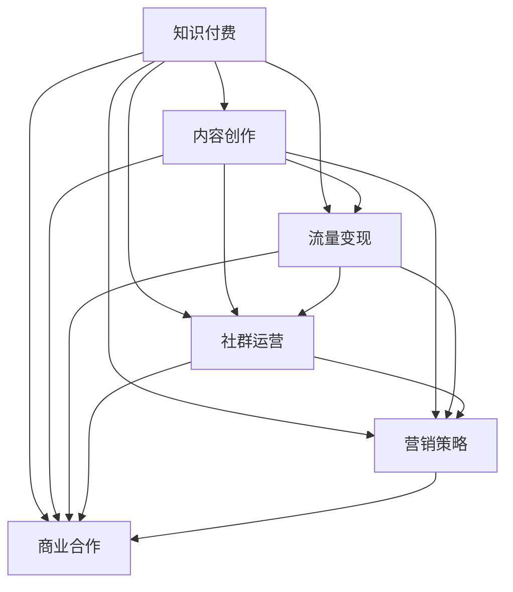

                 

# 如何打造个人知识付费生态系统

> 关键词：知识付费, 个人IP, 内容创作, 流量变现, 社群运营, 营销策略, 商业合作

## 1. 背景介绍

### 1.1 问题由来
随着互联网的普及和智能设备的普及，越来越多的人开始通过在线平台获取知识。知识付费作为一种新兴的在线服务模式，凭借其便捷性、性价比和可定制性，逐渐受到用户的青睐。知识付费平台如得到、喜马拉雅、知乎live等，汇聚了大量优秀的知识创作者，帮助用户通过付费获取高质量的学习资源。然而，对于个人来说，如何在知识付费领域脱颖而出，构建自己的知识付费生态系统，是一个具有挑战性的问题。

### 1.2 问题核心关键点
个人知识付费生态系统的构建，涉及多个方面的内容，包括内容创作、流量变现、社群运营、营销策略、商业合作等。核心在于如何将个人的知识和经验转化为有价值的产品和服务，吸引并留住用户，实现长期的盈利和影响力提升。

### 1.3 问题研究意义
构建个人知识付费生态系统，不仅可以实现个人价值和收入的双重提升，还能通过知识分享和传递，推动知识传播和教育的普及，促进社会整体的知识水平提升。此外，成功的知识付费平台还能形成良性循环，带动相关产业链的繁荣，对教育、文化、科技等领域产生深远影响。

## 2. 核心概念与联系

### 2.1 核心概念概述

为了更好地理解如何构建个人知识付费生态系统，本节将介绍几个密切相关的核心概念：

- **知识付费**：指用户为获取高质量的学习资源而支付费用的在线服务模式。知识付费平台通过聚合优质内容，帮助用户高效获取知识，实现价值交换。

- **个人IP（Influence Personality）**：指通过内容创作和个人品牌建设，获得大量忠实粉丝的个人或品牌。个人IP的价值在于其背后所蕴含的品牌影响力和商业变现能力。

- **内容创作**：指创作并发布有价值、有深度的内容，如文章、视频、音频、课程等，以满足用户的学习需求。内容创作是知识付费生态系统的核心，是流量变现的基础。

- **流量变现**：指通过广告、付费订阅、会员制等形式，将流量转化为收入的过程。流量变现能力是衡量知识付费平台盈利能力的关键指标。

- **社群运营**：指通过建立和管理粉丝群体，增强用户粘性，提升用户满意度和忠诚度。社群运营是构建个人IP和实现流量变现的重要手段。

- **营销策略**：指通过市场调研、渠道建设、品牌推广等手段，扩大知识付费内容的传播范围和影响力。营销策略的有效性直接影响内容曝光率和转化率。

- **商业合作**：指与广告主、企业、教育机构等进行合作，拓展知识付费平台的业务范围和盈利渠道。商业合作可以带来更多资源和用户，提升平台的整体竞争力。

这些核心概念之间的逻辑关系可以通过以下Mermaid流程图来展示：



这个流程图展示的知识付费生态系统的各个组成部分及其之间的关系：

1. 知识付费平台基于内容创作，为用户提供有价值的学习资源。
2. 流量变现能力通过内容传播和用户付费实现。
3. 社群运营增强用户粘性，提升品牌影响力。
4. 营销策略扩大内容传播范围，提高内容曝光率和用户转化率。
5. 商业合作拓展业务范围，实现多元盈利。

这些概念共同构成了个人知识付费生态系统的基础，为其构建和运营提供了清晰的指导方向。

## 3. 核心算法原理 & 具体操作步骤
### 3.1 算法原理概述

个人知识付费生态系统的构建，本质上是一个多目标优化问题。其核心思想是通过合理配置内容创作、流量变现、社群运营、营销策略和商业合作等资源，最大化平台的盈利能力和用户满意度。

具体而言，可以构建如下优化目标：
1. **内容质量**：衡量内容的深度、广度和时效性，提升用户满意度和留存率。
2. **流量曝光**：衡量内容的传播范围和覆盖用户数，提升平台的知名度和用户转化率。
3. **用户粘性**：衡量用户活跃度和忠诚度，增强社群的凝聚力和平台的用户粘性。
4. **盈利能力**：衡量平台的收入来源和转化率，实现商业变现和持续盈利。
5. **品牌影响力**：衡量平台在行业内的声誉和影响力，提升品牌的市场价值。

通过对以上指标的综合优化，实现个人知识付费生态系统的良性循环和可持续发展。

### 3.2 算法步骤详解

个人知识付费生态系统的构建，涉及多个环节，包括内容创作、流量变现、社群运营、营销策略和商业合作等。以下将详细介绍每个环节的具体操作步骤：

**Step 1: 内容创作**

- **选题策划**：根据市场调研和用户需求，确定有价值、有深度、有差异化的内容选题。
- **内容制作**：根据选题策划，制作高质量的内容，如文章、视频、音频、课程等。
- **内容分发**：选择合适的分发渠道，如微信公众号、视频网站、音频平台等，提升内容的曝光率。

**Step 2: 流量变现**

- **付费订阅**：根据内容价值和用户需求，设定合理的付费价格，推出付费订阅服务。
- **广告合作**：与广告主合作，在平台上推广广告，实现流量变现。
- **会员制**：推出会员制，提供会员专属内容和福利，增强用户粘性。

**Step 3: 社群运营**

- **用户互动**：通过留言、评论、私信等方式，与用户进行互动，了解用户需求和反馈。
- **社群管理**：建立和管理粉丝群体，定期举办线上线下活动，增强用户粘性。
- **用户反馈**：收集用户反馈，优化内容和服务，提升用户体验和满意度。

**Step 4: 营销策略**

- **市场调研**：通过问卷调查、数据分析等方式，了解目标用户群体的需求和偏好。
- **渠道建设**：选择合适的营销渠道，如社交媒体、搜索引擎、邮件营销等，扩大内容传播范围。
- **品牌推广**：通过品牌故事、案例分享等方式，提升品牌的市场影响力和用户认可度。

**Step 5: 商业合作**

- **合作伙伴选择**：根据平台需求和资源，选择适合的合作伙伴，如广告主、企业、教育机构等。
- **合作模式设计**：设计合理的合作模式，如联合推广、资源共享、技术合作等，实现共赢。
- **合作效果评估**：评估合作效果，持续优化合作模式，提升商业变现能力。

通过上述步骤，个人知识付费生态系统可以实现从内容创作到流量变现的完整链条，形成良性循环，实现可持续发展和盈利。

### 3.3 算法优缺点

个人知识付费生态系统的构建，具有以下优点：
1. **多渠道盈利**：通过内容订阅、广告合作、会员制等多种方式，实现多元盈利。
2. **用户粘性高**：通过社群运营和互动，增强用户粘性，提升用户留存率和忠诚度。
3. **品牌影响力强**：通过高质量内容和品牌推广，提升品牌的市场影响力和用户认可度。

同时，该方法也存在一定的局限性：
1. **内容创作难度大**：高质量内容的制作需要大量的时间和精力，且市场竞争激烈，内容差异化难度大。
2. **流量获取成本高**：获取新用户的成本高，且用户流失率高，需要持续投入资源进行运营。
3. **运营管理复杂**：社群运营、营销策略、商业合作等环节的管理复杂，需要具备丰富的运营经验。

尽管存在这些局限性，但就目前而言，个人知识付费生态系统的构建，仍是大数据分析、人工智能等领域的研究热点和应用方向。未来相关研究的重点在于如何进一步优化内容创作和流量变现的效率，提高用户满意度和忠诚度，同时兼顾商业合作的可持续发展。

### 3.4 算法应用领域

个人知识付费生态系统的构建，已经在教育、科技、金融、医疗等多个领域得到应用，并取得了显著成效：

- **教育领域**：通过知识付费平台，教师可以发布优质的教学视频、课件和课程，实现知识传播和教育普及。
- **科技领域**：科技领域的专家和工程师可以分享最新的科技资讯、项目经验和案例分析，促进科技知识的传播和创新。
- **金融领域**：金融领域的分析师和投资专家可以通过知识付费平台分享投资策略、市场分析和理财知识，帮助用户实现财富增值。
- **医疗领域**：医生和医疗专家可以通过知识付费平台分享医疗知识和健康建议，提升公众的健康素养和医疗水平。

除了上述这些领域外，个人知识付费生态系统还被创新性地应用于更多场景中，如职业培训、文化娱乐、旅游等，为各行各业提供了新的价值和服务模式。

## 4. 数学模型和公式 & 详细讲解 & 举例说明

### 4.1 数学模型构建

个人知识付费生态系统的构建，可以通过数学模型进行建模和分析。以下是一个简单的数学模型示例，用于衡量内容的价值、用户满意度和盈利能力。

假设知识付费平台有 $N$ 个内容创作者，每个创作者每月发布 $M$ 个内容，平台有 $K$ 个付费订阅用户和 $L$ 个广告主。设每个内容的价值为 $V_i$，用户满意度为 $U_i$，平台盈利能力为 $P_i$。则平台总价值 $V$、总用户满意度 $U$ 和总盈利能力 $P$ 分别为：

$$
V = \sum_{i=1}^{N} V_i
$$

$$
U = \sum_{i=1}^{N} U_i
$$

$$
P = \sum_{i=1}^{N} P_i
$$

其中，内容价值 $V_i$ 由内容质量、传播范围和用户反馈决定，用户满意度 $U_i$ 由用户互动、社群管理和服务质量决定，平台盈利能力 $P_i$ 由付费订阅收入、广告收入和会员收入决定。

### 4.2 公式推导过程

以下我们将推导一个简单的目标函数，用于优化个人知识付费生态系统。设目标函数为 $F(V, U, P)$，表示平台总价值、总用户满意度和总盈利能力的最优组合。

假设目标函数为以下线性组合形式：

$$
F(V, U, P) = aV + bU + cP
$$

其中 $a, b, c$ 为权重系数，表示平台对内容价值、用户满意度和盈利能力的重视程度。通过对目标函数的最优化，可以调整各指标之间的权重关系，实现平台的最优运营。

### 4.3 案例分析与讲解

假设某知识付费平台有三个内容创作者 $A, B, C$，每月分别发布 5 个内容。平台有 100 个付费订阅用户和 50 个广告主。设每个内容价值 $V_A=V_B=V_C=50$，用户满意度 $U_A=U_B=U_C=0.9$，平台盈利能力 $P_A=P_B=P_C=20$。

通过上述公式计算，可以得到平台总价值、总用户满意度和总盈利能力分别为：

$$
V = 3 \times 5 \times 50 = 750
$$

$$
U = 3 \times 5 \times 0.9 = 13.5
$$

$$
P = 3 \times 5 \times 20 = 300
$$

通过调整权重系数 $a, b, c$，可以实现不同运营策略下的目标函数最优解。例如，如果希望平台更重视内容价值，可以设置 $a=0.6, b=0.3, c=0.1$，则目标函数变为：

$$
F(V, U, P) = 0.6V + 0.3U + 0.1P
$$

计算得到最优解为 $F_{\text{opt}} = 0.6 \times 750 + 0.3 \times 13.5 + 0.1 \times 300 = 849$。

这个案例说明了如何通过数学模型来优化个人知识付费生态系统，根据不同指标的权重关系，调整运营策略，实现最优运营效果。

## 5. 项目实践：代码实例和详细解释说明
### 5.1 开发环境搭建

在进行个人知识付费生态系统的开发实践前，我们需要准备好开发环境。以下是使用Python进行Flask开发的环境配置流程：

1. 安装Anaconda：从官网下载并安装Anaconda，用于创建独立的Python环境。

2. 创建并激活虚拟环境：
```bash
conda create -n flask-env python=3.8 
conda activate flask-env
```

3. 安装Flask：
```bash
pip install Flask
```

4. 安装Flask-RESTful：
```bash
pip install Flask-RESTful
```

5. 安装Flask-CORS：
```bash
pip install Flask-CORS
```

6. 安装Flask-SQLAlchemy：
```bash
pip install Flask-SQLAlchemy
```

7. 安装Flask-Mail：
```bash
pip install Flask-Mail
```

完成上述步骤后，即可在`flask-env`环境中开始开发实践。

### 5.2 源代码详细实现

这里我们以开发一个简单的知识付费平台为例，给出使用Flask进行项目开发的Python代码实现。

首先，定义数据库连接：

```python
from flask_sqlalchemy import SQLAlchemy

app = Flask(__name__)
app.config['SQLALCHEMY_DATABASE_URI'] = 'sqlite:////tmp/test.db'
db = SQLAlchemy(app)
```

然后，定义用户和内容模型：

```python
class User(db.Model):
    id = db.Column(db.Integer, primary_key=True)
    name = db.Column(db.String(80), unique=True, nullable=False)
    email = db.Column(db.String(120), unique=True, nullable=False)
    password = db.Column(db.String(120), nullable=False)
    is_admin = db.Column(db.Boolean, default=False)

class Content(db.Model):
    id = db.Column(db.Integer, primary_key=True)
    title = db.Column(db.String(120), nullable=False)
    content = db.Column(db.Text, nullable=False)
    user_id = db.Column(db.Integer, db.ForeignKey('user.id'), nullable=False)
    views = db.Column(db.Integer, default=0)
    likes = db.Column(db.Integer, default=0)
    dislikes = db.Column(db.Integer, default=0)
    price = db.Column(db.Float, nullable=False)
```

接着，定义用户登录、内容发布和订阅等API接口：

```python
from flask import request, jsonify, render_template, redirect, url_for, flash
from flask_login import login_user, logout_user, login_required, current_user

@app.route('/login', methods=['GET', 'POST'])
def login():
    if request.method == 'POST':
        # 登录逻辑
        return redirect(url_for('dashboard'))
    return render_template('login.html')

@app.route('/logout')
@login_required
def logout():
    logout_user()
    return redirect(url_for('login'))

@app.route('/dashboard')
@login_required
def dashboard():
    # 用户管理
    # 内容管理
    # 广告管理
    # 订阅管理
    pass

@app.route('/content/create', methods=['GET', 'POST'])
@login_required
def create_content():
    if request.method == 'POST':
        # 创建内容
        return redirect(url_for('dashboard'))
    return render_template('create_content.html')

@app.route('/content/<int:id>', methods=['GET', 'POST'])
@login_required
def update_content(id):
    # 更新内容
    pass

@app.route('/content/<int:id>/delete', methods=['POST'])
@login_required
def delete_content(id):
    # 删除内容
    pass

@app.route('/subscribe', methods=['GET', 'POST'])
@login_required
def subscribe_content():
    if request.method == 'POST':
        # 订阅内容
        return redirect(url_for('dashboard'))
    return render_template('subscribe_content.html')
```

最后，启动Flask应用：

```python
if __name__ == '__main__':
    app.run(debug=True)
```

以上就是使用Flask开发一个简单的知识付费平台的完整代码实现。可以看到，Flask通过简单的路由定义，可以快速搭建起前后端分离的Web应用，便于内容发布、用户管理、订阅等功能的实现。

### 5.3 代码解读与分析

让我们再详细解读一下关键代码的实现细节：

**User和Content模型**：
- `User`模型表示用户信息，包括姓名、邮箱和密码等。
- `Content`模型表示内容信息，包括标题、内容、用户ID、观看次数、点赞数、不喜欢数和价格等。

**路由定义**：
- `/login`路由定义了用户登录功能，包括GET和POST两种请求方式。
- `/logout`路由定义了用户退出登录功能。
- `/dashboard`路由定义了用户仪表盘功能，展示了用户管理、内容管理、广告管理和订阅管理等内容。
- `/content/create`路由定义了内容创建功能，支持GET和POST两种请求方式。
- `/content/<int:id>`路由定义了内容更新和删除功能。
- `/subscribe`路由定义了内容订阅功能。

**Flask扩展使用**：
- `Flask-SQLAlchemy`用于数据库连接和模型定义。
- `Flask-Login`用于用户登录和注销功能。
- `Flask-Mail`用于发送邮件功能，可以用于用户注册和内容订阅的确认。

合理利用这些工具，可以显著提升个人知识付费平台的开发效率，加快创新迭代的步伐。

当然，工业级的系统实现还需考虑更多因素，如用户界面设计、数据库性能优化、API安全防护等。但核心的内容管理和用户交互功能基本与此类似。

## 6. 实际应用场景
### 6.1 智能客服系统

个人知识付费生态系统可以应用于智能客服系统的构建。传统客服往往需要配备大量人力，高峰期响应缓慢，且一致性和专业性难以保证。通过知识付费平台，可以汇聚各行各业的专业人士，提供实时在线咨询和解答服务。

在技术实现上，知识付费平台可以提供丰富的专家资源，并通过在线聊天、视频会议等方式，让用户与专家进行实时互动。同时，平台还可以通过智能推荐算法，推荐最适合用户的专家和内容，提升用户满意度和留存率。

### 6.2 金融舆情监测

知识付费平台在金融领域的应用，可以帮助投资者获取最新市场资讯和分析报告，提升投资决策的准确性和效率。通过平台订阅，投资者可以获得高质量的市场分析和投资策略，从而避免市场风险，提高投资收益。

在技术实现上，知识付费平台可以与金融数据提供商合作，提供实时的市场数据和分析报告。平台还可以通过AI技术，对市场舆情进行实时监测和分析，帮助投资者做出更明智的投资决策。

### 6.3 个性化推荐系统

知识付费平台可以应用于个性化推荐系统的构建。通过收集用户浏览、点击、评论、分享等行为数据，分析用户的兴趣点和需求，向用户推荐相关的课程、文章和视频等内容。

在技术实现上，知识付费平台可以通过分析用户的阅读历史和浏览行为，使用机器学习算法，对用户进行兴趣标签的打分，并根据标签进行内容推荐。同时，平台还可以通过智能算法，根据用户的互动行为进行实时调整和优化，提升推荐效果。

### 6.4 未来应用展望

随着知识付费平台的不断发展，其在更多领域的应用前景也将更加广阔。

在智慧医疗领域，知识付费平台可以提供高质量的医学知识和医疗建议，帮助医生和患者做出更好的医疗决策。

在智能教育领域，知识付费平台可以提供定制化的学习方案和教育资源，帮助学生提升学习效果，实现个性化教育。

在智慧城市治理中，知识付费平台可以提供城市事件监测、舆情分析等服务，提升城市管理的智能化水平。

此外，在企业培训、文化娱乐、旅游等多个领域，知识付费平台也将发挥重要作用，为各行各业提供新的价值和服务模式。

## 7. 工具和资源推荐
### 7.1 学习资源推荐

为了帮助开发者系统掌握个人知识付费生态系统的理论和实践，这里推荐一些优质的学习资源：

1. **《知识付费白皮书》**：由知名知识付费平台和方法论专家撰写，全面介绍了知识付费的商业模式、用户行为和运营策略，是理解知识付费领域的必读之作。

2. **《内容营销革命》**：介绍了内容营销的核心理念和方法，通过案例分析，展示了如何通过优质内容吸引用户和实现流量变现。

3. **《用户体验设计》**：介绍了用户界面设计和用户体验优化的基本原则和方法，帮助开发者设计更好的用户交互体验。

4. **《Python Web开发实战》**：介绍了如何使用Flask等Web框架进行网站开发，是Flask开发的入门指南。

5. **《机器学习实战》**：介绍了机器学习算法和模型在知识付费平台中的应用，帮助开发者实现内容推荐、用户分析等功能。

6. **《深度学习入门》**：介绍了深度学习的基础知识和应用场景，帮助开发者理解AI技术在知识付费平台中的应用。

通过对这些资源的学习实践，相信你一定能够快速掌握个人知识付费生态系统的核心内容，并用于解决实际的开发问题。

### 7.2 开发工具推荐

高效的开发离不开优秀的工具支持。以下是几款用于个人知识付费平台开发的常用工具：

1. **Flask**：Python的轻量级Web框架，易于上手，适合快速搭建Web应用。
2. **SQLAlchemy**：Python的ORM库，用于数据库连接和模型定义，适合进行数据存储和管理。
3. **Flask-RESTful**：Flask的扩展库，用于构建API接口，方便前后端分离开发。
4. **Flask-Mail**：Flask的扩展库，用于发送邮件功能，方便用户注册和内容订阅的确认。
5. **PostgreSQL**：流行的关系型数据库，适合存储和管理大量用户和内容数据。
6. **Redis**：内存数据库，适合缓存和管理热点数据，提高系统响应速度。

合理利用这些工具，可以显著提升个人知识付费平台的开发效率，加快创新迭代的步伐。

### 7.3 相关论文推荐

个人知识付费生态系统的研究源于学界的持续研究。以下是几篇奠基性的相关论文，推荐阅读：

1. **《知识付费的市场化与社会化》**：分析了知识付费的市场需求和社会价值，提出了构建知识付费平台的关键策略。

2. **《基于用户行为分析的内容推荐系统》**：介绍了内容推荐系统的基本原理和算法，展示了如何通过用户行为数据进行个性化推荐。

3. **《用户粘性与内容运营的关系研究》**：分析了用户粘性与内容运营之间的关系，提出了提升用户满意度和忠诚度的策略。

4. **《社交媒体在知识付费平台中的应用》**：分析了社交媒体在知识付费平台中的作用，展示了如何通过社交网络提升内容传播和用户互动。

5. **《知识付费平台的商业模式分析》**：分析了知识付费平台的商业模式和盈利模式，展示了如何通过多元化盈利实现平台的可持续发展。

这些论文代表了大数据分析、人工智能等领域的研究方向，通过学习这些前沿成果，可以帮助研究者把握学科前进方向，激发更多的创新灵感。

## 8. 总结：未来发展趋势与挑战

### 8.1 总结

本文对个人知识付费生态系统的构建进行了全面系统的介绍。首先阐述了知识付费在互联网时代的重要性和发展趋势，明确了构建个人知识付费生态系统的意义和方向。其次，从内容创作、流量变现、社群运营、营销策略和商业合作等各个环节，详细讲解了具体的实施步骤和操作方法。通过具体的代码实现和案例分析，展示了知识付费平台的开发和运营方法。

通过本文的系统梳理，可以看到，个人知识付费生态系统的构建，是多方位的系统工程，涉及内容创作、用户管理、流量变现、营销推广和商业合作等多个环节。只有全面、系统地理解这些环节，才能实现知识付费平台的成功运营。

### 8.2 未来发展趋势

展望未来，个人知识付费生态系统将呈现以下几个发展趋势：

1. **内容多样化**：随着知识付费平台的不断发展，内容形式将更加多样化，包括文章、视频、音频、课程、直播等多种形式，满足用户多样化的学习需求。

2. **技术智能化**：AI技术将在大数据分析、用户画像、内容推荐等领域得到广泛应用，提升平台的智能化水平，提升用户满意度和留存率。

3. **运营精细化**：知识付费平台将通过精细化的运营策略，实现对用户行为和需求的高效管理，提升平台的整体运营效率和盈利能力。

4. **国际化**：知识付费平台将拓展海外市场，通过多语言支持和文化适应性优化，提升平台在国际化场景下的竞争力。

5. **合作多元化**：知识付费平台将与更多行业和领域的企业进行合作，拓展合作模式和内容来源，实现业务的快速增长和多元化。

以上趋势凸显了个人知识付费生态系统的发展潜力，也为未来的研究和实践指明了方向。

### 8.3 面临的挑战

尽管个人知识付费生态系统的构建已经取得了一定的成果，但在迈向更加智能化、普适化应用的过程中，仍面临诸多挑战：

1. **内容质量提升**：高质量内容的创作需要大量的时间和精力，且市场竞争激烈，内容差异化难度大。

2. **用户留存困难**：获取新用户的成本高，且用户流失率高，需要持续投入资源进行运营。

3. **技术瓶颈**：知识付费平台涉及AI技术、数据库技术、Web开发等多个技术领域，需要多学科的协同合作。

4. **商业模式单一**：当前的知识付费平台主要依赖付费订阅和广告合作两种盈利模式，需要不断探索新的盈利渠道。

5. **内容版权问题**：在知识付费平台上发布大量原创内容，需要处理大量的版权和知识产权问题，增加了运营复杂度。

正视这些挑战，积极应对并寻求突破，将是大数据分析和人工智能技术在知识付费领域走向成熟的重要路径。

### 8.4 研究展望

面对知识付费生态系统构建所面临的诸多挑战，未来的研究需要在以下几个方面寻求新的突破：

1. **内容创作自动化**：开发智能内容创作工具，如自动生成文章、视频脚本等，提升内容创作的效率和质量。

2. **用户行为分析**：通过大数据分析技术，深入挖掘用户行为和需求，实现更精准的内容推荐和个性化服务。

3. **平台智能化**：引入AI技术，提升平台的智能化水平，实现内容自动化审核、推荐算法优化等。

4. **多元化盈利**：探索新的盈利模式，如众筹、直播打赏、知识交易等，实现平台的持续发展和盈利。

5. **技术框架优化**：优化技术架构，提高平台的可扩展性和稳定性，降低运维成本。

这些研究方向的探索，必将引领个人知识付费生态系统迈向更高的台阶，为知识传播和教育普及带来新的机遇和挑战。面向未来，个人知识付费生态系统的构建，需要跨学科、跨领域、跨行业的共同努力，推动知识的有效传播和利用，推动人类社会的进步和发展。

## 9. 附录：常见问题与解答

**Q1: 个人知识付费生态系统如何实现内容创作的多样化？**

A: 实现内容创作的多样化，可以从以下几个方面入手：

1. **内容形式多样化**：除了传统的文章和视频，还可以引入音频、直播、互动式教学等多种形式的内容，满足用户多样化的学习需求。

2. **内容来源多样化**：除了平台自身的专家资源，还可以通过与教育机构、企业、个人等进行合作，引入更多优质的内容来源。

3. **内容主题多样化**：除了传统的课程和知识分享，还可以引入行业新闻、技术动态、趋势分析等多种主题，提升内容的深度和广度。

4. **内容互动多样化**：除了单向的内容输出，还可以引入互动式问答、在线讨论、用户投票等形式，增强用户的参与感和互动性。

**Q2: 个人知识付费生态系统如何提升用户留存率？**

A: 提升用户留存率是知识付费平台运营的关键。以下是几个有效的策略：

1. **用户互动**：通过留言、评论、私信等方式，与用户进行互动，了解用户需求和反馈。及时回复用户问题，增强用户粘性。

2. **内容更新**：定期更新和发布新内容，保持内容的持续性和时效性。同时，根据用户反馈，优化和更新现有内容，提升用户满意度。

3. **社区运营**：建立和管理粉丝群体，定期举办线上线下活动，增强用户粘性。创建话题讨论、学习小组等，提升用户参与度和归属感。

4. **奖励机制**：设计合理的奖励机制，如积分奖励、免费内容、会员特权等，激励用户持续参与和消费。

5. **用户体验优化**：提升平台的用户界面和用户体验，简化用户操作流程，提升用户的使用便利性和满意度。

**Q3: 个人知识付费生态系统如何实现技术智能化？**

A: 实现技术智能化，可以从以下几个方面入手：

1. **AI技术应用**：引入AI技术，如自然语言处理、计算机视觉、推荐算法等，提升内容的自动化审核、推荐和生成能力。

2. **大数据分析**：通过大数据分析技术，深入挖掘用户行为和需求，实现更精准的内容推荐和个性化服务。

3. **机器学习**：引入机器学习算法，优化推荐算法、广告投放、用户行为预测等，提升平台的智能化水平。

4. **云计算**：利用云计算平台，实现资源的弹性扩展和高效的分布式计算，提升平台的可扩展性和稳定性。

5. **物联网**：引入物联网技术，实现设备、平台和用户之间的无缝连接和互动，提升平台的智能化水平。

**Q4: 个人知识付费生态系统如何实现多元化盈利？**

A: 实现多元化盈利，可以从以下几个方面入手：

1. **付费订阅**：推出高质量的课程、电子书、视频等内容，收取订阅费用。

2. **广告合作**：与广告主合作，在平台上推广广告，实现流量变现。

3. **会员制**：推出会员制，提供会员专属内容和福利，增强用户粘性。

4. **众筹**：推出众筹项目，通过用户资金支持，实现内容的创作和推广。

5. **直播打赏**：推出直播功能，通过用户打赏和付费观看，实现直播内容的盈利。

6. **知识交易**：引入知识交易平台，实现知识付费和知识产权的交易。

**Q5: 个人知识付费生态系统如何实现内容版权保护？**

A: 实现内容版权保护，可以从以下几个方面入手：

1. **版权声明**：在内容发布前，明确版权归属，进行版权声明。

2. **数字水印**：在内容中添加数字水印，防止盗版和非法传播。

3. **版权监控**：利用版权监控技术，实时监测和打击盗版行为，保护原创内容。

4. **法律手段**：通过法律手段，打击盗版和侵权行为，维护平台和创作者的合法权益。

5. **用户教育**：通过平台引导和教育，提升用户版权意识，避免盗版和非法传播。

这些策略可以帮助知识付费平台有效保护内容版权，提升平台的知识产权保护水平，保障平台的健康发展和用户利益。

---

作者：禅与计算机程序设计艺术 / Zen and the Art of Computer Programming

