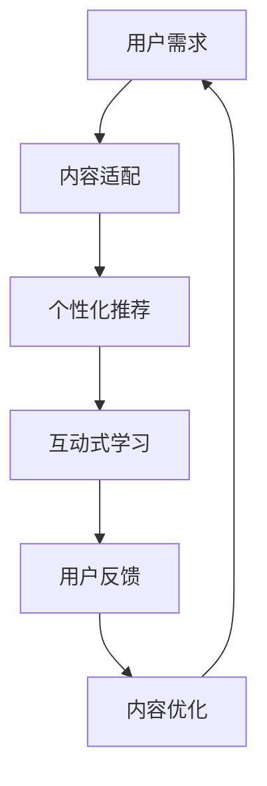

                 

# 如何提高知识付费产品的用户粘性

## 1. 背景介绍

### 1.1 问题由来

随着移动互联网和数字经济的迅速发展，知识付费已经成为一个快速增长的市场。用户在各个知识付费平台消费，不仅是为了获取知识，更是为了满足求知欲、提升个人竞争力和获得精神满足。知识付费产品的用户粘性，即用户对产品长期持续使用的程度，成为各大平台竞争的焦点。如何提升用户粘性，构建一个良性循环、可持续发展的知识付费生态，成为摆在我们面前的重要课题。

### 1.2 问题核心关键点

要提高知识付费产品的用户粘性，需关注以下几个核心关键点：

- **用户需求匹配度**：了解用户真实需求，提供适配度高的优质内容，以内容吸引用户。
- **个性化推荐系统**：通过算法优化，实现内容推荐与用户需求的精准匹配，提升用户体验。
- **交互式学习环境**：打造互动性强的学习环境，通过问答、讨论等形式，增强用户参与感。
- **知识与兴趣融合**：将知识内容与用户兴趣爱好相结合，提升学习的趣味性和关联度。
- **用户反馈循环**：建立完善的反馈机制，通过用户反馈不断改进产品和服务。

这些关键点共同构成了提高知识付费产品用户粘性的主要策略，将引导用户长期稳定使用，实现平台的可持续发展和收益。

## 2. 核心概念与联系

### 2.1 核心概念概述

为更好地理解如何提高知识付费产品的用户粘性，需先介绍几个关键概念：

- **知识付费产品(Knowledge-based Subscription Services)**：指用户为获取专业知识、技能、经验等内容而支付费用的平台服务，如得到、喜马拉雅、网易云课堂等。
- **用户粘性(User St Stickiness)**：指用户在平台上停留时间和频率的指标，衡量用户对平台的依赖程度。
- **个性化推荐系统(Personalized Recommendation System)**：根据用户行为数据，通过算法推荐个性化内容，提升用户体验的系统。
- **互动式学习(Interactive Learning)**：通过问答、讨论、模拟等形式，增加用户参与度和互动性的学习方式。
- **用户反馈机制(User Feedback Mechanism)**：收集用户使用过程中的意见和建议，及时调整和优化产品服务的机制。

这些概念之间的联系可以通过以下Mermaid流程图来展示：



这个流程图展示了用户需求匹配、个性化推荐、互动式学习、用户反馈与内容优化的闭环过程，反映了提高用户粘性的核心路径。

## 3. 核心算法原理 & 具体操作步骤

### 3.1 算法原理概述

提高知识付费产品用户粘性的核心算法原理，主要涉及以下几个方面：

- **用户行为分析**：通过数据挖掘和机器学习技术，分析用户行为数据，识别用户需求和兴趣。
- **个性化推荐算法**：基于用户历史行为数据，构建个性化推荐模型，实现内容推荐与用户需求的精准匹配。
- **互动式学习算法**：设计互动式学习环境，通过互动问答、模拟训练等方式，增强用户参与度和学习效果。
- **用户反馈模型**：建立用户反馈模型，收集用户评价和建议，调整内容策略和推荐算法。

### 3.2 算法步骤详解

1. **用户行为数据收集**：
   - 通过平台数据分析工具，收集用户在平台上浏览、阅读、购买、互动等行为数据。
   - 使用日志、事件追踪等方式，实时记录用户行为，构建用户画像。

2. **用户需求分析**：
   - 利用文本挖掘、情感分析等技术，分析用户评论和反馈，提取用户对内容的喜好和评价。
   - 进行聚类分析和主题建模，识别用户需求热点和共性兴趣。

3. **个性化推荐模型构建**：
   - 选择适合的推荐算法，如协同过滤、内容推荐、深度学习等，构建个性化推荐模型。
   - 根据用户历史行为和兴趣标签，计算内容的相关性得分，生成个性化推荐列表。

4. **互动式学习环境设计**：
   - 设计互动式学习平台，如在线问答、虚拟实验室、模拟任务等。
   - 引入游戏化元素，通过积分、奖励等方式，激励用户参与互动学习。

5. **用户反馈循环优化**：
   - 建立用户反馈机制，定期收集用户对内容和平台的评价。
   - 使用NLP技术处理用户反馈，提取关键信息和建议，进行内容优化和算法改进。

### 3.3 算法优缺点

个性化推荐和互动式学习算法在提升用户粘性方面具有以下优点：

- **精准匹配**：通过算法推荐，实现内容与用户需求的精准匹配，提升用户满意度。
- **增加互动**：互动式学习增强用户参与度，提高学习效果和粘性。
- **动态优化**：用户反馈循环和动态调整，使推荐和内容策略持续优化。

同时，这些算法也存在一些缺点：

- **数据隐私问题**：收集和分析用户行为数据可能涉及隐私风险，需要严格遵守相关法律法规。
- **算法复杂性**：构建和优化推荐和互动算法需要较高的技术门槛，需投入较多资源。
- **用户偏好多样性**：用户需求和兴趣千差万别，个性化算法难以完全覆盖所有用户。

尽管存在这些局限，但总体而言，个性化推荐和互动式学习算法为提升知识付费产品用户粘性提供了有效手段。

### 3.4 算法应用领域

个性化推荐和互动式学习算法在知识付费产品中的应用广泛，涵盖以下领域：

- **内容推荐系统**：推荐用户可能感兴趣的内容，如课程、文章、视频等，提高用户留存率。
- **互动问答平台**：建立实时问答机制，用户可以提出问题，其他用户或专家进行回答，增强社区互动。
- **模拟训练平台**：设计虚拟实验室或场景模拟，让用户通过实践学习，提升学习效果。
- **个性化课程设计**：根据用户兴趣和学习进度，动态调整课程内容和难度，提高学习个性化。

## 4. 数学模型和公式 & 详细讲解  
### 4.1 数学模型构建

在知识付费产品中，推荐算法和互动算法通常涉及用户行为数据建模和互动特征提取。

- **用户行为数据建模**：将用户行为数据转化为数学模型，如协同过滤模型、矩阵分解等，以表示用户和内容的兴趣关系。
- **互动特征提取**：从互动数据中提取关键特征，如用户回答次数、回复时间等，用于增强推荐模型。

### 4.2 公式推导过程

以协同过滤推荐算法为例，其基本思路是根据用户历史行为，找到兴趣相似的用户，推荐这些用户喜欢的内容。假设用户集为 $U$，内容集为 $I$，用户与内容的交互矩阵为 $R \in \mathbb{R}^{m \times n}$，其中 $R_{ui}=1$ 表示用户 $u$ 对内容 $i$ 进行了交互，$R_{ui}=0$ 表示未交互。协同过滤算法中的用户相似度矩阵 $S \in \mathbb{R}^{m \times m}$ 用于表示用户间的相似度，推荐公式为：

$$
\hat{R}_{ui} = \frac{\sum_{v=1}^{m}R_{uv}S_{uv}}{\sqrt{\sum_{v=1}^{m}S_{uv}^2} \cdot \sqrt{\sum_{v=1}^{m}S_{uv}^2}}
$$

其中，$S_{uv}$ 表示用户 $u$ 和 $v$ 的相似度。

### 4.3 案例分析与讲解

假设一个在线教育平台，用户通过观看视频、完成练习、参加讨论等方式进行学习。平台收集了用户的历史行为数据，并利用协同过滤算法进行个性化推荐。推荐过程如下：

1. **用户行为数据收集**：通过平台数据分析工具，记录用户观看视频、练习题完成情况、讨论参与度等行为。
2. **协同过滤建模**：构建用户与内容的兴趣矩阵 $R$，使用余弦相似度计算用户间的相似度 $S$。
3. **内容推荐计算**：根据公式计算用户 $u$ 对内容 $i$ 的推荐度 $\hat{R}_{ui}$，筛选出推荐内容列表。
4. **互动学习环境设计**：设计在线讨论区，用户可以发布问题，其他用户或老师进行回答，增强学习互动性。

## 5. 项目实践：代码实例和详细解释说明

### 5.1 开发环境搭建

为了实践以上算法，需要搭建相应的开发环境：

1. 安装Python 3.x：从官网下载并安装最新版本的Python。
2. 安装相关库：使用pip安装numpy、scipy、pandas、scikit-learn、tensorflow等数据科学和机器学习库。
3. 安装推荐系统框架：安装如LightFM、Surprise等推荐系统框架，方便实现协同过滤等推荐算法。
4. 安装在线互动系统：如Flask、Django等web框架，搭建互动式学习平台。

### 5.2 源代码详细实现

下面以协同过滤推荐算法为例，给出完整的代码实现：

```python
from surprise import Dataset, Reader, SVD
from surprise.model_selection import cross_validate
from surprise.prediction_algorithms.svd import SVD
from surprise.dataset import DatasetLoaders

# 读取用户行为数据
reader = Reader(rating_scale=(0, 1))  # 定义评分范围
data = DatasetLoaders.load_from_file('data/u_data.txt', reader)  # 加载用户行为数据
data2 = Dataset.load_from_df(pd.read_csv('data/u_data.csv', header=None), reader)  # 加载用户行为数据

# 计算用户相似度
svd = SVD()
cross_validate(svd, data2, measures=['RMSE', 'MAE'], cv=5)  # 交叉验证，评估模型性能
svd.fit(data2)  # 训练模型

# 为用户推荐内容
for user_id, user_items in data2.items():
    recommendations = svd.recommendations_for_user(user_id)  # 获取推荐列表
    print(f"User {user_id}'s recommendations: {recommendations}")
```

### 5.3 代码解读与分析

**代码解析**：
- 导入surprise库，用于实现协同过滤推荐算法。
- 定义评分范围和数据加载器。
- 使用交叉验证评估模型性能，并训练模型。
- 通过推荐算法获取每个用户的推荐内容。

**代码解读**：
- `Surprise`库提供了多种推荐算法，包括基于矩阵分解的协同过滤算法。
- `cross_validate`函数用于评估模型性能，通过交叉验证，获取均方根误差(RMSE)和平均绝对误差(MAE)。
- `fit`方法用于训练模型，根据用户历史行为数据进行协同过滤推荐。
- `recommendations_for_user`方法用于获取推荐内容列表，提供给用户选择。

**代码分析**：
- 协同过滤算法基于用户历史行为数据，构建用户兴趣矩阵。
- 模型训练后，通过推荐算法生成个性化推荐列表，提升用户粘性。
- 代码简洁高效，易于扩展和优化。

### 5.4 运行结果展示

运行以上代码，将输出每个用户的行为评分和推荐内容列表。例如，对于用户ID为1的用户，可能推荐的课程ID为2、3、4。通过展示这些推荐内容，提升用户参与度和学习效果。

## 6. 实际应用场景

### 6.1 在线教育平台

在线教育平台通过个性化推荐和互动学习，提升用户粘性。以Coursera为例，平台利用协同过滤推荐算法，根据用户历史学习行为和兴趣，推荐相关课程和资源。同时，平台提供在线讨论区，用户可以发布问题，老师和学员进行讨论，增强学习互动性。

### 6.2 职业技能培训

职业技能培训平台通过个性化课程推荐和互动式学习，满足用户职业发展需求。以Udemy为例，平台收集用户学习进度、评分反馈等数据，使用协同过滤算法推荐相关课程。同时，平台提供虚拟实验室，用户可以通过模拟操作学习新技能，提升学习效果。

### 6.3 在线阅读平台

在线阅读平台通过个性化推荐和互动式阅读，提升用户粘性。以Kindle为例，平台收集用户阅读习惯和评分反馈，使用协同过滤算法推荐相关书籍和文章。同时，平台提供在线评论和讨论功能，用户可以分享阅读心得，增加互动性。

### 6.4 未来应用展望

随着推荐算法和互动式学习技术的不断演进，未来的知识付费产品将更具个性化和互动性，实现更高的用户粘性。

1. **深度学习推荐**：引入深度学习技术，提升推荐模型的精准度和泛化能力。
2. **实时推荐系统**：通过实时数据分析，动态调整推荐策略，满足用户即时需求。
3. **跨平台互动**：实现多平台互动，如语音互动、VR互动等，增强用户体验。
4. **跨领域内容整合**：将知识内容与更多领域（如医疗、法律等）相结合，提升内容多样性。
5. **用户社区建设**：建立用户社区，增强用户参与度和社交属性，构建良性互动生态。

未来，知识付费产品将更加智能化、个性化、互动化，为用户的持续学习和职业发展提供有力支持。

## 7. 工具和资源推荐

### 7.1 学习资源推荐

为了帮助开发者掌握知识付费产品的核心技术，推荐以下学习资源：

1. **《推荐系统实战》**：由Yangqing Jia撰写，系统介绍了推荐算法原理和实践技巧，涵盖协同过滤、深度学习等内容。
2. **《Deep Learning for Recommender Systems》**：由Antonio Artiach、Christian Borgelt等专家撰写，详细讲解了深度学习在推荐系统中的应用。
3. **《Machine Learning Yearning》**：由Andrew Ng撰写，介绍了机器学习在推荐系统中的实践经验，强调了系统优化和用户反馈的重要性。
4. **《Surprise用户行为数据建模与推荐》**：由Yangqing Jia撰写，介绍了Surprise库的使用方法和推荐算法实践。
5. **《Flask Web开发实战》**：由Miguel Grinberg撰写，介绍了使用Flask框架搭建在线互动学习平台的技术要点。

### 7.2 开发工具推荐

为了提高知识付费产品的开发效率，推荐以下开发工具：

1. **Python**：主流的编程语言，拥有丰富的数据科学和机器学习库。
2. **TensorFlow**：Google开源的深度学习框架，支持多种推荐算法和互动算法。
3. **PyTorch**：Facebook开源的深度学习框架，支持动态图和静态图，灵活高效。
4. **scikit-learn**：Python的机器学习库，提供了多种经典算法和模型。
5. **Flask/Django**：Python的Web框架，适合搭建在线互动学习平台。

### 7.3 相关论文推荐

为了深入理解推荐算法和互动学习技术，推荐以下相关论文：

1. **《Surprise: A Python Package for Recommendations》**：由S.C. Valk、A. Babu等专家撰写，介绍了Surprise库的使用方法。
2. **《A Factorization Approach to Recommender Systems》**：由Bengio等专家撰写，介绍了协同过滤算法的原理和应用。
3. **《Interactive Learning in Recommendation Systems》**：由Bengio等专家撰写，介绍了互动学习算法的设计和实现。
4. **《Deep Learning in Recommendation Systems》**：由Hinton等专家撰写，介绍了深度学习在推荐系统中的应用。
5. **《Recommender Systems for Digital Content》**：由Bingo Wang、Huazhou Li等专家撰写，介绍了推荐系统在数字内容领域的应用。

## 8. 总结：未来发展趋势与挑战

### 8.1 研究成果总结

提高知识付费产品的用户粘性，需从内容推荐、互动学习、用户反馈等多个维度进行系统化优化。协同过滤推荐和互动式学习算法，为提升用户粘性提供了有效手段，但需注意数据隐私、算法复杂性等挑战。未来，随着推荐算法和互动学习技术的不断演进，知识付费产品将更具智能化、个性化和互动性，实现更高的用户粘性。

### 8.2 未来发展趋势

1. **深度学习推荐**：引入深度学习技术，提升推荐模型的精准度和泛化能力。
2. **实时推荐系统**：通过实时数据分析，动态调整推荐策略，满足用户即时需求。
3. **跨平台互动**：实现多平台互动，如语音互动、VR互动等，增强用户体验。
4. **跨领域内容整合**：将知识内容与更多领域（如医疗、法律等）相结合，提升内容多样性。
5. **用户社区建设**：建立用户社区，增强用户参与度和社交属性，构建良性互动生态。

### 8.3 面临的挑战

尽管推荐算法和互动学习技术在提升用户粘性方面取得了显著成果，但仍面临诸多挑战：

1. **数据隐私问题**：收集和分析用户行为数据可能涉及隐私风险，需要严格遵守相关法律法规。
2. **算法复杂性**：构建和优化推荐和互动算法需要较高的技术门槛，需投入较多资源。
3. **用户偏好多样性**：用户需求和兴趣千差万别，个性化算法难以完全覆盖所有用户。
4. **推荐效果波动**：用户行为和需求动态变化，推荐系统需持续优化才能保持稳定性能。

### 8.4 研究展望

未来的研究将更多关注以下几个方向：

1. **无监督推荐**：开发无监督推荐算法，降低对标注数据的依赖，提升推荐模型泛化能力。
2. **分布式推荐**：引入分布式计算框架，如Spark、Flink等，提升推荐系统的可扩展性和效率。
3. **模型解释性**：研究推荐系统的可解释性，增强用户对推荐结果的理解和信任。
4. **跨模态推荐**：结合多模态数据，提升推荐模型的多样性和精准度。
5. **社会化推荐**：引入社会化网络因素，提升推荐模型的社交属性和个性化水平。

通过不断突破技术瓶颈，完善推荐系统和互动学习环境，知识付费产品将更加智能化、个性化、互动化，为用户的持续学习和职业发展提供有力支持。

## 9. 附录：常见问题与解答

**Q1: 如何选择合适的推荐算法？**

A: 选择合适的推荐算法需考虑多个因素，如数据量、用户行为特征、推荐目标等。常用的推荐算法包括协同过滤、矩阵分解、深度学习等。协同过滤适用于小规模数据，矩阵分解适用于大规模数据，深度学习适用于复杂数据结构。根据具体需求选择合适的算法，才能获得理想的推荐效果。

**Q2: 互动式学习如何提升用户粘性？**

A: 互动式学习通过增加用户参与度，提升学习效果和满意度。具体而言，可设计在线问答、模拟训练等互动形式，增强用户对内容的理解和记忆。同时，引入游戏化元素，如积分、奖励等，激励用户积极参与，形成正向反馈循环，增强用户粘性。

**Q3: 用户反馈如何影响推荐系统？**

A: 用户反馈是推荐系统优化和改进的重要依据。通过收集用户对内容和平台的评价，平台可以及时调整推荐策略和内容策略，提升推荐效果和用户满意度。同时，用户反馈数据也用于改进互动学习环境，增强用户参与度和学习效果。

**Q4: 如何评估推荐系统的性能？**

A: 推荐系统的性能评估通常使用RMSE、MAE等指标，衡量推荐结果的准确性和精度。同时，使用F1-score、AUC等指标，评估推荐系统的覆盖率和多样性。进行交叉验证和A/B测试，验证推荐算法的稳定性和效果。

**Q5: 推荐系统的未来发展方向是什么？**

A: 未来的推荐系统将更加智能化、个性化、互动化。通过引入深度学习、分布式计算、跨模态数据等技术，提升推荐模型的精准度和泛化能力。同时，注重用户反馈和互动学习，构建良性的推荐生态，满足用户多样化需求。

通过不断探索和优化，推荐系统将为知识付费产品提供更精准、个性化的内容推荐，提升用户粘性和满意度，构建一个可持续发展的智能学习生态。

---

作者：禅与计算机程序设计艺术 / Zen and the Art of Computer Programming

