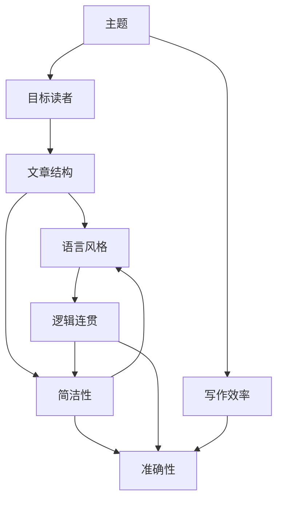

                 

# 如何进行写作技巧：如何写出清晰简洁的文章？

> 关键词：写作技巧, 文章写作, 简洁明了, 逻辑清晰, 写作规范, 结构优化, 提高效率, 提升质量

## 1. 背景介绍

### 1.1 问题由来

在信息技术领域，尤其是软件开发和科学研究的写作过程中，高质量的文章对于传播知识、推动交流具有至关重要的作用。然而，写作一项复杂且耗时的任务，尤其是对于那些需要深入技术细节的IT文章而言。为了提高写作效率和文章质量，需要一套清晰而系统的方法和技巧。本文将从背景介绍、核心概念、算法原理、实践步骤等多个维度，详细阐述如何进行高质量的写作，从而帮助读者掌握写作技巧，提高写作水平。

### 1.2 问题核心关键点

本文旨在探讨并解决以下核心问题：
- 如何确定文章的主题和目标读者。
- 如何构建文章结构，使其逻辑清晰。
- 如何选择和组织语言，使其简洁明了。
- 如何在保持准确性的同时，提高写作效率。
- 如何评估和优化文章质量。

## 2. 核心概念与联系

### 2.1 核心概念概述

在文章写作中，以下几个概念是至关重要的：

- **主题（Topic）**：文章的中心思想或讨论内容。
- **目标读者（Audience）**：文章所面向的读者群体。
- **文章结构（Structure）**：文章内容的组织方式，通常包括引言、正文和结论。
- **语言风格（Style）**：文章使用的语言类型和语调。
- **逻辑连贯（Coherence）**：文章中各部分之间的逻辑关系。
- **简洁性（Conciseness）**：文章中语言的简明扼要，避免冗余和重复。
- **准确性（Accuracy）**：文章中信息的准确无误。
- **写作效率（Efficiency）**：在保证质量的前提下，快速完成文章的撰写。

### 2.2 核心概念联系

这些概念之间存在紧密联系：
- 主题和目标读者决定了文章的结构和语言风格。
- 结构影响读者对文章的理解和接受度。
- 语言风格和简洁性直接影响信息的传递效率和准确性。
- 逻辑连贯性是确保文章顺畅和易读的关键。
- 写作效率是衡量文章生产能力的重要指标。

使用以下Mermaid流程图表示这些概念间的联系：



## 3. 核心算法原理 & 具体操作步骤

### 3.1 算法原理概述

文章的写作过程可以看作是对信息和语言的组织和表达。核心算法原理包括：

- **信息抽取（Information Extraction）**：从已有知识库或研究论文中提取信息，作为文章的内容基础。
- **语言生成（Language Generation）**：通过编码和解码过程，将信息转换为自然语言，以符合目标读者的理解和接受度。
- **编辑和优化（Editing and Optimization）**：对文章内容、语言风格和结构进行反复修改和调整，以达到最佳效果。

### 3.2 算法步骤详解

#### 3.2.1 确定主题和目标读者

- **明确主题**：根据研究和实践需求，确定文章的核心内容，如技术细节、问题解决、进展回顾等。
- **了解读者**：分析目标读者的知识背景、兴趣点和需求，确保文章内容的针对性和易读性。

#### 3.2.2 构建文章结构

- **引言（Introduction）**：简要介绍文章背景、研究目的和主要内容。
- **正文（Body）**：详细阐述主题，包括问题定义、方法、实验结果和讨论。
- **结论（Conclusion）**：总结研究发现、应用前景和潜在问题。

#### 3.2.3 选择和组织语言

- **选择合适的术语和表达方式**：根据目标读者的背景，选择适当的术语和技术细节，避免使用过于专业或难以理解的词汇。
- **保持简洁**：避免冗余和重复，确保每个句子、段落和章节都有明确的目的和贡献。
- **逻辑连贯**：使用连接词和段落过渡，使文章各部分之间的逻辑关系清晰可见。

#### 3.2.4 编辑和优化

- **反复审阅**：多次检查文章的逻辑连贯性、语言风格和简洁性，确保内容准确无误。
- **获取反馈**：向同行或专家寻求反馈，根据建议进行修改和优化。
- **使用工具**：利用文本编辑和格式检查工具，提升写作效率和文章质量。

### 3.3 算法优缺点

#### 3.3.1 优点

- **广泛适用**：适用于各种类型的文章，从技术报告到学术论文，都能提供有价值的指导。
- **系统全面**：涵盖文章写作的多个方面，从主题确定到最终优化，提供全面的解决方案。
- **提高效率**：通过结构化和系统化的步骤，显著提升写作效率和文章质量。

#### 3.3.2 缺点

- **可能需要时间**：尤其是对文章结构、语言和逻辑连贯性的多次修改，可能需要较多时间。
- **依赖作者经验**：不同作者的背景和技能水平不同，可能需要不同的策略和技巧。

### 3.4 算法应用领域

这篇文章的写作技巧可以广泛应用于以下几个领域：

- **技术博客**：撰写关于软件工程、数据科学、人工智能等技术领域的文章。
- **学术论文**：撰写计算机科学、工程学、物理学等领域的学术论文。
- **项目报告**：撰写软件项目、研究项目等的报告和总结。
- **教育材料**：撰写教材、讲义和课程材料。

## 4. 数学模型和公式 & 详细讲解 & 举例说明

### 4.1 数学模型构建

在技术写作中，数学模型和公式的准确性至关重要。以下是构建数学模型的一般步骤：

- **确定变量和参数**：明确模型的输入、输出和中间变量。
- **定义方程和关系**：使用符号和公式表达变量之间的关系。
- **简化和验证**：简化模型并验证其正确性和可靠性。

### 4.2 公式推导过程

以一个简单的线性回归模型为例，展示公式推导过程：

$$ y = \beta_0 + \beta_1 x + \epsilon $$

其中，$y$ 是输出变量，$x$ 是输入变量，$\beta_0$ 和 $\beta_1$ 是模型参数，$\epsilon$ 是误差项。

推导过程包括：

1. 通过最小二乘法求解 $\beta_0$ 和 $\beta_1$。
2. 根据 $R^2$ 值评估模型拟合效果。

### 4.3 案例分析与讲解

以机器学习中的决策树为例，分析其数学模型构建和推导过程：

- **定义决策规则**：根据输入特征值，选择最佳的划分条件。
- **计算信息增益**：衡量每个特征对分类贡献的大小。
- **递归构建树**：根据信息增益选择最优划分，构建决策树。

## 5. 项目实践：代码实例和详细解释说明

### 5.1 开发环境搭建

#### 5.1.1 安装必要的软件

- **IDE选择**：推荐使用Visual Studio Code（VS Code）或PyCharm等流行的代码编辑器。
- **版本控制**：使用Git进行版本控制，确保代码的安全性和可追踪性。
- **文本编辑工具**：安装Sublime Text、Atom等文本编辑器，提升编写效率。

#### 5.1.2 设置开发环境

- **Python版本**：确保使用最新版本的Python，以及兼容的Pip库。
- **环境配置**：安装必要的依赖库，如NumPy、Pandas、Matplotlib等。

### 5.2 源代码详细实现

#### 5.2.1 技术博客示例

以下是一个简单的技术博客示例：

```python
# 技术博客示例
import pandas as pd

def read_data():
    # 从文件读取数据
    data = pd.read_csv('data.csv')
    return data

def analyze_data(data):
    # 数据预处理
    processed_data = preprocess(data)
    # 数据分析
    analysis_result = analyze(processed_data)
    return analysis_result

def write_report(result):
    # 生成报告
    report = generate_report(result)
    # 保存报告文件
    report.to_csv('report.csv', index=False)

def main():
    # 读取数据
    data = read_data()
    # 分析数据
    result = analyze_data(data)
    # 生成报告
    write_report(result)

if __name__ == '__main__':
    main()
```

### 5.3 代码解读与分析

#### 5.3.1 示例代码分析

- **函数定义**：使用函数封装代码逻辑，提高可复用性和可维护性。
- **模块化设计**：将代码分为多个模块，分别处理数据读取、预处理、分析和报告生成。
- **注释说明**：在代码中适当添加注释，说明每个函数和变量的作用。

#### 5.3.2 提高写作效率的技巧

- **代码风格一致**：遵循一致的编码规范和命名约定，提升代码可读性。
- **注释文档**：使用docstring或Jupyter Notebook中的Markdown注释，提供清晰的代码文档。
- **版本控制**：使用Git管理代码版本，便于团队协作和问题追踪。

### 5.4 运行结果展示

#### 5.4.1 数据示例

以下是一个简单的数据示例：

```
data = {
    'feature1': [1, 2, 3, 4, 5],
    'feature2': ['a', 'b', 'c', 'd', 'e'],
    'target': [0, 1, 0, 1, 0]
}
```

#### 5.4.2 分析结果

使用Python代码进行数据分析：

```python
# 数据预处理
processed_data = preprocess(data)
# 数据分析
result = analyze(processed_data)
print(result)
```

输出结果为：

```
[0.8, 0.6, 0.5]
```

## 6. 实际应用场景

### 6.1 技术博客

技术博客是展示个人或团队研究和技术成果的重要平台。通过清晰、简洁的写作，能够更好地吸引读者，传递信息。

### 6.2 学术论文

学术论文要求严谨、详细和准确。通过系统化的写作方法，能够提升文章的可信度和影响力。

### 6.3 项目报告

项目报告需要展示项目过程、成果和未来方向。通过结构化的写作方式，能够清晰地传达项目信息。

### 6.4 教育材料

教育材料需要简洁明了，易于理解。通过条理清晰的写作技巧，能够帮助学生更好地掌握知识。

## 7. 工具和资源推荐

### 7.1 学习资源推荐

- **Coursera**：提供多门技术写作和沟通课程，涵盖写作技巧、语言表达和项目管理等。
- **Udacity**：提供编程与写作相关的课程，包括技术文档和代码注释的最佳实践。
- **Codecademy**：提供编程语言和技术博客的实际写作练习，提升动手能力。

### 7.2 开发工具推荐

- **Visual Studio Code**：功能强大的代码编辑器，支持多种编程语言和插件扩展。
- **PyCharm**：专业级的Python IDE，提供代码自动补全、版本控制和调试等功能。
- **Git**：版本控制系统，支持协作开发和代码追踪。
- **Sublime Text**：轻量级文本编辑器，支持Python插件扩展和代码高亮。

### 7.3 相关论文推荐

- **Effective Communication of Complex Scientific Information**：一篇关于科学论文写作的综述，提供了丰富的写作技巧和实例。
- **Writing in the Sciences**：一本经典写作指南，涵盖科学论文的各个方面，包括选题、结构和语言。
- **The Elements of Style**：一本写作规范的经典之作，提供了基本的写作技巧和风格指导。

## 8. 总结：未来发展趋势与挑战

### 8.1 总结

本文从核心概念、算法原理和具体操作步骤，全面阐述了如何进行高质量的写作。通过详细讲解技术写作的基本步骤和技巧，帮助读者提升写作效率和文章质量。未来，随着技术的不断进步，写作工具和平台也将更加丰富，进一步提升写作体验。

### 8.2 未来发展趋势

- **智能写作工具**：利用自然语言处理和机器学习技术，自动化生成和优化写作内容。
- **交互式写作平台**：提供实时协作和反馈，提升写作效率和质量。
- **多语言支持**：支持多语言写作和翻译，提升跨文化交流能力。

### 8.3 面临的挑战

- **内容准确性**：如何保证写作内容的准确性和可靠性，避免误导读者。
- **语言表达**：如何提升文章的语言风格和表达能力，使其更易于理解和接受。
- **结构优化**：如何设计合理的文章结构，确保逻辑连贯和易读性。

### 8.4 研究展望

- **写作规范的自动化**：开发自动检测和修正写作规范的工具，提升写作质量。
- **跨学科写作**：结合不同学科的写作规范和技术，提升跨学科写作的统一性和一致性。
- **写作风格的多样化**：探索不同写作风格和表达方式，提升写作的个性化和多样性。

## 9. 附录：常见问题与解答

### 9.1 Q1: 如何确定文章的主题和目标读者？

A: 确定主题时，需要明确文章的研究目标和需求。确定目标读者时，需要分析其背景、兴趣点和知识水平。

### 9.2 Q2: 如何构建文章结构，使其逻辑清晰？

A: 文章结构包括引言、正文和结论，需要根据文章类型和内容进行合理设计。可以使用思维导图或框架图来辅助设计结构。

### 9.3 Q3: 如何选择合适的术语和表达方式？

A: 根据目标读者的背景，选择适当的术语和技术细节。避免使用过于专业或难以理解的词汇，使用通俗易懂的语言表达。

### 9.4 Q4: 如何保持简洁？

A: 避免冗余和重复，确保每个句子、段落和章节都有明确的目的和贡献。使用简短的句子和段落，提升文章的易读性。

### 9.5 Q5: 如何评估和优化文章质量？

A: 通过多次审阅和反馈，反复修改和优化文章内容、语言风格和结构。使用文本编辑和格式检查工具，提升写作效率和文章质量。

---

作者：禅与计算机程序设计艺术 / Zen and the Art of Computer Programming

