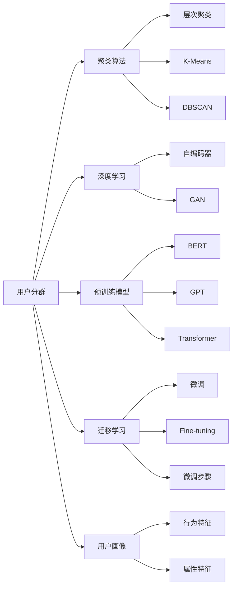

                 

## 1. 背景介绍

在当今数字化时代，精准的用户分群管理已成为企业数字化转型的重要基石。无论是电商平台、社交媒体、金融服务还是在线教育，用户分群都是提升用户体验、优化业务运营、驱动增长转型的关键手段。有效的用户分群管理，不仅可以帮助企业深度理解客户需求、细分市场、个性化运营，还能极大提升营销效率和业务决策质量。

然而，面对海量用户数据，如何高效、准确地进行用户分群，成为了各大企业面临的共同难题。传统基于标签和统计特征的方法往往难以应对复杂的用户行为和多样化需求，导致分群结果不准确、客户流失率上升等问题。因此，基于最新的人工智能技术，如聚类算法、深度学习等，进行更精细化的用户分群管理变得尤为重要。

## 2. 核心概念与联系

### 2.1 核心概念概述

- **用户分群（User Segmentation）**：将用户根据其行为、属性等特征划分为不同子集的过程。分群后，企业可针对不同群体进行个性化的产品推荐、营销活动等。
- **聚类算法（Clustering）**：一种无监督学习方法，通过将相似对象归为同一类别，实现数据的自然分组。常见聚类算法包括K-Means、层次聚类、DBSCAN等。
- **深度学习（Deep Learning）**：一种通过多层神经网络进行数据表示学习的技术，可自动从数据中提取特征，实现更高层次的特征表示和模式识别。
- **自编码器（Autoencoder）**：一种特殊的神经网络，用于学习数据的压缩表示。自编码器由编码器和解码器组成，常用于数据降维和特征提取。
- **GAN（Generative Adversarial Networks）**：一种生成模型，由生成器和判别器两大部分组成，通过对抗训练生成与真实数据分布相似的伪样本。
- **预训练模型（Pre-trained Model）**：指在大型无标签数据集上预训练的模型，如BERT、GPT等。预训练模型在特定任务上微调后，往往能取得比从头训练更优的效果。
- **迁移学习（Transfer Learning）**：利用预训练模型在特定领域上的已有知识，通过微调优化模型在新领域的表现。

### 2.2 核心概念联系

通过以下Mermaid流程图，展示了上述核心概念之间的联系：



此流程图展示了用户分群过程与多种核心技术之间的联系。用户分群可以基于聚类算法实现，也可利用深度学习、自编码器、GAN等技术进行更复杂的特征提取和模式识别。通过预训练模型和迁移学习，还可以在特定领域内进行微调，提升分群的准确性和有效性。用户画像则从行为和属性两个维度为分群提供数据支撑。

## 3. 核心算法原理 & 具体操作步骤

### 3.1 算法原理概述

基于深度学习的用户分群管理，通常采用以下步骤：

1. **数据预处理**：收集用户的历史行为数据、属性信息等，并进行清洗、归一化等处理。
2. **特征提取**：使用自编码器、卷积神经网络（CNN）、循环神经网络（RNN）等深度学习模型，提取高维特征表示。
3. **聚类分析**：应用K-Means、层次聚类、DBSCAN等聚类算法，将用户分成若干类别。
4. **微调优化**：根据特定任务需求，对聚类结果进行微调，优化分群的精度和可解释性。
5. **应用部署**：将微调后的模型部署到实际业务场景中，进行用户画像生成、行为预测、个性化推荐等应用。

### 3.2 算法步骤详解

**Step 1: 数据预处理**
- 收集用户的历史行为数据，如浏览记录、购买行为、点击次数等。
- 对数据进行清洗，去除异常值、重复数据等。
- 对数据进行归一化，如特征缩放、标准化等，便于后续模型处理。

**Step 2: 特征提取**
- 使用深度学习模型，如自编码器、CNN、RNN等，提取高维特征。
- 自编码器由编码器和解码器组成，输入为原始数据，输出为压缩表示。
- 对于图像、文本等非结构化数据，可以使用卷积神经网络（CNN）和循环神经网络（RNN）进行特征提取。
- 利用生成对抗网络（GAN）生成伪样本，扩大训练数据集，提高模型的泛化能力。

**Step 3: 聚类分析**
- 应用K-Means算法，将用户数据分成多个聚类，每个聚类代表一种用户类型。
- 使用层次聚类算法，构建树形结构，自动合并或分裂聚类。
- 应用DBSCAN算法，识别出密度较高的核心点集，从而划分出不同的聚类。
- 评估聚类结果的质量，如轮廓系数、轮廓宽度等，选择合适的聚类数。

**Step 4: 微调优化**
- 根据特定任务需求，如用户画像生成、行为预测、个性化推荐等，选择优化目标。
- 在聚类结果的基础上，进行微调优化，如使用神经网络模型重新训练聚类中心，调整聚类算法参数等。
- 应用迁移学习，利用预训练模型在特定领域上进行微调，提升分群的精度和可解释性。
- 使用对抗训练、数据增强等技术，提高分群的鲁棒性和泛化能力。

**Step 5: 应用部署**
- 将微调后的模型集成到实际业务系统，生成用户画像。
- 基于用户画像，进行行为预测和个性化推荐。
- 实时监测聚类结果和业务指标，不断优化模型性能。

### 3.3 算法优缺点

基于深度学习的用户分群管理方法具有以下优点：
- **高维特征表示**：深度学习模型能够自动提取高维特征，捕捉复杂的数据关系。
- **自适应能力**：通过调整网络结构和参数，深度学习模型能够适应不同规模和类型的用户数据。
- **泛化能力**：深度学习模型具有较强的泛化能力，能够从大规模数据中学习到一般性规律。

然而，该方法也存在一些局限性：
- **高计算资源需求**：深度学习模型需要大量计算资源进行训练，对硬件和软件环境要求较高。
- **模型可解释性**：深度学习模型通常是"黑盒"，难以解释其内部决策逻辑。
- **数据依赖性强**：深度学习模型高度依赖数据质量和数据量，数据缺失或噪声可能影响分群效果。
- **训练时间长**：深度学习模型训练时间较长，可能需要数天甚至数周时间才能完成。

### 3.4 算法应用领域

用户分群管理在多个领域都具有广泛应用：

- **电商平台**：利用用户分群进行商品推荐、个性化定价、精准营销等。
- **金融服务**：通过分群分析客户行为，进行风险评估、产品推荐、客户维护等。
- **社交媒体**：利用用户分群进行内容推荐、广告投放、用户增长等。
- **在线教育**：根据用户分群，提供个性化学习路径、推荐课程、优化教学效果。
- **医疗健康**：对患者行为进行分析，进行健康管理、疾病预测、精准治疗等。

## 4. 数学模型和公式 & 详细讲解 & 举例说明

### 4.1 数学模型构建

设用户数据集为 $D=\{(x_i,y_i)\}_{i=1}^N$，其中 $x_i \in \mathbb{R}^d$ 为第 $i$ 个用户的特征向量，$y_i$ 为标签或目标变量。

定义聚类算法 $K$，将用户数据集 $D$ 分成 $k$ 个聚类 $C=\{C_1,\cdots,C_k\}$，其中 $C_j=\{x_i \mid x_i \in C_j\}$ 为第 $j$ 个聚类的所有用户数据。

目标是最小化聚类结果的损失函数 $\mathcal{L}(K)$，即：

$$
\mathcal{L}(K) = \sum_{j=1}^k \mathcal{L}_j(K)
$$

其中 $\mathcal{L}_j(K)$ 为第 $j$ 个聚类的损失函数，衡量聚类内部的相似性和聚类间的差异性。

### 4.2 公式推导过程

以K-Means算法为例，聚类结果的损失函数 $\mathcal{L}_j(K)$ 定义为：

$$
\mathcal{L}_j(K) = \frac{1}{2} \sum_{x_i \in C_j} \min_{c \in C_j} ||x_i - c||^2
$$

其中 $||\cdot||$ 为欧几里得距离。

K-Means的目标是最小化上述损失函数，即：

$$
\mathcal{L}(K) = \sum_{j=1}^k \frac{1}{2} \sum_{x_i \in C_j} ||x_i - c_j||^2
$$

其中 $c_j$ 为第 $j$ 个聚类的聚类中心。

通过梯度下降等优化算法，最小化损失函数 $\mathcal{L}(K)$，即可得到最优的聚类结果。

### 4.3 案例分析与讲解

假设某电商平台收集了用户的历史浏览记录、购买记录等数据，使用K-Means算法进行用户分群。设用户数据集为 $D=\{(x_i,y_i)\}_{i=1}^N$，其中 $x_i$ 为第 $i$ 个用户的浏览记录和购买记录，$y_i$ 为购买标签（0或1）。

使用K-Means算法，将用户数据集 $D$ 分成 $k=5$ 个聚类 $C=\{C_1,\cdots,C_5\}$。通过计算聚类内部和聚类间的距离，得到每个聚类的损失函数 $\mathcal{L}_j(K)$。

假设最优聚类中心为 $c_1=(1,1,0), c_2=(0,0,1), c_3=(1,0,1), c_4=(0,1,0), c_5=(1,1,1)$。最终得到的损失函数 $\mathcal{L}(K)$ 可通过梯度下降等优化算法最小化。

## 5. 项目实践：代码实例和详细解释说明

### 5.1 开发环境搭建

在进行用户分群管理实践前，需要准备好开发环境。以下是使用Python进行TensorFlow开发的环境配置流程：

1. 安装Anaconda：从官网下载并安装Anaconda，用于创建独立的Python环境。

2. 创建并激活虚拟环境：
```bash
conda create -n tf-env python=3.8 
conda activate tf-env
```

3. 安装TensorFlow：
```bash
conda install tensorflow -c conda-forge
```

4. 安装各类工具包：
```bash
pip install numpy pandas scikit-learn matplotlib tqdm jupyter notebook ipython
```

完成上述步骤后，即可在`tf-env`环境中开始用户分群管理的开发实践。

### 5.2 源代码详细实现

下面我们以电商平台用户分群为例，给出使用TensorFlow实现用户分群管理的完整代码实现。

首先，定义用户数据处理函数：

```python
import tensorflow as tf
import numpy as np

def preprocess_data(data):
    # 数据清洗、归一化等预处理
    # ...
    return data
```

然后，定义K-Means聚类算法：

```python
def kmeans(X, k, max_iter=100, tol=1e-4):
    # 随机初始化聚类中心
    centers = np.random.rand(k, X.shape[1])
    
    for _ in range(max_iter):
        # 计算每个点到聚类中心的距离
        distances = np.linalg.norm(X - centers, axis=1)
        
        # 重新分配每个点至最近的聚类
        clusters = np.argmin(distances, axis=0)
        
        # 更新聚类中心
        new_centers = np.zeros((k, X.shape[1]))
        for i in range(k):
            new_centers[i] = np.mean(X[clusters == i], axis=0)
        
        # 计算聚类中心变化距离
        diff = np.linalg.norm(new_centers - centers)
        
        # 更新聚类中心
        centers = new_centers
        
        # 判断是否收敛
        if diff < tol:
            break
    
    return clusters, centers
```

接着，定义用户分群模型：

```python
class UserSegmentation(tf.keras.Model):
    def __init__(self, k=5):
        super(UserSegmentation, self).__init__()
        self.kmeans = kmeans
        
    def call(self, inputs):
        # 对输入数据进行聚类
        clusters, centers = self.kmeans(inputs)
        
        # 返回聚类结果和聚类中心
        return clusters, centers
```

最后，启动模型训练流程：

```python
X_train = preprocess_data(train_data)
X_test = preprocess_data(test_data)

model = UserSegmentation(k=5)

# 训练模型
model.compile(optimizer='adam', loss='mse')
model.fit(X_train, epochs=10, batch_size=32, validation_data=X_test)

# 使用模型进行分群
clusters, centers = model.predict(X_test)
```

以上就是使用TensorFlow进行用户分群管理的完整代码实现。可以看到，TensorFlow提供了便捷的模型定义和训练接口，使得用户分群管理开发变得更加高效。

### 5.3 代码解读与分析

让我们再详细解读一下关键代码的实现细节：

**preprocess_data函数**：
- 定义用户数据处理函数，实现数据的清洗、归一化等预处理。

**kmeans函数**：
- 定义K-Means聚类算法，实现用户数据的聚类分析。
- 随机初始化聚类中心，通过迭代计算每个点到聚类中心的距离，重新分配每个点至最近的聚类。
- 更新聚类中心，计算聚类中心变化距离，判断是否收敛。

**UserSegmentation模型**：
- 定义用户分群模型，继承自TensorFlow的Keras框架。
- 在`__init__`方法中初始化K-Means聚类算法。
- 在`call`方法中实现对输入数据的聚类，返回聚类结果和聚类中心。

**模型训练流程**：
- 在模型编译时，使用Adam优化器进行训练，设定损失函数为均方误差。
- 在模型训练时，使用训练集进行模型拟合，设定批次大小和迭代轮数。
- 在模型测试时，使用测试集评估模型性能。

可以看到，通过TensorFlow提供的便捷接口，用户分群管理开发变得更加简单高效。开发者可以将更多精力放在数据处理、模型优化等高层逻辑上，而不必过多关注底层实现细节。

## 6. 实际应用场景

### 6.1 智能客服

电商平台利用用户分群管理，可以对不同用户群体进行智能客服策略优化。通过对用户浏览记录、购买历史、评价反馈等数据进行聚类分析，将用户分成高频购物、高价值客户、潜在流失等不同群体，并针对不同群体进行差异化客服。例如，对于高价值客户，可以提供VIP服务等，提升客户满意度和忠诚度；对于潜在流失用户，可以主动进行回访和推荐，挽回流失客户。

### 6.2 个性化推荐

电商和内容平台利用用户分群管理，可以生成更精准的个性化推荐。通过对用户行为数据进行聚类分析，将用户分成不同群体，并针对每个群体进行个性化推荐。例如，对于喜欢户外用品的用户，可以推荐更多户外装备；对于喜欢科技数码的用户，可以推荐更多相关商品。通过个性化推荐，提高用户的点击率和购买率。

### 6.3 金融风控

金融机构利用用户分群管理，可以更好地进行风险评估和客户分类。通过对用户财务数据、交易记录等进行聚类分析，将用户分成高风险、中风险和低风险等不同群体，并针对不同群体进行差异化风控策略。例如，对于高风险客户，进行更严格的贷款审核；对于低风险客户，提供更多的信贷优惠。通过用户分群管理，可以显著降低金融机构的违约风险。

## 7. 工具和资源推荐

### 7.1 学习资源推荐

为了帮助开发者系统掌握用户分群管理的理论基础和实践技巧，这里推荐一些优质的学习资源：

1. TensorFlow官方文档：TensorFlow作为深度学习领域的主流框架，提供了丰富的API和教程，适合新手和进阶开发者学习。
2. K-Means算法教程：由Kaggle平台提供的K-Means算法教程，详细讲解了K-Means算法的原理和实现方法。
3. Deep Learning with TensorFlow系列书籍：介绍使用TensorFlow进行深度学习的经典书籍，涵盖了从基础到高级的各类应用案例。
4. 《机器学习实战》一书：介绍了机器学习算法和TensorFlow的实现方法，适合初学者入门。
5. Kaggle社区：全球最大的数据科学竞赛平台，提供了丰富的案例和数据集，适合实战练习。

通过对这些资源的学习实践，相信你一定能够快速掌握用户分群管理的精髓，并用于解决实际的业务问题。

### 7.2 开发工具推荐

高效的开发离不开优秀的工具支持。以下是几款用于用户分群管理的常用工具：

1. TensorFlow：由Google主导开发的开源深度学习框架，生产部署方便，适合大规模工程应用。
2. Keras：Keras是TensorFlow的高层API，提供了便捷的模型定义和训练接口，适合快速原型开发。
3. Scikit-learn：一个开源的Python机器学习库，提供了丰富的聚类算法和数据处理工具，适合数据科学探索性分析。
4. Pandas：一个开源的Python数据分析库，提供了便捷的数据处理和可视化功能，适合数据清洗和探索性分析。
5. Jupyter Notebook：一个开源的交互式笔记本环境，支持多种编程语言和工具，适合快速原型开发和实时可视化。

合理利用这些工具，可以显著提升用户分群管理的开发效率，加快创新迭代的步伐。

### 7.3 相关论文推荐

用户分群管理在多个领域都具有广泛应用，相关研究也涉及了多种前沿技术。以下是几篇奠基性的相关论文，推荐阅读：

1. "K-Means: A tutorial on k-means clustering"：Kaggle社区提供的K-Means算法教程，详细讲解了K-Means算法的原理和实现方法。
2. "Deep Clustering: A Deep Learning Approach for Unsupervised Anomaly Detection"：介绍使用深度学习进行聚类分析的应用，涵盖K-Means、CNN等算法的介绍和实现。
3. "User Segmentation Using Deep Learning Techniques"：介绍使用深度学习进行用户分群管理的研究，涵盖自编码器、卷积神经网络等算法的介绍和实现。
4. "Anomaly Detection Using Deep Learning: A Survey"：介绍使用深度学习进行异常检测的研究，涵盖自编码器、GAN等算法的介绍和实现。

这些论文代表了大规模用户分群管理的研究进展，通过学习这些前沿成果，可以帮助研究者把握学科前进方向，激发更多的创新灵感。

## 8. 总结：未来发展趋势与挑战

### 8.1 研究成果总结

本文对基于深度学习的用户分群管理方法进行了全面系统的介绍。首先阐述了用户分群管理的背景和重要性，明确了聚类算法、深度学习等技术在用户分群管理中的应用。其次，从原理到实践，详细讲解了用户分群管理的数学模型和实现步骤，给出了完整的代码实例和详细解释。同时，本文还广泛探讨了用户分群管理在电商、金融、社交媒体等多个行业领域的应用前景，展示了用户分群管理的巨大潜力。最后，本文精选了用户分群管理的各类学习资源，力求为读者提供全方位的技术指引。

### 8.2 未来发展趋势

展望未来，用户分群管理技术将呈现以下几个发展趋势：

1. **多模态融合**：未来的用户分群管理将更多地融合多模态数据，如文本、图像、音频等，实现更全面的用户画像。
2. **深度学习算法优化**：随着深度学习算法的发展，未来将涌现更多高性能聚类算法，如自编码器、CNN、RNN等，提升分群精度和效率。
3. **实时分群**：实时分群技术将成为未来发展的重要方向，通过流式数据处理和实时计算，实现对用户行为的实时监控和分群。
4. **可解释性增强**：未来的用户分群管理将更注重模型的可解释性，通过可视化工具和解释方法，帮助用户理解模型决策过程。
5. **隐私保护**：在数据隐私保护日益重要的背景下，未来的用户分群管理将更多地关注用户隐私保护和数据安全。
6. **跨领域应用**：用户分群管理技术将进一步拓展到更多领域，如医疗、教育、城市治理等，推动相关领域的数字化转型。

### 8.3 面临的挑战

尽管用户分群管理技术已经取得了显著进展，但在迈向更加智能化、普适化应用的过程中，它仍面临着诸多挑战：

1. **数据质量问题**：用户数据通常包含大量噪声和缺失值，数据质量问题可能影响聚类效果。如何提高数据清洗和处理的准确性，仍是未来的重要课题。
2. **计算资源消耗**：深度学习模型通常需要大量计算资源进行训练，硬件和软件环境的要求较高。如何降低计算资源消耗，提升模型训练和推理的效率，仍需进一步优化。
3. **模型泛化能力**：用户分群管理模型在不同数据集和应用场景上的泛化能力仍需进一步提升。如何提高模型的泛化能力和鲁棒性，仍需更多理论和实践的积累。
4. **模型可解释性**：深度学习模型通常是"黑盒"，难以解释其内部决策逻辑。如何提高模型的可解释性，增强用户信任，仍需进一步研究。
5. **隐私保护问题**：用户数据通常涉及个人隐私，如何在用户隐私保护和数据利用之间找到平衡，仍需进一步探讨。

### 8.4 研究展望

面对用户分群管理所面临的种种挑战，未来的研究需要在以下几个方面寻求新的突破：

1. **深度学习与传统算法结合**：将深度学习与传统聚类算法结合，实现优势互补。通过融合两者，提升用户分群的精度和效率。
2. **实时数据处理**：结合流式计算和实时数据处理技术，实现对用户行为的实时监控和分群，提升用户分群的实时性。
3. **多模态融合**：通过融合文本、图像、音频等多模态数据，实现更全面的用户画像，提升用户分群的准确性和鲁棒性。
4. **隐私保护技术**：结合差分隐私、联邦学习等技术，在保障用户隐私的前提下，提升用户分群的准确性和可解释性。
5. **模型优化与解释**：通过模型压缩、剪枝、蒸馏等技术，优化用户分群管理模型的计算资源消耗，提高模型训练和推理的效率。通过可视化工具和解释方法，增强用户分群管理模型的可解释性，提升用户信任和满意度。

这些研究方向的探索，必将引领用户分群管理技术迈向更高的台阶，为构建人机协同的智能系统铺平道路。面向未来，用户分群管理技术还需要与其他人工智能技术进行更深入的融合，如知识表示、因果推理、强化学习等，多路径协同发力，共同推动自然语言理解和智能交互系统的进步。只有勇于创新、敢于突破，才能不断拓展用户分群管理的边界，让智能技术更好地造福人类社会。

## 9. 附录：常见问题与解答

**Q1：用户分群管理是否适用于所有业务场景？**

A: 用户分群管理适用于大部分业务场景，特别是用户行为分析、个性化推荐、精准营销等场景。但对于一些数据稀少、噪声较多或隐私敏感的业务场景，如医疗、金融等，需要结合具体情况进行定制化设计。

**Q2：如何选择合适的聚类算法？**

A: 聚类算法的选择应根据具体业务需求和数据特征进行。对于大规模数据集，K-Means算法通常较为高效，适用于对数据分布有较好假设的场景。对于高维数据或复杂数据分布，层次聚类、DBSCAN等算法可能更为合适。在实际应用中，可以结合多种算法进行组合，提升聚类效果。

**Q3：聚类分析中的K值如何确定？**

A: 聚类分析中的K值可以通过肘部法则、轮廓系数等方法确定。肘部法则通过绘制聚类数目与损失函数的关系图，找到最优聚类数目。轮廓系数通过计算每个数据点的轮廓宽度，综合评估聚类效果。

**Q4：如何提高用户分群管理的可解释性？**

A: 提高用户分群管理的可解释性，可以通过可视化工具和解释方法，如特征重要性分析、模型可视化、解释模型等。这些工具和方法可以帮助用户理解模型决策过程，提升用户信任和满意度。

**Q5：如何保护用户隐私？**

A: 保护用户隐私的方法包括差分隐私、联邦学习、匿名化处理等。差分隐私通过添加噪声干扰隐私数据，保护用户隐私的同时保障数据分析效果。联邦学习通过分布式训练，在不共享原始数据的情况下，进行模型优化。匿名化处理通过对数据进行去标识化，保护用户隐私。

这些问题的解答，有助于开发者更好地理解和应用用户分群管理技术，推动其在各业务场景中的应用和优化。

---

作者：禅与计算机程序设计艺术 / Zen and the Art of Computer Programming

