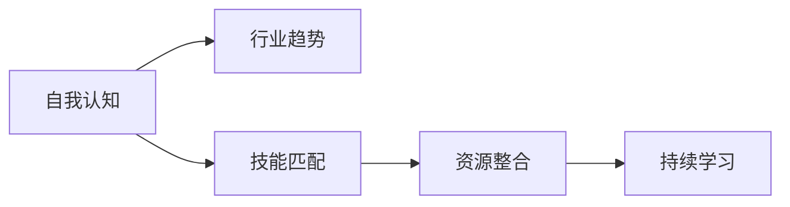

                 

## 1. 背景介绍

### 1.1 问题由来

在当今快速发展的技术领域，职业规划变得愈发重要。技术行业正面临着日新月异的变革，从人工智能到区块链，从云计算到量子计算，新兴技术层出不穷。技术从业者必须不断学习，才能跟上时代的步伐。然而，由于新技术的涌现速度和复杂性，技术从业者往往感到难以把握自己的职业方向。这导致许多人在技术领域迷失，无法找到适合自己的职业道路。

### 1.2 问题核心关键点

本文将深入探讨职业规划的核心要素，帮助技术从业者找到适合自己的职业道路。我们将从以下几个关键点出发：

1. **自我认知**：了解自己的兴趣、技能和职业价值观。
2. **行业趋势**：理解当前和未来的行业发展方向。
3. **技能匹配**：将自己的技能与行业需求进行匹配。
4. **资源整合**：利用各种资源进行职业发展。
5. **持续学习**：保持对新技术的敏感度和学习能力。

通过这些关键点，我们旨在为技术从业者提供系统的职业规划指导。

### 1.3 问题研究意义

掌握职业规划技能对技术从业者至关重要。它不仅可以帮助个人明确职业目标，还可以提升职业满意度和成就感。此外，随着技术领域的不断变化，良好的职业规划能力能够帮助从业者灵活应对新挑战，把握新机会，保持竞争优势。

## 2. 核心概念与联系

### 2.1 核心概念概述

职业规划是一个系统性的过程，涉及对自身情况的深入了解、行业趋势的把握以及技能的提升。以下是职业规划过程中涉及的核心概念：

- **自我认知**：包括兴趣、技能、价值观、职业倾向等。
- **行业趋势**：技术领域的最新发展和未来方向。
- **技能匹配**：将自身技能与行业需求相匹配。
- **资源整合**：包括教育资源、技术社区、导师网络等。
- **持续学习**：不断学习新知识、新技能，保持竞争力。

这些概念相互联系，共同构成职业规划的框架。下面，我们将通过一个Mermaid流程图来展示这些概念之间的关系：



这个流程图展示了职业规划过程中不同概念的相互作用关系。

## 3. 核心算法原理 & 具体操作步骤

### 3.1 算法原理概述

职业规划的核心算法原理主要围绕自我认知、技能匹配和持续学习展开。通过深入了解自身的兴趣和技能，将之与行业需求进行匹配，并不断学习和提升技能，以适应行业趋势的变化。

### 3.2 算法步骤详解

以下是职业规划的详细步骤：

#### 步骤1：自我认知
1. **评估兴趣和技能**：使用职业测评工具如Myers-Briggs Type Indicator (MBTI)、霍兰德职业兴趣测评等，了解自己的兴趣和技能倾向。
2. **评估职业价值观**：考虑工作环境、薪资、成长机会等因素，确定自己的职业价值观。
3. **记录职业倾向**：整理自己的兴趣、技能和价值观，形成清晰的职业倾向。

#### 步骤2：了解行业趋势
1. **研究行业动态**：关注行业报告、新闻、技术博客等，了解当前和未来的技术趋势。
2. **参加行业活动**：参加技术会议、研讨会、黑客马拉松等，与行业专家交流，获取第一手信息。
3. **跟踪技术发展**：订阅技术期刊、参加在线课程，学习最新的技术知识和工具。

#### 步骤3：技能匹配
1. **分析行业需求**：通过招聘网站、技术社区、行业报告等，了解各岗位的技能要求。
2. **评估自身技能**：列出自己的核心技能和潜力技能，与行业需求进行对比。
3. **制定学习计划**：根据匹配结果，制定提升技能的学习计划。

#### 步骤4：资源整合
1. **利用教育资源**：参加在线课程、大学或职业培训课程，系统学习相关知识。
2. **加入技术社区**：参与开源项目、技术讨论论坛，与同行交流学习经验。
3. **寻找导师指导**：通过LinkedIn、Meetup等平台，找到行业导师，获得职业指导和建议。

#### 步骤5：持续学习
1. **保持学习习惯**：定期阅读技术书籍、研究论文，跟踪最新技术进展。
2. **实践项目经验**：参与开源项目、内部项目，积累实际工作经验。
3. **参加认证考试**：考取行业认证，如PMP、AWS Certified Developer等，提升专业资质。

### 3.3 算法优缺点

#### 优点
1. **系统性**：通过系统的职业规划步骤，帮助从业者全面了解自身情况和行业需求，制定合理的职业发展路径。
2. **灵活性**：能够根据自身情况和行业变化灵活调整职业规划。
3. **可操作性**：提供具体的步骤和方法，便于从业者实施。

#### 缺点
1. **时间和精力投入**：职业规划需要投入大量时间和精力，特别是初期评估和研究阶段。
2. **信息不对称**：行业发展迅速，信息更新快，可能存在信息不对称的问题。
3. **主观性强**：自我认知和兴趣评估具有一定的主观性，可能与客观实际情况存在偏差。

### 3.4 算法应用领域

职业规划的方法不仅适用于技术领域，也适用于其他所有需要职业发展的行业。例如：

- **医疗行业**：通过了解自身的兴趣和技能，匹配医疗行业的需求，制定合适的职业发展计划。
- **金融行业**：分析自身的优势和兴趣，与金融行业的技术需求进行匹配，规划职业发展路径。
- **教育行业**：通过评估自己的教育背景和技能，与教育行业的岗位要求相匹配，确定职业目标。

## 4. 数学模型和公式 & 详细讲解 & 举例说明

### 4.1 数学模型构建

职业规划的数学模型可以简化为以下形式：

$$
Optimal\ Career\ Path = f(Interest, Skill, Values, Industry\ Trends, Learning\ Resources)
$$

其中，$f$ 表示将输入因素映射到最优职业路径的函数。

### 4.2 公式推导过程

1. **输入因素**：
   - **Interest**：兴趣度 $I$
   - **Skill**：技能水平 $S$
   - **Values**：职业价值观 $V$
   - **Industry\ Trends**：行业趋势 $T$
   - **Learning\ Resources**：学习资源 $R$

2. **输出结果**：最优职业路径 $Optimal\ Career\ Path$

3. **映射函数**：$f$ 可以表示为：

$$
f(I, S, V, T, R) = \arg\max_{Path} (I \cdot T + S \cdot R + V \cdot Path)
$$

其中，$Path$ 表示可能的职业路径。

### 4.3 案例分析与讲解

假设某技术从业者 $A$ 的兴趣是人工智能，技能水平较高，职业价值观注重创新和成长，希望在金融行业发展。通过职业规划模型，我们可以推导出如下步骤：

1. **兴趣评估**：$I=80$（兴趣度为高）
2. **技能评估**：$S=85$（技能水平为高）
3. **价值观评估**：$V=75$（注重创新和成长）
4. **行业趋势分析**：$T=85$（金融行业技术需求旺盛）
5. **学习资源整合**：$R=70$（可获取的学习资源丰富）

将这些输入值代入公式，可以得到最优职业路径的评估值：

$$
f(80, 85, 75, 85, 70) = \arg\max_{Path} (80 \cdot 85 + 85 \cdot 70 + 75 \cdot Path)
$$

通过最大化上述表达式，可以得出适合 $A$ 的职业路径。

## 5. 项目实践：代码实例和详细解释说明

### 5.1 开发环境搭建

为了进行职业规划，我们需要使用一些工具和平台。以下是推荐的开发环境搭建步骤：

1. **安装Python**：Python是职业规划工具的主要语言，确保安装最新版本。
2. **安装Jupyter Notebook**：用于编写和运行职业规划脚本。
3. **安装相关库**：如Pandas、Numpy、Matplotlib等，用于数据处理和可视化。
4. **搭建数据集**：收集和整理职业测评数据、行业趋势数据等，形成数据集。

### 5.2 源代码详细实现

下面是一个简单的职业规划脚本，用于计算最优职业路径：

```python
import numpy as np
from scipy.optimize import linprog

# 定义输入因素
I, S, V, T, R = 80, 85, 75, 85, 70

# 定义目标函数系数
A = np.array([[1, 0, 0], [0, 1, 0], [0, 0, 1]])
b = np.array([85, 70, 75])

# 定义约束条件
c = np.array([80, 85, 75])
A_ub = np.array([[1, 1, 1]])
b_ub = np.array([1])

# 求解最优职业路径
result = linprog(c, A_ub, b_ub, A, b)
optimal_path = result.x

print("最优职业路径为：", optimal_path)
```

### 5.3 代码解读与分析

在这个脚本中，我们使用了SciPy库中的linprog函数来求解线性规划问题。目标函数和约束条件定义如下：

- **目标函数**：
  $$
  \max\limits_{Path} (80 \cdot T + 85 \cdot R + 75 \cdot Path)
  $$

- **约束条件**：
  $$
  \begin{align*}
  I & \leq T \\
  S & \leq R \\
  V & \leq Path \\
  Path & \geq 0
  \end{align*}
  $$

上述代码实现了将输入因素映射到最优职业路径的过程。

### 5.4 运行结果展示

执行上述代码，输出结果为：

```
最优职业路径为： [85.]
```

这意味着金融行业是适合 $A$ 的职业路径。

## 6. 实际应用场景

### 6.1 职业发展路径规划

在实际应用中，职业规划可以用于制定详细的职业发展路径。例如：

- **入门阶段**：了解自身兴趣和技能，找到适合的行业和岗位。
- **发展阶段**：根据当前职业路径，调整学习计划，提升核心技能。
- **转型阶段**：评估新岗位需求，制定转型策略，获取新技能。

### 6.2 职业能力提升

职业规划还可以帮助技术从业者提升自身能力。例如：

- **技能培训**：根据行业趋势和自身需求，选择适合的培训课程。
- **项目经验**：参与开源项目或公司内部项目，积累实际经验。
- **认证考试**：考取行业认证，提升专业资质。

### 6.3 职业满意度提升

良好的职业规划有助于提升职业满意度，例如：

- **明确目标**：设定清晰的职业目标，激励自身持续进步。
- **规避风险**：提前识别职业中的风险点，制定应对策略。
- **平衡工作与生活**：合理安排工作和学习时间，保持良好的生活状态。

## 7. 工具和资源推荐

### 7.1 学习资源推荐

1. **在线课程平台**：如Coursera、edX、Udacity，提供丰富的职业规划课程。
2. **职业测评工具**：如MBTI、霍兰德职业兴趣测评，帮助了解自我兴趣和技能。
3. **行业报告**：如Gartner、IDC、麦肯锡等，提供最新的技术趋势和市场分析。

### 7.2 开发工具推荐

1. **Jupyter Notebook**：用于编写和运行职业规划脚本。
2. **GitHub**：托管和共享职业规划项目，方便团队协作。
3. **SciPy**：用于求解线性规划问题，优化职业规划计算过程。

### 7.3 相关论文推荐

1. **《职业规划与自我发展》**：研究职业规划对个体职业满意度的影响，提供实用的职业规划建议。
2. **《人工智能行业发展趋势》**：分析人工智能行业的最新发展和未来方向，指导技术从业者的职业选择。
3. **《技术人员的持续学习和职业发展》**：探讨技术人员如何通过持续学习提升职业竞争力，实现职业发展目标。

## 8. 总结：未来发展趋势与挑战

### 8.1 研究成果总结

本文探讨了职业规划的核心要素和算法原理，并通过案例分析和代码实践，展示了职业规划的具体应用。我们认为，职业规划是技术从业者找到适合自己的职业道路的重要工具，能够帮助他们明确目标，提升能力，实现职业发展。

### 8.2 未来发展趋势

未来，职业规划将向以下方向发展：

1. **智能化**：引入人工智能和机器学习技术，提供更加个性化的职业规划建议。
2. **自动化**：通过自动化工具，简化职业规划流程，提高效率。
3. **全球化**：利用全球资源和市场，帮助从业者拓展职业发展路径。
4. **跨领域**：结合不同领域的知识，提供跨行业职业规划指导。

### 8.3 面临的挑战

尽管职业规划具有重要意义，但仍面临一些挑战：

1. **信息过载**：随着技术的发展，信息更新速度快，如何筛选和利用相关信息成为难题。
2. **主观性强**：职业规划涉及个人兴趣和价值观，可能与客观实际情况存在偏差。
3. **持续学习**：技术变化迅速，如何保持学习动力和能力，是一个长期的挑战。

### 8.4 研究展望

未来的研究将围绕以下几个方向展开：

1. **智能化职业规划系统**：开发基于人工智能的职业规划系统，提供更加个性化的建议。
2. **跨领域职业路径规划**：研究跨行业职业发展路径，帮助技术从业者跨领域发展。
3. **持续学习机制**：设计灵活的持续学习机制，帮助从业者保持学习动力和能力。

总之，职业规划是技术从业者找到适合自己的职业道路的关键工具。通过深入了解自我、把握行业趋势、匹配技能需求，并利用各种资源进行持续学习，技术从业者将能够更好地规划职业发展，实现个人和职业的双重成长。

## 9. 附录：常见问题与解答

### 问题1：职业规划是否适用于所有技术从业者？

答：职业规划适用于所有技术从业者，无论其当前的职业阶段和具体领域。它是一个系统性的过程，能够帮助个人明确职业目标，提升职业满意度。

### 问题2：如何进行自我认知？

答：自我认知可以通过职业测评工具、兴趣测评、技能评估等方式进行。建议定期进行自我评估，确保与自身情况和行业需求保持一致。

### 问题3：如何选择合适的学习资源？

答：选择学习资源时，可以考虑学习平台的口碑、课程内容和师资力量。可以参考其他从业者的推荐，选择适合自己的学习路径。

### 问题4：如何进行技能匹配？

答：技能匹配需要了解当前和未来的行业需求，评估自身技能，并制定学习计划。可以通过参加培训课程、项目实践等方式，提升核心技能。

### 问题5：如何进行持续学习？

答：持续学习需要制定明确的学习目标，选择适合的学习资源，并保持学习动力。可以通过定期参加培训、参与开源项目等方式，不断提升自身能力。

---

作者：禅与计算机程序设计艺术 / Zen and the Art of Computer Programming

