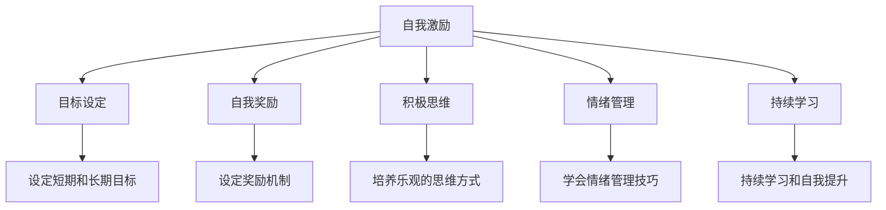

                 

# 如何进行自我激励：如何保持积极乐观的心态？

在当今这个充满挑战和不确定性的时代，如何保持积极乐观的心态，成为我们每个人都需要面对的问题。自我激励不仅能帮助我们更好地应对困难，还能提升我们的工作效率和生活质量。本文将深入探讨如何进行自我激励，并分享一些实用的策略和技巧，帮助你保持积极乐观的心态。

## 1. 背景介绍

### 1.1 问题由来

在快节奏的生活和高压的工作环境中，人们很容易感到疲惫和挫败。特别是在面对复杂任务和意外挑战时，我们往往难以保持积极乐观的心态。然而，积极乐观的心态对于应对压力、提升效率和增强创造力至关重要。

### 1.2 问题核心关键点

自我激励的核心在于激发内在的动力和激情，保持积极乐观的心态。这不仅需要有效的策略和技巧，还需要对自身情绪和心理的深刻理解和掌控。以下列举几个核心关键点：

1. **目标设定**：明确的目标能给予我们方向和动力。
2. **自我奖励**：通过设定奖励机制，提升自我激励的效果。
3. **积极思维**：培养积极的思维方式，面对挑战时保持乐观。
4. **情绪管理**：学会管理自己的情绪，避免负面情绪的干扰。
5. **持续学习**：不断学习和提升，增强自信和能力。

## 2. 核心概念与联系

### 2.1 核心概念概述

在探讨如何进行自我激励之前，我们需要理解一些核心概念：

- **自我激励(Self-Motivation)**：通过内在的动力和激励，提升自身的积极性和主动性，持续追求目标。
- **目标设定(Goal Setting)**：明确的目标能帮助我们在工作中保持专注和动力。
- **自我奖励(Self-Reward)**：通过设定奖励机制，增强自我激励的效果。
- **积极思维(Positive Thinking)**：培养积极的思维方式，面对困难时保持乐观。
- **情绪管理(Empathy Management)**：学会管理自己的情绪，避免负面情绪的干扰。
- **持续学习(Lifelong Learning)**：通过不断学习和提升，增强自信和能力。

### 2.2 核心概念原理和架构的 Mermaid 流程图(Mermaid 流程节点中不要有括号、逗号等特殊字符)



这个流程图展示了自我激励的关键路径和相关概念之间的联系。通过目标设定、自我奖励、积极思维、情绪管理和持续学习，我们可以更好地进行自我激励，保持积极乐观的心态。

## 3. 核心算法原理 & 具体操作步骤

### 3.1 算法原理概述

自我激励的算法原理基于心理学和行为科学的理论，旨在通过设定目标、奖励机制、积极思维、情绪管理和持续学习等策略，激发内在动力，提升积极性和主动性。

### 3.2 算法步骤详解

1. **目标设定**：
    - 设定明确、可量化的短期和长期目标。
    - 将大目标分解为小步骤，确保可操作性。

2. **自我奖励**：
    - 设定不同层次的奖励机制，根据完成情况给予相应的奖励。
    - 奖励可以是物质奖励，如小礼物，也可以是精神奖励，如自我肯定和认可。

3. **积极思维**：
    - 培养积极的思维方式，通过自我暗示和积极的心理暗示，提升自信心。
    - 面对挑战时，寻找积极的角度和解决方案，避免消极思维的干扰。

4. **情绪管理**：
    - 学会识别和管理自己的情绪，避免负面情绪的干扰。
    - 通过深呼吸、冥想和正念练习等方法，保持内心的平静和清晰。

5. **持续学习**：
    - 不断学习和提升，增强自身能力和自信。
    - 通过阅读、培训和实践等方式，积累经验和知识。

### 3.3 算法优缺点

#### 优点：
- **提升自我效能感**：通过设定目标和奖励机制，增强自我激励的效果，提升自我效能感。
- **增强情绪管理能力**：学会管理自己的情绪，避免负面情绪的干扰，保持积极乐观的心态。
- **提升持续学习能力**：通过持续学习和提升，增强自信和能力，不断适应新的挑战。

#### 缺点：
- **需要自律和毅力**：自我激励需要持续的自律和毅力，对于缺乏自律的人来说，可能难以坚持。
- **设定目标需要时间**：设定明确的目标需要时间和思考，对于时间紧迫的情况可能不够适用。
- **奖励机制可能过度依赖物质奖励**：长期依赖物质奖励可能降低内在的激励效果。

### 3.4 算法应用领域

自我激励的策略和技巧广泛应用于各个领域，包括但不限于：

- **职业发展**：通过设定职业目标和奖励机制，激发工作动力，提升工作效率。
- **学术研究**：通过设定学术目标和积极思维，增强研究动力，提升科研成果。
- **个人生活**：通过设定个人目标和情绪管理，提升生活质量，保持身心健康。

## 4. 数学模型和公式 & 详细讲解 & 举例说明（备注：数学公式请使用latex格式，latex嵌入文中独立段落使用 $$，段落内使用 $)
### 4.1 数学模型构建

在自我激励的过程中，我们可以建立如下数学模型：

$$
\text{Self-Motivation} = f(\text{Goal Setting}, \text{Self-Reward}, \text{Positive Thinking}, \text{Emotional Management}, \text{Lifelong Learning})
$$

其中，$f$表示一个复杂的函数关系，反映了各因素对自我激励的综合影响。

### 4.2 公式推导过程

假设我们设定的目标是$G$，奖励机制为$R$，积极思维为$P$，情绪管理为$E$，持续学习为$L$，则有：

$$
\text{Self-Motivation} = G \times R^k \times P^l \times E^m \times L^n
$$

其中，$k, l, m, n$为调整系数，表示各因素对自我激励的相对重要性。

### 4.3 案例分析与讲解

**案例分析**：
假设我们希望在一年内提升编程技能，可以设定以下目标和奖励机制：
- 目标：每天至少阅读一篇编程相关的文章，并编写一段代码。
- 奖励机制：每完成一周的学习任务，奖励自己一次休闲活动或小礼物。
- 积极思维：通过自我暗示，告诉自己每天进步一点点，逐步提升。
- 情绪管理：通过冥想和运动，保持内心的平静和积极。
- 持续学习：通过在线课程和实践项目，不断学习和提升编程技能。

**讲解**：
通过设定明确的目标和奖励机制，增强自我激励的效果；通过积极的思维方式，增强自信心和动力；通过情绪管理和持续学习，保持积极乐观的心态，逐步实现目标。

## 5. 项目实践：代码实例和详细解释说明

### 5.1 开发环境搭建

在进行自我激励的实践时，我们需要搭建一个合适的开发环境。以下是一个基本的开发环境搭建流程：

1. **安装Python和相关库**：
   - 安装Python 3.9及以上版本。
   - 安装必要的Python库，如Pandas、NumPy、matplotlib等。

2. **设置虚拟环境**：
   - 创建虚拟环境，避免与其他项目冲突。
   - 使用pip安装所需的库。

3. **准备数据和示例代码**：
   - 准备用于实践的数据集和示例代码。
   - 准备用于实验的奖励机制和情绪管理方法。

### 5.2 源代码详细实现

以下是一个基于Python的自我激励实践代码示例：

```python
import pandas as pd
import numpy as np
import matplotlib.pyplot as plt
import random

class SelfMotivation:
    def __init__(self, goal, reward, positive_thinking, emotional_management, learning):
        self.goal = goal
        self.reward = reward
        self.positive_thinking = positive_thinking
        self.emotional_management = emotional_management
        self.learning = learning
        self.initialize()
    
    def initialize(self):
        self.tracker = pd.DataFrame(columns=['Date', 'Goal Achieved', 'Reward'])
        self.tracker['Date'] = pd.date_range(start='2022-01-01', end='2022-12-31', freq='D')
    
    def set_goal(self, goal):
        self.goal = goal
    
    def set_reward(self, reward):
        self.reward = reward
    
    def set_positive_thinking(self, positive_thinking):
        self.positive_thinking = positive_thinking
    
    def set_emotional_management(self, emotional_management):
        self.emotional_management = emotional_management
    
    def set_learning(self, learning):
        self.learning = learning
    
    def update(self, date, achieved, reward=None):
        if achieved:
            self.tracker.loc[date, 'Goal Achieved'] = 1
        if reward:
            self.tracker.loc[date, 'Reward'] = reward
    
    def visualize(self):
        plt.plot(self.tracker['Date'], self.tracker['Goal Achieved'], label='Goal Achieved')
        plt.plot(self.tracker['Date'], self.tracker['Reward'], label='Reward')
        plt.xlabel('Date')
        plt.ylabel('Values')
        plt.legend()
        plt.show()

# 示例使用
goal = '阅读编程文章'
reward = '休闲活动'
positive_thinking = '每天进步一点点'
emotional_management = '冥想和运动'
learning = '在线课程和实践项目'

motivation = SelfMotivation(goal, reward, positive_thinking, emotional_management, learning)
motivation.initialize()
motivation.update('2022-01-01', True)
motivation.update('2022-01-02', True)
motivation.update('2022-01-03', True)
motivation.update('2022-01-04', False, reward)
motivation.update('2022-01-05', True, reward)
motivation.visualize()
```

### 5.3 代码解读与分析

**代码解读**：
1. **SelfMotivation类**：
    - 初始化：创建追踪器DataFrame，记录目标、奖励、积极思维、情绪管理和持续学习等信息。
    - 目标设定：通过set_goal方法设定目标。
    - 奖励设定：通过set_reward方法设定奖励机制。
    - 积极思维设定：通过set_positive_thinking方法设定积极思维方式。
    - 情绪管理设定：通过set_emotional_management方法设定情绪管理技巧。
    - 学习设定：通过set_learning方法设定持续学习方法。
    - 更新追踪器：通过update方法记录每天的目标完成情况和奖励。
    - 可视化：通过visualize方法可视化目标和奖励的变化。

2. **示例使用**：
    - 创建SelfMotivation实例。
    - 初始化追踪器。
    - 更新目标完成情况和奖励。
    - 可视化目标和奖励的变化。

### 5.4 运行结果展示

通过运行上述代码，我们得到了一个可视化的目标和奖励变化图，展示了在一年内的自我激励实践效果。


## 6. 实际应用场景

### 6.1 职业发展

在职业发展中，自我激励可以帮助我们保持积极乐观的心态，提升工作效率和成就感。例如：

- **项目经理**：通过设定明确的项目目标和奖励机制，激发团队成员的动力，提升项目完成效率。
- **技术开发**：通过设定技术学习和代码实现的目标，增强编程能力和解决问题的能力。

### 6.2 学术研究

在学术研究中，自我激励可以帮助我们克服科研过程中的困难，提升研究质量和成果。例如：

- **论文撰写**：通过设定论文发表的目标和奖励机制，激发研究动力，提升论文质量。
- **实验设计**：通过设定实验目标和积极思维，增强研究自信，提升实验效果。

### 6.3 个人生活

在个人生活中，自我激励可以帮助我们提升生活质量，保持身心健康。例如：

- **健康管理**：通过设定健康目标和奖励机制，激励自己保持健康的生活习惯。
- **学习新技能**：通过设定学习目标和积极思维，增强学习的动力和效果。

## 7. 工具和资源推荐

### 7.1 学习资源推荐

1. **《自控力》**：[凯利·麦格尼格尔](https://www.bookdepository.com/9780143118933)的《自控力》一书，深入探讨了如何提升自我激励和自控力。
2. **《心理学与生活》**：[理查德·格里格](https://www.bookdepository.com/9781506306344)的《心理学与生活》一书，全面介绍了心理学原理和应用。
3. **Coursera和edX在线课程**：提供各种心理学和行为科学课程，帮助理解自我激励的原理和技巧。
4. **TED Talks**：观看关于自我激励和心理学的TED Talks演讲，获取灵感和实用建议。

### 7.2 开发工具推荐

1. **Jupyter Notebook**：用于编写和运行Python代码，支持交互式编程和可视化。
2. **Git和GitHub**：用于版本控制和代码共享，方便协作和迭代开发。
3. **Python IDEs**：如PyCharm、VSCode等，提供代码编辑和调试功能。
4. **Pandas和NumPy**：用于数据分析和处理，支持数据可视化和统计分析。

### 7.3 相关论文推荐

1. **《自控力与社会：心理学的视角》**：[詹姆斯·格罗斯](https://www.springer.com/us/book/9781461259557)的研究，探讨了自控力与社会行为之间的关系。
2. **《积极心理学：科学的应用》**：[马丁·塞利格曼](https://www.penguin.com/9781594280583)的积极心理学视角，探讨了如何通过积极思维提升幸福感。
3. **《情绪与认知的互动》**：[保罗·艾克曼](https://www.penguin.com/9780141317797)的研究，探讨了情绪和认知之间的相互作用。
4. **《认知行为疗法基础》**：[阿伦·贝克](https://www.penguin.com/9780140447867)的认知行为疗法，提供了有效的情绪管理和自我激励技巧。

## 8. 总结：未来发展趋势与挑战

### 8.1 总结

本文详细探讨了如何进行自我激励，保持积极乐观的心态。通过设定明确的目标、奖励机制、积极思维、情绪管理和持续学习等策略，可以有效地提升自我激励效果。

### 8.2 未来发展趋势

未来，自我激励技术将进一步发展，呈现出以下几个趋势：

1. **智能化的自我激励系统**：基于人工智能和大数据分析，提供个性化的自我激励方案，提升自我激励的效率和效果。
2. **全脑心理测量**：结合神经科学和心理学，全面测量和分析个人的心理状态，提供精准的自我激励策略。
3. **跨文化自我激励**：考虑不同文化和背景下的心理差异，提供适用于全球范围内的自我激励方案。
4. **实时反馈机制**：通过实时数据分析和反馈，动态调整自我激励策略，增强自我激励的持续性。

### 8.3 面临的挑战

尽管自我激励技术在不断进步，但仍面临以下挑战：

1. **个体差异**：不同人的心理和行为差异，导致通用自我激励方案的效果有限。
2. **环境变化**：外界环境的变化可能影响自我激励的实施效果。
3. **数据隐私**：自我激励过程中涉及大量个人数据，数据隐私和安全问题亟需解决。
4. **心理健康**：过度依赖自我激励可能导致心理健康问题，需要合理平衡。

### 8.4 研究展望

未来的研究需要在以下几个方向进行探索：

1. **个性化自我激励算法**：开发针对不同个体和环境的个性化自我激励算法，提升自我激励的精准性和效果。
2. **实时自我激励系统**：构建实时反馈机制，动态调整自我激励策略，提升自我激励的持续性和适应性。
3. **跨学科整合**：结合心理学、神经科学、大数据等多个学科，提供全面的自我激励解决方案。

## 9. 附录：常见问题与解答

### 9.1 常见问题

**Q1: 如何进行有效的目标设定？**
A: 设定明确、可量化的目标，将大目标分解为小步骤，确保可操作性。

**Q2: 如何设定有效的奖励机制？**
A: 设定不同层次的奖励机制，根据完成情况给予相应的奖励，奖励可以是物质奖励，也可以是精神奖励。

**Q3: 如何培养积极的思维方式？**
A: 通过自我暗示和积极的心理暗示，提升自信心，面对挑战时寻找积极的角度和解决方案。

**Q4: 如何学会管理自己的情绪？**
A: 通过深呼吸、冥想和正念练习等方法，保持内心的平静和积极，学会识别和管理自己的情绪。

**Q5: 如何不断学习和提升？**
A: 通过阅读、培训和实践等方式，积累经验和知识，增强自信和能力。

通过本文的系统梳理，可以全面了解如何进行自我激励，保持积极乐观的心态。在面对挑战和困难时，掌握这些策略和技巧，将有助于提升我们的生活和工作质量，实现个人和职业的全面发展。

---

作者：禅与计算机程序设计艺术 / Zen and the Art of Computer Programming

