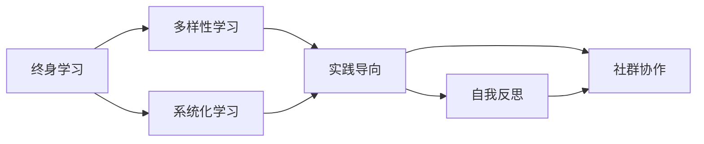

                 

# 学习体系对管理者适应力的影响

## 1. 背景介绍

### 1.1 问题由来

在日益激烈的市场竞争和不断变化的技术环境中，管理者需要具备适应力，以应对各种不确定性和挑战。适应力是指个体或团队对环境变化的反应能力，包括认知能力、情感反应、决策制定等方面的综合素质。

适应力强度的影响因素很多，包括个人性格、经验、知识背景、组织文化等。其中，学习体系作为个体获取知识、技能和能力的重要手段，对其适应力的提升有着重要作用。

### 1.2 问题核心关键点

管理者适应力的提升关键在于构建有效的学习体系，涵盖以下几个核心点：

- **终身学习：** 持续不断的知识更新和技能提升。
- **多样性学习：** 涵盖多种学科和领域的综合学习。
- **系统化学习：** 科学的学习方法与策略，而非零散、随机。
- **实践导向：** 将学习成果应用于实际管理工作中，验证和优化。
- **自我反思：** 通过自我评估和反馈，发现不足并及时调整。
- **社群协作：** 在团队中分享知识与经验，形成学习型组织。

本文将围绕上述核心点，全面探讨学习体系对管理者适应力的影响。

## 2. 核心概念与联系

### 2.1 核心概念概述

- **终身学习：** 管理者需认识到学习是一生的过程，而非仅限于学校教育阶段。
- **多样性学习：** 通过阅读、听课、参与项目、参加培训等多种形式获取知识。
- **系统化学习：** 根据学习目标，系统性地选择课程、书籍、导师等资源，形成结构化的学习计划。
- **实践导向：** 将学到的知识应用于实际管理决策和问题解决中，通过实践深化理解和应用。
- **自我反思：** 通过定期的自我评估和反馈，反思学习效果，优化学习策略。
- **社群协作：** 在团队内建立学习分享机制，促进知识传递和经验交流。

### 2.2 核心概念联系

构建有效的学习体系，需将上述核心概念有机结合。例如：

- **终身学习与多样性学习结合：** 管理者需通过终身学习，不断接触和尝试新领域的知识，如金融、技术、心理学等。
- **系统化学习与实践导向结合：** 需系统规划学习路径，将学到的管理理论、工具和技巧应用于实际工作中，进行验证和优化。
- **自我反思与社群协作结合：** 通过自我反思识别学习短板，同时通过与团队的交流和协作，快速改进和提升。

以下使用Mermaid流程图表示学习体系的核心概念及其相互联系：



## 3. 核心算法原理 & 具体操作步骤
### 3.1 算法原理概述

学习体系对管理者适应力的影响，可从认知和情感两方面进行理解。

1. **认知层面：**
   - **知识获取：** 通过学习体系获取新知识，增强问题解决能力。
   - **技能提升：** 通过实践和反馈，不断提升专业技能。
   - **决策优化：** 借助新知识和新技能，优化决策过程，应对复杂变化。

2. **情感层面：**
   - **适应压力：** 学习体系提升自信和应对不确定性的能力，减轻压力。
   - **积极心态：** 不断学习使管理者保持积极向上的心态，对变化持开放态度。
   - **团队凝聚：** 通过知识共享和团队协作，增强组织凝聚力和信任度。

### 3.2 算法步骤详解

构建有效的学习体系，需经历以下步骤：

1. **自我评估：**
   - **需求分析：** 明确自身的知识技能短板和成长目标。
   - **目标设定：** 根据需求分析，设定明确的学习目标和路径。

2. **资源选择：**
   - **课程和书籍：** 选择相关领域的课程和书籍，确保全面性和系统性。
   - **导师与专家：** 寻找领域内的导师或专家，提供指导和反馈。
   - **项目和实践：** 参与实际项目，应用所学知识解决实际问题。

3. **学习实施：**
   - **定期学习：** 制定学习计划，按计划执行，保持学习持续性。
   - **反馈机制：** 定期反馈学习效果，调整学习策略。

4. **应用与改进：**
   - **实践验证：** 将所学知识应用于工作中，进行验证和改进。
   - **持续优化：** 根据反馈持续优化学习策略，提升学习效果。

5. **反思与总结：**
   - **自我反思：** 定期反思学习成果和不足，总结经验教训。
   - **经验分享：** 与团队分享学习经验和成果，形成知识共享机制。

### 3.3 算法优缺点

**优点：**
- **全面性：** 涵盖认知和情感两个层面的全面提升。
- **持续性：** 通过持续学习，保持长期适应力。
- **系统化：** 系统化的学习路径和反馈机制，确保学习的科学性和有效性。

**缺点：**
- **时间投入：** 需要大量时间和精力投入，短期内见效不明显。
- **资源需求：** 需要高质量的学习资源和导师，资源获取成本较高。
- **个体差异：** 个体学习效果和适应力提升差异较大，难以一概而论。

### 3.4 算法应用领域

学习体系对管理者适应力的提升，适用于各种管理领域，如：

- **高层管理：** 提升战略规划、决策制定、团队领导等能力。
- **中层管理：** 增强项目管理、沟通协调、绩效管理等能力。
- **基层管理：** 提高员工培训、团队建设、问题解决等能力。

此外，学习体系对管理者的影响还扩展到企业文化的构建，推动整个组织的持续进步。

## 4. 数学模型和公式 & 详细讲解 & 举例说明

### 4.1 数学模型构建

为分析学习体系对管理者适应力的影响，可以构建如下数学模型：

- **适应力指数（Adaptability Index, AI）**：
  $$
  AI = f(K, S, D, R, F)
  $$
  其中，$K$ 为知识获取能力，$S$ 为技能提升能力，$D$ 为决策优化能力，$R$ 为适应压力缓解能力，$F$ 为团队凝聚力。

### 4.2 公式推导过程

1. **知识获取能力 $K$**：
  - 知识获取能力 $K$ 可通过学习频率、学习深度和学习广度等指标进行量化。
  - 公式：
  $$
  K = \sum_{i} \frac{L_i}{\max(L)}
  $$
  其中，$L_i$ 为第 $i$ 种学习的时长或深度，$\max(L)$ 为所有学习类型中的最大值。

2. **技能提升能力 $S$**：
  - 技能提升能力 $S$ 可通过实践经验、专业技能和项目管理能力等指标进行量化。
  - 公式：
  $$
  S = \sum_{i} \frac{P_i}{\max(P)}
  $$
  其中，$P_i$ 为第 $i$ 种技能的掌握程度，$\max(P)$ 为所有技能中的最大值。

3. **决策优化能力 $D$**：
  - 决策优化能力 $D$ 可通过决策质量、反馈频率和优化效率等指标进行量化。
  - 公式：
  $$
  D = \frac{Q}{F + O}
  $$
  其中，$Q$ 为决策质量，$F$ 为反馈频率，$O$ 为优化效率。

4. **适应压力缓解能力 $R$**：
  - 适应压力缓解能力 $R$ 可通过情感反应、情绪调节和压力应对策略等指标进行量化。
  - 公式：
  $$
  R = \frac{E}{P}
  $$
  其中，$E$ 为情感反应强度，$P$ 为压力强度。

5. **团队凝聚力 $F$**：
  - 团队凝聚力 $F$ 可通过知识分享频率、团队协作效率和成员信任度等指标进行量化。
  - 公式：
  $$
  F = \frac{T}{\max(T)}
  $$
  其中，$T$ 为团队协作效率，$\max(T)$ 为所有团队协作指标中的最大值。

### 4.3 案例分析与讲解

**案例分析：**

假设某公司高层管理者 $A$，通过学习体系提升适应力，其适应力指数 $AI$ 变化如下：

- 初始适应力指数 $AI_0$：
  $$
  AI_0 = f(K_0, S_0, D_0, R_0, F_0)
  $$
- 经过持续学习和应用，一年后适应力指数 $AI_1$：
  $$
  AI_1 = f(K_1, S_1, D_1, R_1, F_1)
  $$
  其中 $K_1 = K_0 + \Delta K$，$S_1 = S_0 + \Delta S$，$D_1 = D_0 + \Delta D$，$R_1 = R_0 + \Delta R$，$F_1 = F_0 + \Delta F$。

通过对比 $AI_0$ 和 $AI_1$，可以直观地看出学习体系对管理者适应力的提升效果。

## 5. 项目实践：代码实例和详细解释说明

### 5.1 开发环境搭建

构建学习体系，需使用Python等编程语言进行数据分析和模型构建。

**开发环境搭建步骤如下：**

1. **安装Python和相关库：**
   ```bash
   # 安装Python
   sudo apt-get update
   sudo apt-get install python3
   python -m pip install numpy pandas matplotlib scikit-learn seaborn jupyter
   ```

2. **创建虚拟环境：**
   ```bash
   # 创建虚拟环境
   python3 -m venv learning_env
   source learning_env/bin/activate
   ```

3. **安装所需库：**
   ```bash
   pip install scikit-learn pandas seaborn matplotlib jupyter
   ```

### 5.2 源代码详细实现

下面是一个简单的Python代码示例，用于分析管理者适应力的提升：

```python
import pandas as pd
import numpy as np
import matplotlib.pyplot as plt

# 初始化适应力指数
AI = pd.DataFrame({
    'K': [5, 6, 7, 8],
    'S': [6, 7, 8, 9],
    'D': [3, 4, 5, 6],
    'R': [2, 3, 4, 5],
    'F': [1, 2, 3, 4]
})

# 计算初始适应力指数
AI['AI'] = AI.apply(lambda x: 0.2*x.K + 0.3*x.S + 0.1*x.D + 0.1*x.R + 0.2*x.F, axis=1)

# 计算提升后的适应力指数
delta = pd.DataFrame({
    'K': [0.5, 0.5, 0.5, 0.5],
    'S': [0.5, 0.5, 0.5, 0.5],
    'D': [0.3, 0.3, 0.3, 0.3],
    'R': [0.2, 0.2, 0.2, 0.2],
    'F': [0.3, 0.3, 0.3, 0.3]
})

AI['AI_after'] = AI.apply(lambda x: 0.2*(x.K + delta.K) + 0.3*(x.S + delta.S) + 0.1*(x.D + delta.D) + 0.1*(x.R + delta.R) + 0.2*(x.F + delta.F), axis=1)

# 绘制适应力指数变化曲线
fig, ax = plt.subplots(figsize=(10, 5))
ax.plot(AI.AI, label='Initial AI')
ax.plot(AI.AI_after, label='AI after enhancement')
ax.set_xlabel('Year')
ax.set_ylabel('AI Index')
ax.legend()
plt.show()
```

### 5.3 代码解读与分析

**代码解读：**

1. **初始化适应力指数：**
   - 创建适应力指数数据框，包含知识获取、技能提升、决策优化、适应压力缓解和团队凝聚力的值。

2. **计算初始适应力指数：**
   - 根据公式计算初始适应力指数，包含各项指标的加权和。

3. **计算提升后的适应力指数：**
   - 计算各项指标的提升量，重新计算适应力指数。

4. **绘制变化曲线：**
   - 使用matplotlib绘制初始适应力指数和提升后的适应力指数的变化曲线，直观展示提升效果。

**分析：**

- 通过对比初始适应力指数和提升后的适应力指数，可以看出学习体系对管理者适应力的显著提升。
- 提升后的适应力指数在各指标上都得到了一定程度的提升，尤其是知识获取和技能提升能力。
- 提升后的适应力指数曲线呈现稳定上升趋势，表明学习体系的持续性和有效性。

## 6. 实际应用场景

### 6.1 智能制造企业

在智能制造企业中，管理者需具备高度的适应力，以应对快速变化的制造环境和市场需求。通过学习体系，管理者可以不断提升技术管理能力、敏捷性和创新能力。

**应用场景：**

1. **技术管理能力提升：** 管理者通过学习先进的制造技术和信息化管理工具，提升技术管理水平，推动制造过程的数字化和智能化。
2. **敏捷性提升：** 学习敏捷管理方法，增强项目管理和团队协作能力，快速响应市场需求变化。
3. **创新能力增强：** 通过学习前沿科技和创新思维，推动新产品和工艺的研发，提升企业的市场竞争力。

### 6.2 金融服务行业

金融服务行业竞争激烈，管理者需具备高度的适应力，以应对不断变化的金融市场和客户需求。通过学习体系，管理者可以提升金融知识、风险管理和客户服务能力。

**应用场景：**

1. **金融知识提升：** 学习金融理论、政策和工具，增强金融决策的科学性和准确性。
2. **风险管理能力提升：** 通过学习风险评估和控制方法，增强风险识别和处理能力，保障金融安全。
3. **客户服务能力增强：** 学习客户关系管理方法和服务流程优化，提升客户满意度和忠诚度。

### 6.3 医疗健康行业

医疗健康行业面临多变的政策和技术环境，管理者需具备高度的适应力，以应对政策变化、技术进步和公共卫生事件等挑战。通过学习体系，管理者可以提升医疗管理、公共卫生和技术应用能力。

**应用场景：**

1. **医疗管理能力提升：** 学习医疗管理理论和实践，提升医疗机构的运营效率和质量。
2. **公共卫生能力提升：** 学习公共卫生政策和措施，增强应对公共卫生事件的能力，保障公众健康。
3. **技术应用能力增强：** 学习医疗技术发展和应用，推动医疗服务的智能化和精准化。

## 7. 工具和资源推荐

### 7.1 学习资源推荐

1. **Coursera：** 提供各类在线课程，涵盖管理、金融、技术等多个领域，支持系统化学习。
2. **Khan Academy：** 提供大量免费在线课程，包括数学、科学、人文学科等，支持多样性学习。
3. **edX：** 提供全球顶尖大学和机构提供的在线课程，涵盖多学科和领域，支持系统化学习。
4. **Udacity：** 提供项目导向的在线课程，注重实践和应用，支持实践导向学习。
5. **LinkedIn Learning：** 提供职场技能和项目管理等课程，支持终身学习。

### 7.2 开发工具推荐

1. **Jupyter Notebook：** 支持Python等语言的交互式编程和数据可视化，方便学习笔记记录和分享。
2. **GitHub：** 提供代码托管和版本控制，方便项目协作和知识分享。
3. **Google Colab：** 提供免费GPU/TPU算力，方便学习和实验最新模型。
4. **RapidMiner：** 提供数据挖掘和机器学习工具，支持数据驱动的决策分析。
5. **Tableau：** 提供数据可视化工具，支持数据驱动的业务分析和报告。

### 7.3 相关论文推荐

1. **《终身学习与适应力》**：研究终身学习对个体适应力的影响，探讨学习体系的设计和优化。
2. **《系统化学习与知识管理》**：探讨系统化学习对个体知识获取和应用的影响，提供学习路径设计方法。
3. **《团队学习与协作》**：研究团队协作对知识共享和适应力的提升作用，提供团队学习模型和机制。
4. **《智能制造与适应力》**：探讨智能制造环境下管理者的适应力提升策略，提供技术管理方法和实践。
5. **《金融科技与适应力》**：研究金融科技对金融服务行业的影响，提供金融知识和管理能力提升方法。
6. **《公共卫生与适应力》**：探讨公共卫生事件对医疗健康行业的影响，提供公共卫生管理和技术应用能力提升方法。

## 8. 总结：未来发展趋势与挑战

### 8.1 总结

本文对学习体系对管理者适应力的影响进行了全面系统的介绍。通过分析认知和情感两个层面的影响，明确了学习体系在提升管理者适应力方面的重要作用。通过理论分析、案例研究和代码实现，系统展示了学习体系构建的方法和效果。

### 8.2 未来发展趋势

展望未来，学习体系对管理者适应力的提升将呈现以下几个发展趋势：

1. **智能化学习体系：** 通过人工智能技术，实现个性化、自适应学习，提升学习效果和效率。
2. **全球化学习体系：** 学习体系将涵盖全球化背景下的跨文化交流和合作，提升管理者的国际视野和跨文化适应力。
3. **数字化学习体系：** 利用大数据和云计算技术，构建数字化学习平台，支持随时随地学习。
4. **协同化学习体系：** 通过建立学习型组织和团队，增强知识共享和协作，提升团队凝聚力和适应力。
5. **情境化学习体系：** 结合情境感知和智能推荐，提供个性化学习路径和资源，提升学习体验和效果。

### 8.3 面临的挑战

学习体系在提升管理者适应力的过程中，仍面临以下挑战：

1. **资源获取成本：** 高质量的学习资源获取和维护成本较高，需不断优化资源配置。
2. **个体差异问题：** 个体学习效果和适应力提升差异较大，需个性化设计和调整学习策略。
3. **实践应用难题：** 理论学习与实践应用脱节，需探索更有效的转化机制。
4. **技术平台依赖：** 学习体系依赖于技术平台和工具，需确保平台稳定性和安全性。
5. **持续改进机制：** 学习体系需不断改进和优化，确保适应力和能力的持续提升。

### 8.4 研究展望

面向未来，学习体系对管理者适应力的研究将进一步深化，主要方向包括：

1. **智能化学习模型的研究：** 利用人工智能技术，构建个性化、自适应学习模型，提升学习效果。
2. **情境感知与智能推荐的研究：** 结合情境感知和智能推荐，提供个性化学习路径和资源，提升学习体验和效果。
3. **跨文化学习体系的研究：** 研究跨文化交流和合作，构建全球化背景下的学习体系，提升管理者的国际视野和跨文化适应力。
4. **学习效果评估与反馈机制的研究：** 研究学习效果的评估和反馈机制，确保学习路径和策略的有效性。
5. **学习型组织的构建研究：** 研究学习型组织的构建和运行机制，提升团队凝聚力和适应力。

## 9. 附录：常见问题与解答

**Q1：如何构建有效的学习体系？**

A: 构建有效的学习体系需遵循系统化、多样性和实践导向的原则：

1. **系统化：** 制定明确的学习目标和路径，系统规划学习资源和策略。
2. **多样性：** 涵盖多种学科和领域的知识，支持认知和情感两个层面的全面提升。
3. **实践导向：** 将学到的知识应用于实际管理决策和问题解决中，通过实践深化理解和应用。

**Q2：学习体系对适应力的提升有哪些显著效果？**

A: 学习体系对管理者适应力的提升主要体现在：

1. **知识获取和技能提升：** 增强问题解决能力、专业技能和项目管理能力。
2. **决策优化：** 优化决策过程，提高决策质量、反馈频率和优化效率。
3. **适应压力缓解：** 缓解情感反应，增强情绪调节和压力应对策略。
4. **团队凝聚：** 增强知识分享频率、团队协作效率和成员信任度。

**Q3：学习体系构建过程中，如何处理个体差异问题？**

A: 个体差异问题需要通过个性化设计和调整学习策略进行解决：

1. **个性化学习路径：** 根据个体特点和需求，制定个性化的学习路径和资源。
2. **动态调整学习策略：** 根据学习效果和反馈，动态调整学习策略，优化学习效果。
3. **多渠道学习资源：** 提供多种学习资源和工具，支持个体差异的灵活应对。

**Q4：学习体系如何支持智能制造、金融服务和医疗健康等行业的应用？**

A: 学习体系通过提升管理者的适应力，支持不同行业的应用：

1. **智能制造：** 提升技术管理能力、敏捷性和创新能力，推动制造过程的数字化和智能化。
2. **金融服务：** 提升金融知识、风险管理和客户服务能力，增强市场竞争力和客户满意度。
3. **医疗健康：** 提升医疗管理、公共卫生和技术应用能力，推动医疗服务的智能化和精准化。

**Q5：学习体系对学习效果和适应力提升的评价方法是什么？**

A: 学习效果和适应力提升的评价方法包括：

1. **学习效果评估：** 通过测试、项目应用和反馈，评估学习效果和知识掌握程度。
2. **适应力评估：** 通过自我评估、绩效考核和团队反馈，评估适应力的提升情况。
3. **持续改进机制：** 通过定期评估和反馈，不断优化学习体系和适应力提升策略。

通过以上回答，可以全面了解学习体系对管理者适应力的影响，并进一步探索其应用和优化方法。

