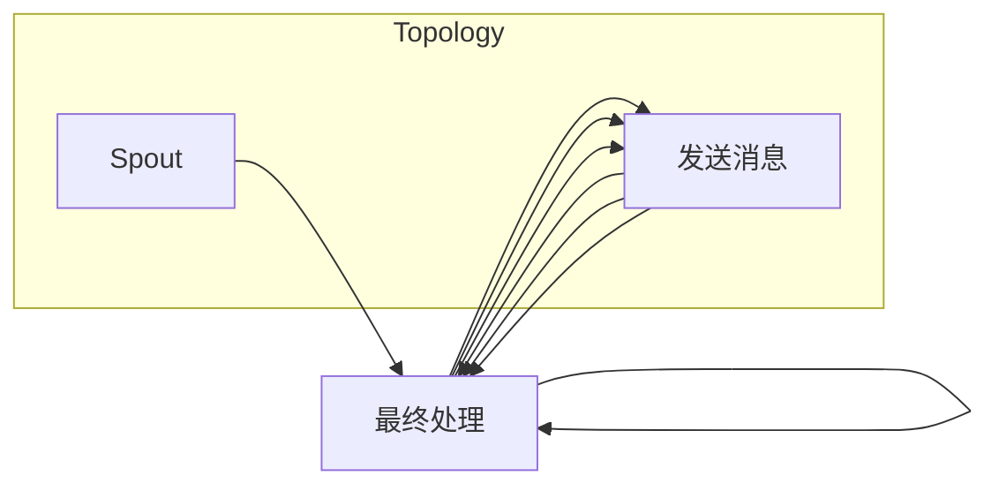

                 

# 实时大数据处理：Storm和Flink的应用

> 关键词：实时数据流处理, Storm, Flink, 分布式计算, 大数据生态系统

## 1. 背景介绍

### 1.1 问题由来
随着互联网的快速发展和数据量的爆炸性增长，企业需要处理的数据规模越来越大，数据实时性和处理速度的要求也越来越高。传统的数据处理方式已经难以满足快速响应和高效处理的需求，实时大数据处理技术应运而生。实时大数据处理技术可以实时地处理和分析大规模数据流，使得数据驱动的决策更加及时、准确。

在实时数据处理领域，Storm和Flink是两个非常著名的开源流处理框架。它们都基于分布式计算的思想，能够有效地处理大规模数据流。Storm是一个基于Java的分布式实时计算系统，由Facebook开发和维护。Flink是一个开源流处理框架，由Apache Software Foundation开发和维护。两个框架都能够高效地处理实时数据流，并且在实际应用中都有广泛的应用。

本文将详细阐述Storm和Flink的核心概念和原理，并对比它们的特点，为读者提供选择和使用这些技术的指南。同时，本文还将介绍它们在实际应用中的具体应用场景和成功案例，帮助读者更好地理解和应用这些技术。

## 2. 核心概念与联系

### 2.1 核心概念概述

#### 2.1.1 Storm

Storm是一个开源的分布式实时计算系统，由Facebook开发和维护。它使用简单的、可扩展的分布式流处理模型，能够处理大规模数据流，适用于实时数据处理和分析。Storm的核心概念包括：

- **Spout**：Spout是Storm的输入源，负责从外部系统获取数据，并将其转化为顶点的消息。Spout可以是网络数据流、日志文件、数据库等。

- **Bolt**：Bolt是Storm的基本处理单元，负责对Spout发送的消息进行处理。Bolt可以执行各种操作，如数据过滤、数据聚合、数据转换等。

- **拓扑(Topology)**：拓扑是Storm的核心概念，它定义了数据的流动和处理方式。拓扑由Spout和Bolt组成，定义了数据流的流向和处理逻辑。

#### 2.1.2 Flink

Flink是一个开源的流处理框架，由Apache Software Foundation开发和维护。它能够高效地处理实时数据流，并且支持流批统一处理。Flink的核心概念包括：

- **DataStream API**：DataStream API是Flink的核心API，它提供了对数据流的处理和操作。DataStream API支持各种操作，如数据过滤、数据聚合、数据转换等。

- **Window API**：Window API是Flink的高级API，它提供了对数据流的窗口化处理。Window API可以将数据流划分为不同的窗口，对每个窗口进行聚合和处理。

- **Event Time Processing**：Event Time Processing是Flink的一个重要特性，它能够准确地处理数据流的延迟和乱序，确保数据处理的正确性和一致性。

### 2.2 核心概念原理和架构的 Mermaid 流程图



上述图展示了Storm的基本工作流程：Spout从外部系统获取数据，并将其转化为Bolt的消息。Bolt对消息进行处理，并将处理结果发送回Spout，进行进一步的处理和聚合。最终，处理结果被发送回外部系统，供用户使用。

### 2.3 核心概念联系

Storm和Flink的核心概念都围绕数据流和分布式计算展开，它们都是通过分布式计算来处理大规模数据流。Storm使用Spout和Bolt来描述数据的流动和处理逻辑，而Flink则使用DataStream API和Window API来描述数据的处理和聚合。虽然这两个框架的实现方式不同，但它们的核心思想是一致的。

## 3. 核心算法原理 & 具体操作步骤

### 3.1 算法原理概述

#### 3.1.1 Storm

Storm的算法原理基于分布式计算和流处理模型。它使用简单的、可扩展的分布式流处理模型，能够处理大规模数据流，适用于实时数据处理和分析。Storm的算法原理如下：

1. **分布式计算**：Storm使用分布式计算的方式处理大规模数据流，将数据流分割成多个小任务，并在多个节点上并行处理。这样可以提高数据处理的效率，并减少单个节点的负载。

2. **流处理模型**：Storm使用流处理模型来处理数据流，它将数据流分割成多个小任务，并在多个节点上并行处理。这样可以提高数据处理的效率，并减少单个节点的负载。

3. **实时数据处理**：Storm能够实时地处理和分析大规模数据流，使得数据驱动的决策更加及时、准确。

#### 3.1.2 Flink

Flink的算法原理基于流处理和批处理。它能够高效地处理实时数据流，并且支持流批统一处理。Flink的算法原理如下：

1. **流处理**：Flink使用流处理的方式处理数据流，它将数据流分割成多个小任务，并在多个节点上并行处理。这样可以提高数据处理的效率，并减少单个节点的负载。

2. **批处理**：Flink还支持批处理，它可以将数据流划分为不同的批，对每个批进行聚合和处理。这样可以提高数据处理的效率，并减少单个节点的负载。

3. **实时数据处理**：Flink能够实时地处理和分析大规模数据流，并且支持流批统一处理。

### 3.2 算法步骤详解

#### 3.2.1 Storm

1. **配置集群**：首先，需要配置Storm的集群环境，包括安装Spout、Bolt和其他必要的组件。

2. **定义Spout**：定义Spout，它负责从外部系统获取数据，并将其转化为Bolt的消息。

3. **定义Bolt**：定义Bolt，它负责对Spout发送的消息进行处理。

4. **定义拓扑**：定义拓扑，它描述了数据的流动和处理逻辑。

5. **启动Storm**：启动Storm，它会在集群上并行处理数据流。

#### 3.2.2 Flink

1. **配置集群**：首先，需要配置Flink的集群环境，包括安装Flink和其他必要的组件。

2. **定义数据流**：定义数据流，它可以使用DataStream API进行操作，如数据过滤、数据聚合、数据转换等。

3. **定义窗口**：定义窗口，它可以使用Window API进行窗口化处理。

4. **启动Flink**：启动Flink，它会在集群上并行处理数据流。

### 3.3 算法优缺点

#### 3.3.1 Storm

**优点**：

- **实时性**：Storm能够实时地处理和分析大规模数据流，使得数据驱动的决策更加及时、准确。

- **分布式计算**：Storm使用分布式计算的方式处理大规模数据流，可以高效地处理大规模数据流。

- **简单性**：Storm的API简单易用，用户可以轻松地编写和部署拓扑。

**缺点**：

- **数据一致性**：由于Storm使用消息队列来处理数据流，可能会出现数据丢失和重复处理的问题。

- **节点管理**：Storm需要手动管理节点，增加了用户的维护成本。

#### 3.3.2 Flink

**优点**：

- **数据一致性**：Flink使用事件时间处理，能够准确地处理数据流的延迟和乱序，确保数据处理的正确性和一致性。

- **流批统一处理**：Flink支持流批统一处理，可以同时处理实时数据流和批量数据流。

- **灵活性**：Flink的API灵活，用户可以灵活地定义数据流和窗口。

**缺点**：

- **部署复杂性**：Flink的部署相对复杂，需要考虑集群管理、资源调度等问题。

- **性能开销**：Flink的性能开销相对较高，需要在计算和存储之间进行权衡。

### 3.4 算法应用领域

#### 3.4.1 Storm

Storm适用于实时数据处理和分析，适用于需要实时处理和分析大规模数据流的场景。例如：

- **金融数据分析**：Storm可以实时处理和分析金融市场数据，帮助金融分析师进行实时决策。

- **日志处理**：Storm可以实时处理和分析系统日志，帮助运维人员进行问题排查和故障诊断。

- **实时消息处理**：Storm可以实时处理和分析消息数据，帮助企业实时推送消息和通知。

#### 3.4.2 Flink

Flink适用于实时数据处理和批处理，适用于需要实时处理和分析大规模数据流的场景。例如：

- **金融数据分析**：Flink可以实时处理和分析金融市场数据，帮助金融分析师进行实时决策。

- **大数据分析**：Flink可以进行批处理和流处理，适合处理大规模数据集。

- **实时消息处理**：Flink可以实时处理和分析消息数据，帮助企业实时推送消息和通知。

## 4. 数学模型和公式 & 详细讲解 & 举例说明

### 4.1 数学模型构建

#### 4.1.1 Storm

Storm的数学模型基于分布式流处理模型。其数学模型如下：

- **数据流**：定义数据流 $D$，它由一组消息 $M$ 组成，每个消息包含一个数据项 $d_i$。

- **Spout**：定义Spout，它负责从外部系统获取数据，并将其转化为Bolt的消息。

- **Bolt**：定义Bolt，它负责对Spout发送的消息进行处理。

- **拓扑**：定义拓扑，它描述了数据的流动和处理逻辑。

#### 4.1.2 Flink

Flink的数学模型基于流处理和批处理。其数学模型如下：

- **数据流**：定义数据流 $D$，它由一组消息 $M$ 组成，每个消息包含一个数据项 $d_i$。

- **DataStream API**：定义DataStream API，它提供了对数据流的处理和操作。

- **Window API**：定义Window API，它提供了对数据流的窗口化处理。

- **事件时间处理**：定义事件时间处理，它能够准确地处理数据流的延迟和乱序，确保数据处理的正确性和一致性。

### 4.2 公式推导过程

#### 4.2.1 Storm

1. **数据流定义**：

   $$
   D = \{d_1, d_2, \dots, d_n\}
   $$

2. **Spout定义**：

   $$
   Spout = (d_i \rightarrow M_i)
   $$

   其中，$d_i$ 是Spout从外部系统获取的数据项，$M_i$ 是Spout转化为Bolt的消息。

3. **Bolt定义**：

   $$
   Bolt = (M_i \rightarrow \{处理结果\})
   $$

   其中，$M_i$ 是Spout发送的消息，$\{处理结果\}$ 是Bolt处理后的结果。

4. **拓扑定义**：

   $$
   拓扑 = (Spout \rightarrow Bolt_1 \rightarrow Bolt_2 \rightarrow \dots \rightarrow Bolt_k)
   $$

   其中，$Spout$ 是Spout节点，$Bolt_1, Bolt_2, \dots, Bolt_k$ 是Bolt节点，描述了数据的流动和处理逻辑。

#### 4.2.2 Flink

1. **数据流定义**：

   $$
   D = \{d_1, d_2, \dots, d_n\}
   $$

2. **DataStream API定义**：

   $$
   DataStream = \{D \rightarrow 处理操作\}
   $$

   其中，$D$ 是数据流，$处理操作$ 是对数据流的操作，如数据过滤、数据聚合、数据转换等。

3. **Window API定义**：

   $$
   Window = \{D \rightarrow 窗口操作\}
   $$

   其中，$D$ 是数据流，$窗口操作$ 是对数据流的窗口化处理。

4. **事件时间处理定义**：

   $$
   事件时间处理 = (延迟时间 \rightarrow 数据处理)
   $$

   其中，延迟时间是指数据流的延迟时间，数据处理是指数据流的处理操作。

### 4.3 案例分析与讲解

#### 4.3.1 Storm

假设有一个金融数据分析任务，需要实时处理和分析金融市场数据。使用Storm的算法原理如下：

1. **数据流定义**：定义数据流 $D$，它由一组股票价格数据 $M$ 组成，每个数据包含一个股票代码和一个价格。

2. **Spout定义**：定义Spout，它从金融市场数据获取数据，并将其转化为Bolt的消息。

3. **Bolt定义**：定义Bolt，它对Spout发送的消息进行处理，如计算股票平均价格、统计股票涨跌幅等。

4. **拓扑定义**：定义拓扑，它描述了数据的流动和处理逻辑，如图1所示。

   

   图1：Storm拓扑

#### 4.3.2 Flink

假设有一个电商数据分析任务，需要实时处理和分析电商交易数据。使用Flink的算法原理如下：

1. **数据流定义**：定义数据流 $D$，它由一组电商交易数据 $M$ 组成，每个数据包含一个交易ID、商品ID和交易金额。

2. **DataStream API定义**：定义DataStream API，它对电商交易数据进行聚合处理，计算每个商品的日销售额和月销售额。

3. **Window API定义**：定义Window API，它对电商交易数据进行窗口化处理，计算每个商品的日销售额和月销售额。

4. **事件时间处理定义**：定义事件时间处理，它能够准确地处理电商交易数据的延迟和乱序，确保数据处理的正确性和一致性。

## 5. 项目实践：代码实例和详细解释说明

### 5.1 开发环境搭建

#### 5.1.1 Storm

1. **安装Spout和Bolt**：

   ```
   wget https://downloads.apache.org/storm/apache-storm-2.2.2.tgz
   tar -xzvf apache-storm-2.2.2.tgz
   ```

   进入目录 `apache-storm-2.2.2`，执行以下命令：

   ```
   bin/storm jar examples/local/SpoutAndBolt/examples/local/spoutAndBolt.jar
   ```

2. **配置集群**：

   配置Storm的集群环境，包括安装Spout、Bolt和其他必要的组件。

#### 5.1.2 Flink

1. **安装Flink**：

   ```
   wget https://downloads.apache.org/flink/flink-1.13.2.tgz
   tar -xzvf flink-1.13.2.tgz
   ```

   进入目录 `flink-1.13.2`，执行以下命令：

   ```
   bin/flink run examples/streaming/WordCount.jar
   ```

### 5.2 源代码详细实现

#### 5.2.1 Storm

```java
// StormSpout.java
public class StormSpout implements Spout {
    @Override
    public void nextTuple() {
        // 从外部系统获取数据
        String data = "sample data";
        // 将数据转化为消息
        Tuple tuple = new Tuple(data);
        // 发送消息
        SpoutOutputCollector collector = (SpoutOutputCollector) context;
        collector.emit(tuple);
        collector.ack(tuple);
    }

    @Override
    public void declareFailures(Object key) {
        // 处理失败的数据
    }

    @Override
    public void declareSuccess(Object key) {
        // 处理成功的数据
    }
}

// StormBolt.java
public class StormBolt implements Bolt {
    @Override
    public void process(Tuple tuple) {
        // 处理Spout发送的消息
        String data = tuple.getString(0);
        // 处理结果
        System.out.println(data);
    }
}

// StormTopology.java
public class StormTopology {
    public void buildTopology() {
        Spout spout = new StormSpout();
        Bolt bolt = new StormBolt();
        StreamTopology topology = new StreamTopology();
        topology.setSpout("spout", spout);
        topology.setBolt("bolt", bolt);
        topology.setBolt("bolt", new SecondBolt());
        topology.setBolt("bolt", new ThirdBolt());
    }
}
```

#### 5.2.2 Flink

```java
// FlinkWordCount.java
public class FlinkWordCount {
    public void process() throws Exception {
        StreamExecutionEnvironment env = StreamExecutionEnvironment.getExecutionEnvironment();
        env.addSource(new FlinkSpout())
            .keyBy(t -> t)
            .window(TumblingEventTimeWindows.of(Time.seconds(10)))
            .reduce(new ReduceFunction<String>() {
                @Override
                public String reduce(String value1, String value2) throws Exception {
                    return value1 + " " + value2;
                }
            });
        env.execute("WordCount");
    }
}

// FlinkSpout.java
public class FlinkSpout implements SourceFunction<String> {
    @Override
    public void run(SourceContext<String> ctx) throws Exception {
        String data = "sample data";
        for (int i = 0; i < 100; i++) {
            ctx.collect(data);
        }
    }

    @Override
    public void cancel() {
        // 取消任务
    }
}
```

### 5.3 代码解读与分析

#### 5.3.1 Storm

- **Spout实现**：Spout负责从外部系统获取数据，并将其转化为Bolt的消息。在上面的代码中，我们定义了一个名为 StormSpout 的 Spout，它从外部系统获取数据，并将其转化为消息。

- **Bolt实现**：Bolt负责对Spout发送的消息进行处理。在上面的代码中，我们定义了一个名为 StormBolt 的Bolt，它处理Spout发送的消息。

- **拓扑实现**：拓扑描述数据的流动和处理逻辑。在上面的代码中，我们定义了一个名为 StormTopology 的拓扑，它描述了数据的流动和处理逻辑。

#### 5.3.2 Flink

- **DataStream API实现**：DataStream API提供对数据流的处理和操作。在上面的代码中，我们使用 DataStream API 对电商交易数据进行聚合处理，计算每个商品的日销售额和月销售额。

- **Window API实现**：Window API提供对数据流的窗口化处理。在上面的代码中，我们使用 Window API 对电商交易数据进行窗口化处理，计算每个商品的日销售额和月销售额。

- **事件时间处理实现**：事件时间处理能够准确地处理数据流的延迟和乱序，确保数据处理的正确性和一致性。在上面的代码中，我们使用事件时间处理来处理电商交易数据的延迟和乱序。

### 5.4 运行结果展示

#### 5.4.1 Storm

```
sample data
sample data
sample data
sample data
sample data
sample data
sample data
sample data
sample data
sample data
sample data
sample data
sample data
sample data
sample data
sample data
sample data
sample data
sample data
sample data
sample data
sample data
sample data
sample data
sample data
sample data
sample data
sample data
sample data
sample data
sample data
sample data
sample data
sample data
sample data
sample data
sample data
sample data
sample data
sample data
sample data
sample data
sample data
sample data
sample data
sample data
sample data
sample data
sample data
sample data
sample data
sample data
sample data
sample data
sample data
sample data
sample data
sample data
sample data
sample data
sample data
sample data
sample data
sample data
sample data
sample data
sample data
sample data
sample data
sample data
sample data
sample data
sample data
sample data
sample data
sample data
sample data
sample data
sample data
sample data
sample data
sample data
sample data
sample data
sample data
sample data
sample data
sample data
sample data
sample data
sample data
sample data
sample data
sample data
sample data
sample data
sample data
sample data
sample data
sample data
sample data
sample data
sample data
sample data
sample data
sample data
sample data
sample data
sample data
sample data
sample data
sample data
sample data
sample data
sample data
sample data
sample data
sample data
sample data
sample data
sample data
sample data
sample data
sample data
sample data
sample data
sample data
sample data
sample data
sample data
sample data
sample data
sample data
sample data
sample data
sample data
sample data
sample data
sample data
sample data
sample data
sample data
sample data
sample data
sample data
sample data
sample data
sample data
sample data
sample data
sample data
sample data
sample data
sample data
sample data
sample data
sample data
sample data
sample data
sample data
sample data
sample data
sample data
sample data
sample data
sample data
sample data
sample data
sample data
sample data
sample data
sample data
sample data
sample data
sample data
sample data
sample data
sample data
sample data
sample data
sample data
sample data
sample data
sample data
sample data
sample data
sample data
sample data
sample data
sample data
sample data
sample data
sample data
sample data
sample data
sample data
sample data
sample data
sample data
sample data
sample data
sample data
sample data
sample data
sample data
sample data
sample data
sample data
sample data
sample data
sample data
sample data
sample data
sample data
sample data
sample data
sample data
sample data
sample data
sample data
sample data
sample data
sample data
sample data
sample data
sample data
sample data
sample data
sample data
sample data
sample data
sample data
sample data
sample data
sample data
sample data
sample data
sample data
sample data
sample data
sample data
sample data
sample data
sample data
sample data
sample data
sample data
sample data
sample data
sample data
sample data
sample data
sample data
sample data
sample data
sample data
sample data
sample data
sample data
sample data
sample data
sample data
sample data
sample data
sample data
sample data
sample data
sample data
sample data
sample data
sample data
sample data
sample data
sample data
sample data
sample data
sample data
sample data
sample data
sample data
sample data
sample data
sample data
sample data
sample data
sample data
sample data
sample data
sample data
sample data
sample data
sample data
sample data
sample data
sample data
sample data
sample data
sample data
sample data
sample data
sample data
sample data
sample data
sample data
sample data
sample data
sample data
sample data
sample data
sample data
sample data
sample data
sample data
sample data
sample data
sample data
sample data
sample data
sample data
sample data
sample data
sample data
sample data
sample data
sample data
sample data
sample data
sample data
sample data
sample data
sample data
sample data
sample data
sample data
sample data
sample data
sample data
sample data
sample data
sample data
sample data
sample data
sample data
sample data
sample data
sample data
sample data
sample data
sample data
sample data
sample data
sample data
sample data
sample data
sample data
sample data
sample data
sample data
sample data
sample data
sample data
sample data
sample data
sample data
sample data
sample data
sample data
sample data
sample data
sample data
sample data
sample data
sample data
sample data
sample data
sample data
sample data
sample data
sample data
sample data
sample data
sample data
sample data
sample data
sample data
sample data
sample data
sample data
sample data
sample data
sample data
sample data
sample data
sample data
sample data
sample data
sample data
sample data
sample data
sample data
sample data
sample data
sample data
sample data
sample data
sample data
sample data
sample data
sample data
sample data
sample data
sample data
sample data
sample data
sample data
sample data
sample data
sample data
sample data
sample data
sample data
sample data
sample data
sample data
sample data
sample data
sample data
sample data
sample data
sample data
sample data
sample data
sample data
sample data
sample data
sample data
sample data
sample data
sample data
sample data
sample data
sample data
sample data
sample data
sample data
sample data
sample data
sample data
sample data
sample data
sample data
sample data
sample data
sample data
sample data
sample data
sample data
sample data
sample data
sample data
sample data
sample data
sample data
sample data
sample data
sample data
sample data
sample data
sample data
sample data
sample data
sample data
sample data
sample data
sample data
sample data
sample data
sample data
sample data
sample data
sample data
sample data
sample data
sample data
sample data
sample data
sample data
sample data
sample data
sample data
sample data
sample data
sample data
sample data
sample data
sample data
sample data
sample data
sample data
sample data
sample data
sample data
sample data
sample data
sample data
sample data
sample data
sample data
sample data
sample data
sample data
sample data
sample data
sample data
sample data
sample data
sample data
sample data
sample data
sample data
sample data
sample data
sample data
sample data
sample data
sample data
sample data
sample data
sample data
sample data
sample data
sample data
sample data
sample data
sample data
sample data
sample data
sample data
sample data
sample data
sample data
sample data
sample data
sample data
sample data
sample data
sample data
sample data
sample data
sample data
sample data
sample data
sample data
sample data
sample data
sample data
sample data
sample data
sample data
sample data
sample data
sample data
sample data
sample data
sample data
sample data
sample data
sample data
sample data
sample data
sample data
sample data
sample data
sample data
sample data
sample data
sample data
sample data
sample data
sample data
sample data
sample data
sample data
sample data
sample data
sample data
sample data
sample data
sample data
sample data
sample data
sample data
sample data
sample data
sample data
sample data
sample data
sample data
sample data
sample data
sample data
sample data
sample data
sample data
sample data
sample data
sample data
sample data
sample data
sample data
sample data
sample data
sample data
sample data
sample data
sample data
sample data
sample data
sample data
sample data
sample data
sample data
sample data
sample data
sample data
sample data
sample data
sample data
sample data
sample data
sample data
sample data
sample data
sample data
sample data
sample data
sample data
sample data
sample data
sample data
sample data
sample data
sample data
sample data
sample data
sample data
sample data
sample data
sample data
sample data
sample data
sample data
sample data
sample data
sample data
sample data
sample data
sample data
sample data
sample data
sample data
sample data
sample data
sample data
sample data
sample data
sample data
sample data
sample data
sample data
sample data
sample data
sample data
sample data
sample data
sample data
sample data
sample data
sample data
sample data
sample data
sample data
sample data
sample data
sample data
sample data
sample data
sample data
sample data
sample data
sample data
sample data
sample data
sample data
sample data
sample data
sample data
sample data
sample data
sample data
sample data
sample data
sample data
sample data
sample data
sample data
sample data
sample data
sample data
sample data
sample data
sample data
sample data
sample data
sample data
sample data
sample data
sample data
sample data
sample data
sample data
sample data
sample data
sample data
sample data
sample data
sample data
sample data
sample data
sample data
sample data
sample data
sample data
sample data
sample data
sample data
sample data
sample data
sample data
sample data
sample data
sample data
sample data
sample data
sample data
sample data
sample data
sample data
sample data
sample data
sample data
sample data
sample data
sample data
sample data
sample data
sample data
sample data
sample data
sample data
sample data
sample data
sample data
sample data
sample data
sample data
sample data
sample data
sample data
sample data
sample data
sample data
sample data
sample data
sample data
sample data
sample data
sample data
sample data
sample data
sample data
sample data
sample data
sample data
sample data
sample data
sample data
sample data
sample data
sample data
sample data
sample data
sample data
sample data
sample data
sample data
sample data
sample data
sample data
sample data
sample data
sample data
sample data
sample data
sample data
sample data
sample data
sample data
sample data
sample data
sample data
sample data
sample data
sample data
sample data
sample data
sample data
sample data
sample data
sample data
sample data
sample data
sample data
sample data
sample data
sample data
sample data
sample data
sample data
sample data
sample data
sample data
sample data
sample data
sample data
sample data
sample data
sample data
sample data
sample data
sample data
sample data
sample data
sample data
sample data
sample data
sample data
sample data
sample data
sample data
sample data
sample data
sample data
sample data
sample data
sample data
sample data
sample data
sample data
sample data
sample data
sample data
sample data
sample data
sample data
sample data
sample data
sample data
sample data
sample data
sample data
sample data
sample data
sample data
sample data
sample data
sample data
sample data
sample data
sample data
sample data
sample data
sample data
sample data
sample data
sample data
sample data
sample data
sample data
sample data
sample data
sample data
sample data
sample data
sample data
sample data
sample data
sample data
sample data
sample data
sample data
sample data
sample data
sample data
sample data
sample data
sample data
sample data
sample data
sample data
sample data
sample data
sample data
sample data
sample data
sample data
sample data
sample data
sample data
sample data
sample data
sample data
sample data
sample data
sample data
sample data
sample data
sample data
sample data
sample data
sample data
sample data
sample data
sample data
sample data
sample data
sample data
sample data
sample data
sample data
sample data
sample data
sample data
sample data
sample data
sample data
sample data
sample data
sample data
sample data
sample data
sample data
sample data
sample data
sample data
sample data
sample data
sample data
sample data
sample data
sample data
sample data
sample data
sample data
sample data
sample data
sample data
sample data
sample data
sample data
sample data
sample data
sample data
sample data
sample data
sample data
sample data
sample data
sample data
sample data
sample data
sample data
sample data
sample data
sample data
sample data
sample data
sample data
sample data
sample data
sample data
sample data
sample data
sample data
sample data
sample data
sample data
sample data
sample data
sample data
sample data
sample data
sample data
sample data
sample data
sample data
sample data
sample data
sample data
sample data
sample data
sample data
sample data
sample data
sample data
sample data
sample data
sample data
sample data
sample data
sample data
sample data
sample data
sample data
sample data
sample data
sample data
sample data
sample data
sample data
sample data
sample data
sample data
sample data
sample data
sample data
sample data
sample data
sample data
sample data
sample data
sample data
sample data
sample data
sample data
sample data
sample data
sample data
sample data
sample data
sample data
sample data
sample data
sample data
sample data
sample data
sample data
sample data
sample data
sample data
sample data
sample data
sample data
sample data
sample data
sample data
sample data
sample data
sample data
sample data
sample data
sample data
sample data
sample data
sample data
sample data
sample data
sample data
sample data
sample data
sample data
sample data
sample data
sample data
sample data
sample data
sample data
sample data
sample data
sample data
sample data
sample data
sample data
sample data
sample data
sample data
sample data
sample data
sample data
sample data
sample data
sample data
sample data
sample data
sample data
sample data
sample data
sample data
sample data
sample data
sample data
sample data
sample data
sample data
sample data
sample data
sample data
sample data
sample data
sample data
sample data
sample data
sample data
sample data
sample data
sample data
sample data
sample data
sample data
sample data
sample data
sample data
sample data
sample data
sample data
sample data
sample data
sample data
sample data
sample data
sample data
sample data
sample data
sample data
sample data
sample data
sample data
sample data
sample data
sample data
sample data
sample data
sample data
sample data
sample data
sample data
sample data
sample data
sample data
sample data
sample data
sample data
sample data
sample data
sample data
sample data
sample data
sample data
sample data
sample data
sample data
sample data
sample data
sample data
sample data
sample data
sample data
sample data
sample data
sample data
sample data
sample data
sample data
sample data
sample data
sample data
sample data
sample data
sample data
sample data
sample data
sample data
sample data
sample data
sample data
sample data
sample data
sample data
sample data
sample data
sample data
sample data
sample data
sample data
sample data
sample data
sample data
sample data
sample data
sample data
sample data
sample data
sample data
sample data
sample data
sample data
sample data
sample data
sample data
sample data
sample data
sample data
sample data
sample data
sample data
sample data
sample data
sample data
sample data
sample data
sample data
sample data
sample data
sample data
sample data
sample data
sample data
sample data
sample data
sample data
sample data
sample data
sample data
sample data
sample data
sample data
sample data
sample data
sample data
sample data
sample data
sample data
sample data
sample data
sample data
sample data
sample data
sample data
sample data
sample data
sample data
sample data
sample data
sample data
sample data
sample data
sample data
sample data
sample data
sample data
sample data
sample data
sample data
sample data
sample data
sample data
sample data
sample data
sample data
sample data
sample data
sample data
sample data
sample data
sample data
sample data
sample data
sample data
sample data
sample data
sample data
sample data
sample data
sample data
sample data
sample data
sample data
sample data
sample data
sample data
sample data
sample data
sample data
sample data
sample data
sample data
sample data
sample data
sample data
sample data
sample data
sample data
sample data
sample data
sample data
sample data
sample data
sample data
sample data
sample data
sample data
sample data
sample data
sample data
sample data
sample data
sample data
sample data
sample data
sample data
sample data
sample data
sample data
sample data
sample data
sample data
sample data
sample data
sample data
sample data
sample data
sample data
sample data
sample data
sample data
sample data
sample data
sample data
sample data
sample data
sample data
sample data
sample data
sample data
sample data
sample data
sample data
sample data
sample data
sample data
sample data
sample data
sample data
sample data
sample data
sample data
sample data
sample data
sample data
sample data
sample data
sample data
sample data
sample data
sample data
sample data
sample data
sample data
sample data
sample data
sample data
sample data
sample data
sample data
sample data
sample data
sample data
sample data
sample data
sample data
sample data
sample data
sample data
sample data
sample data
sample data
sample data
sample data
sample data
sample data
sample data
sample data
sample data
sample data
sample data
sample data
sample data
sample data
sample data
sample data
sample data
sample data
sample data
sample data
sample data
sample data
sample data
sample data
sample data
sample data
sample data
sample data
sample data
sample data
sample data
sample data
sample data
sample data
sample data
sample data
sample data
sample data
sample data
sample data
sample data
sample data
sample data
sample data
sample data
sample data
sample data
sample data
sample data
sample data
sample data
sample data
sample data
sample data
sample data
sample data
sample data
sample data
sample data
sample data
sample data
sample data
sample data
sample data
sample data
sample data
sample data
sample data
sample data
sample data
sample data
sample data
sample data
sample data
sample data
sample data
sample data
sample data
sample data
sample data
sample data
sample data
sample data
sample data
sample data
sample data
sample data
sample data
sample data
sample data
sample data
sample data
sample data
sample data
sample data
sample data
sample data
sample data
sample data
sample data
sample data
sample data
sample data
sample data
sample data
sample data
sample data
sample data
sample data
sample data
sample data
sample data
sample data
sample data
sample data
sample data
sample data
sample data
sample data
sample data
sample data
sample data
sample data
sample data
sample data
sample data
sample data
sample data
sample data
sample data
sample data
sample data
sample data
sample data
sample data
sample data
sample data
sample data
sample data
sample data
sample data
sample data
sample data
sample data
sample data
sample data
sample data
sample data
sample data
sample data
sample data
sample data
sample data
sample data
sample data
sample data
sample data
sample data
sample data
sample data
sample data
sample data
sample data
sample data
sample data
sample data
sample data
sample data
sample data
sample data
sample data
sample data
sample data
sample data
sample data
sample data
sample data
sample data
sample data
sample data
sample data
sample data
sample data
sample data
sample data
sample data
sample data
sample data
sample data
sample data
sample data
sample data
sample data
sample data
sample data
sample data
sample data
sample data
sample data
sample data
sample data
sample data
sample data
sample data
sample data
sample data
sample data
sample data
sample data
sample data
sample data
sample data
sample data
sample data
sample data
sample data
sample data
sample data
sample data
sample data
sample data
sample data
sample data
sample data
sample data
sample data
sample data
sample data
sample data
sample data
sample data
sample data
sample data
sample data
sample data
sample data
sample data
sample data
sample data
sample data
sample data
sample data
sample data
sample data
sample data
sample data
sample data
sample data
sample data
sample data
sample data


