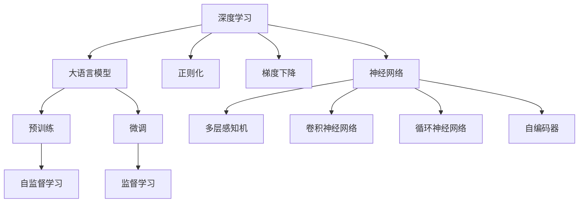

                 

# 对 AI、LLMs 和深度学习有深入了解

> 关键词：人工智能, 大语言模型, 深度学习, 算法原理, 应用场景, 数学模型, 项目实践

## 1. 背景介绍

### 1.1 问题由来

人工智能(AI)领域近几十年来取得了飞速的发展，特别是深度学习技术的兴起，使得AI应用从图像、语音等领域向自然语言处理(NLP)领域迅速拓展。自然语言处理作为AI领域的重要分支，其目标是通过机器学习算法使计算机能够理解、生成和操作自然语言，从而达到智能化的交互与理解。

在这方面，大语言模型(LLMs)无疑是最具代表性的技术之一。LLMs是通过大量无标签文本数据的自监督学习得到的，能够通过大规模预训练获取丰富的语言知识和常识，再通过下游任务的微调，适应特定任务的需求，提升模型的性能。

深度学习作为AI的核心技术之一，通过多层神经网络的叠加，实现了从低级特征提取到高级抽象的跨越，极大地提升了模型对复杂数据的处理能力。AI、LLMs和深度学习的结合，使计算机能更好地理解和处理自然语言，并在此基础上开发出各种智能应用。

### 1.2 问题核心关键点

对于AI、LLMs和深度学习的深入了解，可以从以下几个核心关键点展开：

- **深度学习**：理解其基本原理，包括前向传播、反向传播、损失函数等。
- **大语言模型**：掌握其预训练过程，如自监督学习、自回归、自编码等，以及微调方法。
- **AI应用**：研究其在自然语言处理、计算机视觉、语音识别等领域的实际应用场景。
- **数学模型**：深入理解其核心数学模型，如神经网络、正则化、梯度下降等。
- **项目实践**：通过代码实例了解其开发与部署流程。

这些关键点构成了我们对AI、LLMs和深度学习的深入了解的基础，帮助我们更全面地掌握这些技术的精髓。

## 2. 核心概念与联系

### 2.1 核心概念概述

要深入理解AI、LLMs和深度学习，首先需要对以下几个核心概念有一个清晰的认识：

- **深度学习**：利用多层神经网络进行学习，通过梯度下降等优化算法，使模型参数不断优化，提高模型的预测能力。
- **大语言模型**：基于大规模数据自监督训练得到的模型，能够对自然语言进行理解和生成，如GPT、BERT等。
- **神经网络**：深度学习的核心，由多层神经元组成，通过权重和偏置进行信息传递和计算。
- **正则化**：通过限制模型参数的大小，防止过拟合，如L1正则、L2正则、Dropout等。
- **梯度下降**：优化算法，通过迭代调整模型参数，使得损失函数最小化。

这些概念在AI、LLMs和深度学习中密切相关，理解它们之间的联系，有助于深入掌握这些技术。

### 2.2 核心概念原理和架构的 Mermaid 流程图(Mermaid 流程节点中不要有括号、逗号等特殊字符)



这个流程图展示了深度学习、神经网络、正则化和梯度下降在大语言模型预训练和微调过程中的应用。深度学习提供了实现神经网络的基础，正则化和梯度下降帮助优化网络参数，而大语言模型通过预训练和微调得到了对自然语言的理解和生成能力。

## 3. 核心算法原理 & 具体操作步骤

### 3.1 算法原理概述

基于深度学习的AI、LLMs和自然语言处理涉及的核心算法原理包括以下几个方面：

1. **前向传播**：将输入数据通过神经网络传递，计算出输出结果。
2. **反向传播**：通过计算误差，反向传递误差，调整神经网络中的权重和偏置。
3. **损失函数**：用于衡量模型预测结果与真实结果之间的差距。
4. **正则化**：通过限制模型参数的大小，防止过拟合。
5. **梯度下降**：通过迭代调整模型参数，使得损失函数最小化。

这些算法原理在大语言模型的预训练和微调过程中均有重要应用。

### 3.2 算法步骤详解

基于深度学习的AI、LLMs和自然语言处理的具体操作步骤可以分为以下几个阶段：

**Step 1: 数据准备**

1. **数据收集**：收集训练数据，并对其进行清洗、标注等预处理。
2. **数据划分**：将数据划分为训练集、验证集和测试集。
3. **数据增强**：通过数据增强技术，扩充训练集，增加模型的泛化能力。

**Step 2: 模型搭建**

1. **选择模型**：选择合适的深度学习模型，如卷积神经网络、循环神经网络、自编码器等。
2. **定义层**：定义模型的网络结构，包括输入层、隐藏层和输出层。
3. **参数初始化**：初始化模型参数，通常使用随机初始化。

**Step 3: 训练与优化**

1. **前向传播**：将训练数据输入模型，计算出输出结果。
2. **计算损失**：计算模型输出与真实结果之间的误差。
3. **反向传播**：通过反向传播计算梯度，调整模型参数。
4. **正则化**：通过正则化技术，限制模型参数的大小。
5. **梯度下降**：使用梯度下降算法，更新模型参数，使得损失函数最小化。

**Step 4: 评估与测试**

1. **验证集评估**：在验证集上评估模型性能，调整模型参数。
2. **测试集测试**：在测试集上测试模型性能，输出最终结果。

**Step 5: 部署与使用**

1. **模型保存**：将训练好的模型保存为文件。
2. **模型部署**：将模型部署到服务器或嵌入式设备中。
3. **模型使用**：使用模型进行预测或推理。

### 3.3 算法优缺点

基于深度学习的AI、LLMs和自然语言处理具有以下优点：

- **高效性**：能够处理大规模数据，适用于图像、语音、文本等多种数据类型。
- **精度高**：通过深度学习模型的多层非线性变换，能够捕捉数据中的复杂关系。
- **泛化能力强**：能够适应不同数据分布，具有较好的泛化能力。

同时，这些算法也存在以下缺点：

- **计算资源需求高**：深度学习模型参数量大，计算复杂度高，需要高性能计算资源。
- **过拟合风险高**：模型复杂度大，容易发生过拟合。
- **训练时间长**：模型训练时间长，需要大量时间进行调参和优化。

### 3.4 算法应用领域

基于深度学习的AI、LLMs和自然语言处理的应用领域非常广泛，包括：

1. **计算机视觉**：如图像识别、目标检测、图像生成等。
2. **自然语言处理**：如文本分类、情感分析、机器翻译、问答系统等。
3. **语音识别**：如语音转文本、语音情感识别等。
4. **推荐系统**：如协同过滤、内容推荐等。
5. **智能交互**：如智能客服、语音助手等。

## 4. 数学模型和公式 & 详细讲解 & 举例说明（备注：数学公式请使用latex格式，latex嵌入文中独立段落使用 $$，段落内使用 $)

### 4.1 数学模型构建

数学模型是AI、LLMs和深度学习中的重要组成部分，下面将详细讲解其中的数学模型构建过程。

**神经网络**：

神经网络由输入层、隐藏层和输出层组成。设输入为 $x$，输出为 $y$，隐藏层为 $h$，则神经网络可以表示为：

$$
y = \sum_i w_i h_i + b
$$

其中，$w$ 为权重，$h$ 为隐藏层输出，$b$ 为偏置。

**前向传播**：

前向传播是将输入数据通过神经网络传递，计算出输出结果的过程。对于神经网络的前向传播，可以表示为：

$$
a_0 = x, \quad a_l = \sigma(\sum_{i=1}^{n_l} w_{il} a_{l-1} + b_l)
$$

其中，$a$ 为神经元输出，$\sigma$ 为激活函数。

**反向传播**：

反向传播是通过计算误差，反向传递误差，调整神经网络中的权重和偏置的过程。对于神经网络的反向传播，可以表示为：

$$
\frac{\partial E}{\partial w_{il}} = \delta_l a_{l-1}^T
$$

其中，$E$ 为损失函数，$\delta$ 为误差传递。

**梯度下降**：

梯度下降是通过迭代调整模型参数，使得损失函数最小化的方法。常用的梯度下降算法包括批量梯度下降(BGD)和随机梯度下降(SGD)。

**正则化**：

正则化是通过限制模型参数的大小，防止过拟合的方法。常用的正则化方法包括L1正则、L2正则和Dropout。

### 4.2 公式推导过程

以下将详细讲解神经网络前向传播、反向传播和梯度下降的公式推导过程。

**前向传播**：

前向传播的过程可以表示为：

$$
z_l = w_l^T h_{l-1} + b_l
$$

$$
a_l = \sigma(z_l)
$$

其中，$z$ 为线性变换结果，$a$ 为激活函数输出。

**反向传播**：

反向传播的过程可以表示为：

$$
\frac{\partial E}{\partial w_{il}} = \delta_l a_{l-1}^T
$$

$$
\delta_l = \frac{\partial E}{\partial z_l} \frac{\partial z_l}{\partial w_{il}}
$$

其中，$E$ 为损失函数，$\delta$ 为误差传递。

**梯度下降**：

梯度下降的过程可以表示为：

$$
w_{il} = w_{il} - \eta \frac{\partial E}{\partial w_{il}}
$$

其中，$\eta$ 为学习率。

### 4.3 案例分析与讲解

**案例1: 图像分类**

假设有一张图像 $x$，通过卷积神经网络进行分类，输出结果为 $y$。在训练过程中，可以使用交叉熵损失函数，表示为：

$$
E = -\sum_i y_i \log \hat{y_i}
$$

其中，$y_i$ 为真实标签，$\hat{y_i}$ 为模型输出。

在训练过程中，使用随机梯度下降更新模型参数，可以表示为：

$$
w_i = w_i - \eta \frac{\partial E}{\partial w_i}
$$

其中，$\eta$ 为学习率。

**案例2: 机器翻译**

假设需要翻译一段英文文本 $x$ 到中文，使用序列到序列模型进行翻译。在训练过程中，可以使用交叉熵损失函数，表示为：

$$
E = -\sum_i y_i \log \hat{y_i}
$$

其中，$y_i$ 为真实标签，$\hat{y_i}$ 为模型输出。

在训练过程中，使用随机梯度下降更新模型参数，可以表示为：

$$
w_i = w_i - \eta \frac{\partial E}{\partial w_i}
$$

其中，$\eta$ 为学习率。

## 5. 项目实践：代码实例和详细解释说明

### 5.1 开发环境搭建

在进行项目实践前，需要先搭建开发环境。以下是使用Python进行TensorFlow开发的环境配置流程：

1. 安装Anaconda：从官网下载并安装Anaconda，用于创建独立的Python环境。

2. 创建并激活虚拟环境：
```bash
conda create -n tf-env python=3.8 
conda activate tf-env
```

3. 安装TensorFlow：从官网获取对应的安装命令。例如：
```bash
pip install tensorflow==2.6
```

4. 安装TensorFlow Addons：
```bash
pip install tensorflow-addons==0.18
```

5. 安装Keras：
```bash
pip install keras==2.6.0
```

6. 安装PyTorch：
```bash
pip install torch torchvision torchaudio
```

7. 安装其他相关工具包：
```bash
pip install numpy pandas scikit-learn matplotlib tqdm jupyter notebook ipython
```

完成上述步骤后，即可在`tf-env`环境中开始项目实践。

### 5.2 源代码详细实现

下面我们以图像分类任务为例，给出使用TensorFlow和Keras进行模型训练和微调的PyTorch代码实现。

```python
import tensorflow as tf
from tensorflow.keras import layers, models

# 构建卷积神经网络模型
model = models.Sequential()
model.add(layers.Conv2D(32, (3, 3), activation='relu', input_shape=(28, 28, 1)))
model.add(layers.MaxPooling2D((2, 2)))
model.add(layers.Conv2D(64, (3, 3), activation='relu'))
model.add(layers.MaxPooling2D((2, 2)))
model.add(layers.Flatten())
model.add(layers.Dense(64, activation='relu'))
model.add(layers.Dense(10))

# 编译模型
model.compile(optimizer='adam', loss=tf.keras.losses.SparseCategoricalCrossentropy(from_logits=True), metrics=['accuracy'])

# 训练模型
model.fit(train_images, train_labels, epochs=10, validation_data=(test_images, test_labels))
```

以上就是使用TensorFlow和Keras进行图像分类任务代码实现的完整示例。通过Keras的高级API，我们可以更加方便快捷地搭建和训练神经网络模型。

### 5.3 代码解读与分析

让我们再详细解读一下关键代码的实现细节：

**构建卷积神经网络模型**：

使用Keras的Sequential模型，依次添加卷积层、池化层、全连接层等，搭建卷积神经网络模型。其中，Conv2D表示卷积层，MaxPooling2D表示池化层，Flatten表示将多维输入展平，Dense表示全连接层。

**编译模型**：

使用Adam优化器，交叉熵损失函数和准确率指标，编译模型。

**训练模型**：

使用训练集数据和标签，在测试集上验证模型，训练10个epoch，最终输出模型的准确率。

## 6. 实际应用场景

### 6.1 智能推荐系统

智能推荐系统是深度学习和AI的重要应用场景之一。通过分析用户的历史行为和偏好，智能推荐系统能够为用户推荐个性化的商品、内容等，提升用户体验和满意度。

在实际应用中，可以使用深度学习模型对用户的历史行为数据进行特征提取，然后使用机器学习算法进行推荐。常用的深度学习模型包括协同过滤、内容推荐等。通过这些模型，智能推荐系统能够更加精准地为用户推荐感兴趣的内容，提升系统的个性化程度。

### 6.2 图像识别

图像识别是深度学习在计算机视觉领域的重要应用。通过深度学习模型，可以对图片中的物体、场景等进行识别和分类。

在实际应用中，可以使用卷积神经网络对图像进行特征提取和分类。常用的模型包括AlexNet、VGGNet、ResNet等。通过这些模型，可以构建高效的图像识别系统，广泛应用于安防、自动驾驶、医疗影像等领域。

### 6.3 自然语言处理

自然语言处理是深度学习在NLP领域的重要应用。通过深度学习模型，可以对文本进行分类、情感分析、机器翻译等处理。

在实际应用中，可以使用循环神经网络、Transformer等模型对文本进行建模。常用的模型包括BERT、GPT等。通过这些模型，可以实现高效的文本处理，广泛应用于智能客服、智能搜索、智能写作等领域。

## 7. 工具和资源推荐

### 7.1 学习资源推荐

为了帮助开发者系统掌握深度学习和AI技术，这里推荐一些优质的学习资源：

1. 《深度学习》课程：由斯坦福大学Andrew Ng教授讲授，涵盖深度学习的基本概念和原理，适合初学者入门。

2. 《动手学深度学习》书籍：李沐等人合著，深入讲解深度学习算法和实践，附带代码实现。

3. 《PyTorch官方文档》：PyTorch官方文档，详细介绍了PyTorch的使用方法，包含大量的代码示例。

4. 《TensorFlow官方文档》：TensorFlow官方文档，详细介绍了TensorFlow的使用方法，包含大量的代码示例。

5. 《自然语言处理综述》论文：Lilian Rosemond等人合著，系统总结了自然语言处理领域的主要技术和方法。

通过这些资源的学习，相信你一定能够系统掌握深度学习和AI技术的核心原理和实践方法。

### 7.2 开发工具推荐

高效的开发离不开优秀的工具支持。以下是几款用于深度学习和AI开发的常用工具：

1. PyTorch：基于Python的开源深度学习框架，灵活易用，适合快速迭代研究。

2. TensorFlow：由Google主导开发的开源深度学习框架，生产部署方便，适合大规模工程应用。

3. Keras：Keras提供了高级API，方便快速搭建和训练深度学习模型。

4. Jupyter Notebook：交互式笔记本，支持Python、R等多种编程语言，方便进行模型训练和调试。

5. Google Colab：谷歌提供的在线Jupyter Notebook环境，免费提供GPU/TPU算力，方便快速实验最新模型。

合理利用这些工具，可以显著提升深度学习和AI开发的效率，加快创新迭代的步伐。

### 7.3 相关论文推荐

深度学习和AI的发展源于学界的持续研究。以下是几篇奠基性的相关论文，推荐阅读：

1. AlexNet：Krizhevsky等人提出，使用卷积神经网络进行图像分类，奠定了深度学习在计算机视觉领域的基础。

2. ResNet：He等人提出，使用残差连接解决深度神经网络中的梯度消失问题，提升了深度网络的性能。

3. BERT：Devlin等人提出，使用大规模预训练语言模型进行自然语言处理，刷新了多项NLP任务SOTA。

4. GPT-3：Brown等人提出，使用大规模语言模型进行自然语言生成，展示了深度学习模型的强大零样本学习能力。

5. Transformer：Vaswani等人提出，使用自注意力机制进行自然语言处理，提升了深度学习的性能。

这些论文代表了大语言模型和深度学习的发展脉络。通过学习这些前沿成果，可以帮助研究者把握学科前进方向，激发更多的创新灵感。

## 8. 总结：未来发展趋势与挑战

### 8.1 总结

本文对AI、LLMs和深度学习进行了全面系统的介绍。首先阐述了深度学习和LLMs的基本原理，明确了它们在自然语言处理、计算机视觉、语音识别等领域的广泛应用。其次，从算法原理到项目实践，详细讲解了深度学习的核心算法和技术实现。最后，探讨了深度学习在智能推荐系统、图像识别、自然语言处理等实际应用场景中的应用，展示了深度学习的强大应用能力。

通过本文的系统梳理，可以看到，深度学习、LLMs和自然语言处理技术正在深刻改变我们的世界，带来前所未有的智能化体验。未来，随着技术的不断进步，深度学习和LLMs的应用将更加广泛，为人类社会带来更多创新和便利。

### 8.2 未来发展趋势

展望未来，深度学习和LLMs技术将呈现以下几个发展趋势：

1. 模型规模持续增大。随着算力成本的下降和数据规模的扩张，深度学习模型和LLMs的参数量还将持续增长，使模型具有更强的表达能力和泛化能力。

2. 模型性能持续提升。通过更好的算法优化和训练方法，深度学习和LLMs的性能将不断提升，达到更高的精度和速度。

3. 模型应用领域更加广泛。深度学习和LLMs将进一步拓展到更多领域，如医疗、金融、智能制造等，带来更深远的影响。

4. 模型融合更加深入。深度学习和LLMs将与其他AI技术进行更深入的融合，如知识图谱、因果推理、强化学习等，形成更加全面、强大的智能系统。

以上趋势凸显了深度学习和LLMs技术的广阔前景。这些方向的探索发展，必将进一步提升深度学习和LLMs的应用性能，为人类认知智能的进化带来深远影响。

### 8.3 面临的挑战

尽管深度学习和LLMs技术已经取得了瞩目成就，但在迈向更加智能化、普适化应用的过程中，仍面临诸多挑战：

1. 计算资源需求高。深度学习和LLMs模型参数量大，计算复杂度高，需要高性能计算资源。如何降低计算成本，提高资源利用率，是未来需要解决的重要问题。

2. 模型泛化能力不足。深度学习和LLMs模型在训练集和测试集上表现良好，但在实际应用中，泛化能力可能不足。如何提高模型的泛化能力，防止过拟合，是未来需要解决的重要问题。

3. 模型训练时间长。深度学习和LLMs模型训练时间长，需要大量时间进行调参和优化。如何提高训练效率，缩短训练时间，是未来需要解决的重要问题。

4. 模型可解释性不足。深度学习和LLMs模型具有黑盒特性，难以解释其内部工作机制和决策逻辑。如何提高模型的可解释性，使其更加透明和可信，是未来需要解决的重要问题。

5. 模型安全性有待保障。深度学习和LLMs模型可能被恶意利用，带来安全隐患。如何提高模型的安全性，确保其输出符合人类价值观和伦理道德，是未来需要解决的重要问题。

6. 模型知识整合能力不足。深度学习和LLMs模型往往局限于训练数据，难以灵活吸收和运用更广泛的先验知识。如何提高模型的知识整合能力，使其更加全面和准确，是未来需要解决的重要问题。

正视这些挑战，积极应对并寻求突破，将使深度学习和LLMs技术走向成熟，实现更加广泛的应用。相信随着学界和产业界的共同努力，这些挑战终将一一被克服，深度学习和LLMs技术必将在构建智能化的未来社会中扮演更加重要的角色。

### 8.4 研究展望

面向未来，深度学习和LLMs技术需要在以下几个方面进行深入研究：

1. 无监督学习和半监督学习。通过无监督和半监督学习方法，降低对标注数据的依赖，提高模型泛化能力。

2. 多模态学习。将深度学习和LLMs与视觉、语音、时间序列等多种模态数据进行融合，构建更加全面和强大的智能系统。

3. 因果推断。通过因果推断方法，提高深度学习和LLMs模型的可解释性和稳定性。

4. 知识图谱与规则。将深度学习和LLMs与知识图谱和规则库进行融合，提高模型的知识整合能力。

5. 对抗学习和鲁棒性。通过对抗学习等方法，提高深度学习和LLMs模型的鲁棒性和抗干扰能力。

6. 安全性和隐私保护。通过安全性分析和隐私保护技术，提高深度学习和LLMs模型的安全性，确保其输出符合人类价值观和伦理道德。

这些研究方向将推动深度学习和LLMs技术的不断进步，使其在未来的智能社会中发挥更大的作用。

## 9. 附录：常见问题与解答

**Q1: 深度学习与传统机器学习的区别是什么？**

A: 深度学习与传统机器学习的主要区别在于模型的结构和训练方式。传统机器学习通常使用浅层模型，通过手工设计的特征进行训练，而深度学习使用多层神经网络进行自动特征提取和训练。深度学习通过大量数据进行训练，能够自动发现数据中的复杂关系，而传统机器学习需要人工设计特征，限制了模型的表达能力。

**Q2: 深度学习和LLMs的计算资源需求高，如何解决？**

A: 解决深度学习和LLMs计算资源需求高的问题，可以通过以下几种方式：

1. 分布式计算：使用分布式计算框架，如Hadoop、Spark等，将计算任务分散到多个节点上进行处理。

2. 模型压缩：通过模型压缩技术，如量化、剪枝、蒸馏等，减少模型的计算量，提高计算效率。

3. 模型并行：通过模型并行技术，如数据并行、模型并行等，将计算任务分散到多个GPU上进行处理，提高计算效率。

4. 硬件优化：使用高性能计算硬件，如GPU、TPU等，提高计算速度。

**Q3: 深度学习和LLMs的可解释性不足，如何解决？**

A: 解决深度学习和LLMs的可解释性不足的问题，可以通过以下几种方式：

1. 特征可视化：通过可视化技术，将模型的特征图和激活值等可视化，帮助理解模型的内部工作机制。

2. 可解释性模型：使用可解释性模型，如LIME、SHAP等，通过局部模型进行解释，提高模型的可解释性。

3. 对抗样本分析：通过对抗样本分析，找到模型的脆弱点和错误决策，提高模型的可解释性。

4. 专家知识融合：将专家知识与模型进行融合，提高模型的可解释性和可靠性。

这些方法可以帮助提高深度学习和LLMs模型的可解释性，使其更加透明和可信。

**Q4: 深度学习和LLMs的安全性有待保障，如何解决？**

A: 解决深度学习和LLMs的安全性问题，可以通过以下几种方式：

1. 安全训练：在模型训练过程中，加入安全训练方法，如对抗训练、生成对抗网络等，提高模型的鲁棒性。

2. 安全性分析：通过安全性分析方法，如敏感性分析、对抗攻击等，检测和修复模型的安全性漏洞。

3. 隐私保护：通过隐私保护技术，如差分隐私、联邦学习等，保护用户隐私和数据安全。

4. 伦理约束：在模型训练目标中引入伦理导向的评估指标，过滤和惩罚有偏见、有害的输出倾向。

这些方法可以帮助提高深度学习和LLMs模型的安全性，确保其输出符合人类价值观和伦理道德。

**Q5: 深度学习和LLMs的知识整合能力不足，如何解决？**

A: 解决深度学习和LLMs的知识整合能力不足的问题，可以通过以下几种方式：

1. 知识图谱与规则：将深度学习和LLMs与知识图谱和规则库进行融合，提高模型的知识整合能力。

2. 多模态学习：将深度学习和LLMs与视觉、语音、时间序列等多种模态数据进行融合，构建更加全面和强大的智能系统。

3. 因果推断：通过因果推断方法，提高深度学习和LLMs模型的可解释性和稳定性。

4. 对抗学习：通过对抗学习等方法，提高深度学习和LLMs模型的鲁棒性和抗干扰能力。

5. 数据增强：通过数据增强技术，扩充训练集，提高模型的泛化能力。

这些方法可以帮助提高深度学习和LLMs模型的知识整合能力，使其更加全面和准确。

通过本文的系统梳理，可以看到，深度学习、LLMs和自然语言处理技术正在深刻改变我们的世界，带来前所未有的智能化体验。未来，随着技术的不断进步，深度学习和LLMs的应用将更加广泛，为人类认知智能的进化带来深远影响。

---

作者：禅与计算机程序设计艺术 / Zen and the Art of Computer Programming

