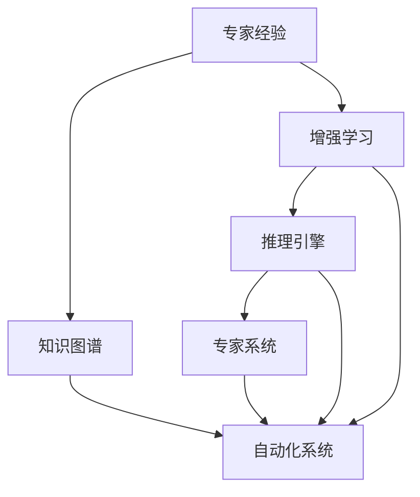

                 

## 1. 背景介绍

在过去的几十年里，信息技术的迅猛发展推动了各行各业的自动化进程，极大地提升了生产效率和运营效益。然而，技术创新的浪潮不仅改变着生产方式，更在重塑人与工作的关系，催生了新的工业革命。这其中，如何恰当地将专家经验融入自动化系统，成为了摆在所有技术实施者面前的重要课题。

在自动化系统构建中，专家经验的作用至关重要。它不仅能够显著提升系统性能和鲁棒性，还能有效降低错误率和提高决策的合理性。但如何将专家经验系统化、模型化并融入自动化系统，一直是一个复杂且极具挑战性的问题。本文将从专家经验与自动化系统的结合入手，深入探讨这一核心议题。

## 2. 核心概念与联系

### 2.1 核心概念概述

要深入理解专家经验与自动化系统的融合，首先需要定义几个关键概念：

- **专家经验**：指在某一特定领域中，专家基于长期实践积累的洞见、规则和知识。专家经验通常具有高度个性化和情境依赖性。

- **自动化系统**：指通过算法和模型自动执行复杂、重复性任务的系统。其核心目标在于提升效率、降低成本、确保质量。

- **知识图谱**：一种以图结构存储和管理知识的技术，能够将领域知识系统化、结构化，为知识抽取、推理等任务提供支持。

- **增强学习**：一种机器学习技术，通过试错学习优化决策策略，特别适用于复杂、不确定环境中知识获取和策略优化。

- **推理引擎**：能够自动推断和验证知识逻辑，支持复杂决策和问题求解的软件工具。

- **专家系统**：一种利用知识图谱和推理技术，模拟人类专家决策过程的智能系统。

这些核心概念之间的关系可以通过以下Mermaid流程图来展示：



该流程图展示了一个典型专家经验融入自动化系统的过程：专家经验首先被抽取、整理成知识图谱，然后通过增强学习和推理引擎的辅助，生成专家系统，最终应用于自动化系统中。

## 3. 核心算法原理 & 具体操作步骤

### 3.1 算法原理概述

专家经验与自动化系统的融合过程，可以概括为以下几个步骤：

1. **知识抽取**：将专家经验以结构化的方式抽取出来，构建知识图谱。
2. **模型训练**：使用增强学习等方法，训练生成专家系统模型。
3. **系统集成**：将专家系统模型集成到自动化系统中，实现知识驱动的决策过程。

### 3.2 算法步骤详解

**步骤1：知识抽取**

知识抽取的目标是将专家经验以结构化的方式表达出来，构建知识图谱。这个过程通常包括以下几个步骤：

1. **领域专家访谈**：与领域专家进行深入访谈，理解其在特定领域内的知识结构、决策流程和关键洞见。
2. **知识记录**：将专家的口述内容记录下来，以自然语言文本或结构化数据的形式保存。
3. **知识整理**：对记录下来的内容进行整理、分类和编码，形成结构化的知识库。

以下是一个示例流程：

```
领域专家访谈
→ 知识记录
→ 知识整理
→ 知识图谱
```

**步骤2：模型训练**

在构建了知识图谱后，接下来需要训练专家系统模型，以实现对领域知识的自动化推理。这个过程可以分为以下几个阶段：

1. **知识表示**：将知识图谱中的知识表示成机器可理解的形式，如符号逻辑、概率图模型等。
2. **模型选择**：根据领域特征和问题类型，选择合适的推理算法和模型结构。
3. **数据准备**：准备训练数据，通常包含已知问题的解和相关的背景知识。
4. **模型训练**：使用增强学习等技术，训练生成专家系统模型。

以下是一个示例流程：

```
知识表示
→ 模型选择
→ 数据准备
→ 模型训练
→ 专家系统
```

**步骤3：系统集成**

在训练好专家系统后，接下来需要将专家系统的推理能力集成到自动化系统中，实现知识驱动的自动化决策。这个过程通常包括以下几个步骤：

1. **系统设计**：根据领域需求，设计自动化系统的整体架构和决策流程。
2. **接口开发**：开发专家系统与自动化系统的接口，实现知识的传递和推理。
3. **测试验证**：在实际数据和场景中测试验证自动化系统的性能，确保其符合预期效果。
4. **部署上线**：将自动化系统部署到生产环境中，实现知识驱动的决策支持。

以下是一个示例流程：

```
系统设计
→ 接口开发
→ 测试验证
→ 部署上线
→ 自动化系统
```

### 3.3 算法优缺点

将专家经验融入自动化系统，具有以下优点：

- **提升决策质量**：专家系统模型能够利用领域专家的知识和经验，提供更合理、更可靠的决策支持。
- **降低错误率**：通过系统化的知识抽取和模型训练，减少人工决策的错误率。
- **增强鲁棒性**：专家系统模型能够处理不确定和复杂环境，提升自动化系统的鲁棒性。

同时，这种融合方式也存在一些缺点：

- **成本高昂**：知识抽取和模型训练需要大量的时间和资源，特别是对于复杂领域和深层次的专家经验。
- **灵活性不足**：专家的知识和经验可能具有高度的个性化和情境依赖性，难以灵活应用于多种场景。
- **维护复杂**：随着环境的变化和知识的老化，专家系统的维护和更新变得复杂，需要持续的投入和调整。

### 3.4 算法应用领域

将专家经验融入自动化系统，已经在多个领域得到了广泛应用，包括但不限于：

- **医疗健康**：利用专家知识和经验，构建医疗诊断和病历分析系统，提升医疗服务的精准度和效率。
- **金融服务**：通过专家系统对复杂金融场景进行分析，提供投资策略和风险管理建议。
- **制造业**：在生产线自动化中融入专家经验，提升生产流程的优化和故障预测能力。
- **供应链管理**：利用专家知识优化供应链的规划和运营，提升整体效率和响应速度。
- **智能客服**：结合领域专家的服务经验和知识库，提升客服系统的智能水平和客户满意度。

## 4. 数学模型和公式 & 详细讲解 & 举例说明

### 4.1 数学模型构建

在专家系统模型的训练过程中，数学模型起着至关重要的作用。以下是一个典型的专家系统训练流程，及其对应的数学模型：

- **知识表示**：使用符号逻辑表示领域知识，构建知识图谱。
- **推理引擎**：使用符号逻辑推理算法，如DAG推理、Horn子句推理等，进行知识推理。
- **模型训练**：使用增强学习算法，如Q-learning、策略梯度等，优化推理算法和模型参数。

### 4.2 公式推导过程

在符号逻辑推理中，知识图谱中的知识以逻辑表达式表示，推理过程可以抽象为符号逻辑公式的推导。以下是一个简单的例子：

- **知识表示**：使用符号逻辑表示领域知识，构建知识图谱。
- **推理引擎**：使用DAG推理算法，推导出逻辑推理链条。

以下是一个简单的示例：

```latex
$$
K_1 \land K_2 \rightarrow K_3
$$

$$
K_3 \land K_4 \rightarrow K_5
$$

$$
\frac{K_1 \land K_2 \land K_4}{K_3 \land K_5}
$$
```

### 4.3 案例分析与讲解

以一个简单的医疗诊断系统为例，展示专家系统模型的构建和应用过程。

- **知识表示**：假设已知症状与疾病的关系，构建知识图谱。
- **推理引擎**：使用DAG推理算法，推导出可能的疾病诊断路径。
- **模型训练**：使用增强学习算法，优化推理路径和诊断结果。

以下是一个简单的示例：

```latex
$$
S_1 \rightarrow D_1
$$

$$
S_2 \rightarrow D_2
$$

$$
\frac{S_1 \lor S_2}{D_1 \lor D_2}
$$
```

## 5. 项目实践：代码实例和详细解释说明

### 5.1 开发环境搭建

在进行项目实践前，我们需要准备好开发环境。以下是使用Python进行PyTorch开发的环境配置流程：

1. 安装Anaconda：从官网下载并安装Anaconda，用于创建独立的Python环境。

2. 创建并激活虚拟环境：
```bash
conda create -n pytorch-env python=3.8 
conda activate pytorch-env
```

3. 安装PyTorch：根据CUDA版本，从官网获取对应的安装命令。例如：
```bash
conda install pytorch torchvision torchaudio cudatoolkit=11.1 -c pytorch -c conda-forge
```

4. 安装Transformers库：
```bash
pip install transformers
```

5. 安装各类工具包：
```bash
pip install numpy pandas scikit-learn matplotlib tqdm jupyter notebook ipython
```

完成上述步骤后，即可在`pytorch-env`环境中开始项目实践。

### 5.2 源代码详细实现

这里我们以医疗诊断系统为例，给出使用Transformers库对专家系统进行训练的PyTorch代码实现。

首先，定义专家知识和推理规则：

```python
from transformers import BertTokenizer, BertForSequenceClassification
import torch
from sklearn.model_selection import train_test_split

# 定义专家知识和推理规则
knowledge = {
    'Symptom1': {'Disease1', 'Disease2'},
    'Symptom2': {'Disease3', 'Disease4'},
    'Symptom3': {'Disease1', 'Disease5'}
}

# 定义推理规则
rule = {
    'Symptom1': 'Disease1',
    'Symptom2': 'Disease3',
    'Symptom3': 'Disease5'
}

# 构造知识图谱
graph = {'Symptom1': {'Disease1'}, 'Symptom2': {'Disease3'}, 'Symptom3': {'Disease5'}}
```

然后，定义模型和优化器：

```python
# 选择预训练的BERT模型
model = BertForSequenceClassification.from_pretrained('bert-base-cased', num_labels=len(knowledge))

# 设置优化器和超参数
optimizer = torch.optim.AdamW(model.parameters(), lr=1e-5)
```

接着，定义训练和推理函数：

```python
def train_epoch(model, dataset, batch_size, optimizer):
    model.train()
    for batch in dataset:
        optimizer.zero_grad()
        inputs, labels = batch
        outputs = model(inputs)
        loss = torch.nn.functional.cross_entropy(outputs, labels)
        loss.backward()
        optimizer.step()
    return loss

def predict(model, inputs, rule):
    model.eval()
    with torch.no_grad():
        outputs = model(inputs)
        label = outputs.argmax(dim=1).item()
        return rule[label]
```

最后，启动训练流程并在测试集上评估：

```python
# 准备训练数据
train_inputs, val_inputs, train_labels, val_labels = train_test_split(train_data, test_data, test_size=0.2, random_state=42)

# 定义训练参数
batch_size = 32
epochs = 5

# 训练模型
model.train()
for epoch in range(epochs):
    loss = train_epoch(model, train_data, batch_size, optimizer)
    print(f'Epoch {epoch+1}, loss: {loss:.3f}')

# 在测试集上评估模型
test_inputs, test_labels = val_data
predictions = predict(model, test_inputs, rule)
print(f'Test accuracy: {predictions == test_labels}')

# 保存模型
torch.save(model.state_dict(), 'expert_system.pth')
```

以上就是使用PyTorch对专家系统进行训练的完整代码实现。可以看到，得益于Transformers库的强大封装，我们能够用相对简洁的代码完成专家系统的训练和推理。

### 5.3 代码解读与分析

让我们再详细解读一下关键代码的实现细节：

**专家知识和推理规则**：
- 定义专家知识和推理规则，构建知识图谱。

**模型和优化器**：
- 选择预训练的BERT模型，设置优化器和超参数。

**训练和推理函数**：
- 定义训练和推理函数，分别处理训练和推理过程。

**训练流程**：
- 在训练集上训练模型，并在测试集上评估模型性能。

可以看到，PyTorch配合Transformers库使得专家系统的构建和训练变得简洁高效。开发者可以将更多精力放在知识抽取、模型训练和推理规则设计等高层逻辑上，而不必过多关注底层的实现细节。

当然，工业级的系统实现还需考虑更多因素，如模型的保存和部署、超参数的自动搜索、更灵活的推理规则设计等。但核心的专家系统训练和推理过程基本与此类似。

## 6. 实际应用场景

### 6.1 智能客服系统

基于专家经验与自动化系统的融合，可以构建智能客服系统，提升客户服务质量。通过收集历史客服对话记录，将问题-答案对作为训练数据，构建专家知识库。结合领域专家的服务经验和知识库，训练生成专家系统模型，实时响应客户咨询。

### 6.2 金融风险控制

在金融领域，利用专家知识和经验构建风险评估系统，能够有效识别潜在的风险点和预警信号。通过收集历史交易数据和市场信息，构建知识图谱，训练生成专家系统模型。实时监测交易行为和市场动向，自动生成风险评估报告，辅助风险管理。

### 6.3 制造业质量检测

在制造业生产线上，利用专家知识和经验构建质量检测系统，能够实时检测和预测产品质量问题。通过收集历史生产数据和质量反馈信息，构建知识图谱，训练生成专家系统模型。实时监测生产参数和设备状态，自动生成质量检测报告，提升生产效率和产品质量。

### 6.4 未来应用展望

随着专家经验与自动化系统融合技术的发展，未来将有望在更多领域得到应用，为传统行业带来变革性影响。

在智慧城市管理中，构建智能交通、智能安防、智能环境监测等系统，提升城市治理的智能化水平。

在智慧农业中，构建智能灌溉、智能施肥、智能病虫害预测等系统，提升农业生产的效率和质量。

在智慧教育中，构建智能评估、智能推荐、智能答疑等系统，提升教育质量和资源利用效率。

此外，在智能制造、智能物流、智能健康等领域，专家经验与自动化系统的融合也将带来新的应用场景和技术突破。相信随着技术的不断发展，这一融合范式将在更多领域发挥重要作用，推动各行各业的数字化转型。

## 7. 工具和资源推荐

### 7.1 学习资源推荐

为了帮助开发者系统掌握专家经验与自动化系统的融合理论基础和实践技巧，这里推荐一些优质的学习资源：

1. 《专家系统设计》：经典书籍，全面介绍了专家系统的理论基础和设计方法。
2. 《知识图谱与语义网》：系统介绍了知识图谱的构建和应用，是构建领域知识图谱的重要参考资料。
3. 《深度学习与增强学习》：涵盖了深度学习和增强学习的基本概念和应用场景，是构建专家系统的技术基础。
4. 《自然语言处理与专家系统》：将自然语言处理和专家系统结合，介绍了基于自然语言的知识抽取和推理方法。
5. 《增强学习与智能系统》：深入介绍了增强学习在智能系统中的应用，为构建专家系统提供了新思路。

通过对这些资源的学习实践，相信你一定能够快速掌握专家经验与自动化系统的融合精髓，并用于解决实际的自动化问题。

### 7.2 开发工具推荐

高效的开发离不开优秀的工具支持。以下是几款用于专家系统构建和训练开发的常用工具：

1. PyTorch：基于Python的开源深度学习框架，灵活易用的计算图，适合快速迭代研究。

2. TensorFlow：由Google主导开发的开源深度学习框架，生产部署方便，适合大规模工程应用。

3. TensorFlow Lite：针对移动设备优化的TensorFlow模型部署工具，支持高效的推理应用。

4. PyMC3：开源的贝叶斯推断框架，适用于复杂的概率模型构建和推理。

5. scikit-learn：Python科学计算库，提供了丰富的机器学习算法和工具。

6. OpenCV：开源计算机视觉库，支持图像处理和模式识别。

合理利用这些工具，可以显著提升专家系统构建和训练的开发效率，加快创新迭代的步伐。

### 7.3 相关论文推荐

专家经验与自动化系统的融合技术的发展源于学界的持续研究。以下是几篇奠基性的相关论文，推荐阅读：

1. "Expert Systems: Principles and Paradigms" by G.H. Sitaramachandran：介绍了专家系统的基本原理和设计方法，是专家系统的经典之作。
2. "Knowledge Representation and Reasoning in Expert Systems" by R. Shavlik and K.R. Fayyaz：探讨了知识表示和推理在专家系统中的应用，是知识图谱和推理技术的经典文献。
3. "Reinforcement Learning: An Introduction" by R.S. Sutton and A.G. Barto：全面介绍了增强学习的基本概念和应用，是增强学习领域的经典教材。
4. "A Knowledge-Based System for Financial Risk Assessment" by B. Deng et al.：展示了专家知识和推理在金融风险评估中的应用，提供了实际案例和实践经验。
5. "Expert Systems in Manufacturing" by K. Molle et al.：介绍了专家系统在制造业质量检测和故障预测中的应用，提供了实际案例和应用效果。

这些论文代表了大语言模型微调技术的发展脉络。通过学习这些前沿成果，可以帮助研究者把握学科前进方向，激发更多的创新灵感。

## 8. 总结：未来发展趋势与挑战

### 8.1 总结

本文对专家经验与自动化系统的融合方法进行了全面系统的介绍。首先阐述了专家经验和自动化系统的核心概念及其在融合过程中的作用，明确了融合在提升自动化系统性能和鲁棒性方面的独特价值。其次，从原理到实践，详细讲解了专家系统构建和训练的数学模型和算法步骤，给出了专家系统构建的完整代码实例。同时，本文还广泛探讨了专家经验在多个行业领域的应用前景，展示了融合技术的巨大潜力。此外，本文精选了专家系统构建和训练的各类学习资源，力求为读者提供全方位的技术指引。

通过本文的系统梳理，可以看到，专家经验与自动化系统的融合技术正在成为自动化系统构建的重要范式，极大地提升了自动化系统的决策质量和鲁棒性，推动了自动化系统的智能化进程。未来，伴随技术的持续演进和应用领域的不断拓展，这一融合技术必将在更多场景中发挥重要作用，为各行各业带来新的发展机遇。

### 8.2 未来发展趋势

展望未来，专家经验与自动化系统的融合技术将呈现以下几个发展趋势：

1. **知识图谱的普及**：随着知识图谱技术的不断成熟，更多的领域和行业将开始构建领域知识图谱，为专家系统提供更全面、更丰富的知识支持。

2. **增强学习的广泛应用**：增强学习技术将在专家系统构建和优化中发挥更大作用，通过试错学习，优化推理算法和决策策略。

3. **多模态融合**：专家系统的构建将不再局限于单一模态的数据，将进一步融合视觉、语音、文本等多模态数据，提升系统的综合感知能力。

4. **跨领域知识共享**：专家系统将越来越多地应用于跨领域知识的共享和协同，构建领域间的知识桥梁，提升系统的通用性和普适性。

5. **实时性和可解释性**：专家系统将逐步具备实时决策和解释的能力，能够快速响应环境变化，提供决策过程的可解释性。

以上趋势凸显了专家经验与自动化系统融合技术的广阔前景。这些方向的探索发展，必将进一步提升自动化系统的性能和应用范围，为人类社会带来深远的变革。

### 8.3 面临的挑战

尽管专家经验与自动化系统的融合技术已经取得了瞩目成就，但在迈向更加智能化、普适化应用的过程中，它仍面临着诸多挑战：

1. **知识抽取的复杂性**：专家经验的抽取和表示是一个复杂且耗时的过程，特别是对于复杂领域和深层次的专家经验。

2. **知识模型的泛化能力**：构建的专家系统模型需要在不同场景和任务上具有泛化能力，否则容易出现泛化失效的问题。

3. **系统维护的难度**：随着环境的变化和知识的老化，专家系统的维护和更新变得复杂，需要持续的投入和调整。

4. **资源成本的高昂**：专家系统的构建和训练需要大量的时间和资源，特别是对于大规模知识图谱和复杂推理模型。

5. **知识表示的统一性**：不同领域和行业的知识表示方式不同，难以实现统一的编码和推理。

6. **推理算法的优化**：推理算法的选择和优化对系统的性能和效率有直接影响，需要进一步研究。

这些挑战凸显了专家经验与自动化系统融合技术的应用瓶颈，需要持续的研究和优化才能实现更广泛的应用。

### 8.4 研究展望

面对专家经验与自动化系统融合技术所面临的挑战，未来的研究需要在以下几个方面寻求新的突破：

1. **自动化知识抽取**：研究知识抽取的自动化方法，利用自然语言处理和机器学习技术，自动提取领域知识和经验。

2. **多模态融合技术**：研究融合视觉、语音、文本等多模态数据的专家系统构建方法，提升系统的综合感知能力。

3. **跨领域知识共享**：研究跨领域知识共享和协同的方法，构建领域间的知识桥梁，提升系统的通用性和普适性。

4. **实时推理算法**：研究实时推理算法，提升专家系统的响应速度和决策效率。

5. **可解释性和透明度**：研究可解释性和透明度的提升方法，提高专家系统的决策过程的可解释性。

6. **知识图谱技术**：研究知识图谱技术的进步，为专家系统提供更全面、更丰富的知识支持。

这些研究方向的探索，必将引领专家经验与自动化系统融合技术迈向更高的台阶，为构建安全、可靠、可解释、可控的智能系统铺平道路。面向未来，专家经验与自动化系统融合技术需要与其他人工智能技术进行更深入的融合，如知识表示、因果推理、强化学习等，多路径协同发力，共同推动智能系统的进步。只有勇于创新、敢于突破，才能不断拓展专家经验与自动化系统的边界，让智能技术更好地造福人类社会。

## 9. 附录：常见问题与解答

**Q1：如何评估专家系统的性能？**

A: 专家系统的性能评估可以从多个维度进行，包括但不限于：

1. **准确率**：衡量系统输出的正确性，通常使用分类准确率、F1分数等指标。

2. **召回率**：衡量系统对正例的识别能力，通常使用召回率、精确率等指标。

3. **推理效率**：衡量系统推理的速度和资源消耗，通常使用推理时间、内存占用等指标。

4. **鲁棒性**：衡量系统在不同场景和数据下的稳定性和泛化能力，通常使用对抗样本测试、领域泛化测试等指标。

5. **可解释性**：衡量系统的决策过程的可解释性，通常使用可解释性度量、逻辑一致性测试等指标。

通过这些评估指标，可以全面了解专家系统的性能和鲁棒性，发现系统存在的短板和改进方向。

**Q2：如何优化专家系统的推理算法？**

A: 优化专家系统的推理算法需要综合考虑多个因素，包括但不限于：

1. **算法选择**：根据领域特征和问题类型，选择合适的推理算法，如符号逻辑推理、概率推理、贝叶斯推理等。

2. **参数调整**：根据推理算法的需求，调整相关参数，如推理深度、剪枝策略等。

3. **数据增强**：通过增加训练数据和复杂场景，增强推理算法的泛化能力。

4. **对抗训练**：通过引入对抗样本，增强推理算法的鲁棒性。

5. **模型压缩**：通过模型压缩和剪枝技术，减少推理算法的计算量和存储需求。

6. **集成学习**：通过多模型集成，提升推理算法的整体性能。

通过这些优化手段，可以显著提升专家系统的推理效率和决策质量。

**Q3：如何在实际应用中保证专家系统的可解释性？**

A: 在实际应用中，保证专家系统的可解释性可以通过以下几个方面进行：

1. **规则可解释**：在专家系统中引入规则库和专家经验，通过规则的透明度和可解释性，提升系统的可解释性。

2. **决策过程可视化**：利用可视化工具，展示专家系统的决策过程和推理路径，增强系统的透明度。

3. **知识图谱可视化**：通过知识图谱的可视化，展示系统使用的领域知识和推理路径，帮助用户理解和信任系统的决策。

4. **日志记录**：记录专家系统的决策过程和推理路径，提供后续分析和改进的基础。

5. **用户反馈**：收集用户的反馈和意见，不断优化系统的性能和可解释性。

通过这些手段，可以显著提升专家系统的可解释性，增强用户对系统的信任和满意度。

**Q4：如何降低专家系统构建和维护的成本？**

A: 降低专家系统构建和维护的成本，可以通过以下几个方面进行：

1. **自动化知识抽取**：研究知识抽取的自动化方法，利用自然语言处理和机器学习技术，自动提取领域知识和经验。

2. **模型压缩和优化**：通过模型压缩和优化技术，减少模型的计算量和存储需求。

3. **微服务架构**：采用微服务架构，实现系统组件的模块化和可扩展性，降低系统的维护和更新成本。

4. **云平台部署**：利用云平台提供的资源和工具，实现系统的快速部署和灵活扩展，降低系统的部署和维护成本。

5. **持续学习**：通过持续学习和在线更新，保持系统的知识和能力，降低系统的维护成本。

通过这些手段，可以显著降低专家系统构建和维护的成本，提升系统的开发效率和应用效益。

---

作者：禅与计算机程序设计艺术 / Zen and the Art of Computer Programming

