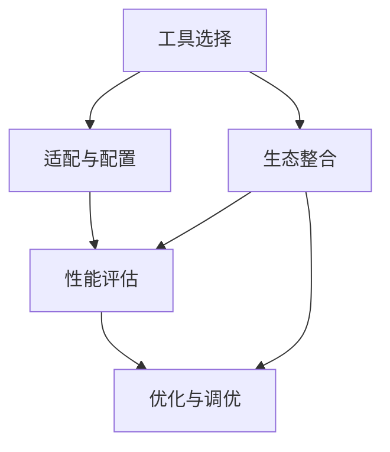

                 

# 工具使用机制在不同应用场景中的效果

> 关键词：工具使用, 应用场景, 效果分析, 技术优化

## 1. 背景介绍

在信息化时代，各类工具的使用已成为提高工作效率、实现技术创新不可或缺的一部分。然而，工具的使用效果不仅依赖于其本身的性能，还受限于应用场景的特定需求和约束。本博客将探讨不同应用场景下工具使用机制的效果，并分析如何针对具体场景进行优化。

### 1.1 问题由来

随着科技的发展，工具的种类和功能日益丰富，从编程语言、开发框架到数据库管理系统，种类繁多。但工具的效果往往因场景而异。例如，同一种编程语言在不同项目中可能有截然不同的使用效果，同一种数据库系统在不同业务模型下也可能产生不同的效果。因此，了解工具使用机制在不同场景中的效果，并进行针对性优化，变得尤为重要。

### 1.2 问题核心关键点

- **工具选择与适配**：在特定应用场景下，如何选择最合适的工具，并对其进行适配以获得最佳效果。
- **效果评估与优化**：如何评估工具在特定应用场景中的使用效果，并针对性地进行优化。
- **工具生态与整合**：如何利用现有工具生态，集成多种工具以实现更高效的工作流程。

## 2. 核心概念与联系

### 2.1 核心概念概述

为更好地理解工具使用机制在不同应用场景中的效果，本节将介绍几个关键概念：

- **工具选择(Tool Selection)**：指根据任务需求、技术栈偏好等因素，选择合适的工具。
- **适配与配置(Tuning & Configuration)**：根据具体应用场景，对工具进行参数调整、配置优化等适配工作。
- **性能评估(Performance Evaluation)**：通过定量和定性方法，评估工具在特定应用场景中的使用效果。
- **优化与调优(Optimization & Tuning)**：在评估基础上，针对性地进行优化调整，提升工具在特定场景中的效果。
- **生态整合(Ecosystem Integration)**：利用现有工具生态，集成多种工具，实现更高效的工作流程。

这些概念之间的逻辑关系可以通过以下Mermaid流程图来展示：



这个流程图展示了大工具选择、适配与配置、性能评估、优化与调优、生态整合之间的逻辑关系：

1. 首先，选择合适的工具。
2. 对所选工具进行适配与配置，以满足特定需求。
3. 评估工具在当前配置下的性能。
4. 根据评估结果进行优化与调优，提升效果。
5. 利用工具生态，集成多种工具，形成更高效的工作流程。

## 3. 核心算法原理 & 具体操作步骤

### 3.1 算法原理概述

工具使用机制在不同应用场景中的效果，主要取决于工具的性能、配置、使用方式等因素。通过系统性的评估和优化，可以显著提升工具在特定场景中的效果。

工具的性能可以量化为多个指标，如运行速度、内存占用、稳定性等。而适配与配置则更多依赖于经验和专业技能，需要通过不断的尝试和调整，找到最适合当前场景的配置方案。性能评估和优化通常依赖于实验和数据分析，通过多轮迭代，逐步优化工具使用效果。

### 3.2 算法步骤详解

工具使用机制的效果评估与优化一般包括以下几个关键步骤：

**Step 1: 选择工具与平台**
- 根据任务需求和技术栈偏好，选择合适的工具和平台。例如，对于前端开发，可以选择JavaScript、React等；对于后端开发，可以选择Python、Django等。

**Step 2: 配置与适配**
- 根据应用场景，对选定的工具进行参数调整、环境配置等适配工作。例如，调整数据库连接参数、优化代码缓存机制等。
- 进行小规模实验，初步评估工具在当前配置下的效果。

**Step 3: 性能评估**
- 设计多个性能指标，如响应时间、吞吐量、错误率等，以量化的方式评估工具使用效果。
- 使用工具内置的监控和日志功能，收集实时性能数据。

**Step 4: 优化与调优**
- 根据性能评估结果，针对性地进行优化调整。例如，通过代码优化提升响应速度，通过配置调整减少资源占用等。
- 反复迭代，逐步提升工具在特定场景中的效果。

**Step 5: 生态整合**
- 利用现有工具生态，集成多种工具，形成更高效的工作流程。例如，使用CI/CD工具链，实现代码构建、测试、部署的自动化流程。

### 3.3 算法优缺点

工具使用机制在不同应用场景中的效果评估与优化，具有以下优点：

1. **系统性评估**：通过系统性的实验和数据分析，可以全面了解工具在特定场景中的性能和适用性。
2. **针对性优化**：根据评估结果进行针对性优化，可以最大化提升工具在特定场景中的效果。
3. **降低成本**：通过工具适配与配置，可以减少不必要的资源投入，提升使用效率。
4. **提升协作效率**：通过生态整合，可以实现工具间的无缝对接，提升团队协作效率。

同时，该方法也存在一定的局限性：

1. **依赖经验**：适配与配置的优化效果往往依赖于经验积累，新手可能难以找到最佳配置方案。
2. **复杂度高**：评估与优化的过程可能需要大量时间和精力，对于复杂项目尤为繁琐。
3. **模型依赖**：评估效果依赖于设定指标的选择和数据的采集，指标设定不当可能影响结果的准确性。

尽管存在这些局限性，但就目前而言，系统性的评估与优化方法仍是提升工具使用效果的重要手段。未来相关研究的重点在于如何降低适配与配置的复杂度，提高评估指标的科学性和实用性，以及利用AI技术进行自动化优化。

### 3.4 算法应用领域

工具使用机制的评估与优化方法，在软件开发、系统运维、数据分析等多个领域已经得到了广泛的应用，覆盖了几乎所有常见任务，例如：

- 软件开发：如代码编译、构建、测试、部署等任务。通过适配与优化，提升开发效率和代码质量。
- 系统运维：如服务器监控、故障诊断、性能调优等任务。通过性能评估与优化，保障系统稳定性和可靠性。
- 数据分析：如数据采集、清洗、处理、可视化等任务。通过工具适配与配置，提升数据处理效率和准确性。

除了上述这些经典任务外，工具使用机制的效果评估与优化方法也被创新性地应用到更多场景中，如自动化测试、持续集成、数据治理等，为信息技术的发展提供了新的推动力。

## 4. 数学模型和公式 & 详细讲解 & 举例说明

### 4.1 数学模型构建

本节将使用数学语言对工具使用机制的效果评估与优化过程进行更加严格的刻画。

记工具在应用场景 $S$ 下的运行时间为 $T(S)$，资源占用率为 $R(S)$，稳定性为 $S(S)$。根据工具使用机制的三个核心环节，可以构建如下数学模型：

- **工具选择**：选择工具 $X$ 和平台 $P$，记为 $T_x(S)$、$R_x(S)$、$S_x(S)$。
- **适配与配置**：适配配置后，工具运行时间、资源占用率、稳定性分别变为 $T_c(S)$、$R_c(S)$、$S_c(S)$。
- **性能评估**：通过实验和监控，得到工具在场景 $S$ 下的实际运行时间、资源占用率、稳定性分别为 $T_{S'}(S)$、$R_{S'}(S)$、$S_{S'}(S)$。

数学模型为：

$$
\begin{align*}
T_x(S) &= \text{Time taken by tool } X \text{ in scenario } S \\
R_x(S) &= \text{Resource consumption by tool } X \text{ in scenario } S \\
S_x(S) &= \text{Stability of tool } X \text{ in scenario } S \\
T_c(S) &= \text{Time taken by configured tool } X \text{ in scenario } S \\
R_c(S) &= \text{Resource consumption by configured tool } X \text{ in scenario } S \\
S_c(S) &= \text{Stability of configured tool } X \text{ in scenario } S \\
T_{S'}(S) &= \text{Measured time by experiment } S' \text{ in scenario } S \\
R_{S'}(S) &= \text{Measured resource consumption by experiment } S' \text{ in scenario } S \\
S_{S'}(S) &= \text{Measured stability by experiment } S' \text{ in scenario } S \\
\end{align*}
$$

其中 $S'$ 为实验样本，用于对 $S$ 进行评估。

### 4.2 公式推导过程

以下我们以软件开发中的代码编译任务为例，推导工具选择、适配与配置、性能评估的公式及其梯度计算：

**工具选择**：
- 假设有一个可用的编译器 $X_1$ 和 $X_2$，每个编译器的运行时间、资源占用率、稳定性分别为 $T_{x_1}(S)$、$R_{x_1}(S)$、$S_{x_1}(S)$ 和 $T_{x_2}(S)$、$R_{x_2}(S)$、$S_{x_2}(S)$。
- 根据实际需求，选择其中一个编译器，假设选择了 $X_1$，则有：
$$
T_x(S) = T_{x_1}(S), R_x(S) = R_{x_1}(S), S_x(S) = S_{x_1}(S)
$$

**适配与配置**：
- 适配后，编译器的运行时间、资源占用率、稳定性分别为 $T_c(S)$、$R_c(S)$、$S_c(S)$。
- 假设适配工作只包括调整编译器的缓存大小，设缓存大小为 $C$，则：
$$
T_c(S) = f(T_{x_1}(S), C), R_c(S) = g(R_{x_1}(S), C), S_c(S) = h(S_{x_1}(S), C)
$$
其中 $f$、$g$、$h$ 为适配函数。

**性能评估**：
- 通过实验和监控，得到工具在场景 $S$ 下的实际运行时间、资源占用率、稳定性分别为 $T_{S'}(S)$、$R_{S'}(S)$、$S_{S'}(S)$。
- 假设进行 $N$ 次实验，得到平均运行时间、资源占用率、稳定性分别为 $T_{avg}(S)$、$R_{avg}(S)$、$S_{avg}(S)$。
- 假设实验样本 $S'$ 的运行时间、资源占用率、稳定性分别为 $T_{s'_1}(S)$、$R_{s'_1}(S)$、$S_{s'_1}(S)$。则：
$$
T_{avg}(S) = \frac{1}{N} \sum_{i=1}^N T_{s'_i}(S), R_{avg}(S) = \frac{1}{N} \sum_{i=1}^N R_{s'_i}(S), S_{avg}(S) = \frac{1}{N} \sum_{i=1}^N S_{s'_i}(S)
$$

### 4.3 案例分析与讲解

**案例一：数据库性能调优**

在金融领域，数据库性能调优是一个常见且复杂的问题。以MySQL数据库为例，假设需要评估不同的索引策略和查询优化方法对系统性能的影响。

- **工具选择**：选择MySQL数据库和Python编写脚本进行性能测试。
- **适配与配置**：调整索引类型、查询优化器参数等配置。
- **性能评估**：使用Python脚本进行SQL查询，测量响应时间和CPU占用率。

**案例二：服务器资源优化**

在电商平台上，服务器资源优化是确保网站平稳运行的关键。以Nginx为例，假设需要评估不同的反向代理配置对服务器资源占用的影响。

- **工具选择**：选择Nginx作为反向代理服务器。
- **适配与配置**：调整并发连接数、缓存大小、负载均衡策略等配置。
- **性能评估**：使用Apache Bench进行负载测试，测量响应时间和服务器资源占用率。

## 5. 项目实践：代码实例和详细解释说明

### 5.1 开发环境搭建

在进行工具使用机制的实践前，我们需要准备好开发环境。以下是使用Python进行软件开发和数据分析的开发环境配置流程：

1. 安装Anaconda：从官网下载并安装Anaconda，用于创建独立的Python环境。

2. 创建并激活虚拟环境：
```bash
conda create -n py-env python=3.8 
conda activate py-env
```

3. 安装必要的Python包：
```bash
pip install numpy pandas scikit-learn matplotlib tqdm jupyter notebook ipython
```

4. 安装数据库连接库：
```bash
pip install mysql-connector-python psycopg2
```

完成上述步骤后，即可在`py-env`环境中开始实践。

### 5.2 源代码详细实现

下面我们以软件开发中的代码编译任务为例，给出使用Python进行工具适配与优化的代码实现。

```python
import os
import time
import psutil

def measure_compilation_time(compiler_path, source_file, cache_size):
    # 设置编译器缓存大小
    os.environ['CFLAGS'] = f'-mcache-size={cache_size}'

    # 启动编译器
    start_time = time.time()
    os.system(f'{compiler_path} {source_file}')
    end_time = time.time()

    # 计算运行时间
    return end_time - start_time

def measure_resource_usage(compiler_path, source_file, cache_size):
    # 设置编译器缓存大小
    os.environ['CFLAGS'] = f'-mcache-size={cache_size}'

    # 启动编译器
    start_time = time.time()
    os.system(f'{compiler_path} {source_file}')
    end_time = time.time()

    # 计算资源占用率
    process = psutil.Process(os.getpid())
    cpu_percent = process.cpu_percent(interval=1)
    memory_info = process.memory_info()
    return cpu_percent, memory_info.rss / 1024**2

# 编译器路径和源代码文件
compiler_path = '/usr/bin/gcc'
source_file = 'main.c'

# 进行多次实验，记录平均运行时间和资源占用率
averages = []
for cache_size in [256, 512, 1024]:
    times = []
    cpu_percentages = []
    memories = []
    for i in range(10):
        time = measure_compilation_time(compiler_path, source_file, cache_size)
        cpu_percent, memory = measure_resource_usage(compiler_path, source_file, cache_size)
        times.append(time)
        cpu_percentages.append(cpu_percent)
        memories.append(memory)
    
    average_time = sum(times) / len(times)
    average_cpu_percent = sum(cpu_percentages) / len(cpu_percentages)
    average_memory = sum(memories) / len(memories)
    averages.append((cache_size, average_time, average_cpu_percent, average_memory))

# 输出结果
for cache_size, time, cpu_percent, memory in averages:
    print(f'Cache size: {cache_size}, Time: {time:.4f} s, CPU: {cpu_percent:.2f}%, Memory: {memory:.2f} MB')
```

以上代码实现了代码编译任务的适配与优化。通过控制编译器的缓存大小，测量在不同缓存大小下的运行时间和资源占用率，找出最佳的缓存大小配置。

### 5.3 代码解读与分析

让我们再详细解读一下关键代码的实现细节：

**measure_compilation_time函数**：
- 设置编译器的缓存大小，模拟适配与配置过程。
- 启动编译器，并记录开始和结束时间，计算运行时间。

**measure_resource_usage函数**：
- 设置编译器的缓存大小，模拟适配与配置过程。
- 启动编译器，测量CPU使用率和内存占用率。

**主函数**：
- 进行多次实验，记录不同缓存大小下的运行时间和资源占用率。
- 计算平均运行时间和资源占用率，输出结果。

**结果分析**：
- 观察不同缓存大小对运行时间和资源占用率的影响。
- 选择效果最好的缓存大小进行配置。

## 6. 实际应用场景

### 6.1 软件开发

在软件开发中，工具的选择和适配直接影响项目进展和代码质量。例如，对于大型项目的构建，选择合适的编译器和版本控制工具，进行合理的配置和优化，可以大幅提升开发效率和代码质量。

**案例一：编译器适配**

假设在软件开发中需要选择编译器，以优化编译速度和内存占用。可以选择GCC、Clang等编译器，通过适配不同的编译器参数，进行性能评估和优化。

**案例二：版本控制工具适配**

版本控制工具如Git、SVN等，可以显著提升团队协作效率。通过适配不同的分支策略、合并策略等，可以最大化利用工具功能，提升开发效率。

### 6.2 系统运维

在系统运维中，工具的使用效果直接关系到系统的稳定性和可靠性。例如，对于数据库系统的性能调优，选择合适的索引策略和查询优化方法，进行适配与优化，可以显著提升系统的查询效率和稳定性。

**案例一：数据库性能调优**

在金融领域，数据库性能调优是一个常见且复杂的问题。以MySQL数据库为例，通过适配不同的索引策略和查询优化方法，进行性能评估和优化，可以显著提升系统的查询效率和稳定性。

**案例二：服务器资源优化**

在电商平台上，服务器资源优化是确保网站平稳运行的关键。通过适配不同的反向代理配置，进行性能评估和优化，可以显著提升服务器的响应时间和资源利用率。

### 6.3 数据分析

在数据分析中，工具的选择和适配直接影响数据处理效率和分析准确性。例如，对于大规模数据集的清洗和处理，选择合适的数据处理工具，进行适配和优化，可以显著提升数据处理效率。

**案例一：数据清洗**

在数据分析中，数据清洗是一个耗时的过程。通过适配不同的数据清洗工具和方法，进行性能评估和优化，可以显著提升数据清洗效率和准确性。

**案例二：数据可视化**

数据可视化是数据分析的重要环节，选择合适的可视化工具，进行适配和优化，可以显著提升可视化效果和效率。

## 7. 工具和资源推荐

### 7.1 学习资源推荐

为了帮助开发者系统掌握工具使用机制的理论基础和实践技巧，这里推荐一些优质的学习资源：

1. 《深入理解计算机系统》（Randal E. Bryant和David R. O'Hallaron著）：介绍了计算机系统的基本原理和实现细节，对于理解工具底层机制非常有帮助。
2. 《Python编程：从入门到实践》（Eric Matthes著）：全面介绍了Python语言的编程技巧和实用工具，适合初学者入门。
3. 《软件工程：原理与实践》（Ian Holland和Michael Cooney著）：讲解了软件工程的基本原则和实践方法，对于工具选择与适配有指导意义。
4. 《数据库系统概论》（王小波等著）：介绍了数据库系统的基本原理和实现细节，对于数据库性能调优有指导意义。
5. 《数据科学手册》（Joel Grus和Stephanie Bourne合著）：全面介绍了数据科学的基本工具和方法，适合数据科学家入门。

通过对这些资源的学习实践，相信你一定能够快速掌握工具使用机制的理论基础和实践技巧，并用于解决实际的工具适配与优化问题。

### 7.2 开发工具推荐

高效的开发离不开优秀的工具支持。以下是几款用于工具适配与优化的常用工具：

1. Anaconda：用于创建独立的Python环境，方便工具的适配与配置。
2. Jupyter Notebook：用于进行交互式的数据分析和实验记录，方便工具的评估与优化。
3. MySQL/PostgreSQL：用于进行数据库性能调优和数据处理。
4. Nginx/Apache：用于进行服务器性能调优和负载测试。
5. Git：用于进行版本控制和协作开发。

合理利用这些工具，可以显著提升工具适配与优化的开发效率，加快创新迭代的步伐。

### 7.3 相关论文推荐

工具使用机制的评估与优化研究源于学界的持续研究。以下是几篇奠基性的相关论文，推荐阅读：

1. "Optimizing Software Performance with Model Checking and Debugging"（Larry Rudolph）：介绍了性能优化的基本原理和方法，适用于工具适配与优化的理论基础。
2. "Software Engineering: A Practitioner's Approach"（Martin Fowler）：讲解了软件工程的基本原则和实践方法，对于工具选择与适配有指导意义。
3. "Performance Optimization Strategies for Cloud-Hosted Applications"（Khalid Abdul-Majeed和Sami H. Alammar）：介绍了云计算环境下的性能优化策略，适用于系统运维中的工具适配与优化。
4. "Modeling, Analysis, and Optimization of Software Systems"（John W. Lewis和William G. Brown）：介绍了软件系统的建模、分析和优化方法，适用于工具适配与优化的理论基础和实践技巧。

这些论文代表了大工具使用机制的评估与优化技术的发展脉络。通过学习这些前沿成果，可以帮助研究者把握学科前进方向，激发更多的创新灵感。

## 8. 总结：未来发展趋势与挑战

### 8.1 研究成果总结

本文对工具使用机制在不同应用场景中的效果进行了全面系统的介绍。首先阐述了工具选择、适配与配置、性能评估和优化等核心概念及其在实际应用中的重要性。其次，从原理到实践，详细讲解了工具适配与优化的数学模型和关键步骤，给出了代码实例和详细解释说明。同时，本文还广泛探讨了工具适配与优化方法在软件开发、系统运维、数据分析等多个领域的应用前景，展示了工具适配与优化范式的巨大潜力。此外，本文精选了工具适配与优化的各类学习资源，力求为读者提供全方位的技术指引。

通过本文的系统梳理，可以看到，工具适配与优化方法在信息技术的应用中扮演着越来越重要的角色。工具适配与优化不仅能显著提升工具在特定场景中的效果，还能降低开发成本，提高协作效率，是信息技术发展的重要推动力。未来，伴随技术的持续进步和应用场景的不断拓展，工具适配与优化技术必将在更广阔的领域发挥更大的作用。

### 8.2 未来发展趋势

展望未来，工具适配与优化技术将呈现以下几个发展趋势：

1. **智能化适配**：随着AI技术的发展，未来工具适配与优化将更多依赖于智能算法，实现自动化的适配与优化。例如，通过机器学习算法，预测最优的配置参数，自动进行适配与优化。
2. **多工具整合**：未来的工具生态将更加丰富多样，多工具的整合和协同应用将成为趋势。通过API集成、容器化等手段，实现多种工具的无缝对接，提升工作效率。
3. **平台化部署**：未来的工具适配与优化将更多依赖于平台化部署，通过云服务、容器化等技术，实现工具的自动更新、配置和管理。例如，通过Kubernetes等容器编排工具，实现微服务的自动化部署和扩展。
4. **安全与隐私**：未来的工具适配与优化将更多关注数据安全与隐私保护。例如，通过加密、权限控制等手段，保障数据传输和存储的安全性。
5. **跨领域应用**：未来的工具适配与优化将更多关注跨领域应用，实现不同领域工具的整合和协同。例如，将数据分析工具与机器学习工具整合，实现数据驱动的决策支持。

以上趋势凸显了工具适配与优化技术的广阔前景。这些方向的探索发展，必将进一步提升工具适配与优化方法的实用性和应用范围，为信息技术的发展提供新的推动力。

### 8.3 面临的挑战

尽管工具适配与优化技术已经取得了显著进展，但在迈向更加智能化、平台化、安全化的应用过程中，它仍面临着诸多挑战：

1. **复杂度增加**：随着工具的增多和应用场景的复杂化，工具适配与优化的复杂度将进一步增加。如何降低适配与优化的复杂度，提高效率，是一个重要挑战。
2. **模型依赖**：适配与优化的效果依赖于模型选择的合理性和参数设定的科学性，模型选择不当可能影响适配与优化的效果。
3. **数据安全**：在工具适配与优化过程中，数据安全和隐私保护变得尤为重要。如何保障数据安全和隐私，是一个重要挑战。
4. **跨平台兼容性**：随着工具生态的多样化，工具适配与优化的跨平台兼容性将成为一个挑战。如何在不同平台间实现工具的无缝对接，是一个重要挑战。
5. **自动化程度**：虽然智能适配与优化可以大大降低人工干预，但完全自动化仍存在挑战。如何结合自动化和人工干预，实现最优适配与优化，是一个重要挑战。

尽管存在这些挑战，但通过持续的研究和实践，相信工具适配与优化技术将继续发展和进步，为信息技术的应用提供更好的支持。

### 8.4 研究展望

面对工具适配与优化技术所面临的种种挑战，未来的研究需要在以下几个方面寻求新的突破：

1. **智能化适配与优化**：探索利用AI技术进行智能化适配与优化，实现自动化的适配与优化。例如，通过机器学习算法，预测最优的配置参数，自动进行适配与优化。
2. **跨平台兼容性**：研究如何实现工具的跨平台兼容性，保障不同平台间的无缝对接。例如，通过容器化技术，实现工具的跨平台部署和扩展。
3. **数据安全与隐私保护**：研究如何保障工具适配与优化过程中数据安全和隐私保护。例如，通过加密、权限控制等手段，保障数据传输和存储的安全性。
4. **自动化程度提升**：研究如何结合自动化和人工干预，实现最优适配与优化。例如，通过智能推荐系统，辅助人工进行适配与优化决策。

这些研究方向必将引领工具适配与优化技术的进一步发展和进步，为信息技术的应用提供更好的支持。面向未来，工具适配与优化技术需要与其他人工智能技术进行更深入的融合，如知识表示、因果推理、强化学习等，多路径协同发力，共同推动工具适配与优化技术的发展。只有勇于创新、敢于突破，才能不断拓展工具适配与优化技术的边界，让信息技术更好地服务于社会。

## 9. 附录：常见问题与解答

**Q1: 如何选择合适的工具进行适配与优化？**

A: 工具的选择和适配与优化应基于实际需求和应用场景。通常需要考虑以下几个因素：

1. **性能指标**：根据实际需求，选择性能最优的工具。例如，对于大数据处理任务，可以选择Spark或Hadoop。
2. **生态系统**：选择具有完善生态系统的工具，便于集成和协同工作。例如，选择有丰富插件和社区支持的工具。
3. **成本因素**：考虑工具的成本，包括购买、部署、维护等成本。例如，选择开源工具可以降低成本。

**Q2: 适配与优化过程中应注意哪些问题？**

A: 适配与优化的过程需要注意以下几个问题：

1. **性能指标选择**：设定合理的性能指标，评估工具在特定场景中的效果。例如，对于数据库系统，选择响应时间、吞吐量、错误率等指标。
2. **实验设计**：设计科学合理的实验，多轮迭代进行适配与优化。例如，选择多种配置参数，进行对比实验。
3. **资源管理**：合理管理资源，避免资源浪费。例如，对于大规模数据处理，采用分批处理策略。

**Q3: 工具适配与优化的效果如何评估？**

A: 工具适配与优化的效果可以通过以下几个方面进行评估：

1. **性能指标**：测量工具在特定场景下的运行时间、资源占用率、稳定性等指标。例如，对于数据库系统，测量响应时间、吞吐量、错误率等。
2. **用户满意度**：通过用户反馈和实际使用效果，评估工具适配与优化的效果。例如，通过问卷调查等方式，收集用户满意度。
3. **成本效益**：评估适配与优化的成本效益，判断适配与优化是否值得投入。

**Q4: 如何应对工具适配与优化的复杂性？**

A: 应对工具适配与优化的复杂性，可以从以下几个方面进行优化：

1. **自动化工具**：使用自动化工具进行适配与优化，减少人工干预。例如，使用Jenkins等CI/CD工具，实现自动化部署和配置。
2. **经验积累**：积累适配与优化的经验，建立适配与优化标准和流程。例如，建立适配与优化知识库，供后续使用。
3. **模型驱动**：利用模型驱动适配与优化，提高适配与优化的科学性和可重复性。例如，使用机器学习算法，预测最优的配置参数。

**Q5: 如何保障工具适配与优化过程中的数据安全与隐私？**

A: 保障工具适配与优化过程中的数据安全与隐私，可以从以下几个方面进行优化：

1. **加密传输**：采用加密技术，保障数据在传输过程中的安全性。例如，使用SSL/TLS协议进行加密传输。
2. **权限控制**：实施严格的权限控制，限制数据的访问和使用权限。例如，通过身份认证和访问控制机制，保障数据安全。
3. **数据匿名化**：对敏感数据进行匿名化处理，保障数据隐私。例如，对用户数据进行去标识化处理。

**Q6: 如何实现跨平台工具适配与优化？**

A: 实现跨平台工具适配与优化，可以从以下几个方面进行优化：

1. **容器化技术**：使用容器化技术，实现工具的跨平台部署和扩展。例如，使用Docker等容器技术，实现跨平台部署。
2. **标准化接口**：实现工具的标准化接口，便于跨平台集成和协同工作。例如，实现RESTful API接口，便于跨平台调用。
3. **云平台支持**：利用云平台支持，实现跨平台工具适配与优化。例如，利用云服务支持，实现工具的自动部署和扩展。

通过以上方法，可以有效应对工具适配与优化过程中面临的复杂性和挑战，实现更高效、更安全的适配与优化效果。

---

作者：禅与计算机程序设计艺术 / Zen and the Art of Computer Programming

