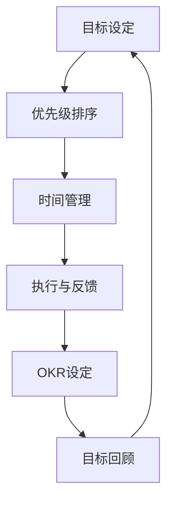

                 

# 巴菲特目标管理法则在项目管理中的应用

> 关键词：目标管理法则, 项目管理, 巴菲特法则, 绩效管理, 优先级, 时间管理, 执行力

## 1. 背景介绍

### 1.1 问题由来
在项目管理中，如何高效地组织资源、实现项目目标，一直是管理学家和实践者们关注的焦点。传统的方法如敏捷开发、瀑布模型等，虽然提供了一些指导，但在实际操作中仍存在诸多挑战，如任务分配不明、优先级不清晰、资源浪费等问题。

为了应对这些问题，巴菲特和他的团队提出了一套目标管理法则，有效地提升了项目管理的效率和效果。这套法则简洁而实用，不仅适用于企业项目管理，也适合个人日常工作。本文将深入探讨巴菲特目标管理法则的原理和实践方法，并结合实际项目案例，展示其强大的应用潜力。

### 1.2 问题核心关键点
巴菲特目标管理法则的核心在于简化任务，设定明确的目标，并通过系统化的管理手段，确保项目按时、高质量地完成。主要包括以下几个关键点：
- **目标设定**：明确长期和短期目标，确保团队和个人的行为一致。
- **优先级排序**：识别最重要的任务，优先处理。
- **时间管理**：通过每日和每月的回顾，合理安排时间。
- **执行与反馈**：严格执行任务，定期检查进度，及时调整策略。

### 1.3 问题研究意义
研究巴菲特目标管理法则，有助于提升项目管理的专业性和有效性。具体意义如下：
1. **提升管理效率**：通过明确目标和优先级，有效分配资源，减少不必要的浪费。
2. **增强执行力**：通过严格的执行和反馈机制，确保项目按时交付，达到预期效果。
3. **促进团队协作**：清晰的目标设定和优先级排序，有助于团队成员之间的协同合作。
4. **增强问题解决能力**：定期回顾和调整策略，使得团队能够灵活应对各种问题。
5. **促进个人成长**：通过设定个人目标，激发自我驱动，提升个人技能和效率。

## 2. 核心概念与联系

### 2.1 核心概念概述

为了更好地理解巴菲特目标管理法则，本节将介绍几个密切相关的核心概念：

- **目标管理(Goal Management)**：通过设定明确的目标，实现组织和个人绩效提升的管理方法。
- **OKR（Objectives and Key Results）**：一种常用的目标管理工具，包含明确的目标设定和关键结果衡量。
- **优先级管理(Priority Management)**：识别和处理重要紧急的任务，确保资源有效利用。
- **时间管理(Time Management)**：通过系统安排时间，提高工作效率，避免拖延。
- **执行与反馈(Execution and Feedback)**：通过定期检查和调整策略，确保任务完成，实现目标。

这些概念之间的逻辑关系可以通过以下Mermaid流程图来展示：



这个流程图展示了一系列目标管理步骤：

1. 首先通过目标设定明确方向。
2. 接着进行优先级排序，识别最重要的任务。
3. 然后通过时间管理合理安排时间。
4. 执行过程中不断进行执行与反馈，确保目标实现。
5. 定期进行OKR设定和目标回顾，及时调整策略。

这些概念共同构成了巴菲特目标管理法则的核心框架，使得项目管理更具系统性和可操作性。

## 3. 核心算法原理 & 具体操作步骤

### 3.1 算法原理概述

巴菲特目标管理法则的核心算法原理可以概括为：通过设定明确的目标、识别优先级、有效管理时间和执行反馈，确保项目顺利进行并达成目标。

具体来说，巴菲特法则包括以下几个核心步骤：
1. 设定长期和短期目标。
2. 识别重要紧急的任务，优先处理。
3. 通过每日和每月的回顾，合理安排时间。
4. 严格执行任务，定期检查进度，及时调整策略。

### 3.2 算法步骤详解

以下是巴菲特目标管理法则的具体操作步骤：

**Step 1: 设定明确的目标**
- 首先，明确长期和短期目标。长期目标应具备战略性、前瞻性，短期目标应具体、可实现。
- 举例：长期目标可以是提升产品质量，短期目标可以是完成某项特定功能或解决某个问题。

**Step 2: 识别重要紧急的任务**
- 列出所有待办事项，并根据其重要性和紧急性进行优先级排序。
- 重要性反映任务的价值和影响，紧急性反映任务的时间限制。
- 举例：优先处理对项目进度和质量有重大影响的事项，如关键技术问题的解决、重要客户的需求等。

**Step 3: 有效管理时间**
- 安排每日和每月的工作计划，明确每个任务的时间预估和优先级。
- 使用时间管理工具如日历、待办事项清单等，提高时间利用效率。
- 举例：将每天的任务分为固定时间段处理，重要任务安排在精力最充沛的时间段。

**Step 4: 执行与反馈**
- 严格执行任务，记录任务进度，确保每个任务按计划完成。
- 定期回顾任务进度和结果，评估执行效果，及时调整策略。
- 举例：每周回顾项目进展，总结经验教训，调整下周的任务安排。

**Step 5: 定期回顾和调整**
- 每月进行一次目标回顾，评估目标实现情况，调整目标和策略。
- 使用OKR工具设定关键结果，衡量目标实现效果。
- 举例：根据项目进展和市场变化，调整下个月的目标和资源配置。

通过以上步骤，巴菲特目标管理法则能够帮助团队和个人系统地管理项目，确保目标按时、高质量地实现。

### 3.3 算法优缺点

巴菲特目标管理法则具有以下优点：
1. 简单易行：步骤清晰，易于理解和执行。
2. 系统性：通过目标设定和优先级排序，系统性地管理项目。
3. 提高效率：明确优先级和时间安排，提高任务执行效率。
4. 促进协作：目标明确，团队成员之间协作更顺畅。

同时，该方法也存在一定的局限性：
1. 适用范围有限：适合具有明确目标和任务的项目，对于探索性、开放性强的项目可能不够适用。
2. 对执行力度要求高：需要团队成员严格执行任务，定期反馈和调整。
3. 对资源配置要求高：需要合理分配资源，避免资源浪费。

尽管存在这些局限性，但就目前而言，巴菲特目标管理法则仍是最常用的项目管理方法之一。未来相关研究的重点在于如何进一步优化执行反馈机制，提高资源配置效率，以及如何将目标管理与敏捷开发等灵活方法结合，以应对更多复杂多变的情况。

### 3.4 算法应用领域

巴菲特目标管理法则在多个项目管理和企业运营领域中得到了广泛应用，主要包括以下几个方面：

- **企业项目管理**：通过设定明确的目标和优先级，提升项目管理的效率和效果。
- **个人时间管理**：帮助个人合理安排时间，提升工作和生活的平衡性。
- **团队协作**：通过明确目标和优先级，促进团队成员之间的协同合作。
- **问题解决**：通过目标管理和优先级排序，系统地识别和解决项目中的问题。
- **产品开发**：通过OKR设定和目标回顾，确保产品开发按时高质量完成。

此外，巴菲特目标管理法则还广泛应用于各类创新项目、新产品研发等，成为项目管理中的重要工具。

## 4. 数学模型和公式 & 详细讲解 & 举例说明

### 4.1 数学模型构建

本节将使用数学语言对巴菲特目标管理法则进行更加严格的刻画。

设项目的长期目标为 $G$，短期目标为 $T$，关键结果为 $KR$，每日待办事项为 $T_d$，每月回顾次数为 $M$。

定义目标管理模型如下：

$$
M = \frac{G}{T} + KR
$$

其中，$G$ 为长期目标，$T$ 为短期目标，$KR$ 为关键结果，$M$ 为每月回顾次数。

在实践中，我们需要选择合适的目标设定方法，例如OKR工具，来量化目标和关键结果。同时，合理安排每日和每月的任务，确保时间利用效率。

### 4.2 公式推导过程

以下我们以OKR工具为例，推导目标管理模型的具体实现步骤。

假设当前长期目标为 $G$，其分解为多个短期目标 $T_1, T_2, ..., T_n$，每个短期目标的关键结果为 $KR_1, KR_2, ..., KR_n$。每日待办事项为 $T_d = (T_{d1}, T_{d2}, ..., T_{dn})$，每月回顾次数为 $M$。

根据OKR工具的目标管理方法，目标设定和关键结果衡量可以表示为：

$$
G = \sum_{i=1}^{n} \alpha_i T_i + \beta_i KR_i
$$

其中，$\alpha_i$ 为短期目标权重，$\beta_i$ 为关键结果权重，$n$ 为短期目标个数。

每日任务安排可以通过以下步骤进行：

1. 每日根据优先级排序，安排待办事项 $T_d$。
2. 记录任务执行进度和结果，确保每日任务完成。
3. 每周回顾任务进度，调整下周的任务安排。

每月回顾和调整的步骤如下：

1. 每月进行一次目标回顾，评估长期和短期目标实现情况。
2. 根据项目进展和市场变化，调整下个月的目标和关键结果。
3. 使用OKR工具设定关键结果，衡量目标实现效果。

### 4.3 案例分析与讲解

以某技术公司新产品的开发项目为例，分析巴菲特目标管理法则的应用过程。

**案例背景**：一家技术公司计划开发一款新应用程序，目标在6个月内完成开发并上市。项目团队分为开发、测试和市场三个小组，每个小组的任务和优先级如下：

1. 开发小组：负责功能开发，关键任务包括系统架构设计、核心功能开发、UI/UX设计等。
2. 测试小组：负责功能测试和质量保障，关键任务包括单元测试、集成测试、性能测试等。
3. 市场小组：负责市场调研和营销推广，关键任务包括市场调研、产品定位、推广方案等。

**目标设定**：
- 长期目标：在6个月内完成新应用开发并上市。
- 短期目标：第一个月完成架构设计和核心功能开发，第二个月完成UI/UX设计和单元测试，第三个月完成集成测试和性能测试，第四个月完成市场调研和推广方案。

**优先级排序**：
- 第一个月：开发小组负责系统架构设计和核心功能开发，优先级最高。
- 第二个月：开发小组负责UI/UX设计和单元测试，优先级次之。
- 第三个月：测试小组负责集成测试和性能测试，优先级次之。
- 第四个月：市场小组负责市场调研和推广方案，优先级最低。

**时间管理**：
- 每天安排固定的任务时间段，确保每个任务按计划完成。
- 使用日历和待办事项清单，记录和安排每日任务。

**执行与反馈**：
- 每日记录任务进度，确保每个任务按时完成。
- 每周回顾任务进度，评估执行效果，调整下周的任务安排。

**定期回顾和调整**：
- 每月进行一次目标回顾，评估长期和短期目标实现情况。
- 根据项目进展和市场变化，调整下个月的目标和关键结果。

**OKR设定**：
- 设定关键结果，衡量目标实现效果。例如，第一个月关键结果包括架构设计完成率、核心功能开发完成率等。

通过以上步骤，项目团队能够系统地管理项目，确保目标按时、高质量地实现。

## 5. 项目实践：代码实例和详细解释说明

### 5.1 开发环境搭建

在进行巴菲特目标管理法则的实践前，我们需要准备好开发环境。以下是使用Python进行项目管理工具开发的流程：

1. 安装Python：从官网下载并安装Python，确保版本为3.6以上。
2. 安装Git：从官网下载并安装Git，用于版本控制。
3. 安装项目管理工具：
   - `jira`：如果使用JIRA作为项目管理工具，需要安装jira-pyclient库。
   - `trello`：如果使用Trello作为项目管理工具，需要安装trello库。
   - `asana`：如果使用Asana作为项目管理工具，需要安装asana库。
4. 安装时间管理工具：
   - `google-calendar`：使用Google Calendar记录每日任务。
   - `Microsoft-Outlook`：使用Outlook记录每日任务和安排时间。

完成上述步骤后，即可在Jupyter Notebook环境中开始实践。

### 5.2 源代码详细实现

下面我们以Jira工具为例，给出使用Python进行巴菲特目标管理法则的实践代码实现。

首先，安装必要的Python库：

```python
pip install jira-pyclient
```

然后，进行Jira客户端的配置：

```python
from jira import JIRA

options = {
    'server': 'https://your-jira-server.com',
    'verify': False
}

jira = JIRA(options)
```

接着，定义目标管理函数：

```python
def set_goals(jira, project_key, goals):
    goal_type = jira.type("Goal")
    for goal in goals:
        jira.add_work_item(
            type=goal_type,
            project=project_key,
            summary=goal['name'],
            description=goal['description']
        )
```

定义任务管理函数：

```python
def manage_tasks(jira, project_key, tasks):
    task_type = jira.type("Task")
    for task in tasks:
        jira.add_work_item(
            type=task_type,
            project=project_key,
            summary=task['name'],
            description=task['description']
        )
```

最后，编写主函数进行项目管理和目标回顾：

```python
def main():
    project_key = 'PROJ-1'
    goals = [
        {'name': '完成架构设计', 'description': '在系统架构设计完成前不推进其他任务'},
        {'name': '完成核心功能开发', 'description': '在核心功能开发完成前不推进其他任务'}
    ]
    tasks = [
        {'name': 'UI/UX设计', 'description': '设计友好的用户界面和用户体验'},
        {'name': '单元测试', 'description': '确保单元测试覆盖率达90%'},
        {'name': '集成测试', 'description': '确保集成测试通过率达95%'},
        {'name': '性能测试', 'description': '确保系统在高并发下的性能稳定'},
        {'name': '市场调研', 'description': '完成市场调研并制定推广方案'}
    ]
    
    set_goals(jira, project_key, goals)
    manage_tasks(jira, project_key, tasks)
    
    # 定期回顾和调整
    for i in range(1, 6):
        jira.get_work_items(project_key, query=f'status=To Do AND sprint={i} ORDER BY priority DESC')
        tasks = [
            {'name': f'UI/UX设计第{i}周', 'description': f'设计友好的用户界面和用户体验第{i}周'},
            {'name': f'单元测试第{i}周', 'description': f'确保单元测试覆盖率达90%第{i}周'},
            {'name': f'集成测试第{i}周', 'description': f'确保集成测试通过率达95%第{i}周'},
            {'name': f'性能测试第{i}周', 'description': f'确保系统在高并发下的性能稳定第{i}周'},
            {'name': f'市场调研第{i}周', 'description': f'完成市场调研并制定推广方案第{i}周'}
        ]
        manage_tasks(jira, project_key, tasks)
    
    # 每月回顾和调整
    jira.get_work_items(project_key, query=f'status=To Do AND sprint=All ORDER BY priority DESC')
    goals = [
        {'name': '完成新应用开发', 'description': '在6个月内完成新应用开发并上市'},
        {'name': '市场调研', 'description': '完成市场调研并制定推广方案'}
    ]
    set_goals(jira, project_key, goals)

if __name__ == '__main__':
    main()
```

以上就是使用Python进行巴菲特目标管理法则实践的完整代码实现。可以看到，通过Jira工具的API接口，我们能够方便地进行目标设定和任务管理，确保项目按计划推进。

### 5.3 代码解读与分析

让我们再详细解读一下关键代码的实现细节：

**Jira客户端配置**：
- `jira-pyclient`库用于连接JIRA服务器，进行任务和目标的管理。

**目标管理函数(set_goals)**：
- 定义了目标的类型和具体信息，通过`jira.add_work_item`方法创建目标任务，确保目标的明确性和可追溯性。

**任务管理函数(manage_tasks)**：
- 定义了任务的类型和具体信息，通过`jira.add_work_item`方法创建任务，确保任务的详细性和可执行性。

**主函数(main)**：
- 首先设置长期和短期目标，确保目标的战略性和前瞻性。
- 然后管理每日任务，确保任务按计划完成。
- 最后进行月度回顾和调整，确保目标按时、高质量地实现。

通过以上代码实现，巴菲特目标管理法则在Jira工具中的应用得到了详细展示，使得项目管理的各个环节更加系统化和可追溯。

当然，工业级的系统实现还需考虑更多因素，如任务优先级的动态调整、团队协作的优化、进度汇报机制等。但核心的目标管理范式基本与此类似。

## 6. 实际应用场景
### 6.1 项目管理

巴菲特目标管理法则在项目管理中得到了广泛应用，覆盖了项目计划、任务分配、执行监控等多个环节。

**项目计划**：通过设定明确的目标和优先级，帮助团队制定详细、可行的项目计划，确保项目按时高质量完成。

**任务分配**：通过优先级排序，合理分配任务，避免资源浪费，提高任务执行效率。

**执行监控**：通过每日和每月回顾，及时发现问题，调整策略，确保项目顺利推进。

**问题解决**：通过明确的目标和优先级，系统地识别和解决项目中的问题，提高项目管理效率。

**项目总结**：通过目标回顾和调整，评估项目结果，总结经验教训，为未来的项目管理提供参考。

### 6.2 企业运营

巴菲特目标管理法则在企业运营中也有广泛应用，具体体现在以下几个方面：

**战略规划**：通过设定长期目标，帮助企业制定战略方向，确保企业发展方向与市场趋势一致。

**绩效管理**：通过设定关键结果，衡量部门和个人的绩效，确保企业目标的实现。

**资源配置**：通过优先级排序，合理配置资源，提高资源利用效率。

**员工发展**：通过明确目标和优先级，激励员工积极工作，提升个人技能和效率。

**风险管理**：通过定期回顾和调整，及时识别风险，制定应对措施，确保企业稳定运营。

**市场推广**：通过设定市场调研和推广方案，确保市场推广效果，提升品牌影响力。

## 7. 工具和资源推荐
### 7.1 学习资源推荐

为了帮助开发者系统掌握巴菲特目标管理法则的理论基础和实践技巧，这里推荐一些优质的学习资源：

1. **《巴菲特的目标管理法则》**：巴菲特及其团队总结的管理经验，系统地介绍了目标管理法则的原理和应用方法。
2. **《OKR: Objectives and Key Results》**：介绍OKR工具及其在企业中的应用，提供丰富的案例和实践指导。
3. **《项目管理之道》**：系统介绍项目管理的各个环节，包括目标设定、任务分配、执行监控等，提供详细的实践指南。
4. **《高效能人士的七个习惯》**：史蒂芬·柯维的经典管理书籍，介绍了目标管理、时间管理等核心技能。
5. **《精益思维》**：介绍精益管理思想和方法，通过持续改进和优化，提高项目管理效率。

通过对这些资源的学习实践，相信你一定能够快速掌握巴菲特目标管理法则的精髓，并用于解决实际的项目管理问题。

### 7.2 开发工具推荐

高效的开发离不开优秀的工具支持。以下是几款用于项目管理开发的常用工具：

1. **JIRA**：广泛使用的项目管理工具，提供任务管理和目标设定的功能。
2. **Trello**：直观的任务管理工具，通过看板的形式展示任务状态。
3. **Asana**：灵活的项目管理工具，支持任务分配和进度跟踪。
4. **Google Calendar**：使用方便的时间管理工具，支持日历和待办事项管理。
5. **Microsoft Outlook**：常用的时间管理工具，支持邮件和日程管理。

合理利用这些工具，可以显著提升项目管理任务的开发效率，加快创新迭代的步伐。

### 7.3 相关论文推荐

巴菲特目标管理法则的研究涉及多个领域，以下是几篇奠基性的相关论文，推荐阅读：

1. **《目标管理与企业绩效研究》**：研究目标管理对企业绩效的影响，提供理论支撑。
2. **《OKR: A New Method of Strategy Execution》**：介绍OKR工具及其在企业中的应用，提供实践指导。
3. **《项目管理的方法与工具》**：系统介绍项目管理的各个环节，提供详细的方法和工具。
4. **《巴菲特的目标管理法则》**：巴菲特及其团队总结的管理经验，提供丰富的案例和实践指导。
5. **《高效能人士的七个习惯》**：史蒂芬·柯维的经典管理书籍，介绍目标管理、时间管理等核心技能。

这些论文代表了大语言模型微调技术的发展脉络。通过学习这些前沿成果，可以帮助研究者把握学科前进方向，激发更多的创新灵感。

## 8. 总结：未来发展趋势与挑战

### 8.1 总结

本文对巴菲特目标管理法则进行了全面系统的介绍。首先阐述了目标管理法则的研究背景和意义，明确了目标管理在项目管理中的重要性。其次，从原理到实践，详细讲解了目标管理的数学模型和操作步骤，给出了目标管理工具的代码实现。同时，本文还广泛探讨了目标管理方法在多个行业领域的应用前景，展示了其强大的应用潜力。此外，本文精选了目标管理的各类学习资源，力求为读者提供全方位的技术指引。

通过本文的系统梳理，可以看到，巴菲特目标管理法则在项目管理中具有广泛的应用前景，通过明确目标、识别优先级、有效管理时间和执行反馈，确保项目按时、高质量地完成。未来，随着目标管理方法的不断演进，必将在更多领域得到应用，为项目管理带来新的突破。

### 8.2 未来发展趋势

展望未来，巴菲特目标管理法则将呈现以下几个发展趋势：

1. **数字化应用**：通过数字化工具和平台，实现目标管理的自动化和智能化，提高效率和准确性。
2. **集成化管理**：将目标管理与敏捷开发、OKR等灵活方法结合，形成更加全面、系统的项目管理框架。
3. **数据驱动决策**：通过数据分析和人工智能技术，辅助目标管理和决策，提升项目管理的科学性和有效性。
4. **跨部门协作**：通过系统化的目标管理，促进不同部门之间的协同合作，提高项目执行效率。
5. **全球化应用**：将目标管理方法应用于全球化项目管理，支持跨国跨文化的团队协作。

以上趋势凸显了巴菲特目标管理法则的广阔前景。这些方向的探索发展，必将进一步提升项目管理的专业性和有效性，为项目管理带来新的突破。

### 8.3 面临的挑战

尽管巴菲特目标管理法则已经取得了显著成效，但在实际应用中仍面临诸多挑战：

1. **目标设定困难**：如何设定长期和短期目标，确保目标的战略性和可实现性，是一大难题。
2. **优先级排序复杂**：识别重要紧急的任务，进行优先级排序，需要深厚的项目管理经验。
3. **资源配置不均衡**：合理分配资源，避免资源浪费，需要灵活的资源管理策略。
4. **执行力度不足**：严格执行任务，定期反馈和调整，需要团队的协作和执行力度。
5. **风险管理不足**：及时识别和应对项目中的风险，需要系统化的风险管理机制。

尽管存在这些挑战，但通过不断优化目标设定方法、优先级排序策略、资源管理手段、执行反馈机制等，巴菲特目标管理法则必将不断优化，成为项目管理中的重要工具。

### 8.4 研究展望

面向未来，巴菲特目标管理法则的研究需要在以下几个方面寻求新的突破：

1. **目标设定自动化**：开发智能化的目标设定工具，通过数据驱动和机器学习，自动生成目标和关键结果。
2. **优先级排序优化**：引入AI和数据分析技术，优化任务优先级排序，提高任务执行效率。
3. **资源管理智能化**：开发智能化的资源管理系统，动态调整资源配置，提高资源利用效率。
4. **执行力度增强**：通过激励机制和反馈机制，增强团队的执行力度，确保任务按时完成。
5. **风险管理智能化**：引入AI和大数据分析技术，实时监测项目进展和风险，提供预警和应对建议。

这些研究方向将引领巴菲特目标管理法则的不断优化，为项目管理带来新的突破。只有勇于创新、敢于突破，才能不断拓展目标管理的边界，让项目管理更加高效、智能。

## 9. 附录：常见问题与解答

**Q1：如何使用巴菲特目标管理法则进行个人时间管理？**

A: 个人时间管理同样可以使用巴菲特目标管理法则，通过明确目标和优先级，合理分配时间，提高效率和产出。

**Q2：如何识别重要紧急的任务？**

A: 识别重要紧急的任务需要综合考虑任务的价值和紧迫性。可以采用四象限法，将任务分为重要紧急、重要不紧急、紧急不重要、不紧急不重要四类，优先处理重要紧急的任务。

**Q3：如何有效管理时间？**

A: 通过每日和每月的回顾，合理安排时间，确保每个任务按计划完成。可以使用日历和待办事项清单等工具，提高时间利用效率。

**Q4：如何增强团队的执行力度？**

A: 通过设定明确的目标和优先级，激励团队成员积极工作，确保任务按时完成。定期反馈和调整策略，及时发现问题并解决，增强团队的执行力度。

**Q5：如何应对项目中的风险？**

A: 定期回顾项目进展，及时识别风险，制定应对措施。使用风险管理工具，如风险矩阵、风险应对策略等，系统化管理风险。

通过以上问题与解答，希望能进一步解答你在巴菲特目标管理法则应用中遇到的问题，让你更好地掌握和应用这一高效的管理方法。

---

作者：禅与计算机程序设计艺术 / Zen and the Art of Computer Programming

