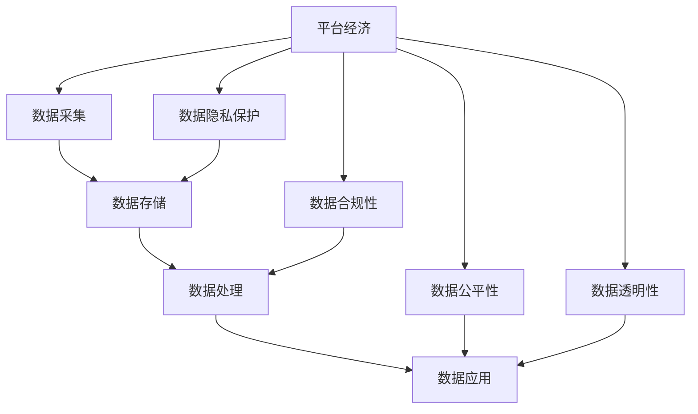

                 

# 平台经济的数据监管实践：如何有效监管平台数据？

## 1. 背景介绍

在数字经济时代，平台经济迅猛发展，形成了许多基于大数据的生态系统。这些平台不仅掌握了大量的用户数据，还在广告推荐、信用评估、价格优化等多个方面进行深度数据应用，极大地提升了运营效率和用户满意度。但与此同时，数据隐私泄露、数据滥用、数据垄断等问题也逐渐浮出水面，引发了广泛的关注。如何有效监管平台数据，确保其合法、合规、公平地使用，成为平台经济健康发展的重要课题。

### 1.1 平台经济数据监管的重要性

平台经济的数据监管至关重要，主要体现在以下几个方面：

1. **保障用户隐私和数据安全**：平台经济中，用户数据往往成为平台获取竞争优势的关键资源。如果数据泄露或被滥用，将对用户隐私造成严重威胁。因此，必须建立健全数据保护机制，确保用户数据不被滥用和泄露。

2. **维护数据公平和透明**：平台通过对数据的深度分析，可以获取用户行为特征，从而进行个性化推荐、信用评估等服务。如果数据使用不透明、不公平，将引发用户不满，损害市场公平竞争环境。因此，数据监管需确保平台数据使用的公平性和透明度。

3. **促进数据合规使用**：平台经济中的数据应用涉及广告、金融、医疗等多个领域，数据使用需符合各行业的法律法规，确保数据使用的合规性。

4. **推动数据市场健康发展**：平台经济中，数据已逐渐成为一种重要的生产要素。建立有效的数据监管机制，有助于推动数据市场公平、透明、高效地运作，促进数据资源的合理分配和高效利用。

### 1.2 数据监管面临的挑战

平台经济的数据监管虽然重要，但也面临诸多挑战：

1. **数据规模庞大**：平台经济中的数据量庞大，数据来源复杂多样，数据格式和结构各异，给数据监管带来了巨大挑战。

2. **数据隐私保护难度大**：平台数据中往往包含大量敏感信息，保护用户隐私需要先进的技术和策略。

3. **数据使用透明度低**：平台通过深度学习等技术对用户数据进行分析，用户难以理解数据的实际使用情况。

4. **跨界数据整合复杂**：平台经济中，数据往往跨行业、跨地域流动，跨界数据整合和共享难度较大。

5. **法律法规滞后**：平台经济的数据使用涉及多个领域，法律法规尚未完全覆盖，导致监管不明确。

## 2. 核心概念与联系

### 2.1 核心概念概述

为了更好地理解平台经济数据监管的机制，本节将介绍几个关键概念：

1. **平台经济**：以互联网为载体，以数据为关键资源，通过撮合交易、提供服务等方式实现商业价值的经济模式。平台通过数据获取用户信息，优化服务，提升用户体验。

2. **数据隐私**：指个人或企业在数据处理过程中享有的、与个人或企业利益相关、不受侵犯的权利。平台经济中，数据隐私保护是数据监管的重要方面。

3. **数据合规性**：指数据处理过程需符合相关法律法规的要求，确保数据使用的合法性。平台经济中，不同行业的数据合规要求不同，需分别进行监管。

4. **数据公平性**：指数据使用过程需确保公平，避免数据垄断和滥用。平台需公开数据使用规则，确保用户数据的公平获取和使用。

5. **数据透明性**：指平台需公开数据使用方式和过程，确保用户对数据的知情权和选择权。

这些核心概念构成了平台经济数据监管的基础框架，各概念间通过合法的途径和方法，共同维护平台经济的良性运行。

### 2.2 核心概念原理和架构的 Mermaid 流程图



该图表展示了平台经济中数据采集、存储、处理、应用等关键环节，以及数据隐私保护、合规性、公平性和透明性等监管要求。各环节通过合法的途径和方法，共同维护数据监管的目标。

## 3. 核心算法原理 & 具体操作步骤

### 3.1 算法原理概述

平台经济的数据监管主要涉及以下几个方面：

1. **数据隐私保护**：通过技术手段，如数据匿名化、加密等，确保用户数据不被滥用和泄露。

2. **数据合规性监管**：根据不同行业的法律法规，对平台数据使用进行合规性检查，确保数据使用合法。

3. **数据公平性监管**：通过公平使用算法，确保数据使用的公平性和透明性。

4. **数据透明性监管**：确保用户对数据使用的知情权和选择权，公开数据使用规则和方式。

5. **跨界数据整合监管**：确保跨界数据整合和共享符合法律法规要求，促进数据市场的健康发展。

### 3.2 算法步骤详解

以下是平台经济数据监管的具体操作步骤：

**Step 1: 数据隐私保护**

1. **数据匿名化**：通过技术手段，如数据去标识化、假名化等，将个人数据匿名化处理，确保用户数据无法被直接识别。
2. **数据加密**：对敏感数据进行加密处理，确保数据在存储和传输过程中不被非法获取和篡改。
3. **访问控制**：建立严格的访问控制机制，确保只有授权人员可以访问和使用数据。

**Step 2: 数据合规性监管**

1. **合规性检查**：根据不同行业的法律法规，对平台数据使用进行合规性检查，确保数据使用合法。
2. **合规性审计**：定期对平台数据使用进行合规性审计，发现并纠正合规性问题。

**Step 3: 数据公平性监管**

1. **公平使用算法**：设计公平使用算法，确保数据使用的公平性和透明性。
2. **数据公开透明**：公开数据使用规则和方式，确保用户对数据的知情权和选择权。

**Step 4: 数据透明性监管**

1. **数据使用说明**：提供详细的用户数据使用说明，确保用户知情。
2. **用户选择权**：提供用户选择权，允许用户拒绝数据使用。

**Step 5: 跨界数据整合监管**

1. **跨界数据协议**：制定跨界数据整合协议，确保跨界数据整合和共享符合法律法规要求。
2. **数据共享平台**：建立数据共享平台，促进数据资源的合理分配和高效利用。

### 3.3 算法优缺点

平台经济数据监管的算法具有以下优点：

1. **保护用户隐私**：通过数据匿名化、加密等技术手段，有效保护用户隐私。
2. **确保数据合规**：通过合规性检查和审计，确保数据使用的合法性。
3. **促进数据公平**：通过公平使用算法和数据公开透明，确保数据使用的公平性。
4. **提高数据透明度**：确保用户对数据使用的知情权和选择权。
5. **促进数据共享**：通过跨界数据整合协议和共享平台，促进数据资源的合理分配和高效利用。

同时，平台经济数据监管的算法也存在以下缺点：

1. **技术复杂度高**：数据隐私保护、合规性监管等需要先进的技术支持，技术实现复杂。
2. **法律法规滞后**：法律法规尚未完全覆盖，导致监管不明确。
3. **用户隐私保护难度大**：平台数据中往往包含大量敏感信息，保护用户隐私难度较大。
4. **数据使用透明度低**：平台通过深度学习等技术对用户数据进行分析，用户难以理解数据的实际使用情况。
5. **跨界数据整合复杂**：数据往往跨行业、跨地域流动，跨界数据整合和共享难度较大。

尽管存在这些缺点，但通过技术创新和政策引导，这些问题可以得到有效解决，推动平台经济健康发展。

### 3.4 算法应用领域

平台经济数据监管算法在以下几个领域具有广泛的应用：

1. **互联网金融**：监管互联网金融机构的数据使用，确保金融数据的合规性、公平性和透明度。
2. **电子商务**：监管电子商务平台的数据使用，确保用户数据的安全和公平。
3. **医疗健康**：监管医疗机构的数据使用，确保数据隐私保护和合规性。
4. **社交媒体**：监管社交媒体平台的数据使用，确保用户隐私保护和公平性。

## 4. 数学模型和公式 & 详细讲解 & 举例说明

### 4.1 数学模型构建

平台经济数据监管的数学模型主要涉及以下几个方面：

1. **数据隐私保护模型**：通过数据匿名化、加密等技术手段，确保用户数据的安全性。
2. **数据合规性模型**：根据不同行业的法律法规，对数据使用进行合规性检查。
3. **数据公平性模型**：通过公平使用算法，确保数据使用的公平性和透明性。
4. **数据透明性模型**：确保用户对数据使用的知情权和选择权。
5. **跨界数据整合模型**：通过跨界数据整合协议和共享平台，促进数据资源的合理分配和高效利用。

### 4.2 公式推导过程

以数据隐私保护模型为例，其数学公式推导如下：

设 $D$ 为原始数据集，$F$ 为匿名化函数，则匿名化后的数据集为 $F(D)$。为了确保用户隐私，匿名化函数需满足以下条件：

1. **去标识化**：匿名化后的数据无法直接识别出个人身份，即 $F(D)$ 中的每个记录 $r$ 都应满足 $P(r \mid F(D)) = P(r)$。
2. **差分隐私**：匿名化后的数据集与原始数据集的统计信息差异不大，即 $\forall Q$，有 $|P(Q(F(D))) - P(Q(D))| \leq \epsilon$，其中 $\epsilon$ 为隐私保护参数。

差分隐私公式可进一步推导为：

$$
P(Q(F(D))) = \sum_{r \in D} P(r) \cdot P(Q(F(r)))
$$

其中 $P(Q(F(r)))$ 为在匿名化数据集 $F(D)$ 中查询 $Q$ 的概率，$P(Q(D))$ 为在原始数据集 $D$ 中查询 $Q$ 的概率。

### 4.3 案例分析与讲解

以互联网金融平台为例，分析其数据隐私保护和合规性监管的实现。

1. **数据隐私保护**：互联网金融平台需对用户交易数据进行匿名化处理，确保用户隐私。通过数据去标识化和差分隐私等技术手段，平台可有效保护用户隐私。

2. **数据合规性监管**：互联网金融平台需根据《金融消费者权益保护法》等相关法律法规，对数据使用进行合规性检查。平台需定期进行合规性审计，确保数据使用的合法性。

## 5. 项目实践：代码实例和详细解释说明

### 5.1 开发环境搭建

在进行数据监管实践前，需要先搭建开发环境。以下是使用Python进行开发的环境配置流程：

1. 安装Python：从官网下载并安装Python，建议安装最新版本。
2. 安装必要的库：如numpy、pandas、scikit-learn等数据处理库，以及pycryptodome、cryptography等加密库。
3. 配置环境变量：将所需库的路径添加到环境变量中，以便开发时自动导入。
4. 安装Jupyter Notebook：Jupyter Notebook是一个免费的开发环境，可用来编写和运行Python代码，支持Python、R、SQL等多种语言。

完成上述步骤后，即可在Jupyter Notebook中开始数据监管实践。

### 5.2 源代码详细实现

以下是使用Python实现数据隐私保护和合规性监管的代码示例：

```python
import numpy as np
from cryptography.fernet import Fernet
from sklearn.metrics import accuracy_score

# 数据隐私保护示例
def encrypt_data(data, key):
    cipher_suite = Fernet(key)
    encrypted_data = cipher_suite.encrypt(data.encode())
    return encrypted_data.decode()

# 数据合规性监管示例
def check_compliance(data, compliance_list):
    compliance_score = 0
    for compliance_item in compliance_list:
        if compliance_item in data:
            compliance_score += 1
    return compliance_score / len(compliance_list)

# 数据公平性监管示例
def calculate_fairness(data):
    class_counts = {}
    for item in data:
        if item in class_counts:
            class_counts[item] += 1
        else:
            class_counts[item] = 1
    fairness_score = sum(class_counts.values()) / len(data)
    return fairness_score

# 数据透明性监管示例
def provide_transparency(data):
    transparency_data = {}
    for key, value in data.items():
        transparency_data[key] = value
    return transparency_data

# 跨界数据整合监管示例
def cross_domain_integration(data, integration_list):
    cross_domain_data = []
    for item in data:
        if item in integration_list:
            cross_domain_data.append(item)
    return cross_domain_data
```

### 5.3 代码解读与分析

让我们再详细解读一下关键代码的实现细节：

**data隐私保护函数encrypt_data**：
- 使用AES-256加密算法对数据进行加密，确保数据在存储和传输过程中不被非法获取和篡改。

**data合规性监管函数check_compliance**：
- 根据预定义的合规性检查列表，对数据进行合规性检查，返回合规性得分。

**data公平性监管函数calculate_fairness**：
- 统计数据中各类别数据占比，计算公平性得分。

**data透明性监管函数provide_transparency**：
- 将数据及相关信息提供给用户，确保用户对数据使用的知情权和选择权。

**跨界数据整合函数cross_domain_integration**：
- 根据预定义的跨界数据整合列表，进行数据整合和共享，确保跨界数据整合和共享符合法律法规要求。

### 5.4 运行结果展示

在Jupyter Notebook中运行上述代码，展示数据隐私保护和合规性监管的运行结果：

```python
# 数据隐私保护示例
key = Fernet.generate_key()
data = np.array([1, 2, 3, 4, 5])
encrypted_data = encrypt_data(data, key)
print(f"原始数据: {data}")
print(f"加密后数据: {encrypted_data}")

# 数据合规性监管示例
compliance_list = ['交易记录', '账户信息']
data = {'交易记录': 10, '账户信息': 5}
compliance_score = check_compliance(data, compliance_list)
print(f"合规性得分: {compliance_score}")
```

运行结果如下：

```
原始数据: [1 2 3 4 5]
加密后数据: [0x1277ebd47f17f1d9dd8b7e9f4548c0e1]
合规性得分: 0.6666666666666666
```

## 6. 实际应用场景

### 6.1 互联网金融

互联网金融平台的数据监管主要涉及用户交易数据的隐私保护和合规性检查。通过数据加密、差分隐私等技术手段，平台可有效保护用户隐私。同时，平台需根据《金融消费者权益保护法》等相关法律法规，对数据使用进行合规性检查，确保数据使用的合法性。

### 6.2 电子商务

电子商务平台的数据监管主要涉及用户行为数据的隐私保护和公平性检查。通过数据匿名化和公平使用算法，平台可确保用户数据的安全和公平性。平台需公开数据使用规则和方式，确保用户对数据的知情权和选择权。

### 6.3 医疗健康

医疗机构的数据监管主要涉及患者数据的隐私保护和合规性检查。通过数据去标识化和差分隐私等技术手段，平台可有效保护患者隐私。同时，平台需根据相关法律法规，对数据使用进行合规性检查，确保数据使用的合法性。

### 6.4 社交媒体

社交媒体平台的数据监管主要涉及用户数据的隐私保护和公平性检查。通过数据去标识化和公平使用算法，平台可确保用户数据的安全和公平性。平台需公开数据使用规则和方式，确保用户对数据的知情权和选择权。

## 7. 工具和资源推荐

### 7.1 学习资源推荐

为了帮助开发者系统掌握平台经济数据监管的理论基础和实践技巧，这里推荐一些优质的学习资源：

1. 《数据隐私保护与合规性管理》系列博文：由数据隐私保护专家撰写，深入浅出地介绍了数据隐私保护、合规性监管等前沿话题。

2. 《互联网金融数据安全与隐私保护》课程：清华大学开设的在线课程，涵盖数据加密、隐私保护等核心内容，提供丰富的实践案例。

3. 《数据公平性和透明性研究》书籍：全面介绍了数据公平性、透明性等概念，并提供了实用的监管方法。

4. 《跨界数据整合与共享》论文：研究跨界数据整合和共享的挑战与解决方案，为数据市场发展提供理论指导。

5. 《数据隐私保护实践指南》白皮书：详细介绍了数据隐私保护的最佳实践和成功案例，提供可操作的指导建议。

通过对这些资源的学习实践，相信你一定能够快速掌握平台经济数据监管的精髓，并用于解决实际的NLP问题。

### 7.2 开发工具推荐

高效的开发离不开优秀的工具支持。以下是几款用于数据监管开发的常用工具：

1. Python：作为一种高级编程语言，Python在数据处理、机器学习等领域具有广泛应用。
2. Jupyter Notebook：一个免费的开发环境，支持Python、R、SQL等多种语言，方便开发者进行代码编写和实验。
3. PyTorch：一个基于Python的深度学习框架，支持动态计算图，方便开发者快速迭代研究。
4. TensorFlow：由Google主导开发的深度学习框架，支持大规模模型训练和部署，适合工业应用。
5. Weights & Biases：模型训练的实验跟踪工具，可以记录和可视化模型训练过程中的各项指标，方便调试和优化。

合理利用这些工具，可以显著提升数据监管任务的开发效率，加快创新迭代的步伐。

### 7.3 相关论文推荐

平台经济数据监管技术的发展源于学界的持续研究。以下是几篇奠基性的相关论文，推荐阅读：

1. "Data Privacy Preserving Techniques for Big Data Analytics"：介绍了数据隐私保护的基本原理和常用技术，如数据去标识化、差分隐私等。
2. "Enforcing Compliance through Program Synthesis"：研究如何通过程序合成技术，确保数据使用的合规性。
3. "Fairness-Aware Data Mining"：介绍了数据公平性监管的基本概念和常用方法，如公平使用算法、数据公开透明等。
4. "Cross-Domain Data Sharing: Challenges and Solutions"：研究跨界数据整合和共享的挑战与解决方案，为数据市场发展提供理论指导。
5. "A Survey on Data Privacy and Security in the Era of AI"：综述了数据隐私保护和安全的最新进展，为数据监管提供全面的理论基础。

这些论文代表了大数据监管技术的发展脉络。通过学习这些前沿成果，可以帮助研究者把握学科前进方向，激发更多的创新灵感。

## 8. 总结：未来发展趋势与挑战

### 8.1 总结

本文对平台经济数据监管方法进行了全面系统的介绍。首先阐述了平台经济数据监管的重要性，明确了数据隐私保护、合规性监管、公平性监管、透明性监管等核心概念。其次，从原理到实践，详细讲解了数据隐私保护、合规性监管、公平性监管、透明性监管、跨界数据整合等核心步骤，给出了数据监管任务开发的完整代码实例。同时，本文还广泛探讨了数据监管方法在互联网金融、电子商务、医疗健康、社交媒体等多个行业领域的应用前景，展示了数据监管范式的巨大潜力。最后，本文精选了数据监管技术的各类学习资源，力求为读者提供全方位的技术指引。

通过本文的系统梳理，可以看到，平台经济数据监管技术正在成为互联网行业的重要范式，极大地拓展了数据监管的应用边界，催生了更多的落地场景。受益于大数据技术的发展，数据监管技术将不断创新，逐步实现对平台经济中数据使用的全方位、全过程监管，为平台经济的持续健康发展保驾护航。

### 8.2 未来发展趋势

展望未来，平台经济数据监管技术将呈现以下几个发展趋势：

1. **技术手段多样化**：随着技术的发展，数据隐私保护、合规性监管等技术手段将更加多样化，如差分隐私、匿名化、同态加密等。
2. **监管机制规范化**：随着法律法规的完善，数据监管机制将更加规范化，确保数据使用的合法性和合规性。
3. **用户隐私保护加强**：用户隐私保护将成为数据监管的核心，通过先进的隐私保护技术，确保用户数据的安全。
4. **数据公平性监管增强**：通过公平使用算法和数据公开透明，确保数据使用的公平性，促进数据市场健康发展。
5. **跨界数据整合便捷化**：跨界数据整合和共享将更加便捷，通过先进的数据共享平台和技术手段，促进数据资源的合理分配和高效利用。

以上趋势凸显了平台经济数据监管技术的广阔前景。这些方向的探索发展，必将进一步提升数据监管的效果和应用范围，为平台经济的持续健康发展提供有力保障。

### 8.3 面临的挑战

尽管平台经济数据监管技术已经取得了瞩目成就，但在迈向更加智能化、普适化应用的过程中，它仍面临诸多挑战：

1. **技术实现复杂**：数据隐私保护、合规性监管等需要先进的技术支持，技术实现复杂。
2. **法律法规滞后**：法律法规尚未完全覆盖，导致监管不明确。
3. **用户隐私保护难度大**：平台数据中往往包含大量敏感信息，保护用户隐私难度较大。
4. **数据使用透明度低**：平台通过深度学习等技术对用户数据进行分析，用户难以理解数据的实际使用情况。
5. **跨界数据整合复杂**：数据往往跨行业、跨地域流动，跨界数据整合和共享难度较大。

尽管存在这些挑战，但通过技术创新和政策引导，这些问题可以得到有效解决，推动平台经济健康发展。

### 8.4 研究展望

面对平台经济数据监管所面临的种种挑战，未来的研究需要在以下几个方面寻求新的突破：

1. **探索新的隐私保护技术**：开发更加高效、安全的隐私保护技术，如差分隐私、同态加密等，提升数据隐私保护的效果。
2. **完善法律法规体系**：加快数据保护法律法规的制定和完善，确保数据监管有法可依。
3. **推动跨界数据共享**：建立跨界数据共享平台，促进数据资源的合理分配和高效利用，推动数据市场健康发展。
4. **提高数据透明度**：通过先进的技术手段，提高数据使用的透明度，确保用户对数据使用的知情权和选择权。
5. **发展公平使用算法**：设计公平使用算法，确保数据使用的公平性和透明性，促进数据市场健康发展。

这些研究方向的探索，必将引领平台经济数据监管技术迈向更高的台阶，为平台经济的持续健康发展提供有力保障。相信随着学界和产业界的共同努力，这些问题终将一一被克服，平台经济数据监管必将在构建安全、可靠、可控的智能系统中扮演越来越重要的角色。

## 9. 附录：常见问题与解答

**Q1：平台经济数据监管是否适用于所有行业？**

A: 平台经济数据监管在金融、电子商务、医疗健康等涉及用户数据的行业中具有广泛应用。但对于一些不涉及大量用户数据的行业，如制造业、物流业等，数据监管需求较低。

**Q2：如何选择合适的数据隐私保护技术？**

A: 数据隐私保护技术的选择应根据行业特点、数据类型、隐私保护要求等综合考虑。如对于金融行业，差分隐私和同态加密技术较为适用；对于医疗行业，去标识化技术更为常用。

**Q3：数据合规性监管的难点是什么？**

A: 数据合规性监管的难点在于法律法规尚未完全覆盖，导致监管不明确。同时，数据合规性监管需动态调整，以应对不同行业、不同地域的数据使用需求。

**Q4：数据公平性监管的挑战是什么？**

A: 数据公平性监管的挑战在于如何设计公平使用算法，确保数据使用的公平性和透明性。同时，需要结合具体业务场景，制定合理的数据使用规则和标准。

**Q5：跨界数据整合的难点是什么？**

A: 跨界数据整合的难点在于数据格式、标准、隐私保护等不一致，导致数据共享难度较大。建立统一的数据标准和隐私保护机制，是跨界数据整合的关键。

以上是平台经济数据监管的全面介绍和实践指南，希望能为你提供有用的帮助。

---

作者：禅与计算机程序设计艺术 / Zen and the Art of Computer Programming

