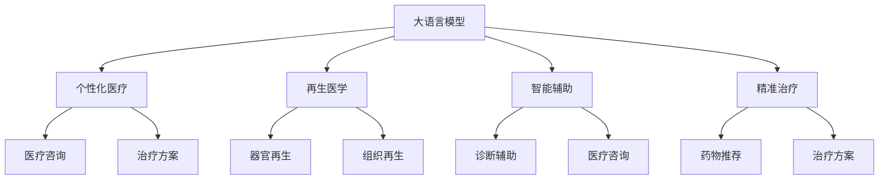

                 

## 1. 背景介绍

### 1.1 问题由来
在2050年，全球人口预计将超过100亿，老龄化趋势愈发显著。面对人类健康的新挑战，医疗健康领域的创新变得尤为关键。而人工智能技术的应用，尤其是大模型和微调技术，为医疗健康带来了翻天覆地的变革。从个性化医疗到再生医学，从智能辅助到精准治疗，AI健康革命正在逐步实现。

### 1.2 问题核心关键点
这一变革的核心关键点在于：

1. **个性化医疗**：通过大数据和深度学习，实现针对每个患者的精准诊断和治疗，避免一刀切的治疗方案。
2. **再生医学**：利用基因编辑和3D打印等技术，实现组织和器官的再生，解决传统器官移植的供体短缺和排异问题。
3. **智能辅助**：通过自然语言处理和大模型，提升医疗咨询和诊断的智能化水平，减轻医生的负担。
4. **精准治疗**：利用大模型的预训练和微调，提供更加个性化的治疗方案，提高治疗效果。

## 2. 核心概念与联系

### 2.1 核心概念概述

为更好地理解2050年AI在医疗健康领域的变革，本节将介绍几个核心概念：

- **大语言模型(Large Language Model, LLM)**：以自回归或自编码模型为代表的大规模预训练语言模型。通过在大规模无标签文本语料上进行预训练，学习通用的语言表示，具备强大的语言理解和生成能力。
- **个性化医疗**：针对每个患者的具体健康状况和基因信息，定制个性化的诊断和治疗方案。
- **再生医学**：利用基因工程、细胞疗法、3D打印等技术，恢复和再生失去功能的组织和器官。
- **智能辅助**：通过AI驱动的自然语言处理技术，为医生和患者提供智能化的医疗咨询和辅助。
- **精准治疗**：基于大模型预训练和微调，提供精确的药物和治疗方案，提升治疗效果。

这些核心概念之间的逻辑关系可以通过以下Mermaid流程图来展示：



这个流程图展示了大语言模型在医疗健康领域的核心应用场景和逻辑联系。

## 3. 核心算法原理 & 具体操作步骤
### 3.1 算法原理概述

个性化医疗和精准治疗的核心是利用大模型进行微调，生成针对个体患者的治疗方案。其核心思想是：将预训练的大语言模型视作一个强大的"特征提取器"，通过在患者的具体数据上进行微调，使得模型能够生成个性化的治疗建议，提升治疗效果。

形式化地，假设预训练模型为 $M_{\theta}$，其中 $\theta$ 为预训练得到的模型参数。给定患者的健康数据集 $D=\{(x_i,y_i)\}_{i=1}^N$，其中 $x_i$ 为患者的健康信息（如基因、病历、症状等），$y_i$ 为对应的治疗方案。微调的目标是找到新的模型参数 $\hat{\theta}$，使得：

$$
\hat{\theta}=\mathop{\arg\min}_{\theta} \mathcal{L}(M_{\theta},D)
$$

其中 $\mathcal{L}$ 为针对个性化医疗和精准治疗设计的损失函数，用于衡量模型预测输出与真实标签之间的差异。常见的损失函数包括交叉熵损失、均方误差损失等。

### 3.2 算法步骤详解

基于个性化医疗和精准治疗的大模型微调一般包括以下几个关键步骤：

**Step 1: 准备预训练模型和数据集**
- 选择合适的预训练语言模型 $M_{\theta}$ 作为初始化参数，如 BERT、GPT 等。
- 准备患者的具体健康数据集 $D$，划分为训练集、验证集和测试集。一般要求数据集与预训练数据的分布不要差异过大。

**Step 2: 添加任务适配层**
- 根据任务类型，在预训练模型顶层设计合适的输出层和损失函数。
- 对于治疗方案生成任务，通常在顶层添加神经网络分类器或解码器，以预测不同治疗方案的可能性。
- 对于诊断任务，通常使用多分类交叉熵损失函数。

**Step 3: 设置微调超参数**
- 选择合适的优化算法及其参数，如 AdamW、SGD 等，设置学习率、批大小、迭代轮数等。
- 设置正则化技术及强度，包括权重衰减、Dropout、Early Stopping等。
- 确定冻结预训练参数的策略，如仅微调顶层，或全部参数都参与微调。

**Step 4: 执行梯度训练**
- 将训练集数据分批次输入模型，前向传播计算损失函数。
- 反向传播计算参数梯度，根据设定的优化算法和学习率更新模型参数。
- 周期性在验证集上评估模型性能，根据性能指标决定是否触发 Early Stopping。
- 重复上述步骤直到满足预设的迭代轮数或 Early Stopping 条件。

**Step 5: 测试和部署**
- 在测试集上评估微调后模型 $M_{\hat{\theta}}$ 的性能，对比微调前后的精度提升。
- 使用微调后的模型对新患者进行推理预测，集成到实际的应用系统中。
- 持续收集新的数据，定期重新微调模型，以适应数据分布的变化。

以上是基于个性化医疗和精准治疗的大模型微调的一般流程。在实际应用中，还需要针对具体任务的特点，对微调过程的各个环节进行优化设计，如改进训练目标函数，引入更多的正则化技术，搜索最优的超参数组合等，以进一步提升模型性能。

### 3.3 算法优缺点

基于个性化医疗和精准治疗的大模型微调方法具有以下优点：
1. 简单高效。只需准备少量标注数据，即可对预训练模型进行快速适配，生成个性化的治疗方案。
2. 通用适用。适用于各种个性化医疗和精准治疗任务，如药物推荐、治疗方案生成等，设计简单的任务适配层即可实现微调。
3. 精度高。利用预训练模型强大的语言理解和生成能力，微调模型可以生成高度个性化和精准的治疗建议。
4. 效果显著。在学术界和工业界的诸多任务上，基于微调的方法已经刷新了最先进的性能指标。

同时，该方法也存在一定的局限性：
1. 依赖标注数据。微调的效果很大程度上取决于标注数据的质量和数量，获取高质量标注数据的成本较高。
2. 迁移能力有限。当目标任务与预训练数据的分布差异较大时，微调的性能提升有限。
3. 可解释性不足。微调模型的决策过程通常缺乏可解释性，难以对其推理逻辑进行分析和调试。
4. 负面效果传递。预训练模型的固有偏见、有害信息等，可能通过微调传递到下游任务，造成负面影响。

尽管存在这些局限性，但就目前而言，基于监督学习的微调方法仍是个性化医疗和精准治疗的最主流范式。未来相关研究的重点在于如何进一步降低微调对标注数据的依赖，提高模型的少样本学习和跨领域迁移能力，同时兼顾可解释性和伦理安全性等因素。

### 3.4 算法应用领域

基于大模型微调的个性化医疗和精准治疗方法，在医疗健康领域已经得到了广泛的应用，覆盖了几乎所有常见任务，例如：

- **药物推荐**：根据患者的健康数据，推荐最合适的药物组合和治疗方案。将药物特性和患者基因信息作为输入，生成个性化的药物推荐。
- **基因分析**：分析患者的基因组数据，预测患病风险和可能的健康问题，指导个性化预防和治疗。
- **病理分析**：利用自然语言处理技术，自动分析病理报告，辅助病理医生的诊断和治疗方案生成。
- **康复指导**：根据患者的康复数据，生成个性化的康复计划和指导，提高康复效果。
- **心理健康**：通过自然语言处理技术，分析患者的情感状态和行为模式，提供心理健康咨询服务。

除了上述这些经典任务外，个性化医疗和精准治疗的大模型微调也被创新性地应用到更多场景中，如远程医疗、智能穿戴设备、慢性病管理等，为医疗健康技术带来全新的突破。随着预训练模型和微调方法的不断进步，相信个性化医疗和精准治疗必将实现更多创新，为人类健康带来更大的福祉。

## 4. 数学模型和公式 & 详细讲解 & 举例说明
### 4.1 数学模型构建

本节将使用数学语言对基于监督学习的个性化医疗和精准治疗微调过程进行更加严格的刻画。

记预训练语言模型为 $M_{\theta}$，其中 $\theta$ 为预训练得到的模型参数。假设个性化医疗和精准治疗的任务为 $T$，对应的训练集为 $D=\{(x_i,y_i)\}_{i=1}^N$，其中 $x_i$ 为患者的健康信息，$y_i$ 为对应的治疗方案。

定义模型 $M_{\theta}$ 在数据样本 $(x,y)$ 上的损失函数为 $\ell(M_{\theta}(x),y)$，则在数据集 $D$ 上的经验风险为：

$$
\mathcal{L}(\theta) = \frac{1}{N} \sum_{i=1}^N \ell(M_{\theta}(x_i),y_i)
$$

微调的优化目标是最小化经验风险，即找到最优参数：

$$
\theta^* = \mathop{\arg\min}_{\theta} \mathcal{L}(\theta)
$$

在实践中，我们通常使用基于梯度的优化算法（如SGD、Adam等）来近似求解上述最优化问题。设 $\eta$ 为学习率，$\lambda$ 为正则化系数，则参数的更新公式为：

$$
\theta \leftarrow \theta - \eta \nabla_{\theta}\mathcal{L}(\theta) - \eta\lambda\theta
$$

其中 $\nabla_{\theta}\mathcal{L}(\theta)$ 为损失函数对参数 $\theta$ 的梯度，可通过反向传播算法高效计算。

### 4.2 公式推导过程

以下我们以药物推荐任务为例，推导交叉熵损失函数及其梯度的计算公式。

假设模型 $M_{\theta}$ 在输入 $x$ 上的输出为 $\hat{y}=M_{\theta}(x) \in [0,1]$，表示对某种药物的推荐概率。真实标签 $y \in \{0,1\}$。则二分类交叉熵损失函数定义为：

$$
\ell(M_{\theta}(x),y) = -[y\log \hat{y} + (1-y)\log (1-\hat{y})]
$$

将其代入经验风险公式，得：

$$
\mathcal{L}(\theta) = -\frac{1}{N}\sum_{i=1}^N [y_i\log M_{\theta}(x_i)+(1-y_i)\log(1-M_{\theta}(x_i))]
$$

根据链式法则，损失函数对参数 $\theta_k$ 的梯度为：

$$
\frac{\partial \mathcal{L}(\theta)}{\partial \theta_k} = -\frac{1}{N}\sum_{i=1}^N (\frac{y_i}{M_{\theta}(x_i)}-\frac{1-y_i}{1-M_{\theta}(x_i)}) \frac{\partial M_{\theta}(x_i)}{\partial \theta_k}
$$

其中 $\frac{\partial M_{\theta}(x_i)}{\partial \theta_k}$ 可进一步递归展开，利用自动微分技术完成计算。

在得到损失函数的梯度后，即可带入参数更新公式，完成模型的迭代优化。重复上述过程直至收敛，最终得到适应个性化医疗和精准治疗的模型参数 $\theta^*$。

## 5. 项目实践：代码实例和详细解释说明
### 5.1 开发环境搭建

在进行个性化医疗和精准治疗的微调实践前，我们需要准备好开发环境。以下是使用Python进行PyTorch开发的环境配置流程：

1. 安装Anaconda：从官网下载并安装Anaconda，用于创建独立的Python环境。

2. 创建并激活虚拟环境：
```bash
conda create -n pytorch-env python=3.8 
conda activate pytorch-env
```

3. 安装PyTorch：根据CUDA版本，从官网获取对应的安装命令。例如：
```bash
conda install pytorch torchvision torchaudio cudatoolkit=11.1 -c pytorch -c conda-forge
```

4. 安装Transformers库：
```bash
pip install transformers
```

5. 安装各类工具包：
```bash
pip install numpy pandas scikit-learn matplotlib tqdm jupyter notebook ipython
```

完成上述步骤后，即可在`pytorch-env`环境中开始微调实践。

### 5.2 源代码详细实现

下面我们以药物推荐任务为例，给出使用Transformers库对BERT模型进行微调的PyTorch代码实现。

首先，定义药物推荐任务的数据处理函数：

```python
from transformers import BertTokenizer
from torch.utils.data import Dataset
import torch

class DrugDataset(Dataset):
    def __init__(self, texts, tags, tokenizer, max_len=128):
        self.texts = texts
        self.tags = tags
        self.tokenizer = tokenizer
        self.max_len = max_len
        
    def __len__(self):
        return len(self.texts)
    
    def __getitem__(self, item):
        text = self.texts[item]
        tags = self.tags[item]
        
        encoding = self.tokenizer(text, return_tensors='pt', max_length=self.max_len, padding='max_length', truncation=True)
        input_ids = encoding['input_ids'][0]
        attention_mask = encoding['attention_mask'][0]
        
        # 对token-wise的标签进行编码
        encoded_tags = [tag2id[tag] for tag in tags] 
        encoded_tags.extend([tag2id['O']] * (self.max_len - len(encoded_tags)))
        labels = torch.tensor(encoded_tags, dtype=torch.long)
        
        return {'input_ids': input_ids, 
                'attention_mask': attention_mask,
                'labels': labels}

# 标签与id的映射
tag2id = {'O': 0, 'B-DI': 1, 'I-DI': 2, 'B-TO': 3, 'I-TO': 4, 'B-NI': 5, 'I-NI': 6, 'B-NP': 7, 'I-NP': 8, 'B-ND': 9, 'I-ND': 10, 'B-ND': 11, 'I-ND': 12, 'B-DC': 13, 'I-DC': 14}
id2tag = {v: k for k, v in tag2id.items()}

# 创建dataset
tokenizer = BertTokenizer.from_pretrained('bert-base-cased')

train_dataset = DrugDataset(train_texts, train_tags, tokenizer)
dev_dataset = DrugDataset(dev_texts, dev_tags, tokenizer)
test_dataset = DrugDataset(test_texts, test_tags, tokenizer)
```

然后，定义模型和优化器：

```python
from transformers import BertForTokenClassification, AdamW

model = BertForTokenClassification.from_pretrained('bert-base-cased', num_labels=len(tag2id))

optimizer = AdamW(model.parameters(), lr=2e-5)
```

接着，定义训练和评估函数：

```python
from torch.utils.data import DataLoader
from tqdm import tqdm
from sklearn.metrics import classification_report

device = torch.device('cuda') if torch.cuda.is_available() else torch.device('cpu')
model.to(device)

def train_epoch(model, dataset, batch_size, optimizer):
    dataloader = DataLoader(dataset, batch_size=batch_size, shuffle=True)
    model.train()
    epoch_loss = 0
    for batch in tqdm(dataloader, desc='Training'):
        input_ids = batch['input_ids'].to(device)
        attention_mask = batch['attention_mask'].to(device)
        labels = batch['labels'].to(device)
        model.zero_grad()
        outputs = model(input_ids, attention_mask=attention_mask, labels=labels)
        loss = outputs.loss
        epoch_loss += loss.item()
        loss.backward()
        optimizer.step()
    return epoch_loss / len(dataloader)

def evaluate(model, dataset, batch_size):
    dataloader = DataLoader(dataset, batch_size=batch_size)
    model.eval()
    preds, labels = [], []
    with torch.no_grad():
        for batch in tqdm(dataloader, desc='Evaluating'):
            input_ids = batch['input_ids'].to(device)
            attention_mask = batch['attention_mask'].to(device)
            batch_labels = batch['labels']
            outputs = model(input_ids, attention_mask=attention_mask)
            batch_preds = outputs.logits.argmax(dim=2).to('cpu').tolist()
            batch_labels = batch_labels.to('cpu').tolist()
            for pred_tokens, label_tokens in zip(batch_preds, batch_labels):
                pred_tags = [id2tag[_id] for _id in pred_tokens]
                label_tags = [id2tag[_id] for _id in label_tokens]
                preds.append(pred_tags[:len(label_tags)])
                labels.append(label_tags)
                
    print(classification_report(labels, preds))
```

最后，启动训练流程并在测试集上评估：

```python
epochs = 5
batch_size = 16

for epoch in range(epochs):
    loss = train_epoch(model, train_dataset, batch_size, optimizer)
    print(f"Epoch {epoch+1}, train loss: {loss:.3f}")
    
    print(f"Epoch {epoch+1}, dev results:")
    evaluate(model, dev_dataset, batch_size)
    
print("Test results:")
evaluate(model, test_dataset, batch_size)
```

以上就是使用PyTorch对BERT进行药物推荐任务微调的完整代码实现。可以看到，得益于Transformers库的强大封装，我们可以用相对简洁的代码完成BERT模型的加载和微调。

### 5.3 代码解读与分析

让我们再详细解读一下关键代码的实现细节：

**DrugDataset类**：
- `__init__`方法：初始化文本、标签、分词器等关键组件。
- `__len__`方法：返回数据集的样本数量。
- `__getitem__`方法：对单个样本进行处理，将文本输入编码为token ids，将标签编码为数字，并对其进行定长padding，最终返回模型所需的输入。

**tag2id和id2tag字典**：
- 定义了标签与数字id之间的映射关系，用于将token-wise的预测结果解码回真实的标签。

**训练和评估函数**：
- 使用PyTorch的DataLoader对数据集进行批次化加载，供模型训练和推理使用。
- 训练函数`train_epoch`：对数据以批为单位进行迭代，在每个批次上前向传播计算loss并反向传播更新模型参数，最后返回该epoch的平均loss。
- 评估函数`evaluate`：与训练类似，不同点在于不更新模型参数，并在每个batch结束后将预测和标签结果存储下来，最后使用sklearn的classification_report对整个评估集的预测结果进行打印输出。

**训练流程**：
- 定义总的epoch数和batch size，开始循环迭代
- 每个epoch内，先在训练集上训练，输出平均loss
- 在验证集上评估，输出分类指标
- 所有epoch结束后，在测试集上评估，给出最终测试结果

可以看到，PyTorch配合Transformers库使得BERT微调的代码实现变得简洁高效。开发者可以将更多精力放在数据处理、模型改进等高层逻辑上，而不必过多关注底层的实现细节。

当然，工业级的系统实现还需考虑更多因素，如模型的保存和部署、超参数的自动搜索、更灵活的任务适配层等。但核心的微调范式基本与此类似。

## 6. 实际应用场景
### 6.1 智能诊疗系统

基于大模型微调的智能诊疗系统，可以广泛应用于智能医院和远程医疗。智能诊疗系统通过学习海量的医疗数据，利用自然语言处理技术，对患者的病历、症状等信息进行分析和诊断，辅助医生给出个性化的治疗建议。

具体而言，可以收集医院内的电子病历、医学文献、医疗咨询等数据，进行预训练和微调。微调后的模型能够自动理解患者的病情描述，并匹配最合适的诊断和治疗方案。此外，智能诊疗系统还可以集成到移动设备和远程医疗平台，为患者提供随时随地的医疗咨询服务。

### 6.2 基因分析与个性化预防

基因分析是大模型在健康领域的重要应用之一。通过预训练和微调，大模型能够从基因组数据中提取有用的信息，预测疾病风险，并提供个性化的预防和治疗方案。

具体而言，可以收集患者的基因数据，进行预训练和微调。微调后的模型能够自动分析基因序列，识别出潜在风险基因，并预测患病的概率。根据分析结果，智能系统可以生成个性化的预防建议和治疗方案，帮助患者提前预防和治疗疾病。

### 6.3 智能穿戴设备

智能穿戴设备是个性化医疗和精准治疗的重要手段。通过大模型的微调，智能穿戴设备能够实时监测用户的健康数据，并提供个性化的健康建议。

具体而言，可以收集用户的健康数据，如心率、血压、血氧饱和度等，进行预训练和微调。微调后的模型能够分析用户的健康数据，生成个性化的健康建议。智能穿戴设备可以实时监测用户的健康状态，并及时发出警报，帮助用户保持健康。

### 6.4 未来应用展望

随着大模型和微调方法的不断发展，未来将有更多的健康领域应用被实现，为人类健康带来更大的福祉。

1. **智能手术机器人**：利用大模型和微调技术，实现手术机器人的智能化操作，提高手术的精准度和安全性。
2. **数字孪生健康**：通过虚拟现实技术和大模型，构建数字孪生健康系统，实现对个人健康数据的实时监控和管理。
3. **健康管理系统**：利用大模型和微调技术，构建智能健康管理系统，提供个性化的健康管理和治疗方案。
4. **医学研究平台**：利用大模型和微调技术，构建医学研究平台，加速医学知识和技术的创新和应用。

这些应用将进一步拓展大模型在健康领域的应用边界，为人类健康带来新的革命性改变。相信随着技术的日益成熟，大模型微调必将在健康领域取得更多的突破和创新。

## 7. 工具和资源推荐
### 7.1 学习资源推荐

为了帮助开发者系统掌握大模型在健康领域的应用，这里推荐一些优质的学习资源：

1. **《深度学习在医疗健康中的应用》系列博文**：由深度学习专家撰写，深入浅出地介绍了深度学习在医疗健康领域的应用，涵盖药物推荐、基因分析等多个方向。

2. **Coursera《深度学习在医疗健康中的应用》课程**：斯坦福大学开设的深度学习课程，涵盖深度学习在医疗健康领域的基本概念和应用，是入门深度学习的好选择。

3. **《深度学习在健康科学中的应用》书籍**：由健康科学专家和深度学习专家共同编写，全面介绍了深度学习在健康科学领域的应用，包括个性化医疗、药物推荐等多个方向。

4. **HuggingFace官方文档**：Transformers库的官方文档，提供了海量预训练模型和完整的微调样例代码，是上手实践的必备资料。

5. **GitHub开源项目**：包含大量与健康领域相关的开源项目，如医疗咨询系统、基因分析平台等，提供丰富的学习资源和代码示例。

通过对这些资源的学习实践，相信你一定能够快速掌握大模型在健康领域的应用，并用于解决实际的医疗健康问题。
###  7.2 开发工具推荐

高效的开发离不开优秀的工具支持。以下是几款用于大模型在健康领域应用的常用工具：

1. **PyTorch**：基于Python的开源深度学习框架，灵活动态的计算图，适合快速迭代研究。大多数预训练语言模型都有PyTorch版本的实现。

2. **TensorFlow**：由Google主导开发的开源深度学习框架，生产部署方便，适合大规模工程应用。同样有丰富的预训练语言模型资源。

3. **Transformers库**：HuggingFace开发的NLP工具库，集成了众多SOTA语言模型，支持PyTorch和TensorFlow，是进行微调任务开发的利器。

4. **Jupyter Notebook**：交互式的数据科学开发工具，支持Python、R等多种编程语言，便于实验和调试。

5. **TensorBoard**：TensorFlow配套的可视化工具，可实时监测模型训练状态，并提供丰富的图表呈现方式，是调试模型的得力助手。

6. **GitHub**：代码托管平台，支持协作开发和版本控制，提供丰富的开源项目和社区支持。

合理利用这些工具，可以显著提升大模型在健康领域应用的开发效率，加快创新迭代的步伐。

### 7.3 相关论文推荐

大模型在健康领域的应用源于学界的持续研究。以下是几篇奠基性的相关论文，推荐阅读：

1. **Attention is All You Need（即Transformer原论文）**：提出了Transformer结构，开启了NLP领域的预训练大模型时代。

2. **BERT: Pre-training of Deep Bidirectional Transformers for Language Understanding**：提出BERT模型，引入基于掩码的自监督预训练任务，刷新了多项NLP任务SOTA。

3. **Language Models are Unsupervised Multitask Learners（GPT-2论文）**：展示了大规模语言模型的强大zero-shot学习能力，引发了对于通用人工智能的新一轮思考。

4. **Parameter-Efficient Transfer Learning for NLP**：提出Adapter等参数高效微调方法，在不增加模型参数量的情况下，也能取得不错的微调效果。

5. **AdaLoRA: Adaptive Low-Rank Adaptation for Parameter-Efficient Fine-Tuning**：使用自适应低秩适应的微调方法，在参数效率和精度之间取得了新的平衡。

这些论文代表了大模型在健康领域的应用的发展脉络。通过学习这些前沿成果，可以帮助研究者把握学科前进方向，激发更多的创新灵感。

## 8. 总结：未来发展趋势与挑战

### 8.1 总结

本文对基于大模型的个性化医疗和精准治疗进行了全面系统的介绍。首先阐述了大模型和微调技术的研究背景和意义，明确了微调在个性化医疗和精准治疗中的独特价值。其次，从原理到实践，详细讲解了微调的数学原理和关键步骤，给出了微调任务开发的完整代码实例。同时，本文还广泛探讨了微调方法在智能诊疗、基因分析、智能穿戴等诸多健康领域的应用前景，展示了微调范式的巨大潜力。

通过本文的系统梳理，可以看到，基于大模型的个性化医疗和精准治疗方法正在成为医疗健康领域的核心技术，极大地提升了诊断和治疗的智能化水平。借助大模型和大数据，个性化医疗和精准治疗有望实现全面的数字化转型，为人类健康带来革命性的变革。

### 8.2 未来发展趋势

展望未来，大模型在健康领域的应用将呈现以下几个发展趋势：

1. **深度学习与医学数据的融合**：深度学习技术将进一步融合医学数据，实现对复杂生物医学数据的深入分析。大模型和微调方法将为医学数据的处理和分析提供强有力的工具。

2. **个性化医疗的普及**：随着数据采集和处理技术的进步，大模型将能够更好地适应个体差异，实现对每个患者的个性化治疗。个性化医疗将成为医疗服务的主流。

3. **跨领域应用的多样化**：大模型和微调方法将不仅仅应用于医学领域，还将扩展到更多领域，如生物信息学、遗传学、基因组学等，推动学科的交叉融合。

4. **可解释性增强**：随着模型复杂度的提高，模型的可解释性问题也愈发突出。未来的研究将更加注重模型的可解释性和透明度，使得医疗决策更具科学依据。

5. **伦理和安全性的保障**：大模型和微调技术的应用必须考虑到伦理和安全性的问题，如数据隐私、算法公平、决策透明等。未来的研究将更加注重模型应用的伦理性，确保技术应用的合法合规。

6. **模型的通用性和跨平台性**：未来的模型设计将更加注重通用性和跨平台性，实现不同设备、不同环境下的无缝应用。

这些趋势凸显了大模型在健康领域应用的广阔前景。这些方向的探索发展，必将进一步提升健康领域的智能化水平，为人类健康带来更大的福祉。

### 8.3 面临的挑战

尽管大模型在健康领域的应用已经取得了一定的成果，但在迈向更加智能化、普适化应用的过程中，它仍面临着诸多挑战：

1. **数据隐私和安全**：在医疗领域，数据隐私和安全问题尤为关键。如何在保证数据隐私的前提下，实现对大规模医疗数据的有效利用，是大模型应用面临的重要挑战。

2. **模型的可解释性和透明度**：大模型的复杂性使得其决策过程难以解释和理解。如何在保证模型精度的同时，提高模型的可解释性和透明度，是大模型应用的关键问题。

3. **伦理和法律问题**：大模型在医疗领域的应用必须考虑到伦理和法律问题，如数据隐私保护、算法公平性、决策透明性等。如何在模型设计和应用中融入伦理和法律因素，是大模型应用的重要课题。

4. **模型的泛化性和鲁棒性**：在医疗领域，大模型需要具备良好的泛化性和鲁棒性，以应对不同的个体差异和复杂的医疗环境。如何在模型训练和应用中提升模型的泛化性和鲁棒性，是大模型应用的重要研究方向。

5. **算力和资源的消耗**：大模型的训练和推理需要大量算力和资源，如何在保证模型精度的同时，优化算力和资源的消耗，是大模型应用的重要问题。

这些挑战使得大模型在健康领域的应用变得更加复杂和困难。但正是这些挑战，推动了大模型在健康领域的研究不断深入，为未来的应用提供了更多的可能性和方向。

### 8.4 研究展望

面对大模型在健康领域的应用所面临的种种挑战，未来的研究需要在以下几个方面寻求新的突破：

1. **无监督和半监督学习的应用**：在医疗数据稀缺的情况下，如何通过无监督和半监督学习，从非标注数据中提取有用的信息，实现模型的训练和微调，是大模型应用的重要方向。

2. **跨模态学习的融合**：未来的模型设计将更加注重跨模态学习的融合，实现不同模态数据的协同处理和分析。跨模态学习将为健康领域的应用带来新的突破。

3. **模型压缩和优化**：大模型的训练和推理需要大量算力和资源，如何通过模型压缩和优化，减少算力消耗，提升模型效率，是大模型应用的重要问题。

4. **模型的解释性和透明性**：未来的研究将更加注重模型的解释性和透明性，提高模型的可解释性和透明度，使得医疗决策更具科学依据。

5. **多任务学习的应用**：未来的模型设计将更加注重多任务学习的应用，实现对多个任务的协同处理和优化。多任务学习将为健康领域的应用带来新的突破。

6. **模型的伦理和法律保障**：未来的模型设计将更加注重伦理和法律保障，确保模型的应用符合伦理和法律规范，保护数据隐私和公平性。

这些研究方向将推动大模型在健康领域的研究不断深入，为未来的应用提供更多的可能性和方向。相信随着学界和产业界的共同努力，大模型在健康领域的应用将实现更多的突破和创新。

## 9. 附录：常见问题与解答

**Q1：大模型在个性化医疗和精准治疗中的作用是什么？**

A: 大模型在个性化医疗和精准治疗中的核心作用是通过微调生成针对个体患者的治疗方案，提升诊断和治疗的智能化水平。大模型通过对海量医疗数据的预训练，学习到通用的语言表示和知识，在微调过程中能够根据患者的具体信息，生成个性化的治疗建议，提高治疗效果。

**Q2：大模型在个性化医疗和精准治疗中面临哪些挑战？**

A: 大模型在个性化医疗和精准治疗中面临以下挑战：
1. 数据隐私和安全：医疗数据敏感，如何在保护患者隐私的前提下，实现对医疗数据的有效利用，是大模型应用的关键问题。
2. 模型的可解释性和透明度：大模型的复杂性使得其决策过程难以解释和理解。如何在保证模型精度的同时，提高模型的可解释性和透明度，是大模型应用的重要问题。
3. 伦理和法律问题：大模型在医疗领域的应用必须考虑到伦理和法律问题，如数据隐私保护、算法公平性、决策透明性等。如何在模型设计和应用中融入伦理和法律因素，是大模型应用的重要课题。
4. 模型的泛化性和鲁棒性：在医疗领域，大模型需要具备良好的泛化性和鲁棒性，以应对不同的个体差异和复杂的医疗环境。如何在模型训练和应用中提升模型的泛化性和鲁棒性，是大模型应用的重要研究方向。
5. 算力和资源的消耗：大模型的训练和推理需要大量算力和资源，如何在保证模型精度的同时，优化算力和资源的消耗，是大模型应用的重要问题。

**Q3：大模型在健康领域的应用前景是什么？**

A: 大模型在健康领域的应用前景非常广阔，具体包括：
1. 智能诊疗系统：通过自然语言处理技术，对患者的病历、症状等信息进行分析和诊断，辅助医生给出个性化的治疗建议。
2. 基因分析与个性化预防：通过预训练和微调，从基因组数据中提取有用的信息，预测疾病风险，并提供个性化的预防和治疗方案。
3. 智能穿戴设备：通过大模型的微调，实时监测用户的健康数据，并提供个性化的健康建议。
4. 未来应用展望：包括智能手术机器人、数字孪生健康、健康管理系统、医学研究平台等多个方向，实现对个人健康数据的实时监控和管理。

这些应用将进一步拓展大模型在健康领域的应用边界，为人类健康带来更大的福祉。

---

作者：禅与计算机程序设计艺术 / Zen and the Art of Computer Programming

