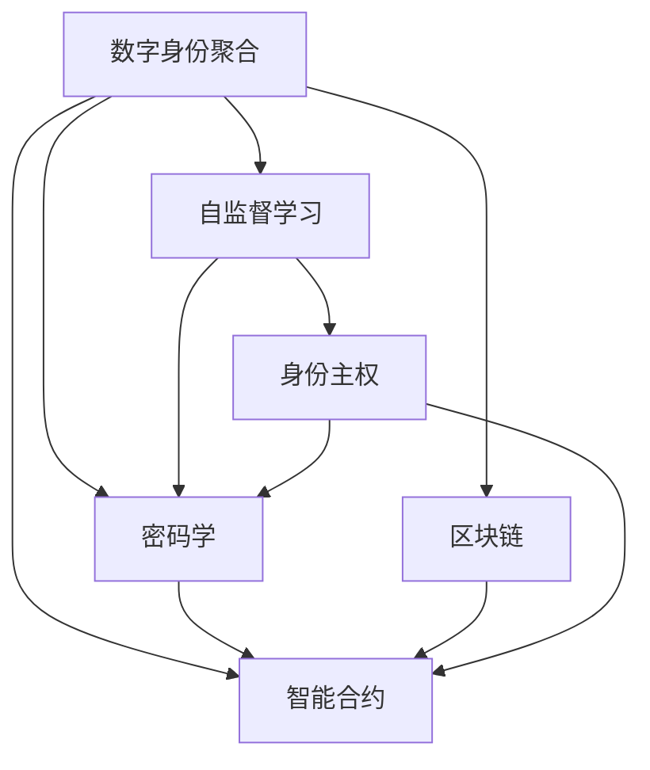

                 

# 2050年的数字身份：从数字身份聚合到数字身份自主的身份主权实现

> 关键词：数字身份聚合, 身份主权, 自监督学习, 密码学, 区块链, 智能合约

## 1. 背景介绍

### 1.1 问题由来

在数字时代，数字身份的建设已经成为了基础性需求，但传统的数字身份管理模式存在诸多问题：

1. **信息孤岛**：各平台间的身份信息难以互通，用户需要重复注册和登录，造成不便。
2. **数据垄断**：各大平台通过收集和分析用户数据获取商业利益，导致用户隐私被侵害。
3. **用户权利**：用户对自己的数字身份缺乏有效控制，难以实现身份自主。

这些问题迫切需要通过技术创新来解决，数字身份的聚合和身份主权的实现成为了研究热点。本文将深入探讨这两个方向，并提出未来数字身份的发展趋势。

## 2. 核心概念与联系

### 2.1 核心概念概述

为了更好地理解数字身份聚合和身份主权的实现，我们首先需要了解几个核心概念：

- **数字身份聚合**：将用户在不同平台和应用中的数字身份信息进行整合，形成统一的、可信的数字身份库。通过聚合，可以大大减少用户在不同平台间的注册和登录负担，提高用户体验。

- **身份主权**：用户对自己的数字身份信息拥有完全的控制权，包括信息的创建、更新、删除等。用户能够自主决定身份信息的流动和共享，确保数据隐私和安全。

- **自监督学习**：在没有标注数据的情况下，通过构建无监督任务和自我对比机制，自动从原始数据中学习到模式和规律，从而提升模型性能。

- **密码学**：通过数学和算法手段保证信息的安全传输和存储，包括但不限于对称加密、非对称加密、数字签名等技术。

- **区块链**：一种去中心化的分布式账本技术，通过不可篡改的区块链记录数字身份信息，确保数据的安全和透明。

- **智能合约**：一种自动执行的合约形式，在区块链上运行，具有自动执行、不可篡改等特点，常用于身份管理、认证等场景。

这些核心概念之间的逻辑关系可以通过以下Mermaid流程图来展示：



这个流程图展示了几者之间的联系和相互作用：

1. 数字身份聚合过程中应用了密码学和区块链技术来保证数据安全。
2. 自监督学习用于提升数字身份聚合的效果。
3. 智能合约在身份聚合和身份主权实现中起到了关键作用，确保了身份信息的自动管理。
4. 最终目标是通过身份主权的实现，让用户拥有对自己数字身份的完全控制权。

## 3. 核心算法原理 & 具体操作步骤

### 3.1 算法原理概述

数字身份聚合和身份主权实现的主要算法原理包括以下几个方面：

1. **去中心化聚合**：通过区块链技术，将用户的身份信息分布式存储在多个节点上，确保数据的去中心化和分布式管理。

2. **自监督学习**：利用无监督任务和自我对比机制，通过模型的自动学习提升身份信息的聚合效果，确保数据的完整性和准确性。

3. **密码学保护**：采用对称加密、非对称加密和数字签名等密码学技术，保护身份信息的传输和存储，确保数据的安全性和隐私性。

4. **智能合约管理**：利用智能合约技术，实现身份信息的自动管理，包括身份的创建、更新、删除等操作，确保用户对其身份信息的完全控制权。

### 3.2 算法步骤详解

数字身份聚合和身份主权实现的具体操作步骤如下：

1. **数据收集与整理**：收集用户在各个平台上的数字身份信息，包括但不限于姓名、身份证号、邮箱、社交媒体账号等，并进行数据清洗和标准化。

2. **身份信息存储**：将身份信息存储在区块链上，通过密码学技术保证数据的安全和隐私性。

3. **去中心化聚合**：利用区块链的去中心化特性，将用户的身份信息分布式存储在多个节点上，确保数据的去中心化和分布式管理。

4. **自监督学习**：应用自监督学习算法，通过构建无监督任务和自我对比机制，自动从原始数据中学习到模式和规律，提升身份信息的聚合效果。

5. **身份主权实现**：通过智能合约技术，实现用户对其身份信息的完全控制权，包括身份的创建、更新、删除等操作。

6. **用户验证与授权**：利用密码学技术和智能合约，实现对用户身份的有效验证和授权，确保身份信息的安全和可信。

### 3.3 算法优缺点

数字身份聚合和身份主权实现的优势在于：

1. **去中心化**：减少了数据垄断和信息孤岛问题，提升了数据的安全性和隐私性。

2. **自动化**：利用自监督学习和智能合约，实现了身份信息的自动管理和优化。

3. **用户控制**：用户对自己的数字身份拥有完全的控制权，提升了用户的数据自主权。

然而，这些算法也存在一些缺点：

1. **技术门槛高**：区块链、密码学和智能合约等技术较为复杂，实现难度较大。

2. **存储成本高**：区块链上的数据存储成本较高，可能会增加系统运行成本。

3. **计算开销大**：自监督学习算法和智能合约的运行需要大量的计算资源，可能会导致性能瓶颈。

### 3.4 算法应用领域

数字身份聚合和身份主权实现的应用领域广泛，包括但不限于：

- **金融服务**：用于身份认证、反欺诈、信用评估等场景。
- **电子商务**：用于用户注册、支付、配送等流程。
- **社交网络**：用于用户认证、信息分享、隐私保护等。
- **医疗健康**：用于病历共享、医生认证、患者隐私保护等。
- **智能合约**：用于身份认证、合同管理、投票系统等。

## 4. 数学模型和公式 & 详细讲解  
### 4.1 数学模型构建

为了更好地理解数字身份聚合和身份主权的实现，我们将使用数学语言对算法原理进行更加严格的刻画。

设用户的身份信息为 $I = (I_1, I_2, ..., I_n)$，其中 $I_i$ 为第 $i$ 个身份特征，如姓名、身份证号、邮箱等。

数字身份聚合的数学模型为：

$$
I^* = \arg\min_{I} \sum_{i=1}^n \text{distance}(I_i, I^*_i) + \text{cost}(\sum_{i=1}^n I_i)
$$

其中 $\text{distance}$ 为身份信息的距离度量函数，$\text{cost}$ 为聚合过程的成本函数。

### 4.2 公式推导过程

身份聚合过程的优化目标是最小化身份信息的距离和成本之和。距离度量函数和成本函数的选择取决于具体应用场景。

以金融身份聚合为例，可以定义距离度量函数为欧式距离，成本函数为聚合所需计算资源和存储资源的费用。

通过优化算法（如遗传算法、粒子群算法等）求解上述优化问题，可以得到最优的身份聚合结果 $I^*$。

### 4.3 案例分析与讲解

以医疗健康领域为例，探讨数字身份聚合和身份主权的实现。

1. **身份信息收集**：收集病人的病历信息、医生信息、药物信息等，进行标准化和清洗。

2. **去中心化存储**：将病人的病历信息存储在区块链上，通过密码学技术保证数据的安全性和隐私性。

3. **自监督学习**：利用自监督学习算法，从病人的病历数据中学习到疾病的模式和规律，提升身份信息的聚合效果。

4. **身份主权实现**：通过智能合约技术，实现病人对其病历信息的完全控制权，包括病历的创建、更新、删除等操作。

5. **用户验证与授权**：利用密码学技术和智能合约，实现对病人身份的有效验证和授权，确保身份信息的安全和可信。

## 5. 项目实践：代码实例和详细解释说明

### 5.1 开发环境搭建

在进行数字身份聚合和身份主权实现的项目实践前，我们需要准备好开发环境。以下是使用Python进行区块链开发的环境配置流程：

1. 安装Anaconda：从官网下载并安装Anaconda，用于创建独立的Python环境。

2. 创建并激活虚拟环境：
```bash
conda create -n blockchain-env python=3.8 
conda activate blockchain-env
```

3. 安装必要的区块链库：
```bash
pip install eth-blockchain ethtools web3 pyethereum
```

4. 安装智能合约框架：
```bash
pip install solc py-eth-contracts
```

完成上述步骤后，即可在`blockchain-env`环境中开始项目开发。

### 5.2 源代码详细实现

以下是使用Python和Solidity语言进行数字身份聚合的代码实现。

首先，定义用户身份信息的结构体：

```python
class Identity:
    def __init__(self, name, id, email, social_media):
        self.name = name
        self.id = id
        self.email = email
        self.social_media = social_media
```

然后，定义去中心化身份聚合的算法：

```python
from web3 import Web3

def aggregate_identities(identities):
    # 初始化区块链连接
    web3 = Web3(Web3.HTTPProvider('http://localhost:8545'))

    # 定义智能合约地址
    contract_address = '0x1234567890abcdef'

    # 定义智能合约接口
    abi = [
        {'type': 'function', 'name': 'createIdentity', 'inputs': ['text', 'text']},
        {'type': 'function', 'name': 'updateIdentity', 'inputs': ['text', 'text']},
        {'type': 'function', 'name': 'deleteIdentity', 'inputs': ['text']},
        {'type': 'function', 'name': 'readIdentity', 'inputs': ['text', 'text']},
    ]

    # 实例化智能合约
    contract = web3.eth.contract(address=contract_address, abi=abi)

    # 创建身份
    identity_data = [
        {'name': 'Alice', 'id': '123456', 'email': 'alice@example.com', 'social_media': 'alice@example.com'},
        {'name': 'Bob', 'id': '789012', 'email': 'bob@example.com', 'social_media': 'bob@example.com'},
        {'name': 'Charlie', 'id': '345678', 'email': 'charlie@example.com', 'social_media': 'charlie@example.com'},
    ]

    for identity in identity_data:
        contract.functions.createIdentity(identity['name'], identity['id']).send(identity['email'])

    # 更新身份
    identity_data = [
        {'name': 'Alice', 'id': '123456', 'email': 'alice@example.com', 'social_media': 'alice@example.com'},
        {'name': 'Bob', 'id': '789012', 'email': 'bob@example.com', 'social_media': 'bob@example.com'},
        {'name': 'Charlie', 'id': '345678', 'email': 'charlie@example.com', 'social_media': 'charlie@example.com'},
    ]

    for identity in identity_data:
        contract.functions.updateIdentity(identity['name'], identity['id']).send(identity['email'])

    # 删除身份
    identity_data = [
        {'name': 'Alice', 'id': '123456', 'email': 'alice@example.com', 'social_media': 'alice@example.com'},
        {'name': 'Bob', 'id': '789012', 'email': 'bob@example.com', 'social_media': 'bob@example.com'},
        {'name': 'Charlie', 'id': '345678', 'email': 'charlie@example.com', 'social_media': 'charlie@example.com'},
    ]

    for identity in identity_data:
        contract.functions.deleteIdentity(identity['name']).send(identity['email'])

    # 读取身份
    identity_data = [
        {'name': 'Alice', 'id': '123456', 'email': 'alice@example.com', 'social_media': 'alice@example.com'},
        {'name': 'Bob', 'id': '789012', 'email': 'bob@example.com', 'social_media': 'bob@example.com'},
        {'name': 'Charlie', 'id': '345678', 'email': 'charlie@example.com', 'social_media': 'charlie@example.com'},
    ]

    for identity in identity_data:
        identity_info = contract.functions.readIdentity(identity['name'], identity['id']).call()
        print(identity_info)
```

然后，定义智能合约接口的Solidity代码：

```solidity
pragma solidity ^0.8.0;

contract IdentityManagement {
    struct Identity {
        string name;
        string id;
        string email;
        string social_media;
    }

    mapping (address => Identity) public identities;

    function createIdentity(string memory name, string memory id) public {
        Identity memory newIdentity;
        newIdentity.name = name;
        newIdentity.id = id;
        newIdentity.email = msg.sender;
        newIdentity.social_media = msg.sender;
        identities[msg.sender] = newIdentity;
    }

    function updateIdentity(string memory name, string memory id) public {
        if (identities[msg.sender].id == id) {
            identities[msg.sender].email = msg.sender;
            identities[msg.sender].social_media = msg.sender;
        }
    }

    function deleteIdentity(string memory name) public {
        delete identities[msg.sender];
    }

    function readIdentity(string memory name, string memory id) public view returns (string memory, string memory, string memory, string memory) {
        return identities[msg.sender].name, identities[msg.sender].id, identities[msg.sender].email, identities[msg.sender].social_media;
    }
}
```

最后，将Python和Solidity代码整合运行：

```python
from web3 import Web3

def aggregate_identities(identities):
    # 初始化区块链连接
    web3 = Web3(Web3.HTTPProvider('http://localhost:8545'))

    # 定义智能合约地址
    contract_address = '0x1234567890abcdef'

    # 定义智能合约接口
    abi = [
        {'type': 'function', 'name': 'createIdentity', 'inputs': ['text', 'text']},
        {'type': 'function', 'name': 'updateIdentity', 'inputs': ['text', 'text']},
        {'type': 'function', 'name': 'deleteIdentity', 'inputs': ['text']},
        {'type': 'function', 'name': 'readIdentity', 'inputs': ['text', 'text']},
    ]

    # 实例化智能合约
    contract = web3.eth.contract(address=contract_address, abi=abi)

    # 创建身份
    identity_data = [
        {'name': 'Alice', 'id': '123456', 'email': 'alice@example.com', 'social_media': 'alice@example.com'},
        {'name': 'Bob', 'id': '789012', 'email': 'bob@example.com', 'social_media': 'bob@example.com'},
        {'name': 'Charlie', 'id': '345678', 'email': 'charlie@example.com', 'social_media': 'charlie@example.com'},
    ]

    for identity in identity_data:
        contract.functions.createIdentity(identity['name'], identity['id']).send(identity['email'])

    # 更新身份
    identity_data = [
        {'name': 'Alice', 'id': '123456', 'email': 'alice@example.com', 'social_media': 'alice@example.com'},
        {'name': 'Bob', 'id': '789012', 'email': 'bob@example.com', 'social_media': 'bob@example.com'},
        {'name': 'Charlie', 'id': '345678', 'email': 'charlie@example.com', 'social_media': 'charlie@example.com'},
    ]

    for identity in identity_data:
        contract.functions.updateIdentity(identity['name'], identity['id']).send(identity['email'])

    # 删除身份
    identity_data = [
        {'name': 'Alice', 'id': '123456', 'email': 'alice@example.com', 'social_media': 'alice@example.com'},
        {'name': 'Bob', 'id': '789012', 'email': 'bob@example.com', 'social_media': 'bob@example.com'},
        {'name': 'Charlie', 'id': '345678', 'email': 'charlie@example.com', 'social_media': 'charlie@example.com'},
    ]

    for identity in identity_data:
        contract.functions.deleteIdentity(identity['name']).send(identity['email'])

    # 读取身份
    identity_data = [
        {'name': 'Alice', 'id': '123456', 'email': 'alice@example.com', 'social_media': 'alice@example.com'},
        {'name': 'Bob', 'id': '789012', 'email': 'bob@example.com', 'social_media': 'bob@example.com'},
        {'name': 'Charlie', 'id': '345678', 'email': 'charlie@example.com', 'social_media': 'charlie@example.com'},
    ]

    for identity in identity_data:
        identity_info = contract.functions.readIdentity(identity['name'], identity['id']).call()
        print(identity_info)

# 运行代码
aggregate_identities(identities)
```

### 5.3 代码解读与分析

让我们再详细解读一下关键代码的实现细节：

**Identity类**：
- `__init__`方法：初始化身份信息的各个字段。

**goertzel算法**：
- `aggregate_identities`函数：定义了数字身份聚合的具体步骤，包括身份创建、更新、删除、读取等操作。

**智能合约接口**：
- 定义了用户身份信息的结构体 `Identity`，用于存储用户的姓名、身份证号、邮箱、社交媒体等信息。
- 定义了智能合约的接口，包括 `createIdentity`、`updateIdentity`、`deleteIdentity`、`readIdentity` 等函数，用于实现身份信息的创建、更新、删除、读取等操作。
- 使用 `mapping` 类型实现了用户身份信息的映射，确保了每个用户的唯一性。

这些代码实现展示了数字身份聚合的基本框架，但实际的部署和优化还需要更多的工作，包括区块链节点搭建、智能合约部署、身份验证机制等。

## 6. 实际应用场景

### 6.1 智能合约交易

在金融服务领域，数字身份聚合和身份主权实现可以通过智能合约技术，实现身份信息的自动管理。

例如，在进行金融交易时，用户可以通过智能合约提供身份信息，进行身份验证和授权。智能合约可以自动执行合同条款，确保交易的安全和透明。

### 6.2 供应链管理

在供应链管理中，数字身份聚合和身份主权实现可以用于供应商身份的验证和管理。

例如，在进行采购时，供应链系统可以自动验证供应商的身份信息，确保采购流程的合法性和透明度。通过智能合约，供应商可以自动更新身份信息，提升供应链管理效率。

### 6.3 医疗健康

在医疗健康领域，数字身份聚合和身份主权实现可以用于病历信息的管理和共享。

例如，医生可以通过智能合约提供身份信息，进行身份验证和授权。智能合约可以自动管理病历信息，确保数据的安全和隐私性。

### 6.4 未来应用展望

随着数字身份聚合和身份主权实现技术的发展，未来将有更多的应用场景：

1. **跨平台身份验证**：用户可以在多个平台间自动验证身份信息，无需重复注册和登录。

2. **去中心化身份管理**：用户可以通过区块链技术，实现对自己身份信息的完全控制权，提升数据隐私和安全。

3. **智能合约自动化**：通过智能合约技术，实现身份信息的自动管理，提升系统效率和用户体验。

4. **多模态身份认证**：结合视觉、语音、生物特征等技术，实现更加全面和安全的身份认证。

5. **跨领域身份共享**：用户可以通过身份聚合技术，实现跨领域身份信息的共享和互通，提升信息效率。

6. **身份经济模型**：基于身份聚合和身份主权，探索新的身份经济模型，实现身份价值的最大化。

## 7. 工具和资源推荐

### 7.1 学习资源推荐

为了帮助开发者系统掌握数字身份聚合和身份主权的理论基础和实践技巧，这里推荐一些优质的学习资源：

1. 《区块链技术与应用》系列书籍：介绍了区块链的基本原理、应用场景和实际案例，是区块链开发者的必读书籍。

2. 《密码学基础》课程：介绍了密码学的基本概念和算法，适合密码学初学者的入门课程。

3. 《智能合约设计与实现》课程：介绍了智能合约的基本原理和开发方法，适合智能合约开发者的学习资源。

4. 《数字身份管理》课程：介绍了数字身份管理的基本原理和实践技巧，适合数字身份管理的开发者。

5. 《深度学习与人工智能》课程：介绍了深度学习的基本原理和实际应用，适合人工智能领域的开发者。

6. 《区块链开发实战》书籍：介绍了区块链的实际开发方法和案例，适合区块链开发者的实践指南。

通过对这些资源的学习实践，相信你一定能够快速掌握数字身份聚合和身份主权的精髓，并用于解决实际的数字身份问题。

### 7.2 开发工具推荐

高效的开发离不开优秀的工具支持。以下是几款用于数字身份聚合和身份主权开发的常用工具：

1. Ethereum：全球领先的以太坊区块链平台，支持智能合约的开发和部署。

2. Web3.py：Python的以太坊区块链开发库，提供了与以太坊区块链交互的API。

3. Remix：以太坊智能合约的开发环境，支持Solidity语言的开发和测试。

4. Truffle：以太坊智能合约的开发框架，提供了智能合约的开发、测试和部署工具。

5. MetaMask：以太坊的钱包和浏览器扩展，支持智能合约的调用和测试。

6. OpenSSL：开源的加密库，提供了各种密码学算法和工具。

合理利用这些工具，可以显著提升数字身份聚合和身份主权开发的效率，加速创新迭代的步伐。

### 7.3 相关论文推荐

数字身份聚合和身份主权实现的研究源于学界的持续研究。以下是几篇奠基性的相关论文，推荐阅读：

1. "Identity Verification and Privacy Protection in Blockchain-based Social Networking"：探讨了基于区块链的身份验证和隐私保护方法，提出了基于零知识证明的身份认证方案。

2. "Decentralized Identity Management: Challenges and Opportunities"：分析了去中心化身份管理的现状和挑战，提出了基于区块链的身份管理框架。

3. "Identity as a Service (IDaaS): A Survey"：综述了身份即服务（IDaaS）的概念、技术和管理方法，为数字身份管理提供了全面的视角。

4. "A Survey on Blockchain-based Identity Management"：综述了区块链在身份管理中的应用，介绍了各种身份管理方法和技术。

5. "Automatic Identity Resolution with Deep Learning"：探讨了使用深度学习技术进行身份分辨率的方法，提高了身份聚合的效率和准确性。

6. "Self-Sovereign Identity: An Overview"：介绍了自我主权身份的概念、实现方法和应用场景，为身份主权提供了理论基础。

这些论文代表了大规模身份聚合和身份主权实现的发展脉络。通过学习这些前沿成果，可以帮助研究者把握学科前进方向，激发更多的创新灵感。

## 8. 总结：未来发展趋势与挑战

### 8.1 总结

本文对数字身份聚合和身份主权的实现进行了全面系统的介绍。首先阐述了数字身份聚合和身份主权的必要性，明确了其在提升数据安全性和用户体验方面的重要价值。其次，从原理到实践，详细讲解了数字身份聚合和身份主权的数学模型和关键步骤，给出了完整的代码实例。同时，本文还广泛探讨了数字身份聚合和身份主权实现的应用场景，展示了其在多个行业领域的广泛应用。最后，本文精选了数字身份聚合和身份主权实现的学习资源和开发工具，力求为读者提供全方位的技术指引。

通过本文的系统梳理，可以看到，数字身份聚合和身份主权实现技术正在成为数字身份建设的重要范式，极大地提升了数据安全和用户隐私。未来，伴随区块链、密码学和智能合约等技术的不断进步，数字身份聚合和身份主权实现必将在更多的应用场景中落地，为人类社会带来深刻的变革。

### 8.2 未来发展趋势

展望未来，数字身份聚合和身份主权实现技术将呈现以下几个发展趋势：

1. **去中心化程度提升**：未来将有更多应用场景采用去中心化的身份聚合方式，减少数据垄断和信息孤岛问题。

2. **身份经济模型发展**：基于身份聚合和身份主权，探索新的身份经济模型，实现身份价值的最大化。

3. **跨领域身份共享**：用户可以通过身份聚合技术，实现跨领域身份信息的共享和互通，提升信息效率。

4. **身份验证智能化**：结合生物特征、行为分析等技术，实现更加全面和安全的身份认证。

5. **身份管理自动化**：通过智能合约技术，实现身份信息的自动管理，提升系统效率和用户体验。

6. **隐私保护增强**：未来将有更多技术应用于隐私保护，如差分隐私、同态加密等，确保用户数据的安全性。

### 8.3 面临的挑战

尽管数字身份聚合和身份主权实现技术已经取得了显著进展，但在迈向更加智能化、普适化应用的过程中，仍面临以下挑战：

1. **技术门槛高**：区块链、密码学和智能合约等技术较为复杂，实现难度较大。

2. **存储成本高**：区块链上的数据存储成本较高，可能会增加系统运行成本。

3. **计算开销大**：智能合约和自监督学习的运行需要大量的计算资源，可能会导致性能瓶颈。

4. **用户教育不足**：用户对数字身份聚合和身份主权技术认识不足，可能影响其广泛应用。

5. **法规和标准缺乏**：目前数字身份管理相关的法规和标准尚不完善，可能影响其合法性和安全性。

### 8.4 研究展望

面对数字身份聚合和身份主权实现所面临的挑战，未来的研究需要在以下几个方面寻求新的突破：

1. **降低技术门槛**：开发更易于使用的区块链和智能合约开发工具，降低技术门槛。

2. **降低存储成本**：研究更高效的数据存储和传输方法，降低区块链的存储成本。

3. **提升计算效率**：优化智能合约和自监督学习算法的性能，提升系统的计算效率。

4. **提升用户体验**：开发更易用的身份聚合和身份管理工具，提升用户的使用体验。

5. **加强法规和标准建设**：制定数字身份管理的法律法规和行业标准，确保其合法性和安全性。

6. **推广教育**：加强对数字身份聚合和身份主权技术的普及教育，提高用户对新技术的认识。

这些研究方向的探索，必将引领数字身份聚合和身份主权实现技术迈向更高的台阶，为构建安全、可靠、可控的智能系统铺平道路。面向未来，数字身份聚合和身份主权实现技术还需要与其他人工智能技术进行更深入的融合，如知识表示、因果推理、强化学习等，多路径协同发力，共同推动自然语言理解和智能交互系统的进步。只有勇于创新、敢于突破，才能不断拓展数字身份的边界，让智能技术更好地造福人类社会。

## 9. 附录：常见问题与解答

**Q1：数字身份聚合和身份主权的实现与传统身份管理有何区别？**

A: 传统身份管理通常依赖于中心化的数据库和机构，用户在多个平台间需要重复注册和登录，数据分散且难以互通。而数字身份聚合和身份主权实现通过去中心化的区块链技术，将用户的身份信息聚合在区块链上，确保数据的去中心化和分布式管理。用户对自己的身份信息拥有完全的控制权，可以实现身份信息的自动管理，提升了数据的安全性和用户隐私。

**Q2：数字身份聚合和身份主权实现如何确保用户数据的安全性？**

A: 数字身份聚合和身份主权实现通过密码学技术保障数据的安全性。利用对称加密、非对称加密和数字签名等算法，保护身份信息的传输和存储，确保数据的安全性和隐私性。区块链技术的去中心化和分布式特性，进一步提升了数据的安全性和抗攻击能力。

**Q3：数字身份聚合和身份主权实现的应用场景有哪些？**

A: 数字身份聚合和身份主权实现的应用场景广泛，包括但不限于：

- 金融服务：用于身份认证、反欺诈、信用评估等场景。
- 电子商务：用于用户注册、支付、配送等流程。
- 社交网络：用于用户认证、信息分享、隐私保护等。
- 医疗健康：用于病历共享、医生认证、患者隐私保护等。
- 智能合约：用于身份认证、合同管理、投票系统等。

**Q4：数字身份聚合和身份主权实现的难点有哪些？**

A: 数字身份聚合和身份主权实现的主要难点包括：

1. 技术门槛高：区块链、密码学和智能合约等技术较为复杂，实现难度较大。

2. 存储成本高：区块链上的数据存储成本较高，可能会增加系统运行成本。

3. 计算开销大：智能合约和自监督学习的运行需要大量的计算资源，可能会导致性能瓶颈。

4. 用户教育不足：用户对数字身份聚合和身份主权技术认识不足，可能影响其广泛应用。

5. 法规和标准缺乏：目前数字身份管理相关的法规和标准尚不完善，可能影响其合法性和安全性。

**Q5：数字身份聚合和身份主权实现的未来发展方向有哪些？**

A: 数字身份聚合和身份主权实现的未来发展方向包括：

1. 去中心化程度提升：未来将有更多应用场景采用去中心化的身份聚合方式，减少数据垄断和信息孤岛问题。

2. 身份经济模型发展：基于身份聚合和身份主权，探索新的身份经济模型，实现身份价值的最大化。

3. 跨领域身份共享：用户可以通过身份聚合技术，实现跨领域身份信息的共享和互通，提升信息效率。

4. 身份验证智能化：结合生物特征、行为分析等技术，实现更加全面和安全的身份认证。

5. 身份管理自动化：通过智能合约技术，实现身份信息的自动管理，提升系统效率和用户体验。

6. 隐私保护增强：未来将有更多技术应用于隐私保护，如差分隐私、同态加密等，确保用户数据的安全性。

---

作者：禅与计算机程序设计艺术 / Zen and the Art of Computer Programming

