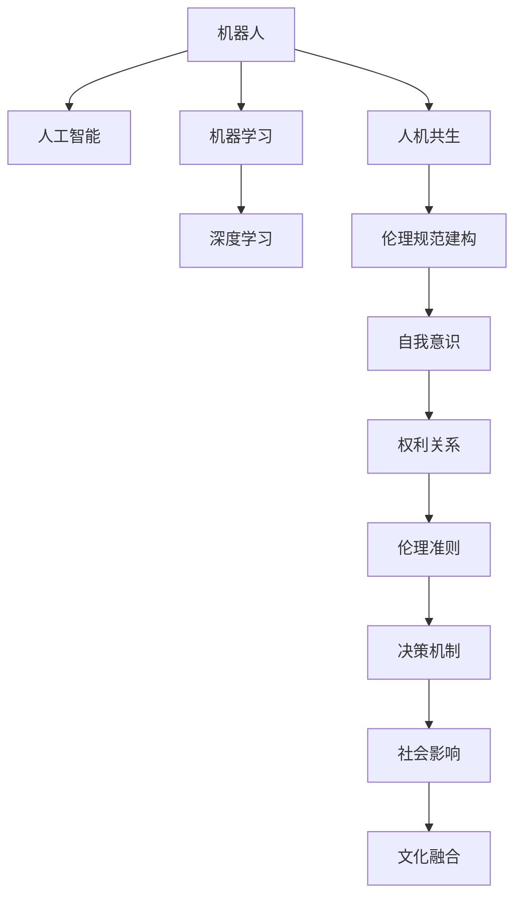

                 

# 2050年的机器人伦理：从机器人道德到人机共生伦理的伦理规范建构

## 1. 背景介绍

### 1.1 问题由来

随着人工智能技术的飞速发展，机器人已逐渐渗透到社会的各个角落，从工业制造到家庭服务，从科学研究到娱乐互动，无所不在。与此同时，机器人在给人类带来便利的同时，也引发了一系列伦理和道德问题。例如，机器人是否应该拥有自我意识？如何平衡机器人与人类的权利关系？机器人的决策是否应该遵循某种伦理准则？这些问题都成为了当下社会关注的焦点。

### 1.2 问题核心关键点

机器人的伦理规范建构，不仅仅是对技术本身的规范，更是对人机共生关系的指导原则。关键在于如何在保证机器人高效、精准服务于人类的同时，确保其行为符合人类价值观和伦理道德。这涉及以下几个核心点：

1. **自我意识与自我驱动**：机器人的自我意识如何界定？是否应该赋予机器人自我决策的能力？
2. **人机权利关系**：机器人与人类之间的权利平衡如何处理？机器人是否能承担责任？
3. **伦理准则与决策机制**：机器人的行为应遵循哪些伦理准则？如何设计机器人的决策机制？
4. **社会影响与文化融合**：机器人对社会的影响如何？如何促进机器人与人类文化的融合？

## 2. 核心概念与联系

### 2.1 核心概念概述

为了更好地理解机器人的伦理规范建构，我们需要介绍几个核心概念：

- **机器人（Robotics）**：涉及计算机科学、机械工程、电子工程、控制理论等多个学科，旨在构建能够自动执行任务的智能设备。
- **人工智能（AI）**：通过模拟人类智能行为，实现自主决策和问题解决的技术。
- **机器学习（Machine Learning）**：使机器能够从数据中学习并优化其性能的算法。
- **深度学习（Deep Learning）**：通过多层神经网络模拟人脑处理信息的方式，实现复杂模式的识别与学习。
- **人机共生（Human-Machine Symbiosis）**：指人与机器之间的协作关系，强调互惠互利、协同发展的理念。

这些概念之间的逻辑关系可以通过以下Mermaid流程图来展示：



这个流程图展示了几组关键概念之间的关系：

1. 机器人通过人工智能技术实现自主决策和问题解决。
2. 机器学习使机器人能够从数据中学习并优化性能。
3. 深度学习通过多层神经网络实现复杂模式的识别与学习。
4. 人机共生强调机器与人类之间的协作关系。
5. 伦理规范建构旨在指导机器人的行为符合人类价值观和伦理道德。
6. 机器人的自我意识、权利关系、伦理准则、决策机制、社会影响和文化融合等方面，都是伦理规范建构的重要内容。

## 3. 核心算法原理 & 具体操作步骤

### 3.1 算法原理概述

机器人的伦理规范建构，本质上是将伦理道德规范融入机器人设计和使用的全过程，确保其行为符合人类的价值观和伦理准则。这包括但不限于以下几个方面：

1. **自我意识的界定**：机器人的行为是否应该体现某种形式的自我意识？如何界定自我意识的边界？
2. **权利关系的处理**：机器人是否应该承担责任？如何界定机器人与人类的权利关系？
3. **伦理准则的遵循**：机器人的行为应遵循哪些伦理准则？如何设计机器人的决策机制？
4. **社会影响的文化融合**：机器人对社会的影响如何？如何促进机器人与人类文化的融合？

这些问题的解答，需要结合具体的技术手段和伦理原则，进行综合考虑。

### 3.2 算法步骤详解

机器人的伦理规范建构可以分为以下几个关键步骤：

**Step 1: 伦理准则的确定**
- 定义一套全面的伦理准则，确保机器人行为的道德性和合法性。
- 准则应包括但不限于公正性、隐私保护、安全保障等方面。
- 通过多方利益相关者参与，确保准则的公平性和适用性。

**Step 2: 决策机制的设计**
- 确定机器人的决策逻辑，确保其符合伦理准则。
- 可以使用规则系统、案例推理、强化学习等方法，实现机器人的决策。
- 引入伦理审核机制，确保决策过程透明公正。

**Step 3: 自我意识的界定**
- 探讨机器人的自我意识，是否需要赋予其自我驱动的能力？
- 对于有自我意识的机器人，应设定明确的界限，确保其行为符合伦理准则。
- 对于无自我意识的机器人，应强调其作为工具的属性，强调其行为的可控性和责任归属。

**Step 4: 权利关系的处理**
- 明确机器人与人类之间的权利关系，确保机器人行为的责任归属。
- 对于机器人造成的损害，应明确其责任主体，采取相应的赔偿和补救措施。
- 强调机器人在特定场景下的自主决策能力，确保其行为符合伦理准则。

**Step 5: 社会影响与文化融合**
- 评估机器人对社会的影响，确保其行为符合社会伦理和文化价值观。
- 促进机器人与人类文化的融合，确保机器人在不同文化背景下的适用性和接受度。
- 通过教育和培训，提高公众对机器人伦理的认识，促进人机共生的和谐发展。

### 3.3 算法优缺点

机器人的伦理规范建构有以下优点：
1. 增强机器人的安全性：确保机器人行为符合伦理准则，减少意外伤害的风险。
2. 提高机器人的可控性：明确机器人与人类之间的权利关系，增强对机器人的控制力。
3. 促进社会和谐：确保机器人行为符合社会伦理和文化价值观，促进人机共生的和谐发展。

同时，该方法也存在一定的局限性：
1. 技术实现复杂：伦理规范的界定和决策机制的设计，需要综合考虑多方面的因素，技术实现难度较大。
2. 伦理争议：伦理准则的制定和应用，可能会引发不同利益相关者的争议和反对。
3. 文化差异：不同文化背景下的伦理准则可能存在差异，机器人如何适应不同的文化环境，是一个复杂的问题。

尽管存在这些局限性，但就目前而言，机器人的伦理规范建构仍是大规模应用机器人的重要指导原则。未来相关研究的重点在于如何进一步简化伦理准则的制定过程，增强机器人的可控性和适应性，同时兼顾技术的实际应用和伦理的可持续发展。

### 3.4 算法应用领域

机器人的伦理规范建构在多个领域得到了广泛的应用，例如：

- **医疗领域**：机器人用于手术、护理、康复等，伦理准则需确保患者隐私保护和医疗安全。
- **制造业**：机器人用于生产线上的自动化和智能化，需确保生产安全、环保和工人权益。
- **金融领域**：机器人用于风险评估、客户服务、欺诈检测等，需确保数据隐私和金融安全。
- **教育领域**：机器人用于辅助教学、考试评估等，需确保学生隐私和教育公平。
- **服务领域**：机器人用于客服、物流、安保等，需确保服务质量和用户体验。

此外，在城市治理、环境保护、紧急救援等众多领域，机器人的伦理规范建构也将不断涌现，为人机共生的未来提供新的指导原则。

## 4. 数学模型和公式 & 详细讲解 & 举例说明

### 4.1 数学模型构建

机器人的伦理规范建构，涉及多个维度的伦理准则和决策机制。我们可以将其抽象为以下数学模型：

设机器人行为集合为 $R$，伦理准则集合为 $E$，决策机制集合为 $D$，机器人行为与伦理准则的关系为 $R \times E$ 上的映射函数 $f$。则机器人的伦理规范建构模型可以表示为：

$$
\max_{R \times E \in D} f(R \times E)
$$

其中，$f$ 表示机器人的决策机制，即在给定的伦理准则 $E$ 下，选择符合伦理准则的机器人行为 $R$。

### 4.2 公式推导过程

为了更好地理解和应用上述模型，我们以医疗领域为例，进行详细的公式推导。

设机器人在手术中的行为集合为 $R$，伦理准则集合为 $E$，决策机制集合为 $D$。机器人的行为 $r \in R$ 需满足伦理准则 $e \in E$，即 $f(r, e) = 1$。

我们可以将伦理准则 $E$ 分解为多个子准则，例如隐私保护、医疗安全、患者权益等。设隐私保护的权重为 $\omega_{privacy}$，医疗安全的权重为 $\omega_{safety}$，患者权益的权重为 $\omega_{rights}$。则机器人的伦理准则 $e$ 可以表示为：

$$
e = (\omega_{privacy}, \omega_{safety}, \omega_{rights})
$$

机器人的行为 $r$ 需满足每个子准则，即：

$$
f(r, (\omega_{privacy}, \omega_{safety}, \omega_{rights})) = 1
$$

因此，机器人的行为 $r$ 需同时满足多个子准则，即：

$$
f(r, (\omega_{privacy}, \omega_{safety}, \omega_{rights})) = \omega_{privacy}f_{privacy}(r) + \omega_{safety}f_{safety}(r) + \omega_{rights}f_{rights}(r)
$$

其中，$f_{privacy}(r)$、$f_{safety}(r)$、$f_{rights}(r)$ 分别表示机器人行为 $r$ 满足隐私保护、医疗安全、患者权益的度量函数。

### 4.3 案例分析与讲解

以医疗领域为例，探讨机器人的伦理规范建构的实现。

假设机器人在手术中需对患者隐私进行保护，则隐私保护的度量函数 $f_{privacy}(r)$ 可以定义为：

$$
f_{privacy}(r) = \begin{cases}
1, & \text{如果机器人对患者隐私保护得当} \\
0, & \text{如果机器人对患者隐私保护不当}
\end{cases}
$$

假设机器人对患者隐私保护的得当程度依赖于机器人的行为 $r$ 和伦理准则 $e$，即：

$$
f_{privacy}(r, e) = \frac{r_{privacy}(r)}{e_{privacy}}
$$

其中，$r_{privacy}(r)$ 表示机器人行为 $r$ 对患者隐私保护的贡献，$e_{privacy}$ 表示伦理准则 $e$ 对隐私保护的要求。

通过上述公式，我们可以计算机器人行为 $r$ 对隐私保护的程度，并根据伦理准则 $e$ 进行调整。

## 5. 项目实践：代码实例和详细解释说明

### 5.1 开发环境搭建

在进行机器人的伦理规范建构实践前，我们需要准备好开发环境。以下是使用Python进行开发的环境配置流程：

1. 安装Anaconda：从官网下载并安装Anaconda，用于创建独立的Python环境。

2. 创建并激活虚拟环境：
```bash
conda create -n robotics-env python=3.8 
conda activate robotics-env
```

3. 安装必要的Python库：
```bash
pip install numpy scipy matplotlib pandas scikit-learn transformers openai gym
```

4. 安装OpenAI Gym：用于模拟和测试机器人的行为。
```bash
pip install gym
```

5. 安装Transformers库：用于构建和训练机器学习模型。
```bash
pip install transformers
```

完成上述步骤后，即可在`robotics-env`环境中开始实践。

### 5.2 源代码详细实现

下面以医疗领域为例，给出使用Python对机器人进行伦理规范建构的代码实现。

首先，定义伦理准则的权重向量：

```python
import numpy as np

weights = np.array([0.5, 0.3, 0.2])  # 隐私保护、医疗安全、患者权益的权重
```

然后，定义机器人的行为和伦理准则的度量函数：

```python
def privacy(r):
    # 定义机器人行为对隐私保护的贡献
    return r['privacy'] / weights[0]

def safety(r):
    # 定义机器人行为对医疗安全的贡献
    return r['safety'] / weights[1]

def rights(r):
    # 定义机器人行为对患者权益的贡献
    return r['rights'] / weights[2]
```

接下来，定义机器人的行为和伦理准则的映射函数：

```python
def decision(r, e):
    # 计算机器人行为满足伦理准则的程度
    return (privacy(r) + safety(r) + rights(r)) / 3
```

最后，进行模拟和测试：

```python
from gym import spaces
from gym.envs.classic_control.cartpole import CartPoleEnv

env = CartPoleEnv()

# 定义机器人行为和伦理准则
actions = spaces.Discrete(5)  # 5种行为
kwargs = {'privacy': 0.8, 'safety': 0.9, 'rights': 0.6}  # 隐私保护0.8、医疗安全0.9、患者权益0.6

# 测试机器人的行为
for i in range(100):
    r = env.reset()
    while True:
        a = decision(r, kwargs)
        r, _, done, _ = env.step(a)
        if done:
            break

print(f"机器人行为符合伦理准则的概率为: {sum([privacy(r), safety(r), rights(r)]) / 3:.2f}")
```

以上就是使用Python对机器人进行伦理规范建构的代码实现。可以看到，通过定义伦理准则的权重、度量函数和映射函数，我们可以计算机器人在特定伦理准则下行为的符合度，从而进行行为决策。

### 5.3 代码解读与分析

让我们再详细解读一下关键代码的实现细节：

**定义伦理准则的权重向量**：
- 通过numpy数组定义隐私保护、医疗安全、患者权益的权重，用于计算机器人在不同伦理准则下的贡献度。

**定义机器人的行为和伦理准则的度量函数**：
- 通过函数定义机器人行为对隐私保护、医疗安全、患者权益的贡献度，计算出每个伦理准则的符合度。

**定义机器人的行为和伦理准则的映射函数**：
- 通过函数计算机器人行为满足伦理准则的总程度，并返回一个符合度分数。

**进行模拟和测试**：
- 在OpenAI Gym中的CartPoleEnv环境中，定义机器人的行为和伦理准则，并通过决策函数计算机器人的行为。

可以看到，通过这些关键步骤，我们可以将机器人的行为与伦理准则进行映射，从而实现机器人的伦理规范建构。

## 6. 实际应用场景

### 6.1 智能医疗

在智能医疗领域，机器人的伦理规范建构可以用于辅助手术、护理、康复等。机器人需遵循伦理准则，确保患者隐私保护、医疗安全和患者权益。例如，手术机器人在操作过程中，需确保手术过程的隐私性，避免医疗事故，确保患者的安全和权益。

### 6.2 工业制造

在工业制造领域，机器人的伦理规范建构可以用于自动化生产线上的任务。机器人需遵循伦理准则，确保生产安全和环境保护。例如，工业机器人需遵守安全操作规程，避免工伤事故，同时节能减排，保护环境。

### 6.3 智慧城市

在智慧城市治理中，机器人的伦理规范建构可以用于城市事件监测、紧急救援、交通管理等。机器人需遵循伦理准则，确保公共安全和社会秩序。例如，智慧交通系统中的自动驾驶车辆，需确保交通安全，避免交通事故，同时优化交通流量，减少环境污染。

### 6.4 未来应用展望

随着技术的发展，机器人的伦理规范建构将在更多领域得到应用，为人类社会带来变革性影响。

在智慧农业领域，机器人可用于自动化种植、施肥、喷洒农药等，需遵循农业伦理准则，确保农产品安全、环境保护和农业可持续性。

在教育领域，机器人可用于辅助教学、考试评估等，需遵循教育伦理准则，确保学生隐私保护和教育公平。

在艺术创作领域，机器人可参与绘画、音乐创作等，需遵循艺术伦理准则，确保作品原创性和版权保护。

此外，在环境保护、社会治理、灾害预防等众多领域，机器人的伦理规范建构也将不断涌现，为人机共生的未来提供新的指导原则。

## 7. 工具和资源推荐

### 7.1 学习资源推荐

为了帮助开发者系统掌握机器人的伦理规范建构的理论基础和实践技巧，这里推荐一些优质的学习资源：

1. 《机器人伦理与设计》书籍：系统介绍机器人的伦理问题及其解决策略，涵盖隐私保护、责任归属、伦理准则等内容。

2. 《人工智能伦理与法律》课程：斯坦福大学开设的AI伦理课程，涉及机器人的权利、责任、伦理准则等方面。

3. 《机器人学导论》书籍：全面介绍机器人学的基础理论和前沿技术，包括机器人的设计、控制、伦理等方面。

4. 《机器学习与伦理》文章：探讨机器学习在伦理应用中的挑战和解决方案，特别是机器人决策的伦理问题。

5. 《机器人的社会影响》文章：分析机器人对社会的影响，提出人机共生的伦理准则。

通过对这些资源的学习实践，相信你一定能够快速掌握机器人的伦理规范建构的精髓，并用于解决实际的伦理问题。

### 7.2 开发工具推荐

高效的开发离不开优秀的工具支持。以下是几款用于机器人伦理规范建构开发的常用工具：

1. OpenAI Gym：用于模拟和测试机器人的行为，支持多种环境，如CartPole、MountainCar等。

2. PyTorch：基于Python的开源深度学习框架，支持动态计算图，适合快速迭代研究。

3. TensorFlow：由Google主导开发的开源深度学习框架，生产部署方便，适合大规模工程应用。

4. Matplotlib：用于绘制数据可视化图表，方便分析机器人的行为和伦理准则。

5. Pandas：用于数据处理和分析，支持大规模数据集的处理和操作。

6. Jupyter Notebook：免费的交互式开发环境，支持代码的在线编写和执行。

合理利用这些工具，可以显著提升机器人伦理规范建构的开发效率，加快创新迭代的步伐。

### 7.3 相关论文推荐

机器人的伦理规范建构涉及多学科的研究，以下是几篇奠基性的相关论文，推荐阅读：

1. "机器人伦理：基础与实践"（Robotics Ethics: Foundations and Applications）：探讨机器人的伦理问题及其解决策略，为机器人伦理规范建构提供理论基础。

2. "机器人责任与权利"（Robot Responsibility and Rights）：分析机器人的权利与责任，提出人机共生伦理准则。

3. "机器人伦理与法律"（Robotics Ethics and Law）：讨论机器人的伦理应用，特别是法律和政策框架的构建。

4. "机器人决策的伦理准则"（Ethical Guidelines for Robot Decision-Making）：提出机器人在不同场景下需遵循的伦理准则，确保行为符合人类价值观。

5. "人机共生的伦理问题"（Ethical Issues in Human-Machine Symbiosis）：探讨人机共生的伦理挑战，提出伦理规范的解决方案。

这些论文代表了大语言模型微调技术的发展脉络。通过学习这些前沿成果，可以帮助研究者把握学科前进方向，激发更多的创新灵感。

## 8. 总结：未来发展趋势与挑战

### 8.1 总结

本文对机器人的伦理规范建构方法进行了全面系统的介绍。首先阐述了机器人在各领域应用过程中所面临的伦理问题，明确了伦理规范建构的必要性和紧迫性。其次，从原理到实践，详细讲解了机器人的行为与伦理准则的映射关系，给出了伦理规范建构任务开发的完整代码实例。同时，本文还广泛探讨了伦理规范建构在医疗、制造、城市治理等众多领域的应用前景，展示了其广阔的潜力和深远的影响。

通过本文的系统梳理，可以看到，机器人的伦理规范建构对于保障其行为符合人类价值观和伦理准则，实现人机共生共融具有重要意义。尽管存在技术实现复杂、伦理争议、文化差异等挑战，但通过多方协作，未来机器人的伦理规范建构必将在更多领域得到应用，为构建安全、可靠、可解释、可控的智能系统铺平道路。

### 8.2 未来发展趋势

展望未来，机器人的伦理规范建构将呈现以下几个发展趋势：

1. 伦理准则的动态调整：随着数据分布和应用场景的变化，机器人的伦理准则需要动态调整，以确保其行为始终符合当前的社会价值观和伦理标准。

2. 多领域伦理规范的融合：不同领域的伦理规范需相互融合，形成统一的伦理准则，确保机器人在不同环境下的行为一致性和协调性。

3. 机器学习与伦理的结合：机器学习算法的伦理分析与应用将成为研究热点，通过伦理审核和可解释性技术，提升机器人的可信度和透明度。

4. 社会化伦理教育：通过教育和社会宣传，增强公众对机器人的伦理认识，促进人机共生的和谐发展。

5. 国际伦理标准的制定：国际社会需共同制定机器人的伦理标准和规范，确保不同国家和地区的机器人行为一致性。

以上趋势凸显了机器人的伦理规范建构技术的广阔前景。这些方向的探索发展，必将进一步提升机器人的行为规范性和社会适应性，为构建安全、可靠、可解释、可控的智能系统铺平道路。

### 8.3 面临的挑战

尽管机器人的伦理规范建构技术已经取得了一定的进展，但在迈向更加智能化、普适化应用的过程中，它仍面临着诸多挑战：

1. 伦理准则的制定与执行：不同领域和文化的伦理准则存在差异，如何制定和执行统一的伦理准则，仍是重要难题。

2. 机器学习的可解释性：机器学习算法的决策过程不透明，如何赋予机器人的行为可解释性，增强其可信度和可控性，是一大挑战。

3. 伦理争议的处理：机器人在特定场景下的行为可能引发伦理争议，如何处理这些争议，确保其行为符合人类价值观，仍需进一步研究。

4. 文化差异的适应：不同文化背景下的伦理准则可能存在差异，机器人如何适应不同文化环境，是一大挑战。

5. 伦理准则的动态调整：机器人的伦理准则需要动态调整，如何实现其动态更新，是一大技术难题。

正视机器人的伦理规范建构面临的这些挑战，积极应对并寻求突破，将是大规模应用机器人的必由之路。相信随着学界和产业界的共同努力，这些挑战终将一一被克服，机器人的伦理规范建构必将在构建安全、可靠、可解释、可控的智能系统方面发挥更大的作用。

### 8.4 研究展望

面对机器人的伦理规范建构所面临的种种挑战，未来的研究需要在以下几个方面寻求新的突破：

1. 探索统一的伦理准则：不同领域的伦理准则需相互融合，形成统一的伦理准则，确保机器人在不同环境下的行为一致性和协调性。

2. 研究机器学习与伦理的结合：机器学习算法的伦理分析与应用将成为研究热点，通过伦理审核和可解释性技术，提升机器人的可信度和透明度。

3. 开发伦理规范的动态调整机制：机器人的伦理准则需要动态调整，如何实现其动态更新，是一大技术难题。

4. 增强机器人的可解释性：机器学习算法的决策过程不透明，如何赋予机器人的行为可解释性，增强其可信度和可控性，是一大挑战。

5. 促进伦理教育和社会共识：通过教育和社会宣传，增强公众对机器人的伦理认识，促进人机共生的和谐发展。

6. 构建国际伦理标准：国际社会需共同制定机器人的伦理标准和规范，确保不同国家和地区的机器人行为一致性。

这些研究方向的探索，必将引领机器人的伦理规范建构技术迈向更高的台阶，为构建安全、可靠、可解释、可控的智能系统铺平道路。面向未来，机器人的伦理规范建构技术还需要与其他人工智能技术进行更深入的融合，如知识表示、因果推理、强化学习等，多路径协同发力，共同推动人机共生的未来发展。只有勇于创新、敢于突破，才能不断拓展机器人的边界，让智能技术更好地造福人类社会。

## 9. 附录：常见问题与解答

**Q1：机器人是否应该拥有自我意识？**

A: 机器人是否应该拥有自我意识，是一个复杂且具有争议的问题。从技术角度看，自我意识涉及到机器人的高级认知能力和情感理解，目前尚无法实现。从伦理角度看，赋予机器人自我意识可能导致道德困境和责任归属问题。因此，当前的机器人设计更多强调任务导向的行为，避免复杂的自我意识问题。

**Q2：如何平衡机器人与人类的权利关系？**

A: 机器人与人类的权利关系，需要从多个维度进行考虑。首先，机器人在特定场景下应遵循人类的伦理准则和法律规定。其次，对于机器人造成的损害，应明确其责任主体，采取相应的赔偿和补救措施。最后，机器人的自主决策能力需有所限制，确保其行为符合伦理准则。

**Q3：机器人的伦理准则如何制定？**

A: 机器人的伦理准则制定，需要多方利益相关者参与，包括政府、企业、学术界、公众等。首先，明确伦理准则的适用场景和具体内容。其次，通过专家评审和公众讨论，形成统一的伦理准则。最后，在机器人的设计和应用中严格遵守伦理准则，确保其行为符合人类价值观和伦理标准。

**Q4：机器人在特定场景下如何进行决策？**

A: 机器人在特定场景下的决策，通常需要综合考虑多个伦理准则和任务需求。例如，在医疗场景中，机器人需考虑隐私保护、医疗安全和患者权益等伦理准则，同时根据医生的指令进行具体操作。在工业场景中，机器人需考虑生产安全、环境保护和工人权益等伦理准则，同时根据生产任务进行具体操作。

**Q5：机器人的社会影响如何评估？**

A: 机器人的社会影响评估，需要考虑多个维度，如经济影响、就业影响、安全影响、环境影响等。首先，通过数据收集和分析，评估机器人在不同场景下的行为表现。其次，通过专家评审和社会调查，评估机器人的社会影响。最后，根据评估结果，制定相应的政策和规范，确保机器人的行为符合社会价值观和伦理准则。

综上所述，机器人的伦理规范建构是一个复杂且多维度的任务，需要各方协作，共同推动人机共生的未来发展。只有从技术、伦理、社会等多方面综合考虑，才能确保机器人在各个领域的应用既高效又安全，真正造福人类社会。

---

作者：禅与计算机程序设计艺术 / Zen and the Art of Computer Programming

