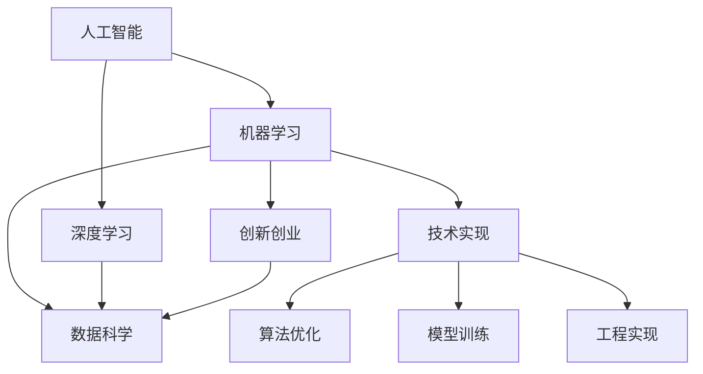

                 

# 年轻人如何在AI领域做实事

> 关键词：
> - 人工智能
> - 实践指南
> - 机器学习
> - 深度学习
> - 数据科学
> - 创新创业
> - 技术实现

## 1. 背景介绍

### 1.1 问题由来

近年来，人工智能(AI)技术的飞速发展，在各行各业中产生了深远影响。无论是医疗、金融、教育、制造，还是交通、物流、娱乐，AI技术的应用都带来了显著的效率提升和成本降低。然而，对许多人特别是年轻人来说，虽然对AI抱有浓厚的兴趣，但在实际工作中能够深入AI技术并做出实际贡献的机会却相对有限。如何帮助年轻人更好地理解AI技术，并在实践中积累经验，成为当前教育与培训领域的一大挑战。

### 1.2 问题核心关键点

为了帮助年轻人更好地在AI领域实现自我价值，以下关键点值得注意：

- **基础知识的积累**：掌握AI技术需要坚实的数据科学、统计学、计算机科学和数学基础。
- **实践技能的提升**：理论知识与实际操作相结合，通过项目实践积累实战经验。
- **跨学科知识的应用**：AI技术的应用场景广泛，跨学科知识的应用能力尤为重要。
- **持续学习与创新**：AI领域日新月异，保持学习和创新的态度，才能跟上技术发展的步伐。
- **项目和团队协作**：参与实际项目和团队协作，培养解决复杂问题的能力。
- **伦理与责任意识**：人工智能应用过程中，需要高度关注伦理与责任问题，确保技术的健康发展。

### 1.3 问题研究意义

帮助年轻人更好地理解并实践AI技术，对于提升整个社会的科技水平和创新能力具有重要意义：

- **加速技术创新**：年轻一代的加入将为AI领域带来新的视角和思维模式，推动技术不断向前发展。
- **促进跨学科交流**：不同背景的年轻人汇聚在一起，可以促进跨学科知识的交流与融合，激发更多创新成果。
- **提升社会生产力**：AI技术的应用将提高各行各业的效率，帮助社会更好地应对未来的挑战。
- **培养未来领袖**：通过实践和创新，培养出一批有社会责任感和伦理意识的技术领袖，引领AI技术走向更广阔的未来。

## 2. 核心概念与联系

### 2.1 核心概念概述

理解AI技术的基础需要掌握以下核心概念：

- **人工智能**：指通过计算机程序实现的人类智能模拟，包括感知、推理、学习和决策等能力。
- **机器学习**：指通过算法和数据训练模型，使其能够自动学习和改进，实现数据驱动的决策过程。
- **深度学习**：指利用多层神经网络对复杂数据进行深度抽象和表示，是实现机器学习的核心技术。
- **数据科学**：涉及数据的收集、处理、分析和可视化，是进行机器学习和深度学习的前提。
- **创新创业**：指利用AI技术创新产品和服务，创办具有社会和商业价值的公司。
- **技术实现**：指将AI技术转化为实际应用的开发过程，包括算法优化、模型训练、工程实现等。

### 2.2 核心概念原理和架构的 Mermaid 流程图



## 3. 核心算法原理 & 具体操作步骤

### 3.1 算法原理概述

AI技术的实现通常遵循以下流程：

1. **数据收集与预处理**：收集相关的数据集，进行清洗和预处理，确保数据质量和可用性。
2. **特征工程**：通过分析数据特性，选择合适的特征并提取，为模型提供有意义的输入。
3. **模型选择与训练**：根据任务需求选择合适的算法模型，并使用训练数据进行模型训练，优化模型参数。
4. **模型评估与优化**：通过测试集对模型进行评估，识别模型的不足并进行优化调整。
5. **模型部署与应用**：将训练好的模型部署到实际应用场景中，进行数据分析、预测或决策。

### 3.2 算法步骤详解

以下是AI项目开发的一个具体步骤，以图像分类为例：

**Step 1: 数据收集与预处理**
- 从公共数据集或自定义场景中收集图像数据。
- 进行数据清洗，去除噪点、重复图像，确保数据集的多样性和代表性。
- 进行数据增强，如旋转、缩放、翻转等，扩充数据集以提高模型泛化能力。

**Step 2: 特征工程**
- 选择适当的特征提取方法，如卷积神经网络(CNN)。
- 提取图像的特征，如颜色、纹理、形状等。
- 将特征向量输入模型，进行训练和优化。

**Step 3: 模型选择与训练**
- 选择适合分类任务的深度学习模型，如卷积神经网络(CNN)。
- 使用训练数据集进行模型训练，优化模型参数，确保模型能够准确分类。
- 采用适当的优化算法，如随机梯度下降(SGD)或Adam算法。

**Step 4: 模型评估与优化**
- 使用测试集对模型进行评估，计算准确率、召回率、F1分数等指标。
- 根据评估结果，识别模型的不足并进行优化调整，如增加层数、调整学习率等。
- 进行交叉验证，确保模型的稳定性和可靠性。

**Step 5: 模型部署与应用**
- 将训练好的模型进行保存和部署，如使用TensorFlow或PyTorch等框架。
- 将模型集成到实际应用场景中，进行图像分类、目标检测等任务。
- 对模型进行实时监测和更新，确保模型的长期稳定性和性能。

### 3.3 算法优缺点

AI算法的优缺点如下：

- **优点**：
  - **高效性**：自动化处理大量数据，提高分析效率。
  - **精确性**：通过模型训练和优化，提高预测和决策的准确性。
  - **可扩展性**：可以处理大规模数据，适应各种应用场景。

- **缺点**：
  - **高成本**：高质量数据和计算资源需求大。
  - **复杂性**：算法实现和模型优化较为复杂。
  - **黑盒问题**：部分算法和模型输出难以解释和调试。

### 3.4 算法应用领域

AI技术在多个领域都有广泛应用，以下是几个典型应用场景：

- **医疗健康**：通过图像分析、自然语言处理(NLP)等技术，辅助疾病诊断、智能问诊。
- **金融科技**：通过大数据分析和预测模型，进行风险控制、智能投顾。
- **智能制造**：通过机器视觉和机器学习技术，优化生产流程、质量控制。
- **交通运输**：通过传感器数据和智能决策，优化交通流量、提升安全管理。
- **娱乐产业**：通过图像识别、语音合成等技术，提升用户体验、创新产品。

## 4. 数学模型和公式 & 详细讲解 & 举例说明

### 4.1 数学模型构建

以线性回归模型为例，其数学模型可以表示为：

$$
y = \beta_0 + \beta_1x_1 + \beta_2x_2 + \ldots + \beta_nx_n + \epsilon
$$

其中，$y$ 为预测值，$x_i$ 为输入特征，$\beta_i$ 为模型参数，$\epsilon$ 为误差项。

### 4.2 公式推导过程

线性回归的优化目标是最小化预测值与真实值之间的误差平方和，即：

$$
\min_{\beta} \sum_{i=1}^n (y_i - \hat{y_i})^2
$$

其中，$\hat{y_i}$ 为预测值。通过求解上述优化问题，可得到参数 $\beta$ 的估计值。

使用梯度下降法进行参数估计，公式如下：

$$
\beta \leftarrow \beta - \eta \nabla_{\beta} \sum_{i=1}^n (y_i - \hat{y_i})^2
$$

其中，$\eta$ 为学习率，$\nabla_{\beta}$ 为误差函数对参数 $\beta$ 的梯度。

### 4.3 案例分析与讲解

以房价预测为例，说明线性回归模型的应用：

- **数据集**：收集历史房产数据，包含房产面积、楼层、朝向等特征。
- **模型构建**：使用线性回归模型，预测房产价格。
- **训练与优化**：使用训练数据集进行模型训练，通过梯度下降法优化模型参数。
- **测试与评估**：使用测试集对模型进行评估，计算均方误差(MSE)等指标。

## 5. 项目实践：代码实例和详细解释说明

### 5.1 开发环境搭建

开发环境搭建主要包括以下几个步骤：

1. **安装Python**：Python是进行AI开发的基础语言，可在官网下载安装最新版本的Python。
2. **安装NumPy、Pandas等科学计算库**：用于数据处理和分析。
3. **安装Scikit-Learn**：提供简单易用的机器学习算法和工具。
4. **安装TensorFlow或PyTorch**：深度学习框架，用于构建和训练AI模型。
5. **安装Jupyter Notebook**：交互式开发环境，方便代码编写和调试。

### 5.2 源代码详细实现

以下是一个简单的线性回归模型实现，使用Scikit-Learn库：

```python
from sklearn.linear_model import LinearRegression
import numpy as np
import pandas as pd

# 读取数据集
data = pd.read_csv('data.csv')

# 数据预处理
X = data[['area', 'floor', 'orientation']]
y = data['price']

# 构建模型
model = LinearRegression()

# 训练模型
model.fit(X, y)

# 预测新数据
new_data = np.array([[120, 5, 0]])
prediction = model.predict(new_data)
print(prediction)
```

### 5.3 代码解读与分析

**数据读取与预处理**：
- 使用Pandas库读取CSV格式的数据集，并进行数据清洗和特征提取。

**模型构建与训练**：
- 使用Scikit-Learn库中的LinearRegression类，构建线性回归模型。
- 调用fit方法进行模型训练，传入特征和标签数据。

**模型预测与评估**：
- 使用predict方法对新数据进行预测，返回预测值。

**结果展示**：
- 输出预测结果，显示房价预测值。

## 6. 实际应用场景

### 6.1 医疗健康

在医疗健康领域，AI技术通过图像分析、NLP等手段，实现了疾病诊断、智能问诊等功能。以下是一个图像分类应用的例子：

**背景**：开发一个辅助医生诊断皮肤癌的系统，通过分析患者皮肤图像，快速识别是否为恶性肿瘤。

**实现步骤**：
1. **数据收集**：收集大量的皮肤图像数据，包括正常皮肤和恶性肿瘤图像。
2. **数据预处理**：对图像进行清洗、增强和标准化。
3. **模型选择与训练**：选择卷积神经网络(CNN)模型，使用训练数据进行模型训练和优化。
4. **模型评估与优化**：在测试集上进行模型评估，根据评估结果进行参数调整。
5. **模型部署与应用**：将训练好的模型集成到医疗系统中，进行实时图像分类。

### 6.2 金融科技

在金融科技领域，AI技术通过大数据分析和预测模型，实现了风险控制、智能投顾等功能。以下是一个信用评分应用例子：

**背景**：开发一个信用评分系统，根据用户的个人信息和行为数据，预测其信用风险等级。

**实现步骤**：
1. **数据收集**：收集用户的个人信息、消费记录、还款记录等数据。
2. **数据预处理**：对数据进行清洗、特征工程和标准化。
3. **模型选择与训练**：选择逻辑回归或随机森林等算法模型，使用训练数据进行模型训练和优化。
4. **模型评估与优化**：在测试集上进行模型评估，根据评估结果进行参数调整。
5. **模型部署与应用**：将训练好的模型集成到金融系统中，进行实时信用评分。

### 6.3 智能制造

在智能制造领域，AI技术通过机器视觉和机器学习技术，优化生产流程、质量控制。以下是一个质量检测应用例子：

**背景**：开发一个质量检测系统，通过分析生产线上产品的图像，自动检测产品缺陷。

**实现步骤**：
1. **数据收集**：收集生产线上产品的图像数据。
2. **数据预处理**：对图像进行清洗、增强和标准化。
3. **模型选择与训练**：选择卷积神经网络(CNN)模型，使用训练数据进行模型训练和优化。
4. **模型评估与优化**：在测试集上进行模型评估，根据评估结果进行参数调整。
5. **模型部署与应用**：将训练好的模型集成到生产线上，进行实时质量检测。

## 7. 工具和资源推荐

### 7.1 学习资源推荐

为了帮助年轻人更好地掌握AI技术，以下是一些优质的学习资源：

1. **Coursera**：提供大量在线课程，涵盖数据科学、机器学习、深度学习等。
2. **Kaggle**：提供数据科学竞赛和数据集，通过实践提升技能。
3. **DeepLearning.AI**：由Andrew Ng教授创办，提供高质量的AI课程和资源。
4. **ArXiv**：最新的AI研究成果发布平台，保持学习与研究的前沿性。
5. **GitHub**：开源社区，可以找到大量的AI项目和代码资源。

### 7.2 开发工具推荐

以下是一些常用的AI开发工具：

1. **Jupyter Notebook**：交互式开发环境，支持多种编程语言和库。
2. **TensorFlow**：深度学习框架，支持GPU和TPU加速。
3. **PyTorch**：深度学习框架，提供动态图和静态图两种方式。
4. **Keras**：高层API，简化深度学习模型的构建和训练。
5. **Anaconda**：Python科学计算环境，方便管理依赖和开发。

### 7.3 相关论文推荐

以下是几篇具有代表性的AI相关论文：

1. **《Deep Learning》**：Ian Goodfellow等人撰写，全面介绍深度学习理论和实践。
2. **《Pattern Recognition and Machine Learning》**：Christopher Bishop撰写，涵盖机器学习基本概念和算法。
3. **《Natural Language Processing with Transformers》**：Thomas Wolf等人撰写，介绍Transformer模型及其应用。
4. **《Hands-On Machine Learning with Scikit-Learn, Keras, and TensorFlow》**：Aurélien Géron撰写，实战性很强的机器学习入门书籍。

## 8. 总结：未来发展趋势与挑战

### 8.1 研究成果总结

AI技术在过去十年中取得了飞速发展，主要研究方向包括：

- **深度学习**：通过多层神经网络实现复杂数据的表示与学习。
- **自然语言处理**：通过语言模型和NLP技术，实现语言理解和生成。
- **计算机视觉**：通过图像识别和处理技术，实现物体检测、图像分类等。
- **机器人技术**：通过AI和机械结合，实现自主导航、任务执行等。

### 8.2 未来发展趋势

未来AI技术的发展趋势如下：

- **自动化与智能化**：AI技术将变得更加自动化和智能化，能够自主学习和决策。
- **多模态融合**：将文本、图像、语音等多种数据模态融合，提升模型的综合能力。
- **联邦学习**：通过分布式计算，保护数据隐私和安全。
- **生成对抗网络**：利用生成网络和对抗网络技术，生成更加逼真的数据和模型。
- **边缘计算**：将AI技术部署到边缘设备，实现低延迟和高效率的数据处理。

### 8.3 面临的挑战

AI技术在发展过程中也面临一些挑战：

- **数据隐私与安全**：如何保护用户数据隐私，防止数据泄露和滥用。
- **伦理与社会责任**：AI决策过程中，如何避免偏见和歧视，确保公平性和透明性。
- **计算资源限制**：高精度、大规模模型的计算需求，对硬件资源提出了高要求。
- **模型复杂性**：如何优化模型结构，提高模型的可解释性和易用性。
- **跨领域应用**：如何将AI技术应用到不同领域，实现跨领域的创新和突破。

### 8.4 研究展望

未来的AI技术研究应注重以下几个方面：

- **理论研究**：深入研究AI理论基础，如因果推理、迁移学习等。
- **技术创新**：开发更加高效、可解释的AI算法和技术。
- **多学科融合**：与其他学科如医学、社会学、伦理学等融合，推动AI技术的应用创新。
- **应用落地**：将AI技术应用到更多实际场景中，解决现实问题，提升社会生产力。
- **伦理与安全**：加强AI技术的伦理与安全研究，确保技术应用的公平性和安全性。

## 9. 附录：常见问题与解答

### Q1: AI技术是否需要数学和编程基础？

A: 是的，AI技术的发展离不开数学和编程基础。例如，机器学习需要统计学知识，深度学习需要编程技能，数据科学需要数据处理能力。

### Q2: 如何学习AI技术？

A: 可以通过以下步骤学习AI技术：
1. **基础知识学习**：掌握数学、统计学、计算机科学和数据科学等基础知识。
2. **编程技能提升**：熟练掌握Python、R等编程语言。
3. **在线课程和资源**：参加在线课程，如Coursera、Udacity等，或阅读相关书籍和论文。
4. **实践项目开发**：通过实际项目积累经验，如Kaggle竞赛、开源项目等。
5. **加入社区**：加入技术社区，如GitHub、Stack Overflow等，与其他开发者交流。

### Q3: 如何选择合适的AI项目？

A: 选择AI项目时，可以从以下几个方面考虑：
1. **兴趣与需求**：选择自己感兴趣的领域，并考虑实际应用需求。
2. **数据可用性**：选择数据充足、质量较高的项目。
3. **技术难度**：选择与自己技术水平相匹配的项目，逐步提升难度。
4. **成果展示**：选择有明确成果展示的项目，积累实际经验。

### Q4: 如何避免AI中的偏见和歧视？

A: 避免AI中的偏见和歧视，可以从以下几个方面入手：
1. **数据清洗与预处理**：确保数据集的多样性和代表性，去除有偏见的数据。
2. **模型优化与调整**：通过调整模型参数和优化算法，减少模型的偏见。
3. **伦理审查与监管**：建立伦理审查机制，确保AI应用的公平性和透明性。
4. **跨学科合作**：与伦理学家、社会学家等跨学科合作，共同研究解决偏见问题。

---

作者：禅与计算机程序设计艺术 / Zen and the Art of Computer Programming

