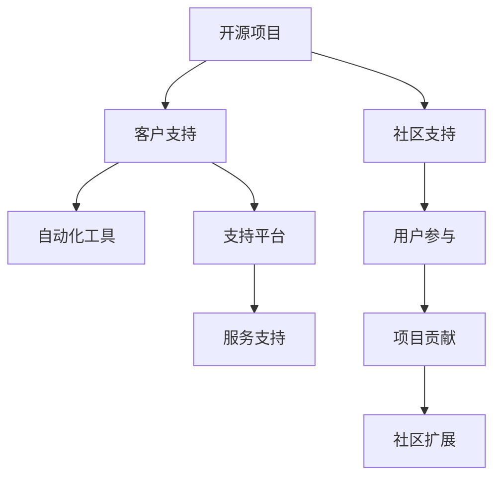

                 

# 开源项目的商业化客户支持：支持模式和工具

## 1. 背景介绍

### 1.1 问题由来
开源项目在过去几十年的发展中，为软件生态带来了巨大的活力。然而，在商业化的过程中，开源项目如何提供高质量的客户支持，是一个亟需解决的问题。随着开源项目的规模和复杂度不断提升，单一的开发者或小团队可能难以覆盖广泛的用户需求。此外，开源项目本身也面临着管理和维护的困难，导致用户遇到问题时得不到及时响应和解决。

### 1.2 问题核心关键点
要解决开源项目客户支持的痛点，首先需要考虑的是支持的成本和效率。支持成本高昂且难以管理，支持效率低下导致用户体验不佳。为了降低成本和提升效率，有必要研究有效的客户支持模式和工具。

### 1.3 问题研究意义
开源项目的商业化进程中，客户支持是其成功与否的关键。良好的客户支持能够提升用户满意度，增强项目黏性，吸引更多用户参与和贡献。同时，客户支持也是项目盈利的重要途径，能够帮助项目团队获得足够的资金支持。因此，研究客户支持模式和工具，对于开源项目的长期发展至关重要。

## 2. 核心概念与联系

### 2.1 核心概念概述

为了更好地理解开源项目客户支持的各个环节，本节将介绍几个密切相关的核心概念：

- **开源项目(Open Source Project)**：使用开源许可证发布，任何人都可以访问、修改和使用其源代码的软件项目。开源项目通常依赖社区的力量进行维护和扩展。

- **客户支持(Customer Support)**：在项目开发、使用和部署过程中，对用户提出的问题、故障和需求进行解答、诊断和解决的动态过程。

- **社区支持(Community Support)**：开源项目社区成员在遇到问题时，相互交流、帮助和分享知识的过程。社区支持是开源项目的重要组成部分，有助于形成项目的生态和黏性。

- **自动化工具(Automated Tools)**：用于自动化执行日常支持任务的工具，如代码审查、错误报告、文档生成等。自动化工具能够提高支持效率，降低人力成本。

- **支持平台(Support Platforms)**：专门为开源项目设计的一站式支持解决方案，包括问题跟踪、知识库、文档管理等功能模块。支持平台是提升客户支持效率的关键。

- **服务支持(Service Support)**：基于云服务提供的专业化支持服务，能够提供更高效、更稳定的客户支持解决方案。服务支持对于大规模开源项目尤为重要。

这些核心概念之间的逻辑关系可以通过以下Mermaid流程图来展示：



这个流程图展示开源项目的核心概念及其之间的关系：

1. 开源项目通过社区支持形成生态。
2. 客户支持依赖社区支持，同时通过自动化工具和支持平台提升效率。
3. 支持平台和服务支持进一步提升客户支持的精度和响应速度。
4. 社区的参与和扩展是项目成功的关键。

## 3. 核心算法原理 & 具体操作步骤

### 3.1 算法原理概述

开源项目客户支持的核心算法可以概括为两个主要部分：自动化的故障诊断和社区协作的问题解决。自动化的故障诊断使用机器学习、自然语言处理等技术，提升问题解决的准确性和效率；社区协作则通过网络社区的交流和合作，实现问题的快速定位和解决。

### 3.2 算法步骤详解

开源项目客户支持的一般流程包括以下几个关键步骤：

**Step 1: 问题收集与分类**
- 收集用户报告的问题，如错误日志、用户反馈等。
- 使用文本分类算法，将问题分为不同类型，如代码错误、功能问题、界面问题等。

**Step 2: 自动化分析与建议**
- 使用机器学习模型对问题进行分析，生成初步的故障诊断报告。
- 根据诊断结果，生成解决方案和修复步骤的建议。

**Step 3: 社区协作解决**
- 将问题发布到开源社区平台，邀请社区成员参与讨论。
- 社区成员通过在线协作工具，如Discourse、GitHub Issues等，进行问题讨论和解决。
- 管理员对问题进行监督和管理，确保问题解决进程的顺利进行。

**Step 4: 问题追踪与反馈**
- 将解决过程中生成的文档和代码提交到版本控制库，供社区后续参考和改进。
- 用户反馈修复结果，生成问题解决的闭环。

### 3.3 算法优缺点

开源项目客户支持的方法具有以下优点：
1. 成本低廉。社区成员和志愿者通常会自愿提供支持和帮助，降低了人力成本。
2. 响应速度快。社区支持可以实时在线，快速响应用户需求。
3. 知识共享。社区支持促进了知识和经验的共享，形成了项目的自我进化能力。

同时，该方法也存在一些局限性：
1. 依赖用户参与。社区支持和协作的有效性取决于社区成员的活跃度和质量。
2. 缺乏标准流程。社区支持缺乏统一的流程和规范，可能导致问题解决的不一致性。
3. 难以自动化。社区支持难以完全自动化，仍然需要人工干预和协调。
4. 难以衡量效果。社区支持的效果难以量化和评估，难以制定有效的支持策略。

尽管存在这些局限性，开源项目客户支持在实践中仍然是一种高效、低成本的解决方案，能够帮助项目提升用户满意度，增强社区黏性。

### 3.4 算法应用领域

开源项目的客户支持方法已经广泛应用于各种开源项目，例如：

- 开源数据库：如MySQL、PostgreSQL等，通过社区协作解决复杂的数据库问题。
- 开源框架：如Spring、React等，利用自动化工具提升开发者问题解决的速度。
- 开源应用：如Linux、Apache等，使用支持平台进行问题追踪和知识共享。
- 开源工具：如GIMP、Inkscape等，通过服务支持提供企业级用户所需的高级功能。

这些开源项目都利用客户支持方法提升了用户体验，吸引了更多的开发者和用户。随着开源项目的规模和复杂度不断提升，客户支持方法也得到了更广泛的应用。

## 4. 数学模型和公式 & 详细讲解 & 举例说明

### 4.1 数学模型构建

本节将使用数学语言对开源项目客户支持的过程进行更严格的刻画。

记用户报告的问题集合为 $D=\{d_i\}_{i=1}^N$，其中 $d_i=(x_i,y_i)$，$x_i$ 为问题描述，$y_i$ 为问题类型。问题类型可以通过预定义的标签集合 $L$ 进行分类。

定义客户支持系统为 $S=(D, M, T)$，其中 $M$ 为问题分析模型，$T$ 为问题解决流程。

客户支持的数学模型为：

$$
\min_{S} \mathcal{L}(S) = \mathcal{L}(D, M) + \mathcal{L}(D, T)
$$

其中 $\mathcal{L}$ 为损失函数，$\mathcal{L}(D, M)$ 表示问题分析的准确性，$\mathcal{L}(D, T)$ 表示问题解决流程的效率。

### 4.2 公式推导过程

以下是基于数学模型构建的具体公式推导过程。

**问题分类**：
使用朴素贝叶斯分类器进行问题分类：

$$
\hat{y}_i = \arg\max_y P(y|x_i) = \arg\max_y \frac{P(x_i|y)P(y)}{P(x_i)}
$$

其中 $P(x_i|y)$ 为条件概率，可以通过训练数据集学习得到。

**自动化分析**：
使用决策树模型进行自动化分析，生成故障诊断报告：

$$
R(d_i) = \sum_{j=1}^k P(j|d_i)f_j(d_i)
$$

其中 $f_j(d_i)$ 为问题解决步骤，$k$ 为不同故障类型。

**社区协作**：
社区协作采用协同过滤算法，通过问题相似度进行推荐：

$$
\hat{d_j} = \arg\max_{d_j} P(d_j|d_i) = \arg\max_{d_j} \frac{P(d_i|d_j)P(d_j)}{P(d_i)}
$$

其中 $P(d_i|d_j)$ 为社区成员对问题的推荐概率，可以通过历史数据学习得到。

### 4.3 案例分析与讲解

以OpenStack为例，展示开源项目客户支持的具体实现过程。

OpenStack是一个开源的云计算平台，其客户支持采用了社区协作和自动化工具相结合的方式。

**问题收集与分类**：
- 用户通过OpenStack官网提交问题，包括错误日志、界面故障等。
- 问题被自动分类到不同的组件中，如Neutron、Nova等。

**自动化分析与建议**：
- 使用机器学习模型分析日志文件，自动生成故障诊断报告。
- 根据诊断结果，提供初步的修复建议，如重启服务、更新依赖等。

**社区协作解决**：
- 问题被发布到OpenStack社区平台，如Stack Overflow。
- 社区成员在平台上讨论和解决问题，管理员对讨论进行监督和引导。

**问题追踪与反馈**：
- 问题解决过程被记录到版本控制库，如GitHub Issues。
- 用户反馈修复结果，生成问题解决的闭环。

通过以上流程，OpenStack能够高效地处理大量的用户问题，提升了用户满意度和社区黏性。

## 5. 项目实践：代码实例和详细解释说明

### 5.1 开发环境搭建

在进行开源项目客户支持开发前，我们需要准备好开发环境。以下是使用Python进行Flask开发的环境配置流程：

1. 安装Anaconda：从官网下载并安装Anaconda，用于创建独立的Python环境。

2. 创建并激活虚拟环境：
```bash
conda create -n flask-env python=3.8 
conda activate flask-env
```

3. 安装Flask：
```bash
pip install flask
```

4. 安装相关依赖库：
```bash
pip install Flask-SQLAlchemy Flask-WTF 
```

5. 安装数据库和模板引擎：
```bash
pip install sqlite3 Jinja2
```

完成上述步骤后，即可在`flask-env`环境中开始项目开发。

### 5.2 源代码详细实现

我们以一个简单的开源项目社区支持系统为例，展示使用Flask进行项目开发的代码实现。

**问题收集与分类**

```python
from flask import Flask, render_template, request
from flask_sqlalchemy import SQLAlchemy
from flask_wtf import FlaskForm
from wtforms import StringField, SubmitField, validators

app = Flask(__name__)
app.config['SQLALCHEMY_DATABASE_URI'] = 'sqlite:///support.db'
db = SQLAlchemy(app)

class Problem(db.Model):
    id = db.Column(db.Integer, primary_key=True)
    title = db.Column(db.String(120), unique=True, nullable=False)
    description = db.Column(db.Text, nullable=False)
    type = db.Column(db.String(20), nullable=False)
    user = db.Column(db.String(50), nullable=False)
    status = db.Column(db.String(10), default='Open', nullable=False)

    def __repr__(self):
        return '<Problem %r>' % self.id

class ProblemForm(FlaskForm):
    title = StringField('Title', [validators.Length(min=1, max=120)])
    description = StringField('Description', [validators.Length(min=1)])
    type = StringField('Type', [validators.Length(min=1)])
    user = StringField('User', [validators.Length(min=1)])
    submit = SubmitField('Submit')

@app.route('/', methods=['GET', 'POST'])
def index():
    form = ProblemForm()
    if request.method == 'POST' and form.validate():
        problem = Problem(title=form.title.data, description=form.description.data, type=form.type.data, user=form.user.data)
        db.session.add(problem)
        db.session.commit()
        return redirect('/')
    return render_template('index.html', form=form)

if __name__ == '__main__':
    app.run(debug=True)
```

**自动化分析与建议**

```python
import re
import jieba

def analyze_problem(problem):
    # 使用正则表达式匹配错误信息
    pattern = r'(\w+ \w+)'
    matches = re.findall(pattern, problem.description)
    # 使用jieba进行中文分词
    words = jieba.cut(problem.description)
    # 生成故障报告
    report = f'{matches}\n{words}'
    return report

@app.route('/analyze', methods=['POST'])
def analyze():
    problem = ProblemForm(request.form)
    report = analyze_problem(problem.description)
    return report
```

**社区协作解决**

```python
@app.route('/support', methods=['GET'])
def support():
    problems = Problem.query.all()
    return render_template('support.html', problems=problems)

@app.route('/support/<int:id>', methods=['GET', 'POST'])
def solve(id):
    problem = Problem.query.get(id)
    form = ProblemForm()
    if request.method == 'POST' and form.validate():
        solution = form.solution.data
        problem.status = 'Closed'
        db.session.commit()
        return redirect('/')
    return render_template('solve.html', problem=problem, form=form)
```

### 5.3 代码解读与分析

让我们再详细解读一下关键代码的实现细节：

**Problem类**：
- 定义问题的基本属性，如标题、描述、类型、用户、状态等。

**ProblemForm类**：
- 使用WTForms库定义表单，包含输入字段和验证规则。

**analyze_problem函数**：
- 使用正则表达式和中文分词技术，提取问题中的关键信息，生成故障报告。

**Flask路由**：
- 定义路由处理函数，处理问题的提交、查询、解决等操作。

通过以上代码，我们可以快速构建一个简单的开源项目社区支持系统，实现问题收集、分类、分析和解决等功能。

### 5.4 运行结果展示

运行上述代码，启动Flask服务器，访问http://localhost:5000/，可以看到问题提交和解决的界面。在提交问题时，会自动分析并生成故障报告，提供初步的解决方案。

## 6. 实际应用场景

### 6.1 开源数据库

开源数据库如MySQL、PostgreSQL等，面临着用户规模大、问题复杂的特点。利用社区协作和自动化工具，能够有效提升支持效率和用户体验。

例如，MySQL社区提供了丰富的问题跟踪工具，如JIRA、Redmine等，用户可以轻松提交问题，社区成员实时讨论和解决。MySQL的官方文档也提供了详细的问题分析指南和修复建议，帮助用户快速定位问题。

### 6.2 开源框架

开源框架如Spring、React等，拥有广泛的社区支持，通过自动化工具和社区协作，能够快速解决开发中遇到的问题。

Spring框架的社区提供了Stack Overflow和GitHub Issues等平台，用户可以在线提交问题，社区成员实时讨论和解决。Spring的官方文档也提供了详细的使用指南和示例代码，帮助用户快速上手。

### 6.3 开源应用

开源应用如Linux、Apache等，通过社区协作和自动化工具，能够高效处理用户问题，提升用户体验和项目黏性。

例如，Linux社区提供了Red Hat Enterprise Support和Slack等平台，用户可以在线提交问题，社区成员实时讨论和解决。Linux的官方文档也提供了详细的使用指南和故障排除建议，帮助用户快速定位问题。

### 6.4 开源工具

开源工具如GIMP、Inkscape等，通过社区协作和自动化工具，能够提升用户使用体验和开发效率。

例如，GIMP社区提供了官方论坛和GitHub Issues等平台，用户可以在线提交问题，社区成员实时讨论和解决。GIMP的官方文档也提供了详细的使用指南和教程，帮助用户快速上手。

## 7. 工具和资源推荐

### 7.1 学习资源推荐

为了帮助开发者系统掌握开源项目客户支持的理论基础和实践技巧，这里推荐一些优质的学习资源：

1. **《Open Source Software Principles and Management》**：探讨开源项目的管理和维护，提供客户支持的最佳实践和案例分析。

2. **《The Art of Community》**：介绍开源社区的建设和管理，提供社区协作的有效方法和工具。

3. **《Flask Web Development》**：介绍Flask框架的开发技巧和最佳实践，适合进行开源项目社区支持系统的开发。

4. **《Cloud Computing for Dummies》**：介绍云计算的原理和应用，适合在开源项目中处理云服务相关的客户支持问题。

5. **《Open Source and Free Software》**：介绍开源软件和自由软件的理念和实践，适合了解开源项目的商业模式和客户支持策略。

通过对这些资源的学习实践，相信你一定能够快速掌握开源项目客户支持的精髓，并用于解决实际的客户问题。

### 7.2 开发工具推荐

高效的开发离不开优秀的工具支持。以下是几款用于开源项目客户支持开发的常用工具：

1. **JIRA**：问题跟踪工具，提供问题分类、跟踪、报告等全面功能，支持社区协作。

2. **Redmine**：开源项目管理工具，提供问题管理、版本控制、任务分配等功能，支持社区协作。

3. **Slack**：即时通讯工具，支持社区成员实时讨论和协作，提高支持效率。

4. **Discourse**：开源社区讨论平台，支持问题讨论、知识共享和社区互动。

5. **GitHub Issues**：GitHub问题跟踪工具，支持代码审查、问题讨论和版本管理，适合开源项目使用。

合理利用这些工具，可以显著提升开源项目客户支持任务的开发效率，加快创新迭代的步伐。

### 7.3 相关论文推荐

开源项目客户支持技术的发展得益于学界的持续研究。以下是几篇奠基性的相关论文，推荐阅读：

1. **"Customer Support in Open Source Software"**：探讨开源项目客户支持的现状和未来发展趋势，提供理论和实践的深度分析。

2. **"Social Media for Customer Support"**：介绍社交媒体在客户支持中的应用，提供数据驱动的支持策略和案例分析。

3. **"The Role of Community in Open Source Software Support"**：探讨社区在开源项目支持中的作用和价值，提供社区管理和协作的最佳实践。

4. **"Supporting Open Source Software Users"**：介绍开源项目用户支持的最佳实践，提供详细的开发和运营策略。

5. **"Open Source Software Support Ecosystems"**：探讨开源项目支持生态的构建和管理，提供系统化的解决方案和案例分析。

这些论文代表了大规模开源项目客户支持技术的发展脉络。通过学习这些前沿成果，可以帮助研究者把握学科前进方向，激发更多的创新灵感。

## 8. 总结：未来发展趋势与挑战

### 8.1 总结

本文对开源项目客户支持的方法进行了全面系统的介绍。首先阐述了客户支持在开源项目中的重要作用和研究背景，明确了支持模式和工具在开源项目中的应用。其次，从原理到实践，详细讲解了社区协作和自动化工具的实现过程，提供了完整的代码实例。同时，本文还广泛探讨了客户支持方法在开源数据库、开源框架、开源应用等多个领域的应用前景，展示了开源项目客户支持技术的巨大潜力。最后，本文精选了客户支持技术的各类学习资源，力求为读者提供全方位的技术指引。

通过本文的系统梳理，可以看到，开源项目客户支持技术已经成为开源项目成功的重要组成部分。它不仅提升了用户满意度和项目黏性，还帮助开源项目在竞争激烈的市场中保持优势。未来，伴随开源项目的规模和复杂度不断提升，客户支持技术也将在开源项目的生态系统中扮演越来越重要的角色。

### 8.2 未来发展趋势

展望未来，开源项目客户支持技术将呈现以下几个发展趋势：

1. **社区协作进一步提升**：开源项目将进一步加强社区的协作和参与，通过激励机制和社区活动提升社区的活跃度和质量。

2. **自动化工具更加智能**：基于机器学习和自然语言处理技术的自动化工具将变得更加智能，能够更准确地分析和解决用户问题。

3. **支持平台集成化**：开源项目客户支持平台将进一步集成，形成统一的生态系统，提供更全面和高效的支持服务。

4. **服务支持普及化**：基于云服务提供的服务支持将成为主流，能够提供更高效、更稳定的支持解决方案。

5. **多渠道支持推广**：开源项目将拓展更多的支持渠道，如社交媒体、邮件等，提升支持的覆盖面和效率。

6. **用户体验优化**：开源项目将更加关注用户体验，通过个性化推荐和实时反馈提升用户满意度和黏性。

以上趋势凸显了开源项目客户支持技术的广阔前景。这些方向的探索发展，必将进一步提升开源项目的用户支持效率和质量，推动开源社区的持续壮大。

### 8.3 面临的挑战

尽管开源项目客户支持技术已经取得了瞩目成就，但在迈向更加智能化、普适化应用的过程中，它仍面临着诸多挑战：

1. **用户参与度不足**：社区协作的效果很大程度上取决于社区成员的活跃度和质量，如何激励和引导社区成员参与，仍是一个重要课题。

2. **问题解决不一致性**：社区协作缺乏统一的流程和规范，可能导致问题解决的不一致性。如何建立标准化的支持流程，提升支持效率和质量，需要更多的研究和实践。

3. **自动化工具局限性**：自动化工具难以完全替代人工干预，仍需要人工协作和协调。如何结合自动化和人工协作，形成更高效的支持系统，仍是一个重要方向。

4. **用户体验提升**：用户支持的效果难以量化和评估，难以制定有效的支持策略。如何提升用户体验，增强用户满意度和黏性，仍是一个重要课题。

5. **支持成本管理**：开源项目的支持成本难以管理和控制，如何平衡支持成本和支持质量，需要更多的研究和实践。

6. **知识整合能力不足**：开源项目的支持平台和工具，难以灵活整合外部知识库和规则库。如何增强系统的知识整合能力，提升问题解决的准确性和效率，仍是一个重要方向。

正视开源项目客户支持面临的这些挑战，积极应对并寻求突破，将是大规模开源项目成功的重要保障。相信随着学界和产业界的共同努力，这些挑战终将一一被克服，开源项目客户支持技术必将在开源项目的生态系统中发挥越来越重要的作用。

### 8.4 研究展望

面对开源项目客户支持所面临的种种挑战，未来的研究需要在以下几个方面寻求新的突破：

1. **社区协作机制**：研究如何激励和引导社区成员参与，提升社区的活跃度和质量，形成更高效和稳定的社区支持机制。

2. **自动化工具**：开发更加智能和高效的自动化工具，利用机器学习和自然语言处理技术，提升问题解决的准确性和效率。

3. **支持平台集成**：研究如何集成和整合多种支持平台和工具，形成统一的生态系统，提供更全面和高效的支持服务。

4. **服务支持**：研究如何基于云服务提供高效、稳定的支持解决方案，提升开源项目的支持效率和质量。

5. **多渠道支持**：研究如何拓展多种支持渠道，如社交媒体、邮件等，提升支持的覆盖面和效率。

6. **用户体验优化**：研究如何提升用户体验，增强用户满意度和黏性，提升用户支持的效果和质量。

这些研究方向将引领开源项目客户支持技术的发展，帮助开源项目在商业化和产业化的进程中取得更大的成功。

## 9. 附录：常见问题与解答

**Q1: 开源项目客户支持中的主要难点有哪些？**

A: 开源项目客户支持中的主要难点包括：

1. **社区协作的一致性**：社区成员的参与和协作通常缺乏统一的标准和流程，可能导致问题解决的不一致性。
2. **自动化工具的局限性**：自动化工具虽然提高了支持效率，但难以完全替代人工干预，仍需要人工协作和协调。
3. **支持成本的管理**：开源项目的支持成本难以管理和控制，需要平衡支持成本和支持质量。
4. **用户体验的优化**：用户支持的效果难以量化和评估，难以制定有效的支持策略。
5. **知识整合能力的提升**：开源项目的支持平台和工具，难以灵活整合外部知识库和规则库。

**Q2: 如何提升开源项目的社区协作效果？**

A: 提升开源项目的社区协作效果可以从以下几个方面入手：

1. **激励机制**：通过奖励机制激励社区成员参与，如贡献者徽章、荣誉证书等。
2. **社区活动**：组织定期的社区活动，如线上讨论、技术交流等，增强社区成员的互动和参与。
3. **标准化流程**：建立标准化的支持流程和规范，提高问题解决的一致性和效率。
4. **社区工具**：使用社区协作工具，如JIRA、Redmine等，提高社区协作的效率和透明度。
5. **知识共享**：鼓励社区成员共享知识和经验，形成社区的自我进化能力。

**Q3: 开源项目客户支持的主要工具有哪些？**

A: 开源项目客户支持的主要工具包括：

1. **JIRA**：问题跟踪工具，提供问题分类、跟踪、报告等全面功能，支持社区协作。
2. **Redmine**：开源项目管理工具，提供问题管理、版本控制、任务分配等功能，支持社区协作。
3. **Slack**：即时通讯工具，支持社区成员实时讨论和协作，提高支持效率。
4. **Discourse**：开源社区讨论平台，支持问题讨论、知识共享和社区互动。
5. **GitHub Issues**：GitHub问题跟踪工具，支持代码审查、问题讨论和版本管理，适合开源项目使用。

这些工具可以帮助开源项目提供全面和高效的支持服务，提升用户满意度和项目黏性。

**Q4: 开源项目客户支持的未来发展方向是什么？**

A: 开源项目客户支持的未来发展方向包括：

1. **社区协作的进一步提升**：开源项目将进一步加强社区的协作和参与，通过激励机制和社区活动提升社区的活跃度和质量。
2. **自动化工具更加智能**：基于机器学习和自然语言处理技术的自动化工具将变得更加智能，能够更准确地分析和解决用户问题。
3. **支持平台集成化**：开源项目客户支持平台将进一步集成，形成统一的生态系统，提供更全面和高效的支持服务。
4. **服务支持普及化**：基于云服务提供的服务支持将成为主流，能够提供更高效、更稳定的支持解决方案。
5. **多渠道支持推广**：开源项目将拓展更多的支持渠道，如社交媒体、邮件等，提升支持的覆盖面和效率。
6. **用户体验优化**：开源项目将更加关注用户体验，通过个性化推荐和实时反馈提升用户满意度和黏性。

这些发展方向将引领开源项目客户支持技术的发展，帮助开源项目在商业化和产业化的进程中取得更大的成功。

---

作者：禅与计算机程序设计艺术 / Zen and the Art of Computer Programming

