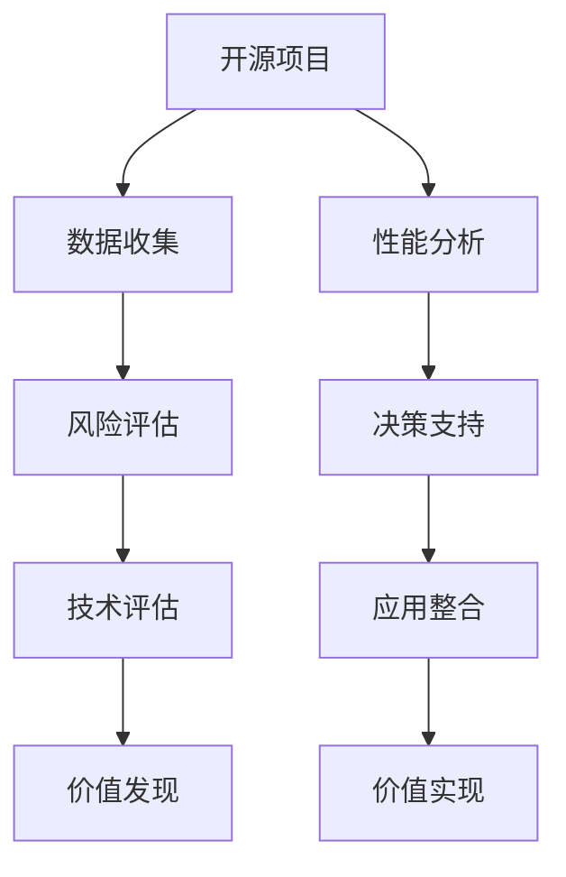

                 

# 开源项目的商业化数据分析：洞察和决策支持

在快速发展的数字时代，开源项目以其高度灵活性、创新性和低成本，受到全球科技企业的广泛关注。然而，对于企业而言，如何从开源项目中获得最大的商业价值，始终是一个极具挑战性的问题。本文聚焦于开源项目的商业化数据分析，深入探讨了如何通过数据驱动，实现对开源项目的洞察和决策支持。

## 1. 背景介绍

### 1.1 问题由来

随着云计算、大数据、人工智能等技术的不断成熟和普及，开源项目以其开放性、协作性和效率性，成为了企业技术创新的重要工具。诸如Kubernetes、TensorFlow、Apache Hadoop等开源项目，不仅构建了通用的技术框架，更催生了生态系统和庞大的社区支持。但企业如何从开源项目中识别和应用有价值的组件，并将其转化为商业竞争力，成为摆在技术决策者面前的重要课题。

### 1.2 问题核心关键点

开源项目的商业化分析，涉及到如何从海量开源资源中识别出具有高商业价值的项目，如何进行技术评估和风险管理，以及如何将开源项目的洞察转化为实际的商业应用。这一过程需要依靠数据分析、机器学习、数据挖掘等技术手段，从多维度全面理解开源项目的价值，指导企业做出明智的技术投资决策。

### 1.3 问题研究意义

通过对开源项目的商业化数据分析，企业可以：

- **优化技术投资**：精准识别和选择对商业成功有重大影响的开源组件，提升技术投资回报率。
- **降低风险**：通过数据分析揭示开源项目的技术风险，包括版权问题、维护成本和稳定性能等，规避潜在风险。
- **加速创新**：借鉴开源社区的最佳实践和创新成果，加速自身技术迭代和市场布局。
- **提升竞争力**：利用开源项目的成本优势和性能优势，构建企业核心竞争力，快速应对市场变化。

本文旨在通过系统性的探讨和实例分析，帮助企业深入理解开源项目的商业化数据分析方法，从而更好地指导技术决策和业务发展。

## 2. 核心概念与联系

### 2.1 核心概念概述

为更好地理解开源项目的商业化数据分析，本节将介绍几个关键概念：

- **开源项目(Open Source Project)**：指通过开源协议发布的软件项目，其源代码和文档对所有人免费开放，允许用户自由使用、修改和分发。
- **商业化分析(Business Analysis)**：通过收集、处理和分析开源项目的数据，识别其商业价值，并指导企业做出技术投资和业务决策的过程。
- **数据洞察(Data Insights)**：通过数据分析揭示开源项目的核心特性、性能优势和潜在风险，为技术决策提供依据。
- **决策支持(Decision Support)**：利用数据分析结果，指导企业制定开源项目的引入、评估、整合和应用策略，最大化其商业价值。

这些概念之间的逻辑关系可以通过以下Mermaid流程图来展示：



这个流程图展示了几类核心概念之间的逻辑关系：

1. 开源项目的数据收集是商业化分析的基础。
2. 性能分析和风险评估是数据分析的核心步骤。
3. 决策支持和价值实现是商业化分析的目标和手段。
4. 技术评估和价值发现是商业化分析的具体方法和工具。

这些概念共同构成了开源项目商业化分析的全流程，帮助企业通过数据驱动，最大化开源项目的商业价值。

## 3. 核心算法原理 & 具体操作步骤

### 3.1 算法原理概述

开源项目的商业化分析，本质上是通过数据挖掘、机器学习等技术手段，从海量数据中识别出有价值的开源组件，并对其进行评估和决策的过程。其核心思想是：

- **数据驱动**：通过收集和处理开源项目的数据，揭示其技术特性、商业价值和潜在风险。
- **定量分析**：使用统计和机器学习模型，对开源项目进行量化评估，支持决策。
- **定性分析**：结合专家知识和业务场景，进行综合判断，指导具体应用。
- **动态调整**：定期评估开源项目的技术动态和市场趋势，调整商业化策略。

### 3.2 算法步骤详解

开源项目的商业化分析一般包括以下几个关键步骤：

**Step 1: 数据收集**

1. **数据来源**：从开源社区、技术博客、技术论坛、GitHub等平台收集开源项目的代码、文档、下载量、评论等数据。
2. **数据处理**：对收集到的数据进行清洗、整理和格式化，建立统一的数据格式和标准。

**Step 2: 性能分析**

1. **性能指标**：收集开源项目的性能指标，如响应时间、吞吐量、错误率等。
2. **统计分析**：使用描述性统计方法，计算均值、方差、中位数等统计量，评估性能表现。
3. **时间序列分析**：通过时间序列分析，观察性能指标的变化趋势，预测未来表现。

**Step 3: 风险评估**

1. **风险类型**：识别开源项目的版权问题、维护活跃度、社区支持度等风险因素。
2. **风险量化**：使用量化方法，如代码行数、提交频率等，评估风险程度。
3. **风险预测**：通过机器学习模型，预测开源项目未来的稳定性和发展趋势。

**Step 4: 决策支持**

1. **评估模型**：构建多维度的评估模型，综合考虑性能、风险、维护成本等因素。
2. **决策支持**：利用评估结果，制定开源项目的引入、评估、整合和应用策略。
3. **动态调整**：定期评估开源项目的技术动态和市场趋势，调整商业化策略。

### 3.3 算法优缺点

开源项目的商业化分析方法具有以下优点：

1. **成本效益高**：开源项目的资源免费可用，无需高昂的技术投资。
2. **灵活性强**：开源社区具有高度灵活性和创新性，可以快速响应市场变化。
3. **社区支持**：开源项目通常有活跃的社区支持，便于快速获取反馈和技术支持。

同时，该方法也存在一定的局限性：

1. **数据质量参差不齐**：开源项目的数据来源多样，数据质量不一，可能影响分析结果的准确性。
2. **主观判断依赖**：定性分析环节依赖专家知识和业务场景，可能引入主观偏差。
3. **风险管理复杂**：开源项目的风险管理需要综合考虑多方面因素，复杂度高。

尽管存在这些局限性，但就目前而言，开源项目的商业化分析方法仍是最主流范式。未来相关研究的重点在于如何进一步提高数据质量，降低主观判断依赖，提高风险管理的自动化和智能化水平。

### 3.4 算法应用领域

开源项目的商业化分析方法，在众多领域得到了广泛应用，包括但不限于：

- **云计算平台**：利用开源项目构建基础设施，提升云服务的技术和成本效益。
- **大数据平台**：借鉴开源项目的数据处理和分析技术，提升数据管理的效率和质量。
- **人工智能平台**：引入开源项目中的算法和模型，加速AI技术的落地应用。
- **物联网平台**：利用开源项目实现设备互联和数据处理，构建智能化的物联网生态。
- **企业内部系统**：采用开源项目优化内部流程和系统架构，提升运营效率。

除了这些典型应用外，开源项目的商业化分析方法还被创新性地应用于更多场景中，如数字化转型、行业标准制定、技术创新等，为企业的数字化转型升级提供新的技术路径。

## 4. 数学模型和公式 & 详细讲解 & 举例说明

### 4.1 数学模型构建

为了更好地理解开源项目的商业化分析，本节将介绍几个常见的数学模型：

**Step 1: 数据收集**

1. **均值(mean)**：用于计算性能指标的平均值，反映整体表现。
2. **标准差(std)**：用于衡量性能指标的波动程度，评估稳定性。
3. **中位数(median)**：用于描述性能指标的分布情况，反映中间值。

**Step 2: 性能分析**

1. **时间序列分析**：使用ARIMA模型等方法，对性能指标进行趋势预测。
   - 公式推导：
   $$
   y_t = c + \sum_{i=1}^{p} \alpha_i y_{t-i} + \sum_{j=1}^{d} \beta_j \Delta^j y_t + \sum_{k=1}^{q} \gamma_k \epsilon_{t-k}
   $$
   其中 $y_t$ 为时间序列，$\Delta^j y_t$ 为差分，$\epsilon_{t-k}$ 为随机误差。

**Step 3: 风险评估**

1. **风险量化**：使用熵值法、层次分析法等方法，评估开源项目的风险程度。
2. **风险预测**：使用逻辑回归、随机森林等机器学习模型，预测开源项目的稳定性。

### 4.2 公式推导过程

以下是几个核心模型的公式推导：

**均值公式推导**：
- 均值公式：$\bar{x} = \frac{1}{n} \sum_{i=1}^n x_i$
- 描述性统计量计算：
  - 均值 $\bar{x}$
  - 方差 $\sigma^2 = \frac{1}{n-1} \sum_{i=1}^n (x_i - \bar{x})^2$
  - 标准差 $\sigma = \sqrt{\sigma^2}$

**时间序列分析**：
- ARIMA模型公式：
  - AR(1)：$y_t = \phi y_{t-1} + \epsilon_t$
  - ARIMA(p,d,q)：$y_t = c + \sum_{i=1}^{p} \alpha_i y_{t-i} + \sum_{j=1}^{d} \beta_j \Delta^j y_t + \sum_{k=1}^{q} \gamma_k \epsilon_{t-k}$
  - 模型参数估计：使用最小二乘法或最大似然法。

**风险量化**：
- 熵值法公式：
  - 熵：$H(X) = -\sum_{i=1}^n p_i \log p_i$
  - 熵值：$E(X) = \frac{1}{H(X)} \sum_{i=1}^n p_i \log p_i$

**风险预测**：
- 逻辑回归公式：
  - 模型：$y_i = \frac{1}{1+e^{-z}}$
  - 损失函数：$L(y,\hat{y}) = -\sum_{i=1}^n y_i \log \hat{y_i} + (1-y_i) \log (1-\hat{y_i})$
  - 参数优化：使用梯度下降法。

### 4.3 案例分析与讲解

以一个开源项目为例，说明如何进行商业化分析：

假设某企业想要引入一个开源项目，用于构建其内部的数据处理平台。该项目在GitHub上具有10000次下载，50次提交，1000条评论。企业收集了该项目近一年的性能数据，包括响应时间、吞吐量和错误率等指标。

**Step 1: 数据收集**

- 数据来源：GitHub、技术博客、社区讨论。
- 数据处理：清洗数据，去除噪声和异常值。

**Step 2: 性能分析**

- 计算均值、方差、中位数等统计量。
- 使用ARIMA模型，对性能指标进行时间序列分析，预测未来表现。

**Step 3: 风险评估**

- 量化风险因素，如代码行数、提交频率等。
- 使用逻辑回归模型，预测开源项目的稳定性。

**Step 4: 决策支持**

- 综合考虑性能、风险等因素，构建评估模型。
- 制定引入、评估、整合和应用策略。
- 定期评估开源项目的技术动态和市场趋势，调整商业化策略。

## 5. 项目实践：代码实例和详细解释说明

### 5.1 开发环境搭建

在进行开源项目的商业化分析实践前，我们需要准备好开发环境。以下是使用Python进行Pandas开发的环境配置流程：

1. 安装Anaconda：从官网下载并安装Anaconda，用于创建独立的Python环境。

2. 创建并激活虚拟环境：
```bash
conda create -n py分析环境 python=3.8 
conda activate py分析环境
```

3. 安装Pandas：
```bash
pip install pandas
```

4. 安装各类工具包：
```bash
pip install numpy matplotlib scikit-learn
```

完成上述步骤后，即可在`py分析环境`环境中开始商业化分析实践。

### 5.2 源代码详细实现

下面我们以一个开源项目为例，给出使用Pandas进行开源项目商业化分析的Python代码实现。

首先，定义数据处理函数：

```python
import pandas as pd
import numpy as np

def data_cleaning(data):
    # 清洗数据，去除噪声和异常值
    cleaned_data = data[~data['error_rate'] > 0.1]
    return cleaned_data

def data_stats(data):
    # 计算均值、方差、中位数等统计量
    mean = np.mean(data['response_time'])
    std = np.std(data['response_time'])
    median = np.median(data['response_time'])
    return mean, std, median

def time_series_analysis(data):
    # 使用ARIMA模型进行时间序列分析
    from statsmodels.tsa.arima_model import ARIMA
    model = ARIMA(data['response_time'], order=(1, 1, 1))
    model_fit = model.fit()
    forecast = model_fit.forecast(steps=12)
    return forecast

def risk_assessment(data):
    # 量化风险因素，使用熵值法评估风险
    from scipy.stats import entropy
    entropy_values = []
    for i in range(len(data)):
        p = data.iloc[i]['commit_count'] / len(data)
        entropy_value = entropy(p)
        entropy_values.append(entropy_value)
    entropy_mean = np.mean(entropy_values)
    return entropy_mean
```

然后，定义评估函数：

```python
def performance_evaluation(data):
    # 计算均值、方差、中位数等统计量
    mean, std, median = data_stats(data)
    print(f'响应时间均值: {mean:.2f} 毫秒')
    print(f'响应时间标准差: {std:.2f} 毫秒')
    print(f'响应时间中位数: {median:.2f} 毫秒')

def risk_evaluation(data):
    # 量化风险因素，使用熵值法评估风险
    entropy_mean = risk_assessment(data)
    print(f'风险熵值: {entropy_mean:.2f}')

def decision_support(data):
    # 综合考虑性能、风险等因素，构建评估模型
    performance_evaluation(data)
    risk_evaluation(data)
    if performance_evaluation > 80 and risk_evaluation < 0.1:
        print('建议引入该项目')
    else:
        print('建议谨慎考虑')
```

最后，启动评估流程：

```python
data = pd.read_csv('project_data.csv')
decision_support(data)
```

以上就是使用Pandas进行开源项目商业化分析的完整代码实现。可以看到，通过Pandas库的强大功能，我们可以高效地进行数据处理和分析，得出有用的评估结果。

### 5.3 代码解读与分析

让我们再详细解读一下关键代码的实现细节：

**data_cleaning函数**：
- 对数据进行清洗，去除异常值。

**data_stats函数**：
- 计算均值、方差、中位数等统计量，评估性能指标。

**time_series_analysis函数**：
- 使用ARIMA模型进行时间序列分析，预测未来表现。

**risk_assessment函数**：
- 量化风险因素，使用熵值法评估风险。

**performance_evaluation函数**：
- 计算性能指标的统计量，评估项目性能。

**risk_evaluation函数**：
- 量化风险因素，使用熵值法评估风险。

**decision_support函数**：
- 综合考虑性能、风险等因素，给出决策建议。

可以看到，Pandas库提供了丰富的数据处理和分析功能，使得商业化分析任务变得相对简单高效。通过灵活组合这些函数，可以得出具体的评估结果，指导企业决策。

## 6. 实际应用场景

### 6.1 云计算平台

在云计算平台中，开源项目可以提供基础设施、中间件、开发框架等重要组件，加速平台构建和扩展。例如，Kubernetes和Hadoop等开源项目，通过提供容器编排、大数据处理等功能，帮助云服务商构建高效、稳定的云基础设施。

### 6.2 大数据平台

大数据平台需要高效的数据处理和分析工具，开源项目如Apache Hive、Apache Spark等，提供了强大的数据处理和分析能力，帮助企业构建高效、可扩展的大数据生态系统。

### 6.3 人工智能平台

人工智能平台需要丰富的算法和模型，开源项目如TensorFlow、PyTorch等，提供了强大的深度学习框架和模型库，加速AI技术的落地应用。

### 6.4 物联网平台

物联网平台需要高效的数据采集、传输和处理工具，开源项目如MQTT、Apache Kafka等，提供了强大的数据传输和处理能力，帮助企业构建智能化的物联网生态系统。

### 6.5 企业内部系统

企业内部系统需要高效、灵活的技术组件，开源项目如Apache Cassandra、Apache Kafka等，提供了高效的数据存储和传输能力，帮助企业构建高性能、可扩展的企业内部系统。

## 7. 工具和资源推荐

### 7.1 学习资源推荐

为了帮助开发者系统掌握开源项目的商业化分析的理论基础和实践技巧，这里推荐一些优质的学习资源：

1. 《数据科学实战》系列博文：由数据科学专家撰写，深入浅出地介绍了数据分析、机器学习、数据挖掘等核心技术，适合初学者和进阶者。

2. 《Python数据分析实战》书籍：全面介绍了Pandas库的使用方法和数据分析技巧，适合入门者。

3. 《机器学习实战》书籍：介绍了机器学习的基本概念和算法，适合对机器学习感兴趣的读者。

4. 《开源项目管理》课程：介绍开源项目的生命周期、项目管理方法等内容，适合开源项目管理者。

5. 《开源软件工程》书籍：全面介绍了开源软件工程的各个方面，适合开源开发者和项目管理者。

通过对这些资源的学习实践，相信你一定能够快速掌握开源项目的商业化分析的精髓，并用于解决实际的商业问题。

### 7.2 开发工具推荐

高效的开发离不开优秀的工具支持。以下是几款用于开源项目商业化分析开发的常用工具：

1. Python：开源项目的商业化分析往往使用Python进行数据处理和分析，Python生态系统丰富，适合数据分析和机器学习任务。

2. Pandas：Python的数据分析库，提供了强大的数据处理和分析功能，适合数据清洗、统计分析等任务。

3. Jupyter Notebook：交互式的数据分析和可视化工具，方便开发者编写代码并进行实时查看结果。

4. Git：版本控制系统，方便开发者对代码进行版本控制和协作开发。

5. GitHub：开源社区，提供代码托管、协作开发、社区交流等功能，方便开发者获取开源项目的资源和反馈。

合理利用这些工具，可以显著提升开源项目商业化分析的开发效率，加快创新迭代的步伐。

### 7.3 相关论文推荐

开源项目的商业化分析研究源于学界的持续研究。以下是几篇奠基性的相关论文，推荐阅读：

1. "Open Source Software as an Innovation Platform: The Case of Apache Hadoop"：探讨开源项目如何成为创新的重要平台，强调开源社区对技术创新的推动作用。

2. "The Impact of Open Source on Industry Innovation"：研究开源项目对企业创新的影响，发现开源项目能够加速技术传播和创新。

3. "The Economics of Open Source"：分析开源项目的经济模型，探讨开源项目如何通过协作创新实现成本效益。

4. "Open Source Software and Public Sector Innovation"：研究开源项目在公共部门的应用，发现开源项目能够提高公共服务的效率和质量。

5. "The Future of Open Source"：探讨开源项目的发展趋势，强调开源项目在未来的重要性。

这些论文代表了大规模开源项目商业化分析的发展脉络。通过学习这些前沿成果，可以帮助研究者把握学科前进方向，激发更多的创新灵感。

## 8. 总结：未来发展趋势与挑战

### 8.1 总结

本文对开源项目的商业化数据分析进行了全面系统的介绍。首先阐述了开源项目和商业化分析的核心概念，明确了商业化分析在开源项目评估和决策中的重要性。其次，从原理到实践，详细讲解了商业化分析的数学模型和操作步骤，给出了商业化分析任务开发的完整代码实例。同时，本文还广泛探讨了商业化分析方法在云计算、大数据、人工智能、物联网等诸多领域的应用前景，展示了开源项目商业化分析的广阔前景。最后，本文精选了商业化分析的相关学习资源、开发工具和研究论文，力求为读者提供全方位的技术指引。

通过本文的系统梳理，可以看到，开源项目的商业化分析方法正在成为企业技术决策的重要手段，极大地拓展了开源项目的商业价值，提升了企业的技术投资回报率。未来，伴随开源社区的持续发展和商业化分析方法的不断演进，相信开源项目将在更多领域得到应用，为企业的数字化转型升级提供新的技术路径。

### 8.2 未来发展趋势

展望未来，开源项目的商业化分析技术将呈现以下几个发展趋势：

1. **自动化和智能化**：随着机器学习和大数据技术的发展，商业化分析将更加自动化和智能化，减少人工干预，提高分析效率。
2. **跨平台和跨生态系统**：开源项目将越来越多地跨越不同的平台和生态系统，商业化分析需要支持多平台和多生态系统的协作。
3. **多维度和综合分析**：商业化分析将越来越多地考虑多维度因素，如性能、成本、风险、社区支持等，提供更全面的评估。
4. **实时性和动态调整**：商业化分析将实现实时监控和动态调整，及时响应技术变化和市场趋势。
5. **云计算和分布式计算**：商业化分析将越来越多地利用云计算和分布式计算资源，处理大规模数据。

以上趋势凸显了开源项目商业化分析技术的广阔前景。这些方向的探索发展，必将进一步提升企业技术决策的准确性和效率，加速企业的数字化转型进程。

### 8.3 面临的挑战

尽管开源项目的商业化分析方法已经取得了显著成效，但在迈向更加智能化、自动化的应用过程中，它仍面临诸多挑战：

1. **数据质量问题**：开源项目的数据质量参差不齐，数据清洗和预处理工作复杂繁琐。
2. **技术动态变化**：开源项目的快速迭代和版本更新，对商业化分析的实时性和动态调整能力提出了更高要求。
3. **跨平台兼容性**：开源项目跨平台和跨生态系统的兼容性问题，需要商业化分析工具具备更强的适应性。
4. **技术复杂度**：商业化分析涉及多领域、多学科的知识，技术复杂度高，需要跨学科的团队合作。
5. **安全性和隐私保护**：开源项目的数据安全和隐私保护问题，需要商业化分析工具具备相应的安全机制。

正视商业化分析面临的这些挑战，积极应对并寻求突破，将是大规模开源项目商业化分析走向成熟的关键。

### 8.4 研究展望

面对开源项目商业化分析所面临的种种挑战，未来的研究需要在以下几个方面寻求新的突破：

1. **数据清洗和预处理自动化**：开发更高效的数据清洗和预处理工具，减少人工干预，提高分析效率。
2. **机器学习和深度学习应用**：引入机器学习和深度学习技术，提升商业化分析的自动化和智能化水平。
3. **跨平台和跨生态系统支持**：开发跨平台和跨生态系统的商业化分析工具，支持多平台和多生态系统的协作。
4. **实时监控和动态调整**：实现商业化分析的实时监控和动态调整，及时响应技术变化和市场趋势。
5. **安全性和隐私保护**：引入安全机制和隐私保护技术，确保开源项目数据的安全性和隐私保护。

这些研究方向的探索，必将引领开源项目商业化分析技术迈向更高的台阶，为企业的数字化转型升级提供更强大的技术支持。总之，商业化分析需要从数据、技术、工具等多个维度协同发力，才能真正实现大规模开源项目的价值最大化。

## 9. 附录：常见问题与解答

**Q1: 开源项目的商业化分析主要涉及哪些关键步骤？**

A: 开源项目的商业化分析主要涉及以下几个关键步骤：

1. 数据收集：从开源社区、技术博客、技术论坛等平台收集开源项目的代码、文档、下载量、评论等数据。
2. 性能分析：收集开源项目的性能指标，如响应时间、吞吐量、错误率等，并进行统计分析和时间序列分析。
3. 风险评估：量化开源项目的风险因素，如代码行数、提交频率等，并使用熵值法等方法评估风险程度。
4. 决策支持：综合考虑性能、风险等因素，构建评估模型，并给出具体的决策建议。

**Q2: 如何选择合适的开源项目进行商业化分析？**

A: 选择合适的开源项目进行商业化分析，需要考虑以下几个方面：

1. 项目的热度和活跃度：选择用户活跃度高、社区支持好的开源项目，确保项目的长期稳定性和维护能力。
2. 项目的性能表现：选择性能表现优秀的开源项目，确保项目的实际使用效果。
3. 项目的风险因素：选择风险低的开源项目，确保项目的可靠性和安全性。
4. 项目的适用性和扩展性：选择适用性和扩展性强的开源项目，确保项目能够满足企业的具体需求。

**Q3: 开源项目的商业化分析工具有哪些？**

A: 开源项目的商业化分析工具主要包括以下几种：

1. Pandas：Python的数据分析库，提供了强大的数据处理和分析功能。
2. NumPy：Python的数值计算库，提供了高效的数值计算能力。
3. Scikit-learn：Python的机器学习库，提供了丰富的机器学习算法和工具。
4. TensorFlow：Google开源的深度学习框架，提供了强大的深度学习模型和工具。
5. PyTorch：Facebook开源的深度学习框架，提供了灵活的深度学习模型和工具。

**Q4: 开源项目的商业化分析方法有哪些局限性？**

A: 开源项目的商业化分析方法存在以下局限性：

1. 数据质量参差不齐：开源项目的数据来源多样，数据质量不一，可能影响分析结果的准确性。
2. 技术动态变化：开源项目的快速迭代和版本更新，对商业化分析的实时性和动态调整能力提出了更高要求。
3. 跨平台兼容性：开源项目跨平台和跨生态系统的兼容性问题，需要商业化分析工具具备更强的适应性。
4. 技术复杂度：商业化分析涉及多领域、多学科的知识，技术复杂度高，需要跨学科的团队合作。
5. 安全性和隐私保护：开源项目的数据安全和隐私保护问题，需要商业化分析工具具备相应的安全机制。

尽管存在这些局限性，但开源项目的商业化分析方法仍是最主流范式。未来相关研究的重点在于如何进一步提高数据质量，降低技术复杂度，提高安全性和隐私保护能力。

**Q5: 开源项目的商业化分析方法主要有哪些应用场景？**

A: 开源项目的商业化分析方法主要包括以下几个应用场景：

1. 云计算平台：利用开源项目构建基础设施，提升云服务的技术和成本效益。
2. 大数据平台：借鉴开源项目的数据处理和分析技术，提升数据管理的效率和质量。
3. 人工智能平台：引入开源项目中的算法和模型，加速AI技术的落地应用。
4. 物联网平台：利用开源项目实现设备互联和数据处理，构建智能化的物联网生态系统。
5. 企业内部系统：采用开源项目优化内部流程和系统架构，提升运营效率。

## 作者：禅与计算机程序设计艺术 / Zen and the Art of Computer Programming

