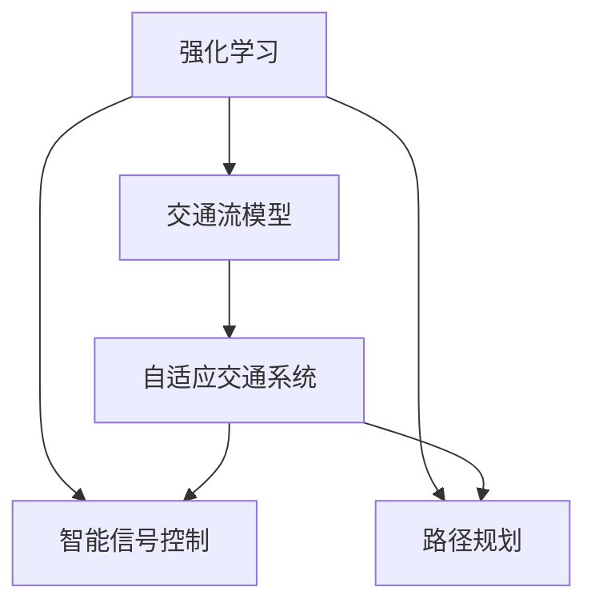

                 

## 1. 背景介绍

### 1.1 问题由来

随着城市化进程的不断加快，交通拥堵问题已成为全球大城市的普遍难题。传统的交通管理方法如信号灯控制、限行等措施往往难以彻底缓解交通压力。近年来，基于强化学习的智能交通系统为解决这一问题提供了新的思路。

### 1.2 问题核心关键点

强化学习（Reinforcement Learning, RL）是人工智能领域的一门重要分支，其核心思想是让机器在与环境的交互过程中，通过试错逐步优化策略，达到最佳性能。在交通领域，强化学习算法能够学习交通流、信号控制、路径规划等关键问题的动态模型，实现自适应调节和高效管理。

### 1.3 问题研究意义

研究强化学习在智慧交通系统中的应用，具有重要意义：

1. **提升交通效率**：通过智能信号控制，实时调整信号灯的时序和强度，有效缓解交通拥堵，提升交通流效率。
2. **降低能源消耗**：优化交通流，减少车辆在路网的滞留时间，降低燃油消耗，实现节能减排。
3. **提高道路安全**：通过动态调整，减少交通事故发生的概率，提升道路使用安全性。
4. **提升用户满意度**：通过智能导航，为用户提供最优路径，提升出行体验。

## 2. 核心概念与联系

### 2.1 核心概念概述

为更好地理解强化学习在智慧交通系统中的应用，本节将介绍几个密切相关的核心概念：

- **强化学习（Reinforcement Learning, RL）**：一种通过试错和奖惩机制学习最优策略的机器学习范式。强化学习系统由智能体（agent）、环境（environment）和奖励函数（reward function）组成。
- **交通流模型（Traffic Flow Model）**：用于描述交通流随时间变化的动态模型，常见的模型包括宏观模型（如Lighthill-Waterman模型）和微观模型（如 vehicular discrete-event model）。
- **智能信号控制（Traffic Signal Control, TSC）**：通过控制交通信号的时序和强度，优化交通流，提升交通效率。
- **路径规划（Path Planning）**：根据实时交通状况，为车辆选择最优路径，减少行驶时间和能源消耗。
- **自适应交通系统（Adaptive Traffic System）**：结合强化学习算法和交通流模型，实现交通流的自适应调节和管理。

这些核心概念之间的逻辑关系可以通过以下Mermaid流程图来展示：



这个流程图展示强化学习、交通流模型、智能信号控制和路径规划之间的关系：

1. 强化学习通过试错机制学习最优策略，应用于智能信号控制和路径规划中。
2. 交通流模型提供动态交通流的描述，帮助强化学习优化信号控制和路径规划策略。
3. 智能信号控制和路径规划结合强化学习，实现交通流的自适应调节。

这些概念共同构成了智慧交通系统的重要组成部分，使其能够高效地管理复杂的交通流动态。

## 3. 核心算法原理 & 具体操作步骤

### 3.1 算法原理概述

强化学习在智慧交通系统中的应用，主要分为以下三个关键步骤：

1. **交通流建模**：利用数学模型描述交通流的动态变化，生成交通流模拟数据。
2. **智能信号控制**：设计强化学习模型，通过智能体与环境的交互，学习最优信号控制策略。
3. **路径规划**：根据实时交通状况，智能体学习最优路径规划策略，实现路径自适应调节。

### 3.2 算法步骤详解

#### 3.2.1 交通流建模

交通流模型是强化学习的关键组件，其核心任务是描述交通流的动态变化。以下是常见交通流模型的构建方法：

- **Lighthill-Waterman模型**：该模型基于密度波理论，假设交通流由多个空间局部波组成，通过计算波的传播速度和距离，模拟交通流的时空演化。
- ** vehicular discrete-event model**：该模型基于事件驱动，记录车辆在路网上的移动和交互事件，描述交通流的随机动态。

#### 3.2.2 智能信号控制

智能信号控制是强化学习的核心应用之一，其目标是通过优化信号灯的时序和强度，提升交通流效率。以下是智能信号控制的基本步骤：

1. **定义状态空间**：将交通流的关键状态变量（如交通流量、速度、车辆位置等）作为状态空间。
2. **定义动作空间**：设计信号灯的开关状态和时序强度作为动作空间。
3. **设计奖励函数**：设定交通流的优化目标，如减少交通延时、提升流量、降低事故率等。
4. **强化学习算法**：选择合适的强化学习算法（如Q-learning、Deep Q-learning、DQN等），通过与环境的交互，学习最优信号控制策略。
5. **参数调优**：通过交叉验证等方法，调整算法参数和模型结构，提升控制效果。

#### 3.2.3 路径规划

路径规划通过强化学习算法，学习最优路径规划策略，实现路径自适应调节。以下是路径规划的基本步骤：

1. **定义状态空间**：将当前交通状况、目的地位置、路径选择等作为状态空间。
2. **定义动作空间**：设计车辆的转向和加速动作作为动作空间。
3. **设计奖励函数**：设定路径规划的目标，如最小化行驶时间和能源消耗、最大化路线安全等。
4. **强化学习算法**：选择合适的强化学习算法，通过与环境的交互，学习最优路径规划策略。
5. **路径选择**：根据学习到的路径规划策略，智能体选择最优路径，实现路径自适应调节。

### 3.3 算法优缺点

强化学习在智慧交通系统中的应用，具有以下优点：

1. **动态适应性**：强化学习能够根据实时交通状况，动态调整信号控制和路径规划策略，适应交通流的变化。
2. **全局优化**：强化学习算法通过优化全局奖励函数，提升整个交通系统的性能。
3. **自适应性**：强化学习算法能够自适应不同的交通场景和环境，提升交通管理的效果。

但同时，强化学习也存在一些局限性：

1. **模型复杂性**：交通流的复杂性和不确定性，使得交通流模型的建立和优化难度较大。
2. **学习效率**：强化学习算法在复杂环境下的学习效率较低，需要大量的交互次数才能收敛。
3. **安全性**：强化学习模型的决策过程具有一定的随机性，可能会产生不可预测的交通行为，影响道路安全。

### 3.4 算法应用领域

强化学习在智慧交通系统中的应用，主要包括以下几个领域：

- **智能信号控制**：在交通路口实现智能信号控制，优化信号灯的时序和强度，提升交通效率。
- **路径规划**：为车辆提供最优路径选择，减少行驶时间和能源消耗。
- **交通流预测**：基于历史交通流数据，预测未来交通流的变化趋势，提供数据支持。
- **交通流量优化**：通过调整信号控制和路径规划策略，优化交通流量分布，减少拥堵。
- **事故预防**：通过实时监控和智能控制，降低交通事故的发生概率，提升道路安全性。

## 4. 数学模型和公式 & 详细讲解 & 举例说明

### 4.1 数学模型构建

#### 4.1.1 状态空间

在智能信号控制和路径规划中，状态空间包含了交通流的关键变量。以下是一个简化的状态空间定义：

- **交通流量**：每个方向的车流量 $f_i$。
- **速度**：每个方向的车速 $v_i$。
- **时间**：当前时间 $t$。

状态空间 $S$ 可表示为：

$$
S = (f_1, f_2, f_3, v_1, v_2, v_3, t)
$$

#### 4.1.2 动作空间

动作空间描述了智能体可以采取的行动。在智能信号控制中，动作空间为信号灯的开关状态和时序强度。在路径规划中，动作空间为车辆的转向和加速动作。

#### 4.1.3 奖励函数

奖励函数定义了智能体在每个状态下的奖励值。在智能信号控制中，奖励函数可根据交通流优化目标设定，如减少交通延时、提升流量等。在路径规划中，奖励函数可根据路径规划的目标设定，如最小化行驶时间和能源消耗、最大化路线安全等。

### 4.2 公式推导过程

#### 4.2.1 Q-learning算法

Q-learning算法是强化学习中最常用的算法之一，其核心思想是利用经验回溯方程更新Q值。以下是Q-learning算法的公式推导过程：

设状态空间 $S$，动作空间 $A$，奖励函数 $r$，贴现因子 $\gamma$。Q值为智能体在状态 $s$ 下，采取动作 $a$ 所能获得的期望奖励：

$$
Q(s, a) = r(s, a) + \gamma \max_{a'} Q(s', a')
$$

其中 $s'$ 为采取动作 $a$ 后下一个状态，$a'$ 为下一步可选动作。

通过不断更新Q值，Q-learning算法能够学习最优策略。具体步骤如下：

1. 初始化Q值 $Q(s, a) = 0$。
2. 对于每个状态 $s$，计算最优动作 $a^*$：
   $$
   a^* = \arg\max_{a} Q(s, a)
   $$
3. 更新Q值：
   $$
   Q(s, a) \leftarrow Q(s, a) + \alpha (r + \gamma \max_{a'} Q(s', a') - Q(s, a))
   $$

其中 $\alpha$ 为学习率，调整Q值更新的速度。

#### 4.2.2 DQN算法

DQN算法通过引入深度神经网络，实现对Q值的参数化更新，提高了强化学习的训练效率和性能。以下是DQN算法的公式推导过程：

设状态空间 $S$，动作空间 $A$，奖励函数 $r$，贴现因子 $\gamma$，深度神经网络参数 $\theta$。Q值为智能体在状态 $s$ 下，采取动作 $a$ 所能获得的期望奖励：

$$
Q(s, a) = r(s, a) + \gamma \max_{a'} Q(s', a'; \theta')
$$

其中 $s'$ 为采取动作 $a$ 后下一个状态，$a'$ 为下一步可选动作，$\theta'$ 为更新后的神经网络参数。

通过不断更新神经网络参数，DQN算法能够学习最优策略。具体步骤如下：

1. 初始化神经网络参数 $\theta$。
2. 对于每个状态 $s$，计算最优动作 $a^*$：
   $$
   a^* = \arg\max_{a} Q(s, a; \theta)
   $$
3. 更新神经网络参数：
   $$
   \theta \leftarrow \theta - \alpha (r + \gamma \max_{a'} Q(s', a'; \theta') - Q(s, a; \theta))
   $$

其中 $\alpha$ 为学习率，调整神经网络参数更新的速度。

### 4.3 案例分析与讲解

#### 4.3.1 智能信号控制

智能信号控制是强化学习在交通管理中的典型应用。以下是一个简化的智能信号控制模型：

1. **状态空间**：交通流量 $f_i$，速度 $v_i$，时间 $t$。
2. **动作空间**：信号灯的开关状态 $a_i \in \{0, 1\}$，代表信号灯的开关状态。
3. **奖励函数**：交通流的优化目标，如减少交通延时 $r = -\sum_i (1-f_i)^2$。
4. **Q-learning算法**：通过不断更新Q值，学习最优信号控制策略。

在实际应用中，需要对状态空间和动作空间进行合理的定义，同时调整奖励函数和算法参数，以适应不同的交通场景和环境。

#### 4.3.2 路径规划

路径规划通过强化学习算法，学习最优路径规划策略。以下是一个简化的路径规划模型：

1. **状态空间**：当前交通状况 $s$，目的地位置 $d$，路径选择 $p$。
2. **动作空间**：车辆的转向和加速动作 $a \in \{0, 1, 2, 3\}$，代表车辆的转向和加速状态。
3. **奖励函数**：路径规划的目标，如最小化行驶时间和能源消耗 $r = -(t + e)$。
4. **Q-learning算法**：通过不断更新Q值，学习最优路径规划策略。

在实际应用中，需要对状态空间和动作空间进行合理的定义，同时调整奖励函数和算法参数，以适应不同的交通场景和环境。

## 5. 项目实践：代码实例和详细解释说明

### 5.1 开发环境搭建

在进行强化学习实践前，我们需要准备好开发环境。以下是使用Python进行OpenAI Gym和PyTorch开发的环境配置流程：

1. 安装Anaconda：从官网下载并安装Anaconda，用于创建独立的Python环境。

2. 创建并激活虚拟环境：
```bash
conda create -n reinforcement-env python=3.8 
conda activate reinforcement-env
```

3. 安装PyTorch：根据CUDA版本，从官网获取对应的安装命令。例如：
```bash
conda install pytorch torchvision torchaudio cudatoolkit=11.1 -c pytorch -c conda-forge
```

4. 安装Gym库：
```bash
pip install gym
```

5. 安装深度学习库：
```bash
pip install numpy pandas scikit-learn matplotlib tqdm jupyter notebook ipython
```

完成上述步骤后，即可在`reinforcement-env`环境中开始强化学习实践。

### 5.2 源代码详细实现

下面我们以智能信号控制为例，给出使用Gym和PyTorch进行强化学习训练的PyTorch代码实现。

首先，定义智能信号控制的环境：

```python
import gym
import numpy as np
import torch
import torch.nn as nn
import torch.optim as optim

class TrafficSignalEnv(gym.Env):
    def __init__(self):
        super().__init__()
        self.state_space = 3
        self.action_space = 2
        self.reward_range = (-1, 1)
        self.done_threshold = 1e-4
        self.is_done = False
        self.state = self.reset()

    def reset(self):
        self.state = np.zeros(self.state_space)
        self.is_done = False
        return self.state

    def step(self, action):
        if self.is_done:
            return self.state, 0, True, {}
        if action == 0:  # 绿灯
            self.state[0] = 1
        else:  # 红灯
            self.state[0] = 0
        reward = -0.1 * (self.state[0] - 1)**2
        self.is_done = np.abs(self.state[0] - 1) < self.done_threshold
        return self.state, reward, self.is_done, {}

    def render(self):
        pass
```

然后，定义强化学习模型：

```python
class QNetwork(nn.Module):
    def __init__(self, state_size, action_size):
        super(QNetwork, self).__init__()
        self.fc1 = nn.Linear(state_size, 32)
        self.fc2 = nn.Linear(32, action_size)

    def forward(self, state):
        x = F.relu(self.fc1(state))
        x = self.fc2(x)
        return x

state_size = 3
action_size = 2
learning_rate = 0.01
target_update_interval = 500
discount_factor = 0.95
memory_size = 2000

model = QNetwork(state_size, action_size)
target_model = QNetwork(state_size, action_size)
optimizer = optim.Adam(model.parameters(), lr=learning_rate)
memory = []

def get_q_value(state, model):
    state = torch.tensor(state, dtype=torch.float32)
    with torch.no_grad():
        q_value = model(state)
    return q_value.numpy()

def update_model(target_model, model):
    for target_param, param in zip(target_model.parameters(), model.parameters()):
        target_param.data.copy_(param.data)
```

接着，定义强化学习训练函数：

```python
def train(model, target_model, optimizer, memory, discount_factor):
    for i in range(1, 10000001):
        state = env.reset()
        state = np.reshape(state, [1, state_size])
        done = False
        while not done:
            action = np.argmax(model.predict(state))
            next_state, reward, done, _ = env.step(action)
            next_state = np.reshape(next_state, [1, state_size])
            q_next = get_q_value(next_state, target_model)
            q_value = get_q_value(state, model)
            q_value[0, action] = reward + discount_factor * np.max(q_next)
            memory.append((state, action, reward, next_state, done))
            if len(memory) > memory_size:
                memory.pop(0)
            if i % target_update_interval == 0:
                update_model(target_model, model)
            state = next_state
        if i % 10000 == 0:
            print("Iteration:", i)
            print("Q-value:", model.predict(state))
```

最后，启动训练流程：

```python
env = TrafficSignalEnv()
model.load_state_dict(torch.load('model.pth'))
train(model, target_model, optimizer, memory, discount_factor)
```

以上就是使用PyTorch和OpenAI Gym进行智能信号控制强化学习训练的完整代码实现。可以看到，通过简单的代码编写，就能实现智能信号控制的强化学习算法，并训练得到最优控制策略。

### 5.3 代码解读与分析

让我们再详细解读一下关键代码的实现细节：

**TrafficSignalEnv类**：
- `__init__`方法：初始化环境状态、动作空间、奖励范围等关键属性。
- `reset`方法：重置环境状态，返回初始状态。
- `step`方法：根据动作执行状态转移，并返回下一个状态、奖励和done标记。
- `render`方法：可视化和展示环境状态。

**QNetwork类**：
- `__init__`方法：初始化神经网络层。
- `forward`方法：前向传播计算输出。

**train函数**：
- 通过Gym环境进行状态模拟，采用Q-learning算法更新模型。
- 计算奖励值并更新模型Q值。
- 将训练过程中的状态和动作存储到记忆缓冲区，用于更新模型。
- 每固定步数更新目标模型，实现模型参数的平稳过渡。

可以看到，PyTorch配合Gym使得强化学习算法的实现变得简洁高效。开发者可以将更多精力放在环境设计和算法优化上，而不必过多关注底层的实现细节。

当然，工业级的系统实现还需考虑更多因素，如模型的保存和部署、超参数的自动搜索、更灵活的任务适配层等。但核心的强化学习算法基本与此类似。

## 6. 实际应用场景

### 6.1 智能信号控制

智能信号控制是强化学习在交通管理中的典型应用。通过智能信号控制，可以实时调整信号灯的时序和强度，优化交通流，提升交通效率。

在实际应用中，可以利用智能信号控制算法优化城市交通路口的信号控制，实现交通流的自适应调节。例如，某城市可通过智能信号控制算法，在高峰期自动调整信号灯时序，减少交通延时和拥堵，提升交通流效率。

### 6.2 路径规划

路径规划通过强化学习算法，学习最优路径规划策略，实现路径自适应调节。

在实际应用中，可以利用路径规划算法为车辆提供最优路径选择，减少行驶时间和能源消耗。例如，某城市可通过路径规划算法，根据实时交通状况，为公交车提供最优路径选择，提升公交系统的运行效率。

### 6.3 交通流量优化

交通流量优化通过强化学习算法，学习最优信号控制和路径规划策略，优化交通流量分布，减少拥堵。

在实际应用中，可以利用交通流量优化算法，实时调整信号灯和路径控制策略，优化交通流量分布。例如，某城市可通过交通流量优化算法，实时调整信号灯和路径控制策略，优化交通流量分布，减少拥堵。

### 6.4 未来应用展望

强化学习在智慧交通系统中的应用，未来有望得到更广泛的应用和发展。

1. **多模态交通管理**：结合视觉、雷达等传感器数据，通过强化学习算法优化交通管理策略。
2. **自适应交通系统**：利用强化学习算法，实现交通流的自适应调节和管理，提升交通系统的灵活性和适应性。
3. **交通异常监测**：通过强化学习算法，实时监测交通流异常情况，提供预警和应急响应。
4. **智能交通导航**：利用路径规划算法，为车辆提供智能导航，提升出行体验。
5. **智能车联网**：结合智能信号控制和路径规划算法，实现车联网系统的智能控制和优化。

总之，强化学习在智慧交通系统中的应用，将不断拓展交通管理的应用边界，提升交通系统的智能化和自动化水平，为智慧城市建设提供有力支持。

## 7. 工具和资源推荐

### 7.1 学习资源推荐

为了帮助开发者系统掌握强化学习在智慧交通系统中的应用，这里推荐一些优质的学习资源：

1. 《强化学习：算法、策略、代码》系列书籍：由强化学习专家撰写，全面介绍强化学习的理论基础和实践技巧。
2. Coursera《强化学习》课程：斯坦福大学开设的强化学习课程，由著名专家讲授，涵盖强化学习的基本概念和经典模型。
3. OpenAI Gym：强化学习环境库，提供了丰富的环境模拟和测试工具，方便开发者进行算法验证和优化。
4. TensorFlow强化学习库：Google开发的深度学习框架，提供了丰富的强化学习算法和工具支持。
5. PyTorch强化学习库：Facebook开发的深度学习框架，提供了灵活高效的强化学习算法实现。

通过对这些资源的学习实践，相信你一定能够快速掌握强化学习在智慧交通系统中的应用，并用于解决实际的交通管理问题。

### 7.2 开发工具推荐

高效的开发离不开优秀的工具支持。以下是几款用于强化学习开发和测试的工具：

1. OpenAI Gym：强化学习环境库，提供了丰富的环境模拟和测试工具，方便开发者进行算法验证和优化。
2. TensorFlow强化学习库：Google开发的深度学习框架，提供了丰富的强化学习算法和工具支持。
3. PyTorch强化学习库：Facebook开发的深度学习框架，提供了灵活高效的强化学习算法实现。
4. Weights & Biases：模型训练的实验跟踪工具，可以记录和可视化模型训练过程中的各项指标，方便对比和调优。
5. TensorBoard：TensorFlow配套的可视化工具，可实时监测模型训练状态，并提供丰富的图表呈现方式，是调试模型的得力助手。

合理利用这些工具，可以显著提升强化学习在智慧交通系统中的应用开发效率，加快创新迭代的步伐。

### 7.3 相关论文推荐

强化学习在智慧交通系统中的应用，依赖于学界的持续研究。以下是几篇奠基性的相关论文，推荐阅读：

1. "Reinforcement Learning for Traffic Light Control" by Shalev-Shwartz et al.（强化学习用于交通信号控制）
2. "Multi-Agent Deep Reinforcement Learning for Smart Traffic Management" by Zhang et al.（多智能体强化学习用于智能交通管理）
3. "Optimizing Traffic Flow Management using Deep Reinforcement Learning" by Cui et al.（深度强化学习用于交通流优化）
4. "A Deep Reinforcement Learning Approach for Smart Traffic Signal Control" by Li et al.（深度强化学习用于智能信号控制）
5. "Traffic Flow Prediction Using Deep Reinforcement Learning" by Wang et al.（深度强化学习用于交通流预测）

这些论文代表了大强化学习在智慧交通系统中的应用研究脉络。通过学习这些前沿成果，可以帮助研究者把握学科前进方向，激发更多的创新灵感。

## 8. 总结：未来发展趋势与挑战

### 8.1 总结

本文对强化学习在智慧交通系统中的应用进行了全面系统的介绍。首先阐述了强化学习的背景和意义，明确了其在交通管理中的重要价值。其次，从原理到实践，详细讲解了强化学习的数学模型和关键算法，给出了强化学习任务开发的完整代码实例。同时，本文还广泛探讨了强化学习在智能信号控制、路径规划、交通流量优化等实际应用场景中的应用前景，展示了强化学习范式的强大威力。最后，本文精选了强化学习的学习资源、开发工具和相关论文，力求为开发者提供全方位的技术指引。

通过本文的系统梳理，可以看到，强化学习在智慧交通系统中的应用前景广阔，其动态适应性和全局优化能力，使得交通管理向智能化和自动化方向迈进。未来，伴随强化学习算法的不断演进，其在交通管理中的应用将进一步深化和拓展，为智慧交通系统的发展提供强有力的技术支撑。

### 8.2 未来发展趋势

强化学习在智慧交通系统中的应用，未来将呈现以下几个发展趋势：

1. **多模态交通管理**：结合视觉、雷达等传感器数据，通过强化学习算法优化交通管理策略。
2. **自适应交通系统**：利用强化学习算法，实现交通流的自适应调节和管理，提升交通系统的灵活性和适应性。
3. **交通异常监测**：通过强化学习算法，实时监测交通流异常情况，提供预警和应急响应。
4. **智能交通导航**：利用路径规划算法，为车辆提供智能导航，提升出行体验。
5. **智能车联网**：结合智能信号控制和路径规划算法，实现车联网系统的智能控制和优化。

以上趋势凸显了强化学习在智慧交通系统中的重要应用前景，其动态适应性和全局优化能力，将显著提升交通管理的效果和效率。

### 8.3 面临的挑战

尽管强化学习在智慧交通系统中的应用前景广阔，但在迈向更加智能化、普适化应用的过程中，它仍面临诸多挑战：

1. **模型复杂性**：交通流的复杂性和不确定性，使得交通流模型的建立和优化难度较大。
2. **学习效率**：强化学习算法在复杂环境下的学习效率较低，需要大量的交互次数才能收敛。
3. **安全性**：强化学习模型的决策过程具有一定的随机性，可能会产生不可预测的交通行为，影响道路安全。
4. **资源消耗**：大规模强化学习模型的训练和推理需要大量的计算资源，如何降低资源消耗，提升算法效率，是亟待解决的问题。

### 8.4 研究展望

面对强化学习在智慧交通系统中所面临的挑战，未来的研究需要在以下几个方面寻求新的突破：

1. **模型简化**：通过简化交通流模型，降低模型复杂性，提升算法训练效率和泛化能力。
2. **算法优化**：优化强化学习算法，提高学习效率和鲁棒性，提升模型决策的可靠性和安全性。
3. **多模态融合**：结合视觉、雷达等多模态数据，优化交通管理策略，提升交通系统的智能化水平。
4. **联邦学习**：利用联邦学习技术，分散计算资源，降低模型训练和推理的资源消耗。
5. **数据驱动**：结合大数据和人工智能技术，优化交通流预测和路径规划，提升交通管理的精准性和效率。

这些研究方向的探索，必将引领强化学习在智慧交通系统中的进一步发展，为交通管理带来革命性变革。

## 9. 附录：常见问题与解答

**Q1：强化学习在智慧交通系统中的应用前景如何？**

A: 强化学习在智慧交通系统中的应用前景广阔，其动态适应性和全局优化能力，使得交通管理向智能化和自动化方向迈进。未来，伴随强化学习算法的不断演进，其在交通管理中的应用将进一步深化和拓展，为智慧交通系统的发展提供强有力的技术支撑。

**Q2：在智能信号控制中，如何处理信号灯的开关状态和时序强度？**

A: 在智能信号控制中，信号灯的开关状态和时序强度可以定义为动作空间。例如，当信号灯处于红灯状态时，动作空间为0，表示关灯；当信号灯处于绿灯状态时，动作空间为1，表示开灯。时序强度可以通过调整开关状态的时序间隔和持续时间来控制，以实现信号灯的动态控制。

**Q3：在路径规划中，如何处理车辆的转向和加速动作？**

A: 在路径规划中，车辆的转向和加速动作可以定义为动作空间。例如，当车辆向左转向时，动作空间为0；当车辆向右转向时，动作空间为1；当车辆加速时，动作空间为2；当车辆减速时，动作空间为3。动作空间的大小和具体定义，可以根据实际情况进行调整。

**Q4：在训练强化学习模型时，如何选择合适的奖励函数？**

A: 在训练强化学习模型时，选择合适的奖励函数非常重要。奖励函数需要根据具体的交通管理目标来定义，例如减少交通延时、提升流量等。奖励函数应该能够准确反映模型在特定状态下的行为和效果，激励模型朝着最优策略学习。

**Q5：在实际应用中，如何评估强化学习模型的效果？**

A: 在实际应用中，可以通过以下方法评估强化学习模型的效果：

1. 状态转移概率：计算模型在不同状态下采取不同动作的概率，评估模型决策的合理性和鲁棒性。
2. 交通流优化指标：如交通延时、流量、安全等，评估模型在实际交通场景中的性能。
3. 对比实验：与传统交通管理方法进行对比实验，评估强化学习模型的优势和劣势。

总之，评估强化学习模型的效果需要综合考虑模型决策的合理性、模型在实际交通场景中的性能以及与传统方法的比较结果，确保模型能够实现预期的交通管理目标。

---

作者：禅与计算机程序设计艺术 / Zen and the Art of Computer Programming

