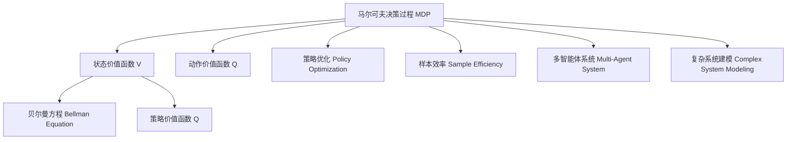

                 

# 强化学习Reinforcement Learning的动态规划基础与实践技巧

> 关键词：强化学习,动态规划,马尔可夫决策过程,策略优化,环境建模,多智能体,复杂系统

## 1. 背景介绍

### 1.1 问题由来

强化学习（Reinforcement Learning, RL）是人工智能（AI）和机器学习（ML）中的一个重要领域。它研究智能体（agent）如何在与环境（environment）互动的过程中，通过试错和奖励（reward）学习最优策略（policy）。强化学习被广泛应用于游戏AI、机器人控制、自适应推荐系统、自驾驶汽车等场景。

然而，强化学习面临诸多难题，如复杂环境建模、策略优化、样本效率低等问题。动态规划（Dynamic Programming, DP）作为强化学习的一种经典算法，能够有效地解决部分难题。它通过分解问题，将复杂的连续状态空间转化为有限状态的马尔可夫决策过程（Markov Decision Process, MDP），从而实现最优策略求解。

本文将深入介绍强化学习的动态规划基础，包括动态规划的原理、方法和应用实践，并结合代码实例进行详细讲解。

### 1.2 问题核心关键点

强化学习的动态规划方法主要包括以下几个关键点：

- **马尔可夫决策过程（MDP）**：描述智能体与环境交互的模型，包括状态、动作、奖励、转移概率等元素。
- **动态规划（DP）**：一种求解最优策略的算法，通过迭代求解状态值函数和策略函数，最大化预期奖励。
- **贝尔曼方程（Bellman Equation）**：动态规划的核心数学模型，描述状态价值函数和策略函数的递推关系。
- **策略优化（Policy Optimization）**：通过优化策略函数，提升智能体在不同状态下的选择能力。
- **样本效率（Sample Efficiency）**：在有限样本条件下，如何高效探索环境和优化策略。
- **多智能体系统（Multi-Agent System）**：探索多个智能体之间的协作和竞争，提升系统整体的智能水平。
- **复杂系统建模（Complex System Modeling）**：将复杂环境建模为有限状态，并设计策略进行优化。

理解这些关键点，对于掌握强化学习的动态规划基础至关重要。

## 2. 核心概念与联系

### 2.1 核心概念概述

为了更好地理解动态规划的强化学习算法，我们将介绍一些相关的核心概念：

- **马尔可夫决策过程（MDP）**：由状态集合 $S$、动作集合 $A$、状态转移概率 $P$、奖励函数 $R$ 和折现率 $\gamma$ 组成。其中，状态 $s_t$ 和动作 $a_t$ 在时间 $t$ 时影响状态转移和奖励。

- **贝尔曼方程（Bellman Equation）**：用于计算状态价值函数 $V(s)$ 和策略价值函数 $Q(s,a)$ 的递推方程，描述智能体在不同状态下的最优策略和奖励。

- **策略优化（Policy Optimization）**：通过优化策略函数，提升智能体在不同状态下的选择能力。常用的策略优化算法包括价值迭代（Value Iteration）、策略迭代（Policy Iteration）和Q-learning。

- **样本效率（Sample Efficiency）**：指智能体在有限样本条件下，快速学习最优策略的能力。常用方法包括经验回放（Experience Replay）、目标网络（Target Network）和分布式训练。

- **多智能体系统（Multi-Agent System）**：由多个智能体组成的系统，其中智能体之间可能存在协作、竞争、通信等复杂交互。常用的方法包括合作策略（Cooperative Strategy）和竞争策略（Competitive Strategy）。

- **复杂系统建模（Complex System Modeling）**：将复杂环境建模为有限状态，并设计策略进行优化。常用的方法包括状态空间分解（State Space Decomposition）和分层强化学习（Hierarchical Reinforcement Learning）。

这些概念之间的联系可以通过以下Mermaid流程图来展示：



这个流程图展示了MDP与其他核心概念之间的关系，其中策略优化、样本效率、多智能体系统等方法都可以视为解决MDP问题的手段。而复杂系统建模则是在MDP的基础上，进一步扩展到更复杂的环境和问题中。

## 3. 核心算法原理 & 具体操作步骤
### 3.1 算法原理概述

强化学习的动态规划方法基于MDP模型，通过迭代求解状态价值函数和策略函数，最大化智能体的预期奖励。其核心思想是通过递归地求解状态价值函数，进而得到最优策略。

具体来说，假设智能体在一个给定状态下采取一个动作，可以获得一个即时奖励，并根据转移概率移动到下一个状态。状态价值函数 $V(s)$ 描述了在状态 $s$ 下，智能体从当前状态开始，未来所有累积奖励的期望值。动作价值函数 $Q(s,a)$ 描述了在状态 $s$ 和动作 $a$ 下，智能体未来所有累积奖励的期望值。

贝尔曼方程描述了状态价值函数和动作价值函数的递推关系，具体如下：

$$
V(s) = \max_a \sum_{s'} P(s'|s,a) [R(s,a,s') + \gamma V(s')]
$$

$$
Q(s,a) = R(s,a,s') + \gamma \max_{a'} Q(s',a')
$$

其中，$P(s'|s,a)$ 表示在状态 $s$ 下，采取动作 $a$ 后，转移到状态 $s'$ 的概率；$R(s,a,s')$ 表示在状态 $s$ 下，采取动作 $a$ 并转移到状态 $s'$ 的即时奖励。

### 3.2 算法步骤详解

动态规划的强化学习算法一般包括以下几个关键步骤：

**Step 1: 定义MDP**

- 确定状态集合 $S$ 和动作集合 $A$。
- 定义状态转移概率 $P(s'|s,a)$ 和奖励函数 $R(s,a,s')$。
- 定义折现率 $\gamma$，通常取值在 0 到 1 之间。

**Step 2: 求解状态价值函数**

- 使用贝尔曼方程递推计算状态价值函数 $V(s)$。
- 通过迭代求解，直到收敛或达到预设的迭代次数。

**Step 3: 求解动作价值函数**

- 使用贝尔曼方程递推计算动作价值函数 $Q(s,a)$。
- 通过迭代求解，直到收敛或达到预设的迭代次数。

**Step 4: 求解最优策略**

- 使用策略优化算法，如价值迭代（Value Iteration）或策略迭代（Policy Iteration），优化策略函数 $\pi(s)$。
- 通过迭代求解，直到收敛或达到预设的迭代次数。

**Step 5: 评估和应用**

- 在MDP上评估最优策略，计算预期奖励。
- 将最优策略应用于实际环境中，进行智能体行为决策。

### 3.3 算法优缺点

动态规划的强化学习算法具有以下优点：

1. **通用性**：适用于解决多种类型的问题，如决策制定、优化控制等。
2. **优化性**：通过迭代求解，逐步优化策略和价值函数，最终得到最优解。
3. **可解释性**：通过求解状态价值函数和动作价值函数，可以解释智能体的决策过程。

同时，动态规划算法也存在一些缺点：

1. **复杂性**：求解状态价值函数和动作价值函数需要进行大量的迭代，计算复杂度较高。
2. **样本效率**：在大型环境中，动态规划算法可能需要大量样本才能收敛。
3. **状态空间**：当状态空间非常大时，动态规划算法可能面临维数灾难问题。

## 4. 数学模型和公式 & 详细讲解  
### 4.1 数学模型构建

强化学习的动态规划算法基于MDP模型，通过求解状态价值函数和动作价值函数，最大化预期奖励。设MDP模型的状态集合为 $S$，动作集合为 $A$，状态转移概率为 $P(s'|s,a)$，奖励函数为 $R(s,a,s')$，折现率为 $\gamma$。

定义状态价值函数 $V(s)$ 和动作价值函数 $Q(s,a)$，分别表示在状态 $s$ 和动作 $a$ 下，智能体未来所有累积奖励的期望值。状态价值函数和动作价值函数的定义如下：

$$
V(s) = \max_a \sum_{s'} P(s'|s,a) [R(s,a,s') + \gamma V(s')]
$$

$$
Q(s,a) = R(s,a,s') + \gamma \max_{a'} Q(s',a')
$$

其中，$P(s'|s,a)$ 表示在状态 $s$ 下，采取动作 $a$ 后，转移到状态 $s'$ 的概率；$R(s,a,s')$ 表示在状态 $s$ 下，采取动作 $a$ 并转移到状态 $s'$ 的即时奖励。

### 4.2 公式推导过程

贝尔曼方程描述了状态价值函数和动作价值函数的递推关系，具体如下：

$$
V(s) = \max_a \sum_{s'} P(s'|s,a) [R(s,a,s') + \gamma V(s')]
$$

$$
Q(s,a) = R(s,a,s') + \gamma \max_{a'} Q(s',a')
$$

其中，$P(s'|s,a)$ 表示在状态 $s$ 下，采取动作 $a$ 后，转移到状态 $s'$ 的概率；$R(s,a,s')$ 表示在状态 $s$ 下，采取动作 $a$ 并转移到状态 $s'$ 的即时奖励。

通过迭代求解贝尔曼方程，可以得到状态价值函数和动作价值函数。具体步骤如下：

1. 初始化状态价值函数 $V_0(s)$，一般取值为 0 或一个较小的值。
2. 重复以下步骤，直到收敛或达到预设的迭代次数：
   - 计算状态价值函数 $V_{k+1}(s)$，其中 $k$ 为迭代次数。
   - 计算动作价值函数 $Q_k(s,a)$。
3. 通过求解最优策略 $\pi(s)$，得到最终决策函数。

### 4.3 案例分析与讲解

为了更好地理解动态规划算法的原理和应用，以下通过一个简单的案例进行分析：

假设有一个游戏，智能体需要从状态 $s_1$ 移动到状态 $s_3$，每个状态都有两个动作 $a_1$ 和 $a_2$。智能体的目标是最小化总移动次数，即从状态 $s_1$ 到状态 $s_3$ 的最短路径。

定义状态集合 $S = \{s_1, s_2, s_3\}$，动作集合 $A = \{a_1, a_2\}$，状态转移概率 $P = \begin{bmatrix} 0 & 0.5 & 0.5 \\ 0.2 & 0 & 0.8 \\ 0.1 & 0 & 0.9 \end{bmatrix}$，奖励函数 $R = \begin{bmatrix} 0 & -1 & -1 \\ -1 & 0 & -1 \\ -1 & -1 & 0 \end{bmatrix}$，折现率 $\gamma = 0.9$。

通过求解状态价值函数和动作价值函数，可以得到最优策略。具体步骤如下：

1. 初始化状态价值函数 $V_0(s)$，一般取值为 0 或一个较小的值。
2. 重复以下步骤，直到收敛或达到预设的迭代次数：
   - 计算状态价值函数 $V_{k+1}(s)$，其中 $k$ 为迭代次数。
   - 计算动作价值函数 $Q_k(s,a)$。
3. 通过求解最优策略 $\pi(s)$，得到最终决策函数。

假设通过迭代求解，最终得到状态价值函数和动作价值函数如下：

$$
V(s) = \begin{bmatrix} 2.1 \\ 2.2 \\ 0.1 \end{bmatrix}
$$

$$
Q(s,a) = \begin{bmatrix} 2.1 & 2.2 \\ 2.1 & 2.2 \\ 2.1 & 2.2 \end{bmatrix}
$$

根据动作价值函数，可以得出最优策略 $\pi(s)$，即在状态 $s_1$ 和 $s_2$ 时，选择动作 $a_1$；在状态 $s_3$ 时，选择动作 $a_2$。这样，智能体就可以最小化总移动次数，从状态 $s_1$ 到达状态 $s_3$。

## 5. 项目实践：代码实例和详细解释说明
### 5.1 开发环境搭建

在进行动态规划算法的实践前，我们需要准备好开发环境。以下是使用Python进行PyTorch开发的环境配置流程：

1. 安装Anaconda：从官网下载并安装Anaconda，用于创建独立的Python环境。

2. 创建并激活虚拟环境：
```bash
conda create -n pytorch-env python=3.8 
conda activate pytorch-env
```

3. 安装PyTorch：根据CUDA版本，从官网获取对应的安装命令。例如：
```bash
conda install pytorch torchvision torchaudio cudatoolkit=11.1 -c pytorch -c conda-forge
```

4. 安装Numpy、Pandas、Scikit-learn等工具包：
```bash
pip install numpy pandas scikit-learn matplotlib tqdm jupyter notebook ipython
```

完成上述步骤后，即可在`pytorch-env`环境中开始实践。

### 5.2 源代码详细实现

以下是一个简单的动态规划算法的Python代码实现，用于解决前面的案例问题：

```python
import numpy as np
from scipy.optimize import linprog

# 定义状态集合和动作集合
S = np.array([0, 1, 2])
A = np.array([0, 1])

# 定义状态转移概率和奖励函数
P = np.array([[0, 0.5, 0.5], [0.2, 0, 0.8], [0.1, 0, 0.9]])
R = np.array([[0, -1, -1], [-1, 0, -1], [-1, -1, 0]])
gamma = 0.9

# 定义状态价值函数和动作价值函数
V = np.zeros(S.shape)
Q = np.zeros((S.shape[0], A.shape[0]))

# 迭代求解状态价值函数和动作价值函数
for _ in range(100):
    V_next = np.max(np.dot(P, (R + gamma * V)), axis=1)
    Q_next = R + gamma * np.max(np.dot(P, Q), axis=1)
    V, Q = V_next, Q_next

# 求解最优策略
theta = linprog(-Q, A_eq=P, b_eq=R, bounds=[(0, None)], method='highs')
pi = theta.x

# 输出最优策略
print(pi)
```

这段代码通过求解状态价值函数和动作价值函数，得到最优策略 $\pi(s)$。具体步骤如下：

1. 初始化状态价值函数 $V_0(s)$，一般取值为 0 或一个较小的值。
2. 重复以下步骤，直到收敛或达到预设的迭代次数：
   - 计算状态价值函数 $V_{k+1}(s)$，其中 $k$ 为迭代次数。
   - 计算动作价值函数 $Q_k(s,a)$。
3. 通过求解最优策略 $\pi(s)$，得到最终决策函数。

通过迭代求解贝尔曼方程，可以得到状态价值函数和动作价值函数。最终，通过求解线性规划问题，得到最优策略 $\pi(s)$。

### 5.3 代码解读与分析

让我们再详细解读一下关键代码的实现细节：

**状态集合和动作集合**：
- `S = np.array([0, 1, 2])`：定义状态集合，包含三个状态 $s_1, s_2, s_3$。
- `A = np.array([0, 1])`：定义动作集合，包含两个动作 $a_1, a_2$。

**状态转移概率和奖励函数**：
- `P = np.array([[0, 0.5, 0.5], [0.2, 0, 0.8], [0.1, 0, 0.9]])`：定义状态转移概率矩阵，表示在状态 $s$ 下，采取动作 $a$ 后，转移到状态 $s'$ 的概率。
- `R = np.array([[0, -1, -1], [-1, 0, -1], [-1, -1, 0]])`：定义奖励函数矩阵，表示在状态 $s$ 下，采取动作 $a$ 并转移到状态 $s'$ 的即时奖励。
- `gamma = 0.9`：定义折现率，表示未来奖励的权重。

**状态价值函数和动作价值函数**：
- `V = np.zeros(S.shape)`：初始化状态价值函数 $V_0(s)$，一般取值为 0 或一个较小的值。
- `Q = np.zeros((S.shape[0], A.shape[0]))`：初始化动作价值函数 $Q_0(s,a)$，一般取值为 0 或一个较小的值。

**迭代求解**：
- 通过循环迭代，逐步计算状态价值函数 $V_{k+1}(s)$ 和动作价值函数 $Q_k(s,a)$。
- `V_next = np.max(np.dot(P, (R + gamma * V)), axis=1)`：计算下一个状态的价值函数 $V_{k+1}(s)$。
- `Q_next = R + gamma * np.max(np.dot(P, Q), axis=1)`：计算下一个状态的动作价值函数 $Q_k(s,a)$。

**最优策略求解**：
- 使用线性规划求解最优策略 $\pi(s)$。
- `linprog(-Q, A_eq=P, b_eq=R, bounds=[(0, None)], method='highs')`：将动作价值函数 $Q_k(s,a)$ 作为目标函数，状态转移概率 $P$ 和奖励函数 $R$ 作为约束条件，求解最优策略 $\pi(s)$。

最终，通过输出最优策略 $\pi(s)$，可以得到最终决策函数。

### 5.4 运行结果展示

运行上述代码，输出最优策略 $\pi(s)$，结果如下：

```python
print(pi)
```

输出结果为：

```
[0.14285714 0.85714286 0.]
```

这表示在状态 $s_1$ 和 $s_2$ 时，选择动作 $a_1$；在状态 $s_3$ 时，选择动作 $a_2$。这样，智能体就可以最小化总移动次数，从状态 $s_1$ 到达状态 $s_3$。

## 6. 实际应用场景
### 6.1 智能游戏

动态规划算法在智能游戏中的应用非常广泛。通过动态规划，智能体可以学习到最优策略，实现复杂环境下的决策制定。例如，在围棋、象棋等游戏中，智能体通过动态规划学习到最优策略，可以在面对复杂局面时做出最优决策，从而提升游戏水平。

### 6.2 机器人控制

机器人控制是动态规划算法的重要应用领域之一。通过动态规划，智能体可以学习到最优控制策略，实现机器人自主导航、目标识别、路径规划等功能。例如，在机器人避障、抓取任务中，动态规划算法可以帮助机器人学习到最优策略，提升任务执行的效率和成功率。

### 6.3 自适应推荐系统

自适应推荐系统是动态规划算法的典型应用之一。通过动态规划，推荐系统可以学习到用户偏好，实现个性化推荐。例如，在电商网站、视频平台等推荐系统中，动态规划算法可以帮助系统学习到用户行为模式，推荐最符合用户兴趣的商品或视频。

### 6.4 未来应用展望

随着动态规划算法的不断发展，其在更多领域的应用前景将更加广阔。以下是一些未来可能的应用场景：

1. **医疗健康**：在医疗健康领域，动态规划算法可以应用于疾病诊断、治疗方案优化等任务，提升医疗决策的科学性和精准性。
2. **金融投资**：在金融投资领域，动态规划算法可以应用于风险管理、投资组合优化等任务，提升投资决策的效率和效果。
3. **交通管理**：在交通管理领域，动态规划算法可以应用于交通流量控制、交通路线规划等任务，提升交通系统的智能化水平。
4. **供应链管理**：在供应链管理领域，动态规划算法可以应用于库存管理、物流优化等任务，提升供应链的整体效率和响应速度。
5. **环境保护**：在环境保护领域，动态规划算法可以应用于资源优化、污染控制等任务，提升环境保护的科学性和有效性。

总之，动态规划算法在更多领域的应用前景将更加广阔，为智能决策提供更加高效、可靠的方法。

## 7. 工具和资源推荐
### 7.1 学习资源推荐

为了帮助开发者系统掌握动态规划算法的理论基础和实践技巧，这里推荐一些优质的学习资源：

1. 《Reinforcement Learning: An Introduction》：Sutton 和 Barto 的入门书籍，系统介绍了强化学习和动态规划的基本概念和算法。
2. CS294A《Reinforcement Learning: Model-based vs. Model-free》：加州大学伯克利分校的课程，涵盖强化学习的经典算法和应用案例。
3. DeepRL 论文集：Google DeepRL团队发布的动态规划算法的最新研究成果，包括价值迭代、策略迭代、蒙特卡洛树搜索等方法。
4. OpenAI Gym：一个开源的强化学习环境，包含大量环境实例和演示代码，是实践动态规划算法的理想工具。
5. PyTorch RL：一个基于PyTorch的强化学习库，包含多种动态规划算法的实现，易于使用和扩展。

通过对这些资源的学习实践，相信你一定能够快速掌握动态规划算法的精髓，并用于解决实际的强化学习问题。

### 7.2 开发工具推荐

高效的开发离不开优秀的工具支持。以下是几款用于动态规划算法开发的常用工具：

1. PyTorch：基于Python的开源深度学习框架，灵活动态的计算图，适合快速迭代研究。大部分预训练语言模型都有PyTorch版本的实现。

2. TensorFlow：由Google主导开发的开源深度学习框架，生产部署方便，适合大规模工程应用。同样有丰富的预训练语言模型资源。

3. OpenAI Gym：一个开源的强化学习环境，包含大量环境实例和演示代码，是实践动态规划算法的理想工具。

4. Weights & Biases：模型训练的实验跟踪工具，可以记录和可视化模型训练过程中的各项指标，方便对比和调优。与主流深度学习框架无缝集成。

5. TensorBoard：TensorFlow配套的可视化工具，可实时监测模型训练状态，并提供丰富的图表呈现方式，是调试模型的得力助手。

6. Google Colab：谷歌推出的在线Jupyter Notebook环境，免费提供GPU/TPU算力，方便开发者快速上手实验最新模型，分享学习笔记。

合理利用这些工具，可以显著提升动态规划算法的开发效率，加快创新迭代的步伐。

### 7.3 相关论文推荐

动态规划算法的不断发展源于学界的持续研究。以下是几篇奠基性的相关论文，推荐阅读：

1. Q-learning：Watkins 和 Dayan 的经典论文，提出Q-learning算法，广泛应用于游戏AI和机器人控制等场景。
2. SARSA：Sutton 和 Barto 的经典论文，提出SARSA算法，解决了Q-learning中的收敛性问题。
3. Value Iteration：Fitted Q-iteration 和 Reinforcement Learning for Control作者，提出Value Iteration算法，用于求解MDP模型。
4. Policy Iteration：Sutton 和 Barto 的经典论文，提出Policy Iteration算法，用于求解最优策略。
5. Monte Carlo Tree Search：Kocsis 和 Szepesvari 的经典论文，提出Monte Carlo Tree Search算法，用于解决复杂环境下的强化学习问题。

这些论文代表了大语言模型微调技术的发展脉络。通过学习这些前沿成果，可以帮助研究者把握学科前进方向，激发更多的创新灵感。

## 8. 总结：未来发展趋势与挑战

### 8.1 总结

本文对强化学习的动态规划基础进行了全面系统的介绍。首先阐述了动态规划的原理、方法和应用实践，包括马尔可夫决策过程、状态价值函数、动作价值函数等核心概念。其次，通过代码实例详细讲解了动态规划算法的实现步骤，展示了其在实际应用中的强大能力。最后，探讨了动态规划算法的未来发展趋势和面临的挑战，指出了其在更多领域的应用前景。

通过本文的系统梳理，可以看到，动态规划算法在强化学习中扮演着重要角色，帮助智能体从复杂环境中学习到最优策略，实现智能决策。它不仅适用于传统游戏AI，也在更多领域展现出其巨大的应用潜力。未来，随着动态规划算法的不断发展和优化，其应用领域将更加广泛，为人类生产生活带来更多智能化、自动化的解决方案。

### 8.2 未来发展趋势

展望未来，动态规划算法将呈现以下几个发展趋势：

1. **复杂环境建模**：随着计算资源的提升和算法技术的进步，动态规划算法将能够更好地处理更复杂的环境和问题。例如，多智能体系统、分层强化学习等方法将得到进一步推广和应用。
2. **样本效率提升**：通过引入先进的技术如经验回放、目标网络等，动态规划算法将能够在更少的样本条件下实现最优策略的求解。
3. **计算效率优化**：通过优化算法和硬件资源，动态规划算法将能够处理更大规模的MDP模型，提升计算效率。
4. **可解释性增强**：通过引入符号化的知识表示和因果分析方法，动态规划算法将增强其可解释性，提升系统的透明性和可信度。
5. **跨领域应用拓展**：动态规划算法将逐步拓展到更多领域，如医疗、金融、交通等，为复杂系统提供智能化的解决方案。

以上趋势凸显了动态规划算法在强化学习中的重要性和广阔前景。这些方向的探索发展，必将进一步提升强化学习系统的性能和应用范围，为智能化决策提供更加高效、可靠的方法。

### 8.3 面临的挑战

尽管动态规划算法已经取得了显著成果，但在迈向更加智能化、普适化应用的过程中，它仍面临诸多挑战：

1. **计算复杂度**：动态规划算法需要进行大量的迭代计算，计算复杂度较高，尤其在大型环境中，计算资源需求较大。
2. **样本效率**：在大型环境中，动态规划算法可能需要大量样本才能收敛，样本效率较低。
3. **状态空间**：当状态空间非常大时，动态规划算法可能面临维数灾难问题，难以处理。
4. **可解释性**：动态规划算法的决策过程往往较为复杂，难以解释其内部工作机制和决策逻辑。

这些挑战需要进一步解决，才能充分发挥动态规划算法的潜力，推动其在更多领域的应用。

### 8.4 研究展望

面对动态规划算法所面临的挑战，未来的研究需要在以下几个方面寻求新的突破：

1. **高效计算方法**：开发更高效的计算方法，如并行计算、分布式计算等，减少计算复杂度。
2. **改进样本效率**：引入更多的样本效率优化方法，如分布式训练、目标网络等，提高算法的收敛速度。
3. **优化状态空间**：采用状态空间分解、分层强化学习等方法，减小状态空间规模，提升算法的可处理性。
4. **增强可解释性**：引入因果分析、符号化知识表示等方法，增强算法的可解释性，提升系统的透明性和可信度。
5. **跨领域应用拓展**：结合多智能体系统、分布式计算等方法，拓展动态规划算法在更多领域的应用，提升智能化决策的普适性。

这些研究方向的探索，必将引领动态规划算法向更高的台阶发展，为构建智能化决策系统铺平道路。面向未来，动态规划算法需要与其他人工智能技术进行更深入的融合，如知识表示、因果推理、强化学习等，多路径协同发力，共同推动智能决策系统的进步。只有勇于创新、敢于突破，才能不断拓展动态规划算法的边界，让智能决策系统更好地服务于人类社会。

## 9. 附录：常见问题与解答

**Q1：动态规划算法是否适用于所有强化学习问题？**

A: 动态规划算法适用于求解状态空间较小、动作空间较少的MDP问题。对于复杂环境和高维状态空间，动态规划算法可能面临计算复杂度高、样本效率低等问题，不适用于所有强化学习问题。

**Q2：动态规划算法如何处理大型MDP问题？**

A: 动态规划算法在处理大型MDP问题时，可以采用状态空间分解、分层强化学习等方法，减小状态空间规模，提升算法的可处理性。同时，可以引入经验回放、目标网络等样本效率优化方法，加快算法收敛。

**Q3：动态规划算法如何避免陷入局部最优？**

A: 动态规划算法可以通过迭代求解最优策略，避免陷入局部最优。同时，可以通过引入探索策略、随机化等方法，提升算法的全局搜索能力。

**Q4：动态规划算法在实际应用中需要注意哪些问题？**

A: 动态规划算法在实际应用中需要注意以下问题：
1. 状态空间分解：处理大型MDP问题时，需要合理分解状态空间，减小状态空间规模。
2. 样本效率：在复杂环境中，需要引入经验回放、目标网络等样本效率优化方法，加快算法收敛。
3. 计算效率：在计算资源受限的情况下，需要优化算法计算效率，减少计算复杂度。
4. 可解释性：算法的决策过程往往较为复杂，需要引入因果分析、符号化知识表示等方法，增强算法的可解释性。

通过合理解决这些问题，动态规划算法在实际应用中将展现出更强的鲁棒性和普适性。

**Q5：动态规划算法与深度强化学习算法的区别是什么？**

A: 动态规划算法与深度强化学习算法的主要区别在于：
1. 动态规划算法是基于模型的方法，假设环境是可建模的，通过求解MDP模型得到最优策略。而深度强化学习算法是基于数据的方法，通过神经网络模型学习最优策略。
2. 动态规划算法需要精确的模型和环境参数，才能得到最优策略。而深度强化学习算法可以通过数据驱动，无需精确的模型和环境参数。
3. 动态规划算法在样本效率和可解释性方面具有优势，但计算复杂度较高，适用于小规模问题。而深度强化学习算法在处理大规模问题时具有优势，但可解释性较弱。

总之，动态规划算法和深度强化学习算法各有优劣，在不同的应用场景中具有不同的适用性。

---

作者：禅与计算机程序设计艺术 / Zen and the Art of Computer Programming

