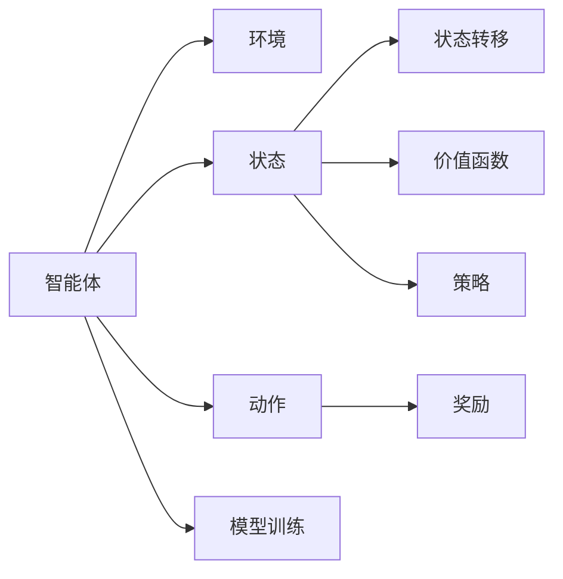

                 

## 1. 背景介绍

### 1.1 问题由来
在自动化制造领域，传统生产系统往往依赖人工操作和调度，这不仅效率低下，而且容易出现人为错误。随着智能制造的兴起，基于强化学习的自动化系统逐渐成为行业的新趋势。强化学习通过试错训练，使智能体在复杂环境中自动学习最优策略，具有较强的泛化能力和适应性。

### 1.2 问题核心关键点
当前强化学习在自动化制造中的应用主要包括自动化物流、智能调度、质量控制等方面。其核心关键点在于：
- 智能体：定义系统中的决策者，可以是机器人、自动化机械臂、智能终端等。
- 环境：定义智能体操作的物理或虚拟环境，包括机器设备、物料仓库、作业场地等。
- 奖励函数：定义智能体执行操作的奖惩规则，根据任务的完成情况、成本、安全性等因素，给予奖励或惩罚。
- 模型训练：通过试错训练，不断优化智能体的决策策略，最大化累积奖励。

### 1.3 问题研究意义
在自动化制造中引入强化学习，能够显著提升生产系统的灵活性、效率和稳定性。具体意义包括：
- 提高生产效率：通过智能体自主决策，减少人工干预，提升生产速度。
- 降低成本：通过优化资源配置和作业计划，降低物料和人力资源的浪费。
- 提升安全性：通过模拟环境训练，使智能体具备更加稳定可靠的决策能力。
- 推动产业升级：强化学习技术的应用，推动制造行业的智能化转型，加速向智能制造方向迈进。

## 2. 核心概念与联系

### 2.1 核心概念概述

为了更好地理解强化学习在自动化制造中的应用，本节将介绍几个密切相关的核心概念：

- 强化学习(Reinforcement Learning, RL)：通过智能体与环境的交互，智能体在每一步动作后根据环境的反馈调整策略，以达到最优决策目标。
- 智能体(Agent)：在环境中执行决策的实体，可以是机器人、自动化机械臂等物理设备，也可以是虚拟智能体。
- 环境(Environment)：智能体所处的环境，可以是物理世界中的实际设备，也可以是虚拟模拟环境。
- 状态(State)：环境中的具体状态，可以是机器人位置、速度、机器设备运行状态等。
- 动作(Action)：智能体执行的具体操作，如移动、抓取、放置等。
- 奖励(Reward)：根据智能体执行的动作和状态，给予相应的奖励或惩罚，用以指导智能体的决策。
- 策略(Policy)：定义智能体在不同状态下选择动作的策略，如随机策略、固定策略、Q-learning策略等。
- 价值函数(Value Function)：评估每个状态或动作的价值，指导智能体选择最优策略。
- 模型训练：通过试错训练，智能体逐渐优化其决策策略，最大化累积奖励。

这些核心概念之间的逻辑关系可以通过以下Mermaid流程图来展示：



这个流程图展示了一些核心概念的相互关系：

1. 智能体在环境中执行决策。
2. 环境通过状态转移、奖励等反馈信息影响智能体的决策。
3. 智能体根据状态和动作，更新其策略和价值函数。
4. 通过模型训练，智能体不断优化决策策略，提升累积奖励。

这些概念共同构成了强化学习的核心框架，使得智能体能够在复杂环境中自主学习最优决策。

## 3. 核心算法原理 & 具体操作步骤
### 3.1 算法原理概述

强化学习的核心思想是，通过智能体与环境的交互，智能体在每一步动作后根据环境的反馈调整策略，以达到最优决策目标。其核心算法包括Q-learning、SARSA、DQN等，这些算法均通过迭代优化，使智能体逐渐掌握最优决策策略。

强化学习的一般流程包括：
1. 定义环境和智能体。
2. 确定状态、动作和奖励函数。
3. 选择合适的强化学习算法。
4. 训练智能体，优化决策策略。
5. 测试智能体，评估其性能。

### 3.2 算法步骤详解

以Q-learning算法为例，详细讲解其具体实现步骤：

#### 3.2.1 初始化
- 设定智能体和环境的参数，如状态空间、动作空间、学习率、折扣因子等。
- 初始化状态 $s_0$，选择初始动作 $a_0$。
- 定义价值函数 $Q(s,a)$，即状态-动作的价值评估。

#### 3.2.2 状态和动作的执行
- 在当前状态 $s_t$ 下，智能体执行动作 $a_t$，观察环境反馈，得到状态 $s_{t+1}$ 和奖励 $r_{t+1}$。

#### 3.2.3 价值更新
- 根据状态-动作的价值评估公式 $Q(s,a) = Q(s,a) + \alpha(r_{t+1} + \gamma \max_{a'} Q(s_{t+1},a') - Q(s,a))$ 更新 $Q(s,a)$。
- $\alpha$ 为学习率，$\gamma$ 为折扣因子。

#### 3.2.4 状态更新
- 将当前状态 $s_t$ 更新为下一个状态 $s_{t+1}$。
- 重复执行步骤2和3，直到满足终止条件。

### 3.3 算法优缺点

强化学习在自动化制造中的应用具有以下优点：
1. 自主学习能力：智能体能够通过与环境的交互，自主学习最优策略，适应环境变化。
2. 动态决策：智能体能够在复杂多变的环境中进行动态决策，提升生产效率。
3. 泛化能力强：强化学习模型具有较强的泛化能力，适用于多种制造场景。

同时，强化学习在自动化制造中存在以下局限性：
1. 对环境建模要求高：需要精确描述环境状态和动作空间，实现难度较大。
2. 样本复杂度高：环境变化复杂，智能体需要大量的试错训练才能收敛。
3. 状态空间大：在复杂的制造环境中，状态空间巨大，难以进行精确建模。
4. 鲁棒性不足：强化学习模型对初始参数和数据分布敏感，容易产生不稳定决策。

尽管存在这些局限性，强化学习仍是一种强大的自动化制造决策技术，广泛应用于各种制造场景。未来需要进一步提升其模型表达能力和鲁棒性，以应对更多实际应用挑战。

### 3.4 算法应用领域

强化学习在自动化制造中的应用包括但不限于：

- 自动化物流：智能体根据任务需求，自主规划物流路径，优化物料运输和库存管理。
- 智能调度：智能体根据生产需求，自主调整设备运行参数，优化生产流程和资源利用率。
- 质量控制：智能体根据检测结果，自主调整检测参数，提升产品质量和检测效率。
- 故障诊断：智能体根据设备运行数据，自主分析故障原因，提前进行维护和修复。
- 自适应控制：智能体根据环境变化，自主调整控制策略，优化生产过程的稳定性和可靠性。

这些应用场景展示了强化学习在自动化制造中的强大潜力和广泛适用性，未来将有更多制造领域的自动化任务受益于强化学习技术。

## 4. 数学模型和公式 & 详细讲解 & 举例说明
### 4.1 数学模型构建

强化学习的数学模型由状态、动作、奖励、价值函数和策略组成。假设环境中有 $n$ 个状态 $s_1, s_2, \ldots, s_n$，智能体有 $m$ 个动作 $a_1, a_2, \ldots, a_m$。定义状态转移概率 $p(s_{t+1}|s_t, a_t)$ 和奖励函数 $R(s_t, a_t)$。

强化学习的目标是最大化累积奖励 $J(\pi)$，即：
$$
J(\pi) = \mathbb{E}\left[\sum_{t=0}^{\infty} \gamma^t R(s_t, a_t)\right]
$$

其中 $\pi$ 为智能体的策略，定义了智能体在不同状态下的动作选择。

### 4.2 公式推导过程

以Q-learning算法为例，推导其核心公式：

#### 状态-动作价值评估
定义状态-动作的价值函数 $Q(s,a)$，即在状态 $s$ 下执行动作 $a$ 的长期累积奖励期望：
$$
Q(s,a) = \mathbb{E}\left[\sum_{t=0}^{\infty} \gamma^t R(s_t, a_t)\right]
$$

根据状态转移概率和奖励函数，可以得到状态-动作的递推关系：
$$
Q(s,a) = \mathbb{E}\left[R(s,a) + \gamma \max_{a'} Q(s_{t+1},a')\right]
$$

通过迭代求解，得到Q-learning算法的核心公式：
$$
Q(s,a) = Q(s,a) + \alpha (R(s,a) + \gamma \max_{a'} Q(s_{t+1},a') - Q(s,a))
$$

其中 $\alpha$ 为学习率，$\max_{a'} Q(s_{t+1},a')$ 表示在下一个状态 $s_{t+1}$ 下，选择最优动作的Q值。

### 4.3 案例分析与讲解

以自动化物流为例，详细讲解Q-learning算法的应用：

假设智能体需要在仓库中移动物料，仓库中有若干物料点。状态空间为所有物料点，动作空间为向上、向下、向左、向右移动。奖励函数为每次成功移动的物料数。

智能体在当前状态 $s_t$ 下，执行动作 $a_t$，观察到状态 $s_{t+1}$ 和奖励 $r_{t+1}$。根据Q-learning算法，更新状态-动作的价值函数 $Q(s,a)$。

假设智能体当前位于物料点1，执行向下移动动作，观察到状态为物料点2，并奖励1个物料。智能体的当前状态-动作价值评估为：
$$
Q(1,\downarrow) = Q(1,\downarrow) + \alpha (1 + \gamma \max_{a'} Q(2,a')) = Q(1,\downarrow) + \alpha (1 + \gamma \max_{a'} Q(2,a'))
$$

假设智能体当前位于物料点2，执行向上移动动作，观察到状态为物料点1，并奖励0个物料。智能体的当前状态-动作价值评估为：
$$
Q(2,\uparrow) = Q(2,\uparrow) + \alpha (0 + \gamma \max_{a'} Q(1,a')) = Q(2,\uparrow) + \alpha \gamma \max_{a'} Q(1,a')
$$

重复执行状态转移和价值更新，智能体逐渐学习到最优移动策略，提升物料运输效率。

## 5. 项目实践：代码实例和详细解释说明
### 5.1 开发环境搭建

在进行强化学习项目实践前，我们需要准备好开发环境。以下是使用Python进行Gym库开发的环境配置流程：

1. 安装Anaconda：从官网下载并安装Anaconda，用于创建独立的Python环境。

2. 创建并激活虚拟环境：
```bash
conda create -n rl-env python=3.8 
conda activate rl-env
```

3. 安装OpenAI Gym：
```bash
pip install gym
```

4. 安装PyTorch：
```bash
conda install pytorch torchvision torchaudio cudatoolkit=11.1 -c pytorch -c conda-forge
```

5. 安装PyTorch的Reinforcement Learning库：
```bash
pip install torch-reinforcement
```

完成上述步骤后，即可在`rl-env`环境中开始强化学习实践。

### 5.2 源代码详细实现

这里我们以自动化物流任务为例，使用Gym库和PyTorch实现Q-learning算法的代码实现。

首先，定义环境类：

```python
import gym
import numpy as np

class LogisticsEnv(gym.Env):
    def __init__(self):
        self.state_space = 10
        self.action_space = gym.spaces.Discrete(4)
        self.max_reward = 1
        self.state = 0
        self.done = False
    
    def reset(self):
        self.state = 0
        self.done = False
        return np.zeros(self.state_space)
    
    def step(self, action):
        self.state += 1
        if self.state == self.state_space:
            self.done = True
        reward = self.max_reward if action == 3 else 0
        return np.zeros(self.state_space), reward, self.done, {}
```

然后，定义强化学习算法类：

```python
from torch_reinforcement import QLearning

class LogisticsAgent(QLearning):
    def __init__(self, env, alpha=0.1, gamma=0.9):
        super().__init__(env, alpha=alpha, gamma=gamma)
        self.state_space = env.state_space
        self.action_space = env.action_space
        
        self.q = np.zeros((self.state_space, self.action_space.n))
    
    def forward(self, state, action):
        return self.q[state, action]
    
    def backward(self, state, action, reward, next_state, done):
        target = reward + self.gamma * np.max(self.q[next_state, :])
        loss = (self.q[state, action] - target) ** 2
        self.q[state, action] -= self.alpha * loss
    
    def select_action(self, state):
        return np.random.choice(self.action_space.n)
    
    def update_state(self, state):
        self.state = state
```

最后，启动训练流程：

```python
env = LogisticsEnv()
agent = LogisticsAgent(env)

episodes = 1000
alpha = 0.1
gamma = 0.9

for episode in range(episodes):
    state = env.reset()
    done = False
    while not done:
        action = agent.select_action(state)
        next_state, reward, done, _ = env.step(action)
        agent.update_state(state)
        agent.backward(state, action, reward, next_state, done)
        state = next_state

print(agent.q)
```

以上就是使用Gym库和PyTorch实现Q-learning算法的基本代码实现。可以看到，通过定义环境类和强化学习算法类，可以方便地实现强化学习任务的训练和评估。

### 5.3 代码解读与分析

让我们再详细解读一下关键代码的实现细节：

**LogisticsEnv类**：
- `__init__`方法：定义环境的状态空间、动作空间和奖励函数。
- `reset`方法：重置环境状态，返回初始状态。
- `step`方法：根据动作执行状态转移，返回状态、奖励和是否结束。

**LogisticsAgent类**：
- `__init__`方法：初始化强化学习算法的参数和状态。
- `forward`方法：定义模型的前向传播，返回当前状态-动作的价值评估。
- `backward`方法：定义模型的反向传播，根据当前状态-动作的价值评估，更新价值函数。
- `select_action`方法：定义模型的动作选择策略。
- `update_state`方法：定义模型的状态更新策略。

**训练流程**：
- 循环执行训练，在每个epoch内不断执行状态选择和价值更新。
- 在每个epoch结束后，打印最终的价值函数矩阵。

可以看到，Gym库和PyTorch的结合，使得强化学习的实现变得简单高效，开发者可以专注于任务设计和算法优化。

## 6. 实际应用场景
### 6.1 智能调度

智能调度是强化学习在自动化制造中的一个重要应用。传统调度系统往往依赖人工干预，难以适应复杂多变的环境。基于强化学习的智能调度系统，能够根据生产需求，自主调整设备运行参数，优化生产流程和资源利用率。

具体而言，智能调度系统可以通过实时监测生产数据，构建状态空间和动作空间，设计合适的奖励函数。智能体在每个决策时刻，根据当前状态和奖励函数，选择最优动作进行调度。通过训练，智能体能够学习到最优调度策略，提升生产效率和资源利用率。

### 6.2 故障诊断

故障诊断是自动化制造中常见的任务。传统的故障诊断依赖人工经验，难以及时发现和修复设备故障。基于强化学习的故障诊断系统，能够根据设备运行数据，自主分析故障原因，提前进行维护和修复。

具体而言，故障诊断系统可以将设备运行数据作为状态空间，将可能的故障类型作为动作空间，设计合适的奖励函数。智能体在每个决策时刻，根据当前状态和奖励函数，选择最优动作进行诊断。通过训练，智能体能够学习到最优诊断策略，及时发现和修复设备故障，减少生产损失。

### 6.3 自适应控制

自适应控制是自动化制造中对智能体控制策略动态调整的需求。传统控制方法往往依赖固定控制策略，难以适应环境变化。基于强化学习的自适应控制系统，能够根据环境变化，自主调整控制策略，优化生产过程的稳定性和可靠性。

具体而言，自适应控制系统可以将环境变化作为状态空间，将可能的控制动作作为动作空间，设计合适的奖励函数。智能体在每个决策时刻，根据当前状态和奖励函数，选择最优动作进行控制。通过训练，智能体能够学习到最优控制策略，提升生产过程的稳定性和可靠性。

## 7. 工具和资源推荐
### 7.1 学习资源推荐

为了帮助开发者系统掌握强化学习在自动化制造中的应用，这里推荐一些优质的学习资源：

1. 《强化学习基础》系列博文：由深度学习专家撰写，全面介绍强化学习的基本概念和算法。
2. 《深度强化学习》课程：斯坦福大学开设的深度学习课程，涵盖强化学习的多个重要算法。
3. 《Reinforcement Learning: An Introduction》书籍：Sutton和Barto的经典入门书籍，深入浅出地介绍强化学习的核心思想和应用。
4. OpenAI Gym官方文档：Gym库的官方文档，提供了丰富的环境和算法样例代码，是上手实践的必备资料。
5. 《Hands-On Reinforcement Learning with Python》书籍：Garcia和Lillicrap所著，详细讲解了使用Python实现强化学习的全过程。

通过对这些资源的学习实践，相信你一定能够快速掌握强化学习在自动化制造中的应用，并用于解决实际的自动化任务。

### 7.2 开发工具推荐

高效的开发离不开优秀的工具支持。以下是几款用于强化学习开发的工具：

1. Python：开源的编程语言，有丰富的第三方库支持，适合快速迭代研究。
2. Gym库：Gym是OpenAI开发的强化学习环境库，提供丰富的环境资源和算法样例代码。
3. PyTorch：基于Python的开源深度学习框架，支持动态计算图和GPU加速，适合分布式训练。
4. TensorBoard：TensorFlow配套的可视化工具，可实时监测模型训练状态，提供丰富的图表呈现方式。
5. Weights & Biases：模型训练的实验跟踪工具，可以记录和可视化模型训练过程中的各项指标，方便对比和调优。

合理利用这些工具，可以显著提升强化学习任务的开发效率，加快创新迭代的步伐。

### 7.3 相关论文推荐

强化学习在自动化制造中的应用源于学界的持续研究。以下是几篇奠基性的相关论文，推荐阅读：

1. Learning to Play Go with Deep Reinforcement Learning：DeepMind开发的AlphaGo论文，展示了强化学习在复杂博弈中的应用。
2. Deep Reinforcement Learning for Parameter Tuning of Machine Learning Models：Yang等人的论文，展示了强化学习在模型调参中的应用。
3. Robotics: A Survey of Deep Reinforcement Learning Applications：Kumara等人的综述文章，详细介绍了强化学习在机器人中的应用。
4. Learning DARTs: Deep Anchored Reinforcement Learning for Neural Network Architecture Search：Xu等人的论文，展示了强化学习在神经网络结构搜索中的应用。
5. Socially Constrained Reinforcement Learning for Collaborative Robotics：Wang等人的论文，展示了强化学习在协作机器人中的应用。

这些论文代表了大强化学习在自动化制造的应用发展脉络。通过学习这些前沿成果，可以帮助研究者把握学科前进方向，激发更多的创新灵感。

## 8. 总结：未来发展趋势与挑战
### 8.1 总结

本文对强化学习在自动化制造中的应用进行了全面系统的介绍。首先阐述了强化学习的基本原理和核心概念，明确了其在自动化制造中的重要意义。其次，从原理到实践，详细讲解了强化学习的数学模型和核心算法，给出了实际应用中的代码实例。同时，本文还广泛探讨了强化学习在自动化制造中的多个应用场景，展示了其强大的潜力。

通过本文的系统梳理，可以看到，强化学习在自动化制造中的广泛应用，能够显著提升生产系统的灵活性、效率和稳定性。未来需要进一步提升强化学习模型的表达能力和鲁棒性，以应对更多实际应用挑战。

### 8.2 未来发展趋势

展望未来，强化学习在自动化制造中的应用将呈现以下几个发展趋势：

1. 模型复杂度提升：随着强化学习技术的不断进步，模型复杂度将不断提升，能够处理更加复杂的环境和任务。
2. 多智能体学习：将多个智能体联合训练，提升系统协作和适应能力。
3. 学习目标多元化：强化学习不仅仅关注效率和成本，还将更多地考虑环境可持续性和社会责任。
4. 实时优化：强化学习模型将在实时环境中进行优化，提升系统的响应速度和实时性。
5. 模型解释性增强：提升强化学习模型的可解释性，帮助人们更好地理解其决策过程。

以上趋势凸显了强化学习在自动化制造中的广阔前景。这些方向的探索发展，将进一步提升生产系统的智能化水平，为智能制造提供更强有力的技术支持。

### 8.3 面临的挑战

尽管强化学习在自动化制造中已经取得了显著成效，但在迈向更加智能化、普适化应用的过程中，仍面临诸多挑战：

1. 环境建模复杂：自动化制造环境复杂多变，难以精确建模，模型参数和计算复杂度高。
2. 学习效率低：需要大量的试错训练才能收敛，训练时间较长。
3. 鲁棒性不足：模型对初始参数和数据分布敏感，容易产生不稳定决策。
4. 安全性问题：强化学习模型可能学习到有害的行为，造成安全风险。
5. 泛化能力不足：模型难以泛化到未见过的环境和任务，泛化能力有限。

尽管存在这些挑战，强化学习仍是一种强大的自动化制造决策技术，广泛应用于各种制造场景。未来需要进一步提升其模型表达能力和鲁棒性，以应对更多实际应用挑战。

### 8.4 研究展望

面对强化学习面临的诸多挑战，未来的研究需要在以下几个方面寻求新的突破：

1. 提升环境建模能力：开发更加精确、高效的环境建模方法，降低模型复杂度和计算复杂度。
2. 加速学习过程：开发更加高效的学习算法，减少试错训练时间，提升模型收敛速度。
3. 增强模型鲁棒性：开发更加鲁棒的强化学习算法，提高模型的稳定性和可靠性。
4. 保障系统安全性：设计更加安全的强化学习模型，避免有害行为的出现。
5. 提高模型泛化能力：开发更加通用的强化学习算法，提升模型在不同环境下的泛化能力。

这些研究方向的探索，将引领强化学习技术在自动化制造中的应用，推动智能制造的进一步发展。相信随着学界和产业界的共同努力，强化学习将在智能制造领域发挥更加重要的作用，为制造业带来更加智能、高效、安全的发展。

## 9. 附录：常见问题与解答

**Q1：强化学习在自动化制造中的应用有哪些？**

A: 强化学习在自动化制造中的应用包括但不限于：
- 自动化物流：智能体自主规划物流路径，优化物料运输和库存管理。
- 智能调度：智能体根据生产需求，自主调整设备运行参数，优化生产流程和资源利用率。
- 质量控制：智能体根据检测结果，自主调整检测参数，提升产品质量和检测效率。
- 故障诊断：智能体根据设备运行数据，自主分析故障原因，提前进行维护和修复。
- 自适应控制：智能体根据环境变化，自主调整控制策略，优化生产过程的稳定性和可靠性。

这些应用展示了强化学习在自动化制造中的强大潜力和广泛适用性。

**Q2：如何选择合适的强化学习算法？**

A: 选择合适的强化学习算法需要考虑任务的复杂度、环境的多样性、数据的质量等因素。对于简单环境，Q-learning、SARSA等传统算法能够快速收敛；对于复杂环境，DQN、DDPG等深度强化学习算法能够处理高维状态和动作空间；对于高维度数据，PPO、TRPO等基于策略梯度的算法能够提升学习效率。

**Q3：强化学习在自动化制造中面临哪些挑战？**

A: 强化学习在自动化制造中面临的挑战包括：
- 环境建模复杂：自动化制造环境复杂多变，难以精确建模。
- 学习效率低：需要大量的试错训练才能收敛，训练时间较长。
- 鲁棒性不足：模型对初始参数和数据分布敏感，容易产生不稳定决策。
- 安全性问题：强化学习模型可能学习到有害的行为，造成安全风险。
- 泛化能力不足：模型难以泛化到未见过的环境和任务，泛化能力有限。

这些挑战需要通过算法优化、环境建模、模型训练等多个环节进行综合提升。

**Q4：如何评估强化学习在自动化制造中的性能？**

A: 评估强化学习在自动化制造中的性能，通常需要考虑以下几个指标：
- 累积奖励：衡量智能体在多个状态下执行动作的累积奖励。
- 状态-动作价值评估：评估智能体在不同状态-动作组合下的长期奖励。
- 动作选择策略：评估智能体在不同状态下选择动作的策略稳定性。
- 稳定性：评估智能体在不同环境下的稳定性，避免灾难性遗忘。
- 泛化能力：评估智能体在不同未见过的环境中执行动作的泛化能力。

通过综合考虑这些指标，可以全面评估强化学习在自动化制造中的性能。

---

作者：禅与计算机程序设计艺术 / Zen and the Art of Computer Programming

