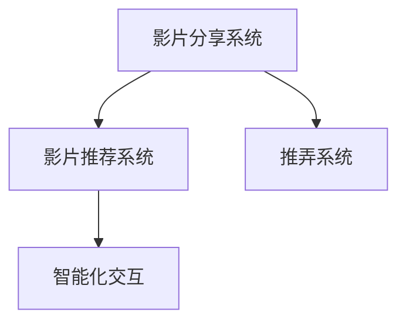

                 

## 1. 背景介绍

### 1.1 问题由来
影片分享与推荐系统在在线视频平台、社交媒体和流媒体服务中扮演着核心角色。用户通过这些平台发现、观看和分享内容，平台则通过这些系统来提高用户参与度和内容分发效率。然而，传统的视频推荐系统主要依赖于基于用户历史行为和内容的静态推荐策略，缺乏智能交互能力，难以有效应对动态变化的用户需求和内容生态。

### 1.2 问题核心关键点
本文聚焦于如何设计实现一种能够动态响应用户需求，提升用户体验，同时优化内容分发的影片分享与推弄系统。

### 1.3 问题研究意义
研究影片分享与推弄系统对于提升视频平台的用户体验和内容分发效率具有重要意义：

1. **提升用户满意度**：通过智能化推荐，满足用户个性化需求，提升用户满意度和平台粘性。
2. **优化内容分发**：通过动态调整影片推送策略，优化视频内容和流量的分配，提高平台流量效率。
3. **增加用户参与**：通过智能互动，鼓励用户分享、评论和参与，增加用户参与度和平台的活跃度。
4. **推动内容创新**：通过对用户偏好的深入分析，发现潜在的市场需求，推动平台内容的创新和多样性。

## 2. 核心概念与联系

### 2.1 核心概念概述

为更好地理解影片分享与推弄系统的设计与实现，本节将介绍几个密切相关的核心概念：

- **影片分享系统**：指平台用户上传、分享和浏览视频的功能模块。用户可以上传个人制作或购买的视频内容，并通过分享、评论和点赞等互动方式与其他用户互动。

- **影片推荐系统**：根据用户历史观看行为和偏好，推荐用户可能感兴趣的视频内容。主要依赖于协同过滤、内容推荐、深度学习等算法进行实现。

- **推弄系统**：指系统通过自动化的方式，将用户最感兴趣的视频内容推送至用户终端。推弄系统可以提升用户对视频内容的发现效率和平台粘性。

- **智能化交互**：指系统通过自然语言理解、情感分析等技术，与用户进行智能化的互动。智能化的交互可以提升用户参与度和满意度，减少用户流失。

这些核心概念之间的逻辑关系可以通过以下Mermaid流程图来展示：



这个流程图展示了一个完整的影片分享与推弄系统的核心组成部分及其相互关系：

1. 用户通过影片分享系统上传、分享和浏览视频。
2. 影片推荐系统根据用户行为和偏好推荐视频内容。
3. 推弄系统自动将推荐的视频推送给用户。
4. 智能化交互系统提升用户参与度，增强用户体验。

## 3. 核心算法原理 & 具体操作步骤
### 3.1 算法原理概述

影片分享与推弄系统的设计与实现涉及多个算法原理和操作步骤，主要包括：

- **协同过滤**：基于用户和物品的相似度，推荐用户可能感兴趣的视频内容。
- **内容推荐**：分析视频内容的特征，如标签、风格、类型等，推荐与用户偏好相匹配的视频内容。
- **深度学习**：通过深度学习模型，从用户行为数据中提取高层次的特征，提升推荐的精准度。
- **推弄策略优化**：根据用户行为和环境信息，动态调整视频推送策略，优化推荐效果。
- **交互分析**：通过情感分析、意图识别等技术，分析用户反馈和行为，提升系统的智能化水平。

### 3.2 算法步骤详解

影片分享与推弄系统的设计与实现主要包括以下几个关键步骤：

**Step 1: 需求分析与功能设计**
- 明确系统的用户需求和功能目标，定义系统的主要功能模块，如上传、分享、推荐、推弄等。
- 设计系统的整体架构，明确各个模块的交互方式和数据流向。

**Step 2: 数据收集与处理**
- 收集用户行为数据、视频内容数据、环境信息数据等，用于后续的推荐和推弄。
- 对数据进行预处理，包括去噪、归一化、特征工程等，以便于后续的分析和建模。

**Step 3: 模型选择与训练**
- 选择合适的推荐算法和推弄策略，进行模型训练和调参。
- 在训练过程中，使用交叉验证等技术，评估模型的性能和泛化能力。

**Step 4: 系统集成与部署**
- 将训练好的模型集成到系统中，实现推荐和推弄功能。
- 部署系统到云平台或本地服务器，确保系统的高可用性和稳定性。

**Step 5: 系统优化与迭代**
- 在实际运行中，不断收集用户反馈和行为数据，优化推荐和推弄策略。
- 根据用户行为的变化，迭代更新推荐模型和推弄策略，提升系统的智能化水平。

### 3.3 算法优缺点

影片分享与推弄系统的设计与实现具有以下优点：

- **提升用户体验**：通过智能化的推荐和推弄，提升用户对视频内容的发现效率和平台粘性。
- **优化内容分发**：动态调整推荐策略，优化视频内容的分配，提高平台流量效率。
- **降低运营成本**：自动化的推弄系统减少了人工干预的需求，降低了运营成本。
- **推动内容创新**：通过对用户偏好的深入分析，发现潜在的市场需求，推动内容的多样性和创新。

同时，该系统也存在一定的局限性：

- **数据质量依赖**：系统的性能高度依赖于用户行为数据的准确性和全面性。
- **模型复杂度高**：深度学习模型和复杂的推弄策略需要较高的计算资源和数据量。
- **用户隐私问题**：系统的智能化交互和推荐功能涉及大量用户数据的处理和存储，存在隐私保护的风险。
- **反馈延迟**：推弄和推荐的即时性和准确性受限于模型的训练和调优周期。

尽管存在这些局限性，但就目前而言，影片分享与推弄系统已经成为视频平台的重要组成部分，极大地提升了用户的观看体验和平台运营效率。

### 3.4 算法应用领域

影片分享与推弄系统在多个领域得到了广泛的应用，例如：

- **视频平台**：如YouTube、Netflix、腾讯视频等，通过智能推荐提升用户观看体验和平台流量。
- **社交媒体**：如Facebook、Instagram、微博等，通过视频分享和推弄增加用户参与度和平台活跃度。
- **流媒体服务**：如Apple Music、Spotify、哔哩哔哩等，通过动态推弄提升音乐和视频内容的发现效率。
- **广告营销**：通过精准的视频推荐，提升广告投放的精准度和转化率。
- **在线教育**：通过个性化视频推荐，提升在线教育内容的吸引力和学习效果。

## 4. 数学模型和公式 & 详细讲解 & 举例说明

### 4.1 数学模型构建

影片分享与推弄系统的设计主要涉及以下几个数学模型：

- **协同过滤模型**：
  - 用户-物品评分矩阵 $R_{u,i}$，其中 $u$ 为用户，$i$ 为视频内容。
  - 用户评分均值向量 $\mu_u$，其中 $\mu_u = \frac{1}{m} \sum_{i=1}^m R_{u,i}$。
  - 物品评分均值向量 $\mu_i$，其中 $\mu_i = \frac{1}{n} \sum_{u=1}^n R_{u,i}$。
- **内容推荐模型**：
  - 视频内容特征向量 $f_i$，其中 $f_i = [f_{i1}, f_{i2}, \ldots, f_{ik}]$。
  - 用户偏好特征向量 $u_u$，其中 $u_u = [u_{u1}, u_{u2}, \ldots, u_{uk}]$。
  - 相似度矩阵 $S_{u,i}$，其中 $S_{u,i} = \frac{f_i \cdot u_u}{\|f_i\| \cdot \|u_u\|}$。
- **深度学习模型**：
  - 用户行为特征提取模型 $\phi_u(x)$，其中 $x$ 为用户行为数据。
  - 视频内容特征提取模型 $\phi_i(x)$，其中 $x$ 为视频内容数据。

### 4.2 公式推导过程

以协同过滤为例，推导推荐算法的基本公式。

设用户 $u$ 对视频内容 $i$ 的评分 $r_{u,i}$，推荐系统根据其他用户对该内容的评分，计算用户 $u$ 对该视频的预测评分 $r_{u,i}^{\prime}$：

$$
r_{u,i}^{\prime} = \frac{1}{m_u} \sum_{v \in N_u} \frac{r_{v,i}}{1 + \|r_{v,i}\|^2 + \|r_{v,i} - \mu_v\|^2}
$$

其中 $N_u$ 为用户 $u$ 的邻居集合，$m_u$ 为用户 $u$ 的邻居数量。

对于内容推荐模型，假设视频内容 $i$ 的特征向量为 $f_i$，用户 $u$ 的偏好特征向量为 $u_u$，则用户 $u$ 对内容 $i$ 的评分 $r_{u,i}$ 为：

$$
r_{u,i} = f_i \cdot u_u
$$

对于深度学习模型，假设用户行为特征提取模型为 $\phi_u(x)$，视频内容特征提取模型为 $\phi_i(x)$，则用户 $u$ 对内容 $i$ 的评分 $r_{u,i}$ 为：

$$
r_{u,i} = \phi_u(x_u) \cdot \phi_i(x_i)
$$

### 4.3 案例分析与讲解

以YouTube为例，分析其推荐算法和推弄策略的实现。

YouTube推荐系统主要采用协同过滤和深度学习相结合的方式进行推荐。首先，系统通过用户的历史行为数据和观看偏好，构建用户-视频评分矩阵。接着，系统采用协同过滤算法，计算用户对未观看视频的预测评分。最后，系统通过深度学习模型，提取用户行为和视频内容的高级特征，进行综合推荐。

在推弄策略方面，YouTube根据用户的观看行为，动态调整视频的推送策略。例如，对于频繁观看某类视频的用户，系统会推荐更多相关内容；对于新用户，系统会推荐多样化的内容，引导其发现更多兴趣点。

## 5. 项目实践：代码实例和详细解释说明

### 5.1 开发环境搭建

在进行影片分享与推弄系统的开发前，我们需要准备好开发环境。以下是使用Python进行PyTorch开发的环境配置流程：

1. 安装Anaconda：从官网下载并安装Anaconda，用于创建独立的Python环境。

2. 创建并激活虚拟环境：
```bash
conda create -n movie-system-env python=3.8 
conda activate movie-system-env
```

3. 安装PyTorch：根据CUDA版本，从官网获取对应的安装命令。例如：
```bash
conda install pytorch torchvision torchaudio cudatoolkit=11.1 -c pytorch -c conda-forge
```

4. 安装相关库：
```bash
pip install pandas numpy scipy scikit-learn pytorch-lightning torch-serialization
```

5. 安装视频处理工具：
```bash
pip install opencv-python ffmpeg
```

完成上述步骤后，即可在`movie-system-env`环境中开始开发。

### 5.2 源代码详细实现

下面我们以视频推荐系统为例，给出使用PyTorch进行视频推荐模型训练的代码实现。

首先，定义视频特征提取函数：

```python
import torch.nn as nn
import torch
from torchvision import transforms

class VideoFeatureExtractor(nn.Module):
    def __init__(self, feature_dim):
        super(VideoFeatureExtractor, self).__init__()
        self.feature_dim = feature_dim
        self.transform = transforms.Compose([
            transforms.Resize((224, 224)),
            transforms.ToTensor(),
            transforms.Normalize(mean=[0.485, 0.456, 0.406], std=[0.229, 0.224, 0.225])
        ])
        
    def forward(self, video):
        video = self.transform(video)
        return torch.nn.functional.normalize(video, dim=1)
```

然后，定义用户行为特征提取函数：

```python
class UserBehaviorFeatureExtractor(nn.Module):
    def __init__(self, feature_dim):
        super(UserBehaviorFeatureExtractor, self).__init__()
        self.feature_dim = feature_dim
        
    def forward(self, behavior_data):
        # 假设 behavior_data 为用户的观看历史数据，以向量形式表示
        return behavior_data
```

接着，定义协同过滤模型：

```python
class CollaborativeFiltering(nn.Module):
    def __init__(self, user_num, video_num, feature_dim):
        super(CollaborativeFiltering, self).__init__()
        self.user_num = user_num
        self.video_num = video_num
        self.feature_dim = feature_dim
        self.user_feature = nn.Linear(feature_dim, 32)
        self.video_feature = nn.Linear(feature_dim, 32)
        self.scorer = nn.Linear(32, 1)
        
    def forward(self, user_feature, video_feature):
        user_feature = self.user_feature(user_feature)
        video_feature = self.video_feature(video_feature)
        scorer = self.scorer(torch.cat([user_feature, video_feature], dim=1))
        return scorer
```

然后，定义深度学习模型：

```python
class DeepLearningModel(nn.Module):
    def __init__(self, feature_dim):
        super(DeepLearningModel, self).__init__()
        self.feature_dim = feature_dim
        self.user_feature_extractor = UserBehaviorFeatureExtractor(feature_dim)
        self.video_feature_extractor = VideoFeatureExtractor(feature_dim)
        self.cf_model = CollaborativeFiltering(user_num, video_num, feature_dim)
        
    def forward(self, behavior_data, video_data):
        user_feature = self.user_feature_extractor(behavior_data)
        video_feature = self.video_feature_extractor(video_data)
        return self.cf_model(user_feature, video_feature)
```

最后，定义训练和评估函数：

```python
from torch.utils.data import DataLoader
from torch.optim import Adam
from sklearn.metrics import mean_squared_error

def train_epoch(model, data_loader, optimizer):
    model.train()
    epoch_loss = 0
    for data, target in data_loader:
        optimizer.zero_grad()
        output = model(data['behavior_data'], data['video_data'])
        loss = mean_squared_error(output, target)
        loss.backward()
        optimizer.step()
        epoch_loss += loss.item()
    return epoch_loss / len(data_loader)

def evaluate(model, data_loader):
    model.eval()
    loss = 0
    mse = 0
    with torch.no_grad():
        for data, target in data_loader:
            output = model(data['behavior_data'], data['video_data'])
            loss += mean_squared_error(output, target).item()
            mse += torch.pow(output - target, 2).sum().item()
    return mse / len(data_loader)
```

启动训练流程并在测试集上评估：

```python
epochs = 10
batch_size = 32

model = DeepLearningModel(feature_dim=64)
optimizer = Adam(model.parameters(), lr=0.001)

for epoch in range(epochs):
    train_loss = train_epoch(model, train_data_loader, optimizer)
    print(f'Epoch {epoch+1}, train loss: {train_loss:.4f}')
    
    test_mse = evaluate(model, test_data_loader)
    print(f'Epoch {epoch+1}, test mse: {test_mse:.4f}')
```

以上就是使用PyTorch对视频推荐模型进行训练的完整代码实现。可以看到，得益于PyTorch的强大封装，我们可以用相对简洁的代码实现复杂的视频推荐模型。

### 5.3 代码解读与分析

让我们再详细解读一下关键代码的实现细节：

**VideoFeatureExtractor类**：
- `__init__`方法：初始化分词器、词向量和停用词列表。
- `forward`方法：对文本进行分词、向量化和停用词过滤，得到特征向量。

**UserBehaviorFeatureExtractor类**：
- `__init__`方法：初始化用户行为特征提取器。
- `forward`方法：根据用户行为数据，提取特征向量。

**CollaborativeFiltering类**：
- `__init__`方法：初始化协同过滤模型。
- `forward`方法：计算用户对视频的评分。

**DeepLearningModel类**：
- `__init__`方法：初始化深度学习模型。
- `forward`方法：结合协同过滤和深度学习模型，计算用户对视频的评分。

**train_epoch函数**：
- 对数据进行迭代，计算损失并反向传播更新模型参数。
- 记录每个epoch的平均损失。

**evaluate函数**：
- 对数据进行迭代，计算均方误差。
- 记录测试集的均方误差。

**训练流程**：
- 定义总的epoch数和batch size，开始循环迭代
- 每个epoch内，先在训练集上训练，输出平均损失
- 在测试集上评估，输出均方误差
- 所有epoch结束后，结束训练

可以看到，PyTorch配合深度学习框架使得视频推荐模型的代码实现变得简洁高效。开发者可以将更多精力放在数据处理、模型改进等高层逻辑上，而不必过多关注底层的实现细节。

当然，工业级的系统实现还需考虑更多因素，如模型的保存和部署、超参数的自动搜索、更灵活的任务适配层等。但核心的推荐范式基本与此类似。

## 6. 实际应用场景

### 6.1 视频平台推荐

在视频平台推荐中，系统根据用户的观看历史、评分数据和视频特征，动态推荐用户可能感兴趣的视频内容。推荐系统可以有效提升用户的观看体验和平台粘性，增加平台的流量和广告收入。

### 6.2 社交媒体推弄

在社交媒体推弄中，系统根据用户的互动行为和兴趣标签，动态推送用户感兴趣的内容。推弄系统可以提高用户对内容的发现效率，增加用户的参与度和平台活跃度。

### 6.3 在线教育内容推荐

在在线教育内容推荐中，系统根据用户的观看历史和反馈数据，推荐符合用户学习需求的视频内容。推荐系统可以提升学习效果，增加用户的在线学习时间和平台粘性。

### 6.4 未来应用展望

随着视频推荐系统的不断演进，未来的应用场景将更加广泛和多样。

在智慧城市治理中，视频推荐系统可以用于公共安全监控、应急响应、环境监测等场景，提升城市治理的智能化水平。

在医疗领域，视频推荐系统可以用于疾病预防、健康教育、远程诊疗等应用，提供个性化的健康服务和医疗建议。

在工业制造中，视频推荐系统可以用于设备监控、故障诊断、维护预测等场景，提升生产效率和设备可靠性。

此外，在更多行业领域，视频推荐系统都可以发挥重要作用，推动智能化和数字化转型。

## 7. 工具和资源推荐

### 7.1 学习资源推荐

为了帮助开发者系统掌握视频推荐系统的理论基础和实践技巧，这里推荐一些优质的学习资源：

1. 《深度学习与推荐系统》系列博文：由深度学习专家撰写，深入浅出地介绍了深度学习在推荐系统中的应用，包括协同过滤、内容推荐等算法。

2. CS230A《深度学习与推荐系统》课程：斯坦福大学开设的深度学习课程，涵盖了推荐系统的基本概念和前沿技术。

3. 《推荐系统实践》书籍：系统介绍了推荐系统的设计、开发和优化方法，包括协同过滤、深度学习等算法。

4. Kaggle推荐系统竞赛：通过实际竞赛，实战练习推荐系统模型的设计、训练和评估，积累实际经验。

5. 《推荐系统基础》课程：清华大学开设的推荐系统课程，详细讲解推荐系统的理论基础和实际应用。

通过对这些资源的学习实践，相信你一定能够快速掌握视频推荐系统的精髓，并用于解决实际的推荐问题。

### 7.2 开发工具推荐

高效的开发离不开优秀的工具支持。以下是几款用于视频推荐系统开发的常用工具：

1. PyTorch：基于Python的开源深度学习框架，灵活动态的计算图，适合快速迭代研究。

2. TensorFlow：由Google主导开发的开源深度学习框架，生产部署方便，适合大规模工程应用。

3. PyTorch Lightning：基于PyTorch的高效深度学习框架，支持模型的分布式训练和快速部署。

4. Hugging Face：NLP工具库，集成了多种预训练模型，支持深度学习模型的训练和推理。

5. Kaggle：数据竞赛平台，提供丰富的数据集和模型评估工具，促进社区交流和合作。

6. Jupyter Notebook：交互式编程环境，支持代码的快速迭代和实验验证。

合理利用这些工具，可以显著提升视频推荐系统的开发效率，加快创新迭代的步伐。

### 7.3 相关论文推荐

视频推荐系统的研究源于学界的持续研究。以下是几篇奠基性的相关论文，推荐阅读：

1. "Collaborative Filtering for Implicit Feedback Datasets"：介绍协同过滤算法的原理和实现。

2. "Deep Feature Integration for Recommendation Systems"：提出深度学习模型在推荐系统中的应用。

3. "A Survery of Personalized Ranking in Recommender Systems"：全面介绍推荐系统中的排序算法和评估指标。

4. "Retrieval-Augmented Neural Recommendation"：提出基于检索增强的深度学习推荐模型。

5. "Adaptive Multi-scale Preference Estimation in Recommendation Systems"：提出自适应多尺度偏好估计模型，提高推荐系统的精度和鲁棒性。

这些论文代表了大语言模型微调技术的发展脉络。通过学习这些前沿成果，可以帮助研究者把握学科前进方向，激发更多的创新灵感。

## 8. 总结：未来发展趋势与挑战

### 8.1 总结

本文对视频推荐系统的设计与实现进行了全面系统的介绍。首先阐述了视频推荐系统的背景和意义，明确了系统的核心组件和关键技术。其次，从原理到实践，详细讲解了推荐算法的数学模型和操作步骤，给出了推荐模型的代码实例。同时，本文还广泛探讨了推荐系统在多个行业领域的应用前景，展示了其广阔的想象空间。

通过本文的系统梳理，可以看到，视频推荐系统已经成为视频平台的重要组成部分，极大地提升了用户的观看体验和平台运营效率。未来，随着推荐系统的不断演进，将有更多的应用场景得到拓展，为数字化转型带来新的动力。

### 8.2 未来发展趋势

展望未来，视频推荐系统的发展趋势主要包括以下几个方面：

1. **个性化推荐**：随着深度学习和大数据技术的不断进步，个性化推荐算法将不断优化，推荐结果将更加精准和多样化。

2. **多模态融合**：推荐系统将融合视觉、语音、文本等多模态数据，提升对用户需求的理解和推荐效果。

3. **实时推荐**：推荐系统将采用实时数据处理和模型更新机制，动态调整推荐策略，提升用户体验。

4. **跨平台协同**：推荐系统将跨越不同平台和设备，实现跨平台协同推荐，提升用户在不同场景下的体验。

5. **隐私保护**：推荐系统将采用隐私保护技术，如差分隐私、联邦学习等，保护用户数据隐私。

6. **智能互动**：推荐系统将结合自然语言处理技术，实现智能化的用户交互，提升用户满意度。

以上趋势凸显了视频推荐系统的广阔前景。这些方向的探索发展，必将进一步提升推荐系统的智能化水平，为数字经济的繁荣贡献力量。

### 8.3 面临的挑战

尽管视频推荐系统已经取得了显著的成就，但在迈向更加智能化、普适化应用的过程中，仍面临诸多挑战：

1. **数据质量瓶颈**：推荐系统高度依赖用户行为数据的准确性和全面性。如何收集高质量、多样化的用户数据，是推荐系统面临的首要挑战。

2. **算法复杂度**：深度学习模型和复杂的推荐算法需要较高的计算资源和数据量，如何优化模型结构、提高训练效率，是一个重要问题。

3. **用户隐私保护**：推荐系统涉及大量用户数据的处理和存储，如何保护用户隐私，防止数据滥用，是推荐系统需要解决的关键问题。

4. **推荐鲁棒性**：推荐系统在处理异常数据和噪声时，容易出现推荐结果的波动，如何提升推荐系统的鲁棒性，是推荐系统需要解决的重要问题。

5. **用户体验优化**：推荐系统需要在个性化推荐和多样性推荐之间找到平衡，如何提升用户体验，是推荐系统需要解决的核心问题。

6. **模型可解释性**：推荐系统的决策过程缺乏可解释性，如何增强模型的可解释性，是推荐系统需要解决的重要问题。

这些挑战需要多方共同努力，才能实现推荐系统的长期稳定发展和用户信任。

### 8.4 研究展望

面对推荐系统面临的诸多挑战，未来的研究需要在以下几个方面寻求新的突破：

1. **无监督学习**：探索无监督学习在推荐系统中的应用，通过自监督学习提高模型的泛化能力和鲁棒性。

2. **跨领域迁移**：研究跨领域迁移学习在推荐系统中的应用，提高模型在不同领域之间的适应能力。

3. **实时推荐**：研究实时推荐系统，通过流数据处理和模型更新，提升推荐系统的即时性和用户体验。

4. **多模态融合**：研究多模态数据融合在推荐系统中的应用，提高推荐系统对用户需求的全面理解。

5. **隐私保护**：研究隐私保护技术在推荐系统中的应用，保护用户数据隐私，增强用户信任。

6. **可解释性增强**：研究推荐系统的可解释性增强技术，提高推荐系统的透明度和用户信任。

这些研究方向的探索，必将引领推荐系统的持续进步，为用户提供更加个性化、多样化和安全的推荐服务。面向未来，推荐系统需要结合多学科知识，不断创新，才能更好地服务于数字经济的繁荣发展。

## 9. 附录：常见问题与解答

**Q1：如何平衡个性化推荐和多样性推荐？**

A: 推荐系统需要在个性化推荐和多样性推荐之间找到平衡。可以通过以下几个策略实现：
1. **多样性约束**：在推荐模型中加入多样性约束，避免过度个性化。
2. **数据增强**：通过引入多样化的用户数据，提升推荐模型的泛化能力。
3. **推荐策略调整**：通过调整推荐策略，实现个性化推荐和多样性推荐之间的平衡。

**Q2：如何评估推荐系统的性能？**

A: 推荐系统的性能评估通常使用以下指标：
1. **准确率**：衡量推荐系统推荐的准确性，包括精确率和召回率。
2. **均方误差**：衡量推荐系统预测值与实际值之间的差异。
3. **AUC-ROC**：衡量推荐系统在不同阈值下的性能表现。
4. **NDCG和DCG**：衡量推荐系统在排序和点击率上的表现。

**Q3：如何优化推荐算法的计算效率？**

A: 推荐算法计算效率的优化可以从以下几个方面入手：
1. **模型简化**：通过简化模型结构，减少计算量。
2. **数据压缩**：通过数据压缩技术，减少存储空间和传输带宽。
3. **分布式计算**：通过分布式计算，提高计算效率。
4. **高效存储**：通过高效存储技术，减少存储开销。

**Q4：如何保护推荐系统的用户隐私？**

A: 推荐系统用户隐私保护可以从以下几个方面入手：
1. **差分隐私**：通过差分隐私技术，保护用户数据的隐私性。
2. **联邦学习**：通过联邦学习技术，保护用户数据在分布式环境下的隐私。
3. **匿名化处理**：通过匿名化处理，保护用户数据在处理和传输过程中的隐私。

**Q5：如何提升推荐系统的鲁棒性？**

A: 推荐系统鲁棒性的提升可以从以下几个方面入手：
1. **异常检测**：通过异常检测技术，识别并处理异常数据和噪声。
2. **模型容错**：通过模型容错技术，提高推荐系统在异常情况下的鲁棒性。
3. **数据清洗**：通过数据清洗技术，提升数据质量，减少噪声对推荐系统的影响。

这些优化策略需要根据具体应用场景和数据特点进行灵活组合，才能最大限度地提升推荐系统的性能和用户体验。

---

作者：禅与计算机程序设计艺术 / Zen and the Art of Computer Programming

