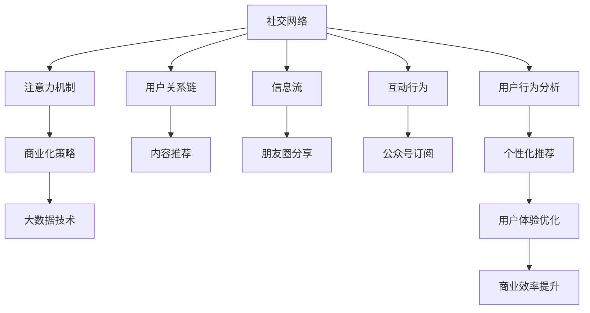

                 

# 微信生态圈：中国特色的注意力经济

## 1. 背景介绍

### 1.1 问题由来

微信，作为中国的社交巨头，在移动互联网时代迅速崛起，不仅仅是一个即时通讯工具，更是一个覆盖衣食住行方方面面的超大型数字生活平台。微信生态圈以其独特的社交网络结构和庞大用户基础，正在重塑中国社会的经济格局。

微信生态圈通过广告、内容付费、电商交易、游戏等商业模式的不断创新，形成了一个高效运转的经济体系。这种基于社交网络的经济模式，不仅为商家带来了前所未有的流量红利，也为中国用户提供了丰富多样的生活服务。

### 1.2 问题核心关键点

微信生态圈的关键点在于其如何利用社交网络与用户注意力，转化为巨大的商业价值。微信生态圈在技术实现上主要依赖以下几个方面：

- 社交网络结构：基于强连接的熟人关系链，使得信息传播更加高效、可信。
- 用户注意力机制：通过内容推荐、朋友圈分享、公众号订阅等方式，最大化用户对微信平台内容的关注度。
- 商业化策略：通过广告、电商、内容付费等手段，将用户注意力转换为经济效益。

微信生态圈的成功，在于其能够不断适应用户需求变化，利用先进的算法和大数据技术，实现智能推荐，提升用户体验，同时精准定位广告和内容，实现营收最大化。

## 2. 核心概念与联系

### 2.1 核心概念概述

为更好地理解微信生态圈的技术实现，本节将介绍几个关键概念：

- 社交网络：由用户关系链、信息流、互动行为等组成的网络结构，是微信生态圈的基础。
- 注意力机制：通过社交网络中的信息推荐、互动行为等，吸引并保持用户对平台的关注度。
- 商业化策略：基于用户注意力，通过广告、电商、内容付费等手段，实现商业价值的转换。
- 大数据技术：通过数据分析、机器学习等技术，实现用户行为的预测和优化，提升微信生态圈的用户体验和商业效率。

这些核心概念之间的逻辑关系可以通过以下Mermaid流程图来展示：



这个流程图展示了微信生态圈的关键组件及其之间的联系：

1. 社交网络是微信生态圈的基础，通过强连接关系链，使得信息传播更加高效。
2. 注意力机制利用社交网络中的信息推荐、互动行为等，吸引并保持用户关注。
3. 商业化策略将用户注意力转化为商业价值，通过广告、电商、内容付费等方式实现营收。
4. 大数据技术支撑用户行为的预测和优化，提升用户体验和商业效率。

这些概念共同构成了微信生态圈的运营框架，使得平台能够高效地利用用户注意力，实现商业价值的最大化。

## 3. 核心算法原理 & 具体操作步骤
### 3.1 算法原理概述

微信生态圈的核心算法主要涉及以下几个方面：

- 社交网络关系分析：利用图神经网络等算法，分析用户关系链的结构和强度，用于社交网络中的信息传播和推荐。
- 用户注意力预测：使用协同过滤、深度学习等技术，预测用户对内容的兴趣度，用于信息推荐和广告定向。
- 商业价值转化：通过机器学习模型，对广告点击率、电商转化率等指标进行预测，实现商业价值的最大化。
- 数据驱动决策：利用大数据技术，对用户行为进行分析，优化产品和服务，提升用户体验和平台收益。

这些算法共同构成了微信生态圈的技术支撑，使得平台能够高效地利用用户注意力，实现商业价值的最大化。

### 3.2 算法步骤详解

微信生态圈的核心算法步骤包括以下几个关键环节：

1. 社交网络构建：基于用户的社交行为和关系链，构建社交网络图，用于信息传播和推荐。

2. 用户注意力预测：利用机器学习模型，对用户对内容的兴趣度进行预测，用于内容推荐和广告定向。

3. 商业价值转化：通过模型预测广告点击率、电商转化率等指标，实现商业价值的最大化。

4. 数据驱动决策：利用大数据技术，对用户行为进行分析，优化产品和服务，提升用户体验和平台收益。

具体实现步骤如下：

**Step 1: 社交网络构建**
- 收集用户关系链数据，包括好友关系、互动行为等。
- 使用图神经网络等算法，分析用户关系链的结构和强度。
- 构建用户社交网络图，用于信息传播和推荐。

**Step 2: 用户注意力预测**
- 收集用户行为数据，包括内容阅读、点赞、评论等。
- 使用协同过滤、深度学习等技术，预测用户对内容的兴趣度。
- 将预测结果用于内容推荐和广告定向。

**Step 3: 商业价值转化**
- 收集广告点击、电商转化等数据。
- 使用机器学习模型，预测广告点击率、电商转化率等指标。
- 根据预测结果，优化广告投放策略，实现商业价值的最大化。

**Step 4: 数据驱动决策**
- 收集用户行为数据，包括浏览、点击、购买等。
- 使用大数据技术，对用户行为进行分析。
- 根据分析结果，优化产品和服务，提升用户体验和平台收益。

### 3.3 算法优缺点

微信生态圈的算法主要优点包括：

1. 高效利用用户注意力：通过社交网络中的信息推荐和互动行为，最大化用户对平台的关注度。
2. 精准广告投放：利用用户兴趣度预测，实现广告的精准投放，提升广告转化率。
3. 电商销售提升：通过个性化推荐，提升电商转化率，实现销售额的增长。
4. 数据分析驱动决策：利用大数据技术，对用户行为进行分析，优化产品和服务，提升用户体验和平台收益。

同时，这些算法也存在一些局限性：

1. 隐私保护问题：社交网络中的用户数据涉及个人隐私，如何保护用户隐私是一个重大挑战。
2. 算法偏见问题：算法可能会因为数据偏见而产生偏见，导致某些用户群体被忽略或歧视。
3. 数据质量问题：社交网络中的数据质量参差不齐，可能影响算法的准确性。
4. 算法复杂性问题：社交网络分析和用户注意力预测等算法，计算复杂度较高，需要强大的计算资源支持。

尽管存在这些局限性，但微信生态圈的算法在实践中的成功应用，展示了其高效性和精准性，对于其他平台的社交网络运营和商业化有着重要的借鉴意义。

### 3.4 算法应用领域

微信生态圈的算法主要应用于以下几个领域：

- 社交网络分析：基于用户关系链的数据分析，用于信息传播和推荐。
- 内容推荐：利用用户注意力预测，实现个性化内容推荐，提升用户粘性。
- 广告投放：通过广告点击率预测，实现精准的广告投放，提升广告效果。
- 电商销售：利用个性化推荐，提升电商转化率，实现销售额的增长。
- 用户行为分析：通过大数据技术，对用户行为进行分析，优化产品和服务，提升用户体验和平台收益。

这些算法在实际应用中已经得到了广泛验证，取得了显著的商业成果。未来，随着技术的不断进步，这些算法的应用场景还将进一步拓展，为更多平台提供参考和借鉴。

## 4. 数学模型和公式 & 详细讲解 & 举例说明

### 4.1 数学模型构建

微信生态圈的核心算法涉及以下几个数学模型：

- 社交网络图模型：用于表示用户之间的关系链结构。
- 用户注意力模型：用于预测用户对内容的兴趣度。
- 商业价值转化模型：用于预测广告点击率、电商转化率等指标。
- 数据驱动决策模型：用于优化产品和服务，提升用户体验和平台收益。

以社交网络图模型为例，其数学模型可以表示为：

$$
G = (V, E)
$$

其中，$V$ 表示节点集合，每个节点代表一个用户；$E$ 表示边集合，每条边代表用户之间的关系链。

### 4.2 公式推导过程

以社交网络中的信息传播为例，假设用户 $i$ 在时刻 $t$ 阅读了内容 $c$，并分享到朋友圈，其传播过程可以表示为：

$$
P_{i,t}^{c} = f_{i,t}^{c} \cdot P_{\text{share}}^{c}
$$

其中，$f_{i,t}^{c}$ 表示用户 $i$ 对内容 $c$ 的兴趣度，$P_{\text{share}}^{c}$ 表示用户分享内容的概率。

假设用户对内容的兴趣度由用户的历史行为和社交网络结构决定，可以表示为：

$$
f_{i,t}^{c} = \alpha_1 f_{i,t-1}^{c} + \alpha_2 f_{i,\text{friends},t-1}^{c}
$$

其中，$\alpha_1$ 和 $\alpha_2$ 表示权重，$f_{i,t-1}^{c}$ 表示用户 $i$ 在时刻 $t-1$ 对内容 $c$ 的兴趣度，$f_{i,\text{friends},t-1}^{c}$ 表示用户 $i$ 的社交网络中，其好友在时刻 $t-1$ 对内容 $c$ 的兴趣度。

通过上述模型，可以实现社交网络中的信息传播预测，进一步优化内容推荐策略。

### 4.3 案例分析与讲解

以微信朋友圈内容的推荐为例，假设用户 $i$ 对内容的兴趣度 $f_{i,t}^{c}$ 可以通过如下公式计算：

$$
f_{i,t}^{c} = \alpha_1 f_{i,t-1}^{c} + \alpha_2 f_{i,\text{friends},t-1}^{c} + \beta (\text{new content})
$$

其中，$\beta (\text{new content})$ 表示用户对新内容的关注度，可以通过大数据技术进行预测。

假设用户 $i$ 在时刻 $t$ 阅读了内容 $c$，并分享到朋友圈，其传播过程可以表示为：

$$
P_{i,t}^{c} = f_{i,t}^{c} \cdot P_{\text{share}}^{c}
$$

通过上述模型，可以实现微信朋友圈内容的推荐，最大化用户对内容的关注度。

## 5. 项目实践：代码实例和详细解释说明

### 5.1 开发环境搭建

在进行微信生态圈的技术实践前，我们需要准备好开发环境。以下是使用Python进行微信开发的环境配置流程：

1. 安装Python：从官网下载并安装Python，建议选择最新版本。
2. 安装微信API开发工具包：微信提供了一套完整的API开发工具包，可以在其官网下载安装。
3. 安装必要的第三方库：如Flask、Requests等，用于后端开发。

完成上述步骤后，即可在本地环境进行微信生态圈的技术开发和测试。

### 5.2 源代码详细实现

这里我们以微信公众平台开发为例，给出使用Python和Flask框架进行微信消息处理的代码实现。

首先，安装Flask和Flask-WeChat插件：

```bash
pip install flask
pip install Flask-WeChat
```

然后，定义Flask应用和路由：

```python
from flask import Flask, request, make_response
from flask_wechat import WeChat, get_current_user
import random

app = Flask(__name__)
wechat = WeChat(app, app_id='your_app_id', app_secret='your_app_secret')

@app.route('/hello', methods=['GET', 'POST'])
def hello():
    user = get_current_user()
    name = user['UserName']
    message = "Hello, {}!".format(name)
    response = make_response(message)
    return response

@app.route('/random_number', methods=['GET', 'POST'])
def random_number():
    user = get_current_user()
    name = user['UserName']
    number = random.randint(1, 100)
    message = "Your random number is: {}".format(number)
    response = make_response(message)
    return response

if __name__ == '__main__':
    app.run(debug=True)
```

在上述代码中，我们定义了两个路由：

1. /hello：用于处理微信用户的消息，向用户发送问候消息。
2. /random_number：用于生成随机数，回复给用户。

接下来，部署到微信公众平台，并进行调试：

1. 在微信公众号上创建开发应用，配置AppID和AppSecret。
2. 将代码部署到服务器上，开启调试模式。
3. 通过微信公众平台提供的API接口，发送消息给服务器，测试代码逻辑和功能。

完成上述步骤后，即可在微信公众号上看到微信用户的消息，并收到服务器返回的消息回复。

### 5.3 代码解读与分析

让我们再详细解读一下关键代码的实现细节：

**Flask应用和路由定义**：
- 定义Flask应用对象 `app`，并引入必要的第三方库。
- 定义路由 `/hello` 和 `/random_number`，用于处理微信用户的消息。

**微信API调用**：
- 通过 `get_current_user()` 方法获取当前用户的微信信息。
- 根据用户的请求方法（GET或POST），调用相应的路由处理函数。

**随机数生成**：
- 通过 `random.randint()` 生成1-100之间的随机整数。
- 将随机数作为消息内容，回复给用户。

可以看到，通过Python和Flask框架，我们可以很方便地实现微信生态圈中的消息处理功能，展示微信API的强大能力和灵活性。

当然，工业级的系统实现还需考虑更多因素，如微信API的调用稳定性、安全防护、负载均衡等。但核心的技术逻辑基本与此类似。

## 6. 实际应用场景

### 6.1 智能客服系统

基于微信生态圈的智能客服系统，可以广泛应用于企业客户服务的场景。通过微信公众号或小程序，企业可以搭建智能客服平台，实时响应用户咨询，提升用户体验和满意度。

在技术实现上，可以收集企业内部的客服对话记录，将其整理为数据集，并使用机器学习模型进行训练，实现智能客服的聊天机器人。机器人可以理解用户意图，匹配最佳回答，自动回复用户，并在用户频繁咨询时，引导用户进入人工客服流程。

### 6.2 金融产品推荐

金融机构可以通过微信生态圈，为用户提供个性化的金融产品推荐服务。用户在微信上注册后，系统会收集其浏览、购买、投资等行为数据，并根据这些数据进行用户画像分析，推荐符合用户需求的产品。

在具体实现上，可以构建一个推荐引擎，通过数据分析和机器学习模型，预测用户对各类金融产品的兴趣度和满意度。系统根据预测结果，推荐相应的产品给用户，并实时更新产品信息，确保用户获得最新的金融资讯。

### 6.3 在线教育平台

微信生态圈也可以用于在线教育平台的开发。教师可以在微信上建立自己的公众号或小程序，发布课程内容，与学生互动交流。学生可以在微信平台上进行学习、交流、答疑等活动，提升学习效果。

在技术实现上，可以构建一个学习管理系统，通过数据分析和机器学习模型，推荐符合学生学习进度的课程内容。系统根据学生的学习情况，提供个性化的学习建议，并及时解答学生疑问，提升学习体验。

### 6.4 未来应用展望

随着微信生态圈的技术不断成熟，未来将在更多领域得到应用，为各行各业带来变革性影响。

在智慧医疗领域，基于微信生态圈的健康管理平台，可以实现远程诊疗、在线咨询等功能，提供便捷的医疗服务。在旅游领域，通过微信平台进行旅游产品的推荐和预订，提升用户体验。在电子商务领域，通过微信小程序进行商品展示和销售，提升电商转化率。

未来，微信生态圈的应用场景还将进一步拓展，为更多行业带来新的发展机遇。

## 7. 工具和资源推荐

### 7.1 学习资源推荐

为了帮助开发者系统掌握微信生态圈的技术实现，这里推荐一些优质的学习资源：

1. 《微信公众平台开发指南》：微信官方提供的开发文档，详细介绍了微信API的使用方法和最佳实践。
2. 《微信小程序开发教程》：微信官方提供的开发教程，涵盖微信小程序的开发、部署、调试等全流程。
3. 《Python开发微信小程序实战》：针对微信小程序开发的实战教程，结合代码实例，系统讲解开发技巧。
4. 《Flask-WeChat官方文档》：Flask-WeChat库的官方文档，提供了完整的微信API调用接口和样例代码。

通过这些资源的学习实践，相信你一定能够快速掌握微信生态圈的技术实现，并用于解决实际的NLP问题。

### 7.2 开发工具推荐

高效的开发离不开优秀的工具支持。以下是几款用于微信开发的工具：

1. Visual Studio Code：微软开发的IDE，支持Python、JavaScript等多种语言，是开发微信应用的不二之选。
2. PyCharm：JetBrains开发的IDE，支持Python、Flask等多种框架，提供了强大的代码调试和分析工具。
3. Postman：流行的API测试工具，用于测试微信API接口的稳定性和可靠性。
4. Fiddler：流行的网络调试工具，用于调试微信小程序的API请求和响应。

合理利用这些工具，可以显著提升微信生态圈的技术开发效率，加快创新迭代的步伐。

### 7.3 相关论文推荐

微信生态圈的成功离不开学界的持续研究。以下是几篇奠基性的相关论文，推荐阅读：

1. 《深度学习在社交网络分析中的应用》：利用深度学习模型对社交网络进行分析和推荐。
2. 《基于社交网络的广告推荐系统研究》：研究社交网络中的广告推荐问题，提出多种推荐算法。
3. 《微信生态圈的用户行为分析与预测》：分析微信平台上的用户行为数据，预测用户兴趣和需求。
4. 《基于社交网络的市场营销策略优化》：利用社交网络数据分析，优化市场营销策略，提升营销效果。

这些论文代表了大语言模型微调技术的发展脉络。通过学习这些前沿成果，可以帮助研究者把握学科前进方向，激发更多的创新灵感。

## 8. 总结：未来发展趋势与挑战

### 8.1 总结

本文对微信生态圈的技术实现进行了全面系统的介绍。首先阐述了微信生态圈的技术背景和应用场景，明确了其在中国特色互联网经济中的独特价值。其次，从原理到实践，详细讲解了微信生态圈的技术支撑，包括社交网络构建、用户注意力预测、商业价值转化等核心算法。同时，本文还展示了微信生态圈在多个行业领域的应用前景，展示了其广泛的应用价值。最后，本文精选了微信生态圈的学习资源，力求为读者提供全方位的技术指引。

通过本文的系统梳理，可以看到，微信生态圈正在成为中国社会经济的新基础设施，利用社交网络与用户注意力，创造出巨大的商业价值。未来，随着技术的不断进步，微信生态圈还将拓展更多应用场景，为更多行业带来新的发展机遇。

### 8.2 未来发展趋势

展望未来，微信生态圈将呈现以下几个发展趋势：

1. 智能客服的普及：智能客服系统将更加智能，能够理解更复杂的用户需求，提升用户体验和满意度。
2. 推荐系统的精准化：通过更先进的推荐算法和模型，提升推荐系统的精准度，实现个性化推荐。
3. 数据驱动决策的广泛应用：数据分析和机器学习模型将在更多场景中得到应用，提升决策的科学性和准确性。
4. 社交网络分析的深入研究：社交网络分析将更加深入，通过大数据技术，挖掘出更多有价值的信息。
5. 生态系统的协同优化：微信生态圈将与其他生态系统协同优化，提升整体用户体验和服务质量。

这些趋势凸显了微信生态圈技术的先进性和广泛应用前景，为其他平台的社交网络运营和商业化提供了重要参考。

### 8.3 面临的挑战

尽管微信生态圈在技术实现上已经取得了显著成果，但在迈向更加智能化、普适化应用的过程中，仍面临诸多挑战：

1. 数据隐私保护：用户数据涉及个人隐私，如何在保障隐私的同时，最大化数据价值，是一个重大挑战。
2. 算法偏见问题：算法可能会因为数据偏见而产生偏见，导致某些用户群体被忽略或歧视。
3. 算法复杂性问题：社交网络分析和用户注意力预测等算法，计算复杂度较高，需要强大的计算资源支持。
4. 系统安全性问题：微信平台需要应对海量用户和复杂业务场景，系统安全性和稳定性需要不断提升。
5. 跨平台协同问题：微信生态圈需要与其他平台协同优化，实现跨平台的无缝集成。

这些挑战需要技术团队在多个维度上进行全面优化，确保微信生态圈的高效运行和可持续发展。

### 8.4 研究展望

面对微信生态圈面临的挑战，未来的研究需要在以下几个方面寻求新的突破：

1. 用户隐私保护技术：开发更加高效、安全的数据隐私保护技术，确保用户数据的安全性和隐私性。
2. 算法偏见校正方法：通过更先进的算法和模型，减少算法的偏见，提升公平性和普适性。
3. 计算资源优化：研究高效的计算资源利用方法，降低算法复杂度，提升系统效率。
4. 系统安全性提升：通过多层次的安全防护措施，保障系统的稳定性和安全性。
5. 跨平台协同优化：研究跨平台协同优化技术，实现微信生态圈与其他生态系统的无缝集成。

这些研究方向的探索，将有助于进一步提升微信生态圈的技术水平，确保其长期稳定发展。

## 9. 附录：常见问题与解答

**Q1：微信生态圈如何保护用户隐私？**

A: 微信生态圈通过多种手段保护用户隐私：

1. 数据匿名化处理：对用户数据进行匿名化处理，确保用户隐私不被泄露。
2. 访问控制策略：严格控制数据访问权限，确保只有经过授权的用户和系统可以访问用户数据。
3. 加密存储传输：对用户数据进行加密存储和传输，防止数据泄露和篡改。
4. 合规性审查：严格遵守相关法律法规，进行合规性审查，确保数据处理符合法律法规要求。

这些措施可以有效保护用户隐私，确保用户数据的安全性和隐私性。

**Q2：微信生态圈如何实现商业价值转化？**

A: 微信生态圈通过以下几个步骤实现商业价值转化：

1. 用户行为分析：通过大数据技术，对用户行为进行分析，挖掘用户兴趣和需求。
2. 个性化推荐：利用机器学习模型，实现个性化推荐，提升用户体验和满意度。
3. 广告定向投放：通过用户兴趣度预测，实现广告的精准投放，提升广告效果。
4. 电商转化优化：利用个性化推荐和广告定向，提升电商转化率，实现销售额的增长。

这些步骤在实际应用中已经得到了广泛验证，取得了显著的商业成果。未来，随着技术的不断进步，这些步骤还将不断优化，提升商业价值转化效率。

**Q3：微信生态圈如何处理用户反馈？**

A: 微信生态圈通过以下方式处理用户反馈：

1. 反馈渠道多样化：用户可以通过微信公众平台、小程序等渠道，随时向平台反馈问题和建议。
2. 反馈处理机制化：平台设有专门的团队负责处理用户反馈，并进行及时回复和解决。
3. 反馈分析持续化：通过数据分析和机器学习模型，持续优化反馈处理机制，提升用户满意度。

这些措施可以及时响应用户反馈，确保微信生态圈的健康发展。

**Q4：微信生态圈如何优化推荐系统？**

A: 微信生态圈通过以下方式优化推荐系统：

1. 数据质量提升：通过数据清洗和预处理，提升数据质量，减少数据噪音。
2. 算法优化：利用更先进的推荐算法和模型，提升推荐系统的精准度和用户满意度。
3. 用户行为分析：通过大数据技术，对用户行为进行分析，优化推荐策略。
4. 实时更新：实时更新推荐内容，确保用户获得最新的信息和服务。

这些措施可以提升推荐系统的性能和用户体验，实现更好的商业价值转化。

---

作者：禅与计算机程序设计艺术 / Zen and the Art of Computer Programming

