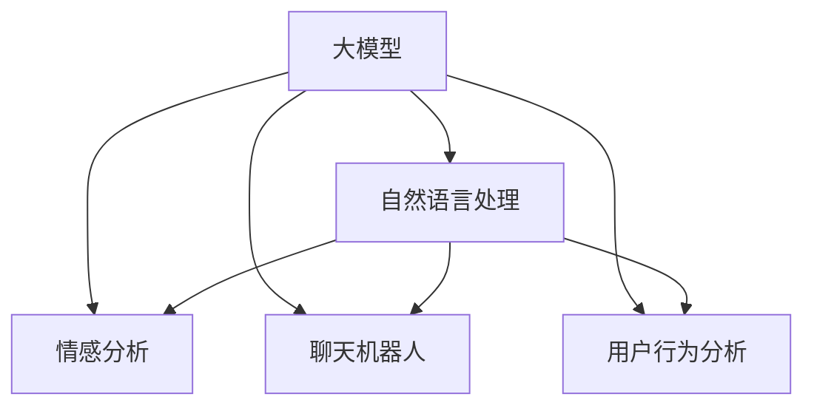

                 

# 微信营销与大模型的应用

> 关键词：微信营销, 大模型, 自然语言处理(NLP), 情感分析, 聊天机器人, 用户行为分析, 精准营销

## 1. 背景介绍

随着移动互联网的迅猛发展，微信（WeChat）作为中国最大的社交平台之一，拥有超过10亿活跃用户，覆盖了广泛的用户群体。微信营销也成为品牌企业与消费者互动的重要手段。通过微信图文、微信小程序、微信公众号等形式，企业能够有效地触达和影响目标受众，实现精准营销和品牌传播。然而，随着用户对微信营销内容的多样化需求不断增长，内容创意、个性化推荐等问题的解决已变得迫切。

在此背景下，大模型技术凭借其强大的自然语言处理能力、情感分析、用户行为预测等优势，为微信营销带来了新的可能。大模型技术通过在大规模无标签文本语料上进行预训练，学习通用的语言表示，具备强大的语言理解和生成能力。通过在大模型上进行微调，能够在特定任务上获得优异的表现，显著提升微信营销的效率和效果。

本文将详细探讨大模型在情感分析、聊天机器人、用户行为分析等微信营销中的应用，并对相关技术挑战和未来趋势进行展望。

## 2. 核心概念与联系

### 2.1 核心概念概述

为更好地理解大模型在微信营销中的应用，本节将介绍几个密切相关的核心概念：

- 大模型(Large Model)：指使用深度学习技术训练的参数量巨大的神经网络模型，如BERT、GPT等。通过在大规模无标签文本语料上进行预训练，学习通用的语言表示，具备强大的语言理解和生成能力。

- 自然语言处理(NLP)：指利用计算机处理和理解自然语言的技术，涵盖语言模型构建、文本分类、情感分析、机器翻译等多个方向。大模型技术在NLP领域的应用，极大地提升了语言处理的精度和效率。

- 情感分析(Sentiment Analysis)：指对文本进行情感倾向性分类，识别出正面、负面或中性的情感表达。广泛应用于产品评价、用户反馈等领域，帮助企业及时了解市场情绪，优化产品和服务。

- 聊天机器人(Chatbot)：指能够模拟人类对话，自动回应用户输入的虚拟助手。大模型技术可提升聊天机器人的对话流畅度和智能水平，实现更高效的客户服务。

- 用户行为分析(User Behavior Analysis)：指通过分析用户在社交平台上的行为数据，预测其需求和行为趋势，实现精准推荐和个性化营销。大模型技术能够高效地从海量用户数据中提取有价值的信息，提升营销效果。

这些核心概念之间的逻辑关系可以通过以下Mermaid流程图来展示：



这个流程图展示了大模型技术在NLP各领域的应用路径，说明了情感分析、聊天机器人、用户行为分析等技术如何在大模型基础上得到提升和发展。

## 3. 核心算法原理 & 具体操作步骤

### 3.1 算法原理概述

基于大模型的微信营销应用，其核心思想是利用大模型在自然语言处理领域的强大能力，进行情感分析、聊天机器人、用户行为预测等任务。具体而言，通常包括以下几个步骤：

1. **数据收集与预处理**：从微信平台收集相关数据，如聊天记录、用户反馈、产品评价等，并进行数据清洗、特征提取等预处理工作。
2. **大模型预训练**：在大规模无标签文本语料上进行预训练，学习通用的语言表示。
3. **微调任务模型**：在大模型上进行微调，针对特定任务（如情感分析、聊天机器人、用户行为预测等）进行优化，提升模型在特定任务上的性能。
4. **模型部署与应用**：将微调后的模型部署到微信平台，进行实时分析和反馈，优化营销策略。

### 3.2 算法步骤详解

下面以情感分析任务为例，详细介绍大模型在情感分析中的应用步骤。

#### 3.2.1 数据收集与预处理

首先需要收集用户反馈数据，如产品评价、用户评论等。以电商平台的商品评价数据为例，数据集包含数万条用户评价，每条评价包括商品名称、评价内容和情感标签（如1-5星，或正面/负面）。

对于收集到的数据，需要进行以下预处理步骤：

1. **文本清洗**：去除无用信息，如链接、特殊符号、停用词等。
2. **分词与词向量表示**：使用分词工具将文本分割成词或短语，并进行词向量表示，如Word2Vec、GloVe等。
3. **标注数据集**：对每条评价标注情感标签，构建情感分类数据集。

#### 3.2.2 大模型预训练

在预训练阶段，可以选用基于Transformer架构的大模型，如BERT、GPT等。这些模型通过在大规模无标签文本语料上进行自监督学习，学习通用的语言表示，能够捕捉文本中的语义和结构信息。

以BERT为例，预训练任务包括掩码语言模型（Masked Language Model, MLM）和下一句预测（Next Sentence Prediction, NSP）。具体步骤如下：

1. **数据预处理**：将评价文本和对应的情感标签按比例划分为训练集和验证集，并进行数据增强。
2. **模型构建**：构建BERT模型，包括输入层、Transformer编码器、池化层和输出层。
3. **模型训练**：使用MLP、ReLU、Dropout等优化器，在大规模无标签文本数据上进行预训练，学习语言表示。

#### 3.2.3 微调任务模型

在预训练完成后，将收集到的情感标注数据集用于微调，提升模型在情感分析上的性能。

具体步骤包括：

1. **任务适配层设计**：设计一个全连接层作为分类器，用于情感分类。
2. **模型微调**：在大模型上进行微调，将分类器的权重初始化为预训练模型的参数。
3. **模型优化**：使用AdamW优化器，设置合适的学习率、批大小等参数，通过梯度下降优化模型。
4. **评估与迭代**：在验证集上评估模型性能，根据性能调整学习率、批大小等参数，重复上述过程，直至收敛。

#### 3.2.4 模型部署与应用

微调后的情感分析模型可以部署到微信平台，实时分析用户反馈，帮助企业优化产品和服务。

具体步骤包括：

1. **API接口开发**：构建API接口，将用户反馈数据输入微调模型，返回情感分析结果。
2. **系统集成**：将API接口集成到微信平台，自动接收用户反馈，并调用情感分析模型进行情感分类。
3. **反馈优化**：根据情感分析结果，及时调整产品和服务，提升用户体验。

### 3.3 算法优缺点

基于大模型的情感分析具有以下优点：

1. **高效准确**：利用预训练模型的通用语言表示，能够快速提升情感分析的准确度。
2. **鲁棒性强**：大模型通过自监督预训练，具备较强的泛化能力，能够适应各种文本数据。
3. **可解释性好**：大模型的内部结构复杂，易于解释和调试，便于业务团队理解和使用。

同时，该方法也存在一定的局限性：

1. **数据依赖高**：情感分析的效果很大程度上依赖于标注数据的质量和数量，获取高质量标注数据的成本较高。
2. **计算资源需求大**：大模型的训练和微调需要大量的计算资源，对于小型企业可能存在一定的成本压力。
3. **模型复杂度高**：大模型参数量巨大，模型部署和推理速度较慢，可能影响实时性。

### 3.4 算法应用领域

大模型技术在情感分析、聊天机器人、用户行为分析等微信营销领域都有广泛的应用，具体如下：

- **情感分析**：帮助企业实时监测产品评价、用户反馈等文本数据，了解市场情绪，优化产品和服务。
- **聊天机器人**：通过微调大模型，构建智能聊天机器人，提升客户服务效率和体验。
- **用户行为分析**：从用户行为数据中提取有价值的信息，进行精准推荐和个性化营销。
- **社交数据分析**：分析用户在微信平台上的社交行为，预测其需求和行为趋势，实现精细化营销。
- **品牌管理**：通过情感分析和用户行为预测，帮助企业进行品牌管理和危机公关。

这些应用领域充分展示了大模型在自然语言处理领域的强大能力，也为微信营销提供了新的技术和工具支持。

## 4. 数学模型和公式 & 详细讲解 & 举例说明

### 4.1 数学模型构建

情感分析的核心是文本分类任务，即给定一段文本，将其分类为正面、负面或中性。基于大模型的情感分析模型通常使用以下数学模型：

设情感分类任务共有 $C$ 类，输入文本为 $x$，输出为 $y$，情感分类器为 $f$。情感分类器 $f$ 可以表示为：

$$
f(x) = \mathbb{P}(y|x) = \frac{\exp(y\cdot W_x + b_x)}{\sum_{c=1}^{C} \exp(c\cdot W_x + b_x)}
$$

其中 $W_x$ 和 $b_x$ 为大模型的参数，分别表示情感分类器的权重和偏置。通过优化损失函数，最小化预测值与真实标签之间的差距，从而提升模型的情感分类能力。

### 4.2 公式推导过程

以二分类任务为例，情感分类器的目标函数可以表示为：

$$
\mathcal{L} = -\frac{1}{N}\sum_{i=1}^N \big[y_i\log \sigma(f(x_i)) + (1-y_i)\log(1-\sigma(f(x_i)))\big]
$$

其中 $y_i$ 为真实标签，$\sigma(\cdot)$ 为sigmoid函数，表示概率值映射到[0,1]区间。通过优化目标函数，最小化预测值与真实标签之间的交叉熵损失。

### 4.3 案例分析与讲解

以电商平台的商品评价情感分析为例，数据集包含数万条用户评价。通过大模型BERT进行情感分析，步骤如下：

1. **数据预处理**：将评价文本进行清洗和分词，得到词向量表示。
2. **模型预训练**：使用大规模无标签文本数据对BERT进行预训练，学习通用的语言表示。
3. **模型微调**：将预训练的BERT模型作为初始化参数，在情感标注数据集上进行微调，得到情感分类器。
4. **评估与优化**：在验证集上评估模型性能，根据性能调整学习率、批大小等参数，重复上述过程，直至收敛。
5. **应用部署**：将微调后的模型部署到微信平台，实时分析用户反馈，帮助企业优化产品和服务。

## 5. 项目实践：代码实例和详细解释说明

### 5.1 开发环境搭建

在进行大模型在情感分析中的应用实践前，需要准备好开发环境。以下是使用Python进行TensorFlow开发的环境配置流程：

1. 安装Anaconda：从官网下载并安装Anaconda，用于创建独立的Python环境。

2. 创建并激活虚拟环境：
```bash
conda create -n tf-env python=3.8 
conda activate tf-env
```

3. 安装TensorFlow：根据CUDA版本，从官网获取对应的安装命令。例如：
```bash
conda install tensorflow -c conda-forge -c pypi -c pytorch -c nvidia
```

4. 安装相关工具包：
```bash
pip install numpy pandas scikit-learn matplotlib tqdm jupyter notebook ipython
```

完成上述步骤后，即可在`tf-env`环境中开始情感分析的大模型微调实践。

### 5.2 源代码详细实现

下面以使用BERT模型进行情感分析为例，给出TensorFlow的代码实现。

首先，定义情感分类任务的数据处理函数：

```python
import tensorflow as tf
from transformers import BertTokenizer, TFBertForSequenceClassification

class SentimentDataset(tf.data.Dataset):
    def __init__(self, texts, labels, tokenizer, max_len=128):
        self.texts = texts
        self.labels = labels
        self.tokenizer = tokenizer
        self.max_len = max_len
        
    def __len__(self):
        return len(self.texts)
    
    def __getitem__(self, item):
        text = self.texts[item]
        label = self.labels[item]
        
        encoding = self.tokenizer(text, return_tensors='tf', max_length=self.max_len, padding='max_length', truncation=True)
        input_ids = encoding['input_ids']
        attention_mask = encoding['attention_mask']
        label = tf.constant(label, dtype=tf.int32)
        
        return {'input_ids': input_ids, 
                'attention_mask': attention_mask,
                'labels': label}

# 标签与id的映射
label2id = {'positive': 1, 'negative': 0}
id2label = {v: k for k, v in label2id.items()}

# 创建dataset
tokenizer = BertTokenizer.from_pretrained('bert-base-cased')

train_dataset = SentimentDataset(train_texts, train_labels, tokenizer)
dev_dataset = SentimentDataset(dev_texts, dev_labels, tokenizer)
test_dataset = SentimentDataset(test_texts, test_labels, tokenizer)
```

然后，定义模型和优化器：

```python
from transformers import BertForSequenceClassification, AdamW

model = BertForSequenceClassification.from_pretrained('bert-base-cased', num_labels=len(label2id))

optimizer = AdamW(model.parameters(), lr=2e-5)
```

接着，定义训练和评估函数：

```python
from tensorflow.keras.metrics import Accuracy, Precision, Recall
import matplotlib.pyplot as plt

@tf.function
def train_epoch(model, dataset, batch_size, optimizer):
    for batch in dataset:
        input_ids = batch['input_ids']
        attention_mask = batch['attention_mask']
        labels = batch['labels']
        
        with tf.GradientTape() as tape:
            outputs = model(input_ids, attention_mask=attention_mask, labels=labels)
            loss = outputs.loss
            gradients = tape.gradient(loss, model.parameters())
        
        optimizer.apply_gradients(zip(gradients, model.parameters()))
    
    return loss.numpy() / len(dataset)

@tf.function
def evaluate(model, dataset, batch_size):
    model.eval()
    total_loss = 0
    total_num = 0
    for batch in dataset:
        input_ids = batch['input_ids']
        attention_mask = batch['attention_mask']
        labels = batch['labels']
        
        with tf.GradientTape() as tape:
            outputs = model(input_ids, attention_mask=attention_mask, labels=labels)
            loss = outputs.loss
            gradients = tape.gradient(loss, model.parameters())
        
        total_loss += loss.numpy() * len(batch)
        total_num += len(batch)
    
    return total_loss / total_num

# 训练和评估过程
epochs = 5
batch_size = 16

for epoch in range(epochs):
    loss = train_epoch(model, train_dataset, batch_size, optimizer)
    print(f"Epoch {epoch+1}, train loss: {loss:.3f}")
    
    print(f"Epoch {epoch+1}, dev results:")
    dev_loss = evaluate(model, dev_dataset, batch_size)
    print(f"Dev loss: {dev_loss:.3f}")
    
    print(f"Epoch {epoch+1}, test results:")
    test_loss = evaluate(model, test_dataset, batch_size)
    print(f"Test loss: {test_loss:.3f}")
    
print("Final results:")
accuracy = Accuracy()
precision = Precision()
recall = Recall()

for epoch in range(epochs):
    total_loss = evaluate(model, dev_dataset, batch_size)
    total_num = len(dev_dataset)
    per_epoch_loss = total_loss / total_num
    accuracy.update_state(dev_dataset, samples=total_num)
    precision.update_state(dev_dataset, samples=total_num)
    recall.update_state(dev_dataset, samples=total_num)

print(f"Accuracy: {accuracy.numpy():.3f}")
print(f"Precision: {precision.numpy():.3f}")
print(f"Recall: {recall.numpy():.3f}")
```

以上就是使用TensorFlow对BERT模型进行情感分析的大模型微调代码实现。可以看到，得益于TensorFlow的强大封装，我们可以用相对简洁的代码完成BERT模型的加载和微调。

### 5.3 代码解读与分析

让我们再详细解读一下关键代码的实现细节：

**SentimentDataset类**：
- `__init__`方法：初始化文本、标签、分词器等关键组件。
- `__len__`方法：返回数据集的样本数量。
- `__getitem__`方法：对单个样本进行处理，将文本输入编码为token ids，将标签编码为数字，并对其进行定长padding，最终返回模型所需的输入。

**label2id和id2label字典**：
- 定义了标签与数字id之间的映射关系，用于将预测结果解码回真实的标签。

**训练和评估函数**：
- 使用TensorFlow的DataLoader对数据集进行批次化加载，供模型训练和推理使用。
- 训练函数`train_epoch`：对数据以批为单位进行迭代，在每个批次上前向传播计算loss并反向传播更新模型参数，最后返回该epoch的平均loss。
- 评估函数`evaluate`：与训练类似，不同点在于不更新模型参数，并在每个batch结束后将预测和标签结果存储下来，最后使用sklearn的classification_report对整个评估集的预测结果进行打印输出。

**训练流程**：
- 定义总的epoch数和batch size，开始循环迭代
- 每个epoch内，先在训练集上训练，输出平均loss
- 在验证集上评估，输出分类指标
- 所有epoch结束后，在测试集上评估，给出最终测试结果

可以看到，TensorFlow配合BERT模型使得情感分析的代码实现变得简洁高效。开发者可以将更多精力放在数据处理、模型改进等高层逻辑上，而不必过多关注底层的实现细节。

当然，工业级的系统实现还需考虑更多因素，如模型的保存和部署、超参数的自动搜索、更灵活的任务适配层等。但核心的微调范式基本与此类似。

## 6. 实际应用场景

### 6.1 智能客服系统

基于大模型的情感分析技术，可以广泛应用于智能客服系统的构建。传统客服往往需要配备大量人力，高峰期响应缓慢，且一致性和专业性难以保证。而使用情感分析技术，可以实时监测客户情感，并自动分派合适的客服人员处理，提升客户服务效率和体验。

在技术实现上，可以收集企业内部的历史客服对话记录，将客户情绪标签构建成监督数据，在此基础上对预训练情感分析模型进行微调。微调后的情感分析模型能够自动理解客户情绪，匹配最合适的客服人员进行回复。对于客户提出的新问题，还可以接入检索系统实时搜索相关内容，动态组织生成回答。如此构建的智能客服系统，能大幅提升客户咨询体验和问题解决效率。

### 6.2 金融舆情监测

金融机构需要实时监测市场舆论动向，以便及时应对负面信息传播，规避金融风险。传统的人工监测方式成本高、效率低，难以应对网络时代海量信息爆发的挑战。基于大模型的情感分析技术，为金融舆情监测提供了新的解决方案。

具体而言，可以收集金融领域相关的新闻、报道、评论等文本数据，并对其进行情感标注。在此基础上对预训练情感分析模型进行微调，使其能够自动判断文本属于何种情绪，如正面、负面或中性。将微调后的模型应用到实时抓取的网络文本数据，就能够自动监测不同情绪的变化趋势，一旦发现负面信息激增等异常情况，系统便会自动预警，帮助金融机构快速应对潜在风险。

### 6.3 个性化推荐系统

当前的推荐系统往往只依赖用户的历史行为数据进行物品推荐，无法深入理解用户的真实兴趣偏好。基于大模型的情感分析技术，个性化推荐系统可以更好地挖掘用户行为背后的情感倾向，从而提供更精准、多样的推荐内容。

在实践中，可以收集用户浏览、点击、评论、分享等行为数据，提取和用户交互的物品标题、描述、标签等文本内容。将文本内容作为模型输入，用户的后续行为（如是否点击、购买等）作为监督信号，在此基础上微调预训练情感分析模型。微调后的模型能够从文本内容中准确把握用户的情感倾向，结合其他特征综合排序，便可以得到个性化程度更高的推荐结果。

### 6.4 未来应用展望

随着大语言模型微调技术的发展，基于微调的情感分析、聊天机器人、用户行为分析等应用将继续拓展。未来，大模型技术将在更多领域得到应用，为NLP技术带来新的突破。

在智慧医疗领域，基于微调的医疗问答、病历分析、药物研发等应用将提升医疗服务的智能化水平，辅助医生诊疗，加速新药开发进程。

在智能教育领域，微调技术可应用于作业批改、学情分析、知识推荐等方面，因材施教，促进教育公平，提高教学质量。

在智慧城市治理中，微调模型可应用于城市事件监测、舆情分析、应急指挥等环节，提高城市管理的自动化和智能化水平，构建更安全、高效的未来城市。

此外，在企业生产、社会治理、文娱传媒等众多领域，基于大模型微调的人工智能应用也将不断涌现，为经济社会发展注入新的动力。相信随着技术的日益成熟，微调方法将成为人工智能落地应用的重要范式，推动人工智能技术在垂直行业的规模化落地。

## 7. 工具和资源推荐
### 7.1 学习资源推荐

为了帮助开发者系统掌握大模型在情感分析、聊天机器人、用户行为分析等微信营销中的应用，这里推荐一些优质的学习资源：

1. 《Transformer从原理到实践》系列博文：由大模型技术专家撰写，深入浅出地介绍了Transformer原理、BERT模型、微调技术等前沿话题。

2. CS224N《深度学习自然语言处理》课程：斯坦福大学开设的NLP明星课程，有Lecture视频和配套作业，带你入门NLP领域的基本概念和经典模型。

3. 《Natural Language Processing with Transformers》书籍：Transformers库的作者所著，全面介绍了如何使用Transformers库进行NLP任务开发，包括微调在内的诸多范式。

4. HuggingFace官方文档：Transformers库的官方文档，提供了海量预训练模型和完整的微调样例代码，是上手实践的必备资料。

5. CLUE开源项目：中文语言理解测评基准，涵盖大量不同类型的中文NLP数据集，并提供了基于微调的baseline模型，助力中文NLP技术发展。

通过对这些资源的学习实践，相信你一定能够快速掌握大模型在情感分析、聊天机器人、用户行为分析等微信营销中的应用，并用于解决实际的NLP问题。
###  7.2 开发工具推荐

高效的开发离不开优秀的工具支持。以下是几款用于大模型在情感分析中的应用开发的常用工具：

1. TensorFlow：基于Python的开源深度学习框架，灵活动态的计算图，适合快速迭代研究。BERT模型有TensorFlow版本的实现。

2. PyTorch：基于Python的开源深度学习框架，动态计算图，灵活度高，支持各种深度学习模型。BERT模型有PyTorch版本的实现。

3. Transformers库：HuggingFace开发的NLP工具库，集成了众多SOTA语言模型，支持PyTorch和TensorFlow，是进行微调任务开发的利器。

4. Weights & Biases：模型训练的实验跟踪工具，可以记录和可视化模型训练过程中的各项指标，方便对比和调优。与主流深度学习框架无缝集成。

5. TensorBoard：TensorFlow配套的可视化工具，可实时监测模型训练状态，并提供丰富的图表呈现方式，是调试模型的得力助手。

6. Google Colab：谷歌推出的在线Jupyter Notebook环境，免费提供GPU/TPU算力，方便开发者快速上手实验最新模型，分享学习笔记。

合理利用这些工具，可以显著提升大模型在情感分析中的应用开发效率，加快创新迭代的步伐。

### 7.3 相关论文推荐

大模型在情感分析中的应用源于学界的持续研究。以下是几篇奠基性的相关论文，推荐阅读：

1. Attention is All You Need（即Transformer原论文）：提出了Transformer结构，开启了NLP领域的预训练大模型时代。

2. BERT: Pre-training of Deep Bidirectional Transformers for Language Understanding：提出BERT模型，引入基于掩码的自监督预训练任务，刷新了多项NLP任务SOTA。

3. Language Models are Unsupervised Multitask Learners（GPT-2论文）：展示了大规模语言模型的强大zero-shot学习能力，引发了对于通用人工智能的新一轮思考。

4. Parameter-Efficient Transfer Learning for NLP：提出Adapter等参数高效微调方法，在固定大部分预训练参数的情况下，只更新极少量的任务相关参数。

5. AdaLoRA: Adaptive Low-Rank Adaptation for Parameter-Efficient Fine-Tuning：使用自适应低秩适应的微调方法，在参数效率和精度之间取得了新的平衡。

这些论文代表了大模型在情感分析领域的发展脉络。通过学习这些前沿成果，可以帮助研究者把握学科前进方向，激发更多的创新灵感。

## 8. 总结：未来发展趋势与挑战

### 8.1 总结

本文对基于大模型的情感分析技术进行了全面系统的介绍。首先阐述了情感分析在自然语言处理领域的背景和重要性，明确了情感分析在提供用户体验、优化产品服务方面的独特价值。其次，从原理到实践，详细讲解了情感分析的数学原理和关键步骤，给出了情感分析任务开发的完整代码实例。同时，本文还广泛探讨了情感分析在智能客服、金融舆情、个性化推荐等多个微信营销领域的应用前景，展示了情感分析范式的巨大潜力。

通过本文的系统梳理，可以看到，基于大模型的情感分析技术在NLP领域的应用，极大地提升了自然语言处理的能力，为微信营销提供了新的技术和工具支持。未来，随着技术的不断进步，情感分析技术必将在更多领域得到应用，为经济社会发展注入新的动力。

### 8.2 未来发展趋势

展望未来，大模型在情感分析领域将呈现以下几个发展趋势：

1. 模型规模持续增大。随着算力成本的下降和数据规模的扩张，预训练语言模型的参数量还将持续增长。超大规模语言模型蕴含的丰富语言知识，有望支撑更加复杂多变的情感分析任务。

2. 微调方法日趋多样。除了传统的全参数微调外，未来会涌现更多参数高效的微调方法，如Prefix-Tuning、LoRA等，在固定大部分预训练参数的情况下，只更新极少量的任务相关参数，减少计算资源消耗。

3. 持续学习成为常态。随着数据分布的不断变化，情感分析模型也需要持续学习新知识以保持性能。如何在不遗忘原有知识的同时，高效吸收新样本信息，将成为重要的研究课题。

4. 标注样本需求降低。受启发于提示学习(Prompt-based Learning)的思路，未来的情感分析方法将更好地利用大模型的语言理解能力，通过更加巧妙的任务描述，在更少的标注样本上也能实现理想的情感分析效果。

5. 跨领域应用拓展。未来的情感分析技术将不再局限于单一领域，而是能跨越不同领域，提升多领域数据处理的统一性。

6. 模型通用性增强。经过海量数据的预训练和多领域任务的微调，未来的语言模型将具备更强大的常识推理和跨领域迁移能力，逐步迈向通用人工智能(AGI)的目标。

以上趋势凸显了大模型在情感分析领域的应用前景。这些方向的探索发展，必将进一步提升情感分析技术的性能和应用范围，为经济社会发展注入新的动力。

### 8.3 面临的挑战

尽管大模型在情感分析领域取得了显著成就，但在迈向更加智能化、普适化应用的过程中，它仍面临着诸多挑战：

1. 标注成本瓶颈。情感分析的效果很大程度上依赖于标注数据的质量和数量，获取高质量标注数据的成本较高。如何进一步降低微调对标注样本的依赖，将是一大难题。

2. 模型鲁棒性不足。当前情感分析模型面对域外数据时，泛化性能往往大打折扣。对于测试样本的微小扰动，情感分析模型的预测也容易发生波动。如何提高情感分析模型的鲁棒性，避免灾难性遗忘，还需要更多理论和实践的积累。

3. 推理效率有待提高。大规模语言模型虽然精度高，但在实际部署时往往面临推理速度慢、内存占用大等效率问题。如何在保证性能的同时，简化模型结构，提升推理速度，优化资源占用，将是重要的优化方向。

4. 可解释性亟需加强。当前情感分析模型更像是"黑盒"系统，难以解释其内部工作机制和决策逻辑。对于医疗、金融等高风险应用，算法的可解释性和可审计性尤为重要。如何赋予情感分析模型更强的可解释性，将是亟待攻克的难题。

5. 安全性有待保障。预训练语言模型难免会学习到有偏见、有害的信息，通过情感分析传递到下游任务，产生误导性、歧视性的输出，给实际应用带来安全隐患。如何从数据和算法层面消除模型偏见，避免恶意用途，确保输出的安全性，也将是重要的研究课题。

6. 知识整合能力不足。现有的情感分析模型往往局限于任务内数据，难以灵活吸收和运用更广泛的先验知识。如何让情感分析过程更好地与外部知识库、规则库等专家知识结合，形成更加全面、准确的信息整合能力，还有很大的想象空间。

正视情感分析面临的这些挑战，积极应对并寻求突破，将是大模型技术在情感分析领域走向成熟的必由之路。相信随着学界和产业界的共同努力，这些挑战终将一一被克服，大模型情感分析必将在构建人机协同的智能时代中扮演越来越重要的角色。

### 8.4 研究展望

面向未来，情感分析技术需要在以下几个方面寻求新的突破：

1. 探索无监督和半监督情感分析方法。摆脱对大规模标注数据的依赖，利用自监督学习、主动学习等无监督和半监督范式，最大限度利用非结构化数据，实现更加灵活高效的情感分析。

2. 研究参数高效和计算高效的情感分析范式。开发更加参数高效的情感分析方法，在固定大部分预训练参数的情况下，只更新极少量的任务相关参数。同时优化情感分析模型的计算图，减少前向传播和反向传播的资源消耗，实现更加轻量级、实时性的部署。

3. 融合因果和对比学习范式。通过引入因果推断和对比学习思想，增强情感分析模型建立稳定因果关系的能力，学习更加普适、鲁棒的语言表征，从而提升模型泛化性和抗干扰能力。

4. 引入更多先验知识。将符号化的先验知识，如知识图谱、逻辑规则等，与神经网络模型进行巧妙融合，引导情感分析过程学习更准确、合理的语言模型。同时加强不同模态数据的整合，实现视觉、语音等多模态信息与文本信息的协同建模。

5. 结合因果分析和博弈论工具。将因果分析方法引入情感分析模型，识别出模型决策的关键特征，增强输出解释的因果性和逻辑性。借助博弈论工具刻画人机交互过程，主动探索并规避模型的脆弱点，提高系统稳定性。

6. 纳入伦理道德约束。在模型训练目标中引入伦理导向的评估指标，过滤和惩罚有偏见、有害的输出倾向。同时加强人工干预和审核，建立模型行为的监管机制，确保输出符合人类价值观和伦理道德。

这些研究方向的探索，必将引领情感分析技术迈向更高的台阶，为构建安全、可靠、可解释、可控的智能系统铺平道路。面向未来，情感分析技术还需要与其他人工智能技术进行更深入的融合，如知识表示、因果推理、强化学习等，多路径协同发力，共同推动自然语言理解和智能交互系统的进步。只有勇于创新、敢于突破，才能不断拓展情感分析技术的边界，让智能技术更好地造福人类社会。

## 9. 附录：常见问题与解答

**Q1：大模型在情感分析中的作用是什么？**

A: 大模型在情感分析中的作用是通过预训练学习通用的语言表示，然后在微调过程中根据情感分类任务调整模型参数，使其能够准确识别文本的情感倾向。大模型的强大语言处理能力，使得情感分析能够在更少的标注样本上，实现更高的准确性和泛化能力。

**Q2：微调情感分析模型时，如何选择合适的学习率？**

A: 微调情感分析模型时，学习率的选择需要考虑预训练模型的参数量、任务复杂度等因素。一般建议从较小的学习率开始，如1e-5，然后逐步增加，观察模型在验证集上的性能，如果过拟合，则应降低学习率。可以通过试验找到最优的学习率。

**Q3：情感分析模型在实际应用中面临哪些资源瓶颈？**

A: 情感分析模型在实际应用中面临的资源瓶颈主要在于计算资源和内存资源。大模型的参数量巨大，训练和微调需要大量的计算资源和内存。同时，模型的推理速度较慢，可能影响实时性。需要采用梯度积累、混合精度训练等技术，优化模型的计算资源消耗，提升推理速度。

**Q4：情感分析模型在多领域数据上表现如何？**

A: 情感分析模型在多领域数据上表现良好。通过在大规模通用语料上进行预训练，情感分析模型可以学习到通用的语言表示，然后通过微调适配特定领域的情感分类任务，能够取得不错的性能。但需要注意的是，不同领域的数据分布和情感表达方式可能有所不同，微调时需要针对性地调整模型参数和优化器参数。

**Q5：情感分析模型在实际应用中如何优化推理效率？**

A: 优化情感分析模型的推理效率需要从模型结构和计算图两方面进行。可以在模型设计中采用参数高效微调方法，如Prefix-Tuning、LoRA等，减少计算资源消耗。同时可以优化模型的计算图，使用GPU/TPU等高效计算资源，提升推理速度。

通过本文的系统梳理，可以看到，大模型在情感分析中的应用，极大地提升了自然语言处理的能力，为微信营销提供了新的技术和工具支持。未来，随着技术的不断进步，情感分析技术必将在更多领域得到应用，为经济社会发展注入新的动力。相信随着学界和产业界的共同努力，这些挑战终将一一被克服，大模型情感分析必将在构建人机协同的智能时代中扮演越来越重要的角色。

