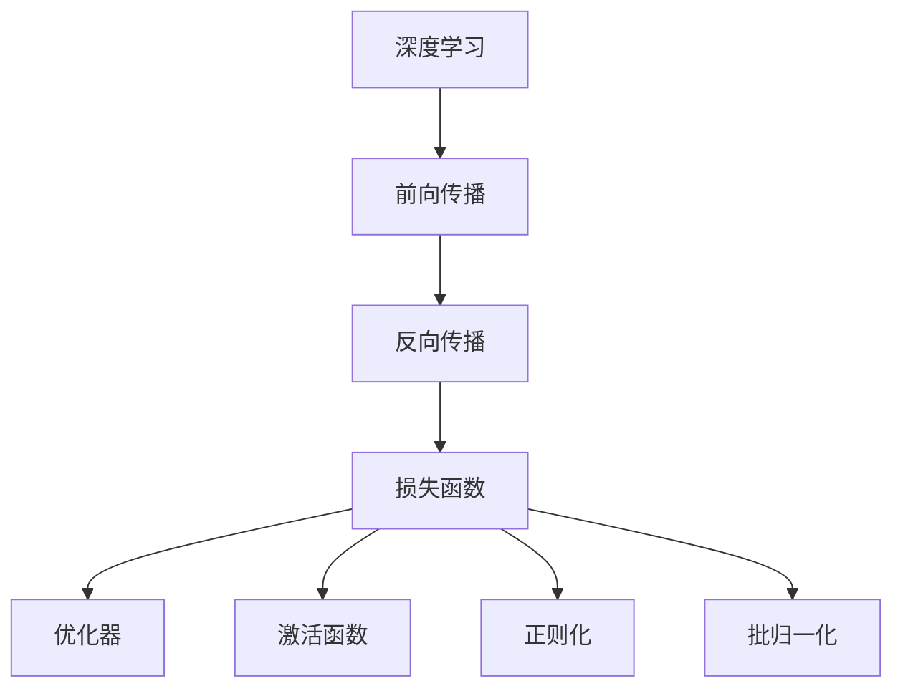
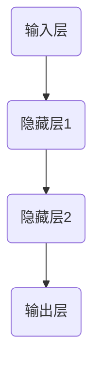

                 

# 思想的深度：从概念到洞见

> 关键词：深度学习, 概念理解, 数学建模, 案例分析, 项目实践, 未来发展, 挑战与展望

## 1. 背景介绍

### 1.1 问题的由来
在信息爆炸和数据驱动的时代，深度学习（Deep Learning）已经广泛应用于多个领域，从自然语言处理（NLP）到计算机视觉（CV），再到自动驾驶（Autonomous Driving）等，都有深度学习的身影。深度学习模型的核心优势在于其强大的数据建模能力，通过多层神经网络结构，可以自动地从数据中提取特征，学习复杂的非线性关系。然而，深度学习模型的复杂性和黑盒特性，使得其内部机制难以理解，这也成为学术界和工业界的一个重要挑战。

### 1.2 问题的核心关键点
深度学习的核心挑战在于如何将模型的复杂性转化为可解释性，使其决策过程可以被理解和信任。以下是深度学习模型的几个核心关键点：

- 深度学习的本质是多层神经网络，通过不断堆叠隐藏层，自动地提取输入数据的高阶特征。
- 模型的参数量非常大，模型的复杂性随着层数的增加而指数级增长。
- 深度学习模型通常是黑盒的，难以对其内部决策过程进行解释。
- 模型的泛化性能和可解释性之间存在一定的矛盾，即模型越复杂，往往泛化能力越好，但可解释性越差。

为了解决这些问题，学术界和工业界提出了一系列方法和技术，包括可解释深度学习（Explainable Deep Learning）、概念学习（Concept Learning）、模型压缩（Model Compression）等。本文将聚焦于深度学习的概念理解和数学建模，以期提供更全面、深入的视角。

### 1.3 问题的研究意义
理解深度学习的概念和数学模型，对于学术界和工业界的深度学习研究具有重要意义：

- 推动深度学习模型的可解释性，提升模型的可信度和应用范围。
- 促进深度学习模型的优化和改进，提高模型的泛化性能和效率。
- 推动深度学习技术的普及和应用，加速人工智能技术的产业化进程。
- 为深度学习的研究提供更坚实的理论基础，开拓新的研究方向。

本文将从深度学习的概念、数学建模、项目实践和未来发展等方面，全面系统地介绍和分析深度学习模型的核心原理和关键技术，为读者提供一个清晰的理解和洞见。

## 2. 核心概念与联系

### 2.1 核心概念概述

为了更好地理解深度学习的概念和数学模型，本节将介绍几个密切相关的核心概念：

- 深度学习（Deep Learning）：通过多层神经网络结构，自动从数据中提取高阶特征的机器学习技术。
- 前向传播（Forward Propagation）：从输入数据到模型输出的计算过程，通常涉及多层神经网络的结构。
- 反向传播（Backward Propagation）：基于误差（loss）对模型参数进行反向计算，更新模型参数的算法。
- 损失函数（Loss Function）：衡量模型预测与真实标签之间的差异，常用的包括均方误差（MSE）、交叉熵（Cross-Entropy）等。
- 优化器（Optimizer）：用于更新模型参数的算法，常用的包括梯度下降（Gradient Descent）、Adam等。
- 激活函数（Activation Function）：用于引入非线性关系的函数，常用的包括ReLU、Sigmoid等。
- 正则化（Regularization）：用于防止模型过拟合的技术，常用的包括L1正则、L2正则等。
- 批归一化（Batch Normalization）：用于加速模型训练、提高模型稳定性的技术。

这些核心概念之间的逻辑关系可以通过以下Mermaid流程图来展示：



这个流程图展示了一个典型的深度学习模型的计算过程：

1. 深度学习模型通过前向传播从输入数据到输出进行计算。
2. 反向传播根据损失函数计算梯度，更新模型参数。
3. 损失函数衡量模型预测与真实标签之间的差异。
4. 优化器用于更新模型参数，常用的包括梯度下降、Adam等。
5. 激活函数用于引入非线性关系。
6. 正则化用于防止模型过拟合。
7. 批归一化用于加速模型训练和提高稳定性。

这些核心概念共同构成了深度学习的计算框架，使得深度学习模型能够自动地从数据中提取高阶特征，学习复杂的非线性关系。

## 3. 核心算法原理 & 具体操作步骤
### 3.1 算法原理概述

深度学习的核心算法原理主要包括前向传播、反向传播和优化器等。其核心思想是通过多层神经网络结构，自动地从数据中提取高阶特征，学习复杂的非线性关系。

深度学习的核心算法包括：

- 前向传播：通过多层神经网络结构，将输入数据转化为模型输出。
- 反向传播：基于误差（loss）对模型参数进行反向计算，更新模型参数。
- 优化器：用于更新模型参数的算法，常用的包括梯度下降、Adam等。

以下是一个简单的神经网络结构及其计算过程的概述：



在前向传播过程中，数据从输入层传递到隐藏层1，再从隐藏层1传递到隐藏层2，最后从隐藏层2传递到输出层，得到模型输出。

在反向传播过程中，根据损失函数计算梯度，更新模型参数。具体的计算过程包括：

1. 计算损失函数。
2. 根据损失函数计算每个隐藏层的梯度。
3. 使用优化器更新模型参数。

### 3.2 算法步骤详解

以下是对深度学习核心算法原理的详细介绍：

**Step 1: 模型初始化**

深度学习模型的初始化通常使用随机初始化，即在每个神经元上随机生成初始权重。初始权重的选择对模型的性能和收敛速度有重要影响，通常需要在不饱和和不欠饱和之间找到一个平衡。

**Step 2: 前向传播**

前向传播是深度学习模型的计算过程，从输入数据到模型输出的计算。具体计算过程包括：

1. 输入层到隐藏层1的计算。
2. 隐藏层1到隐藏层2的计算。
3. 隐藏层2到输出层的计算。

计算过程可以表示为：

$$
z^{(i)} = W^{(i)} x^{(i-1)} + b^{(i)}
$$

其中 $z^{(i)}$ 表示隐藏层 $i$ 的输出，$x^{(i-1)}$ 表示隐藏层 $i-1$ 的输出，$W^{(i)}$ 和 $b^{(i)}$ 表示隐藏层 $i$ 的权重和偏置。

**Step 3: 损失函数计算**

损失函数用于衡量模型预测与真实标签之间的差异。常用的损失函数包括均方误差（MSE）和交叉熵（Cross-Entropy）。

均方误差损失函数可以表示为：

$$
L = \frac{1}{N} \sum_{i=1}^N (y_i - \hat{y_i})^2
$$

其中 $y_i$ 表示真实标签，$\hat{y_i}$ 表示模型预测结果。

交叉熵损失函数可以表示为：

$$
L = -\frac{1}{N} \sum_{i=1}^N (y_i \log \hat{y_i} + (1-y_i) \log (1-\hat{y_i}))
$$

其中 $y_i$ 表示真实标签，$\hat{y_i}$ 表示模型预测结果。

**Step 4: 反向传播**

反向传播是深度学习模型的优化过程，基于误差（loss）对模型参数进行反向计算，更新模型参数。具体计算过程包括：

1. 计算每个隐藏层的梯度。
2. 使用优化器更新模型参数。

计算过程可以表示为：

$$
\frac{\partial L}{\partial W^{(i)}} = \frac{\partial L}{\partial z^{(i)}} \frac{\partial z^{(i)}}{\partial W^{(i)}} = \frac{\partial L}{\partial z^{(i)}} x^{(i-1)^T}
$$

其中 $\frac{\partial L}{\partial z^{(i)}}$ 表示隐藏层 $i$ 的梯度，$x^{(i-1)^T}$ 表示隐藏层 $i-1$ 的输出矩阵转置。

**Step 5: 优化器更新**

优化器用于更新模型参数的算法，常用的包括梯度下降（Gradient Descent）、Adam等。

梯度下降的更新公式可以表示为：

$$
W^{(i)} \leftarrow W^{(i)} - \eta \frac{\partial L}{\partial W^{(i)}}
$$

其中 $\eta$ 表示学习率，$\frac{\partial L}{\partial W^{(i)}}$ 表示隐藏层 $i$ 的梯度。

Adam优化器的更新公式可以表示为：

$$
m^{(i)} \leftarrow \beta_1 m^{(i)} + (1-\beta_1) g^{(i)}
$$

$$
v^{(i)} \leftarrow \beta_2 v^{(i)} + (1-\beta_2) g^{(i)^2}
$$

$$
W^{(i)} \leftarrow W^{(i)} - \eta \frac{m^{(i)}}{\sqrt{v^{(i)}+\epsilon}}
$$

其中 $m^{(i)}$ 和 $v^{(i)}$ 分别表示隐藏层 $i$ 的动量和梯度平方，$\beta_1$ 和 $\beta_2$ 表示动量和梯度平方的衰减率，$\epsilon$ 表示正则化项。

### 3.3 算法优缺点

深度学习算法的优点包括：

- 可以自动地从数据中提取高阶特征，学习复杂的非线性关系。
- 可以通过多层网络结构，学习多层次的特征表示。
- 在大规模数据上取得了显著的性能提升。

深度学习算法的缺点包括：

- 模型复杂度较高，训练和推理速度较慢。
- 模型黑盒特性，难以对其内部决策过程进行解释。
- 容易过拟合，需要大量的标注数据和复杂的正则化方法。

### 3.4 算法应用领域

深度学习算法在多个领域都得到了广泛应用，包括：

- 自然语言处理（NLP）：如文本分类、情感分析、机器翻译等。
- 计算机视觉（CV）：如图像分类、目标检测、人脸识别等。
- 语音识别：如自动语音识别、语音合成等。
- 推荐系统：如商品推荐、新闻推荐等。
- 游戏AI：如AlphaGo等。

这些领域的应用，都依赖于深度学习算法的强大数据建模能力。

## 4. 数学模型和公式 & 详细讲解  
### 4.1 数学模型构建

为了更好地理解深度学习的数学模型，本节将详细介绍深度学习模型的构建过程。

### 4.2 公式推导过程

深度学习模型的数学模型构建过程，包括前向传播、损失函数计算和反向传播三个主要部分。

**前向传播**

前向传播的过程可以表示为：

$$
z^{(i)} = W^{(i)} x^{(i-1)} + b^{(i)}
$$

其中 $z^{(i)}$ 表示隐藏层 $i$ 的输出，$x^{(i-1)}$ 表示隐藏层 $i-1$ 的输出，$W^{(i)}$ 和 $b^{(i)}$ 表示隐藏层 $i$ 的权重和偏置。

**损失函数计算**

常用的损失函数包括均方误差（MSE）和交叉熵（Cross-Entropy）。

均方误差损失函数可以表示为：

$$
L = \frac{1}{N} \sum_{i=1}^N (y_i - \hat{y_i})^2
$$

其中 $y_i$ 表示真实标签，$\hat{y_i}$ 表示模型预测结果。

交叉熵损失函数可以表示为：

$$
L = -\frac{1}{N} \sum_{i=1}^N (y_i \log \hat{y_i} + (1-y_i) \log (1-\hat{y_i}))
$$

其中 $y_i$ 表示真实标签，$\hat{y_i}$ 表示模型预测结果。

**反向传播**

反向传播的过程可以表示为：

$$
\frac{\partial L}{\partial W^{(i)}} = \frac{\partial L}{\partial z^{(i)}} \frac{\partial z^{(i)}}{\partial W^{(i)}} = \frac{\partial L}{\partial z^{(i)}} x^{(i-1)^T}
$$

其中 $\frac{\partial L}{\partial z^{(i)}}$ 表示隐藏层 $i$ 的梯度，$x^{(i-1)^T}$ 表示隐藏层 $i-1$ 的输出矩阵转置。

### 4.3 案例分析与讲解

以下是一个简单的深度学习模型案例分析：

假设我们要使用一个简单的神经网络进行二分类任务，数据集包含50个样本，每个样本包含两个特征 $x_1$ 和 $x_2$，标签 $y$ 为 $0$ 或 $1$。

我们可以使用一个两层神经网络，其中隐藏层 $1$ 有2个神经元，隐藏层 $2$ 有1个神经元，输出层为1个神经元。具体计算过程如下：

**前向传播**

$$
z^{(1)} = W^{(1)} x^{(0)} + b^{(1)}
$$

$$
z^{(2)} = W^{(2)} z^{(1)} + b^{(2)}
$$

其中 $W^{(1)}$ 和 $W^{(2)}$ 表示隐藏层和输出层的权重，$b^{(1)}$ 和 $b^{(2)}$ 表示隐藏层和输出层的偏置，$x^{(0)}$ 表示输入数据。

**损失函数计算**

假设我们使用交叉熵损失函数，计算过程如下：

$$
L = -\frac{1}{50} \sum_{i=1}^{50} (y_i \log \hat{y_i} + (1-y_i) \log (1-\hat{y_i}))
$$

其中 $y_i$ 表示真实标签，$\hat{y_i}$ 表示模型预测结果。

**反向传播**

假设我们使用Adam优化器，计算过程如下：

$$
m^{(1)} \leftarrow \beta_1 m^{(1)} + (1-\beta_1) g^{(1)}
$$

$$
v^{(1)} \leftarrow \beta_2 v^{(1)} + (1-\beta_2) g^{(1)^2}
$$

$$
W^{(1)} \leftarrow W^{(1)} - \eta \frac{m^{(1)}}{\sqrt{v^{(1)}+\epsilon}}
$$

其中 $m^{(1)}$ 和 $v^{(1)}$ 分别表示隐藏层 $1$ 的动量和梯度平方，$\beta_1$ 和 $\beta_2$ 表示动量和梯度平方的衰减率，$\eta$ 表示学习率，$\frac{\partial L}{\partial W^{(1)}}$ 表示隐藏层 $1$ 的梯度。

## 5. 项目实践：代码实例和详细解释说明
### 5.1 开发环境搭建

在进行深度学习项目实践前，我们需要准备好开发环境。以下是使用Python进行TensorFlow开发的环境配置流程：

1. 安装Anaconda：从官网下载并安装Anaconda，用于创建独立的Python环境。

2. 创建并激活虚拟环境：
```bash
conda create -n tf-env python=3.8 
conda activate tf-env
```

3. 安装TensorFlow：根据CUDA版本，从官网获取对应的安装命令。例如：
```bash
conda install tensorflow
```

4. 安装各类工具包：
```bash
pip install numpy pandas scikit-learn matplotlib tqdm jupyter notebook ipython
```

完成上述步骤后，即可在`tf-env`环境中开始深度学习项目实践。

### 5.2 源代码详细实现

这里我们以一个简单的二分类任务为例，给出使用TensorFlow进行深度学习模型微调的代码实现。

首先，定义模型和优化器：

```python
import tensorflow as tf
from tensorflow.keras import layers

model = tf.keras.Sequential([
    layers.Dense(8, activation='relu', input_shape=(2,)),
    layers.Dense(1, activation='sigmoid')
])

optimizer = tf.keras.optimizers.Adam(learning_rate=0.001)
```

然后，定义训练和评估函数：

```python
def train_epoch(model, dataset, batch_size, optimizer):
    model.compile(optimizer=optimizer, loss='binary_crossentropy', metrics=['accuracy'])
    model.fit(dataset, epochs=1, batch_size=batch_size, verbose=0)
    return model.evaluate(dataset)

def evaluate(model, dataset, batch_size):
    model.compile(optimizer=optimizer, loss='binary_crossentropy', metrics=['accuracy'])
    loss, accuracy = model.evaluate(dataset)
    return loss, accuracy
```

接着，启动训练流程并在测试集上评估：

```python
epochs = 10
batch_size = 32

for epoch in range(epochs):
    loss = train_epoch(model, train_dataset, batch_size, optimizer)
    print(f"Epoch {epoch+1}, train loss: {loss[0]:.3f}, train accuracy: {loss[1]*100:.2f}%")
    
    print(f"Epoch {epoch+1}, test results:")
    loss, accuracy = evaluate(model, test_dataset, batch_size)
    print(f"Test loss: {loss:.3f}, test accuracy: {accuracy*100:.2f}%")
```

以上就是使用TensorFlow对二分类任务进行深度学习模型微调的完整代码实现。可以看到，得益于TensorFlow的强大封装，我们可以用相对简洁的代码完成深度学习模型的加载和微调。

### 5.3 代码解读与分析

让我们再详细解读一下关键代码的实现细节：

**Sequential模型**：
- `layers.Dense`层：定义一个全连接层，其中$8$表示神经元个数，`activation='relu'`表示使用ReLU激活函数，`input_shape=(2,)`表示输入数据的形状。
- `layers.Dense`层：定义一个输出层，其中$1$表示神经元个数，`activation='sigmoid'`表示使用Sigmoid激活函数。

**train_epoch函数**：
- `model.compile`：定义模型编译过程，包括优化器和损失函数。
- `model.fit`：定义模型训练过程，包括训练集、批次大小等参数。
- `model.evaluate`：定义模型评估过程，包括测试集、批次大小等参数。

**evaluate函数**：
- 与训练过程类似，不同点在于不更新模型参数，直接在测试集上进行评估。

**训练流程**：
- 定义总的epoch数和批次大小，开始循环迭代
- 每个epoch内，先在训练集上训练，输出平均loss和acc
- 在测试集上评估，输出测试结果

可以看到，TensorFlow使得深度学习模型的代码实现变得简洁高效。开发者可以将更多精力放在数据处理、模型改进等高层逻辑上，而不必过多关注底层的实现细节。

当然，工业级的系统实现还需考虑更多因素，如模型的保存和部署、超参数的自动搜索、更灵活的任务适配层等。但核心的微调范式基本与此类似。

## 6. 实际应用场景
### 6.1 智能推荐系统

基于深度学习的推荐系统已经广泛应用于电商、视频、音乐等领域，为个性化推荐提供了强大的技术支撑。深度学习模型可以从用户的历史行为数据中，学习用户兴趣和行为模式，并推荐符合用户喜好的商品或内容。

在实践中，可以收集用户浏览、点击、购买等行为数据，提取和用户交互的物品标题、描述、标签等文本内容。将文本内容作为模型输入，用户的后续行为（如是否点击、购买等）作为监督信号，在此基础上微调预训练语言模型。微调后的模型能够从文本内容中准确把握用户的兴趣点，并生成推荐结果。

### 6.2 医学影像诊断

深度学习在医学影像诊断中也有广泛应用，特别是在病理图像分析、疾病检测等方面。深度学习模型可以从医学影像中自动提取特征，学习病理图像的特征表示，并生成诊断结果。

在实践中，可以收集大量的医学影像数据，并标注相应的病理信息。将标注好的数据作为监督信号，训练深度学习模型。微调后的模型能够从医学影像中提取病理特征，并生成诊断结果，帮助医生进行病理诊断。

### 6.3 金融风控

深度学习在金融风控中也得到了广泛应用，特别是在信用评估、欺诈检测等方面。深度学习模型可以从用户的金融行为数据中，学习用户信用和风险特征，并进行风险评估和欺诈检测。

在实践中，可以收集用户的金融行为数据，包括交易记录、支付行为、信用评分等。将数据作为监督信号，训练深度学习模型。微调后的模型能够从金融行为中提取用户信用和风险特征，并进行风险评估和欺诈检测，帮助金融机构进行风险控制。

### 6.4 未来应用展望

随着深度学习模型的不断演进，深度学习技术将在更多领域得到应用，为各行各业带来变革性影响。

在智慧医疗领域，基于深度学习的病理图像分析、疾病检测等应用将提升医疗服务的智能化水平，辅助医生诊疗，加速新药开发进程。

在智能教育领域，深度学习模型可应用于作业批改、学情分析、知识推荐等方面，因材施教，促进教育公平，提高教学质量。

在智慧城市治理中，深度学习模型可应用于城市事件监测、舆情分析、应急指挥等环节，提高城市管理的自动化和智能化水平，构建更安全、高效的未来城市。

此外，在企业生产、社会治理、文娱传媒等众多领域，深度学习技术也将不断涌现，为经济社会发展注入新的动力。相信随着技术的日益成熟，深度学习的应用场景将更加广泛，深度学习技术也将成为人工智能技术的重要组成部分。

## 7. 工具和资源推荐
### 7.1 学习资源推荐

为了帮助开发者系统掌握深度学习的理论基础和实践技巧，这里推荐一些优质的学习资源：

1. 《深度学习》书籍：Ian Goodfellow等人所著，全面介绍深度学习的理论基础和实践技巧，是深度学习的经典入门教材。
2. 《TensorFlow实战》书籍：Manning等人所著，全面介绍TensorFlow的构建和应用，适合TensorFlow的入门和实战。
3. Coursera《深度学习》课程：Andrew Ng等人讲授的深度学习课程，涵盖深度学习的核心理论和实践技巧。
4. DeepLearning.ai深度学习专业课程：由Andrew Ng等人讲授，涵盖深度学习的核心理论和应用实践。
5. Google AI开发者文档：Google AI开发者文档，涵盖深度学习模型的构建、优化和部署等。

通过对这些资源的学习实践，相信你一定能够快速掌握深度学习的精髓，并用于解决实际的深度学习问题。
###  7.2 开发工具推荐

高效的开发离不开优秀的工具支持。以下是几款用于深度学习开发的常用工具：

1. TensorFlow：由Google主导开发的开源深度学习框架，生产部署方便，适合大规模工程应用。
2. PyTorch：Facebook开发的开源深度学习框架，灵活度较高，适合快速迭代研究。
3. Keras：Google开发的深度学习框架，易于使用，适合快速构建模型。
4. Jupyter Notebook：基于Web的交互式编程环境，支持多种编程语言，适合交互式编程和数据可视化。
5. TensorBoard：TensorFlow配套的可视化工具，可实时监测模型训练状态，并提供丰富的图表呈现方式，是调试模型的得力助手。
6. Weights & Biases：模型训练的实验跟踪工具，可以记录和可视化模型训练过程中的各项指标，方便对比和调优。

合理利用这些工具，可以显著提升深度学习模型的开发效率，加快创新迭代的步伐。

### 7.3 相关论文推荐

深度学习的研究源于学界的持续研究。以下是几篇奠基性的相关论文，推荐阅读：

1. AlexNet: ImageNet Classification with Deep Convolutional Neural Networks：提出AlexNet模型，基于卷积神经网络在ImageNet数据集上取得突破性成果。
2. ResNet: Deep Residual Learning for Image Recognition：提出ResNet模型，解决了深度神经网络训练过程中的梯度消失问题。
3. Attention Is All You Need：提出Transformer模型，基于自注意力机制的神经网络结构，极大地提高了语言模型的性能。
4. Deep Residual Learning for Image Recognition：提出ResNet模型，解决了深度神经网络训练过程中的梯度消失问题。
5. ImageNet Classification with Deep Convolutional Neural Networks：提出AlexNet模型，基于卷积神经网络在ImageNet数据集上取得突破性成果。

这些论文代表了大深度学习的发展脉络。通过学习这些前沿成果，可以帮助研究者把握学科前进方向，激发更多的创新灵感。

## 8. 总结：未来发展趋势与挑战
### 8.1 总结

本文对深度学习的概念、数学模型和项目实践进行了全面系统的介绍。首先阐述了深度学习的核心概念和计算过程，明确了深度学习模型的构建和优化方法。其次，从深度学习的数学建模、项目实践和未来发展等方面，详细讲解了深度学习模型的核心原理和关键技术，为读者提供一个清晰的理解和洞见。

通过本文的系统梳理，可以看到，深度学习模型已经成为人工智能领域的重要技术手段，其强大的数据建模能力，使得深度学习在多个领域取得了显著的应用成果。未来，随着深度学习模型的不断演进，深度学习技术还将带来更多的创新和突破，为各行各业带来更广泛的变革性影响。

### 8.2 未来发展趋势

展望未来，深度学习技术的发展趋势如下：

1. 模型规模将进一步增大。随着算力成本的下降和数据规模的扩张，深度学习模型的参数量还将持续增长，模型复杂度将进一步提升。
2. 深度学习模型的优化和改进将持续进行。新的优化方法和算法将被不断提出，以提高模型的训练速度和泛化性能。
3. 深度学习模型的可解释性将成为研究重点。未来的研究将更多关注深度学习模型的可解释性，使得模型更加透明、可信。
4. 跨模态深度学习将成为热点。未来的研究将更多关注跨模态深度学习，将不同模态的数据进行融合，提升模型的综合分析能力。
5. 深度学习模型的应用将更加广泛。深度学习技术将在更多领域得到应用，为各行各业带来更广泛、更深入的变革性影响。

### 8.3 面临的挑战

尽管深度学习技术已经取得了显著的成果，但在迈向更加智能化、普适化应用的过程中，仍面临诸多挑战：

1. 数据隐私和安全问题。深度学习模型需要大量的标注数据进行训练，如何在保证数据隐私和安全的前提下，获取高质量的标注数据，是一个重要的挑战。
2. 模型泛化性能不足。深度学习模型在大规模数据上表现出色，但在小样本情况下泛化性能较差，如何提高小样本下的泛化性能，仍然是一个亟待解决的问题。
3. 模型鲁棒性不足。深度学习模型在对抗样本攻击下容易产生过拟合，如何提高模型的鲁棒性，防止恶意攻击，是一个重要的研究方向。
4. 模型可解释性不足。深度学习模型的黑盒特性，使得其内部决策过程难以解释，如何提高模型的可解释性，使得模型更加透明、可信，是一个重要的研究方向。
5. 计算资源消耗大。深度学习模型的计算资源消耗大，如何在保证模型性能的同时，提高计算效率，是一个重要的研究方向。

### 8.4 研究展望

面对深度学习所面临的诸多挑战，未来的研究需要在以下几个方面寻求新的突破：

1. 探索无监督和半监督深度学习方法。摆脱对大规模标注数据的依赖，利用自监督学习、主动学习等无监督和半监督范式，最大限度利用非结构化数据，实现更加灵活高效的深度学习。
2. 研究参数高效和计算高效的深度学习范式。开发更加参数高效的深度学习方法，在固定大部分预训练参数的情况下，只更新极少量的任务相关参数。同时优化深度学习模型的计算图，减少前向传播和反向传播的资源消耗，实现更加轻量级、实时性的部署。
3. 引入因果分析和博弈论工具。将因果分析方法引入深度学习模型，识别出模型决策的关键特征，增强深度学习模型的因果关系和稳定性。借助博弈论工具刻画人机交互过程，主动探索并规避模型的脆弱点，提高系统稳定性。
4. 纳入伦理道德约束。在模型训练目标中引入伦理导向的评估指标，过滤和惩罚有偏见、有害的输出倾向。同时加强人工干预和审核，建立模型行为的监管机制，确保输出符合人类价值观和伦理道德。
5. 结合符号化的先验知识。将符号化的先验知识，如知识图谱、逻辑规则等，与神经网络模型进行巧妙融合，引导深度学习模型学习更准确、合理的特征表示。同时加强不同模态数据的整合，实现视觉、语音等多模态信息与文本信息的协同建模。

这些研究方向的探索，必将引领深度学习技术迈向更高的台阶，为构建安全、可靠、可解释、可控的智能系统铺平道路。面向未来，深度学习技术还需要与其他人工智能技术进行更深入的融合，如知识表示、因果推理、强化学习等，多路径协同发力，共同推动深度学习技术的进步。

## 9. 附录：常见问题与解答

**Q1: 深度学习的核心是什么？**

A: 深度学习的核心是多层神经网络结构，通过不断堆叠隐藏层，自动地从数据中提取高阶特征，学习复杂的非线性关系。

**Q2: 深度学习模型如何进行训练？**

A: 深度学习模型的训练过程包括前向传播、损失函数计算和反向传播。具体过程如下：
1. 前向传播：将输入数据通过多层神经网络结构，转化为模型输出。
2. 损失函数计算：衡量模型预测与真实标签之间的差异。
3. 反向传播：基于误差（loss）对模型参数进行反向计算，更新模型参数。

**Q3: 深度学习模型存在哪些问题？**

A: 深度学习模型存在一些问题，包括：
1. 模型复杂度较高，训练和推理速度较慢。
2. 模型黑盒特性，难以对其内部决策过程进行解释。
3. 容易过拟合，需要大量的标注数据和复杂的正则化方法。

**Q4: 深度学习模型在实际应用中有什么局限性？**

A: 深度学习模型在实际应用中存在一些局限性，包括：
1. 数据隐私和安全问题。深度学习模型需要大量的标注数据进行训练，如何在保证数据隐私和安全的前提下，获取高质量的标注数据，是一个重要的挑战。
2. 模型泛化性能不足。深度学习模型在大规模数据上表现出色，但在小样本情况下泛化性能较差，如何提高小样本下的泛化性能，仍然是一个亟待解决的问题。
3. 模型鲁棒性不足。深度学习模型在对抗样本攻击下容易产生过拟合，如何提高模型的鲁棒性，防止恶意攻击，是一个重要的研究方向。
4. 模型可解释性不足。深度学习模型的黑盒特性，使得其内部决策过程难以解释，如何提高模型的可解释性，使得模型更加透明、可信，是一个重要的研究方向。
5. 计算资源消耗大。深度学习模型的计算资源消耗大，如何在保证模型性能的同时，提高计算效率，是一个重要的研究方向。

**Q5: 深度学习模型的未来发展方向是什么？**

A: 深度学习模型的未来发展方向包括：
1. 探索无监督和半监督深度学习方法。
2. 研究参数高效和计算高效的深度学习范式。
3. 引入因果分析和博弈论工具。
4. 纳入伦理道德约束。
5. 结合符号化的先验知识。

这些研究方向的探索，必将引领深度学习技术迈向更高的台阶，为构建安全、可靠、可解释、可控的智能系统铺平道路。面向未来，深度学习技术还需要与其他人工智能技术进行更深入的融合，如知识表示、因果推理、强化学习等，多路径协同发力，共同推动深度学习技术的进步。

---

作者：禅与计算机程序设计艺术 / Zen and the Art of Computer Programming

