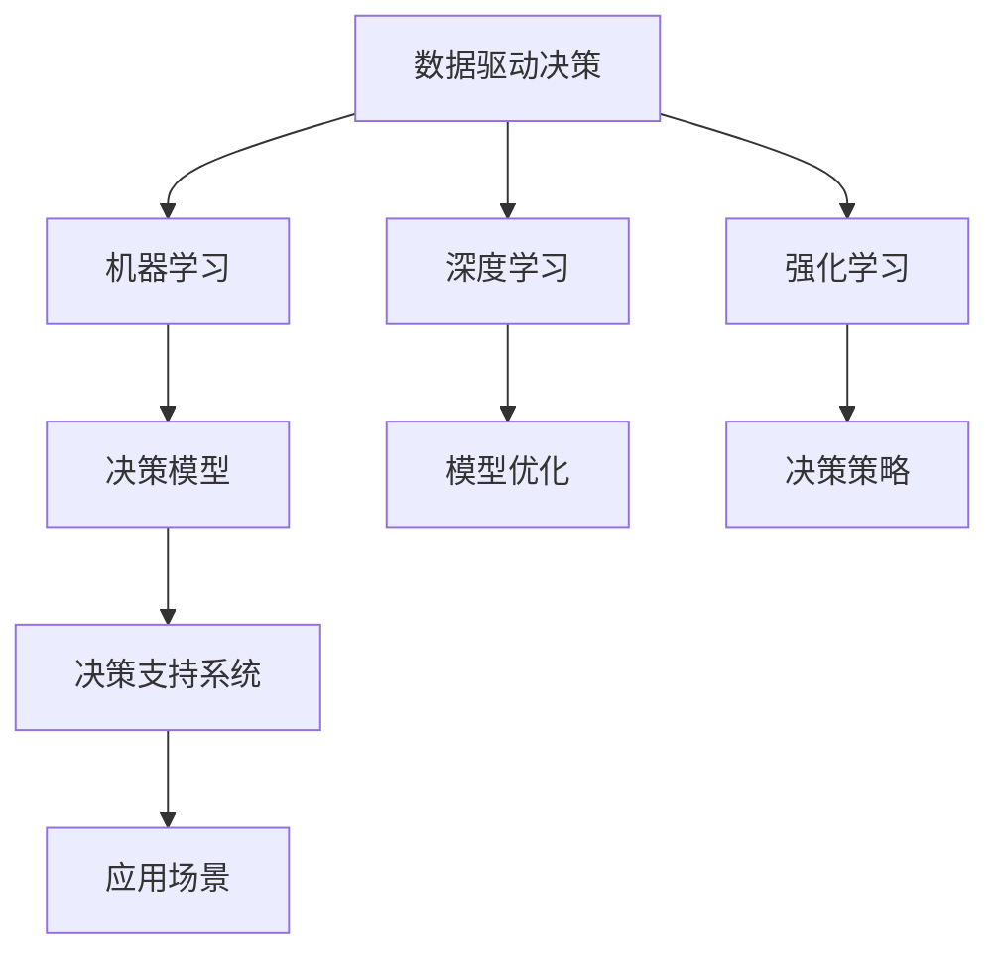

                 

# 思维体系:决策力的基础

## 1. 背景介绍

### 1.1 问题由来
决策力是现代组织和个人实现目标、应对挑战的关键能力。无论是在商业环境中，还是在日常生活里，面对复杂的决策环境，如何高效、精准地做出决策，成为每个决策者必须面对的重要课题。

随着人工智能技术的飞速发展，大数据的普及，以及社交媒体的广泛应用，决策环境变得更加复杂和不确定。数据驱动决策的实践证明了其显著的效用，但也暴露出了数据处理、决策分析等环节的诸多挑战。

### 1.2 问题核心关键点
决策力的核心关键点主要包括以下几个方面：
- **数据处理**：如何快速、准确地处理海量数据，提取出有用的信息。
- **决策模型**：如何构建有效的决策模型，保证决策的科学性和合理性。
- **风险管理**：如何识别和管理决策中的不确定性，确保决策的稳健性。
- **迭代优化**：如何通过不断的反馈和调整，不断提升决策的质量。
- **道德合规**：如何在决策过程中充分考虑伦理、法律和道德问题，确保决策的公正性。

## 2. 核心概念与联系

### 2.1 核心概念概述

本节将介绍几个核心概念，并阐述它们之间的联系：

- **数据驱动决策**：基于数据信息进行决策的方法，要求数据具有准确性、全面性和及时性。
- **机器学习**：通过构建模型，让计算机自动从数据中学习规律，从而辅助或替代人类进行决策。
- **深度学习**：机器学习的高级形式，通过多层次的神经网络，从原始数据中自动提取和抽象特征，进行复杂的决策。
- **强化学习**：通过试错、反馈的方式，让模型在不断交互中学习最优决策策略。
- **混合智能**：将机器学习和人类智能相结合，实现优势互补，提高决策的智能化和人性化。

这些概念之间的联系可以通过以下Mermaid流程图来展示：



这个流程图展示了各个概念之间的逻辑关系：

1. 数据驱动决策为机器学习提供数据基础。
2. 机器学习通过构建模型，实现数据到决策的转换。
3. 深度学习是机器学习的高级形式，能够从原始数据中提取高层次特征。
4. 强化学习通过不断反馈，优化决策策略。
5. 混合智能将机器学习和人类智能结合，形成更全面的决策支持。

## 3. 核心算法原理 & 具体操作步骤
### 3.1 算法原理概述

数据驱动决策的核心算法原理可以概括为：
1. **数据采集**：从多源渠道获取相关数据，确保数据的全面性和多样性。
2. **数据处理**：使用数据清洗、特征提取、数据变换等方法，提高数据的可用性。
3. **模型构建**：选择合适的机器学习模型，如回归、分类、聚类等，构建决策模型。
4. **模型训练**：通过训练模型，优化模型参数，提高模型的泛化能力。
5. **模型评估**：使用测试集对模型进行评估，确保模型的性能和稳定性。
6. **决策应用**：将模型应用于实际决策场景，输出决策结果。

### 3.2 算法步骤详解

以下是数据驱动决策的详细操作步骤：

**Step 1: 数据采集与预处理**
- 通过API、数据库、爬虫等方式，从多个来源获取数据。
- 对数据进行清洗，去除重复、缺失、异常值等。
- 对数据进行特征提取和变换，生成可用于决策的特征集。

**Step 2: 模型构建**
- 根据决策需求，选择合适的机器学习模型，如线性回归、决策树、随机森林等。
- 对于复杂的决策问题，可使用深度学习模型，如神经网络、卷积神经网络(CNN)、循环神经网络(RNN)等。
- 构建模型时，需要考虑模型的可解释性和泛化能力，选择合适的损失函数、优化算法等。

**Step 3: 模型训练**
- 将处理后的数据分为训练集和测试集，通常采用交叉验证方法。
- 使用训练集对模型进行训练，通过优化算法调整模型参数。
- 记录训练过程中的各项指标，如损失函数、准确率、召回率等。

**Step 4: 模型评估**
- 使用测试集对模型进行评估，比较不同模型的性能。
- 通过混淆矩阵、ROC曲线、AUC值等指标，评估模型的分类能力。
- 对于回归问题，可采用均方误差、平均绝对误差等指标。

**Step 5: 决策应用**
- 将训练好的模型应用于实际决策场景。
- 对于单次决策，可输入模型输入，直接获取输出结果。
- 对于多轮决策，需考虑模型的迭代优化和反馈机制。

### 3.3 算法优缺点

数据驱动决策的核心算法具有以下优点：
1. **客观性**：数据驱动决策基于数据信息，减少了人为偏见。
2. **可量化**：通过模型，可以将主观判断转换为可量化的决策结果。
3. **可复现**：模型训练和评估过程具有可复现性，便于验证和优化。
4. **可扩展**：适用于多种决策场景，通过模型迁移和组合，可实现多场景决策。

同时，数据驱动决策也存在一些局限性：
1. **数据依赖**：数据质量和多样性直接影响决策效果，对数据采集和处理提出了高要求。
2. **模型复杂**：对于复杂的决策问题，深度学习模型需要大量计算资源和训练时间。
3. **解释性不足**：黑箱模型难以解释决策过程，影响决策的可信度。
4. **过拟合风险**：模型训练过程中，容易产生过拟合，降低模型的泛化能力。
5. **隐私风险**：数据采集和处理过程中，存在隐私泄露的风险。

### 3.4 算法应用领域

数据驱动决策在多个领域得到了广泛应用，例如：

- **金融风控**：通过构建信用评分模型，评估客户的信用风险，辅助贷款审批。
- **医疗诊断**：利用医学影像分析模型，辅助医生进行疾病诊断和治疗方案选择。
- **供应链管理**：构建需求预测模型，优化库存管理和物流规划。
- **市场营销**：分析客户行为数据，优化广告投放策略，提高广告效果。
- **智能制造**：通过设备监测数据，预测设备故障，优化生产调度。

## 4. 数学模型和公式 & 详细讲解  
### 4.1 数学模型构建

数据驱动决策的数学模型构建通常涉及以下几个方面：

1. **线性回归模型**：
   - 目标：预测连续变量。
   - 公式：$y = w_0 + w_1x_1 + w_2x_2 + ... + w_nx_n + b$

2. **逻辑回归模型**：
   - 目标：预测二分类问题。
   - 公式：$P(y=1|x) = \frac{1}{1+e^{-(w_0 + w_1x_1 + w_2x_2 + ... + w_nx_n)}}$

3. **决策树模型**：
   - 目标：预测离散或连续变量。
   - 公式：$T = \{if x_1 < k_1 then \{if x_2 < k_2 then T_1 else T_2\} else T_3\}$

4. **随机森林模型**：
   - 目标：集成多棵决策树，提高预测准确率。
   - 公式：$T_{RF} = \frac{1}{M} \sum_{i=1}^{M} T_i$

5. **神经网络模型**：
   - 目标：从原始数据中提取高层次特征，进行复杂决策。
   - 公式：$y = f(\sum_{i=1}^{n} w_ix_i + b)$

其中，$x_i$ 为输入特征，$y$ 为输出结果，$w_i$ 为权重，$b$ 为偏置项，$e$ 为自然对数的底数。

### 4.2 公式推导过程

以下是几个常用模型的公式推导过程：

**线性回归模型**：
- 最小二乘法求解线性回归模型的参数：$w = (X^TX)^{-1}X^Ty$
- 回归方程：$y = Xw + b$

**逻辑回归模型**：
- 使用交叉熵损失函数：$L = -\frac{1}{N} \sum_{i=1}^{N}(y_i \log \hat{y}_i + (1-y_i) \log (1-\hat{y}_i))$
- 参数求解：$w = argmin_w \frac{1}{N} \sum_{i=1}^{N}(y_i - \hat{y}_i)^2$

**决策树模型**：
- 信息增益：$Gain = \frac{I(X,Y)}{I(X)}$
- 节点划分：$Gain = \frac{1}{N} \sum_{i=1}^{N} I(x_i,Y)$

**神经网络模型**：
- 前向传播：$y_i = f(w_{l-1}z_{l-1} + b_{l-1})$
- 反向传播：$w_l = w_l - \eta \frac{\partial L}{\partial w_l}$

### 4.3 案例分析与讲解

以金融风控为例，分析如何使用数据驱动决策构建信用评分模型：

1. **数据采集与预处理**：
   - 收集客户基本信息、历史交易记录、社交媒体数据等。
   - 对数据进行清洗，去除重复、异常值。
   - 特征提取：提取客户的年龄、性别、收入、消费习惯等特征。

2. **模型构建**：
   - 选择逻辑回归模型，构建信用评分模型。
   - 训练集和测试集的划分：80%数据用于训练，20%数据用于测试。

3. **模型训练**：
   - 使用训练集训练模型，调整模型参数。
   - 记录训练过程中的损失函数和准确率，选择最优参数。

4. **模型评估**：
   - 使用测试集评估模型性能，计算AUC值和混淆矩阵。
   - 根据评估结果调整模型参数，优化模型性能。

5. **决策应用**：
   - 将模型应用于新客户信用评分，输出评分结果。
   - 根据评分结果，设定贷款审批策略，优化风险控制。

## 5. 项目实践：代码实例和详细解释说明
### 5.1 开发环境搭建

在进行数据驱动决策的实践前，需要先准备好开发环境。以下是使用Python进行Scikit-learn开发的开发环境配置流程：

1. 安装Anaconda：从官网下载并安装Anaconda，用于创建独立的Python环境。

2. 创建并激活虚拟环境：
```bash
conda create -n pytda-env python=3.8 
conda activate pytda-env
```

3. 安装Scikit-learn：
```bash
pip install scikit-learn
```

4. 安装各类工具包：
```bash
pip install numpy pandas matplotlib seaborn scikit-image scikit-optimize jupyter notebook ipython
```

完成上述步骤后，即可在`pytda-env`环境中开始数据驱动决策的实践。

### 5.2 源代码详细实现

以下是一个基于Scikit-learn实现金融风控决策的Python代码实现：

```python
from sklearn.linear_model import LogisticRegression
from sklearn.model_selection import train_test_split
from sklearn.metrics import roc_auc_score
from sklearn.preprocessing import StandardScaler

# 加载数据
X, y = load_data()

# 数据预处理
scaler = StandardScaler()
X_scaled = scaler.fit_transform(X)

# 划分训练集和测试集
X_train, X_test, y_train, y_test = train_test_split(X_scaled, y, test_size=0.2, random_state=42)

# 构建逻辑回归模型
model = LogisticRegression()

# 训练模型
model.fit(X_train, y_train)

# 评估模型
y_pred = model.predict_proba(X_test)[:, 1]
auc = roc_auc_score(y_test, y_pred)
print('AUC:', auc)

# 应用模型
new_data = load_new_data()
new_data_scaled = scaler.transform(new_data)
score = model.predict_proba(new_data_scaled)[:, 1]
print('新客户信用评分:', score)
```

### 5.3 代码解读与分析

让我们再详细解读一下关键代码的实现细节：

**数据加载与预处理**：
- `load_data()`函数：从数据库或文件中加载原始数据。
- `StandardScaler`：对数据进行标准化处理，使数据符合模型输入要求。

**模型构建与训练**：
- `LogisticRegression`：选择逻辑回归模型，用于二分类决策。
- `train_test_split`：将数据分为训练集和测试集，设置测试集比例为20%。
- `fit`方法：使用训练集对模型进行训练。

**模型评估**：
- `predict_proba`：对测试集进行预测，输出概率值。
- `roc_auc_score`：计算AUC值，评估模型性能。

**决策应用**：
- `load_new_data()`函数：加载新客户的原始数据。
- `transform`方法：对新数据进行标准化处理。
- `predict_proba`：对新客户进行预测，输出信用评分。

以上代码实现展示了基于Scikit-learn的数据驱动决策流程，包括数据加载、预处理、模型训练、评估和应用等环节。开发者可以根据具体任务，灵活调整代码，实现更加高效的决策支持系统。

## 6. 实际应用场景
### 6.1 智能制造

在智能制造领域，数据驱动决策可以广泛应用于生产调度和设备维护。通过收集设备运行数据，构建设备状态预测模型，优化生产计划和维护策略，提升生产效率和设备利用率。

在技术实现上，可以构建多变量回归模型，预测设备故障和维护需求。利用传感器数据和历史维修记录，对设备状态进行实时监测，预测可能出现的故障，并根据预测结果调整生产计划和维护计划。通过不断的反馈和调整，持续优化生产调度和设备维护策略，提高生产效率和设备利用率。

### 6.2 智能交通

智能交通系统通过数据驱动决策，实现交通流量管理和事故预防。通过构建交通流量预测模型，实时监测和分析交通数据，预测交通流量变化，优化交通信号灯控制，减少交通拥堵，提高道路通行效率。

在技术实现上，可以构建时间序列预测模型，预测未来的交通流量变化。利用实时交通数据和历史流量数据，对模型进行训练和调整。根据预测结果，动态调整交通信号灯的时序，优化交通流量分配，减少交通拥堵，提高道路通行效率。通过不断的反馈和调整，持续优化交通管理策略，提升交通系统运行效率。

### 6.3 智能医疗

在智能医疗领域，数据驱动决策可以用于疾病诊断和治疗方案推荐。通过构建医学影像分析模型和疾病预测模型，辅助医生进行疾病诊断和治疗方案选择，提高诊疗效率和准确性。

在技术实现上，可以构建卷积神经网络(CNN)模型，对医学影像进行分析和诊断。利用大规模医学影像数据集和标注数据，对模型进行训练和调整。根据分析结果，辅助医生进行疾病诊断和治疗方案选择，提高诊疗效率和准确性。通过不断的反馈和调整，持续优化医疗诊断和治疗方案，提升医疗服务质量。

## 7. 工具和资源推荐
### 7.1 学习资源推荐

为了帮助开发者系统掌握数据驱动决策的理论基础和实践技巧，这里推荐一些优质的学习资源：

1. 《机器学习实战》书籍：通过大量实际案例，系统介绍了机器学习的基本概念和常用算法。
2. 《Python机器学习》书籍：详细介绍了Python在机器学习中的应用，包括数据处理、模型构建和评估等。
3. Coursera《机器学习》课程：由斯坦福大学教授Andrew Ng主讲的经典课程，覆盖了机器学习的基本理论和实践技巧。
4. Kaggle数据科学竞赛：通过参与实际竞赛，实践数据驱动决策的方法，提高数据处理和模型构建能力。
5. Scikit-learn官方文档：提供了丰富的机器学习模型和算法实现，以及详细的文档和示例代码。

通过对这些资源的学习实践，相信你一定能够快速掌握数据驱动决策的精髓，并用于解决实际的决策问题。
###  7.2 开发工具推荐

高效的开发离不开优秀的工具支持。以下是几款用于数据驱动决策开发的常用工具：

1. Python：基于Python语言的开发工具，支持丰富的第三方库和框架，适合快速迭代研究。
2. Scikit-learn：开源机器学习库，提供了多种常用的机器学习模型和算法，易于上手。
3. TensorFlow：由Google主导开发的深度学习框架，支持分布式计算和模型部署，适合大规模工程应用。
4. PyTorch：基于Python的深度学习框架，支持动态计算图和高效训练，适合快速实验和研究。
5. Weights & Biases：模型训练的实验跟踪工具，可以记录和可视化模型训练过程中的各项指标，方便对比和调优。

合理利用这些工具，可以显著提升数据驱动决策的开发效率，加快创新迭代的步伐。

### 7.3 相关论文推荐

数据驱动决策的发展源于学界的持续研究。以下是几篇奠基性的相关论文，推荐阅读：

1. "Inductive Biases and Transfer Learning"（关于偏置和迁移学习的论文）：探讨了机器学习中的偏置和迁移学习，提出了一些有效的偏置工程策略。
2. "Deep Learning for Healthcare"（深度学习在医疗中的应用）：详细介绍了深度学习在医疗诊断和治疗中的应用。
3. "Predictive Maintenance with Deep Learning"（基于深度学习的预测性维护）：展示了深度学习在设备维护和故障预测中的应用。
4. "Traffic Flow Prediction with Long Short-Term Memory Networks"（基于LSTM的时间序列预测）：介绍了LSTM在交通流量预测中的应用。
5. "Boosting: An Adaptive Learning Algorithm"（提升算法）：提出了提升算法，用于优化机器学习模型的训练。

这些论文代表了大数据驱动决策技术的发展脉络。通过学习这些前沿成果，可以帮助研究者把握学科前进方向，激发更多的创新灵感。

## 8. 总结：未来发展趋势与挑战
### 8.1 总结

本文对数据驱动决策的算法原理和操作步骤进行了全面系统的介绍。首先阐述了数据驱动决策的背景和意义，明确了决策模型的构建和应用。其次，从原理到实践，详细讲解了数据驱动决策的数学模型和公式推导，给出了数据驱动决策任务开发的完整代码实例。同时，本文还广泛探讨了数据驱动决策在智能制造、智能交通、智能医疗等多个行业领域的应用前景，展示了数据驱动决策的广泛应用潜力。最后，本文精选了数据驱动决策的技术资源，力求为读者提供全方位的技术指引。

通过本文的系统梳理，可以看到，数据驱动决策在现代组织和个人决策中具有重要的应用价值，能够通过数据驱动，辅助或替代人类进行决策，提高决策的科学性和合理性。未来，随着数据处理能力的提升和决策模型的不断优化，数据驱动决策必将得到更广泛的应用，助力各行各业实现智能化转型。

### 8.2 未来发展趋势

展望未来，数据驱动决策技术将呈现以下几个发展趋势：

1. **自动化决策**：结合人工智能和自动化技术，实现决策过程的自动化，提高决策效率和质量。
2. **个性化决策**：利用大数据分析技术，实现决策过程的个性化，提高决策的针对性和精准性。
3. **智能决策**：将机器学习、深度学习、强化学习等技术融合，实现智能决策系统。
4. **多模态决策**：结合多源数据和多种模型，实现多模态决策支持。
5. **隐私保护**：在数据采集和处理过程中，采取隐私保护措施，确保数据安全和隐私。

这些趋势凸显了数据驱动决策技术的广阔前景。这些方向的探索发展，必将进一步提升决策系统的性能和应用范围，为各行各业提供更加智能化、自动化的决策支持。

### 8.3 面临的挑战

尽管数据驱动决策技术已经取得了显著成效，但在迈向更加智能化、普适化应用的过程中，它仍面临着诸多挑战：

1. **数据隐私**：数据采集和处理过程中，存在隐私泄露的风险。如何保护用户隐私，确保数据安全，是一大难题。
2. **数据质量**：数据质量直接影响决策效果，如何保证数据的准确性、全面性和及时性，是一大挑战。
3. **模型复杂性**：复杂决策问题需要复杂的模型进行建模，如何简化模型，提高计算效率，是一大挑战。
4. **可解释性**：黑箱模型难以解释决策过程，影响决策的可信度。如何增强模型的可解释性，是一大挑战。
5. **实时性**：实时决策要求模型具备高效的计算和推理能力，如何提升模型的实时性，是一大挑战。

### 8.4 研究展望

面对数据驱动决策面临的挑战，未来的研究需要在以下几个方面寻求新的突破：

1. **数据治理**：建立数据治理框架，确保数据的质量和隐私。通过数据清洗、去重、匿名化等措施，保护用户隐私。
2. **模型优化**：开发更加高效的模型，如轻量级神经网络、迁移学习等，提升模型的计算效率和可解释性。
3. **融合多源数据**：结合多种数据源和多种模型，实现多模态决策支持，提高决策的全面性和准确性。
4. **提升实时性**：优化模型结构和计算图，使用分布式计算和模型压缩等技术，提升模型的实时性。
5. **增强可解释性**：引入可解释性技术，如模型可视化、特征重要性分析等，提高模型的可解释性。

这些研究方向将引领数据驱动决策技术走向更高的台阶，为构建安全、可靠、可解释、可控的智能决策系统铺平道路。面向未来，数据驱动决策技术还需要与其他人工智能技术进行更深入的融合，如知识表示、因果推理、强化学习等，多路径协同发力，共同推动决策智能化的进步。只有勇于创新、敢于突破，才能不断拓展决策模型的边界，让决策技术更好地服务于人类社会。

## 9. 附录：常见问题与解答

**Q1：数据驱动决策是否适用于所有决策场景？**

A: 数据驱动决策适用于多种决策场景，尤其是数据可获取、可量化的场景。但对于需要人类直觉和经验的决策，如伦理、道德、美学等领域，数据驱动决策的适用范围有限。

**Q2：如何选择适当的机器学习模型？**

A: 选择适当的机器学习模型需要考虑以下几个因素：
- 数据类型：对于分类问题，选择分类模型；对于回归问题，选择回归模型。
- 数据量：对于大数据量，选择深度学习模型；对于小数据量，选择轻量级模型。
- 计算资源：对于计算资源丰富的场景，选择复杂模型；对于资源受限的场合，选择高效模型。
- 模型性能：通过交叉验证等方法，评估不同模型的性能，选择最优模型。

**Q3：如何在数据驱动决策中避免过拟合？**

A: 过拟合是数据驱动决策中常见的挑战。以下是一些缓解策略：
- 数据增强：通过数据扩充、数据合成等方法，丰富数据集，降低过拟合风险。
- 正则化：使用L2正则、Dropout等技术，限制模型的复杂度，避免过拟合。
- 交叉验证：通过交叉验证等方法，评估模型的泛化能力，避免过拟合。
- 模型简化：选择简单的模型结构，避免过度拟合复杂数据。

**Q4：如何在数据驱动决策中保证数据隐私？**

A: 保护数据隐私是数据驱动决策中的一大挑战。以下是一些保护策略：
- 数据匿名化：通过数据脱敏、去标识化等措施，保护用户隐私。
- 数据加密：对数据进行加密存储和传输，防止数据泄露。
- 隐私保护技术：使用差分隐私、联邦学习等技术，保护数据隐私。
- 用户控制：赋予用户数据访问控制权限，保护个人隐私。

**Q5：如何在数据驱动决策中提高模型的可解释性？**

A: 提高模型的可解释性是数据驱动决策中的重要需求。以下是一些增强策略：
- 模型可视化：使用可视化工具，展示模型的决策过程和特征重要性。
- 特征工程：选择有意义的特征，解释模型中的决策因素。
- 解释模型：使用可解释模型，如决策树、线性回归等，提高模型的可解释性。
- 用户交互：通过用户反馈，不断优化模型，增强模型的可解释性。

这些策略将帮助开发者在数据驱动决策过程中，更好地平衡数据利用和隐私保护、模型复杂和可解释性之间的关系，实现更加全面、可靠的决策支持。

---

作者：禅与计算机程序设计艺术 / Zen and the Art of Computer Programming

