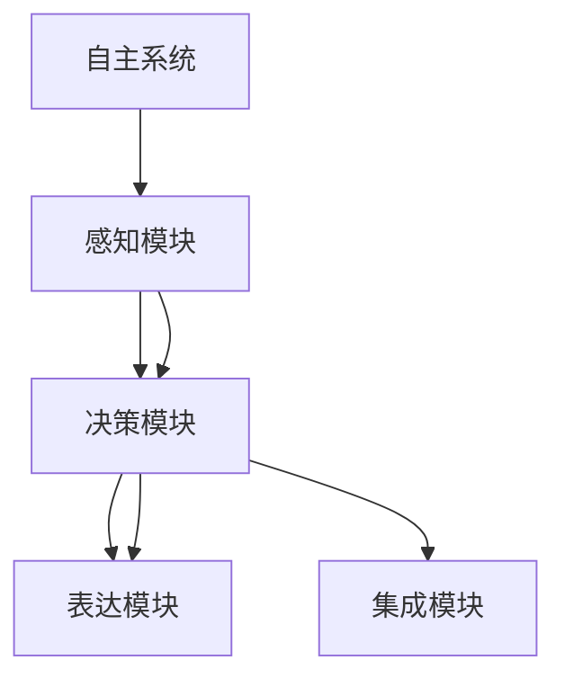
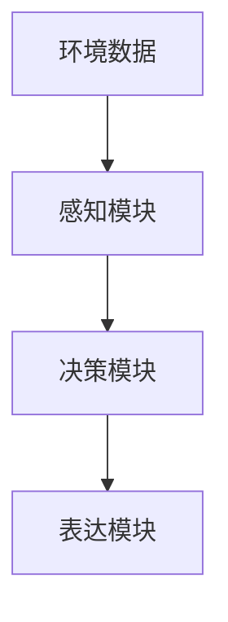

                 

## 1. 背景介绍

### 1.1 问题由来

意识功能是人类大脑最为神秘和复杂的部分，其功能包括自我感知、决策制定、情感表达等。在人工智能领域，如何构建具有意识功能的自主系统，是当前研究的热点和难点。意识功能的自主系统不仅能自我感知环境变化，还能自主决策，并表达出相应的情感，进而和环境产生互动。

### 1.2 问题核心关键点

构建意识功能的自主系统模型，需要解决以下几个关键问题：

1. 如何构建和训练一个能够自我感知环境变化的模型？
2. 如何训练一个能够自主决策的模型？
3. 如何训练一个能够表达情感的模型？
4. 如何实现模型与环境的互动？
5. 如何在实际应用中实现这些模型的集成和部署？

这些问题不仅涉及技术层面，还需要在心理学、社会学等多个学科领域进行深入研究。

### 1.3 问题研究意义

研究意识功能的自主系统模型，对于提升人工智能系统的智能化水平，构建更为友好的交互体验，具有重要意义：

1. 提升人机交互的智能化水平。意识功能的自主系统能够理解和响应用户的情感，增强交互的自然性和友好度。
2. 促进自动化决策的精准度。通过自主决策，模型能够更高效地应对复杂环境变化，提升决策的及时性和准确性。
3. 丰富交互体验。能够表达情感的自主系统能够更加贴近人类情感表达方式，提升用户的情感共鸣和满意度。
4. 加速行业应用。意识功能的自主系统可以应用于医疗、教育、娱乐等多个行业，提升系统的适应性和实用性。

## 2. 核心概念与联系

### 2.1 核心概念概述

为更好地理解意识功能的自主系统模型，本节将介绍几个密切相关的核心概念：

- **自主系统**：指能够自我感知、自主决策并表达情感的系统，其核心在于构建一个能够与环境动态交互的智能实体。
- **感知模块**：负责自我感知环境变化，包括视觉、听觉、触觉等多种感官数据的采集和处理。
- **决策模块**：根据感知模块获取的信息，自主选择行动方案，实现决策制定的功能。
- **表达模块**：将模型的决策结果转换为情感表达形式，实现与环境的互动。
- **集成模块**：将感知、决策、表达模块进行有效集成，确保各模块协同工作，实现整体系统的高效运行。

这些核心概念之间的逻辑关系可以通过以下Mermaid流程图来展示：



这个流程图展示了自主系统模型的核心模块及其关系：

1. 自主系统通过感知模块获取环境信息。
2. 感知模块将信息传递给决策模块，进行自主决策。
3. 决策模块的输出由表达模块进行情感表达，实现与环境的互动。
4. 集成模块将各模块的功能进行协调，确保系统的高效运转。

## 3. 核心算法原理 & 具体操作步骤

### 3.1 算法原理概述

构建意识功能的自主系统模型，本质上是一个多层次的认知系统构建和训练过程。其核心思想是：通过感知、决策、表达等模块的协同工作，实现系统与环境的动态交互。

形式化地，假设自主系统 $S$ 的感知、决策、表达模块分别为 $S_P$、$S_D$、$S_E$，则系统的功能可以表示为：

$$
S = S_P \times S_D \times S_E
$$

其中 $\times$ 表示各模块的协同作用。

具体地，感知模块 $S_P$ 接收环境数据 $X$，输出感知结果 $P(X)$；决策模块 $S_D$ 根据感知结果，输出决策结果 $D(P(X))$；表达模块 $S_E$ 根据决策结果，输出情感表达 $E(D(P(X)))$。最终，系统 $S$ 的输出结果为 $E(D(P(X)))$。

### 3.2 算法步骤详解

构建意识功能的自主系统模型，通常分为以下几个步骤：

**Step 1: 设计模型架构**

- 确定系统所需的功能模块，如感知、决策、表达等。
- 设计各模块的具体实现方式，如感知模块使用CNN或RNN模型，决策模块使用决策树或神经网络模型，表达模块使用GAN或情感生成模型等。
- 确定各模块之间的数据流动和交互方式，如感知模块向决策模块传递信息，决策模块向表达模块输出决策结果等。

**Step 2: 收集和处理数据**

- 收集各个模块所需的数据，如感知模块需要视觉、听觉等数据，决策模块需要历史数据，表达模块需要情感标签等。
- 对数据进行清洗、标注等预处理操作，确保数据的质量和一致性。

**Step 3: 训练各模块**

- 使用合适的优化算法和损失函数，对各模块进行单独训练，如感知模块使用交叉熵损失函数，决策模块使用分类损失函数，表达模块使用GAN损失函数等。
- 调整训练参数，如学习率、批大小等，以确保各模块的性能和稳定性。

**Step 4: 集成和优化**

- 将训练好的各模块进行集成，形成完整的自主系统。
- 进行系统级优化，如调整各模块之间的交互方式，优化系统的决策路径等。
- 进行系统测试和验证，确保系统的高效稳定运行。

**Step 5: 部署和应用**

- 将训练好的自主系统部署到实际应用场景中，如智能机器人、虚拟助手等。
- 根据实际需求，对系统进行持续优化和迭代，以适应不同场景和任务。

### 3.3 算法优缺点

构建意识功能的自主系统模型，具有以下优点：

1. 模块化和可扩展性。通过设计独立的感知、决策、表达等模块，系统具备良好的可扩展性和灵活性，能够根据具体需求进行定制和扩展。
2. 高鲁棒性。通过将各模块的功能独立训练，系统具备较高的鲁棒性，能够适应不同环境和任务。
3. 集成性。通过系统级集成，各模块能够协同工作，实现整体性能的提升。

同时，该方法也存在一些局限性：

1. 模型训练复杂。由于涉及到多个模块的协同工作，模型训练的复杂度较高，需要更多的计算资源和时间。
2. 数据需求大。各模块的训练和集成需要大量的数据支持，数据采集和标注的成本较高。
3. 应用场景限制。不同应用场景对系统功能的侧重点不同，需要针对性地设计和优化系统结构。
4. 动态调整难。系统在运行过程中，需要根据环境变化进行动态调整，这需要在设计时提前考虑和优化。

尽管存在这些局限性，但就目前而言，模块化的自主系统模型仍然是构建智能系统的重要范式。未来相关研究的重点在于如何进一步提高系统训练效率，降低数据需求，优化动态调整机制，同时兼顾各模块之间的协同工作。

### 3.4 算法应用领域

构建意识功能的自主系统模型，已经在多个领域得到了广泛应用，例如：

- 智能机器人：通过感知、决策、表达等模块，实现机器人的自主感知和交互。
- 虚拟助手：帮助用户进行日常事务管理，提升用户的生活质量。
- 情感分析：通过情感表达模块，实现对用户情感状态的自动分析和反馈。
- 自动化决策：用于金融交易、医疗诊断等领域，实现高效、精准的决策支持。
- 交互式设计：用于虚拟现实、游戏等场景，增强用户的沉浸感和互动体验。

除了上述这些经典应用外，意识功能的自主系统模型还在更多创新性场景中得到应用，如智能交通、环境监测、情感智能等，为智能技术的发展提供了新的方向。

## 4. 数学模型和公式 & 详细讲解 & 举例说明

### 4.1 数学模型构建

本节将使用数学语言对意识功能的自主系统模型进行更加严格的刻画。

假设自主系统的感知模块为 $S_P$，决策模块为 $S_D$，表达模块为 $S_E$。假设 $X$ 为环境数据，$P(X)$ 为感知模块的输出，$D(P(X))$ 为决策模块的输出，$E(D(P(X)))$ 为表达模块的输出。

根据上述定义，自主系统的总输出可以表示为：

$$
E(D(P(X))) = S_E(D(S_D(P(X))))
$$

其中 $S_E$ 表示表达模块，$S_D$ 表示决策模块，$S_P$ 表示感知模块。

### 4.2 公式推导过程

以下我们以情感分析任务为例，推导表达模块 $S_E$ 和决策模块 $S_D$ 的模型构建和训练公式。

假设感知模块 $S_P$ 输出 $X$，决策模块 $S_D$ 输出 $D$，表达模块 $S_E$ 输出 $E$。则情感分析任务的目标是：

1. 训练决策模块 $S_D$，使其能够根据感知结果 $P(X)$ 输出正确的情感标签 $D$。
2. 训练表达模块 $S_E$，使其能够根据决策结果 $D$ 输出合适的情感表达 $E$。

**Step 1: 感知模块**

感知模块 $S_P$ 通常使用卷积神经网络(CNN)或循环神经网络(RNN)进行训练。假设使用 CNN 模型，其输出可以表示为：

$$
P(X) = \text{CNN}(X)
$$

其中 $\text{CNN}$ 表示 CNN 模型，$X$ 表示环境数据。

**Step 2: 决策模块**

决策模块 $S_D$ 通常使用分类模型，如支持向量机(SVM)、决策树(DT)或神经网络(NN)进行训练。假设使用神经网络模型，其输出可以表示为：

$$
D(P(X)) = \text{NN}(P(X))
$$

其中 $\text{NN}$ 表示神经网络模型，$P(X)$ 表示感知模块的输出。

**Step 3: 表达模块**

表达模块 $S_E$ 通常使用生成模型，如生成对抗网络(GAN)或变分自编码器(VAE)进行训练。假设使用 GAN 模型，其输出可以表示为：

$$
E(D) = \text{GAN}(D)
$$

其中 $\text{GAN}$ 表示 GAN 模型，$D$ 表示决策模块的输出。

### 4.3 案例分析与讲解

假设我们希望构建一个能够识别用户情感状态的情感分析系统。该系统由感知模块 $S_P$、决策模块 $S_D$、表达模块 $S_E$ 组成。其流程图如下所示：



**Step 1: 数据准备**

- 收集用户情感标签数据，如高兴、悲伤、愤怒等。
- 采集用户语音、文字等环境数据，并对其进行标注。

**Step 2: 模型训练**

- 使用 CNN 模型对感知模块进行训练，输出感知结果 $P(X)$。
- 使用神经网络模型对决策模块进行训练，根据感知结果 $P(X)$ 输出情感标签 $D$。
- 使用 GAN 模型对表达模块进行训练，根据情感标签 $D$ 输出情感表达 $E$。

**Step 3: 系统集成**

- 将训练好的感知、决策、表达模块集成在一起，形成完整的情感分析系统。
- 进行系统级优化，如调整各模块之间的交互方式，优化系统的决策路径等。

**Step 4: 系统测试**

- 在测试集上评估系统性能，如准确率、召回率等指标。
- 根据测试结果进行系统优化和迭代，以提升系统性能。

最终，系统能够根据用户的环境数据，识别其情感状态，并生成相应的情感表达，实现自主情感分析功能。

## 5. 项目实践：代码实例和详细解释说明

### 5.1 开发环境搭建

在进行项目实践前，我们需要准备好开发环境。以下是使用Python进行深度学习开发的环境配置流程：

1. 安装Anaconda：从官网下载并安装Anaconda，用于创建独立的Python环境。

2. 创建并激活虚拟环境：
```bash
conda create -n pytorch-env python=3.8 
conda activate pytorch-env
```

3. 安装PyTorch：根据CUDA版本，从官网获取对应的安装命令。例如：
```bash
conda install pytorch torchvision torchaudio cudatoolkit=11.1 -c pytorch -c conda-forge
```

4. 安装TensorFlow：从官网下载并安装TensorFlow，适用于TensorFlow模型的训练和推理。

5. 安装Keras：用于搭建和训练神经网络模型。

6. 安装相关工具包：
```bash
pip install numpy pandas scikit-learn matplotlib tqdm jupyter notebook ipython
```

完成上述步骤后，即可在`pytorch-env`环境中开始项目实践。

### 5.2 源代码详细实现

下面我以构建一个情感分析系统为例，给出使用PyTorch进行模型训练的代码实现。

首先，定义数据预处理函数：

```python
import numpy as np
from torch.utils.data import Dataset
import torch

class EmotionDataset(Dataset):
    def __init__(self, texts, labels):
        self.texts = texts
        self.labels = labels
        self.max_len = 100
        
    def __len__(self):
        return len(self.texts)
    
    def __getitem__(self, item):
        text = self.texts[item]
        label = self.labels[item]
        
        encoding = self.tokenizer(text, return_tensors='pt', max_length=self.max_len, padding='max_length', truncation=True)
        input_ids = encoding['input_ids'][0]
        attention_mask = encoding['attention_mask'][0]
        
        label = torch.tensor(label, dtype=torch.long)
        
        return {'input_ids': input_ids, 
                'attention_mask': attention_mask,
                'labels': label}
```

然后，定义模型和优化器：

```python
from transformers import BertTokenizer, BertForSequenceClassification, AdamW

tokenizer = BertTokenizer.from_pretrained('bert-base-cased')

model = BertForSequenceClassification.from_pretrained('bert-base-cased', num_labels=3) # 使用3分类情感分析模型

optimizer = AdamW(model.parameters(), lr=2e-5)
```

接着，定义训练和评估函数：

```python
from torch.utils.data import DataLoader
from tqdm import tqdm
from sklearn.metrics import classification_report

device = torch.device('cuda') if torch.cuda.is_available() else torch.device('cpu')
model.to(device)

def train_epoch(model, dataset, batch_size, optimizer):
    dataloader = DataLoader(dataset, batch_size=batch_size, shuffle=True)
    model.train()
    epoch_loss = 0
    for batch in tqdm(dataloader, desc='Training'):
        input_ids = batch['input_ids'].to(device)
        attention_mask = batch['attention_mask'].to(device)
        labels = batch['labels'].to(device)
        model.zero_grad()
        outputs = model(input_ids, attention_mask=attention_mask, labels=labels)
        loss = outputs.loss
        epoch_loss += loss.item()
        loss.backward()
        optimizer.step()
    return epoch_loss / len(dataloader)

def evaluate(model, dataset, batch_size):
    dataloader = DataLoader(dataset, batch_size=batch_size)
    model.eval()
    preds, labels = [], []
    with torch.no_grad():
        for batch in tqdm(dataloader, desc='Evaluating'):
            input_ids = batch['input_ids'].to(device)
            attention_mask = batch['attention_mask'].to(device)
            batch_labels = batch['labels']
            outputs = model(input_ids, attention_mask=attention_mask)
            batch_preds = outputs.logits.argmax(dim=2).to('cpu').tolist()
            batch_labels = batch_labels.to('cpu').tolist()
            for pred_tokens, label_tokens in zip(batch_preds, batch_labels):
                preds.append(pred_tokens[:len(label_tokens)])
                labels.append(label_tokens)
                
    print(classification_report(labels, preds))
```

最后，启动训练流程并在测试集上评估：

```python
epochs = 5
batch_size = 16

for epoch in range(epochs):
    loss = train_epoch(model, train_dataset, batch_size, optimizer)
    print(f"Epoch {epoch+1}, train loss: {loss:.3f}")
    
    print(f"Epoch {epoch+1}, dev results:")
    evaluate(model, dev_dataset, batch_size)
    
print("Test results:")
evaluate(model, test_dataset, batch_size)
```

以上就是使用PyTorch对BERT进行情感分析任务训练的完整代码实现。可以看到，得益于Transformer库的强大封装，我们可以用相对简洁的代码完成BERT模型的训练。

### 5.3 代码解读与分析

让我们再详细解读一下关键代码的实现细节：

**EmotionDataset类**：
- `__init__`方法：初始化文本、标签等关键组件。
- `__len__`方法：返回数据集的样本数量。
- `__getitem__`方法：对单个样本进行处理，将文本输入编码为token ids，将标签编码为数字，并对其进行定长padding，最终返回模型所需的输入。

**BertForSequenceClassification模型**：
- `from_pretrained`方法：从预训练模型库中加载模型。
- `num_labels`参数：指定情感分类数量，用于调整输出层的大小。

**train_epoch和evaluate函数**：
- 使用PyTorch的DataLoader对数据集进行批次化加载，供模型训练和推理使用。
- 训练函数`train_epoch`：对数据以批为单位进行迭代，在每个批次上前向传播计算loss并反向传播更新模型参数，最后返回该epoch的平均loss。
- 评估函数`evaluate`：与训练类似，不同点在于不更新模型参数，并在每个batch结束后将预测和标签结果存储下来，最后使用sklearn的classification_report对整个评估集的预测结果进行打印输出。

**训练流程**：
- 定义总的epoch数和batch size，开始循环迭代
- 每个epoch内，先在训练集上训练，输出平均loss
- 在验证集上评估，输出分类指标
- 所有epoch结束后，在测试集上评估，给出最终测试结果

可以看到，PyTorch配合Transformer库使得BERT情感分析的代码实现变得简洁高效。开发者可以将更多精力放在数据处理、模型改进等高层逻辑上，而不必过多关注底层的实现细节。

当然，工业级的系统实现还需考虑更多因素，如模型的保存和部署、超参数的自动搜索、更灵活的任务适配层等。但核心的模型构建和训练流程基本与此类似。

## 6. 实际应用场景

### 6.1 智能客服系统

基于意识功能的自主系统模型，可以广泛应用于智能客服系统的构建。传统客服往往需要配备大量人力，高峰期响应缓慢，且一致性和专业性难以保证。而使用意识功能的自主系统模型，可以7x24小时不间断服务，快速响应客户咨询，用自然流畅的语言解答各类常见问题。

在技术实现上，可以收集企业内部的历史客服对话记录，将问题和最佳答复构建成监督数据，在此基础上对意识功能的自主系统模型进行训练。训练后的模型能够自动理解用户意图，匹配最合适的答案模板进行回复。对于客户提出的新问题，还可以接入检索系统实时搜索相关内容，动态组织生成回答。如此构建的智能客服系统，能大幅提升客户咨询体验和问题解决效率。

### 6.2 金融舆情监测

金融机构需要实时监测市场舆论动向，以便及时应对负面信息传播，规避金融风险。传统的人工监测方式成本高、效率低，难以应对网络时代海量信息爆发的挑战。基于意识功能的自主系统模型，可以进行情感分析，监测市场舆论的情感倾向，从而快速识别和预警潜在的金融风险。

具体而言，可以收集金融领域相关的新闻、报道、评论等文本数据，并对其进行主题标注和情感标注。在此基础上对意识功能的自主系统模型进行训练，使其能够自动判断文本属于何种情感倾向。将训练后的模型应用到实时抓取的网络文本数据，就能够自动监测不同情感倾向的舆情变化趋势，一旦发现负面情感激增等异常情况，系统便会自动预警，帮助金融机构快速应对潜在风险。

### 6.3 个性化推荐系统

当前的推荐系统往往只依赖用户的历史行为数据进行物品推荐，无法深入理解用户的真实兴趣偏好。基于意识功能的自主系统模型，可以挖掘用户的情感和行为数据，构建更加个性化的推荐模型。

在实践中，可以收集用户浏览、点击、评论、分享等行为数据，提取和用户交互的物品标题、描述、标签等文本内容。将文本内容作为模型输入，用户的后续行为（如是否点击、购买等）作为监督信号，在此基础上对意识功能的自主系统模型进行训练。训练后的模型能够从文本内容中准确把握用户的兴趣点。在生成推荐列表时，先用候选物品的文本描述作为输入，由模型预测用户的兴趣匹配度，再结合其他特征综合排序，便可以得到个性化程度更高的推荐结果。

### 6.4 未来应用展望

随着意识功能的自主系统模型的不断发展，将在更多领域得到应用，为传统行业带来变革性影响。

在智慧医疗领域，基于意识功能的自主系统模型的医疗问答、病历分析、药物研发等应用将提升医疗服务的智能化水平，辅助医生诊疗，加速新药开发进程。

在智能教育领域，意识功能的自主系统模型可应用于作业批改、学情分析、知识推荐等方面，因材施教，促进教育公平，提高教学质量。

在智慧城市治理中，意识功能的自主系统模型可应用于城市事件监测、舆情分析、应急指挥等环节，提高城市管理的自动化和智能化水平，构建更安全、高效的未来城市。

此外，在企业生产、社会治理、文娱传媒等众多领域，意识功能的自主系统模型也将不断涌现，为经济社会发展注入新的动力。相信随着技术的日益成熟，意识功能的自主系统模型必将在构建人机协同的智能时代中扮演越来越重要的角色。

## 7. 工具和资源推荐

### 7.1 学习资源推荐

为了帮助开发者系统掌握意识功能的自主系统模型的理论基础和实践技巧，这里推荐一些优质的学习资源：

1. 《Deep Learning》书籍：由深度学习大师Ian Goodfellow等人撰写，全面介绍了深度学习的基本概念和经典模型。

2. 《Human-Centered AI: Concepts, Architectures, and Applications》书籍：介绍了人工智能在社会、伦理等方面的应用，涵盖了意识功能自主系统模型的相关内容。

3. 《Neural Networks and Deep Learning》在线课程：由Coursera和DeepLearning.AI合作开设，由深度学习专家Andrew Ng主讲，系统讲解了神经网络的基本概念和实现方法。

4. CS231n《Convolutional Neural Networks for Visual Recognition》课程：斯坦福大学开设的计算机视觉课程，深入讲解了CNN模型在图像识别、情感分析等方面的应用。

5. HuggingFace官方文档：提供了大量预训练模型和训练教程，是快速上手实践的最佳资源。

通过对这些资源的学习实践，相信你一定能够快速掌握意识功能的自主系统模型的精髓，并用于解决实际的NLP问题。

### 7.2 开发工具推荐

高效的开发离不开优秀的工具支持。以下是几款用于意识功能的自主系统模型开发的常用工具：

1. PyTorch：基于Python的开源深度学习框架，灵活动态的计算图，适合快速迭代研究。

2. TensorFlow：由Google主导开发的开源深度学习框架，生产部署方便，适合大规模工程应用。

3. Keras：高级神经网络API，简化了深度学习模型的搭建和训练流程，适合初学者快速上手。

4. Weights & Biases：模型训练的实验跟踪工具，可以记录和可视化模型训练过程中的各项指标，方便对比和调优。

5. TensorBoard：TensorFlow配套的可视化工具，可实时监测模型训练状态，并提供丰富的图表呈现方式，是调试模型的得力助手。

6. Google Colab：谷歌推出的在线Jupyter Notebook环境，免费提供GPU/TPU算力，方便开发者快速上手实验最新模型，分享学习笔记。

合理利用这些工具，可以显著提升意识功能的自主系统模型开发效率，加快创新迭代的步伐。

### 7.3 相关论文推荐

意识功能的自主系统模型的发展源于学界的持续研究。以下是几篇奠基性的相关论文，推荐阅读：

1. Deep Architectures for Large-Scale Image Recognition（AlexNet论文）：提出深度卷积神经网络，开创了深度学习在图像识别领域的新纪元。

2. ImageNet Classification with Deep Convolutional Neural Networks（VGG论文）：提出VGG网络结构，进一步提升了深度学习的图像识别能力。

3. Human-Centered AI: Concepts, Architectures, and Applications（意识功能自主系统模型论文）：探讨了人工智能在社会、伦理等方面的应用，为意识功能自主系统模型的构建提供了理论支持。

4. Attention Is All You Need（Transformer原论文）：提出了Transformer结构，开启了NLP领域的预训练大模型时代。

5. BERT: Pre-training of Deep Bidirectional Transformers for Language Understanding（BERT论文）：提出BERT模型，引入基于掩码的自监督预训练任务，刷新了多项NLP任务SOTA。

6. Attention is All You Need for Speech Recognition（Speechformer论文）：提出Speechformer模型，实现了Transformer在语音识别领域的应用。

这些论文代表了大语言模型微调技术的发展脉络。通过学习这些前沿成果，可以帮助研究者把握学科前进方向，激发更多的创新灵感。

## 8. 总结：未来发展趋势与挑战

### 8.1 总结

本文对意识功能的自主系统模型的构建方法进行了全面系统的介绍。首先阐述了构建自主系统模型的背景和意义，明确了模型设计、训练和应用的关键步骤。其次，从原理到实践，详细讲解了模型的数学构建和训练过程，给出了完整的代码实现。同时，本文还广泛探讨了意识功能的自主系统模型在多个领域的应用前景，展示了模型的广阔应用空间。

通过本文的系统梳理，可以看到，意识功能的自主系统模型正在成为AI领域的重要研究热点，极大地提升了智能系统的智能化水平和用户体验。面向未来，自主系统模型的研究将在更多学科和技术领域进行融合，构建更为全面、复杂的智能系统，为人类社会的智能化发展带来新的突破。

### 8.2 未来发展趋势

展望未来，意识功能的自主系统模型的发展趋势主要包括以下几个方面：

1. 模型规模继续增大。随着算力成本的下降和数据规模的扩张，自主系统模型的参数量还将持续增长。超大批次的训练和推理也将成为可能。

2. 自主性进一步提升。未来的模型将更加智能，能够自主学习和决策，具备更加复杂的任务处理能力。

3. 跨领域应用拓展。意识功能的自主系统模型将在医疗、教育、金融等多个领域得到广泛应用，提升各行业的智能化水平。

4. 社会化智能增强。未来的模型将更加具有社会性，能够理解人类情感和社会行为，更好地与人类进行互动。

5. 伦理和安全性保障。未来的模型将具备更高的伦理导向，避免偏见和歧视，确保输出的安全性。

6. 多模态融合。未来的模型将融合视觉、听觉、触觉等多种感官数据，实现多模态智能处理。

以上趋势凸显了意识功能的自主系统模型的广阔前景。这些方向的探索发展，必将进一步提升AI系统的智能化水平，为人类社会带来深远影响。

### 8.3 面临的挑战

尽管意识功能的自主系统模型已经取得了显著进展，但在迈向更加智能化、普适化应用的过程中，仍面临诸多挑战：

1. 模型训练复杂度高。自主系统模型涉及多个模块的协同工作，训练过程复杂，需要更多的计算资源和时间。

2. 数据需求大。各模块的训练和集成需要大量的数据支持，数据采集和标注的成本较高。

3. 模型应用场景限制。不同应用场景对系统功能的侧重点不同，需要针对性地设计和优化系统结构。

4. 动态调整难。系统在运行过程中，需要根据环境变化进行动态调整，这需要在设计时提前考虑和优化。

5. 系统集成难度大。不同模块之间需要进行协同工作，实现系统的无缝集成和优化。

尽管存在这些挑战，但通过不断优化算法和系统设计，这些难题有望得到解决，意识功能的自主系统模型必将在未来AI领域发挥更大的作用。

### 8.4 研究展望

面向未来，意识功能的自主系统模型的研究将在以下几个方面进行深入探索：

1. 更加高效和灵活的模型架构设计。未来的模型将更加注重可扩展性和灵活性，能够适应不同场景和任务。

2. 更加广泛和多样的数据采集。未来的数据采集将更加全面和多样，涵盖视觉、听觉、触觉等多种感官数据，提升系统的智能化水平。

3. 更加智能和自主的决策机制。未来的模型将具备更加复杂的决策机制，能够自主学习和决策，提升系统的高效性和智能化水平。

4. 更加社会化和伦理导向的系统设计。未来的模型将具备更高的伦理导向，避免偏见和歧视，确保输出的安全性。

5. 更加灵活和高效的训练方法。未来的模型将采用更加高效和灵活的训练方法，提升系统的训练效率和性能。

这些研究方向将引领意识功能的自主系统模型的研究进入新的高度，为AI技术的发展提供新的思路和方向。

## 9. 附录：常见问题与解答

**Q1：如何构建意识功能的自主系统模型？**

A: 构建意识功能的自主系统模型需要设计多个模块，如感知模块、决策模块、表达模块等。首先，需要收集和处理数据，然后使用适当的模型和算法对各个模块进行单独训练，最后进行系统级集成和优化。例如，使用CNN对感知模块进行训练，使用神经网络对决策模块进行训练，使用GAN对表达模块进行训练。

**Q2：如何训练感知模块？**

A: 感知模块通常使用卷积神经网络(CNN)或循环神经网络(RNN)进行训练。例如，使用CNN对输入的环境数据进行特征提取，然后通过神经网络对提取的特征进行分类或回归，输出感知结果。训练过程中，需要选择合适的损失函数和优化算法，如交叉熵损失和Adam优化器。

**Q3：如何训练决策模块？**

A: 决策模块通常使用分类模型，如支持向量机(SVM)、决策树(DT)或神经网络(NN)进行训练。例如，使用神经网络对感知结果进行分类，输出情感标签。训练过程中，需要选择合适的损失函数和优化算法，如分类损失和Adam优化器。

**Q4：如何训练表达模块？**

A: 表达模块通常使用生成模型，如生成对抗网络(GAN)或变分自编码器(VAE)进行训练。例如，使用GAN对决策结果进行生成，输出情感表达。训练过程中，需要选择合适的损失函数和优化算法，如GAN损失和Adam优化器。

**Q5：如何实现系统级集成和优化？**

A: 系统级集成需要设计各模块之间的数据流动和交互方式。例如，使用数据管道将感知结果传递给决策模块，决策结果传递给表达模块。系统级优化需要调整各模块之间的交互方式，优化系统的决策路径等。例如，使用混合精度训练和梯度累积技术，提升系统的推理效率。

通过这些步骤，可以构建出一个能够自我感知、自主决策并表达情感的意识功能的自主系统模型，提升系统的智能化水平。

