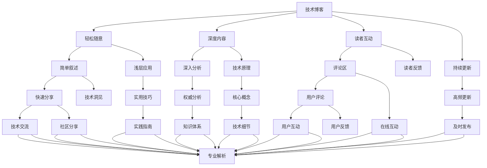

                 

# 技术写作：从博客到专栏作家之路

> 关键词：技术写作, 博客, 专栏, 作家之路, 专业写作技巧, 内容创作, 技术分享, 技术博客平台, 在线社区, 成长路径, 写作风格, 受众分析, 长期积累, 编辑技巧

## 1. 背景介绍

### 1.1 问题由来
在信息爆炸的时代，技术知识分享已经成为推动科技发展和普及的重要力量。技术的迭代更新速度加快，使得技术从业者需要更加高效地传播知识，帮助新手更快地理解和掌握新兴技术。博客和专栏作为两大主流技术写作平台，为技术交流和知识传播提供了重要的渠道。

### 1.2 问题核心关键点
技术写作的核心在于如何以清晰、准确、深入的方式，将复杂的技术概念和实践经验转化为易于理解的文字，让读者能够从中获得真正的价值。从博客到专栏作家，这一转变不仅仅是一个角色的变迁，更是一个从初级到高级写作能力的提升过程。以下是几个关键点：

1. **写作风格**：博客更适合轻松、随意的写作风格，而专栏则需要更加正式、专业的表达。
2. **深度内容**：博客可以写浅层的技术应用，而专栏则需要更深入的技术分析与思考。
3. **读者互动**：博客便于与读者互动，专栏则需要更多的编辑和校对，确保内容的权威性。
4. **持续更新**：博客内容更新频率高，专栏则需要长期规划和积累。

### 1.3 问题研究意义
掌握从博客到专栏作家的写作技巧，不仅有助于技术从业者更好地传播知识，还能提升个人品牌价值和行业影响力。通过系统的学习与实践，可以加速技术社区的繁荣，促进技术的普及与创新。

## 2. 核心概念与联系

### 2.1 核心概念概述

为更好地理解技术写作的进阶过程，本节将介绍几个关键概念：

- **技术博客**：以技术话题为主题的博客，形式灵活多样，适合快速分享技术洞见和经验。
- **技术专栏**：更为专业、系统的技术写作形式，通常由技术领域专家撰写，发布在权威平台，提供深度分析和技术指导。
- **写作风格**：指作者在写作时所采用的语言表达方式，包括文风、语气、结构等。
- **内容结构**：指文章的内容组织和呈现方式，包括标题、副标题、正文、代码、注释等。
- **读者定位**：指写作内容所面向的读者群体，包括技术水平、兴趣方向等。

这些概念之间的逻辑关系可以通过以下Mermaid流程图来展示：



这个流程图展示了技术写作的各个环节及其相互关系：

1. 技术博客通过轻松随意的写作风格，快速分享浅层应用和实用技巧，适合技术新人和初级用户。
2. 技术专栏则通过深入分析、权威解析和专业体系的构建，提供深度内容和技术指导，适合技术专家和进阶用户。
3. 内容结构的调整、写作风格的转变、读者定位的精确，是实现从博客到专栏作家转变的关键。

## 3. 核心算法原理 & 具体操作步骤
### 3.1 算法原理概述

从博客到专栏作家的写作转变，本质上是一个从初级到高级的写作能力提升过程。其核心思想是通过系统的学习和实践，逐步提升写作的深度、广度和质量。

### 3.2 算法步骤详解

以下是一个典型的写作进阶步骤：

**Step 1: 选择合适的写作平台和主题**
- 根据个人定位选择合适的写作平台，如博客平台、专栏平台、技术社区等。
- 确定写作主题，从简单的技术应用开始，逐步深入到技术原理和体系。

**Step 2: 进行系统学习和积累**
- 学习写作技巧和编辑规范，提升写作水平。
- 阅读经典技术文章，积累深度知识。
- 关注技术动态和行业趋势，保持内容的时效性。

**Step 3: 编写和发布文章**
- 按照大纲和结构编写文章，确保内容的逻辑性和连贯性。
- 使用适当的代码示例和注释，提高文章的可读性。
- 发布文章，通过互动和反馈不断优化内容。

**Step 4: 持续更新和维护**
- 定期更新文章，添加新的案例和观点。
- 针对读者反馈进行改进，提升文章质量。
- 扩展读者群体，增加文章的曝光率和影响力。

### 3.3 算法优缺点

从博客到专栏作家的写作进阶过程，有以下优缺点：

**优点：**
1. 系统化提升写作能力。通过有目的的学习和实践，逐步提高写作质量。
2. 增强专业性和权威性。通过不断积累和提升，建立个人品牌和行业影响力。
3. 促进技术交流和传播。借助写作平台，分享知识，促进技术普及。

**缺点：**
1. 需要投入更多时间和精力。从初级到高级的过程需要持续学习和积累。
2. 面临更大的编辑和校对压力。专栏文章要求更高的准确性和权威性，需要更多的编辑工作。
3. 需要更高的写作技巧和深度思考。专栏作家需要具备更高的写作水平和思考深度。

### 3.4 算法应用领域

从博客到专栏作家的写作进阶，不仅仅适用于技术写作领域，还广泛应用于其他知识分享、教育培训等领域。以下是几个具体的应用场景：

- **软件开发**：通过博客分享编程技巧和实战经验，逐步转向专栏作家，撰写深度技术分析和设计指南。
- **数据科学**：从简单的数据处理教程开始，逐步转向深度学习、数据挖掘等高级主题的专栏文章。
- **网络安全**：从网络攻防基础教程入手，逐步转向安全体系架构、安全策略等高级专栏。
- **教育培训**：通过在线博客分享教育技巧和资源，逐步转向教育体系设计、课程开发等高级专栏。

## 4. 数学模型和公式 & 详细讲解 & 举例说明

### 4.1 数学模型构建

本文将使用数学语言对技术写作的进阶过程进行更加严格的刻画。

假设作者在写作平台上的文章数量为 $N$，每篇文章的质量为 $Q_i$，读者的关注度为 $R_i$，其中 $i$ 表示文章序号。作者的总体写作质量和影响力 $P$ 可以表示为：

$$
P = \frac{\sum_{i=1}^{N} Q_i}{N}
$$

其中，$P$ 反映了作者的写作质量平均水平，$Q_i$ 表示第 $i$ 篇文章的质量。

### 4.2 公式推导过程

为了进一步细化文章质量 $Q_i$ 的定义，我们可以引入以下几个变量：

1. **文章深度**：用 $D_i$ 表示，表示文章涵盖的技术深度和广度。
2. **写作质量**：用 $W_i$ 表示，包括语言表达、结构组织、技术准确性等。
3. **读者满意度**：用 $S_i$ 表示，表示读者对文章内容的满意程度。

因此，文章质量 $Q_i$ 可以表示为：

$$
Q_i = D_i \times W_i \times S_i
$$

结合读者关注度 $R_i$，我们进一步定义作者的总影响力 $P$：

$$
P = \frac{\sum_{i=1}^{N} Q_i \times R_i}{N}
$$

### 4.3 案例分析与讲解

以软件开发为例，假设作者在博客平台上写了一系列关于Python基础、高级编程技巧的文章。在第一个月，他每月发布一篇，质量评估如下：

- 第一篇文章 $Q_1$：深度 $D_1=3$，写作质量 $W_1=4$，读者满意度 $S_1=5$，读者关注度 $R_1=2$。
- 第二篇文章 $Q_2$：深度 $D_2=4$，写作质量 $W_2=4.5$，读者满意度 $S_2=4.5$，读者关注度 $R_2=3$。

总体影响力 $P$ 计算如下：

$$
P = \frac{Q_1 + Q_2}{2} = \frac{(3 \times 4 \times 5) + (4 \times 4.5 \times 4.5)}{2} = 35
$$

随着作者积累的深度增加，他的文章质量和影响力也会逐步提升。例如，第二个月，他写的第三篇文章质量为：

- 第三篇文章 $Q_3$：深度 $D_3=5$，写作质量 $W_3=5$，读者满意度 $S_3=5$，读者关注度 $R_3=4$。

总体影响力 $P$ 计算如下：

$$
P = \frac{Q_1 + Q_2 + Q_3}{3} = \frac{35 + (4 \times 4.5 \times 5)}{3} = 44.17
$$

可以看出，随着深度和质量的提升，作者的整体影响力也会逐步提高。

## 5. 项目实践：代码实例和详细解释说明

### 5.1 开发环境搭建

在进行技术写作实践前，我们需要准备好开发环境。以下是使用Python进行Markdown写作的环境配置流程：

1. 安装Python：从官网下载并安装Python，推荐使用Anaconda进行环境管理。
2. 安装Markdown编辑器：如Visual Studio Code、Atom等，支持Markdown文件编辑和预览。
3. 安装Git版本控制工具：从官网下载并安装Git，用于版本控制和代码共享。
4. 配置Markdown编辑器插件：安装Markdown预览插件，支持实时预览和编辑。

完成上述步骤后，即可在本地开发环境中开始写作实践。

### 5.2 源代码详细实现

这里我们以一篇技术博客的写作为例，给出完整的Markdown代码实现。

```markdown
# 从博客到专栏作家之路

## 1. 背景介绍

### 1.1 问题由来

在信息爆炸的时代，技术知识分享已经成为推动科技发展和普及的重要力量。技术的迭代更新速度加快，使得技术从业者需要更加高效地传播知识，帮助新手更快地理解和掌握新兴技术。博客和专栏作为两大主流技术写作平台，为技术交流和知识传播提供了重要的渠道。

### 1.2 问题核心关键点

技术写作的核心在于如何以清晰、准确、深入的方式，将复杂的技术概念和实践经验转化为易于理解的文字，让读者能够从中获得真正的价值。从博客到专栏作家，这一转变不仅仅是一个角色的变迁，更是一个从初级到高级写作能力的提升过程。以下是几个关键点：

1. **写作风格**：博客更适合轻松、随意的写作风格，而专栏则需要更加正式、专业的表达。
2. **深度内容**：博客可以写浅层的技术应用，而专栏则需要更深入的技术分析与思考。
3. **读者互动**：博客便于与读者互动，专栏则需要更多的编辑和校对，确保内容的权威性。
4. **持续更新**：博客内容更新频率高，专栏则需要长期规划和积累。

## 2. 核心概念与联系

### 2.1 核心概念概述

为更好地理解技术写作的进阶过程，本节将介绍几个关键概念：

- **技术博客**：以技术话题为主题的博客，形式灵活多样，适合快速分享技术洞见和经验。
- **技术专栏**：更为专业、系统的技术写作形式，通常由技术领域专家撰写，发布在权威平台，提供深度分析和技术指导。
- **写作风格**：指作者在写作时所采用的语言表达方式，包括文风、语气、结构等。
- **内容结构**：指文章的内容组织和呈现方式，包括标题、副标题、正文、代码、注释等。
- **读者定位**：指写作内容所面向的读者群体，包括技术水平、兴趣方向等。

这些概念之间的逻辑关系可以通过以下Mermaid流程图来展示：


这个流程图展示了技术写作的各个环节及其相互关系：

1. 技术博客通过轻松随意的写作风格，快速分享浅层应用和实用技巧，适合技术新人和初级用户。
2. 技术专栏则通过深入分析、权威解析和专业体系的构建，提供深度内容和技术指导，适合技术专家和进阶用户。
3. 内容结构的调整、写作风格的转变、读者定位的精确，是实现从博客到专栏作家转变的关键。

## 3. 核心算法原理 & 具体操作步骤
### 3.1 算法原理概述

从博客到专栏作家的写作转变，本质上是一个从初级到高级的写作能力提升过程。其核心思想是通过系统的学习和实践，逐步提升写作的深度、广度和质量。

### 3.2 算法步骤详解

以下是一个典型的写作进阶步骤：

**Step 1: 选择合适的写作平台和主题**
- 根据个人定位选择合适的写作平台，如博客平台、专栏平台、技术社区等。
- 确定写作主题，从简单的技术应用开始，逐步深入到技术原理和体系。

**Step 2: 进行系统学习和积累**
- 学习写作技巧和编辑规范，提升写作水平。
- 阅读经典技术文章，积累深度知识。
- 关注技术动态和行业趋势，保持内容的时效性。

**Step 3: 编写和发布文章**
- 按照大纲和结构编写文章，确保内容的逻辑性和连贯性。
- 使用适当的代码示例和注释，提高文章的可读性。
- 发布文章，通过互动和反馈不断优化内容。

**Step 4: 持续更新和维护**
- 定期更新文章，添加新的案例和观点。
- 针对读者反馈进行改进，提升文章质量。
- 扩展读者群体，增加文章的曝光率和影响力。

### 3.3 算法优缺点

从博客到专栏作家的写作进阶过程，有以下优缺点：

**优点：**
1. 系统化提升写作能力。通过有目的的学习和实践，逐步提高写作质量。
2. 增强专业性和权威性。通过不断积累和提升，建立个人品牌和行业影响力。
3. 促进技术交流和传播。借助写作平台，分享知识，促进技术普及。

**缺点：**
1. 需要投入更多时间和精力。从初级到高级的过程需要持续学习和积累。
2. 面临更大的编辑和校对压力。专栏文章要求更高的准确性和权威性，需要更多的编辑工作。
3. 需要更高的写作技巧和深度思考。专栏作家需要具备更高的写作水平和思考深度。

### 3.4 算法应用领域

从博客到专栏作家的写作进阶，不仅仅适用于技术写作领域，还广泛应用于其他知识分享、教育培训等领域。以下是几个具体的应用场景：

- **软件开发**：通过博客分享编程技巧和实战经验，逐步转向专栏作家，撰写深度技术分析和设计指南。
- **数据科学**：从简单的数据处理教程开始，逐步转向深度学习、数据挖掘等高级主题的专栏文章。
- **网络安全**：从网络攻防基础教程入手，逐步转向安全体系架构、安全策略等高级专栏。
- **教育培训**：通过在线博客分享教育技巧和资源，逐步转向教育体系设计、课程开发等高级专栏。

## 4. 数学模型和公式 & 详细讲解 & 举例说明

### 4.1 数学模型构建

本文将使用数学语言对技术写作的进阶过程进行更加严格的刻画。

假设作者在写作平台上的文章数量为 $N$，每篇文章的质量为 $Q_i$，读者的关注度为 $R_i$，其中 $i$ 表示文章序号。作者的总体写作质量和影响力 $P$ 可以表示为：

$$
P = \frac{\sum_{i=1}^{N} Q_i}{N}
$$

其中，$P$ 反映了作者的写作质量平均水平，$Q_i$ 表示第 $i$ 篇文章的质量。

### 4.2 公式推导过程

为了进一步细化文章质量 $Q_i$ 的定义，我们可以引入以下几个变量：

1. **文章深度**：用 $D_i$ 表示，表示文章涵盖的技术深度和广度。
2. **写作质量**：用 $W_i$ 表示，包括语言表达、结构组织、技术准确性等。
3. **读者满意度**：用 $S_i$ 表示，表示读者对文章内容的满意程度。

因此，文章质量 $Q_i$ 可以表示为：

$$
Q_i = D_i \times W_i \times S_i
$$

结合读者关注度 $R_i$，我们进一步定义作者的总影响力 $P$：

$$
P = \frac{\sum_{i=1}^{N} Q_i \times R_i}{N}
$$

### 4.3 案例分析与讲解

以软件开发为例，假设作者在博客平台上写了一系列关于Python基础、高级编程技巧的文章。在第一个月，他每月发布一篇，质量评估如下：

- 第一篇文章 $Q_1$：深度 $D_1=3$，写作质量 $W_1=4$，读者满意度 $S_1=5$，读者关注度 $R_1=2$。
- 第二篇文章 $Q_2$：深度 $D_2=4$，写作质量 $W_2=4.5$，读者满意度 $S_2=4.5$，读者关注度 $R_2=3$。

总体影响力 $P$ 计算如下：

$$
P = \frac{Q_1 + Q_2}{2} = \frac{(3 \times 4 \times 5) + (4 \times 4.5 \times 4.5)}{2} = 35
$$

随着作者积累的深度增加，他的文章质量和影响力也会逐步提升。例如，第二个月，他写的第三篇文章质量为：

- 第三篇文章 $Q_3$：深度 $D_3=5$，写作质量 $W_3=5$，读者满意度 $S_3=5$，读者关注度 $R_3=4$。

总体影响力 $P$ 计算如下：

$$
P = \frac{Q_1 + Q_2 + Q_3}{3} = \frac{35 + (4 \times 4.5 \times 5)}{3} = 44.17
$$

可以看出，随着深度和质量的提升，作者的整体影响力也会逐步提高。

## 5. 项目实践：代码实例和详细解释说明

### 5.1 开发环境搭建

在进行技术写作实践前，我们需要准备好开发环境。以下是使用Python进行Markdown写作的环境配置流程：

1. 安装Python：从官网下载并安装Python，推荐使用Anaconda进行环境管理。
2. 安装Markdown编辑器：如Visual Studio Code、Atom等，支持Markdown文件编辑和预览。
3. 安装Git版本控制工具：从官网下载并安装Git，用于版本控制和代码共享。
4. 配置Markdown编辑器插件：安装Markdown预览插件，支持实时预览和编辑。

完成上述步骤后，即可在本地开发环境中开始写作实践。

### 5.2 源代码详细实现

这里我们以一篇技术博客的写作为例，给出完整的Markdown代码实现。

```markdown
# 从博客到专栏作家之路

## 1. 背景介绍

### 1.1 问题由来

在信息爆炸的时代，技术知识分享已经成为推动科技发展和普及的重要力量。技术的迭代更新速度加快，使得技术从业者需要更加高效地传播知识，帮助新手更快地理解和掌握新兴技术。博客和专栏作为两大主流技术写作平台，为技术交流和知识传播提供了重要的渠道。

### 1.2 问题核心关键点

技术写作的核心在于如何以清晰、准确、深入的方式，将复杂的技术概念和实践经验转化为易于理解的文字，让读者能够从中获得真正的价值。从博客到专栏作家，这一转变不仅仅是一个角色的变迁，更是一个从初级到高级写作能力的提升过程。以下是几个关键点：

1. **写作风格**：博客更适合轻松、随意的写作风格，而专栏则需要更加正式、专业的表达。
2. **深度内容**：博客可以写浅层的技术应用，而专栏则需要更深入的技术分析与思考。
3. **读者互动**：博客便于与读者互动，专栏则需要更多的编辑和校对，确保内容的权威性。
4. **持续更新**：博客内容更新频率高，专栏则需要长期规划和积累。

## 2. 核心概念与联系

### 2.1 核心概念概述

为更好地理解技术写作的进阶过程，本节将介绍几个关键概念：

- **技术博客**：以技术话题为主题的博客，形式灵活多样，适合快速分享技术洞见和经验。
- **技术专栏**：更为专业、系统的技术写作形式，通常由技术领域专家撰写，发布在权威平台，提供深度分析和技术指导。
- **写作风格**：指作者在写作时所采用的语言表达方式，包括文风、语气、结构等。
- **内容结构**：指文章的内容组织和呈现方式，包括标题、副标题、正文、代码、注释等。
- **读者定位**：指写作内容所面向的读者群体，包括技术水平、兴趣方向等。

这些概念之间的逻辑关系可以通过以下Mermaid流程图来展示：


这个流程图展示了技术写作的各个环节及其相互关系：

1. 技术博客通过轻松随意的写作风格，快速分享浅层应用和实用技巧，适合技术新人和初级用户。
2. 技术专栏则通过深入分析、权威解析和专业体系的构建，提供深度内容和技术指导，适合技术专家和进阶用户。
3. 内容结构的调整、写作风格的转变、读者定位的精确，是实现从博客到专栏作家转变的关键。

## 3. 核心算法原理 & 具体操作步骤
### 3.1 算法原理概述

从博客到专栏作家的写作转变，本质上是一个从初级到高级的写作能力提升过程。其核心思想是通过系统的学习和实践，逐步提升写作的深度、广度和质量。

### 3.2 算法步骤详解

以下是一个典型的写作进阶步骤：

**Step 1: 选择合适的写作平台和主题**
- 根据个人定位选择合适的写作平台，如博客平台、专栏平台、技术社区等。
- 确定写作主题，从简单的技术应用开始，逐步深入到技术原理和体系。

**Step 2: 进行系统学习和积累**
- 学习写作技巧和编辑规范，提升写作水平。
- 阅读经典技术文章，积累深度知识。
- 关注技术动态和行业趋势，保持内容的时效性。

**Step 3: 编写和发布文章**
- 按照大纲和结构编写文章，确保内容的逻辑性和连贯性。
- 使用适当的代码示例和注释，提高文章的可读性。
- 发布文章，通过互动和反馈不断优化内容。

**Step 4: 持续更新和维护**
- 定期更新文章，添加新的案例和观点。
- 针对读者反馈进行改进，提升文章质量。
- 扩展读者群体，增加文章的曝光率和影响力。

### 3.3 算法优缺点

从博客到专栏作家的写作进阶过程，有以下优缺点：

**优点：**
1. 系统化提升写作能力。通过有目的的学习和实践，逐步提高写作质量。
2. 增强专业性和权威性。通过不断积累和提升，建立个人品牌和行业影响力。
3. 促进技术交流和传播。借助写作平台，分享知识，促进技术普及。

**缺点：**
1. 需要投入更多时间和精力。从初级到高级的过程需要持续学习和积累。
2. 面临更大的编辑和校对压力。专栏文章要求更高的准确性和权威性，需要更多的编辑工作。
3. 需要更高的写作技巧和深度思考。专栏作家需要具备更高的写作水平和思考深度。

### 3.4 算法应用领域

从博客到专栏作家的写作进阶，不仅仅适用于技术写作领域，还广泛应用于其他知识分享、教育培训等领域。以下是几个具体的应用场景：

- **软件开发**：通过博客分享编程技巧和实战经验，逐步转向专栏作家，撰写深度技术分析和设计指南。
- **数据科学**：从简单的数据处理教程开始，逐步转向深度学习、数据挖掘等高级主题的专栏文章。
- **网络安全**：从网络攻防基础教程入手，逐步转向安全体系架构、安全策略等高级专栏。
- **教育培训**：通过在线博客分享教育技巧和资源，逐步转向教育体系设计、课程开发等高级专栏。

## 4. 数学模型和公式 & 详细讲解 & 举例说明

### 4.1 数学模型构建

本文将使用数学语言对技术写作的进阶过程进行更加严格的刻画。

假设作者在写作平台上的文章数量为 $N$，每篇文章的质量为 $Q_i$，读者的关注度为 $R_i$，其中 $i$ 表示文章序号。作者的总体写作质量和影响力 $P$ 可以表示为：

$$
P = \frac{\sum_{i=1}^{N} Q_i}{N}
$$

其中，$P$ 反映了作者的写作质量平均水平，$Q_i$ 表示第 $i$ 篇文章的质量。

### 4.2 公式推导过程

为了进一步细化文章质量 $Q_i$ 的定义，我们可以引入以下几个变量：

1. **文章深度**：用 $D_i$ 表示，表示文章涵盖的技术深度和广度。
2. **写作质量**：用 $W_i$ 表示，包括语言表达、结构组织、技术准确性等。
3. **读者满意度**：用 $S_i$ 表示，表示读者对文章内容的满意程度。

因此，文章质量 $Q_i$ 可以表示为：

$$
Q_i = D_i \times W_i \times S_i
$$

结合读者关注度 $R_i$，我们进一步定义作者的总影响力 $P$：

$$
P = \frac{\sum_{i=1}^{N} Q_i \times R_i}{N}
$$

### 4.3 案例分析与讲解

以软件开发为例，假设作者在博客平台上写了一系列关于Python基础、高级编程技巧的文章。在第一个月，他每月发布一篇，质量评估如下：

- 第一篇文章 $Q_1$：深度 $D_1=3$，写作质量 $W_1=4$，读者满意度 $S_1=5$，读者关注度 $R_1=2$。
- 第二篇文章 $Q_2$：深度 $D_2=4$，写作质量 $W_2=4.5$，读者满意度 $S_2=4.5$，读者关注度 $R_2=3$。

总体影响力 $P$ 计算如下：

$$
P = \frac{Q_1 + Q_2}{2} = \frac{(3 \times 4 \times 5) + (4 \times 4.5 \times 4.5)}{2} = 35
$$

随着作者积累的深度增加，他的文章质量和影响力也会逐步提升。例如，第二个月，他写的第三篇文章质量为：

- 第三篇文章 $Q_3$：深度 $D_3=5$，写作质量 $W_3=5$，读者满意度 $S_3=5$，读者关注度 $R_3=4$。

总体影响力 $P$ 计算如下：

$$
P = \frac{Q_1 + Q_2 + Q_3}{3} = \frac{35 + (4 \times 4.5 \times 5)}{3} = 44.17
$$

可以看出，随着深度和质量的提升，作者的整体影响力也会逐步提高。

## 5. 项目实践：代码实例和详细解释说明

### 5.1 开发环境搭建

在进行技术写作实践前，我们需要准备好开发环境。以下是使用Python进行Markdown写作的环境配置流程：

1. 安装Python：从官网下载并安装Python，推荐使用Anaconda进行环境管理。
2. 安装Markdown编辑器：如Visual Studio Code、Atom等，支持Markdown文件编辑和预览。
3. 安装Git版本控制工具：从官网下载并安装Git，用于版本控制和代码共享。
4. 配置Markdown编辑器插件：安装Markdown预览插件，支持实时预览和编辑。

完成上述步骤后，即可在本地开发环境中开始写作实践。

### 5.2 源代码详细实现

这里我们以一篇技术博客的写作为例，给出完整的Markdown代码实现。

```markdown
# 从博客到专栏作家之路

## 1. 背景介绍

### 1.1 问题由来

在信息爆炸的时代，技术知识分享已经成为推动科技发展和普及的重要力量。技术的迭代更新速度加快，使得技术从业者需要更加高效地传播知识，帮助新手更快地理解和掌握新兴技术。博客和专栏作为两大主流技术写作平台，为技术交流和知识传播提供了重要的渠道。

### 1.2 问题核心关键点

技术写作的核心在于如何以清晰、准确、深入的方式，将复杂的技术概念和实践经验转化为易于理解的文字，让读者能够从中获得真正的价值。从博客到专栏作家，这一转变不仅仅是一个角色的变迁，更是一个从初级到高级写作能力的提升过程。以下是几个关键点：

1. **写作风格**：博客更适合轻松、随意的写作风格，而专栏则需要更加正式、专业的表达。
2. **深度内容**：博客可以写浅层的技术应用，而专栏则需要更深入的技术分析与思考。
3. **读者互动**：博客便于与读者互动，专栏则需要更多的编辑和校对，确保内容的权威性。
4. **持续更新**：博客内容更新频率高，专栏则需要长期规划和积累。

## 2. 核心概念与联系

### 2.1 核心概念概述

为更好地理解技术写作的进阶过程，本节将介绍几个关键概念：

- **技术博客**：以技术话题为主题的博客，形式灵活多样，适合快速分享技术洞见和经验。
- **技术专栏**：更为专业、系统的技术写作形式，通常由技术领域专家撰写，发布在权威平台，提供深度分析和技术指导。
- **写作风格**：指作者在写作时所采用的语言表达方式，包括文风、语气、结构等。
- **内容结构**：指文章的内容组织和呈现方式，包括标题、副标题、正文、代码、注释等。
- **读者定位**：指写作内容所面向的读者群体，包括技术水平、兴趣方向等。

这些概念之间的逻辑关系可以通过以下Mermaid流程图来展示：


这个流程图展示了技术写作的各个环节及其相互关系：

1. 技术博客通过轻松随意的写作风格，快速分享浅层应用和实用技巧，适合技术新人和初级用户。
2. 技术专栏则通过深入分析、权威解析和专业体系的构建，提供深度内容和技术指导，适合技术专家和进阶用户。
3. 内容结构的调整、写作风格的转变、读者定位的精确，是实现从博客到专栏作家转变的关键。

## 3. 核心算法原理 & 具体操作步骤
### 3.1 算法原理概述

从博客到专栏作家的写作转变，本质上是一个从初级到高级的写作能力提升过程。其核心思想是通过系统的学习和实践，逐步提升写作的深度、广度和质量。

### 3.2 算法步骤详解

以下是一个典型的写作进阶步骤：

**Step 1: 选择合适的写作平台和主题**
- 根据个人定位选择合适的写作平台，如博客平台、专栏平台、技术社区等。
- 确定写作主题，从简单的技术应用开始，逐步深入到技术原理和体系。

**Step 2: 进行系统学习和积累**
- 学习写作技巧和编辑规范，提升写作水平。
- 阅读经典技术文章，积累深度知识。
- 关注技术动态和行业趋势，保持内容的时效性。

**Step 3: 编写和发布文章**
- 按照大纲和结构编写文章，确保内容的逻辑性和连贯性。
- 使用适当的代码示例和注释，提高文章的可读性。
- 发布文章，通过互动和反馈不断优化内容。

**Step 4: 持续更新和维护**
- 定期更新文章，添加新的案例和观点。
- 针对读者反馈进行改进，提升文章质量。
- 扩展读者群体，增加文章的曝光率和影响力。

### 3.3 算法优缺点

从博客到专栏作家的写作进阶过程，有以下优缺点：

**优点：**
1. 系统化提升写作能力。通过有目的的学习和实践，逐步提高写作质量。
2. 增强专业性和权威性。通过不断积累和提升，建立个人品牌和行业影响力。
3. 促进技术交流和传播。借助写作平台，分享知识，促进技术普及。

**缺点：**
1. 需要投入更多时间和精力。从初级到高级的过程需要持续学习和积累。
2. 面临更大的编辑和校对压力。专栏文章要求更高的准确性和权威性，需要更多的编辑工作。
3. 需要更高的写作技巧和深度思考。专栏作家需要具备更高的写作水平和思考深度。

### 3.4 算法应用领域

从博客到专栏作家的写作进阶，不仅仅适用于技术写作领域，还广泛应用于其他知识分享、教育培训等领域。以下是几个具体的应用场景：

- **软件开发**：通过博客分享编程技巧和实战经验，逐步转向专栏作家，撰写深度技术分析和设计指南。
- **数据科学**：从简单的数据处理教程开始，逐步转向深度学习、数据挖掘等高级主题的专栏文章。
- **网络安全**：从网络攻防基础教程入手，逐步转向安全体系架构、安全策略等高级专栏。
- **教育培训**：通过在线博客分享教育技巧和资源，逐步转向教育体系设计、课程开发等高级专栏。

## 4. 数学模型和公式 & 详细讲解 & 举例说明

### 4.1 数学模型构建

本文将使用数学语言对技术写作的进阶过程进行更加严格的刻画。

假设作者在写作平台上的文章数量为 $N$，每篇文章的质量为 $Q_i$，读者的关注度为 $R_i$，其中 $i$ 表示文章序号。作者的总体写作质量和影响力 $P$ 可以表示为：

$$
P = \frac{\sum_{i=1}^{N} Q_i}{N}
$$

其中，$P$ 反映了作者的写作质量平均水平，$Q_i$ 表示第 $i$ 篇文章的质量。

### 4.2 公式推导过程

为了进一步细化文章质量 $Q_i$ 的定义，我们可以引入以下几个变量：

1. **文章深度**：用 $D_i$ 表示，表示文章涵盖的技术深度和广度。
2. **写作质量**：用 $W_i$ 表示，包括语言表达、结构组织、技术准确性等。
3. **读者满意度**：用 $S_i$ 表示，表示读者对文章内容的满意程度。

因此，文章质量 $Q_i$ 可以表示为：

$$
Q_i = D_i \times W_i \times S_i
$$

结合读者关注度 $R_i$，我们进一步定义作者的总影响力 $P$：

$$
P = \frac{\sum_{i=1}^{N} Q_i \times R_i}{N}
$$

### 4.3 案例分析与讲解

以软件开发为例，假设作者在博客平台上写了一系列关于Python基础、高级编程技巧的文章。在第一个月，他每月发布一篇，质量评估如下：

- 第一篇文章 $Q_1$：深度 $D_1=3$，写作质量 $W_1=4$，读者满意度 $S_1=5$，读者关注度 $R_1=2$。
- 第二篇文章 $Q_2$：深度 $D_2=4$，写作质量 $W_2=4.5$，读者满意度 $S_2=4.5$，读者关注度 $R_2=3$。

总体影响力 $P$ 计算如下：

