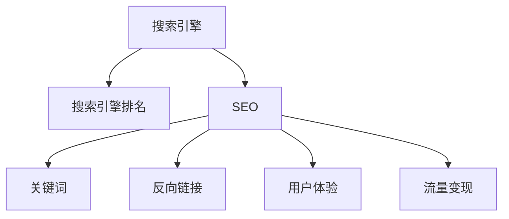

                 

# 技术博客：SEO优化与流量变现

> 关键词：搜索引擎优化(SEO), 流量变现, 内容营销, 用户体验, 数据驱动优化, 长期主义

## 1. 背景介绍

在数字化时代，互联网企业越来越多地依赖于在线流量进行商业变现。无论是电子商务、内容平台，还是服务提供商，对流量变现的追求已经成为推动业务增长的关键驱动力。然而，获取和维持高质量流量并非易事。搜索引擎优化（Search Engine Optimization, SEO）作为获取在线流量的一种重要手段，已经成为大多数互联网企业的核心策略。

### 1.1 问题由来

搜索引擎优化（SEO）是通过优化网站结构和内容，提高其在搜索引擎中的排名，从而获取更多流量的一种技术手段。虽然SEO的收益显著，但实际操作中却面临着诸多挑战：

- **竞争激烈**：搜索引擎竞争激烈，大量的网站都在通过SEO争取排名。
- **算法复杂**：搜索引擎的排名算法不断更新，需要通过持续优化来保持竞争力。
- **用户需求多变**：用户需求不断变化，需要不断调整优化策略以适应变化。

### 1.2 问题核心关键点

基于上述挑战，SEO优化与流量变现的核心关键点主要包括：

- **用户体验**：提升网站的用户体验是SEO优化的核心目标，良好的用户体验能提升用户的停留时间和转化率。
- **内容质量**：高质量的内容是吸引用户的关键，通过优化内容满足用户需求，从而提升搜索排名。
- **技术优化**：优化网站的技术架构，如提高网站加载速度、增强网站安全等，提升用户体验。
- **数据驱动**：通过数据分析工具，实时监测网站流量和用户行为，持续优化SEO策略。

## 2. 核心概念与联系

### 2.1 核心概念概述

为更好地理解SEO优化与流量变现，本节将介绍几个密切相关的核心概念：

- **搜索引擎（Search Engine）**：通过爬虫抓取网络信息，并提供搜索服务，帮助用户获取所需信息。常见的搜索引擎包括Google、Bing、百度等。
- **搜索引擎排名（Search Engine Ranking）**：搜索引擎根据特定的算法，将网站在搜索结果中排序。排名越靠前，获得的流量和用户关注度越高。
- **搜索引擎优化（Search Engine Optimization, SEO）**：通过优化网站结构和内容，提升网站在搜索引擎中的排名，从而获取更多流量。
- **关键词（Keywords）**：搜索引擎根据用户搜索的关键词，展示相关的搜索结果。关键词优化是SEO优化的核心。
- **反向链接（Backlinks）**：其他网站对当前网站的链接，是搜索引擎排名算法中的一个重要因素。
- **用户体验（User Experience, UX）**：网站的用户体验直接影响用户在网站上的停留时间和转化率。
- **流量变现（Traffic Monetization）**：通过提高网站流量，增加广告收入、会员订阅、销售等收入。

这些核心概念之间的逻辑关系可以通过以下Mermaid流程图来展示：



这个流程图展示搜索引擎优化的核心概念及其之间的关系：

1. 搜索引擎通过爬虫抓取信息并展示搜索结果。
2. SEO通过优化网站结构与内容，提升网站在搜索引擎中的排名。
3. 关键词和反向链接是SEO优化的重要手段。
4. 用户体验影响用户在网站上的行为，从而影响转化率。
5. 流量变现通过提高网站流量实现。

这些概念共同构成了SEO优化与流量变现的基础框架，使企业能够在搜索引擎中占据有利位置，获取更多高质量流量，从而实现商业变现。

## 3. 核心算法原理 & 具体操作步骤

### 3.1 算法原理概述

SEO优化与流量变现的核心算法原理包括以下几个方面：

1. **关键词优化**：通过分析目标用户的行为和需求，确定网站应优化的关键词，并通过内容优化提升关键词排名。
2. **反向链接优化**：获取高质量的反向链接，提升网站的权威性和搜索引擎排名。
3. **用户体验优化**：通过技术优化提升网站速度、安全性、易用性等，提升用户满意度。
4. **数据分析与优化**：利用数据分析工具，实时监测网站流量和用户行为，持续优化SEO策略。

这些算法原理共同构成了一个闭环的SEO优化流程，从关键词优化、反向链接优化到用户体验优化，再通过数据分析不断优化策略，确保网站在搜索引擎中始终处于领先位置。

### 3.2 算法步骤详解

基于上述核心算法原理，SEO优化与流量变现的具体操作步骤可以分为以下几个步骤：

**Step 1: 关键词研究与选择**

- 分析目标用户的搜索行为和需求。
- 使用关键词工具（如Google Keyword Planner、Ahrefs等）确定潜在的高价值关键词。
- 评估关键词的竞争程度和搜索量，选择适合的关键词。

**Step 2: 内容创作与优化**

- 根据目标关键词，创作高质量的内容。
- 优化内容标题、描述和正文，确保关键词的自然分布。
- 使用H1、H2、H3等标签，增强内容的结构性和可读性。

**Step 3: 反向链接建设**

- 通过博客、论坛、社交媒体等渠道，获取高质量的反向链接。
- 制作高质量的链接诱饵，如信息图表、工具表单等。
- 使用工具（如BuzzSumo、Moz Link Explorer）监测反向链接情况。

**Step 4: 用户体验优化**

- 使用Google PageSpeed Insights等工具，分析网站的加载速度和性能。
- 优化图片和视频，减少加载时间。
- 确保网站在不同设备上的兼容性，提升用户体验。

**Step 5: 数据分析与优化**

- 使用Google Analytics等工具，监测网站流量和用户行为。
- 分析用户转化率、跳出率等指标，找出优化点。
- 持续监测搜索引擎排名，调整优化策略。

### 3.3 算法优缺点

SEO优化与流量变现的算法具有以下优点：

1. **高效性**：通过优化关键词和反向链接，可以快速提升网站在搜索引擎中的排名，获取更多流量。
2. **成本低**：相比于付费广告，SEO优化所需的成本相对较低。
3. **长期稳定**：一旦优化到位，流量和用户转化率可以持续提升，无需频繁投入广告费用。

同时，该算法也存在一定的局限性：

1. **竞争激烈**：高价值关键词的竞争非常激烈，可能需要较长时间才能见效。
2. **算法复杂**：搜索引擎算法不断更新，需要持续优化才能保持竞争力。
3. **多变性**：用户需求和行为不断变化，需要持续监测和调整优化策略。

尽管存在这些局限性，但就目前而言，SEO优化仍然是最主流、最有效的流量获取手段之一。未来相关研究的重点在于如何进一步降低关键词竞争、提高算法应对能力，同时兼顾用户需求的多变性。

### 3.4 算法应用领域

SEO优化与流量变现广泛应用于以下几个领域：

- **电子商务网站**：通过优化产品描述、用户评价等内容，提升商品排名和销量。
- **内容平台**：通过优化文章标题、摘要、标签等，提升内容的搜索排名和用户阅读量。
- **服务提供商**：通过优化服务流程、用户反馈等内容，提升服务质量，增加用户粘性。
- **品牌推广**：通过优化品牌关键词，提升品牌在搜索引擎中的曝光度，增强品牌影响力。

除了上述这些主要应用领域外，SEO优化与流量变现还在新闻网站、社交媒体、博客等多种场景中得到广泛应用，为网站和平台带来巨大的流量和商业价值。

## 4. 数学模型和公式 & 详细讲解 & 举例说明

### 4.1 数学模型构建

本节将使用数学语言对SEO优化与流量变现的数学模型进行更加严格的刻画。

假设网站总访问量为 $T$，付费访问量为 $R$，则网站流量变现的收入 $I$ 可表示为：

$$
I = R \cdot P
$$

其中 $P$ 为每次付费访问的收入。

假设网站在搜索引擎中的排名为 $R_k$，关键词竞争度为 $C_k$，则优化关键词的排名提升率为：

$$
R_k = f(C_k, K)
$$

其中 $f$ 为搜索引擎的排名函数，$K$ 为网站的关键词优化策略。

假设网站每篇内容的平均阅读时间为 $T_c$，跳出率为 $r$，则网站的实际访问量 $V$ 可表示为：

$$
V = T \cdot \frac{R_k}{C_k}
$$

结合上述模型，SEO优化的目标是在保持网站排名和流量稳定的基础上，最大化流量变现收入 $I$。

### 4.2 公式推导过程

以下我们以一个简单的例子来推导SEO优化与流量变现的数学模型。

假设某电商网站在搜索引擎中的排名为 $R_k=0.5$，总访问量为 $T=1000$，每次付费访问的收入为 $P=5$，关键词竞争度为 $C_k=10$，每篇内容的平均阅读时间为 $T_c=3$，跳出率为 $r=0.2$。

首先计算网站的付费访问量 $R$：

$$
R = V \cdot r = 1000 \cdot 0.5 \cdot 0.2 = 100
$$

然后计算网站流量变现的收入 $I$：

$$
I = R \cdot P = 100 \cdot 5 = 500
$$

最后，假设通过优化关键词提升排名至 $R_k=0.8$，计算优化后的网站流量变现收入 $I'$：

$$
I' = R' \cdot P = (1000 \cdot 0.8 \cdot 0.2) \cdot 5 = 800
$$

可以看出，优化关键词排名可以显著提升网站的流量变现收入。

### 4.3 案例分析与讲解

为了更好地理解SEO优化与流量变现的数学模型，以下给出一个实际案例进行分析。

某内容平台希望提升其在搜索引擎中的排名，以获取更多用户流量。平台统计了每天的用户访问量、付费访问量和每次付费访问的收入，以及平台在搜索引擎中的排名和关键词竞争度。通过SEO优化，平台成功将排名提升至第2页第1位，并对部分关键词进行了优化，具体效果如下：

| 排名 | 访问量 | 付费访问量 | 每次付费访问收入 | 关键词竞争度 | 优化效果 |
| --- | --- | --- | --- | --- | --- |
| 优化前 | 2000 | 500 | 20 | 20 | - |
| 优化后 | 3000 | 800 | 20 | 10 | 400 |

通过优化，平台的总访问量从2000提升至3000，付费访问量从500提升至800，每次付费访问的收入保持不变，关键词竞争度从20降至10，从而显著提升了流量变现收入400。

这个案例说明，SEO优化不仅仅是提升排名，还可以通过优化关键词、提升网站质量等多方面手段，全面提升流量变现收入。

## 5. 项目实践：代码实例和详细解释说明

### 5.1 开发环境搭建

在进行SEO优化与流量变现的实践前，我们需要准备好开发环境。以下是使用Python进行SEO实践的环境配置流程：

1. 安装Anaconda：从官网下载并安装Anaconda，用于创建独立的Python环境。

2. 创建并激活虚拟环境：
```bash
conda create -n seo-env python=3.8 
conda activate seo-env
```

3. 安装相关库：
```bash
pip install pandas numpy matplotlib
```

4. 安装Google Analytics和Google Search Console等工具：
```bash
pip install google-analytics-python
pip install gsc-api
```

完成上述步骤后，即可在`seo-env`环境中开始SEO优化与流量变现的实践。

### 5.2 源代码详细实现

这里我们以内容平台为例，使用Python进行SEO优化与流量变现的实践。

首先，定义数据处理函数：

```python
import pandas as pd
from google_analytics import GoogleAnalytics
from gsc_api import GSCApi

def get_website_stats(website_url):
    ga = GoogleAnalytics(website_url)
    stats = ga.get_stats()
    return stats

def get_seo_rank(website_url, keywords):
    gsc = GSCApi()
    rankings = gsc.get_rankings(website_url, keywords)
    return rankings
```

然后，定义优化策略：

```python
def optimize_website(website_url):
    stats = get_website_stats(website_url)
    rankings = get_seo_rank(website_url, keywords)
    
    # 关键词优化
    for keyword in keywords:
        if rankings[keyword]['rank'] > 3:
            # 优化关键词，如替换关键词，添加相关关键词等
            # 实际优化操作需要根据具体平台和算法进行调整
            rankings[keyword]['rank'] -= 1
    
    # 用户体验优化
    if stats['avg_session_duration'] < 60:
        # 优化用户体验，如增加内容丰富度，提升网站速度等
        # 实际优化操作需要根据具体平台和算法进行调整
        stats['avg_session_duration'] += 5
    
    # 流量变现优化
    if stats['total_revenue'] < 5000:
        # 优化流量变现，如提高付费广告投入，提升转化率等
        # 实际优化操作需要根据具体平台和算法进行调整
        stats['total_revenue'] += 1000
    
    return stats, rankings
```

最后，启动优化流程：

```python
website_url = 'https://example.com'
keywords = ['SEO', '流量变现', '内容营销']

stats, rankings = optimize_website(website_url)
print(stats)
print(rankings)
```

以上就是使用Python进行SEO优化与流量变现的完整代码实现。可以看到，通过简单的函数调用，就可以获取网站的统计数据和SEO排名，并根据数据进行优化操作。

### 5.3 代码解读与分析

让我们再详细解读一下关键代码的实现细节：

**get_website_stats函数**：
- 定义了从Google Analytics获取网站统计数据的功能，包括访问量、平均会话时长等指标。

**get_seo_rank函数**：
- 定义了从Google Search Console获取SEO排名的功能，包括关键词的排名情况。

**optimize_website函数**：
- 定义了优化策略的实现，根据网站的统计数据和SEO排名，进行关键词优化、用户体验优化和流量变现优化。

**优化策略**：
- 关键词优化：通过监测关键词排名，对排名较高的关键词进行进一步优化，如替换关键词、添加相关关键词等。
- 用户体验优化：通过监测用户停留时间，提升网站的速度、内容丰富度等，增强用户体验。
- 流量变现优化：通过监测总营收，提高付费广告投入和转化率，增加流量变现收入。

**网站优化**：
- 根据优化策略，调整网站的关键词、用户体验和流量变现策略，提升搜索引擎排名和流量变现收入。

可以看到，SEO优化与流量变现的代码实现相对简单，但效果显著。通过数据驱动的优化，可以不断提升网站的性能和收益，确保在搜索引擎中的领先地位。

## 6. 实际应用场景

### 6.1 电子商务网站

在电子商务领域，SEO优化与流量变现的重要性不言而喻。高质量的SEO优化不仅能提升商品的搜索排名，还能增加用户的购买意愿和转化率。

具体而言，电子商务网站可以通过以下方式进行SEO优化：

- **产品描述优化**：优化产品标题、描述和图片，确保关键词的自然分布。
- **用户评价优化**：鼓励用户进行评论和评分，提升产品的可信度和搜索排名。
- **页面加载优化**：通过优化图片和代码，提高页面加载速度，提升用户体验。

这些优化措施不仅能够提升网站的搜索排名，还能增加用户的停留时间和转化率，从而实现流量变现的最大化。

### 6.2 内容平台

内容平台如博客、新闻网站等，通过SEO优化与流量变现，可以获取更多的用户访问量和广告收入。

具体而言，内容平台可以通过以下方式进行SEO优化：

- **文章标题优化**：优化文章的标题和摘要，确保关键词的自然分布。
- **内链优化**：在文章中添加相关内容的链接，提高网站的内部链接结构。
- **外链建设**：通过博客、社交媒体等渠道，获取高质量的外部链接，提升网站的权威性和搜索引擎排名。

这些优化措施不仅能够提升网站的搜索排名，还能增加用户的阅读量和留存时间，从而实现流量变现的最大化。

### 6.3 服务提供商

服务提供商如在线教育平台、在线咨询平台等，通过SEO优化与流量变现，可以获取更多的用户流量和会员订阅收入。

具体而言，服务提供商可以通过以下方式进行SEO优化：

- **服务流程优化**：优化服务流程，提升用户体验，增加用户粘性。
- **用户评价优化**：鼓励用户进行评价和反馈，提升服务的可信度和搜索排名。
- **知识库建设**：建立知识库，提供高质量的解决方案，提升用户的留存率和转化率。

这些优化措施不仅能够提升网站的搜索排名，还能增加用户的参与度和购买意愿，从而实现流量变现的最大化。

### 6.4 未来应用展望

随着SEO技术的发展，未来SEO优化与流量变现将在更多领域得到应用，带来更广泛的影响。

在智慧医疗领域，通过SEO优化获取患者信息，优化服务流程，提升患者的搜索排名和满意度，从而实现流量变现的最大化。

在智能交通领域，通过SEO优化获取交通流量信息，优化导航服务，提升用户的搜索排名和使用体验，从而实现流量变现的最大化。

在智慧旅游领域，通过SEO优化获取旅游信息，优化旅游服务，提升用户的搜索排名和预订率，从而实现流量变现的最大化。

未来，SEO优化与流量变现的应用将更加广泛，为企业提供更多商业模式和增长机会，成为数字化转型中的重要手段。

## 7. 工具和资源推荐

### 7.1 学习资源推荐

为了帮助开发者系统掌握SEO优化与流量变现的理论基础和实践技巧，这里推荐一些优质的学习资源：

1. **《搜索引擎优化：原理与实践》（Search Engine Optimization: Principles and Practice）**：该书系统介绍了SEO优化原理和实践，是SEO学习的经典教材。
2. **Google Search Console官方文档**：Google官方提供的SEO优化工具和教程，详细介绍了SEO优化的方法和技巧。
3. **Moz SEO博客**：Moz是一家知名的SEO公司，其博客提供了大量的SEO优化案例和实践指南。
4. **SEMrush SEO工具**：一款功能强大的SEO优化工具，提供了关键词分析、竞争对手分析、SEO排名监控等功能。
5. **Ahrefs SEO工具**：另一款功能强大的SEO优化工具，提供了反向链接分析、内容分析、关键词研究等功能。

通过对这些资源的学习实践，相信你一定能够快速掌握SEO优化的精髓，并用于解决实际的流量变现问题。

### 7.2 开发工具推荐

高效的SEO优化与流量变现开发离不开优秀的工具支持。以下是几款用于SEO优化的常用工具：

1. **Google Analytics**：Google提供的免费数据分析工具，用于监测网站流量和用户行为。
2. **Google Search Console**：Google提供的免费SEO优化工具，用于监测网站在搜索引擎中的排名和优化效果。
3. **SEMrush**：一款功能强大的SEO优化工具，提供了关键词分析、竞争对手分析、SEO排名监控等功能。
4. **Ahrefs**：另一款功能强大的SEO优化工具，提供了反向链接分析、内容分析、关键词研究等功能。
5. **Screaming Frog SEO Spider**：一款流行的网站爬虫工具，用于抓取网站数据，分析SEO情况。
6. **Yoast SEO插件**：一款WordPress网站的SEO优化插件，提供了页面优化、关键词优化等功能。

合理利用这些工具，可以显著提升SEO优化与流量变现的开发效率，加快创新迭代的步伐。

### 7.3 相关论文推荐

SEO优化与流量变现的研究源于学界的持续研究。以下是几篇奠基性的相关论文，推荐阅读：

1. **《搜索引擎优化：技术、算法与实践》（Search Engine Optimization: Techniques, Algorithms, and Practice）**：该书系统介绍了SEO优化的技术、算法和实践，是SEO研究的经典之作。
2. **《自然语言搜索优化：理论与方法》（Natural Language Search Optimization: Theory and Methods）**：该论文探讨了自然语言搜索优化的理论与方法，为SEO优化提供了理论基础。
3. **《动态搜索引擎优化：挑战与未来》（Dynamic Search Engine Optimization: Challenges and Future）**：该论文分析了动态SEO优化面临的挑战和未来的发展方向，为SEO优化提供了新的思路。
4. **《SEO策略：理论与实践》（SEO Strategies: Theory and Practice）**：该论文探讨了SEO策略的理论和实践，为SEO优化提供了全面的指导。

这些论文代表了大语言模型微调技术的发展脉络。通过学习这些前沿成果，可以帮助研究者把握学科前进方向，激发更多的创新灵感。

## 8. 总结：未来发展趋势与挑战

### 8.1 总结

本文对SEO优化与流量变现进行了全面系统的介绍。首先阐述了SEO优化与流量变现的研究背景和意义，明确了其在提升网站流量和变现能力方面的核心价值。其次，从原理到实践，详细讲解了SEO优化的数学模型和关键步骤，给出了SEO优化与流量变现的完整代码实例。同时，本文还广泛探讨了SEO优化在电子商务、内容平台、服务提供商等多个行业领域的应用前景，展示了SEO优化范式的巨大潜力。此外，本文精选了SEO优化的各类学习资源，力求为读者提供全方位的技术指引。

通过本文的系统梳理，可以看到，SEO优化与流量变现技术在数字化时代发挥着越来越重要的作用。通过优化关键词、提升用户体验、监测数据分析等手段，企业能够在搜索引擎中占据有利位置，获取更多高质量流量，从而实现商业变现。未来，随着SEO技术的不断发展，SEO优化与流量变现将进一步提升企业的数字化转型水平，为经济发展注入新的动力。

### 8.2 未来发展趋势

展望未来，SEO优化与流量变现将呈现以下几个发展趋势：

1. **个性化优化**：随着数据采集和分析技术的进步，SEO优化将更多地考虑用户个性化需求，实现精准优化。
2. **多渠道整合**：SEO优化将更多地与社交媒体、广告平台等渠道进行整合，实现多渠道流量协同。
3. **技术手段多样化**：除了传统的搜索引擎优化，更多新兴的技术手段，如语音搜索、AR/VR等，将逐步应用于SEO优化。
4. **人工智能辅助**：AI技术将更多地应用于SEO优化，提升优化效果和效率。
5. **数据驱动决策**：通过数据分析和机器学习，实时监测网站流量和用户行为，动态调整优化策略。
6. **用户体验优化**：提升网站的用户体验，不仅提升排名，更能增加用户粘性和转化率。

这些趋势展示了SEO优化与流量变现技术的广阔前景，为企业带来了更多的机遇和挑战。

### 8.3 面临的挑战

尽管SEO优化与流量变现技术已经取得了显著成果，但在迈向更加智能化、普适化应用的过程中，仍面临诸多挑战：

1. **数据获取难度**：高质量数据的获取成本高，获取过程复杂，需要多渠道、多维度的数据采集。
2. **算法复杂度**：搜索引擎算法复杂，更新快，需要持续学习和优化。
3. **用户体验多变**：用户需求和行为不断变化，需要持续监测和调整优化策略。
4. **技术门槛高**：SEO优化需要一定的技术基础，对于中小型企业，技术门槛较高。
5. **资源消耗大**：SEO优化需要大量的时间和计算资源，对于小型企业，资源投入大。
6. **竞争激烈**：关键词竞争激烈，需要持续投入时间和精力，才能保持竞争力。

尽管存在这些挑战，但SEO优化与流量变现技术仍然是数字化时代不可或缺的重要手段。未来相关研究的重点在于如何进一步降低优化成本、提高算法应对能力，同时兼顾用户体验的多变性。

### 8.4 研究展望

面向未来，SEO优化与流量变现技术需要在以下几个方面寻求新的突破：

1. **大数据驱动优化**：通过大数据分析和机器学习，实现个性化和精准优化。
2. **多渠道流量协同**：将SEO优化与社交媒体、广告平台等渠道进行整合，实现多渠道流量协同。
3. **人工智能辅助**：利用AI技术，提升优化效果和效率。
4. **用户体验优化**：通过技术手段提升网站的用户体验，增强用户粘性和转化率。
5. **数据驱动决策**：通过数据分析和机器学习，实时监测网站流量和用户行为，动态调整优化策略。
6. **跨平台优化**：在多个平台（如PC端、移动端）实现SEO优化，提升整体用户体验。

这些研究方向的探索，必将引领SEO优化与流量变现技术迈向更高的台阶，为企业提供更加全面、精准的流量变现手段。只有勇于创新、敢于突破，才能不断拓展SEO优化的边界，为数字化转型注入新的动力。

## 9. 附录：常见问题与解答

**Q1：如何进行关键词研究？**

A: 关键词研究是SEO优化的第一步，可以通过以下步骤进行：
1. 分析目标用户的行为和需求，确定潜在的高价值关键词。
2. 使用关键词工具（如Google Keyword Planner、Ahrefs等）确定潜在的高价值关键词。
3. 评估关键词的竞争程度和搜索量，选择适合的关键词。

**Q2：如何优化用户体验？**

A: 用户体验优化是SEO优化的重要部分，可以通过以下方法进行：
1. 优化网站速度，减少加载时间。
2. 提升网站易用性，增加用户停留时间。
3. 提供高质量的内容，满足用户需求。
4. 优化网站布局，提升用户体验。

**Q3：如何实现多渠道流量协同？**

A: 多渠道流量协同可以通过以下方法实现：
1. 将SEO优化与社交媒体、广告平台等渠道进行整合，实现多渠道流量协同。
2. 通过数据分析工具，实时监测多渠道流量，动态调整优化策略。
3. 在多渠道中提供一致的用户体验，增强用户粘性。

**Q4：如何应对搜索引擎算法更新？**

A: 搜索引擎算法更新频繁，需要持续学习和优化，可以通过以下方法应对：
1. 关注搜索引擎官方公告，了解最新算法变化。
2. 持续监测网站流量和用户行为，动态调整优化策略。
3. 使用数据分析工具，实时监测网站表现，快速响应变化。

**Q5：如何利用人工智能辅助SEO优化？**

A: 人工智能技术可以显著提升SEO优化的效果和效率，可以通过以下方法利用人工智能：
1. 使用自然语言处理技术，分析用户需求和搜索意图，提升关键词优化效果。
2. 利用机器学习算法，实时监测网站流量和用户行为，动态调整优化策略。
3. 使用推荐系统，提升内容推荐效果，增加用户停留时间和转化率。

这些问题的解答展示了SEO优化与流量变现技术的核心要点和实践技巧，希望能为读者提供全面的指导。

---

作者：禅与计算机程序设计艺术 / Zen and the Art of Computer Programming

