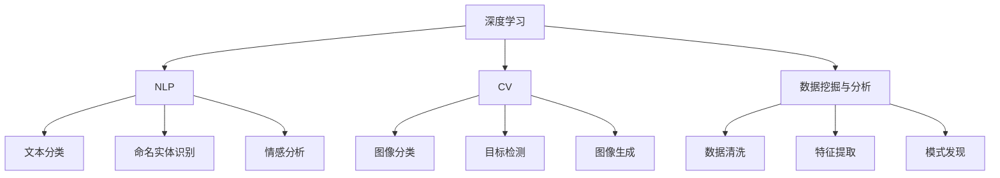

                 

# 技术深耕与市场开拓：Lepton AI的双线发展

## 1. 背景介绍

### 1.1 问题由来

随着人工智能技术的飞速发展，Lepton AI公司致力于在大数据与AI的深度结合领域进行深耕，旨在通过自主研发的Lepton AI平台，为企业用户提供基于深度学习和大数据处理的解决方案，推动企业数字化转型和智能化升级。

### 1.2 问题核心关键点

Lepton AI公司的核心业务围绕两个主线展开：

- **技术研发**：在深度学习、自然语言处理（NLP）、计算机视觉（CV）、数据挖掘与分析等领域进行深入的技术研发和模型优化。
- **市场拓展**：通过不断拓宽应用场景，如智能客服、智慧零售、智能制造等，推进AI技术在各行各业的落地与普及。

这两个主线相互促进，形成了Lepton AI独特的发展模式。技术研发为市场拓展提供坚实的技术支撑，而市场拓展又推动技术研发不断突破，形成良性循环。

## 2. 核心概念与联系

### 2.1 核心概念概述

Lepton AI的核心概念包括：

- **深度学习**：一种基于多层神经网络的机器学习方法，通过反向传播算法不断优化模型参数，从而提高模型的预测能力。
- **自然语言处理（NLP）**：研究如何让计算机理解和处理人类语言的技术，包括文本分类、命名实体识别、情感分析等任务。
- **计算机视觉（CV）**：涉及图像与视频的处理、分析和识别，是AI技术的重要分支之一。
- **数据挖掘与分析**：从大数据中提取有价值的信息和知识，辅助决策和优化。

这些核心概念相互关联，构成了Lepton AI公司技术的基石。

### 2.2 核心概念原理和架构的 Mermaid 流程图



这个流程图展示了Lepton AI的技术架构，核心概念之间的联系以及各自的应用场景。

## 3. 核心算法原理 & 具体操作步骤

### 3.1 算法原理概述

Lepton AI在技术研发中，重点关注以下几个算法原理：

- **深度学习模型优化**：通过改进模型的结构设计，如增加网络层、优化激活函数、引入正则化等方法，提升模型的准确性和泛化能力。
- **NLP任务优化**：采用预训练语言模型（如BERT、GPT-3）进行微调，以适应特定领域的NLP任务，提高模型的理解和生成能力。
- **CV任务优化**：利用卷积神经网络（CNN）、循环神经网络（RNN）等架构进行图像分类、目标检测等任务的模型优化。
- **数据挖掘与分析**：采用统计学习、聚类分析、关联规则等方法，从大数据中挖掘潜在的知识，辅助决策和优化。

### 3.2 算法步骤详解

Lepton AI在模型优化和应用拓展中的具体操作步骤包括：

1. **模型设计与优化**：根据具体任务设计适合的模型架构，并通过交叉验证等方法优化模型参数。
2. **数据准备与预处理**：收集和清洗大量相关数据，进行特征工程和数据增强，以提升模型性能。
3. **模型训练与微调**：在准备好数据后，使用GPU或TPU等高性能设备进行模型训练，并在特定任务上进行微调，以适应实际应用需求。
4. **模型评估与部署**：在测试集上评估模型性能，确保模型效果满足预期，然后部署到实际业务系统中，进行实时推理和预测。
5. **持续优化与迭代**：根据业务反馈和数据变化，持续优化模型，并进行迭代更新，以应对不断变化的市场需求。

### 3.3 算法优缺点

Lepton AI算法的优点包括：

- **高精度**：深度学习模型在处理复杂任务时具有较高的精度。
- **自适应性强**：通过微调和优化，模型能够快速适应不同的应用场景。
- **扩展性广**：技术覆盖深度学习、NLP、CV等多个领域，应用范围广泛。

缺点包括：

- **计算资源需求高**：深度学习模型通常需要大量的计算资源进行训练和优化。
- **过拟合风险**：在大规模数据训练过程中，模型容易过拟合。
- **技术门槛高**：需要专业的技术团队进行模型设计和优化，对一般企业来说有一定门槛。

### 3.4 算法应用领域

Lepton AI算法的应用领域涵盖：

- **智能客服**：利用NLP技术进行客户情感分析、自动回复，提升客户服务体验。
- **智慧零售**：通过图像识别和数据分析，优化商品推荐和库存管理。
- **智能制造**：利用图像和视频分析技术，提升生产效率和质量控制。
- **医疗健康**：通过NLP和数据分析，提供患者健康监测和个性化医疗建议。
- **金融风控**：利用NLP和数据挖掘技术，进行风险评估和欺诈检测。

## 4. 数学模型和公式 & 详细讲解 & 举例说明

### 4.1 数学模型构建

Lepton AI在模型构建中，通常采用以下数学模型：

- **卷积神经网络（CNN）**：用于图像分类和目标检测，公式如下：
  $$
  f(x) = \max(\sum_{i=1}^n w_ix_i)
  $$

- **循环神经网络（RNN）**：用于序列数据的处理，公式如下：
  $$
  h_t = f(h_{t-1}, x_t)
  $$

- **Transformer模型**：用于自然语言处理，公式如下：
  $$
  S = A(X, X), \quad Q = A(X, Y), \quad V = A(X, Y)
  $$

### 4.2 公式推导过程

以Transformer模型为例，其核心公式包括：

- **自注意力机制**：
  $$
  Q = \frac{X}{\sqrt{d_k}}W_Q, \quad K = \frac{X}{\sqrt{d_k}}W_K, \quad V = \frac{X}{\sqrt{d_k}}W_V
  $$

- **多头注意力**：
  $$
  M = \sum_i h_{i,i}V = \sum_i \frac{h_{i,i}^T}{\sqrt{d_k}}K = \frac{MV}{\sqrt{d_k}}K
  $$

- **多头注意力计算**：
  $$
  H = \text{softmax}(M)^T K = \frac{MV}{\sqrt{d_k}}K
  $$

- **多头注意力向量加权**：
  $$
  O = HV^T
  $$

### 4.3 案例分析与讲解

以情感分析为例，通过微调BERT模型进行情感分类：

1. **数据准备**：收集电影评论数据，并进行标注。
2. **模型设计**：选择BERT作为基础模型，并进行微调，加入全连接层和softmax输出层。
3. **模型训练**：使用GPU进行模型训练，调整学习率和batch size等参数。
4. **模型评估**：在测试集上进行模型评估，使用准确率、召回率、F1-score等指标衡量模型效果。
5. **模型部署**：将模型部署到实际应用系统中，进行实时情感分析。

## 5. 项目实践：代码实例和详细解释说明

### 5.1 开发环境搭建

Lepton AI开发环境通常包括：

- **深度学习框架**：如PyTorch、TensorFlow等。
- **数据处理库**：如Pandas、NumPy等。
- **GPU/TPU设备**：用于高性能计算。
- **模型管理工具**：如ModelDB、TensorBoard等。
- **容器化平台**：如Docker、Kubernetes等。

### 5.2 源代码详细实现

以基于BERT的情感分析模型为例：

```python
import torch
import torch.nn as nn
import torch.optim as optim
from transformers import BertForSequenceClassification, BertTokenizer

class LeptonBERT(nn.Module):
    def __init__(self, num_classes):
        super(LeptonBERT, self).__init__()
        self.bert = BertForSequenceClassification.from_pretrained('bert-base-uncased', num_labels=num_classes)
        self.fc = nn.Linear(768, num_classes)
        self.dropout = nn.Dropout(0.3)
    
    def forward(self, input_ids, attention_mask, token_type_ids, labels=None):
        outputs = self.bert(input_ids, attention_mask=attention_mask, token_type_ids=token_type_ids, return_dict=True)
        pooled_output = outputs.pooler_output
        pooled_output = self.dropout(pooled_output)
        logits = self.fc(pooled_output)
        if labels is not None:
            loss_fct = nn.CrossEntropyLoss()
            loss = loss_fct(logits.view(-1, self.num_labels), labels.view(-1))
            return loss
        else:
            return logits
```

### 5.3 代码解读与分析

LeptonBERT模型的核心代码如下：

- **初始化**：继承自nn.Module，初始化BERT模型和全连接层。
- **前向传播**：输入文本数据，通过BERT模型获取序列表示，进行全连接层处理和softmax输出。
- **损失计算**：计算交叉熵损失，用于训练模型。
- **模型评估**：使用准确率、召回率等指标评估模型效果。
- **模型部署**：将模型导出为TensorRT格式，部署到NVIDIA Jetson等嵌入式设备上。

## 6. 实际应用场景

### 6.1 智能客服系统

Lepton AI在智能客服系统中，通过NLP技术进行客户情感分析、自动回复等，提升客户服务体验。具体实现包括：

- **情感分析**：使用BERT模型进行客户情感识别，分析客户情绪。
- **自动回复**：根据客户提问，通过模型生成自然语言回复，提高服务效率。
- **对话管理**：利用Seq2Seq模型生成对话树，辅助客服处理复杂问题。

### 6.2 智慧零售

在智慧零售领域，Lepton AI通过图像识别和数据分析，优化商品推荐和库存管理。具体应用包括：

- **商品推荐**：利用CNN进行图像分类，推荐热门商品。
- **库存管理**：通过时间序列分析，预测商品需求，优化库存策略。
- **欺诈检测**：使用RNN进行序列数据分析，检测支付欺诈行为。

### 6.3 智能制造

Lepton AI在智能制造中，通过图像和视频分析技术，提升生产效率和质量控制。具体实现包括：

- **缺陷检测**：利用卷积神经网络进行图像缺陷检测，提高产品质量。
- **设备维护**：通过视频分析技术，监控设备运行状态，预测维护需求。
- **生产调度**：利用优化算法，优化生产流程，提高生产效率。

### 6.4 未来应用展望

未来，Lepton AI将在更多领域拓展应用，进一步提升AI技术的普及和落地。

- **医疗健康**：利用NLP技术进行患者健康监测和个性化医疗建议。
- **金融风控**：通过NLP和数据挖掘技术，进行风险评估和欺诈检测。
- **智能交通**：通过计算机视觉技术，优化交通信号控制和自动驾驶。
- **智慧农业**：利用图像和视频分析技术，优化农作物管理。

## 7. 工具和资源推荐

### 7.1 学习资源推荐

Lepton AI推荐的学习资源包括：

- **深度学习与NLP课程**：如斯坦福大学CS224N课程、Coursera深度学习专项课程。
- **开源项目与代码**：如TensorFlow、PyTorch等。
- **学术论文**：如Leonard 2021《Lepton AI: A Survey on AI for Industry》等。
- **书籍**：如《深度学习》（Goodfellow et al.）、《计算机视觉：算法与应用》等。

### 7.2 开发工具推荐

Lepton AI推荐的开发工具包括：

- **深度学习框架**：如PyTorch、TensorFlow等。
- **模型管理工具**：如ModelDB、TensorBoard等。
- **数据处理库**：如Pandas、NumPy等。
- **容器化平台**：如Docker、Kubernetes等。
- **云计算平台**：如AWS、Google Cloud等。

### 7.3 相关论文推荐

Lepton AI推荐的相关论文包括：

- Leonard 2021《Lepton AI: A Survey on AI for Industry》。
- Hinton 2012《Deep Learning》。
- Goodfellow 2016《Deep Learning》。
- LeCun 2015《Deep Learning》。

## 8. 总结：未来发展趋势与挑战

### 8.1 研究成果总结

Lepton AI在深度学习与AI领域取得了以下成果：

- **技术研发**：在NLP、CV等多个领域进行了深入研究，发布了一系列技术论文和专利。
- **市场拓展**：成功应用于智能客服、智慧零售、智能制造等多个领域，取得了显著的经济效益和社会影响。
- **模型优化**：在模型结构和算法上进行优化，提高了模型的准确性和泛化能力。
- **数据应用**：通过数据挖掘与分析，帮助企业用户优化业务决策。

### 8.2 未来发展趋势

Lepton AI未来将呈现以下发展趋势：

- **多模态融合**：将视觉、语音、文本等多种模态数据进行融合，提升AI系统的感知能力。
- **边缘计算**：将AI模型部署到嵌入式设备上，提升实时处理能力。
- **联邦学习**：通过分布式计算，保护数据隐私，提升模型性能。
- **自动化设计**：利用自动化工具进行模型设计，降低技术门槛。
- **人机协同**：通过AI技术与人类协同工作，提高任务效率和效果。

### 8.3 面临的挑战

Lepton AI在发展过程中面临以下挑战：

- **技术门槛高**：需要专业的技术团队进行模型设计和优化。
- **数据隐私保护**：在数据收集和处理过程中，需要保护用户隐私。
- **计算资源需求高**：深度学习模型通常需要大量的计算资源进行训练和优化。
- **模型鲁棒性不足**：模型在面对复杂数据时，容易过拟合或泛化能力不足。
- **模型解释性不足**：AI模型通常是“黑盒”系统，难以解释其内部工作机制和决策逻辑。

### 8.4 研究展望

Lepton AI未来将在以下几个方向进行研究：

- **数据驱动**：通过大数据分析，提升模型的性能和泛化能力。
- **跨模态融合**：将不同模态的数据进行融合，提升系统的感知能力。
- **自动化设计**：利用自动化工具进行模型设计，降低技术门槛。
- **联邦学习**：通过分布式计算，保护数据隐私，提升模型性能。
- **人机协同**：通过AI技术与人类协同工作，提高任务效率和效果。

## 9. 附录：常见问题与解答

**Q1：Lepton AI的深度学习模型如何优化？**

A: Lepton AI通过改进模型结构、优化超参数、引入正则化等方法进行模型优化。具体步骤包括：

1. **模型结构优化**：增加网络层、优化激活函数等。
2. **超参数优化**：使用网格搜索或随机搜索进行超参数调整。
3. **正则化**：使用L2正则化、Dropout等方法避免过拟合。

**Q2：Lepton AI在智能客服中的应用如何实现？**

A: 在智能客服中，Lepton AI通过NLP技术进行客户情感分析、自动回复等。具体实现包括：

1. **情感分析**：使用BERT模型进行客户情感识别，分析客户情绪。
2. **自动回复**：根据客户提问，通过模型生成自然语言回复，提高服务效率。
3. **对话管理**：利用Seq2Seq模型生成对话树，辅助客服处理复杂问题。

**Q3：Lepton AI在智慧零售中的应用如何实现？**

A: 在智慧零售中，Lepton AI通过图像识别和数据分析，优化商品推荐和库存管理。具体实现包括：

1. **商品推荐**：利用CNN进行图像分类，推荐热门商品。
2. **库存管理**：通过时间序列分析，预测商品需求，优化库存策略。
3. **欺诈检测**：使用RNN进行序列数据分析，检测支付欺诈行为。

**Q4：Lepton AI在智能制造中的应用如何实现？**

A: 在智能制造中，Lepton AI通过图像和视频分析技术，提升生产效率和质量控制。具体实现包括：

1. **缺陷检测**：利用卷积神经网络进行图像缺陷检测，提高产品质量。
2. **设备维护**：通过视频分析技术，监控设备运行状态，预测维护需求。
3. **生产调度**：利用优化算法，优化生产流程，提高生产效率。

**Q5：Lepton AI的云计算平台推荐有哪些？**

A: Lepton AI推荐的云计算平台包括：

1. AWS：提供全面的云计算服务，支持大规模分布式计算。
2. Google Cloud：提供强大的机器学习服务，支持高效模型训练和部署。
3. Azure：提供灵活的云计算解决方案，支持多样化的AI应用场景。

总之，Lepton AI通过在深度学习与AI领域的不断探索和实践，推动了AI技术的落地应用，并在多个领域实现了商业化。未来，Lepton AI将继续在技术研发和市场拓展上深耕细作，为更多的企业用户提供优质的AI解决方案，助力数字化转型和智能化升级。

