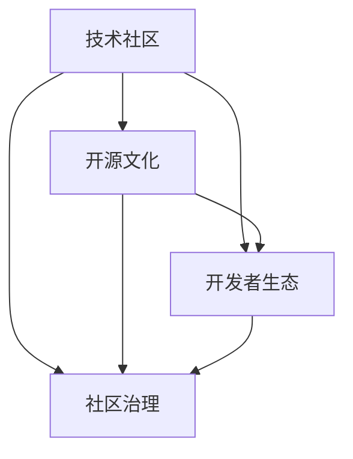

                 

# 技术社区建设：从本地群组到全球性组织

## 1. 背景介绍

在科技飞速发展的今天，技术社区已经成为推动技术进步和产业创新不可或缺的力量。它不仅为技术人员提供了一个分享、学习和交流的平台，更成为了连接企业和用户、促进技术商业化应用的重要桥梁。本节将首先回顾技术社区的兴起历程，并分析其在现代科技发展中的重要地位和作用。

### 1.1 技术社区的兴起历程

早在互联网时代初期，技术社区便以BBS（Bulletin Board System）论坛的形式出现。最早的BBS如Usenet和Altavista Groups，它们为技术人员提供了一个可以讨论技术话题的空间，为信息的传播和技术的交流奠定了基础。随着Web技术的兴起，技术社区逐渐从论坛走向了社交网络，如Stack Overflow、GitHub等，使得技术社区的发展更加蓬勃。

### 1.2 技术社区的重要地位

技术社区在现代科技发展中的地位举足轻重。它不仅成为了技术传播和学习的渠道，更成为了推动技术创新和商业化的重要平台。技术社区集成了大量的开源代码、论文、工具等资源，成为了技术人员获取信息、解决问题、实现项目和创新思路的宝贵资源库。

此外，技术社区还具备自我修复和自我优化的能力，能够自动筛选和聚合高质量的资源，优化社区环境，确保技术交流的高效性和针对性。这种自组织、自我管理的特质，使其在提升技术社区成员的专业能力和技术水平上发挥了关键作用。

## 2. 核心概念与联系

### 2.1 核心概念概述

在探讨技术社区的建设时，我们首先需要明确几个核心概念：

- **技术社区**：由技术人员组成的，以分享、学习和交流技术为核心活动，具有自组织性质的社群。
- **开源文化**：强调代码开放共享、透明协作和社区贡献的文化，是技术社区的重要组成部分。
- **开发者生态**：由技术社区成员、开源项目、技术工具和平台共同构成的系统化环境。
- **社区治理**：技术社区的自组织管理和自我优化机制，包括规章制度、用户行为规范和社区激励等。

通过理解这些概念，我们可以更好地把握技术社区的本质和建设方向。

### 2.2 核心概念的联系

这些核心概念之间的联系可以通过以下Mermaid流程图来展示：



这个流程图展示了技术社区中各概念之间的相互关系和作用机制：

1. **技术社区**是整个系统的核心，聚集了所有成员和资源。
2. **开源文化**和**开发者生态**是技术社区的重要组成部分，前者强调资源开放共享，后者则涵盖了所有相关的技术要素。
3. **社区治理**是技术社区的自我管理和优化机制，保障了社区的秩序和健康发展。

这些概念共同构成了技术社区的完整生态，缺一不可。

## 3. 核心算法原理 & 具体操作步骤

### 3.1 算法原理概述

技术社区的建设并非一蹴而就，而是一个渐进式的过程。其核心算法原理主要围绕以下几个方面展开：

1. **需求识别**：识别技术社区的需求和目标，包括功能需求、技术需求和社区治理需求等。
2. **资源汇聚**：汇聚各种技术资源，包括开源代码、技术论文、技术工具和开发者等。
3. **社区管理**：制定和实施社区规则，包括用户行为规范、贡献标准和激励机制等。
4. **用户互动**：促进社区成员之间的互动交流，提升社区活跃度和参与度。

### 3.2 算法步骤详解

技术社区建设的具体步骤包括：

1. **需求分析**：通过问卷调查、用户访谈等方式，分析技术社区的需求和目标。
2. **平台搭建**：选择合适的技术平台（如GitHub、Discourse等），搭建技术社区的基础设施。
3. **资源引入**：通过邀请、引入开源项目和社区成员等方式，引入资源。
4. **规则制定**：制定社区规则和用户行为规范，确保社区的秩序和健康发展。
5. **运营维护**：持续进行社区的运营维护，包括活动策划、问题解决和成员互动等。
6. **反馈迭代**：通过用户反馈和数据分析，不断优化社区的功能和运营模式。

### 3.3 算法优缺点

技术社区建设的优势在于：

1. **资源共享**：汇聚了大量的技术资源，为成员提供丰富的学习、交流和合作机会。
2. **自我优化**：通过自组织管理，社区能够自我调整和优化，确保其持续健康发展。
3. **知识共享**：社区成员之间的知识共享和协作，加速了技术传播和创新。

然而，技术社区建设也存在一些缺点：

1. **运营成本高**：社区的持续运营需要大量的人力、物力和财力投入。
2. **用户质量参差不齐**：社区成员的素质和技能水平各异，可能会影响社区的整体质量。
3. **规则执行难**：社区规则的制定和执行可能面临较大的挑战，特别是在用户规模较大的情况下。

### 3.4 算法应用领域

技术社区建设不仅可以应用于科技公司的内部技术交流，也可以扩展到更广泛的应用领域，如开源社区、教育平台、行业协会等。

## 4. 数学模型和公式 & 详细讲解 & 举例说明

### 4.1 数学模型构建

技术社区的建设可以抽象为一个数学模型，包括社区需求、资源和用户等要素。

设社区需求为 $D$，社区资源为 $R$，社区用户为 $U$，则技术社区建设的数学模型可以表示为：

$$
C = F(D, R, U)
$$

其中 $C$ 表示技术社区的整体效能，$F$ 为社区建设的函数。

### 4.2 公式推导过程

通过需求分析和资源汇聚，我们可以推导出社区建设的公式：

$$
C = D + R + U - C_{overlap} + C_{interaction}
$$

其中 $C_{overlap}$ 表示社区需求和资源之间的重叠部分，$C_{interaction}$ 表示社区用户之间的互动效果。

### 4.3 案例分析与讲解

以GitHub社区为例，其数学模型可以表示为：

$$
C = D + R + U - C_{overlap} + C_{interaction}
$$

其中 $D$ 表示技术需求，$R$ 表示开源代码和项目，$U$ 表示开发者和用户。通过GitHub，开发者可以在需求和资源之间进行高效匹配，促进技术交流和合作。

## 5. 项目实践：代码实例和详细解释说明

### 5.1 开发环境搭建

要进行技术社区的搭建，首先需要准备开发环境。以下是使用Python进行Django开发的环境配置流程：

1. 安装Anaconda：从官网下载并安装Anaconda，用于创建独立的Python环境。

2. 创建并激活虚拟环境：
```bash
conda create -n django-env python=3.8 
conda activate django-env
```

3. 安装Django：
```bash
pip install django
```

4. 安装所需的第三方库：
```bash
pip install markdown django-crispy-forms django-widget-tweaks django-compressor
```

完成上述步骤后，即可在`django-env`环境中开始技术社区的搭建。

### 5.2 源代码详细实现

下面以一个简单的技术社区平台为例，展示如何使用Django进行技术社区的搭建：

```python
# 设置Django环境
import os
os.environ.setdefault('DJANGO_SETTINGS_MODULE', 'myproject.settings')

# 加载Django环境
import django
django.setup()

# 定义用户模型
from django.contrib.auth.models import User
from django.db import models

class UserProfile(models.Model):
    user = models.OneToOneField(User, on_delete=models.CASCADE)
    bio = models.TextField()
    website = models.URLField()
    profile_picture = models.ImageField(upload_to='profile_pictures/', blank=True)

# 定义文章模型
class Article(models.Model):
    title = models.CharField(max_length=200)
    content = models.TextField()
    created_at = models.DateTimeField(auto_now_add=True)
    author = models.ForeignKey(UserProfile, on_delete=models.CASCADE)
```

### 5.3 代码解读与分析

以上代码展示了Django中用户模型和文章模型的定义，这些模型是技术社区平台的核心。

**UserProfile模型**：
- `user`字段与内置的用户模型关联，确保每个用户都有对应的用户信息。
- `bio`字段用于存储用户的个人简介，`website`字段用于存储用户的个人主页。
- `profile_picture`字段用于存储用户上传的头像图片。

**Article模型**：
- `title`和`content`字段分别用于存储文章的标题和内容。
- `created_at`字段用于记录文章创建时间。
- `author`字段与UserProfile模型关联，确保每篇文章都有明确的作者信息。

### 5.4 运行结果展示

在搭建好技术社区平台后，通过浏览器访问该平台，用户可以进行注册、登录、发表文章、浏览文章等操作。

## 6. 实际应用场景

### 6.1 企业技术交流

企业内部建立技术社区，可以增强技术交流和协作，促进知识共享和创新。通过技术社区，企业员工可以分享项目进展、讨论技术难题、进行代码评审等，有效提升团队的技术水平和项目效率。

### 6.2 开源项目维护

开源社区是技术社区的重要应用场景之一。通过社区平台，开源项目可以收集用户反馈、管理代码贡献、组织社区活动等，确保项目的持续健康发展。

### 6.3 教育培训

技术社区也可以应用于教育培训领域，提供在线学习、课程讨论、作业提交等功能，为学生和教师提供互动交流的空间，提升教学效果和学术氛围。

### 6.4 未来应用展望

未来，技术社区的应用场景将更加广泛。随着互联网技术的发展，技术社区可以覆盖更多领域，如医疗、金融、政府等。同时，社区的智能化和个性化也将成为新的发展方向，通过AI技术提供更加精准的推荐和服务。

## 7. 工具和资源推荐

### 7.1 学习资源推荐

为了帮助开发者系统掌握技术社区的建设原理和实践技巧，这里推荐一些优质的学习资源：

1. **《社区管理之道》**：详细介绍社区建设和管理的基本原则和最佳实践，适合初学者入门。
2. **《开源社区运营指南》**：涵盖开源社区运营的各个方面，包括社区治理、活动策划和社区文化建设等。
3. **GitHub官方文档**：GitHub社区的官方文档，提供了全面的开发和运营指南，是GitHub社区搭建的重要参考。
4. **Stack Overflow社区**：全球最大的技术问答社区，提供了丰富的学习和交流资源。
5. **Coursera《社区管理和建设》课程**：由知名高校和专家开设的社区管理课程，系统讲解社区建设的理论和实践。

通过对这些资源的学习实践，相信你一定能够快速掌握技术社区的建设精髓，并用于解决实际的社区问题。

### 7.2 开发工具推荐

高效的开发离不开优秀的工具支持。以下是几款用于技术社区开发常用的工具：

1. **Django**：Python的开源Web框架，支持快速迭代和扩展，适合搭建社区平台。
2. **Markdown**：轻量级的文本标记语言，方便社区文章和文档的撰写和格式化。
3. **GitHub**：全球最大的开源社区平台，提供了丰富的协作和版本控制功能。
4. **JIRA**：项目管理工具，适合社区需求管理和任务分配。
5. **Slack**：即时通讯工具，方便社区成员之间的沟通和协作。

合理利用这些工具，可以显著提升技术社区的开发效率，加快创新迭代的步伐。

### 7.3 相关论文推荐

技术社区建设的研究源于学界的持续探索。以下是几篇奠基性的相关论文，推荐阅读：

1. **《社区管理理论与实践》**：深入探讨社区管理的理论基础和实际应用，提供丰富的案例分析。
2. **《开源社区的治理与挑战》**：分析开源社区的治理机制和面临的挑战，提出有效的应对策略。
3. **《技术社区的构建与优化》**：介绍技术社区的构建原理和优化方法，提出具体的实施方案。

这些论文代表了大规模技术社区建设的研究进展，为社区建设提供了丰富的理论支持。

## 8. 总结：未来发展趋势与挑战

### 8.1 研究成果总结

本文对技术社区的建设进行了全面系统的介绍。首先阐述了技术社区的兴起历程和重要地位，明确了社区建设的需求和目标。其次，从原理到实践，详细讲解了社区建设的数学模型和核心算法原理，给出了社区搭建的完整代码实例。同时，本文还探讨了技术社区在企业技术交流、开源项目维护、教育培训等各个场景中的应用，展示了社区建设的巨大潜力。最后，本文精选了社区建设的各类学习资源和工具，力求为读者提供全方位的技术指引。

通过本文的系统梳理，可以看到，技术社区建设已经成为推动技术进步和产业创新的重要引擎。在现代科技发展中，技术社区不仅提供了技术交流和学习的环境，更成为了连接企业和用户、促进技术商业化应用的重要桥梁。未来，随着技术社区的不断发展和完善，其应用领域将更加广阔，对社会的贡献也将更加深远。

### 8.2 未来发展趋势

展望未来，技术社区的建设将呈现以下几个发展趋势：

1. **智能化和个性化**：引入AI技术，提供更加精准的用户推荐和个性化服务，提升社区的用户体验。
2. **跨领域融合**：技术社区将进一步拓展到医疗、金融、政府等更多领域，推动各领域的数字化转型。
3. **多模态交互**：引入语音、视频等多模态交互方式，丰富社区互动形式，提升互动效果。
4. **去中心化发展**：通过区块链等技术，实现社区的去中心化管理，提升社区的自治能力和抗风险能力。
5. **社区自治**：社区成员通过投票和共识机制，共同制定和执行社区规则，提升社区的自治能力和管理效率。

以上趋势凸显了技术社区建设的广阔前景。这些方向的探索发展，将进一步提升社区的智能化水平和用户满意度，为社会的数字化转型提供新的动力。

### 8.3 面临的挑战

尽管技术社区建设已经取得了显著成果，但在迈向更加智能化、普适化应用的过程中，它仍面临诸多挑战：

1. **社区维护成本高**：技术社区的持续运营需要大量的人力、物力和财力投入。
2. **用户管理困难**：社区成员的素质和行为规范的维护难度较大，可能影响社区的整体质量。
3. **规则执行难**：社区规则的制定和执行可能面临较大的挑战，特别是在用户规模较大的情况下。
4. **数据隐私和安全**：社区平台涉及大量的用户数据，如何保障数据隐私和安全，是一个重要的挑战。
5. **文化差异**：在多国多文化的背景下，社区文化和规则的统一和推广可能面临困难。

### 8.4 研究展望

面对技术社区建设所面临的种种挑战，未来的研究需要在以下几个方面寻求新的突破：

1. **智能化管理**：通过AI技术，实现社区的自动化管理和智能推荐，提升社区运营效率。
2. **跨文化融合**：引入跨文化管理和社区文化建设的方法，促进全球化社区的发展。
3. **去中心化自治**：探索去中心化的社区治理机制，提升社区的自治能力和抗风险能力。
4. **数据隐私和安全**：研究数据隐私保护和社区安全的策略，确保用户数据的安全。
5. **社区文化建设**：探索社区文化和规则的建设方法，提升社区的凝聚力和归属感。

这些研究方向的探索，将引领技术社区建设迈向更高的台阶，为构建更加智能、普适和可持续发展的社区提供新的思路和方法。

## 9. 附录：常见问题与解答

**Q1: 技术社区建设的核心目标是什么？**

A: 技术社区建设的核心目标包括：
- 促进技术交流和协作，提升技术水平。
- 汇聚资源，构建开放共享的资源库。
- 制定规则，维护社区秩序和健康发展。

**Q2: 如何确保技术社区的高质量运营？**

A: 确保技术社区高质量运营的关键在于：
- 明确社区目标和需求，制定合理的规则和标准。
- 引入AI技术，实现智能化管理和推荐。
- 持续进行社区维护和优化，及时处理问题和用户反馈。
- 引入激励机制，激发社区成员的积极性和参与度。

**Q3: 如何平衡技术社区的开放性和安全性？**

A: 平衡技术社区的开放性和安全性的方法包括：
- 制定严格的用户注册和认证机制，确保用户身份的真实性。
- 引入数据加密和访问控制技术，保护用户数据安全。
- 建立社区治理机制，及时处理违规行为和不良信息。
- 引入社区文化建设，提升用户的安全意识和责任意识。

**Q4: 技术社区在企业技术交流中的应用案例有哪些？**

A: 技术社区在企业技术交流中的应用案例包括：
- 搭建企业内部技术论坛，促进员工之间的技术交流和合作。
- 建立代码评审和问题讨论区，提高代码质量和项目效率。
- 组织技术分享会和知识竞赛，提升团队的技术水平和创新能力。

**Q5: 技术社区建设的主要挑战和应对策略有哪些？**

A: 技术社区建设的主要挑战和应对策略包括：
- 挑战：社区维护成本高、用户管理困难、规则执行难等。
- 应对策略：引入AI技术、跨文化管理和去中心化自治等。

---

作者：禅与计算机程序设计艺术 / Zen and the Art of Computer Programming

